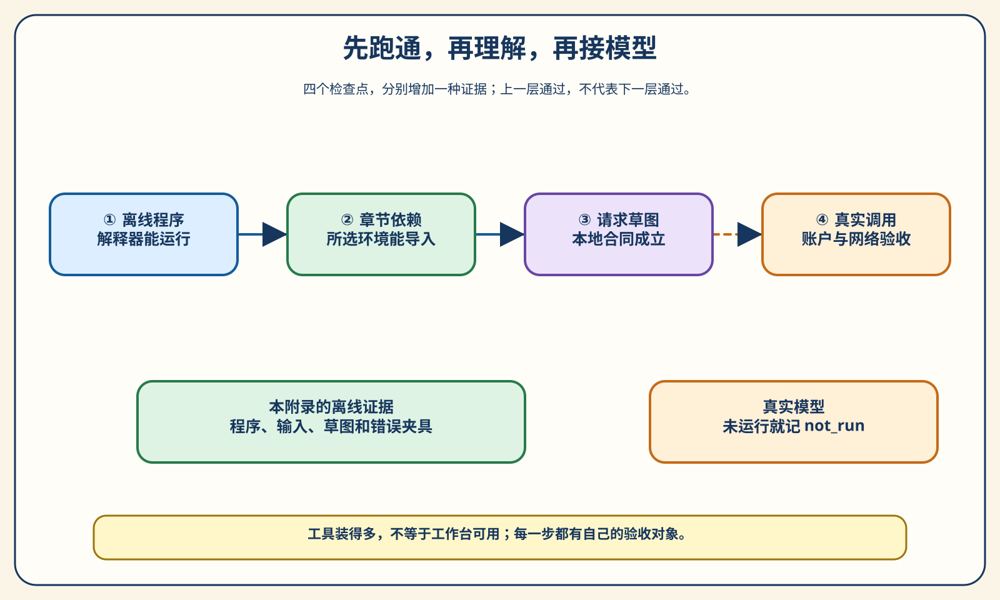
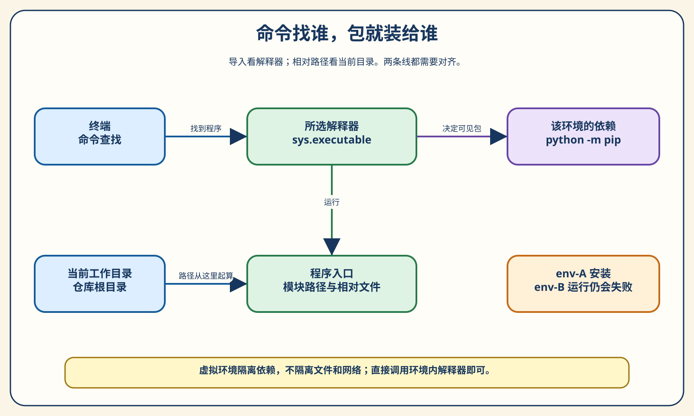
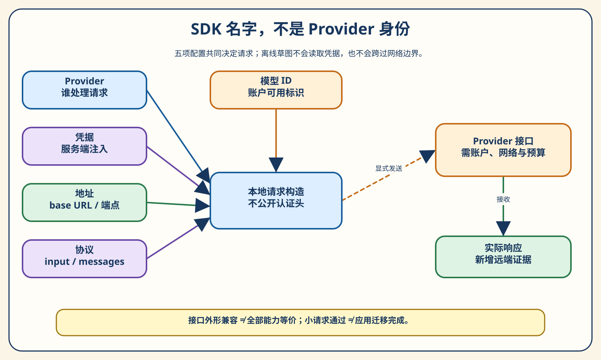
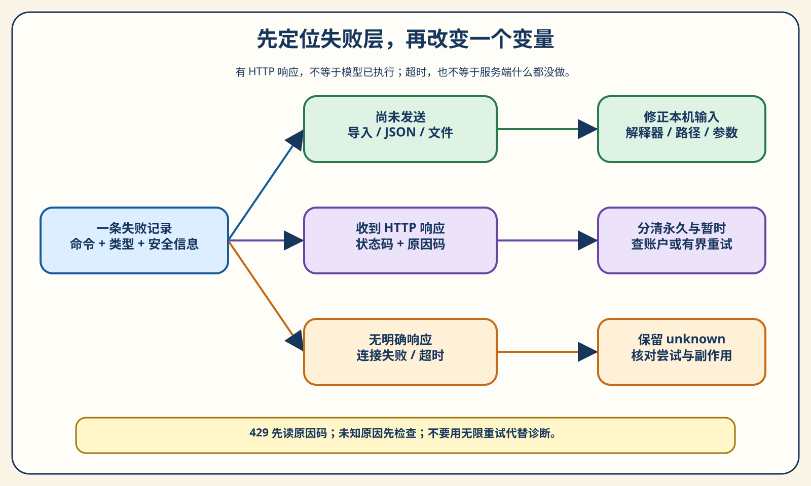

# 附录 A Python、TypeScript 与模型 API 快速准备

你复制了一段十几行的 Agent 示例。安装依赖的终端显示“成功”，运行时却出现 `ModuleNotFoundError`。换一个终端，错误不见了，又变成“找不到文件”。好不容易把程序启动起来，它打印 `dry_run`，你却不知道：这是模型真的回答了，还是程序只检查了一遍配置？

这些问题与模型是否聪明没有关系，却足以让第一次实验中断。更麻烦的是，初学者常常把它们都归为“环境没配好”，于是不断重装 Python、更新包、换模型。每次改变更多东西，反而越来越难知道问题出在哪一层。

本附录要给你一条较短、也较容易判断对错的起步路径：先让一个完全离线的程序跑起来，再看懂它怎样组织数据，最后把真实模型接进来。你不需要先掌握 Python 的全部语法，也不需要同时装好所有框架。开始阅读 Agent 的原理之前，先建立一个小而可靠的工作台。

命令以 Windows PowerShell 为例，默认从仓库根目录执行；macOS/Linux 的路径另行注明。配置示例中的占位符必须替换后才能使用。


**短答案：能运行代码、能导入依赖、能构造请求、能收到模型响应，是四个不同的检查点。** 不要把前一个检查点的通过，当作后一个检查点的证据。

## 最短起步：先看到一次有证据的完成

### 不申请密钥，也能做第一个实验

先找到克隆或解压后的 `deep-dive-ai-agent` 目录。在这个目录中，你应该同时看到 `book/`、`chapter3/` 和 `pyproject.toml`。这三个名字比某台电脑上的盘符更有用：它们告诉你当前站在工程的哪一层。

在终端中输入：

```powershell
Get-Location
Test-Path .\chapter3\agent_loop.py
Test-Path .\book\OUTLINE.md
python --version
```

前两个文件检查都应输出 `True`。本仓库支持 Python 3.11–3.13，本文命令使用 3.11。尚未安装 Python 时，可从 [Python 官方下载页](https://www.python.org/downloads/) 选择此范围内的版本，安装后重新打开终端。

接着运行：

```powershell
python -X utf8 -B chapter3/agent_loop.py
```

这个程序使用标准库，不需要 API Key，也不需要联网下载模型。它会在临时工作区创建一个有缺陷的价格解析函数：普通数字能解析，带人民币符号的字符串却失败。一个固定决策策略会依次读取文件、运行测试、提出修改、重新测试，再交给外部验证器验收。实验结束后，临时工作区会清理，不会修改你正在阅读的章节。

输出节选：

```text
[2] result: ok=False changed=False exit_code=1
[3] result: ok=True changed=True updated pricing.py
[4] result: ok=True changed=False exit_code=0
[5] verify: accepted=True rules=('tests_passed', 'protected_files_unchanged')
[run] status=completed calls=4 final='修复完成，2 项测试通过。'
```

输出依次显示原测试失败、修改后通过与验收接受。`calls=4` 表示读取、第一次测试、修改、第二次测试四次工具调用；外部验收另有事件，不算作模型提出的工具调用。

再运行配套测试：

```powershell
python -B -m unittest discover -s chapter3/tests -v
```

“2项价格测试”验收被修复的函数，“20项实验包测试”检查 Loop、工具结果和保护机制。两者检查的是不同对象。

### 离线不是缩水，而是先隔离一个问题

真实模型的选择会变化，网络会抖动，账号可能限流。如果一开始就把这些变量全部接进来，第一次失败时，你很难判断是循环实现有问题，还是请求根本没到服务端。

第3章用固定策略代替真实模型，目的就是把“模型决定什么”和“外围系统如何执行”分开。它足以帮助你理解工具调用与验收，但不能说明某个模型的真实修复能力。接入模型之前先跑通它，就像学习汽车传动时，先看齿轮如何咬合，再讨论发动机功率。



图 A-1 从左到右读。第一步证实解释器能运行程序；第二步证实所选环境能加载依赖；第三步证实本地请求结构符合我们检查的合同；第四步才涉及真实账户、网络和模型。每一步都为下一步减少干扰，但没有一步可以代替下一步。

现在你已经获得一个很具体的起点：不是“我装好了很多工具”，而是“我能运行一个离线 Agent 实验，并解释它凭什么接受完成”。接下来才需要把工作台上的几个部件认清。

## 找对环境：终端、解释器与工作目录

### 输入 python 时，你叫来的是谁

终端不是 Python。PowerShell 接到 `python` 这个名字后，会按照命令查找规则找到一个程序，再把后面的参数交给它。同一台电脑上可以同时存在多个 Python：系统安装的、某个开发工具自带的、虚拟环境里的。

因此，“我的电脑有 Python”还不够。你需要知道**本次命令实际使用哪一个解释器**。可以运行：

```powershell
Get-Command python
python -c "import sys; print(sys.executable); print(sys.version)"
python -m pip --version
```

第一条看终端找到什么；第二条让 Python 自己报告身份；第三条让这个 Python 运行它所能找到的 pip。输出的目录会因你的电脑而异，不必与作者相同。应该比较的是关系：运行程序的 Python，与安装依赖的 Python，是否属于你打算使用的同一个环境。

设想一个教学反例：你在环境 A 执行 `pip install openai`，然后在环境 B 运行 `python example.py`。A 的安装确实成功，但 B 没有那个包，所以导入仍然失败。继续在 A 重装五次不会改变 B。真正应该修正的是“安装者与运行者不是同一个解释器”，而不是包的下载次数。

这就是本书尽量使用 `python -m pip` 的原因。它把“由哪个 Python 安装”写进了命令。它仍不能自动保证你选对环境，但能减少裸 `pip` 与裸 `python` 各自命中不同程序的机会。

### 虚拟环境是依赖盒子，不是另一台电脑

虚拟环境给一个项目提供相对独立的解释器入口和包目录。例如，第9章需要的协议库与第15章使用的训练工具，未必适合混在同一个盒子里。分开后，一个章节的安装或升级不容易影响另一个章节。

但虚拟环境不是安全沙箱。它不会阻止程序读你的文件、联网或执行系统命令。它解决的是依赖组织问题，不是第12章讨论的执行隔离问题。也不要把源码放进虚拟环境目录：环境应该能重建，源码和学习笔记应该独立保留。

为了避免覆盖你已经在使用的 `.venv`，本附录用一个新的名字。在仓库根目录先确认它不存在：

```powershell
Test-Path .\.venv-appendix-a
```

如果输出 `False`，再用已确认的 Python 创建：

```powershell
python -m venv .venv-appendix-a
.\.venv-appendix-a\Scripts\python.exe --version
.\.venv-appendix-a\Scripts\python.exe -m pip --version
```

如果已有同名目录，先检查它的用途；不要用删除或清空命令“保证从头开始”。换一个未使用的名字即可。创建环境可能因本机 Python 的组件或权限失败，此时应处理该错误，不要假定环境已经可用。

你会在网上看到“先激活环境”。激活通常只是让终端优先找到这个环境中的命令。**本附录直接调用环境内的解释器，不要求激活脚本。** 这也避免了 Windows 上为运行 `Activate.ps1` 而修改全局执行策略。Python 官方文档明确说明，指定环境内解释器路径即可使用虚拟环境。[^venv]



图 A-2 上半行说明导入问题，下半行说明文件路径问题。两条线最后在程序入口处汇合。只看终端窗口的标题，无法判断这两条线是否对齐。

### 工作目录和代码所在目录不是同一回事

另一个常见错误是：代码文件明明存在，程序却说找不到。原因往往不是文件丢了，而是相对路径从不同位置开始计算。

例如，在仓库根目录执行 `python chapter3/agent_loop.py`，当前工作目录仍是仓库根目录，不会因为脚本位于 `chapter3/` 就自动切进去。相反，执行 `Set-Location chapter3` 后，`chapter3/agent_loop.py` 这个相对路径会重复进入一层目录。

看到“找不到文件”时，先做两个检查：当前目录是什么，命令中的相对路径从这里能否找到目标。不要先改源码里的路径，更不要写死作者的电脑目录。本附录所有模块式入口，都约定从仓库根目录运行。

跨平台时，主要变化是环境内解释器的位置：

| 目的 | Windows PowerShell | macOS/Linux |
| --- | --- | --- |
| 查看当前目录 | `Get-Location` | `pwd` |
| 创建新的虚拟环境 | `python -m venv .venv-appendix-a` | `python3 -m venv .venv-appendix-a` |
| 明确使用环境内解释器 | `.\.venv-appendix-a\Scripts\python.exe` | `./.venv-appendix-a/bin/python` |
| 通过该解释器安装包 | 上述解释器后接 `-m pip install ...` | 上述解释器后接 `-m pip install ...` |

这里的 `python` 或 `python3` 都是你需要先确认的命令名，不是操作系统自动保证正确的版本。Windows 如果已经安装 Python Launcher，也可以用 `py -3.11 --version` 检查，再用同一入口创建环境；没有 `py` 的电脑不必为这一条命令另外安装工具。

## Python 够用基础：读懂数据怎样流过程序

### 函数：给一段操作一个清晰入口

本书的代码虽然会出现框架和协议，但许多关键动作最后仍然是函数：读取文件、检查参数、运行测试、返回观察。先看一个不涉及模型的例子：

```python
def remaining_steps(limit: int, used: int) -> int:
    return max(0, limit - used)

print(remaining_steps(5, 2))
```

输出为 `3`。`limit` 与 `used` 是输入，`return` 是返回给调用者的结果。理解一个函数时，先问它收什么、返回什么、是否改变外部状态。不要只根据名字猜作用：叫 `check` 的函数可能写日志，叫 `run` 的函数可能启动子进程。

上面函数只有计算，没有文件或网络副作用。第3章的 `apply_patch` 就不同，它会改变临时文件。这个区别会影响测试、重试和恢复。学习语法时顺手建立“纯计算还是有副作用”的意识，后面读 Harness 会容易很多。

### 字典：名字和数值放在一起，才有可解释的状态

如果一个工具只返回 `True`，你知道它成功了，却不知道成功意味着什么。用字典把信息组织起来，调用者就能区分结果与原因：

```python
result = {
    "ok": False,
    "error_type": "not_found",
    "path": "notes.md",
}

print(result["ok"])
print(result["error_type"])
```

输出分别为 `False` 和 `not_found`。`result["ok"]` 表示按键名取值，不是让模型阅读自然语言后猜测。键名不存在时会出现 `KeyError`；使用 `result.get("error_type")` 则允许缺项，并在没有该键时返回 `None`。

哪种方式更好，取决于合同。如果 `ok` 是必需字段，悄悄用默认值掩盖缺项，可能让坏数据继续流动。如果错误类型本来只在失败时出现，允许它为空就合理。**数据结构不是字段越多越专业，而是让下一步知道自己可以依赖哪些信息。**

列表负责保存一组有顺序的项目。例如工具调用历史是一个列表，每次新的观察追加到末尾。字典负责一条记录内各个字段的含义。先理解这两个容器，你已经能看懂本书相当多的 Trace 与报告。

### 类型标注：说明意图，但不是运行时门禁

`limit: int` 和 `-> int` 是类型标注，它们告诉读者和检查工具：这个位置预期是什么类型。Python 不会仅因为写了 `int`，就在调用时替你完成所有验证。

比如下面这个函数：

```python
def next_step(used: int) -> int:
    return used + 1

next_step("2")
```

它失败不是因为标注主动拦截了字符串，而是执行字符串加整数时触发了 `TypeError`。有些类型错误不会立即抛异常，反而产生表面合理的结果，所以不能用“没有报错”证明输入符合合同。

在 Agent 中，工具参数常来自模型输出或外部文档，不能假定它们天然可信。必须在行动之前检查。配套函数 `parse_task` 就要求目标是非空字符串，步数是1至10的整数。这里刻意使用 `type(value) is int`：Python 中 `bool` 是 `int` 的子类，只用 `isinstance(value, int)` 会把 `True` 当成1接受。这是本附录的教学合同，不是所有业务都必须采用同样的范围。

先有这层边界，再学习 dataclass、Pydantic 或 JSON Schema，才容易明白它们解决的到底是什么问题：不是让字段变得漂亮，而是把“允许的数据”与“无法解释的数据”分开。

### JSON：跨程序传递的是文本，不是 Python 对象

字典存在于当前 Python 进程里。要写入报告、发送给服务端，或交给另一个程序，通常需要把它转换成可传输的格式。JSON 就是本书最常用的格式之一。

请把下面两个方向分别记住：

```python
import json

task = {"goal": "检查链接", "max_steps": 3}
text = json.dumps(task, ensure_ascii=False)
restored = json.loads(text)

print(type(text).__name__)
print(type(restored).__name__)
print(restored["max_steps"])
```

输出依次是 `str`、`dict` 和 `3`。`dumps` 把对象序列化为字符串，`loads` 把字符串解析回对象。把 `text` 直接当作字典使用，就把两个阶段混在一起了。

JSON 的 `true`、`false`、`null`，解析后分别成为 Python 的 `True`、`False`、`None`。字符串要使用双引号。Python 控制台里能显示一个对象，不代表那个显示结果就是合法 JSON。尤其不能用 `eval` 代替 JSON 解析：那会把数据当代码执行，给本来只是“读一段参数”的动作增加不必要的风险。具体转换规则见 [Python JSON 文档](https://docs.python.org/3.11/library/json.html)。

还有一个更容易漏掉的边界：**JSON 能解析，不代表业务字段正确。** `{"max_steps":"3"}` 是合法 JSON，但其中步数是字符串；`[]` 也是合法 JSON，却不是我们约定的任务对象。解析器回答“文本是否符合 JSON 语法”，验证器回答“数据是否符合这个任务的合同”。

> **实验 A-1 ★：看清对象、文本与参数验证。** 运行附录 Python 组，观察一个正常任务和三种错误输入。所有输入都是固定夹具，不读取文件或模型回复。

```powershell
python -X utf8 -B -m appendix_a.preparation --group python
```

在输出中找到这些字段：

```json
{
  "decoded_type": "dict",
  "rejected": ["invalid_budget", "invalid_budget", "invalid_fields"],
  "task": {"goal": "检查链接", "max_steps": 3}
}
```

被拒绝的输入依次是布尔步数、字符串步数、顶层列表，没有触发文件写入，也没有被隐式转换。`appendix_a/preparation.py` 的 `parse_task` 依次执行解析、字段检查、目标检查和预算检查。

### 异步：函数写了 async，不等于已经得到结果

模型请求和工具执行常常需要等待。程序如果在等待期间还能处理其他工作，就可以减少空等。这是你在后续代码中经常看到 `async` 与 `await` 的原因。

先看最小的离线例子：

```python
import asyncio

async def observe() -> dict:
    await asyncio.sleep(0)
    return {"ok": True, "source": "fixture"}

print(asyncio.run(observe()))
```

这里没有真实网络。`sleep(0)` 只是把控制权交回事件循环，随后返回固定观察。调用异步函数得到的是一个待运行的协程对象；通过 `await`，或在这个普通脚本的入口使用 `asyncio.run`，才会驱动它执行并取得结果。Python 官方文档用相同的“协程需要被等待或调度”边界解释异步入口。[^asyncio]

可以把它理解为一张“待执行的工单”：创建工单不等于工单完成。`await` 也不是“自动并行全部事情”。你在一个循环里逐次等待，工作仍可能按顺序发生。要并发运行独立操作，需要另行设计调度、资源上限和结果汇合。

异步运行应区分任务创建、开始执行与取得结果。取消、共享预算和迟到结果见第 18 章；多个 `async` 函数并不等于多个 Agent。

在 Jupyter 或已经启动事件循环的框架中，通常应直接 `await`，而不是再嵌套 `asyncio.run`。本文命令面向普通终端脚本，避免把不同运行容器的入口混用。如果看到“事件循环已经运行”，先确认你在哪种容器里，不必重写全部异步代码。

## 按章安装依赖：每次只增加必要的变量

### 标准库、第三方包与本地模块

`json`、`pathlib`、`asyncio`、`unittest` 都属于本附录使用的标准库。Python 安装可用后，就可以导入它们。`openai`、`markdown`、`pytest` 则是第三方包：某个环境里没有安装，就不能假定能导入。

还有第三种东西：本地代码。`appendix_a.preparation` 是仓库中的模块，不是一个需要从包仓库下载的名字。从仓库根目录使用 `python -m appendix_a.preparation`，Python 才能按照这个包路径找到入口。本地代码导入失败时，先检查工作目录和入口方式，不要直接尝试 `pip install appendix_a`。

你可以用下面的表判断该找哪一层：

| 导入对象 | 本附录中的例子 | 首先检查什么 |
| --- | --- | --- |
| 标准库 | `json`、`unittest` | Python 安装是否正常，是否被同名本地文件遮蔽 |
| 第三方包 | `openai`、`markdown` | 运行解释器对应的包目录是否安装了依赖 |
| 本地模块 | `appendix_a.preparation` | 仓库根目录、包结构、模块式入口 |
| 可执行工具 | `node`、`npm` | 终端是否能找到命令，以及实际命中的版本 |

“同名遮蔽”是一个小而真实的陷阱：如果你把笔记脚本命名为 `json.py`，某些入口下 Python 可能先找到这个文件，而不是你想使用的标准库。错误看起来像库坏了，实际是名字撞车。先检查导入对象的来源，通常比更新全部依赖更有帮助。

### requirements 文件负责什么，不负责什么

本书实验包各自有运行说明。第3章和本附录的核心练习只用标准库；需要额外依赖的章节，在该章节的说明中给出安装入口。不要因为根目录也有 `pyproject.toml`，就认为一次根目录安装会包含所有章节依赖。当前根项目的依赖列表为空，这个事实可以直接在文件中核对。

准备运行一个有依赖的章节时，先阅读该章 README，再用目标环境的解释器安装它要求的文件。例如，第13章有独立的依赖说明；命令写法是：

```powershell
# 先创建并确认自己的第13章环境；这里不是本附录的必做步骤。
.\.venv-chapter13\Scripts\python.exe -m pip install --require-hashes -r chapter13/requirements-dev.txt
```

这条命令使用第13章的测试依赖锁文件，要求虚拟环境已经存在。安装会下载包并改变环境，不是只读检查；章节运行时只用标准库，测试才需要这些依赖。

版本约束有强弱之分。`package>=1.0` 允许较多版本，`package==1.2.3` 把版本收窄到一个具体值；包含间接依赖和哈希的锁定方案还会进一步收敛安装结果。但“锁了版本”不等于“任何操作系统都可复现”：解释器版本、原生扩展、系统库、硬件和可用安装源也会产生影响。

因此报告里应同时保留依赖说明与实际验证环境，而不是只留一句“安装最新版本即可”。对于第一次学习，更好的顺序是先复现书中验证过的组合，再单独尝试升级，并记录差异。[Python Packaging 指南](https://packaging.python.org/en/latest/tutorials/installing-packages/)提供了解释器与安装工具对应的基本方法；本书的章节 README 才是该章的实际安装依据。

### 安装完成之后，要检查的是导入

安装命令输出成功，只说明那个安装动作完成了。接着用将要运行代码的同一个解释器，做一个小导入检查。例如在自行准备好的 API 示例环境中：

```powershell
.\.venv-api-example\Scripts\python.exe -m pip --version
.\.venv-api-example\Scripts\python.exe -c "import openai; print(openai.__version__)"
```

两条命令用相同的解释器前缀，减少歧义。若第二条失败，先比较 pip 所在位置与解释器身份，不要马上换 Provider。此时错误发生在本机导入阶段，请求还没有构造，更没有到达模型服务。

不同章节使用不同依赖，部分旧测试在根目录同时收集时存在命名冲突。环境自检应使用目标章节的测试入口，不能由单章通过推断全书实验全部通过。

## TypeScript 快速准备：看懂，不必立刻换一套主语言

### Node.js 负责运行，npm 负责项目依赖

Python 是本书实验的主要语言，但网页界面、部分工具服务和官方 SDK 示例常使用 JavaScript 或 TypeScript。你的目标不必是立即熟练掌握另一门语言，而是能看懂几个对应关系。

`node` 运行 JavaScript；`npm` 管理 Node 项目的依赖与脚本；TypeScript 在 JavaScript 的基础上增加类型表达。先检查已有环境：

```powershell
node --version
npm --version
```

运行 Python 实验不需要 Node；本节只介绍 TypeScript 示例所需的环境，不需要安装前端框架或容器。

`book/package.json` 用于书稿渲染；两个 `.ts` 文件仅作语言对照，不构成 TypeScript Agent 应用。

### 同一个小任务，换一种类型写法

打开 `appendix_a/examples/task.ts`：

```typescript
type Task = { goal: string; maxSteps: number };

function describe(task: Task): string {
  return task.goal + "，最多 " + task.maxSteps + " 步";
}

const task: Task = { goal: "检查链接", maxSteps: 3 };
console.log(describe(task));
```

`type Task` 描述任务对象的形状；`const` 声明绑定；花括号中的字段与 Python 字典在阅读上很接近，但它们不是完全相同的语言机制。先看数据如何进入 `describe`，再看返回字符串，而不是逐个背关键字。

对于本例这种只包含可擦除类型语法的代码，Node 22.18.0及以后的对应版本可以直接运行：

```powershell
node appendix_a/examples/task.ts
```

输出：

```text
检查链接，最多 3 步
```

这是一条小入口，不是“所有 TypeScript 项目都能直接用 Node 运行”。包含需要生成运行时代码的语法、特殊路径解析或构建配置的项目，可能仍需要编译器或 runner。应以该项目已有脚本为准。[^node-ts]

### 运行成功，不等于类型检查通过

现在看第二个文件 `unchecked.ts`。它故意把字符串放进数字类型的位置：

```typescript
const maxSteps: number = "3";
console.log(maxSteps + 1);
```

执行：

```powershell
node appendix_a/examples/unchecked.ts
```

实际输出是 `31`，不是 `4`。Node 擦掉类型标注后，执行的是字符串与数字相加的 JavaScript 语义；它没有在这里帮你做 TypeScript 静态检查。这个反例比一句“类型很重要”更容易让人记住边界。

若你已有本地 TypeScript 编译器，可以在仓库根目录检查：

```powershell
tsc --strict --noEmit appendix_a/examples/unchecked.ts
```

编译器应指出字符串不能赋给数字类型。类型检查是可选步骤；正常示例的配置见 `tsconfig.json`，已有编译器时可运行 `tsc -p appendix_a/examples/tsconfig.json`。

也不建议不加区分地执行网上的 `npx tsc`：如果本地没有相应包，它可能触发下载，并增加新的环境变量。先确认项目是否已有编译器与锁文件。**运行时验证与静态检查相互补充，都不能代替对外部输入的检查。**

### package.json 与锁文件，不是“再安装一遍”的理由

`package.json` 描述项目依赖和脚本，锁文件记录更具体的依赖解析结果。在有一致锁文件的 Node 项目里，`npm ci` 用于按锁文件进行干净安装；它要求已有锁文件，遇到不一致时会失败，而不是自动修锁。尤其要注意：它会先移除已有 `node_modules`，再安装依赖。[^npm-ci]

所以 `npm ci` 不是无副作用的检查命令。只是阅读本附录，不需要在 `book/` 运行它。若以后确实要渲染书稿，应先阅读该渲染项目的说明，确认现有目录和锁文件，再决定是否安装。不要把 Python 的章节目录、Node 项目的目录和仓库根目录混着使用。

## 模型 API：把五个配置项一一对齐

### 先分清产品登录与开发者接口

在聊天产品中能使用一个模型，并不自动意味着你的 Python 进程已经有权调用它的 API。产品登录、开发者凭据、模型标识、网络出口和费用归属，是需要分别确认的事项。也不要把“工具已经登录”直接等同于“这个终端能读取该工具内部凭据”。

本附录不读取聊天产品的登录文件，也不借用其私有配置。读者若希望运行真实 API 示例，应通过对应官方平台获得自己的开发者凭据，并确认账户授权和预算。对已有工作密钥，不要为了试验重复粘贴到聊天、截图或公开问题单里。

学习 API 时，先选一个低风险输入，例如“用一句话解释工具调用”。不上传公司代码、内部知识库或线上故障日志。能接通接口只是连通性验证，并没有证明服务适合处理某类敏感数据；那需要组织的数据政策、合同与安全评估。

### Provider、密钥、地址、协议与模型名

每次准备请求时，至少把五个东西放在同一张纸上：

| 配置项 | 它回答的问题 | 常见混淆 |
| --- | --- | --- |
| Provider | 请求最终由哪家服务处理 | 使用某家 SDK，不等于请求发给该家 |
| 凭据 | 谁被允许调用、用哪个账户 | 有环境变量名，不等于有有效凭据 |
| 地址 | 请求送到哪个服务入口 | 把完整端点当 SDK 的 base URL |
| 协议 | 请求体和返回体怎样组织 | 把 `input` 与 `messages` 任意交换 |
| 模型标识 | 在该服务中请求哪个模型 | 把产品展示名当成 API 模型 ID |

OpenAI 的 Responses 示例使用 `client.responses.create`，常见输入字段是 `input`；Chat Completions 示例使用 `client.chat.completions.create`，输入通常组织成 `messages`。这不是哪个名字“更高级”，而是两套接口合同。调用哪个方法，就要按那个方法的合同构造数据。[OpenAI Quickstart](https://developers.openai.com/api/docs/quickstart#install-the-openai-sdk-and-run-an-api-call)是本附录所用最小 SDK 示例的依据。

DeepSeek 的 OpenAI 兼容入口，官方给出的 base URL 是 `https://api.deepseek.com`；Anthropic 兼容入口是 `https://api.deepseek.com/anthropic`。截至2026年10月3日核对，官方也提供 Responses 接口。**“用了 OpenAI SDK”只说明客户端形式，不说明底层 Provider 是 OpenAI。**[^deepseek]

Anthropic 原生 Messages API 则是另一条路线，例如 `POST /v1/messages`，包括模型、消息和输出上限等字段。其原生接口文档说明了凭据与 `anthropic-version` 请求头要求；SDK通常处理相关头信息。本文不把“必须永远只能用 x-api-key”写成绝对规则，也不把云平台上的认证方式与原生 API 混为一谈。[^anthropic]



读图 A-3 时，先看五项配置进入请求构造，再看请求跨过服务端边界。离线草图停在边界左侧；实际 HTTP 响应才是右侧的新证据。密钥不进入公开报告，程序也不应把认证头作为调试输出。

### 先构造草图，暂不发送

> **实验 A-2 ★★：对比四条请求路线。** 运行 API 组，看同一句中文输入怎样进入 Responses、Chat Completions 和原生 Messages。这个入口没有发送功能，不需要密钥。

```powershell
python -X utf8 -B -m appendix_a.preparation --group api
```

正常输出会包含四个请求草图。OpenAI Responses 草图的关键部分是：

```json
{
  "endpoint": "https://api.openai.com/v1/responses",
  "key_variable": "OPENAI_API_KEY",
  "body": {"model": "reader-model", "input": "你好"},
  "network_access": false,
  "provider_status": "not_run"
}
```

`reader-model` 是有意使用的教学占位符，不是真实可用的模型名。因为没有发出请求，它不会导致远端“模型不存在”，但如果你把它照抄进真实调用，就很可能失败。模型 ID 应从当前 Provider 文档和自己账户的可用模型中确认，而不是根据这份离线输出推断。

再比较 DeepSeek Chat 草图：

```json
{
  "endpoint": "https://api.deepseek.com/chat/completions",
  "body": {
    "model": "reader-model",
    "messages": [{"role": "user", "content": "你好"}]
  }
}
```

两份草图里地址与输入字段都不同。这里的 `endpoint` 是完整端点；真实 SDK 示例中给的 `base_url` 则是服务入口，SDK会按所调用的方法拼接路径。不要把 `/chat/completions` 再写进本来要求 base URL 的位置，造成重复拼接。

`key_variable` 也只是凭据变量的名字，并没有读取变量值。草图不包含认证头，避免读者误把调试输出当作可以公开的真实 HTTP 请求。本地构造成功，只说明附录代码按指定教学路线生成了这些字段，不是远端兼容性测试。

### 为什么不能只换 base URL 就宣称迁移完成

假设一个应用用到了会话保存、后台任务或内置工具。现在你改了服务地址，同一句简单问候能正常返回。能否据此宣布“两个服务完全兼容”？

不能。简单问候只覆盖了一个很小的接口切片。支持相同请求外形，不代表所有参数、工具、状态和返回字段都有相同语义。当前 DeepSeek Responses 文档就单独列出兼容详情，部分参数不支持或被忽略；它的无状态边界也不能拿来替代 OpenAI 的会话能力。[^responses-compat]

迁移时应挑出应用真正依赖的能力，逐个写小合同测试：普通文本、工具参数、错误返回、流式结束、需要保存的状态。对于忽略的参数，“没有400错误”不是功能生效的证据。第一步跑通最小请求，第二步证明实际所需能力，不能颠倒顺序。

这也是附录没有维护一张“所有厂商、所有模型、所有参数”的大全表的原因。那些细节变化很快，读者真正需要掌握的是验证方法。来源台账会记录核对日期，真实项目则应冻结自己的模型配置和适配器测试。

### 密钥只在需要发送的进程里出现

Python 中读取环境变量很简单：

```python
import os

# 配置示意：不打印凭据值，也不把它保存到报告。
api_key = os.environ["OPENAI_API_KEY"]
model_name = os.environ["OPENAI_MODEL"]
```

若变量不存在，这段代码会抛出 `KeyError`。这比偷偷退回另一个账户或默认服务更容易审计。真实程序还应检查空值，但不要把报错写成“当前密钥是某某”。服务端可以从环境变量或凭据管理服务注入密钥；OpenAI 官方明确要求不要把密钥暴露在浏览器等客户端代码中。[^openai-auth]

怎样配置变量，要根据你使用的终端、IDE或部署平台选择。初次在本地试验时，也可以在自己的私有 Python 脚本中使用 `getpass.getpass()` 交互输入，再把返回值直接交给客户端，不经过终端命令历史。不要把真实值写成源码中的字符串。无论采用哪种办法，都不要截图输入过程或把凭据输出贴给助手。

环境变量不是保险箱。它只是一个传递渠道，进程、调试器或日志可能接触到它。项目中的 `.env` 也不会被 Python 标准库自动加载；只有你明确使用了相应加载机制，它才会进入程序环境。即使文件已被 Git 忽略，也仍应避免在其中堆积长期高权限凭据。

如果曾把真实密钥发到不应出现的地方，应在 Provider 控制台撤销或轮换它，并检查使用记录。仅删除聊天文字或后来加入 `.gitignore`，不能让已经暴露的凭据重新安全。这里不提供任何实际密钥，也不从之前的对话中复制凭据。

### 可选真实调用：把它与离线验收分开

下面是按官方接口改写的**配置示意**，不是默认执行入口。使用前需准备依赖、账户、当前模型 ID、预算和网络，并核对所用 SDK 版本。执行会联网，也可能产生费用。

```python
import os
from openai import OpenAI

client = OpenAI(
    api_key=os.environ["OPENAI_API_KEY"],
    base_url="https://api.openai.com/v1",
    timeout=30.0,
    max_retries=0,
)
response = client.responses.create(
    model=os.environ["OPENAI_MODEL"],
    input="用一句话解释什么是工具调用。",
)
print(response.output_text)
```

这里显式固定官方地址，避免之前配置的 `OPENAI_BASE_URL` 环境变量把本次请求指向另一个服务。如果使用自定义受信网关，应显式核对地址及其对应凭据，不要把某个 Provider 的密钥交给未经核对的地址。这里关闭客户端自动重试，是为了让第一次连通性排查更容易数清实际尝试，不是在推荐生产服务永不重试。30秒是SDK的网络等待设置示例，不是整个Agent的端到端总时限，也不是服务端必定在30秒停止的承诺。参数依据[OpenAI Python SDK文档](https://developers.openai.com/api/reference/python#timeouts)，实际应用还应核对所用SDK版本。

选择 DeepSeek 的 Chat Completions 路线时，对应配置示意为：

```python
import os
from openai import OpenAI

client = OpenAI(
    api_key=os.environ["DEEPSEEK_API_KEY"],
    base_url="https://api.deepseek.com",
    timeout=30.0,
    max_retries=0,
)
response = client.chat.completions.create(
    model=os.environ["DEEPSEEK_MODEL"],
    messages=[{"role": "user", "content": "用一句话解释什么是工具调用。"}],
)
print(response.choices[0].message.content)
```

与上一段相比，不只是密钥名和地址变了：调用方法、输入结构、取出文字的路径也变了。代码里故意没有冻结一个“最新最强”的模型名，因为模型可用性会随着时间和账户变化。真实复现时，请在你自己的实验记录中写明实际模型 ID 和 SDK 版本，但不记录密钥。

第9章已有 `chapter9.live.live_probe`。它默认是离线草图，只有显式 `--execute` 才可能发送请求。它冻结了当时的模型默认值，并没有 `--model` 或 `--base-url` 参数；不要把它当成已验证所有当前模型的通用客户端。要做真实接入，请先阅读该目录的 README，核对代码与当前 Provider 文档，再在独立实验中确认所需配置。

## 常见故障：先找失败层，再决定改变什么

### 本地错误与 HTTP 错误，不要放进同一个重试循环

如果 `import openai` 失败，程序还没有进入模型请求。更换密钥、增加网络超时、降低模型温度，都不会安装那个缺失的包。

如果服务返回401，至少说明你拿到了一份 HTTP 错误响应；接下来要核对认证方式和凭据归属，而不是重装 Python。它仍可能来自代理或网关，不能仅凭状态码就断言模型服务一定执行过请求。应结合请求地址、错误结构和可信响应信息定位。

对于初学者，最有用的排错习惯是保留失败的第一现场：命令、当前目录、解释器版本、错误类型，以及去掉敏感值的关键错误信息。然后只改变与该层相关的一件事。不要一次同时更新依赖、换模型、换地址和换账户；即使下一次成功，你也难以说清是哪项改变起作用。



图 A-4 并不是根据一句报错就自动找根因。它给的是排查顺序：请求尚未发送时，查本机；收到 HTTP 响应时，读状态和原因码；没有明确响应时，保留“是否到达服务端未知”。这三个分支的处理不同。

### 中文乱码：文本没坏，显示也可能坏

本附录在命令中使用 `-X utf8`，让 Python 以 UTF-8 模式运行。写报告时，配套代码显式使用 UTF-8，并用 `ensure_ascii=False` 保留可读中文。两件事分别作用于 Python 的默认编码行为和 JSON 的显示形式，不要混为一谈。

如果终端仍然显示问号或乱码，先判断文件中的文字是否正常。编辑器能正确打开报告，而终端显示异常，问题可能在终端输出链路或字体；文件本身也乱码，则要检查读写编码。不要为了“让显示正常”，先把所有中文内容替换成英文。

`\u68c0\u67e5` 这种 JSON 转义也不是乱码。它是同一段字符的另一种表示，解析后仍会成为中文。相比之下，错误解码造成的替换字符可能真的丢失信息。读者应该先判断自己面对的是合法转义、显示问题，还是错误解码，再选择修复点。

### 认证、参数、权限与额度

常见错误的初步判断如下，实际处理需核对服务端错误结构。

| 现象 | 第一轮判断 | 不应立刻做的事 |
| --- | --- | --- |
| `ModuleNotFoundError` | 核对解释器、包目录和本地模块入口 | 换模型或反复发送请求 |
| 找不到文件 | 核对当前目录与相对路径 | 写死作者电脑路径 |
| 400 / 422 | 读参数提示，核对协议与字段 | 原样无限重试 |
| 401 | 核对凭据与认证方式，不输出密钥 | 把完整认证头发给别人 |
| 403 | 核对权限、账户和适用区域等限制 | 试图绕过权限或组织政策 |
| 404 | 核对端点、资源或模型标识 | 直接断言整个 Provider 不可用 |
| 402 或账户类429 | 检查账户额度与预算设置 | 把等待时间越调越长 |
| 明确的速率限制429 | 遵守服务提示，降低并发，有限重试 | 再套一个无上限重试层 |
| 超时或断连 | 保留收到状态未知，检查网络与尝试记录 | 假定远端完全没执行 |

DeepSeek 官方错误表区分参数、认证、余额、速率和服务端错误；OpenAI 的错误指南也区分速率限制与额度或支出上限。**429不总是“等等就会好”。** 先读取原因码，才能决定等待有用，还是必须处理账户配置。[^errors]

附录的 `classify_error` 是固定教学分类器，只返回建议动作，不执行重试。遇到未识别的429，它返回 `inspect_error_code`；遇到未知状态，它保留 `inspect_error`。这是一种刻意的克制：没有足够信息时，让读者继续检查，不猜一个“看起来自动化”的处理。

### 超时：客户端停止等待，不代表远端停止工作

设想一个请求已到达服务端，服务端也完成了处理，但响应在途中丢失。客户端只看到超时。此时“没拿到结果”不等于“没有发生任何事情”。

对于简单文本请求，重复发送可能增加费用；对于带有外部动作的 Agent，还可能引入重复写入、重复提交或重复通知。应该确认 SDK 自己是否重试、应用是否又包了一层重试，并把两层尝试都计入预算。只在最外层看到一次函数调用，不能证明只发出一次网络请求。

本附录的超时夹具输出 `provider_received: unknown`，而不是 `false`。对于收到的 HTTP 错误，输出的是 `http_response_received`，也不夸大成“模型已完成执行”。这两种谨慎的用词，是后续学习幂等、取消和执行回执的基础。

首次连通性排查先使用单次尝试，保留一份干净证据。生产场景再设计有界重试、退避、总预算、取消与幂等。第10章和第12章已经讨论这些机制，附录不再把它们重新展开成另一套运行时。

## 自检与练习：知道自己已经证明到哪一步

### 真实环境观察，与固定报告分开保存

> **实验 A-3 ★：环境自检不连接模型。** 先观察当前目录和解释器，再运行一个“安装者与运行者不同”的固定反例。前者来自你的机器，后者来自教学夹具，不把两者混成一份可复现报告。

```powershell
python -X utf8 -B -m appendix_a.preparation --inspect
python -X utf8 -B -m appendix_a.preparation --group environment
```

第一条在正确目录运行时，应看到 `repository_root_ok: true`。版本与是否使用虚拟环境，按你的实际情况显示。没有使用虚拟环境不一定导致标准库实验失败，所以代码不会把它简单判为失败；`supported_python` 则明确检查仓库声明范围。

第二条里的 `installer: env-A`、`runner: env-B` 和 `same_interpreter: false` 是固定反例。它并没有扫描你的两套环境，也没有对你电脑做安装。这个反例让你练习定位，真实自检让你检查自己，两种证据各司其职。

现在把三组固定报告保存到一个未使用的目录：

```powershell
python -X utf8 -B -m appendix_a.preparation --group all --output appendix_a/.runs/reader-first
python -B -m unittest appendix_a.tests.test_preparation -v
```

程序会输出 `api.json`、`environment.json`、`python.json` 与 `manifest.json` 的相对路径。再次使用同一输出目录时会拒绝覆盖；请换成 `reader-second`，不要删除已有报告来“解决”错误。默认不带 `--output` 时只向终端打印，不写报告。

附录14项核心检查通过时，证明的是参数验证、请求草图、错误分类、异步夹具及报告保护符合本地合同。目录中的三个稳定 JSON 不包含真实账户状态、密钥值、机器绝对路径或当前时间。真实环境的观察只打印在终端，不进入规范哈希。对应冻结结果见 [附录实验包](../appendix_a/README.md)。

### 五分钟验收卡

完成附录后，不必靠“感觉环境配好了”判断。你可以按以下顺序回答：

1. 我是否站在能同时找到 `book/` 与 `chapter3/` 的仓库根目录？
2. 我是否知道本次 Python 命令实际使用哪个解释器？
3. 第3章离线实验是否出现了 `completed` 和接受验收的证据？
4. 我是否能把字典、JSON 字符串与验证后的任务对象区分开？
5. 我是否能指出请求草图中的 Provider、协议、地址与模型占位符？
6. 对真实模型，我是否有一条**自己实际收到的响应**，而不是只有配置检查？

前五项可以完全离线完成。第六项是另一项可选验收，未执行就记录“未运行”，不要写“通过”。标准库自检成功并不代表有可用余额；有余额也不代表网络连通；网络连通仍不保证应用需要的工具能力正确。

附录实验是离线机制演示，不衡量模型能力，也不验证真实 API、价格、区域可用性或生产隔离。Node 运行结果不能代替 TypeScript 编译检查。官方接口核对于 2026-10-03，实际调用仍须结合当前文档与账户。

### 三组分层练习

下面9题按三个能力层次组织。先给出自己的判断，再阅读 [参考答案](../appendix_a/EXERCISE_ANSWERS.md)。可运行答案入口会打印结果和理由，而不是只输出一句“通过”。

**第一组：我能找到问题在哪一层。**

- **A-1 ★**：pip 显示包已安装，运行却导入失败。你要比较哪两个身份？给出两条检查命令。验收：不更换模型，也不泄露路径之外的私密配置。
- **A-2 ★**：在 `chapter3/` 目录运行 `python chapter3/agent_loop.py` 报找不到文件，原因是什么？给出一种修正办法。验收：解释相对路径的起点，而不是写死绝对路径。
- **A-3 ★★**：自检输出 `repository_root_ok=true`、`provider_status=not_run`。是否可以写“模型接口验收通过”？还缺什么证据？验收：把本地环境与远端响应分开。

**第二组：我能读懂并修改小段数据。**

- **A-4 ★**：对字典调用 `json.dumps` 后，再调用 `json.loads`，两个返回值分别是什么类型？验收：使用实际示例输出类型和步数，不只背函数名。
- **A-5 ★★**：`max_steps` 分别是3、`"3"`、`true`、0时，附录合同接受哪些输入？验收：解释布尔值与整数检查的区别。
- **A-6 ★★**：`unchecked.ts` 为什么输出31？如何增加静态检查而不声称运行时已经检查过类型？验收：同时说明 Node 与编译器的职责。

**第三组：我能建立 API 接入证据。**

- **A-7 ★★**：同一个提示放进 Responses 与 Chat Completions 时，输入字段是什么？换 SDK 地址后，哪些事情仍要验证？验收：至少给出一个“不报错但未生效”的风险。
- **A-8 ★★**：速率类429、额度类429、没有原因码的429，分别怎样处理？验收：不把三种情况都归成自动重试。
- **A-9 ★★★**：你设计一个首次真实调用记录，要求便于排错但不泄露凭据。记录哪些信息、排除哪些信息？超时发生后，怎样描述服务端状态？验收：保留未知，不把重复请求当作无成本操作。

```powershell
python -X utf8 -B -m appendix_a.exercise_solutions --all
```


## 从工作台回到 Agent

准备环境的目的，不是让读者在安装工具这件事上耗尽耐心，而是让后面的原理有一个可信的落点。完成本附录后，回到第3章，你会更容易区分任务对象、工具提议、实际结果和验收。阅读第9章时，你会知道协议只是数据合同的一部分；阅读第13章时，也会明白“本地检查通过”为什么不是“系统能力可靠”。


## 延伸阅读与资料说明

模型名、认证方式和兼容性会变化，官方资料及核对日期见 [来源台账](sources/appendix-a-sources.md)。

[^venv]: [Python 3.11 venv 文档](https://docs.python.org/3.11/library/venv.html)，核对于2026-10-03。虚拟环境隔离依赖，不提供文件或网络安全隔离；激活不是必要条件。
[^asyncio]: [Python 3.11 Coroutines and Tasks](https://docs.python.org/3.11/library/asyncio-task.html)，核对于2026-10-03。本文只使用普通脚本的最小异步入口，不讨论完整并发调度。
[^node-ts]: [Node.js 原生运行 TypeScript](https://nodejs.org/learn/typescript/run-natively)，核对于2026-10-03。类型剥离不执行静态检查，也不支持所有需生成代码的 TypeScript 语法。
[^npm-ci]: [npm CLI v11 的 npm ci 文档](https://docs.npmjs.com/cli/v11/commands/npm-ci/)，核对于2026-10-03。
[^deepseek]: [DeepSeek Your First API Call](https://api-docs.deepseek.com/guides/codex)，核对于2026-10-03。模型示例不作为长期固定要求。
[^anthropic]: [Claude API Overview](https://platform.claude.com/docs/en/api/overview)，核对于2026-10-03。本文说明原生 Messages 路线，不声称全部认证场景或云平台完全相同。
[^responses-compat]: [DeepSeek Responses API Guide](https://api-docs.deepseek.com/guides/responses_api/)，核对于2026-10-03。此处讨论有日期的兼容边界，非跨供应商完整能力等价。
[^openai-auth]: [OpenAI API Authentication](https://developers.openai.com/api/reference/overview#authentication)，核对于2026-10-03。密钥在服务端通过环境变量或凭据管理机制注入，不放入客户端。
[^errors]: [OpenAI Error Codes](https://developers.openai.com/api/docs/guides/error-codes)与[DeepSeek Error Codes](https://api-docs.deepseek.com/quick_start/error_codes/)，核对于2026-10-03。教学分类器保留未知分支，不代替特定服务的完整错误处理。
