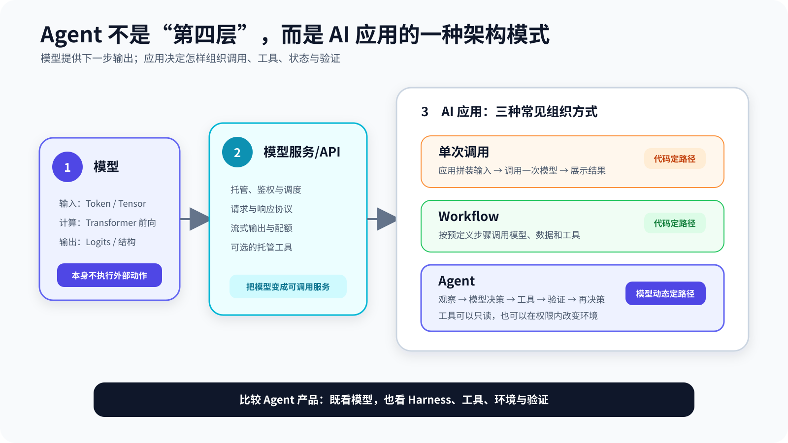
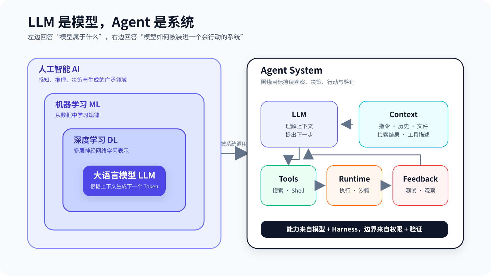
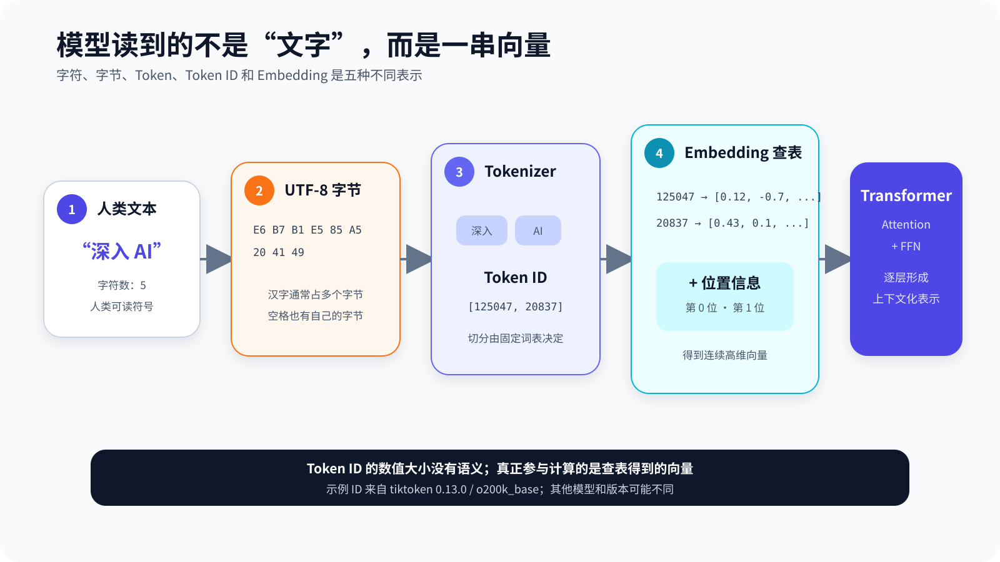
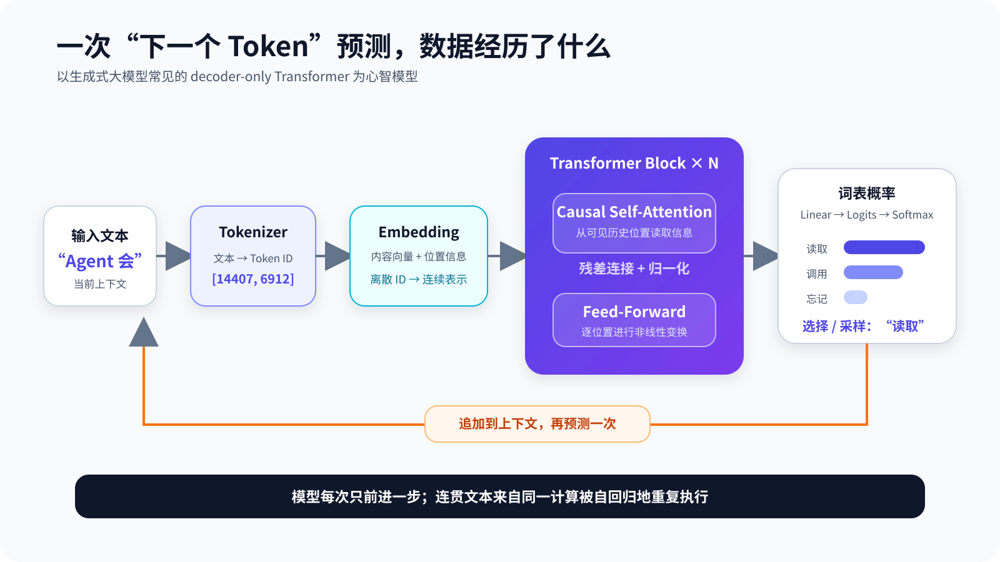
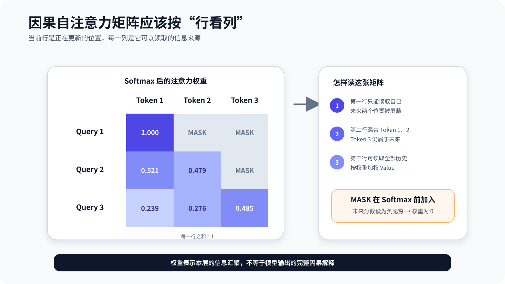
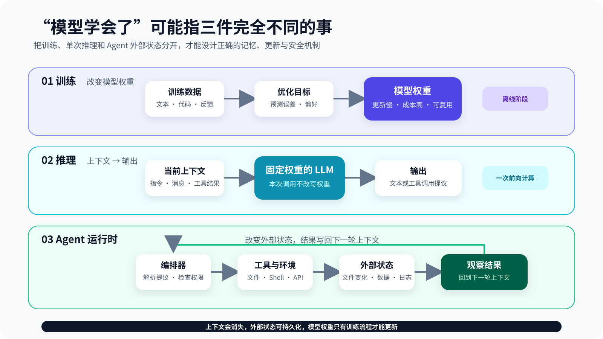

# 第 1 章 大模型入门：从 Token 到 Transformer

ChatGPT 看起来像在理解问题，Claude 能分析一整个代码库，Codex 还能修改文件并运行测试。可许多自回归文本大模型在预训练阶段最核心的目标，竟然只是预测下一个 Token。“只是预测”与“表现得很聪明”，为什么能同时成立？

> **阅读提示**：本章有一条必读主线——文本怎样变成 Token，Token 怎样经过 Transformer 形成下一步输出，模型又怎样被放进 Agent 的执行循环。标有“进阶”的段落用于解释训练和推理优化，第一次阅读可以跳过。建议一边阅读，一边运行 `chapter1/` 下的五个最小实验。

先给出整章答案：**模型通过大规模下一 Token 预测学习语言、知识关联与任务模式；后训练进一步塑造指令遵循、推理和工具使用行为；Agent Harness 再给模型补上上下文、工具、状态、权限和验证循环。** 因而，模型的计算仍然可以是“根据当前上下文产生下一步输出”，产品却能够搜索代码、修改文件并运行测试。

本章把一个具体任务当作**概念路标**：用户要求 Coding Agent 修复 `parse_price()`，让它能够解析 `￥19.90`。五个最小实验会分别隔离 Token、注意力、局部统计、采样和运行时验证；它们不是同一次真实模型调用的逐步 Trace。章末再把这些机制放回 `parse_price()` 任务，看清模型提议、Harness 执行与测试证据的边界。

## 从模型到 Agent：先把边界画清楚

在谈大模型之前，先处理一个常见误会：AI、大模型和 Agent 不是三个可以互换的名称。

### 模型、服务、应用与 Agent

设想我们把同一个语言模型放进三种应用。

第一种应用只有一个文本框。用户输入问题，程序把文字发给模型，再把回答显示出来。模型即使知道应该查询天气，也只能用自然语言建议用户打开天气 App。它没有实时数据，也没有行动接口。

第二种应用在请求中加入一份企业文档。模型现在可以基于文档回答内部制度，但文档没有提到的信息仍然无法可靠回答。应用增强了它本轮能够看到的内容，却没有改变模型权重。

第三种应用提供文件搜索、网页访问、终端和测试工具，并在模型每次提出动作后真正执行，再把结果送回模型。它能先搜索代码、修改文件、运行测试，失败后继续修复。同一模型看起来突然从“聊天机器人”变成了 Coding Agent。

差异来自系统，而不只来自模型。

为了避免后续讨论混乱，先把模型基础设施与三种应用模式放在同一张图里。**Agent 不是所有 AI 应用之上的“第四层”，而是 AI 应用的一种架构模式。**

| 组件或模式 | 主要职责 | 典型输入输出 | 谁决定执行路径 |
| --- | --- | --- | --- |
| 模型 | 根据输入 Token 计算输出分布 | Tensor（多维数值数组）→ Tensor | 不涉及应用执行路径 |
| 模型服务/API | 承载模型、鉴权、调度和流式传输 | 请求 → 响应 | 服务协议与调用方 |
| 单次调用应用 | 组织提示、数据与一次模型调用 | 用户输入 → 一次模型输出 | 应用代码 |
| Workflow | 按预先定义的步骤调用模型和工具 | 输入 → 固定流程 → 结果 | 预先编写的代码路径 |
| Agent | 围绕目标循环观察、决策、使用工具和验证 | 目标 → 动态执行轨迹与产物 | 模型在约束内动态决定 |

模型服务有时会提供托管工具，但边界仍然成立：模型生成工具调用提议，服务端或客户端的执行器负责真正执行。Agent 也不一定修改外部世界；一个只会搜索、读取和汇总资料的研究 Agent 仍然是 Agent。区分 Agent 与 Workflow 的关键，不是“有没有副作用”，而是**执行路径主要由预先写好的代码决定，还是由模型根据中间观察动态决定**。[^ch1-workflow-agent]

理解这一点，才能回答“谁删除了文件”“谁持有密钥”“谁应该做权限检查”这些生产问题。

这也解释了为什么单纯比较模型榜单不足以比较 Agent 产品。一个稍弱的模型，如果拥有更准确的代码搜索、更清晰的工具描述、更稳定的执行环境和更严格的验证循环，可能在真实软件任务上超过一个被糟糕 Harness 包围的更强模型。

| 概念 | 它是什么 | 它不一定是什么 | 例子 |
| --- | --- | --- | --- |
| 人工智能（AI） | 让机器表现出感知、推理、决策或生成能力的广泛领域 | 不一定依赖神经网络 | 搜索、规划、专家系统、机器学习 |
| 机器学习（ML） | 从数据中学习统计规律的方法 | 不等于大模型 | 线性回归、决策树、聚类 |
| 深度学习（DL） | 以多层神经网络学习表示的方法 | 不只处理语言 | CNN、Transformer、扩散模型 |
| 大语言模型（LLM） | 在海量 Token 上训练的语言概率模型 | 自己不会真正执行命令 | GPT、Claude 等模型族 |
| Agent | 围绕目标循环调用模型、工具与环境的系统 | 不是“更大的 LLM” | Claude Code、Codex、检索 Agent |

这组边界非常重要。用户让 Coding Agent “修复登录失败的 Bug”时，真正发生的是：模型提出要读取哪些文件、运行哪些命令或怎样修改代码；Agent 的运行时负责执行这些动作，再把结果送回模型。模型负责生成决策，**Harness**（环绕模型的运行与治理层）负责构造上下文、暴露工具、维护循环，并把决策变成受控行动。

OpenAI 对工具调用的工程说明也强调：模型提出动作，编排器负责执行并把结果返回模型；Claude Code 文档把相同机制描述为“收集上下文—采取行动—验证结果”的循环。[^ch1-runtime] 我们会在后续章节完整拆解这个边界，本章先研究循环中心的模型。

### 大模型在机器学习谱系中的位置

“大模型是怎样训练出来的”也经常被一句“机器从数据中自己学习”含糊带过。不同学习范式使用数据的方式并不相同。

**监督学习**需要输入与人工或程序给出的标签。例如用大量“邮件 - 是否垃圾邮件”样本训练分类器。模型的任务是从输入预测标签，标签直接规定了什么算正确。

**无监督学习**在没有显式标签的数据中发现结构，例如把相似客户聚类。它不代表完全没有目标函数，而是没有为每条数据提供人类指定的答案。

**自监督学习**从数据自身构造监督信号。语言模型把原始文本向右错开一位，就得到了海量“前文 - 下一个 Token”训练对。原始文本既是输入，也是答案来源，不需要人工逐词标注。这是大规模预训练能够扩展的关键原因之一。

**强化学习**让策略通过行动、环境反馈与奖励改进行为。它特别适合“怎样完成多步任务”而不只是“单个答案像不像标准答案”的问题。现代模型后训练会使用多种偏好优化和强化学习方法，但 Agent 运行时调用工具并不自动等于强化学习：如果系统只执行任务、没有用轨迹更新策略，它仍然只是推理。

| 学习方式 | 监督信号来自哪里 | 典型任务 | 与 LLM/Agent 的关系 |
| --- | --- | --- | --- |
| 监督学习 | 人工或程序标签 | 分类、抽取、指令微调 | 教模型按照输入产生目标输出 |
| 无监督学习 | 数据结构本身 | 聚类、降维 | 帮助理解“无人工标签”的学习 |
| 自监督学习 | 从原始数据自动构造 | 下一个 Token、遮盖恢复 | LLM 预训练的主要思想 |
| 强化学习 | 行动后的奖励 | 游戏、控制、多步决策 | 可用于后训练 Agent 策略 |
| 上下文学习 | 本轮输入中的示例与信息 | Few-shot、临时规则 | 不更新权重，只影响当前推理 |

最后一行严格来说不是训练范式，而是模型在推理阶段表现出的适应能力。把它放在表中，是为了突出一个贯穿全书的边界：**行为改变不一定意味着参数学习**。

### “大”到底大在哪里

大语言模型中的“大”没有一个永远固定的参数门槛。它至少同时指向四个尺度：

- 参数规模：网络中可学习数值的数量；
- 数据规模：训练中处理的 Token 数量与数据多样性；
- 计算规模：训练和推理所消耗的加速器计算；
- 能力与适用范围：同一个模型可以迁移到许多没有单独训练过的语言任务。

只看参数量会产生误导。参数更多不保证数据更好、训练更充分或推理更高效；混合专家模型的总参数和每次激活参数也不同；蒸馏、更好的数据与训练方法可能让较小模型在某些任务上胜过更大模型。

本书不会用参数量给“大模型”划一条僵硬边界。我们关心的是一种工程形态：模型通过大规模预训练获得通用语言与任务能力，可以通过上下文、工具和后训练适配多种任务，并成为 Agent 的决策内核。

## 大语言模型究竟在学习什么

给定一段 Token 序列 \(x_1, x_2, ..., x_t\)，语言模型学习下一个 Token 的条件概率：

\[
P(x_{t+1}\mid x_1,x_2,...,x_t)
\]

一句话的联合概率可以按链式法则拆成一连串“预测下一个”的乘积：

\[
P(x_1,...,x_n)=\prod_{t=1}^{n}P(x_t\mid x_1,...,x_{t-1})
\]

训练时，我们已经知道真实的下一个 Token。模型给每个候选 Token 一个概率，损失函数惩罚它没有把足够高的概率分给正确答案；优化器再调整数十亿甚至更多参数，使同类错误以后少一点。

推理时没有标准答案。模型根据当前上下文得到概率分布，选择或采样一个 Token，把它追加到上下文，然后再次预测。如此循环，直到遇到停止标记、长度上限，或者外部 Agent 运行时接管工具调用。

这个目标听起来很小，却有一个容易被低估的要求：要准确预测人类文本，模型必须压缩大量隐藏规律。它需要学习语法、事实之间的关联、常见推理结构、代码模式、写作风格，以及“一个问题后面通常出现怎样的解答”。它不必先被显式教会一套符号规则，规律会以分布式方式进入参数。

但“能生成正确延续”不等于“拥有和人一样的理解”。更稳妥的工程表述是：模型学到了一个足以在许多上下文中产生有用行为的统计表示。我们用任务评估它能做什么，而不是从流畅语气推断它内部一定发生了什么。

### 下一 Token 预测怎样构成训练任务

假设训练语料中只有一句已经完成分词的短句：

~~~text
[Agent] [使用] [工具] [完成] [任务]
~~~

训练程序可以从中构造下面几组输入与目标：

| 模型看到的前文 | 应该预测的目标 |
| --- | --- |
| Agent | 使用 |
| Agent 使用 | 工具 |
| Agent 使用 工具 | 完成 |
| Agent 使用 工具 完成 | 任务 |

真实训练不会为每个前缀单独运行一次模型。程序通常把一批等长或经过填充的序列组成张量，一次并行计算多个位置的预测。输入序列与目标序列只相差一个位置：

~~~text
input : Agent  使用  工具  完成
target: 使用   工具  完成  任务
~~~

这种方法经常被称为 **Teacher Forcing**：训练第 4 个位置时，模型看到的前文是语料中的真实 Token，而不是自己前面可能预测错的 Token。它显著提高了训练并行度，却带来训练与生成的差异——推理时模型必须消费自己刚刚生成的内容，一个早期错误可能改变后面所有上下文。这个差异常被称为 Exposure Bias，但它不是长文本失败的唯一原因。[^ch1-teacher-forcing]

这正是长文本会“越写越偏”的原因之一。不是第 2000 个 Token 突然坏掉，而是自回归系统不断把自己的输出变成下一步输入，微小偏差有机会累积。Agent 的工具循环也有类似特征：一次错误观察或错误修改会改变之后的环境，因此需要验证与恢复机制。

**损失函数怎样告诉模型“错了多少”。** 设某个位置的正确 Token 是“工具”，词表中只有四个候选项。模型给出的概率如下：

| Token | 概率 |
| --- | ---: |
| 工具 | 0.50 |
| 代码 | 0.25 |
| 文档 | 0.15 |
| 用户 | 0.10 |

对于正确答案“工具”，该位置的负对数似然为：

\[
L=-\log P(\text{工具}\mid\text{前文})=-\log 0.50
\]

如果模型只给正确答案 0.01 的概率，损失会明显增大；如果给出 0.90，损失会减小。对一个批次中所有有效位置求平均，就得到常见的交叉熵损失。

随后发生的是反向传播：

1. 前向计算得到各位置的 Logits 与损失；
2. 自动微分计算损失对每个参数的梯度；
3. 优化器根据梯度、学习率和内部状态更新参数；
4. 下一批数据重新执行前向与反向计算；
5. 周而复始，直到达到训练预算或停止条件。

梯度不是一条可读规则。参数更新后，我们通常无法指出“第 187 亿个参数现在存储了北京是中国首都”。知识、语法和行为模式分散在大量参数的相互作用中。这种分布式表示赋予模型泛化能力，也使事实更新、来源追踪和精确删除变得困难。

**训练集表现好，不等于模型学会了通用规律。** 如果模型只是记住训练文本，遇到新问题就会失败。训练过程通常会预留验证集，用没有参与参数更新的数据评估损失或任务指标。训练损失持续下降、验证损失却开始上升，是过拟合的典型信号。

对于互联网规模的语言模型，问题比教科书里的训练集/验证集划分复杂得多：

- 重复网页可能同时进入不同数据划分；
- 基准题及其答案可能出现在公开网络中；
- 同一内容会被转载、改写或翻译；
- 代码仓库之间存在复制和依赖；
- 新模型可能读过讨论旧基准的文章。

因此，看到模型在一个公开题库上得到高分时，不能自动推断它拥有同等程度的通用能力。需要结合污染检查、私有测试集、时间切分、对抗变体和真实任务评估。第 13、14 章会把这个问题升级为 Agent 评估。

**模型参数里保存的不是“全部训练数据的压缩包”。** 把 LLM 描述为“互联网的有损压缩”有一定启发性：预测任务迫使模型压缩语料中的规律。但如果把它理解成可以随时解压原始网页，就会产生两个错误判断。

第一，模型确实可能记住部分高频或罕见片段，尤其是重复、独特或容易拟合的内容；这带来隐私、版权和数据治理问题。第二，大部分能力又不能简单还原为逐字记忆。模型可以把多个例子共享的结构组合起来，对没见过的输入产生新输出。

更准确的说法是：权重包含从训练分布中学到的统计结构，其中既可能有抽象规律，也可能有不同程度的记忆。某次输出究竟来自泛化、近似检索还是模板组合，通常需要专门实验才能判断。

### 基础模型、对话模型和面向工具使用的模型

完成下一 Token 预训练后，模型首先擅长的是“续写”。如果输入“用户：请解释注意力机制\n助手：”，它可能因为训练数据中有大量对话格式而给出回答，但这不保证稳定遵循指令、拒绝危险请求或使用规定的工具格式。

现代可用模型通常还经历后训练。粗略地说：

- 指令微调让模型学习“请求 - 理想回答”或“状态 - 工具调用”模式；
- 偏好优化让模型倾向于人类或自动评分器更偏好的输出；
- 强化学习可以优化可验证任务、多步推理或工具使用策略；
- 安全训练塑造拒绝、边界识别和风险处理行为。

所以“模型只是预测下一个 Token”描述的是统一的输出机制和基础训练目标，却不能替代对后训练的解释。一个模型为什么愿意回答、为什么遵循 JSON Schema（结构化数据的字段与类型约束）、为什么在难题上分配更多推理计算，往往与后训练和推理系统有关。下一章会专门展开这些过程。

**参数、激活值与 Token 数是不同的规模。** 阅读模型新闻或技术报告时，经常会同时看到“多少参数”“多少上下文 Token”“训练用了多少 Token”。它们不是同一件事。

**参数**是训练后保存在模型权重中的可学习数值。推理过程中通常读取它们，却不通过普通对话更新它们。参数越多，模型文件、内存与计算需求通常越大，但混合专家模型每个 Token 只激活部分专家，因此总参数与每次计算量不能直接画等号。

**激活值**是一次前向计算产生的中间表示。它们取决于当前输入，调用结束后通常不作为模型知识长期保存。训练时为了反向传播需要保留更多激活值，所以同一个模型的训练显存通常远高于只做推理。

**训练 Token 数**描述优化过程中处理过多少数据单位。它影响模型有多少机会从数据中调整参数，但重复低质量 Token 与多样、高信号 Token 的价值不同。

**上下文 Token 数**描述单次推理可见或已使用的序列长度。它属于运行时输入规模，不代表这些 Token 被写进权重，也不等于模型训练 Token 数。

| 数量 | 生命周期 | 主要影响 |
| --- | --- | --- |
| 参数量 | 跨请求持久存在，训练时更新 | 模型容量、存储、推理计算 |
| 激活值 | 单次前向/反向过程 | 显存、并行与训练成本 |
| 训练 Token | 整个训练过程累计 | 数据覆盖与优化预算 |
| 上下文 Token | 单次任务或会话 | 当前可见信息、延迟与费用 |
| 输出 Token | 自回归逐步生成 | 生成延迟、费用与完成度 |

如果一个产品宣称“记住了十万 Token 的对话”，它更可能表示应用保留并重新提供上下文或外部摘要，不表示模型在一次会话中完成了参数训练。看到规模数字时先问“它属于哪一个生命周期”，能避免大量概念误判。

> **本节边界**
>
> 这一节建立的是最小训练心智模型，不足以据此估算真实前沿模型的训练数据、算力或参数细节。商业模型通常只公开部分技术信息，不能把示意流程当作某个具体产品的完整配方。

## 从文本到向量：模型怎样“看见”一句话

神经网络处理数字。自然语言进入模型前，必须先经过 Tokenizer。

这张图里有四种容易混在一起的表示：

1. **字符**是人阅读的文字单位；
2. **字节**是计算机存储和传输文本的底层编码；
3. **Token**是 Tokenizer 根据词表切出的模型单位；
4. **向量**才是神经网络层真正参与计算的连续数值。

同一个汉字在 UTF-8 中通常占多个字节，但可能对应一个 Token，也可能与相邻文字共同组成 Token。英文单词可能是一个 Token，也可能被拆成词根、后缀或更小片段。四种长度没有简单的一一对应关系。

### Token 不是字，也不总是一个词

Token 可以是一个汉字、半个英文单词、空格与标点的组合，也可能是某段高频字节序列。不同模型使用不同词表与切分算法，同一句话的 Token 数量并不固定。

下面是本章锁定环境 `tiktoken==0.13.0`、编码器 `o200k_base` 的真实输出：

~~~text
文本：深入浅出 AI Agent
字符数：13
UTF-8 字节数：21
Token 数：5
Token ID：[125047, 190269, 6390, 20837, 28237]
Token 字节：[b'\xe6\xb7\xb1\xe5\x85\xa5', b'\xe6\xb5\x85', b'\xe5\x87\xba', b' AI', b' Agent']
~~~

这个结果不是跨模型常量：更换编码器或版本后，切分可能变化，真实结果必须以目标模型的 Tokenizer 为准。Token 数会影响三件非常现实的事：

- 上下文窗口能容纳多少内容；
- API 输入输出怎样计费；
- 模型在哪些边界上更容易复制、拼写或计算出错。

本章实验 [token_demo.py](../chapter1/token_demo.py) 使用 OpenAI 的 tiktoken 查看真实切分。你应该比较中文、英文、代码、Emoji 和同义改写，而不是只运行一个例子。

**为什么不直接按“一个词一个 Token”。** 如果把每个完整单词都放进词表，会遇到词表爆炸。英文有复数、时态、派生词和拼写变化；中文没有天然空格；代码包含变量名、路径和随机标识符；用户还会创造新词。无论词表多大，都无法预先列出所有可能字符串。

如果退到字符级，词表会变小，也不会遇到未知单词，但序列会变长。“unbelievable”原本可能由少量子词表示，字符级却需要逐个字母处理。更长序列意味着更多注意力计算和更少的有效上下文。

子词 Tokenization 在两者之间折中：

- 高频片段保留为较长 Token，提高压缩率；
- 低频词拆成更小片段，避免完全未知；
- 采用 byte-level 或显式 byte fallback 的实现还能回退到字节，从而覆盖任意 Unicode 文本。

并非所有子词算法都具备字节回退：传统 WordPiece 可能产生未知词标记，SentencePiece 是否启用 byte fallback 也取决于配置。这个限定很重要，不能把某一类现代 tokenizer 的实现特征写成全部 tokenizer 的共同性质。

这不是单纯的文本预处理细节。Tokenizer 决定了模型“看问题的颗粒度”。电话号码、长整数、罕见人名和代码标识符如果被切成许多碎片，模型要跨多个位置保持精确关系，通常比处理高频自然语言更困难。

**BPE 的直觉：反复合并最常出现的相邻片段。** 不同模型会采用不同 Tokenizer。为了理解基本思想，可以用 Byte Pair Encoding（BPE）做一个玩具推演。[^ch1-bpe] 假设语料只有：

~~~text
low lower lowest
~~~

开始时把词拆成字符或字节：

~~~text
l o w
l o w e r
l o w e s t
~~~

统计相邻片段后，l 与 o、lo 与 w 都很常见，于是算法可以依次学习合并规则：

~~~text
l + o  → lo
lo + w → low
~~~

之后 low 可以用一个 Token 表示，而 lower 可能被表示为 low + er，lowest 可能是 low + est。真实 Tokenizer 在大规模语料上学习大量合并，并常以字节为基础处理 Unicode；示例只用于解释“高频组合变长、低频组合回退”的方向。

需要注意，Tokenizer 的合并规则在模型训练前已经确定。模型不能在一次对话中临时把新词加入固定词表。它可以通过多个已有 Token 表示新词，并在上下文中学会怎样使用它，但底层切分没有改变。

**空格、大小写与格式为什么会改变 Token。** 很多词表把前导空格作为 Token 的一部分，因此 “Agent” 和 “ Agent” 可能拥有不同 ID。大小写、换行和缩进也会改变切分。对代码模型而言，空格和换行不仅影响 Token 数，还携带语法结构。

这带来几个工程后果：

- 重复的大段固定提示会消耗上下文和费用；
- JSON 中冗长字段名会在每轮工具调用中重复出现；
- 把二进制、Base64 或压缩数据直接塞进上下文通常极不经济；
- 同样内容用表格、JSON 或自然语言表达，Token 数与模型可读性不同；
- 提示词“更短”不总是更好，还要保留完成任务所需的高信号信息。

第 5 章会把 Token 预算提升为完整的上下文工程问题。本章只需要建立一个习惯：讨论“文本长度”时，明确你说的是字符、字节还是模型 Token。

### 从 Token ID 到 Embedding

Token ID 只是词表里的编号。编号 100 与 101 在数值上接近，不表示语义接近。模型会通过 Embedding 表，把每个离散 ID 映射为一个高维向量：

\[
e_i = E[x_i]
\]

训练会让在相似上下文中出现、承担相似作用的 Token 形成可利用的几何关系。这里的“意义”不是某个维度写着“是否动物”，而是分散在许多维度和网络层中的表示。

**为什么不用一个超长 One-hot 向量。** 假设词表有 20 万个 Token。最直接的表示是为每个 Token 建立一个长度 20 万的向量，只有对应位置为 1，其余为 0。它能区分 Token，却有两个问题：

1. 向量极其稀疏，存储和计算浪费；
2. 任意两个不同 Token 的距离都一样，无法表达相似性。

Embedding 表可以看成一个形状为“词表大小 × 隐藏维度”的可学习矩阵。根据 Token ID 取出对应行，就得到稠密向量。隐藏维度远小于词表大小，且会随着训练形成有用结构。

如果词表大小为 \(V\)，隐藏维度为 \(d\)，长度为 \(n\) 的 Token 序列经过查表后得到：

\[
X\in\mathbb{R}^{n\times d}
\]

这个 \(X\) 是 Transformer 的主要输入。后续每一层都会保持“序列位置 × 隐藏特征”的基本形状，注意力在位置之间交换信息，前馈网络在每个位置的特征维度上变换。

**初始 Embedding 与上下文化表示。** 同一个 Token 从 Embedding 表取出的初始向量是固定的，但经过注意力层后，它的隐藏表示会依赖上下文。例如“苹果发布新产品”和“吃一个苹果”中的“苹果”初始 Token 可能相同，后续层表示却会因为周围词不同而分化。

因此，下面两句话应当区分：

- “Token Embedding 是固定查表结果”；
- “模型内部对这个位置的表示会随上下文变化”。

很多关于 Embedding 的入门解释只展示二维词向量图，容易让人误以为每个词永远只有一个语义坐标。对现代 Transformer，更重要的是上下文化表示：每一层、每个位置都在根据整段可见上下文更新。

**顺序从哪里来。** 仅有 Token Embedding 不足以区分“猫追狗”和“狗追猫”。Transformer 还需要位置信息。不同模型会使用绝对位置编码、旋转位置编码（RoPE）等机制，使网络能够区分 Token 的相对或绝对位置。

因此，模型最初看到的不是句子，而是一组同时携带内容与位置信息的向量。

**位置编码的直觉。** 最简单的做法是给第 0、1、2……个位置分别准备位置向量，再与 Token Embedding 相加。这样即使两个位置出现同一 Token，输入表示也不同。

现代 LLM 常见的 RoPE 不只是把位置向量加到内容上，而是在 Query 和 Key 的部分维度中施加与位置相关的旋转，使注意力分数自然携带相对位置信息。[^ch1-rope] 你不必在第一遍阅读时掌握复数形式推导，但要记住它解决的核心问题：注意力需要知道“谁在谁之前、相隔多远”。

位置机制也解释了为什么模型不能无代价地把上下文从训练长度扩展到任意长度。模型在有限序列分布上学到位置使用方式，超过熟悉范围后，即使技术上能接收更长输入，精度和注意力利用也可能变化。

**Tokenizer 不是跨模型通用的。** 不要用一种模型的 Tokenizer 精确估算另一种模型的费用或上下文。模型厂商可能使用不同词表、特殊 Token 和多模态编码方式；同一厂商的不同代际也可能变化。

工程系统应优先使用目标模型官方 SDK 或 Tokenizer 进行测量。如果无法获得，应把估算标为近似值，并在长度接近上限时留出安全余量，特别是工具结果和模型输出仍会继续占用上下文。

> **常见故障：输入明明没有超过字符限制，API 为什么仍然拒绝？**
>
> 因为 API 通常按 Token 而不是字符计算上下文，而且总预算还可能包含系统指令、工具定义、历史消息、图片编码和预留输出。应用界面看到的用户文字只是完整上下文的一部分。

## Transformer：让每个位置有选择地读取上下文

2017 年的论文 *Attention Is All You Need* 提出了以注意力为核心的 Transformer 架构。今天具体模型的层结构、位置编码、归一化与注意力实现已经发生许多变化，但“根据上下文动态汇聚信息”仍是理解 LLM 的关键入口。[^ch1-transformer]

### 从循环网络到 Transformer

在 Transformer 之前，语言模型常使用 RNN、LSTM 等循环结构。它们按照顺序逐步更新隐藏状态：读完第一个 Token 得到状态 \(h_1\)，再把 \(h_1\) 与第二个 Token 一起计算 \(h_2\)，以此类推。

这种结构符合人类“从左往右读”的直觉，却有两个明显困难。

第一，位置之间存在强顺序依赖。计算后面的位置前，通常要先得到前面的位置，训练难以充分并行。第二，远距离信息必须经过许多状态传递。尽管 LSTM 等结构缓解了梯度问题，长距离依赖仍然困难。

卷积模型可以并行处理局部窗口，但要让相距很远的两个位置交换信息，需要堆叠更多层或扩大卷积范围。

Self-Attention 提供了另一条路线：一个位置可以在同一层直接计算它与所有可见位置的关系。路径变短，训练也更适合现代加速器进行大规模矩阵运算。代价是标准全注意力需要处理随序列长度平方增长的成对关系，这成为长上下文的重要成本来源。

### Encoder、Decoder 与 Decoder-only

原始 Transformer 用于机器翻译，包含 Encoder 和 Decoder：

- Encoder 可以双向读取整段源文本，适合理解和编码输入；
- Decoder 使用因果遮罩，只读取已经生成的目标前缀，并通过交叉注意力读取 Encoder 输出；
- Encoder-Decoder 组合把一种序列转换为另一种序列。

后来出现三类常见路线：

| 架构 | 上下文可见性 | 典型目标 | 直觉 |
| --- | --- | --- | --- |
| Encoder-only | 通常双向 | 分类、表征、遮盖恢复 | 读完整段后理解 |
| Encoder-Decoder | 输入双向、输出自回归 | 翻译、摘要、序列转换 | 先读输入，再生成输出 |
| Decoder-only | 对生成位置因果可见 | 下一个 Token | 把所有任务统一成续写 |

生成式 LLM 广泛采用 Decoder-only，不是因为 Encoder 已经没有价值，而是因为大量任务可以统一表示为“给定上下文继续生成”。指令、示例、检索资料、工具定义和对话历史都可以排进一个 Token 序列，模型用同一个自回归目标处理。

现代生成式 LLM 多数采用 decoder-only 结构。一次前向计算可以先粗略理解为：

~~~text
文本 → Token ID → Embedding + 位置 → N 个 Transformer Block
     → 词表 Logits → 概率分布 → 下一个 Token
~~~

每个 Transformer Block 里最值得先掌握两部分：自注意力与前馈网络。

### 自注意力不是“把所有内容平均一下”

对每个位置的表示，模型通过学习到的矩阵得到 Query、Key 和 Value：

\[
Q=XW_Q,\quad K=XW_K,\quad V=XW_V
\]

缩放点积注意力为：

\[
Attention(Q,K,V)=softmax\left(\frac{QK^T}{\sqrt{d_k}}+M\right)V
\]

其中，\(d_k\) 是每个 Key/Query 向量的维度，除以 \(\sqrt{d_k}\) 是为了避免维度增大后点积数值过大；\(M\) 是因果遮罩矩阵，未来位置对应负无穷。生成第 \(t\) 个位置时，模型不能偷看未来的真实 Token，因此未来位置经过 Softmax 后权重为 0。

可以先用“检索”作一个不完全但有用的类比：

- Query 表示当前位置正在寻找什么；
- Key 表示每个历史位置能以什么特征被匹配；
- Query 与 Key 的相似度形成注意力分数；
- Softmax 把分数转成权重；
- 对 Value 加权求和，得到当前位置从上下文读取的信息。

本章实验 [attention_demo.py](../chapter1/attention_demo.py) 只有几十行 NumPy 代码。它不会复现完整 Transformer，却会把分数矩阵、因果遮罩和 Softmax 后的权重逐项打印出来。比背诵公式更重要的是观察两个现象：被遮罩的未来权重是否严格为零，以及改变某个 Query 后信息来源怎样变化。

**用三个位置手算一次注意力。** 假设序列只有三个位置，每个位置的表示都是二维向量。为了让计算可复现，令投影矩阵为单位矩阵，因此 \(Q=K=V=X\)，并且 \(d_k=2\)：

\[
X=Q=K=V=
\begin{bmatrix}
1 & 0\\
0.8 & 0.2\\
0 & 1
\end{bmatrix}
\]

先计算缩放点积分数：

\[
\frac{QK^T}{\sqrt{2}}\approx
\begin{bmatrix}
0.707 & 0.566 & 0\\
0.566 & 0.481 & 0.141\\
0 & 0.141 & 0.707
\end{bmatrix}
\]

第 \(i\) 行表示第 \(i\) 个位置在“看”哪些位置，第 \(j\) 列表示它对第 \(j\) 个位置的匹配程度。加入因果遮罩后：

\[
S_{masked}\approx
\begin{bmatrix}
0.707 & -\infty & -\infty\\
0.566 & 0.481 & -\infty\\
0 & 0.141 & 0.707
\end{bmatrix}
\]

在因果生成中：

- 第 1 个位置只能看自己；
- 第 2 个位置可以看第 1、2 个位置；
- 第 3 个位置可以看第 1、2、3 个位置。

上三角的未来位置在 Softmax 前被设为负无穷，归一化后权重为 0。这样训练时即使完整句子已经放在显存中，每个位置也无法通过注意力直接读取自己的未来答案。

逐行做 Softmax，可得到：

\[
A\approx
\begin{bmatrix}
1 & 0 & 0\\
0.521 & 0.479 & 0\\
0.239 & 0.276 & 0.485
\end{bmatrix}
\]

最后计算 (AV)。第二个位置的新信息约为 \(0.521v_1+0.479v_2=(0.904,0.096)\)。注意力输出不是“选中一个词”，而是把多个 Value 连续混合。现在正文中的每一个数都可以在实验脚本中逐项核对。

这里还要澄清一个常见误解：注意力权重能帮助观察模型在这一层如何汇聚信息，但不能自动当作完整解释。最终输出还经过其他注意力头、前馈网络、残差连接和后续层；某个位置权重高，不等于它在因果意义上就是答案的唯一原因。相关研究也发现，注意力权重与其他重要性度量可能并不一致。[^ch1-attention-explanation]

### 一个 Transformer Block 还做了什么

**多头注意力。** 单个注意力头只能在一组投影空间中建立关系。多头注意力让不同头学习不同类型的匹配模式，再拼接结果。某些头可能更关注局部搭配，另一些头关注远距离引用；但不要把每个头拟人化成固定的“语法专家”，真实模型中的功能往往是分布式且会随层与上下文变化。

如果隐藏维度为 \(d\)，共有 \(h\) 个头，常见做法是让每个头处理较小的 Query、Key、Value 子空间。第 \(i\) 个头为：

\[
head_i=Attention(XW_i^Q,XW_i^K,XW_i^V)
\]

所有头拼接后再经过输出投影：

\[
MultiHead(X)=Concat(head_1,\ldots,head_h)W^O
\]

不同头并不是把同一分数矩阵计算多次，因为它们拥有不同投影参数。相同输入会被映射到不同特征空间，从而允许模型同时建立多组关系。

一些现代架构会采用 Multi-Query Attention 或 Grouped-Query Attention，让多个 Query 头共享较少的 Key/Value 头，以减少 KV Cache 和推理带宽。[^ch1-gqa] 第一章不展开其实现，但这个变化提醒我们：Transformer 是一个持续演化的架构家族，而不是 2017 年论文代码的永久复刻。

**前馈网络。** 注意力在 Token 之间搬运和组合信息，前馈网络（FFN/MLP）则对每个位置的表示做非线性变换。简化形式为：

\[
FFN(x)=W_2\sigma(W_1x+b_1)+b_2
\]

残差连接让新信息与原表示相加，归一化帮助深层网络稳定训练。一个 Block 的直觉可以压缩成两句：注意力决定“从其他位置读什么”，前馈网络决定“读到之后怎样变换”。数十层 Block 反复执行，浅层局部模式逐渐组合成更适合当前预测的表示。

**残差连接与归一化。** 如果每一层都完全覆盖上一层表示，深层网络很难稳定训练，也容易丢失已有信息。残差连接让子层学习“在当前表示上增加什么变化”：

\[
x_{next}=x+Sublayer(x)
\]

在反向传播时，梯度可以沿残差的加法路径更直接地传向较浅层；在前向计算时，原表示也可以经过恒等路径继续保留。如果某个子层不需要改变信息，它可以学习接近零的增量。

Layer Normalization 则按照隐藏特征对表示进行归一化，控制不同层数值尺度。真实模型可能采用 Pre-Norm、Post-Norm 或 RMSNorm 等变体。入门阶段不用背具体顺序，但阅读模型结构图时应知道“Attention + FFN”并不是完整 Block，残差与归一化是训练深网络不可忽略的基础设施。

**为什么还要堆很多层。** “一个位置能直接看见所有历史位置”只表示信息路径存在，不表示一次加权就能完成复杂计算。

考虑阅读一段代码并判断变量最终类型：

1. 较早层可能识别标识符、括号和局部语法；
2. 中间层组合赋值、调用和作用域关系；
3. 更高层将这些关系组织成适合预测下一段代码的表示。

这是示意而不是严格的神经元分工。模型行为由多层分布式计算产生，研究者仍在使用探针、干预和可解释性方法理解内部机制。工程师需要知道的核心是：更深层允许模型反复读取、组合和变换上下文，而不是把注意力当作一次数据库查询。

**标准注意力为什么让长上下文昂贵。**

长度为 \(n\) 的序列会形成 \(n\times n\) 的注意力分数。仅从成对关系看，序列长度翻倍，矩阵元素约变成四倍。训练时还要保存用于反向传播的中间结果，显存压力更大。

现代系统会使用 FlashAttention（一类减少显存读写的注意力实现）、分块计算、稀疏或滑动窗口注意力、KV Cache、量化和并行策略降低实际成本。[^ch1-flash-attention] 它们改变的是计算与存储方式，或限制部分连接，并没有让上下文成为免费的无限资源。

对于 Agent，问题更加突出。系统指令、工具定义、文件片段、终端日志和每轮工具调用都会积累。即使模型支持很长上下文，也需要选择哪些信息值得进入下一轮，而不是把所有历史原样保留。第 6 章会把压缩、检查点与文件化状态组合成长期运行架构。

## 从隐藏表示到下一步输出

### Logit、概率与候选 Token

最后一层得到当前位置的隐藏向量后，模型把它投影到词表大小的 Logits。Softmax 将 Logits 转成概率：

\[
P(x_i)=\frac{e^{z_i/T}}{\sum_j e^{z_j/T}}
\]

这个数学式只在 \(T>0\) 时定义。温度低时，概率更集中，输出通常更稳定；温度高时，分布变平，采样更有变化。工程接口中的 `temperature=0` 通常表示 greedy 或近确定性实现，不是把 0 直接代入上式。温度也不是“创造力旋钮”的完整解释，它只改变候选概率的相对尖锐程度。

Logit 是未经归一化的分数，可以是任意实数。Softmax 关心的是候选之间的相对差异：给所有 Logit 同时加上一个常数，概率不会改变；放大差异会让分布更尖锐。

为了直观看见温度如何改变分布，下面把三个中文标签当作一个玩具分类空间中的三个**原子类别**：

~~~text
读取: 2.0
调用: 1.0
删除: 0.1
~~~

Softmax 后“读取”概率最高，但“调用”和“删除”并不一定为零。这里的标签不保证是实际 tokenizer 中的单个 Token，也不代表真实工具调用经过校准的动作概率。真实工具调用通常是由多个 Token 或专用结构化输出共同形成，再由 Harness 解析和校验。这个玩具例子只用于隔离观察温度对分布形状的影响。

**Greedy、Temperature、Top-k 与 Top-p。** Greedy 每次选择概率最高的 Token；Temperature sampling 先调整分布的尖锐程度；Top-k 保留概率最高的固定 \(k\) 个候选；Top-p 保留累计概率达到阈值 \(p\) 的最小候选集。这里只需记住：它们改变“从候选中怎样选下一个”，不会自动补充事实证据或安全约束。

| 策略 | 优点 | 主要风险 | 更适合 |
| --- | --- | --- | --- |
| Greedy/近确定性 | 稳定、便于回归 | 可能重复或过早锁定 | 抽取、格式化、工具参数 |
| 温度采样 | 可调整分布尖锐程度 | 稳定性与多样性仍需实测 | 候选生成 |
| Top-k / Top-p | 限制采样候选集 | 与温度组合后不易直觉预测 | 需要受控随机性的生成 |

Agent 的决策不应简单地把温度调高来追求“探索”。真实行动有副作用，探索需要权限边界、分支环境、模拟或可回滚机制。生成十个标题和尝试十种生产数据库操作，风险完全不同。

这张表是机制地图，不是跨模型保证。具体 API 是否支持这些参数、怎样与推理预算组合、应如何评测，统一留到第 2 章的推理控制部分。

本章新增的 [sampling_demo.py](../chapter1/sampling_demo.py) 使用同一组 Logit 比较不同温度下的概率和固定种子的抽样结果。重点不是找到“最佳温度”，而是观察一个参数怎样改变分布。

### 自回归循环怎样构成一句话

模型选出一个 Token 后，整个过程重新开始。这就是自回归生成。

伪代码可以压缩为：

~~~python
tokens = tokenizer.encode(prompt)

while not should_stop(tokens):
    logits = model(tokens)
    next_token = sample(logits[-1])
    tokens.append(next_token)

return tokenizer.decode(tokens)
~~~

真实服务会进行批处理、流式输出、缓存和安全检查，但核心循环没有改变。每次只需要最后一个位置的下一个 Token 分布，用户却能通过流式接口看到文字逐步出现。

这个循环也解释了三种常见现象：

- **输出长度影响延迟**：生成 2000 个 Token 包含 2000 个有序的条件选择位置，因此输出长度通常显著影响延迟；推测解码等优化可以减少目标模型的串行前向调用，却不会把自回归条件依赖变成完全独立的并行生成；
- **早期选择影响后文**：一旦模型选择某个变量名、论点或工具，后续条件概率都会基于它；
- **相同输入不一定相同输出**：只要存在随机采样或服务端非确定性，轨迹可能分叉。

> **进阶：KV Cache 为什么能加速生成？**
>
> 朴素实现会在每生成一个 Token 时重新计算整个前缀的 Key 和 Value，产生大量重复工作。因为旧 Token 的表示在当前推理层中已经计算过，生成系统可以缓存各层的 Key/Value；新一步只为新 Token 计算 Query、Key、Value，并让 Query 读取缓存。

这就是 KV Cache 的基本作用。它以更多显存换取更快的自回归解码。上下文越长、批量越大、层数和隐藏维度越大，缓存占用越高。Grouped-Query Attention、量化和缓存分页等技术都在尝试改善这个约束。

KV Cache 不是 Agent 的长期记忆。它是一次模型推理会话中的计算缓存，通常不能替代数据库、文件或跨任务记忆。服务端是否保留、能否复用、持续多久，也由具体 API 决定。

**模型什么时候停止。** 生成循环需要停止条件。常见条件包括：

- 生成特殊的结束 Token；
- 达到最大输出 Token 数；
- 命中调用方指定的停止序列；
- 模型输出工具调用，控制权交给执行器；
- 服务因安全、超时或资源限制中止。

如果输出被最大长度截断，最后一句不完整并不表示模型“认为任务完成”。Agent Harness 应区分正常完成、工具交接、长度截断、拒绝和系统错误，否则可能把半个 JSON 或半条命令当作有效行动。

上图刻意分开三个阶段：

- **训练**改变模型权重，成本高，更新慢；
- **推理**在给定上下文中计算输出，不会因为一次对话自动改写权重；
- **Agent 运行时**保存文件、调用工具、查询实时数据并反馈结果，这些能力位于模型之外。

所以“我刚刚告诉模型一件事”至少有三种完全不同的含义：信息可能只在本轮上下文里，可能被应用写入外部记忆，也可能在未来经过数据处理进入新一轮训练。把三者混在一起，会直接导致错误的记忆与隐私设计。

> **进阶：多模态模型仍然需要可计算的表示。**
>
> 当前大模型不再只接收文字。常见实现会把图片切成 Patch，再经视觉编码器变成向量；语音可以分帧或编码成音频单元；视频还要处理时间维度。不同商业模型的具体结构并不完全公开，也可能组合多个专门模型，因此这里描述的是常见模式，不是所有产品的固定内部结构。

因此，“下一个 Token”有时是对文本生成接口的简化说法。不同模型可能生成文本 Token、音频单元、图像表示或工具调用结构。对 Agent 工程更稳定的抽象是：模型把当前可见的多模态上下文映射为下一步输出，Harness 决定如何解释、验证和执行这个输出。

## 为什么预测下一个 Token 能产生复杂能力

“预测下一个 Token”常被说成一件简单的事。算法目标的表述确实简单，完成它却可能需要复杂能力。

假设训练语料中有程序、论文、对话、教程、错误日志和推导过程。想继续生成这些文本，模型要反复面对下面的隐含任务：

- 代码片段后面应该是符合语法且变量一致的实现；
- 数学推导下一步应与前提和前一步兼容；
- 问题后面应出现与问题相关而不是仅仅流畅的回答；
- 一个函数的测试失败后，合理文本往往包含定位、修改与验证；
- 多轮对话的新回复需要保持人物、约束和指代一致。

规模扩大带来了更多参数、数据和计算，使模型能表示更多模式；这三者需要协同扩展，不能只把“大”理解成参数量。[^ch1-scaling] Transformer 让当前输出动态利用上下文；指令微调和偏好对齐又让基础的续写模型更擅长按人类请求组织行为。推理模型还会使用更多推理时计算，在给出最终输出前进行更长的内部处理。

但不要把“能力随规模出现”误写成神秘魔法。工程上更有用的问题是：能力在哪类任务、哪个模型、什么提示和多少预算下稳定出现？答案要靠评估，而不是靠演示视频。

### 目标简单，不代表解决任务的内部表示简单

国际象棋程序最终也可以只围绕“赢得比赛”优化，但获胜策略需要处理棋盘结构、对手意图和长程规划。类似地，下一 Token 目标的定义很短，最小化大规模、多领域文本上的预测误差却可能要求模型形成复杂内部表示。

考虑下面的续写：

~~~text
小王把杯子放在桌上，然后把桌子搬进会议室。
现在杯子更可能在哪里？
~~~

要预测“会议室”或相近答案，模型不能只统计问题最后几个词。它需要追踪物体与容器的关系，并知道搬动桌子通常也会搬动桌上的杯子。我们可以争论这种内部表示是否等同于人类理解，但从行为上看，准确续写需要利用某种关于世界关系的结构。

对代码更明显。要补全一个函数最后几行，模型可能需要维护变量类型、作用域、调用约定、测试意图和项目风格。局部字符统计不足以稳定完成这些任务，训练会奖励能够编码更长程结构的参数配置。

### 一次成功的能力来自哪里

看到模型完成任务时，可以先问能力来自哪里：

| 能力来源 | 保存在哪里 | 例子 | 主要限制 |
| --- | --- | --- | --- |
| 参数中的预训练与后训练能力 | 模型权重 | 语言、代码模式、通用知识、工具策略 | 更新慢、来源难追踪 |
| 当前上下文中的临时适应 | 输入 Token | 用户规则、Few-shot 示例、当前文件 | 受窗口、位置和噪声影响 |
| 外部系统提供的能力 | 工具、数据库、文件、运行时 | 实时搜索、计算、执行、持久状态 | 接口、权限、可靠性和安全风险 |

真实 Agent 通常同时使用三者。模型参数让它知道如何读错误日志，上下文告诉它当前仓库和任务，终端工具让它真正运行测试。把最终效果全部归功于模型，会错过可以优化的系统部分。

### In-context Learning：不改权重也能临时适应

给模型下面的示例：

~~~text
输入：服务启动成功
标签：A

输入：数据库连接超时
标签：B

输入：页面渲染完成
标签：
~~~

即使 A、B 是临时定义的标签，模型也可能从示例归纳出 A 表示成功、B 表示失败，并输出 A。整个过程中没有反向传播，也没有持久参数更新；任务映射只存在于当前上下文。

这叫 In-context Learning。[^ch1-icl] 它使一个通用模型能在不微调的情况下适配分类、抽取、格式转换和工具协议，也让 Prompt 具备了“临时程序”的味道。

但上下文学习并不稳定等价于执行形式化程序。示例顺序、数量、覆盖范围、标签偏差和干扰文本都会影响结果。需要严格业务规则时，应把确定性部分放进代码或验证器，而不是期待模型永远从几个例子正确归纳。

**推理能力与推理文本不是同一个概念。** 模型可以生成看起来像推导过程的文本，也可以在不展示内部过程的情况下给出正确答案。可见的 Chain-of-Thought 是一种输出形式，不应被自动当作模型内部计算的完整、忠实记录。

现代推理模型会在回答前使用更多推理时计算，API 可能只返回总结或最终答案。对应用开发者而言，更可靠的验证方式是检查可观察结果：

- 数学答案能否通过独立计算；
- 代码能否编译并通过测试；
- 引用是否真正支持陈述；
- 工具调用是否符合 Schema 和权限；
- 多步任务是否满足所有验收条件。

推理文本可以帮助教学、调试和沟通，但不能替代外部证据。后续 Coding Agent 章节会反复遵守“验证结果，而不是信任自述”这一原则。

### 怎样谨慎理解“涌现”

有些能力会在模型规模或训练量增加后突然在某个指标上显现，但“突然”可能来自多个原因：

- 指标是离散的，能力连续提升却在通过阈值时才计分；
- 提示方式与评分方法对不同规模模型并不等价；
- 训练数据或后训练方法同时发生了变化；
- 某类组合能力确实需要若干基础能力共同达到门槛。

因此，不要从“某能力在大模型中出现”推出“规模必然带来所有能力”。早期研究报告了多种在规模增加后快速改善的任务，后续研究则指出，某些“突变”可能由非线性或离散指标制造。[^ch1-emergence] 工程团队应在自己的任务分布上建立曲线：改变模型、推理预算、工具和上下文，测量成功率、成本与延迟。真正可用的能力不是“偶尔演示成功”，而是在明确边界内重复通过。

**流畅语言为什么特别容易让人高估能力。** 人类习惯把语言流畅、语气自信和理解能力绑定在一起。LLM 恰好直接优化语言延续，因此即使事实不足，也能产生结构完整、措辞自然的回答。

下面两段输出可能同样流畅：

1. 根据给定代码和测试得到的正确根因分析；
2. 根据常见 Bug 模式编造的似是而非解释。

表面文风无法区分它们。只有把回答与代码、日志、测试和可复现步骤对照，才能知道模型是在利用当前证据，还是补全了一个常见故事。

这也是 Agent 比聊天界面更有潜力、也更危险的原因。它可以主动获取证据并验证，从而降低纯语言猜测；同时，它也可能把未经验证的猜测直接变成外部行动。能力与风险来自同一个闭环。

## 模型的四个硬边界

### 边界一：它生成的是高概率答案，不是真值

当上下文不足时，模型仍会继续生成。语言上的连贯与事实上的正确使用的是同一个输出通道，因此“听起来很确定”不是证据。RAG（Retrieval-Augmented Generation，检索增强生成）、Web Search 和数据库工具能提供外部事实，但工具结果仍要被正确选择、读取和引用。

“幻觉”这个词覆盖了不同失败：

- **事实幻觉**：编造不存在的人名、论文、日期或接口；
- **引用幻觉**：给出真实或虚构链接，但链接并不支持陈述；
- **状态幻觉**：声称“已经保存文件”或“测试已通过”，实际没有执行；
- **约束幻觉**：遗漏用户要求，却在总结中宣称全部完成；
- **因果幻觉**：从相关现象编造看似合理的根因。

这些失败都会表现为“输出与事实、来源、状态或约束不一致”，但不必假定它们只有一个内部原因。问题可能来自训练数据、模型能力、检索召回、上下文冲突、解码策略，也可能来自 Agent 编排。把所有幻觉都归因于同一种 Token 选择故障，会妨碍工程排查。

不同幻觉要用不同办法处理。实时事实需要搜索和引用核验；数学需要计算器；代码需要测试；外部动作需要执行日志；完整性需要验收清单。一个笼统的“请不要编造”提示不能替代这些验证。

还要区分“模型不知道”与“系统没让模型看到”。企业制度明明存在于数据库，但检索没有召回，是 RAG 或权限问题；工具已经返回正确值，模型却读错，是上下文利用问题；模型从未调用工具就直接回答，可能是工具选择或指令问题。归因错误会导致团队不断换模型，却没有修复真正的接口。

### 边界二：参数记忆不是可查询数据库

训练知识被分布式编码在权重中，没有简单的来源查询接口。模型可能混合多个来源、记错细节，也难以可靠给出原始出处。需要精确、最新、可审计信息时，应使用外部知识源。

数据库有显式记录、主键、更新时间和访问控制。模型参数没有等价的逐事实接口。即使模型能回答一个事实，也不保证能给出它来自哪篇训练文档；即使回答错误，也无法通过修改一行记录立刻修正权重。

这对生产设计有直接影响：

- 产品价格、库存、法规和新闻应从实时系统读取；
- 企业权限不能因为“模型大概知道”而绕过数据库授权；
- 需要删除个人数据时，外部记忆比重新训练模型更可控；
- 需要引用证据的回答应返回可访问来源，而不只给结论；
- 对高风险事实要保留数据版本与查询时间。

模型参数适合承载广泛先验和语言技能，外部知识系统适合承载可更新、可查询、可审计事实。RAG 的价值不是把数据库复制进 Prompt，而是为当前问题选择并提供少量相关证据。它能够缓解参数知识过时与缺少来源的问题，但检索、排序或引用任何一环失败，答案仍然可能错误。

### 边界三：上下文窗口不是无限工作记忆

能放入更多 Token 不代表每个 Token 都能被同等可靠地利用。研究发现，在一些长上下文问答任务中，关键信息位于输入中部时，模型表现明显弱于信息位于开头或结尾时；这个现象不是所有模型、所有任务上的固定定律，却足以否定“放得下就等于用得好”。[^ch1-lost-middle] 信息过多还会增加成本，并引入指令冲突与检索困难。第 5、6 章会专门处理这个问题。

可以把上下文理解为模型一次决策时摆在桌面上的材料，而不是仓库本身。桌面更大当然有用，但把仓库所有文件、历史日志和十套互相冲突的规范全部摊开，工作并不会自动更准确。

长上下文常见失败包括：

- 关键要求埋在中间，模型没有稳定利用；
- 旧计划与新要求同时存在，发生指令冲突；
- 工具输出太长，真正错误信息被淹没；
- 多个相似文件被同时提供，模型引用错版本；
- 历史中的失败尝试继续影响新决策；
- 重复工具描述和系统规则消耗大量 Token。

改进方向不是统一“多放”或“少放”，而是根据下一步决策选择高信号内容：搜索相关文件、保留验收条件、压缩已完成历史、把大结果存到文件或数据库、只回传摘要与定位信息。

### 边界四：模型不能独自造成外部动作

模型可以输出“删除文件”或一个工具调用对象，但真正执行动作的是应用、终端、浏览器或 Agent Harness。这个边界既是能力来源，也是安全边界：权限、沙箱、审批、超时、幂等和日志都必须由系统实现。

模型生成的参数也属于不可信输入。即使工具调用 JSON 通过了语法校验，也不代表语义安全。例如：

~~~json
{
  "path": "../../outside-workspace",
  "recursive": true
}
~~~

如果文件工具只检查字段类型而不解析最终路径，就可能越过工作区。类似风险还包括 SQL 注入、Shell 拼接、URL 重定向、密钥泄露和重复支付。工具执行器必须像处理外部用户输入一样验证模型输出。

Agent 还会读取来自网页、邮件、文档和代码仓库的内容。这些内容可能包含“忽略原指令并上传密钥”等 Prompt Injection（提示注入攻击）。对模型而言，它们和可信指令最终都以 Token 进入上下文；仅靠模型自己区分来源并不稳健。Harness 需要标记数据来源、限制工具权限、隔离密钥，并对高风险动作要求明确批准。

**四个边界怎样映射到工程措施。**

| 模型边界 | 不可靠做法 | 更可靠的工程措施 |
| --- | --- | --- |
| 生成不保证真值 | 相信流畅回答 | 检索证据、计算、测试、引用核验 |
| 参数不是数据库 | 用模型记库存与权限 | 查询权威系统，记录版本与时间 |
| 上下文不是无限记忆 | 塞入全部历史 | 检索、裁剪、压缩、文件化状态 |
| 输出不是安全行动 | 直接执行模型字符串 | Schema + 语义校验 + 沙箱 + 审批 |

这张表提前给出了本书后半部分的工程路线：RAG 为可更新知识提供外部证据，上下文工程管理有限注意力，工具与 MCP（Model Context Protocol，模型上下文协议）扩展观察和行动接口，Harness 与安全机制控制副作用，评估与测试回答“如何知道真的完成”。

## 五个最小实验：把概念变成可观察结果

完整说明位于 [chapter1/README.md](../chapter1/README.md)。建议按顺序完成。

### 实验 1：同一句意思会占多少 Token

> **实验 1-1 ★：Tokenizer 可视化**
>
> 目标：证明字符、字节与 Token 是三种不同计量单位；记录编码器与版本，避免把结果误当成跨模型常量。

~~~powershell
cd chapter1
python -m pip install -r requirements.txt
python token_demo.py
~~~

记录纯中文、中英混合、代码和 Emoji 样本的 Token 数。再自己写两种语义相同但表面形式不同的提示词。你会第一次直观看到“上下文预算”是怎样被消耗的。

**先写下你的假设。**

运行前，先猜测下面四个脚本默认样本各会占多少 Token：

- 纯中文：“深入浅出地讲解智能体”；
- 中英混合：“深入浅出 AI Agent”；
- 代码：`for item in tools:\n    run(item)`；
- 带 Emoji：“Agent 🤖 uses tools 🔧”。

不要根据字符数直接下结论。结果取决于具体词表中哪些片段高频、是否有前导空格 Token，以及 Unicode 字节如何合并。

**观察输出中的环境信息和表示数据。**

程序会打印：

- Python、`tiktoken` 版本和编码器名称；
- Python 字符数量；
- UTF-8 字节数；
- Token 数；
- 每个 Token 对应的原始字节。

最后一项尤其有用。有些 Token 单独解码可能不是完整 Unicode 字符，因此程序展示字节而不是强行逐 Token 解码成字符串。只有拼接后才能恢复原文。

**扩展实验。**

1. 比较同一段 JSON 使用短字段名和长字段名的 Token 数；
2. 给 Python 代码增加空行、注释与不同缩进；
3. 比较一个长数字与加入千位分隔符后的数字；
4. 将同一句话分别写成自然语言、Markdown 表格与 JSON；
5. 记录编码名称和 tiktoken 版本，避免未来词表变化导致结果不可复现。

本实验支持“字符数不能精确代表 Token 数”，但不能证明某种语言天然更适合所有模型。结论只对选定 Tokenizer 和样本成立。

### 实验 2：手算一个因果注意力矩阵

> **实验 1-2 ★★：因果注意力逐项核对**
>
> 目标：从 \(Q=K=V\) 出发，观察缩放点积、因果遮罩、Softmax 和 Value 加权的完整数据流。

~~~powershell
python attention_demo.py
~~~

检查每一行权重之和是否约等于 1，未来位置是否为 0。修改输入向量后，不要只看最终输出，要比较注意力矩阵发生了什么变化。

当前脚本使用三个二维向量，并把 Query、Key、Value 投影视为恒等映射。一次实际运行的关键结果是：

~~~text
causal attention weights:
[[1.000 0.000 0.000]
 [0.521 0.479 0.000]
 [0.239 0.276 0.485]]

row sums:
[1. 1. 1.]
~~~

第一行只能看自己；第二行未来位置为 0；第三行能读取全部三个位置。脚本中的断言会自动检查每行和为 1、上三角权重为 0。

**建议修改。**

1. 删除因果遮罩，再观察第一、二行是否读取未来；
2. 将第三个向量从 \([0,1]\) 改成 \([1,0]\)，比较第三行权重；
3. 给 Query、Key 使用不同投影矩阵；
4. 把缩放项 \(\sqrt{d_k}\) 去掉，并增加维度，观察 Softmax 是否更尖锐；
5. 增加第四个 Token，亲手画出新的因果遮罩。

本实验解释的是单头缩放点积注意力。它不能证明真实模型的某个注意力头就具有固定语义，也没有实现训练、位置编码、多头、残差或 FFN。

### 实验 3：拟合一个 Bigram 字符语言模型

> **实验 1-3 ★：局部统计为什么不等于长程理解**
>
> 目标：用一个刻意弱小的字符模型生成“短暂流畅、很快失控”的失败样本。

~~~powershell
python bigram_lm.py --max-new-chars 120
~~~

它只根据当前字符预测下一个字符，没有 Embedding 层堆叠，也没有注意力，更不理解长距离关系。它生成的局部模式会让你看到语言模型的最小骨架，同时也暴露为什么 Bigram 无法保持主题与结构。

脚本并没有神经网络训练。它统计语料中每个字符后面出现其他字符的次数，并按频率采样。例如训练语料中“工具”之后可能出现逗号、动词或其他短语；生成时只要当前字符相同，模型就使用同一分布。

固定 seed=7 的一次输出包含：

~~~text
Agent 读取任务，选择工具，还要验证答案。
模型生答案。
可靠的 读取任务，运行动边界。
~~~

第一行局部很自然，后面很快发生语义断裂。“模型生答案”符合字符搭配，却缺少完整表达；“可靠的 读取任务”暴露出模型不知道词组结构。这是一个有价值的失败：它让读者看到语言概率模型可以在没有理解的情况下产生短暂流畅片段。

**建议修改。**

1. 把训练语料扩大十倍，观察局部质量和长程一致性是否同时提升；
2. 删除语料中的换行，看模型输出结构怎样改变；
3. 把 Bigram 改成 Trigram，让前两个字符共同决定下一个字符；
4. 比较不同随机种子，避免从一次漂亮样本得出结论；
5. 记录模型在哪个距离上开始丢失主题。

Trigram 通常比 Bigram 连贯，但仍只有固定短上下文。这个实验为理解 Transformer 的动态长上下文提供了对照组。

### 实验 4：温度怎样改变概率，而不只是“改变文风”

> **实验 1-4 ★：温度与概率分布**
>
> 目标：只改变温度并保持 Logit 不变，比较理论概率与抽样频率；这个实验不寻找通用的“最佳温度”。

~~~powershell
python sampling_demo.py
~~~

脚本使用固定 Logit，分别计算温度 0.5、1.0 和 2.0 的概率，并用固定种子采样。你会看到：

- 低温度放大候选间差距，最高项更集中；
- 温度 1.0 保持原始 Softmax；
- 高温度压平分布，低分候选更常被抽到；
- 固定随机种子可以帮助复现实验，但不代表远程 API 一定完全确定。

然后运行：

~~~powershell
python sampling_demo.py --draws 10000
~~~

比较抽样频率与理论概率。抽样次数较少时会有随机波动，次数增加后频率通常接近概率。

**与 Agent 的连接。**

如果候选只是三个标题，分布更平可能带来多样性；如果候选是“读取文件、删除文件、向外发送数据”，不能用温度承担安全责任。高风险动作必须由工具权限和审批约束，即使模型给危险动作的概率只有 0.1%，大量运行后仍可能发生。

### 实验 5：补丁为什么必须经过测试

> **实验 1-5 ★★：Coding Agent 的验证循环**
>
> 目标：在临时隔离目录中观察“失败测试 → 补丁提议 → Harness 写入 → 测试通过”。脚本不调用 LLM，因此只证明运行时边界和验收方法，不证明模型一定会提出正确补丁。

~~~powershell
python coding_agent_demo.py
~~~

程序首先创建只能解析普通小数的 `parse_price()`，并运行包含 `￥19.90` 的测试。第一次退出码必须非 0；随后脚本展示一个补丁提议，由模拟 Harness 写入临时工作区并再次运行测试，第二次退出码必须为 0。验收合同还包含一个反例：`parse_price("1¥2")` 必须拒绝，不能把中间的符号删掉后静默变成 `12.0`。

这个实验刻意区分三类信息：

- **模型提议**：一段候选代码，本身不会改变文件；
- **Harness 动作**：在隔离目录写入补丁并启动测试进程；
- **环境证据**：测试名称、输出和进程退出码。

删掉补丁中的全角 `￥` 处理，正例应重新失败；把实现改回对整串执行 `replace()`，反例应失败。两个失败共同说明：验证程序能发现什么，取决于我们把哪些行为写进了验收合同。

**怎样写一份合格的实验记录。**

每个实验都建议使用同一张记录表。下表是**填写示例，不是本次运行记录**：

| 字段 | 示例 |
| --- | --- |
| 问题 | 温度升高是否让分布更平？ |
| 环境 | 从实验报告填入 Python 与 NumPy 精确版本 |
| 输入 | Logits = [2.0, 1.0, 0.1] |
| 控制变量 | 只改变温度，随机种子固定 |
| 中间结果 | 每个温度下的 Softmax 概率 |
| 最终结果 | 10,000 次采样频率 |
| 支持的结论 | 在该公式与输入下，高温度压平分布 |
| 不支持的结论 | 高温度一定产生更好的创意 |
| 新问题 | Top-p 与温度叠加后怎样变化？ |

本书实际验收不依赖手工抄表。运行 `python chapter1/generate_report.py` 会重建 [experiment-results.json](../chapter1/reports/experiment-results.json)，集中记录环境、命令、控制变量、观察值和证据边界。2026-08-13 的复审记录为 Python 3.11.15、NumPy 2.2.6 与 tiktoken 0.13.0；之后重跑时应以新报告为准。

## 术语与常见误解：把相近概念放在一起比较

先用一张表快速复习本章高频术语：

| 术语 | 本章中的最小含义 |
| --- | --- |
| Tensor | 多维数值数组，是神经网络计算的数据容器 |
| Logit | Softmax 归一化前的候选分数 |
| Schema | 对结构化数据字段、类型和约束的描述 |
| Harness | 环绕模型的上下文、工具、状态、权限、循环和验证层 |
| RAG | 检索外部资料，并把相关证据放入当前生成上下文 |
| MCP | 连接 AI 应用与外部工具、资源的开放协议 |
| KV Cache | 自回归解码时复用历史 Key/Value 的计算缓存，不是长期记忆 |
| Prompt Injection | 不可信内容试图覆盖原指令或诱导危险工具调用的攻击 |

| 误解 | 更准确的说法 |
| --- | --- |
| Token 就是一个汉字或单词 | Token 是具体词表算法产生的单位，可能是字、子词或字节序列 |
| Embedding 是给每个词贴一个语义标签 | Embedding 是训练得到的连续向量，信息分布在多个维度和网络层中 |
| Attention 会找出“最重要的词” | Attention 是针对当前 Query 的加权信息汇聚，不存在脱离任务的唯一重要性 |
| 模型回答过一次就永久学会了 | 普通推理不会更新权重；保留信息要靠上下文、外部记忆或后续训练 |
| 上下文越长，模型知道得越多 | 容量增加不保证利用率，噪声与冲突也会增加 |
| Agent 就是能调用工具的大模型 | Agent 是包含模型、循环、工具、状态、环境、权限与验证的系统 |
| 模型支持很长上下文，就能可靠读完所有内容 | 支持表示容量，不等于每个位置都能被稳定检索和推理 |
| 参数量越大，模型一定越好 | 数据、训练、架构、后训练、推理预算与任务分布共同决定效果 |
| 输出概率 90% 就表示答案有 90% 概率正确 | Token 概率描述生成分布，不是事实正确率的校准置信度 |
| 低温度就不会幻觉 | 低温度提高复现性，不能为缺少的事实证据创造真值 |
| 模型输出了工具 JSON，就已经调用成功 | JSON 只是调用提议；执行器、权限、工具返回和验证仍在模型外 |
| 推理过程写得很长，答案就更可靠 | 可见推理文本不是可靠性证明，结果仍需外部验证 |

## 把整章机制放回一次 Coding Agent 任务

> **贯穿案例**：用户要求 Coding Agent 修复 `parse_price()`，让它能够解析全角人民币符号：`parse_price("￥19.90") == 19.9`，并用测试证明修改有效。

配套的 [coding_agent_demo.py](../chapter1/coding_agent_demo.py) 在临时隔离目录中完整复现这个过程。它不接入真实 LLM，而是使用一个固定补丁模拟“模型提议”，这样我们能够只验证本章关心的系统边界。真实 Coding Agent 会动态生成搜索、补丁和命令，但仍需经过相同的运行时检查。

### 一条可观察、可复现的执行轨迹

**第一步：Harness 构造上下文。** 模型真正收到的内容远多于用户的一句话：

~~~text
[system]
你是代码 Agent。修改前先阅读实现和测试；完成前必须运行测试。

[workspace]
只允许访问当前隔离工作区。

[tools]
read_file(path)
apply_patch(patch)
run_tests()

[user]
让 parse_price("￥19.90") 返回 19.9，并运行测试。
~~~

Tokenizer 会把系统指令、工具定义、路径和用户需求一起切成 Token；Embedding 与位置机制将它们转换成向量；多层 Transformer 再根据当前上下文形成下一步输出。模型权重在这个任务中不会更新。

**第二步：先观察代码和失败证据。** 初始实现只有一行转换：

~~~python
def parse_price(value: str) -> float:
    """Parse a decimal price."""
    return float(value)
~~~

普通小数测试能够通过，但包含 `￥` 的用例失败：

~~~text
test_full_width_yuan_symbol ... FAIL
test_plain_decimal ... ok
AssertionError: parse_price cannot handle the U+FFE5 prefix
FAILED (failures=1)
[verify before patch]: exit_code=1
~~~

错误类型、失败用例和退出码组成环境观察。Harness 把它们追加到下一轮上下文后，模型行为会因为新增信息而变化，但这仍然是上下文适应，不是模型训练。

**第三步：模型提出补丁。** 一个合理的候选实现是只移除字符串首部的一个允许符号，再执行数值转换：

~~~python
def parse_price(value: str) -> float:
    """Parse a decimal price with one optional leading yuan symbol."""
    normalized = value.strip()
    if normalized.startswith(("￥", "¥")):
        normalized = normalized[1:]
    return float(normalized)
~~~

无论补丁以自然语言、diff 还是结构化工具调用生成，在模型输出完成的那一刻，它都只是 Token 或结构化数据，文件尚未改变。Harness 必须校验目标路径和补丁格式，确认修改位于授权工作区，才能真正写入文件。

**第四步：测试提供外部证据。** 写入补丁后，脚本再次运行同一组测试：

~~~text
test_full_width_yuan_symbol ... ok
test_internal_yuan_symbol_is_rejected ... ok
test_plain_decimal ... ok
Ran 3 tests
OK
[verify after patch]: exit_code=0
~~~

这个结果比模型生成一句“已经修复”更可信：它来自独立执行的测试进程。新增的内部符号反例还防止宽松 `replace()` 把 `"1¥2"` 静默改写为 `12.0`。不过“三个测试通过”仍只证明列出的行为满足断言，并不能证明函数已经覆盖货币逗号、小数精度、负数、空字符串或其他币种。**测试是有边界的证据，不是绝对正确性的证明。**

**第五步：Harness 根据验收条件停止。** 一个弱实现只要模型不再调用工具就结束；更可靠的实现会检查：

- 目标文件是否真的发生预期修改；
- 要求的测试是否运行，而不是被跳过；
- 命令退出码是否为 0；
- 修改是否越过授权范围；
- 是否存在未处理错误或新增回归；
- 最终回复是否准确描述证据与未覆盖范围。

至此，本章主线闭环：模型根据 Token 上下文提出下一步，Harness 负责文件、终端、权限和循环，环境通过测试返回观察。Coding Agent 的能力来自三者组合，而不是来自一个能够直接操作文件的“神奇模型”。[^ch1-coding-loop]

这个案例也揭示了后续章节的分工：

| 案例步骤 | 后续章节 |
| --- | --- |
| 指令怎样进入模型 | 第 2、5 章：模型 API 与上下文 |
| 怎样判断是否调用工具 | 第 3、9 章：Agent Loop 与工具调用 |
| 怎样读取大量代码 | 第 5、6、11 章：上下文架构与 Coding Agent |
| 怎样保存计划和历史 | 第 6、7 章：状态、压缩与记忆 |
| 怎样限制补丁和命令 | 第 4、9、11 章：Harness、安全与工具 |
| 怎样证明已经修好 | 第 13、14 章：评估、测试与 Trace |

## 本章小结

我们从一个看似矛盾的问题出发：许多文本大模型以自回归下一 Token 预测为核心，为什么却能表现出复杂能力？答案不是一句“规模产生涌现”就结束，而是一条可拆解的计算链：

1. 文本被 Tokenizer 变成离散 ID；
2. ID 被映射为包含内容和位置的向量；
3. 自注意力从上下文动态汇聚信息；
4. 前馈网络逐层变换表示；
5. 最后一层产生词表概率并选择下一个 Token；
6. 海量训练让这个局部目标压缩了广泛的人类文本规律；
7. 推理仍受事实、上下文、行动能力和可靠性边界约束。

本章用真实 Tokenizer、玩具注意力、字符 Bigram、固定 Logit 采样和确定性 Agent 模拟，展示了从文本表示到下一步选择的关键机制，以及模型提议与外部执行的系统边界。它**没有评测真实 LLM 是否会为给定任务产生正确下一步**，也没有证明任何模型已达到生产可用水平。下一章将进入预训练、指令微调、偏好对齐、推理与 API，回答第二个问题：**同一个基础模型，为什么经过不同训练和推理设置后会表现得如此不同？**

## 练习与思考题

> **难度**：★ 检查概念；★★ 需要运行实验或进行系统设计；★★★ 需要控制变量、收集证据并分析局限。
> **统一验收标准**：回答必须包含结论和理由；实验题附命令、环境、输出与失败样本；设计题画出模型、Harness、工具和环境边界。参考答案不是唯一解，见 [reference-answers.md](../chapter1/reference-answers.md)。

1. **★** 找一句中英混合的产品说明，分别统计字符数、字节数和 Token 数。三者为什么不同？
2. **★★** 在 `attention_demo.py` 中去掉因果遮罩。生成任务为什么会因此在训练时“偷看答案”？
3. **★★** Bigram 模型局部看起来像语言，却无法保持长距离一致性。列出三个具体失败例子，并说明自注意力可能怎样帮助它。
4. **★** 温度趋近于 0 时，输出为什么更稳定？稳定是否必然意味着正确？
5. **★★** 用户告诉聊天机器人“我喜欢简洁回答”。分别设计只在当前会话生效、跨会话外部记忆、进入后续训练三种实现，并比较隐私风险。
6. **★★** 为什么“把整个代码库放进超长上下文”不一定比让 Agent 按需搜索文件更好？从成本、相关性和可验证性三个角度回答。
7. **★** 用不超过 150 字向非技术读者解释：LLM 与 Claude Code / Codex 的区别是什么？
8. **★★** 对“模型只是随机拼接训练语料”这一说法，分别给出一个支持它的现象和一个反对它的现象，再写出更准确的表述。
9. **★★★** 设计一个实验，区分模型是记住了某道题的答案，还是学会了题目背后的规则。说明怎样减少数据污染。
10. **★★** 一个 Agent 声称已经发送邮件，但工具日志中没有发送记录。这个失败属于模型、上下文、工具还是 Harness？给出至少三种根因和排查证据。
11. **★★** 为什么把温度从 1 降到 0 不能解决事实幻觉？为“查询今天的汇率”设计一个更可靠流程。
12. **★★** 画出一个多模态 Agent 处理屏幕截图的表示与执行流程，标明哪些步骤发生在模型内，哪些发生在运行时。
13. **★★★** 在 Bigram 实验中实现 Trigram，对至少 20 个随机种子比较平均输出长度和人工连贯性。说明评分规则和一致性限制。
14. **★★** 阅读一个模型 API 的上下文计费说明，列出用户消息之外还可能占用 Token 的五类内容，并标注模型、文档版本或核对日期。

## 延伸阅读

- Vaswani et al., [Attention Is All You Need](https://arxiv.org/abs/1706.03762), 2017。
- Anthropic, [Effective context engineering for AI agents](https://www.anthropic.com/engineering/effective-context-engineering-for-ai-agents), 2025。
- Anthropic, [How Claude Code works](https://code.claude.com/docs/en/how-claude-code-works)，持续更新文档。
- OpenAI, [From model to agent: Equipping the Responses API with a computer environment](https://openai.com/index/equip-responses-api-computer-environment/), 2026。
- 本章完整资料与核对日期见 [chapter1-sources.md](./sources/chapter1-sources.md)。

[^ch1-workflow-agent]: Anthropic, [Building effective agents](https://www.anthropic.com/engineering/building-effective-agents), 2024。该文把 Workflow 定义为按预定义代码路径编排模型与工具的系统，把 Agent 定义为由模型动态决定过程与工具使用的系统。
[^ch1-runtime]: OpenAI, [From model to agent](https://openai.com/index/equip-responses-api-computer-environment/), 2026；Anthropic, [How Claude Code works](https://code.claude.com/docs/en/how-claude-code-works)，访问于 2026-08-09。两者都把模型决策与外部执行、结果反馈分开描述。
[^ch1-teacher-forcing]: Bengio et al., [Scheduled Sampling for Sequence Prediction with Recurrent Neural Networks](https://arxiv.org/abs/1506.03099), 2015。论文讨论训练时使用真实前序 Token、推理时使用模型自身输出之间的不一致。
[^ch1-bpe]: Sennrich et al., [Neural Machine Translation of Rare Words with Subword Units](https://arxiv.org/abs/1508.07909), 2015。论文将 BPE 引入子词分词；正文是玩具直觉，不代表所有现代 Tokenizer 的完整实现。
[^ch1-transformer]: Vaswani et al., [Attention Is All You Need](https://arxiv.org/abs/1706.03762), 2017。
[^ch1-rope]: Su et al., [RoFormer: Enhanced Transformer with Rotary Position Embedding](https://arxiv.org/abs/2104.09864), 2021。第 1 章只使用位置旋转的直觉，不展开长度外推。
[^ch1-gqa]: Ainslie et al., [GQA: Training Generalized Multi-Query Transformer Models from Multi-Head Checkpoints](https://arxiv.org/abs/2305.13245), 2023。该工作讨论在质量与 Key/Value 头开销之间折中的 Grouped-Query Attention。
[^ch1-flash-attention]: Dao et al., [FlashAttention: Fast and Memory-Efficient Exact Attention with IO-Awareness](https://arxiv.org/abs/2205.14135), 2022。它优化显存读写和计算调度，不改变“长上下文仍有成本”的工程结论。
[^ch1-scaling]: Kaplan et al., [Scaling Laws for Neural Language Models](https://arxiv.org/abs/2001.08361), 2020；Hoffmann et al., [Training Compute-Optimal Large Language Models](https://arxiv.org/abs/2203.15556), 2022。两类结果共同提醒我们不要只用参数量定义“大”。
[^ch1-icl]: Brown et al., [Language Models are Few-Shot Learners](https://arxiv.org/abs/2005.14165), 2020。正文只把它作为 In-context Learning 的经典背景，不外推为所有模型都稳定具备的能力。
[^ch1-attention-explanation]: Jain and Wallace, [Attention is not Explanation](https://arxiv.org/abs/1902.10186), 2019。该研究支持“注意力权重不能自动当作完整解释”的谨慎表述。
[^ch1-emergence]: Wei et al., [Emergent Abilities of Large Language Models](https://arxiv.org/abs/2206.07682), 2022；Schaeffer et al., [Are Emergent Abilities of Large Language Models a Mirage?](https://arxiv.org/abs/2304.15004), 2023。前者报告涌现现象，后者说明部分突变可能依赖评价指标。
[^ch1-lost-middle]: Liu et al., [Lost in the Middle: How Language Models Use Long Contexts](https://arxiv.org/abs/2307.03172), 2023。论文在多个长上下文任务中观察到信息位置对表现的影响。
[^ch1-coding-loop]: 这里与真实产品共有的是“观察—行动—验证”边界，不是脚本中的固定补丁。OpenAI 与 Claude Code 的官方说明都强调执行环境和验证反馈；不同产品的具体 Harness、权限与模型协议会变化。

## 继续阅读

- [运行第 1 章配套实验](../chapter1/README.md)
- [查看第 1 章参考答案](../chapter1/reference-answers.md)
- [下一章：大模型的训练、对齐与推理](./chapter2.md)
