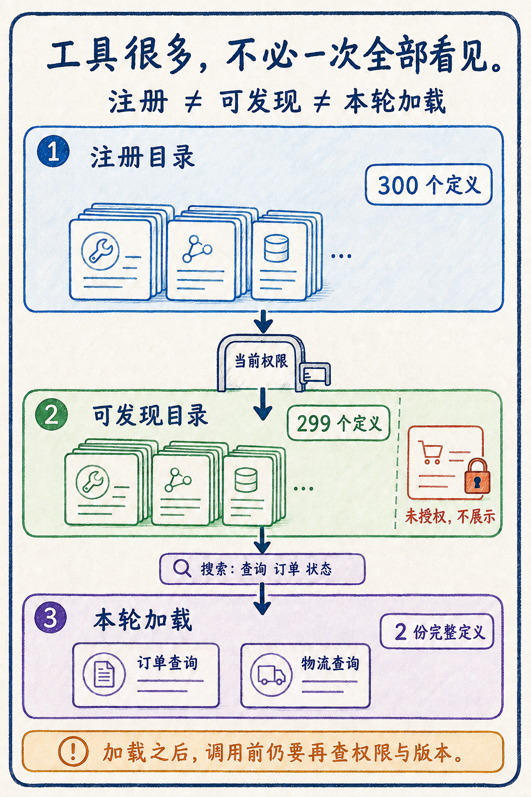
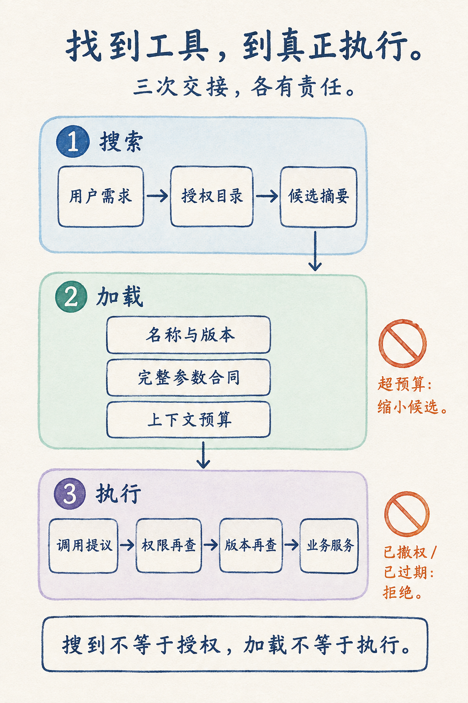
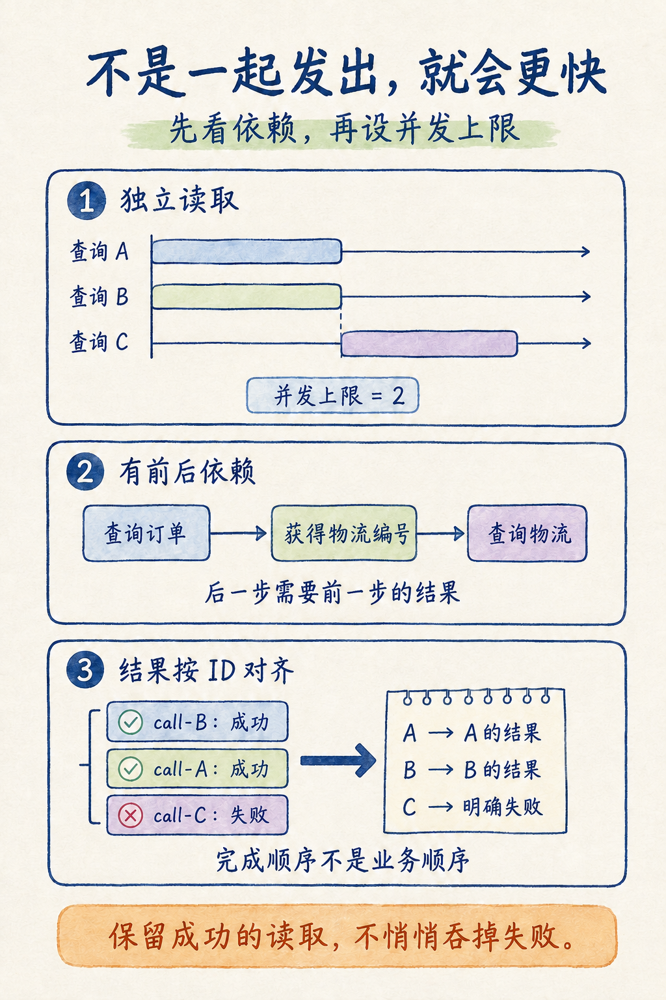
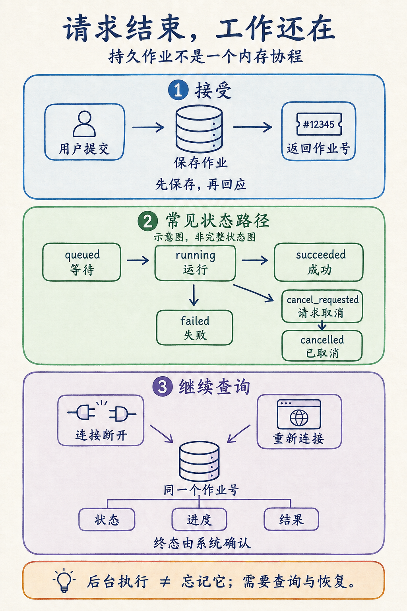
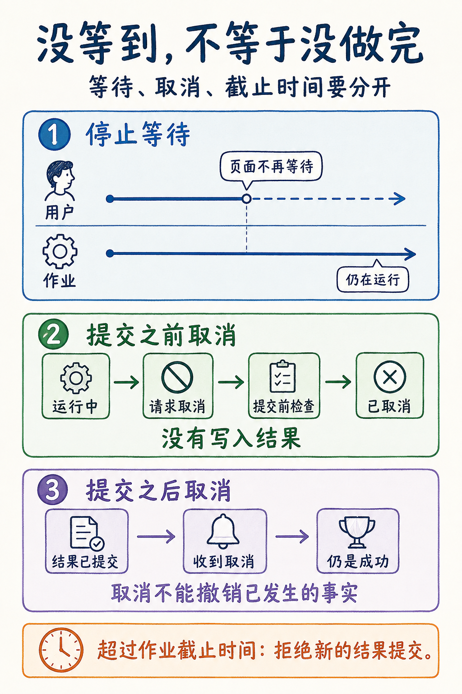
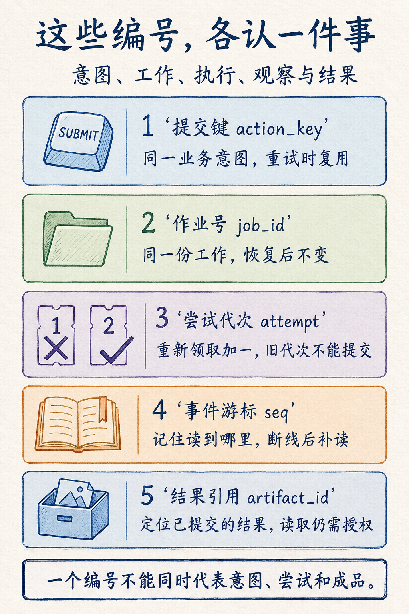

# 第 10 章 大规模工具集与异步任务

> 本章阅读目标：工具多了，知道怎样让模型按需发现；事情做得久了，知道怎样让系统持续负责。
>
> 当前为 v1.1 修订稿，基于 2026 年 9 月 8 日发布的 v1.0 优化，尚未发布本次修订。产品资料核对至 2026 年 9 月 7 日。实验使用 Python 3.11 及以上版本的标准库，不需要 API Key。

## 从三个工具到三百个工具，变的是什么

假设你正在给公司做一个订单助手。

第一天，它只有三个工具：查订单、查物流、发起退款。用户问“订单 A 付过款了吗”，助手查一下订单，回答“已经付款”。你把三个工具的说明放进请求，程序很短，调试也直观。

一个月后，其他团队陆续接入了自己的系统。现在不仅能查订单，还能查库存、查发票、查采购单、查客服工单、查历史归档；同一种“查询状态”，又有支付状态、发货状态、售后状态。工具目录里已经有三百个名字。

用户仍然只问：“订单 A 付过款了吗？”

为了回答这一句话，模型需要先读完三百份工具说明吗？如果你只保留五个常用工具，那第五个之外的需求又怎么办？如果通过搜索找到了“创建退款申请”，模型能否因为它和“订单”相关就直接调用？这些问题并不是第九章的参数 Schema 再写详细一点就能解决的。

接着，用户又提出一个要求：“导出上个月的销售报表。”小样本只要一瞬间，完整数据却要分批读取、汇总、生成文件。你把接口的等待时间从十秒改成一分钟，报表还是可能在高峰期超时。用户以为没有提交成功，再点一次，后台开始生成两份报表；第一次响应虽然没有到达，第一次工作却没有消失。

于是，工具系统遇到了两种规模变化：一是可选动作变多，二是一次动作活得更久。前者要求我们管理模型眼前的选择，后者要求我们管理请求结束之后的工作。

本章用两个局部例子把它们拆开。前半章仍然查询订单，重点不在订单业务，而在“找工具”；后半章导出一份只有三条有效记录的小报表，重点不在数据量，而在“记住一项尚未结束的工作”。数据少，是为了让你能手算结果；系统边界不会因为数据少而失去意义。

你可以先顺着文字读完两个例子，再运行实验。所有命令都在仓库根目录执行。想先看现象，可以运行：

```powershell
python -m chapter10.experiments --group catalog
python -m chapter10.experiments --group lifecycle
```

本章不要求先会消息队列、分布式锁或工作流框架。遇到租约、幂等键这样的词，我们会先制造一个它要解决的问题，再给它命名。第九章已经讲清“工具调用是提议，执行由系统负责”；这里继续回答：候选提议从哪里来，以及系统要负责到什么时候。

## 三个集合：注册过、找得到、能调用

先不要写搜索算法。我们把“三百个工具”这句话拆开。

注册目录是系统掌握的完整清单。它告诉运行时有哪些名字、对应哪个实现、需要什么权限、当前是什么版本。目录可以放在代码、数据库或外部服务里；它不必全部进入模型的上下文。就像公司有三百种业务能力，并不意味着每位员工的桌面上都摊着三百本操作手册。

可发现目录是当前身份允许查到的工具范围。本章把未授权工具连名称和摘要一起过滤。原因很简单：如果某个内部工具的名称就暴露了未公开业务，仅仅禁止最终执行仍然不够。生产系统也可能允许用户看到某些不可执行能力，以便申请权限，但那是另一种明确设计，不应由搜索器偶然决定。

本轮加载的定义，是这一次模型请求真正能够使用的工具合同。目录中可能有二百九十九个可发现工具，而本轮只加载订单和物流两份定义。加载不是把代码拷进大模型，也不是给模型临时开通业务权限；它只是让模型获得足够完整的说明，可以生成结构正确的调用提议。



图中的数字来自本章夹具：注册三百个定义，当前身份没有退款写权限，因此可发现二百九十九个；搜索“查询 订单 状态”后加载两个。这里的三百不是三百个真实外部系统，其中二百九十六个是为了观察目录体积而生成的归档定义。实验不会通过这些名字访问任何公司数据。

还有一个没有画成固定圆圈的集合：此刻真正允许执行的动作。为什么强调“此刻”？因为用户可能在加载后失去权限，工具版本也可能发生更新；同样的工具，访问自己部门的数据与访问其他部门的数据，授权结果还可能不同。它不是“本轮加载集合”的永久别名。

| 对象 | 主要回答什么 | 谁负责 | 容易犯的错 |
| --- | --- | --- | --- |
| 注册目录 | 系统知道哪些能力 | 工具注册与服务管理 | 把所有描述直接塞给模型 |
| 可发现目录 | 当前身份可以知道哪些能力 | 身份与发现策略 | 搜索后才过滤，先泄露名称 |
| 本轮工具定义 | 模型这一步可以提出哪些调用 | 上下文装配与加载器 | 只给名字，不给完整参数约束 |
| 执行许可 | 这次动作现在能否发生 | 执行网关与业务服务 | 把“之前看过”当作“现在有权” |

分开以后，后续接口就容易理解了：搜索返回候选，加载返回合同，执行网关决定能否动手。它们可以部署在一个进程里，不需要为了这张表创建四个微服务；这里分的是责任，不是机器数量。

## 从一个能手算的工具搜索器开始

我们的最小目录里有三个容易混淆的工具。

```text
orders.get       查询一笔订单的支付与履约状态；只读，不发起退款。
shipments.get    查询一笔订单的物流运输状态；不返回支付状态。
refunds.create   为已支付订单创建退款申请；会产生写入，需要审批。
```

注意这些描述不是“处理订单相关操作”。每份说明都写了它能做什么、不能做什么，以及动作是否产生写入。名字相近时，清晰的业务边界比堆叠更多形容词有用。搜索器也不能替含糊的业务设计收拾残局：如果两个工具都叫“获取信息”，描述都叫“获取所需信息”，更强的模型也缺少区分依据。

完整的教学对象在 [catalog.py](../chapter10/catalog.py) 中。第一遍只看 `name`、`keywords` 和 `permission` 三个字段就够了。`version` 和 `digest` 留到后面再讲。

```python
Tool(
    name="orders.get",
    description="查询一笔订单的支付与履约状态；只读，不发起退款。",
    keywords=("查询", "订单", "状态"),
    permission="orders:read",
    effect="read",
)
```

用户原话可以是一整句自然语言，但为了让每一步都看得见，本章搜索接口接收空格分隔的关键词。这个输入约定很重要：示例中的 `split()` 不是中文分词器，不能声称它已经理解“帮我看看包裹到哪了”。真实系统要么先把用户需求转换成查询，要么使用能处理自然语言的检索器。我们先冻结这一步，专门观察工具目录的边界。

### 先过滤，再计算分数

设查询是“查询 订单 状态”。订单工具的关键词恰好包含这三个词，得三分；物流工具包含“查询”和“状态”，得两分；退款工具虽然包含“订单”，但当前身份没有退款权限，所以它根本不进入打分集合。

这可以写成非常朴素的规则：

```python
words = set(query.casefold().split())
for tool in catalog:
    if tool.permission not in grants:
        continue
    score = len(words.intersection(tool.keywords))
    if score > 0:
        candidates.append((score, tool))
```

这是实现中搜索循环的等价摘录，不是完整函数；排序、结果封装和输入检查见源码。排序按分数降序，再按工具名排序，第二条规则只是为了让平分结果可复现。它不表示字母靠前的工具业务上更合适。

搜索结果没有带上所有参数 Schema，而是先给出名称、短描述、动作类型和版本标识。读者现在可以把它理解为图书馆的检索卡片：先知道书可能在哪，再去取那一本书，而不是把整座书库的正文一并寄来。

如果输入“火星 着陆”，结果是空列表。返回空列表不是系统崩溃，它表达“在这个目录、这些权限和这套检索规则下没有找到匹配项”。这比硬把第一名交给模型更诚实。尤其是在写操作场景里，“总得选一个”可能把无答案问题变成错误动作。

这一步和第八章 RAG 确实有相似之处：都要从大集合里找到少量相关项。但搜索对象不同。RAG 主要找回答依据，这里找可执行能力的描述。后者后面连着副作用，所以除了相关性，还必须带着权限、版本、读写性质和调用约束一起往下走。

### 相关不等于适用，更不等于批准

现在把查询缩短为“状态”。订单和物流都得一分。搜索器已经完成了它的工作：找到了两个相关候选；它没有获得凭空判断用户到底关心付款还是运输的能力。

正确的后续动作可以是利用已有上下文消歧。如果上一句是“快递三天没动了”，物流查询更合适；如果没有这类信息，就问“你想查支付状态，还是物流状态？”无论采用哪种办法，都不应该偷偷把稳定排序的第一项当作业务真相。

另外，搜索可以把一个写工具列为相关候选，但不能因此批准写入。设用户拥有退款权限，输入“订单 退款”会找到退款工具；用户仍然可能只是问“退款规则是什么”。检索只说明词和功能接近，意图判断、参数验证、审批与执行授权依旧要由后续链路完成。

当工具真的变多时，关键词交集通常不够。可以用 BM25，解决词频和稀有词的重要性；可以用向量，识别“包裹到哪了”与“查询物流”的语义接近；可以做两阶段检索，先从大目录取几十个候选，再用模型或重排器缩小范围。不要急着争论哪一种最先进，先准备一组能区分失败原因的查询。

例如，把“按准确名称查工具”“用业务俗称查工具”“缺少权限”“没有对应能力”“两个候选同样合理”分别列出来。若准确名称都找不到，先查索引和过滤；若俗称找不到，查同义词和语义检索；若未授权工具出现，先修权限边界。把三种问题混成一个检索分数，反而会让优化没有方向。

评价工具搜索时，候选覆盖和误导程度都要看。只保留一个候选，描述很省，但可能把真正需要的工具挤掉；保留二十个，相关能力更容易出现，却把选择困难重新交给主模型。候选数量没有脱离任务分布的最佳值。本章取两个，是为了比较订单与物流，不是建议所有生产系统都用二。

## 搜索之后，为什么还要有加载这一步

假如搜索返回 `orders.get`，模型下一步应该传 `order_id`，还是传订单内部主键？日期格式是什么？空值允许吗？没有完整定义，模型可能挑对工具却写错参数。

所以，目录摘要只负责“这可能是我要的能力”，加载器负责“这是当前可调用的准确合同”。先缩小候选，再加载合同，称为按需加载或延迟加载。这里延迟的是工具定义进入模型上下文的时机，不是把必要参数校验推迟到出错之后。



为了让读者聚焦装配流程，本章目录夹具给每个工具使用同一种简化的 `record_id` Schema。它们只用于衡量定义加载，不提供订单服务的可执行适配器。后半章报表作业另有真实入口 `submit(..., {"month": ...})`。两套接口不直接接线，不能把目录中演示用的 `record_id` 当成报表代码的月份参数。

这是一处有意的取舍：工具发现和作业运行各有一个最小可检查实现，不靠一个充满适配代码的大应用串起来。若你要把它们整合成产品，第一项工作就是让注册定义与真实处理函数共享合同，并复用第九章的参数、输出验证器。

### 预算约束完整定义，不截断合同

运行第一组实验，会看到下面几个数。

| 测量对象 | UTF-8 序列化字节数 | 口径 |
| --- | ---: | --- |
| 全量授权定义 | 93,644 | 二百九十九份教学工具定义 |
| 常驻搜索入口 | 150 | 用于引导模型寻找工具的教学描述 |
| 两个候选的摘要 | 452 | 含名称、版本、摘要与摘要指纹 |
| 两份加载后的定义 | 810 | 含完整教学 Schema 与指纹 |
| 按需路径的可见载荷合计 | 1,412 | 上述后三项相加，不只统计两份 Schema |

数值来自规范报告 [tool-jobs-evidence.json](../chapter10/reports/tool-jobs-evidence.json)，不是手工填入的预期。它说明这个夹具中，按需路径减少了需要展示的描述载荷。它不说明真实请求已经省下同样比例的 Token、费用或时延：实际 API 有消息包装、隐藏格式、缓存和搜索往返，Tokenizer 也不是 UTF-8 编码器。

即便暂时只测字节，也应该把搜索入口和候选摘要算进去。否则等于拿“全量路径的全部说明”比较“按需路径的最后一小步”，漏掉了为搜索付出的成本。生产评估要继续记录请求真实 usage、缓存命中、工具搜索次数和用户等待时间，才能判断最终是否划算。

加载器还有一个预算参数 `budget_bytes`。本章默认是四千零九十六字节，专门作为确定性教学门槛，不是模型上下文容量。若整批定义超过预算，抛出 `definition_budget_exceeded`，不返回半份 JSON，也不把最后一个工具的必填字段裁掉。

为什么不能直接截断？因为摘要可以压缩，合同不能随意缺项。少一句介绍可能只是不好读，少一个“必须审批”提示或一个参数约束，却可能改变调用含义。预算不够时，应该减少候选、拆分任务，或要求更明确的查询。即使后续重新设计 Schema 来减少冗余，也应产出一份完整的新版本，而不是剪掉旧版尾部。

这个顺序也适用于较大的业务命名空间：先展示“订单”“财务”“知识库”等高层描述，再打开相关分组。分层目录会带来额外查找步骤，但能避免让第一次请求就装载大量细节。目录层级过深则会使模型反复寻路，因此分组应反映用户容易表达的业务边界，而非照搬公司复杂的组织树。

### 缓存和版本：昨天读过，不代表今天还能用

工具定义通常变化不频繁，于是你可能想缓存已经加载的结果。这很合理，但先看一个反例。

上午，`reports.export` 支持按自然月导出；下午，它升级为按结算周期导出，参数解释变化了。模型拿着上午的定义继续请求，JSON 也许仍然合法，业务含义却已经变了。这类错误比“缺少一个字段”更难发现，因为程序可能正常返回了错误范围的数据。

本章给目录项同时保存版本号和内容指纹。版本号让人知道合同经历了哪次变更，指纹让程序判断当前内容是否与加载时一致。指纹用规范化 JSON 计算：键排序、固定分隔符，再对 UTF-8 内容计算 SHA-256。它不是授权令牌，更不是数字签名；在这里，它只是检测定义是否变化的标签。

加载时检查一次，执行前再检查一次。前者防止搜索结果已经过时，后者防止定义加载后又变化。实验把版本从 `1` 改成 `2`，旧候选再加载就得到 `stale_definition`；把授权集合清空，已加载定义再进入执行网关就得到 `denied`。

缓存键也不能只有工具名。至少要考虑工具版本、身份或租户范围、发现策略版本等影响可见性的条件。否则甲用户缓存了一个财务工具，乙用户可能直接拿到同一份缓存结果。对于已撤销权限的用户，缓存尚未过期不是继续授权的理由。

更严格地说，加载器的最后一次检查仍不是整个世界的最终边界。检查通过后、外部 API 真正处理之前，权限也可能变化。业务服务自身还应执行对象级授权，必要时绑定短期授权上下文。这里的本地 `authorize()` 证明的是“当前调用使用当前目录和权限再查”，并没有实现跨服务的原子授权事务。

到这里，前半章的主要链路已经形成：搜索不替代判断，加载不替代授权，缓存不替代当前事实。工具多了以后，最先增加的应当是这些连接规则，而不是把三百份说明一次性交给模型的能力。

## 找到了几个工具，能不能一起调用

用户不只想知道订单 A 的付款状态，还想同时知道订单 B 和 C 的情况。现在你已经找到了合适的只读工具。最直接的程序是查完 A，再查 B，最后查 C。

假设三次查询各要等待两百毫秒，串行等待约六百毫秒。如果三个查询互相独立，可以同时发出，让等待区间重叠。理想情况下，总等待接近最慢的一次，而不是三次之和。这只是便于理解的算例；实际还包含连接池等待、网络波动、服务限流和返回数据处理。

“可以并发”不意味着“应该同时发出所有请求”。如果用户给了一万个订单号，你把一万个协程一起创建出来，即使其中只有少量正在访问网络，也已经引入了大批待调度对象、结果缓冲和取消清理工作。下游服务的并发容量也不会因为调用者用了异步语法就增加。

这里要分清并发和并行。并发强调多件事情在同一段时间内交错推进，尤其适合等待 I/O；并行强调在多个执行资源上同时计算。Python 的一个事件循环可以在网络等待时切换协程，但不会自动把耗 CPU 的大计算分到多个核心。若导出报表主要耗在压缩、图像处理或密集计算，应另选进程池或专门工作节点，而不是只给函数加上 `async`。[^python]

### 先画依赖，再决定串行还是并发

判断并发最可靠的问题不是“这两个函数有没有 await”，而是“后一个动作是否需要前一个的结果，或会与它争用同一份可变状态”。

独立查询 A 和 B 的订单状态，通常可以重叠。如果要先查订单，拿到物流编号，再查物流，则第二步需要第一步产出的参数，不能为了追求速度凭空猜出一个编号。如果要先退款，再查询退款后的订单状态，第二步还需要满足业务一致性要求，不能与第一步随意同时发出。



还要留意一种更隐蔽的依赖：两个操作参数不同，却共享一个账户额度。它们都可能先读取余额再扣减；从函数签名看没有前后关系，从业务上看却有竞争。应用端调度不能替代数据库或服务端的并发控制。不要因为两个动作都被模型排在同一轮，就推断它们可以安全并行。

对于读操作，失败处理通常也更温和。三笔查询里 C 临时失败了，A 和 B 的结果不应凭空消失。界面可以明确返回“已查到 A、B；C 暂时不可用”。对于一组必须整体成功的写操作，部分完成则可能需要事务或补偿。它们不该共用一条“出错就重试全部”的默认规则。

这也是我们先实现“有限并发读取”，没有直接写一个万能批量执行器的原因。动作性质先决定错误语义，语义再决定调度方式。代码复用应该发生在边界想清楚之后。

### 用固定数量的 worker，而不是无限创建任务

`worker` 可以先理解为一个不断领取下一件工作的执行者。本章不把它等同于一台机器；并发读取实验中的 worker 只是事件循环里的协程。两个 worker 共享一份待处理列表，各自拿一项，等待结果，完成后再拿下一项。

[concurrency.py](../chapter10/concurrency.py) 的核心非常短：

```python
pending = iter(calls)

async def worker():
    for call_id, argument in pending:
        try:
            results[call_id] = {"value": await read(argument)}
        except Exception as error:
            results[call_id] = {"error": type(error).__name__}

async with asyncio.TaskGroup() as group:
    for _ in range(min(limit, len(calls))):
        group.create_task(worker())
```

这段是实现的核心摘录。完整函数还检查并发上限必须为正、调用 ID 必须唯一，并把输出按 ID 稳定排序。读取失败时只保留异常类别，不直接把异常文本里的内部参数带给模型。生产服务应使用明确的错误码和经过脱敏的说明，这里用异常类别展示部分失败即可。

为什么两个 worker 不会取到同一项？因为它们共享的是同一个事件循环，领取下一项的那一步没有 `await`，不会在这一步中途切换协程。这个解释有适用范围：它不支持多线程共享同一迭代器的任意操作，也不意味着跨进程队列可以省掉原子领取。

实验用一个屏障确保前两个读取确实同时处于在途状态，再放行继续执行。观测到的 `peak_in_flight` 是二，与配置的上限一致。我们没有用“程序看起来只跑了一小会儿”来猜测并发发生，也没有把 `sleep(0)` 的调度让步包装成真实网络性能测试。

```powershell
python -m chapter10.experiments --group concurrency
```

输出中 A 和 B 成功，C 返回 `LookupError`；三者按 `call-A`、`call-B`、`call-C` 关联。若只按返回顺序往列表里追加结果，最快完成的 B 可能被错贴到 A 上。业务身份不能由完成顺序推断，这是并发环境里很常见、也很容易通过小测试抓住的错误。

`TaskGroup` 把 worker 的生命期收在当前函数内部：函数正常返回时，子任务都已结束；外层取消时，取消会传播。代码没有捕获 `BaseException` 来吞掉取消信号。把取消伪装成普通读取失败，会让调用者以为操作已经停止，实际上工作还在后台继续。

固定 worker 数也不等于已经实现无限输入流的背压。本函数仍然接收一份有限列表，因此输入规模应有上限。对于持续进入的请求，要使用有容量的队列，让生产者等待、拒绝或降速；只限制正在执行的数量，却允许等待队列无限增长，内存和等待时间迟早会代替下游服务先出问题。

### 确定性的循环，不必每一步都问模型

现在再看三笔订单查询。模型真正需要决定的是：用户要查哪些订单，使用哪种读取能力，最后怎样解释结果。一旦计划确定，“依次处理列表”“汇总金额”“按状态分组”往往是稳定的程序逻辑。

如果每查一笔都把整份结果送回模型，再让模型说“继续查下一笔”，你会为本来确定的循环付出多次模型往返。更合适的安排有时是让程序执行这段小循环，只把用户需要的摘要交给模型。需要语义判断的分支保留给模型，确定的数据搬运和计算交给代码。

Anthropic 的工程文章把这条思路用于工具编排：在代码执行环境中调用工具、过滤中间结果，减少反复把大结果送进模型上下文的需要。它是另一种编排表面，不是因为“用了代码”就自动获得安全性。生成代码需要受控执行环境，工具仍需独立授权，外部返回值仍是不可信数据。[^code-mcp]

本章没有执行模型生成的 Python，也没有 `eval` 任意字符串。并发函数和报表循环都是预先写好、可以检查和测试的代码。先掌握这个边界，再考虑让模型生成编排程序，会比从一个无限制 shell 开始更容易定位风险。

不要把“工具多”直接等同于“必须使用代码执行”。只有几个步骤且每一步都需要根据结果推理，普通工具循环可能更清晰。需要大量确定性循环、筛选或聚合时，程序化编排才更有吸引力。选型依据是控制流和数据量，而不只是工具菜单的长度。

## 当一次调用放不下整个任务

到目前为止，所有工作仍然发生在一次等待期内。假设查询只需几百毫秒，这样很自然。现在换成导出销售报表：从数据源读取记录，按月份筛选，计算汇总，写入结果，然后交给用户。

如果整个过程要几分钟，用户不应该一直盯着一个没有状态的转圈。代理服务器、浏览器、调用方 SDK 也可能各有自己的超时。继续扩大其中一个超时，不会自动解决其他层的断开，更不能解释断开后任务是否还在运行。

这里要改变的不是“等多久”，而是返回值的含义。短调用返回最终结果；长任务先返回一张凭证，告诉你“工作已被接受，可以通过这个编号继续查询”。我们把这张凭证对应的持久工作对象称为作业，英文常叫 job。

### 一个协程不是一份持久作业

假设 Web 接口里写了 `asyncio.create_task(export_report())`，然后立即回答“正在生成”。它看起来已经是后台工作：请求不必等待，函数继续运行。但如果进程重启，协程、局部变量和内存里的任务字典都可能消失。用户拿着之前的编号来查，系统也许已经不知道自己承诺过什么。

异步语法主要解决当前程序怎样安排等待；持久作业解决系统怎样跨越请求和进程生命期保存承诺。两者可以一起用，却不能互相代替。你可以用同步 worker 执行持久作业，也可以用异步 worker 执行；关键是作业身份、状态和结果存在哪里，谁负责重新领取和继续处理。

这和第六章的长任务状态也有联系，但不是同一份东西。Agent 的检查点可能记着“我已经提交了八月份报表，作业号是一”；业务作业库则记着“作业一正在由第二次尝试执行，结果尚未提交”。恢复 Agent 对话时应重新查询作业，不应仅凭聊天记录里的“正在运行”认定外部状态仍然如此。

反过来，业务作业执行结束，也不能自动表示用户的整体目标完成。用户可能要求“导出后比较七八月差异并说明原因”，报表只是其中一步。作业终态、工具调用完成、Agent 任务验收，是三个不同层次，不能共用一个没有范围说明的 `done=true`。

### 先收好提交凭证，再结束请求

我们希望提交接口返回这样一个小对象：

```json
{
  "id": 1,
  "state": "queued",
  "attempt": 0,
  "done": 0,
  "total": 0,
  "error": null
}
```

它没有说报表已经生成。`queued` 只说明作业已进入系统；`attempt` 为零说明还没有 worker 领取；`total` 为零说明尚未确定处理规模，不是“总共零条，所以已经完成”。状态字段和进度数字要一起解释。

这份对象必须在作业持久保存成功之后返回。若先把编号发给用户，再尝试写数据库，数据库失败时就会出现“用户有凭证，系统没记录”的空头承诺。对外回执和内部事务的先后顺序，比回执 JSON 长得是否漂亮更重要。

本章的调用方式是：

```python
store = JobStore(path)
job_id = store.submit(
    "alice",
    "august-report",
    {"month": "2026-08"},
    now=0,
)
```

第一项是可信调用方传入的所属身份，第二项是这次业务意图的提交键，第三项才是报表参数。`now=0` 使用逻辑时间，便于稳定注入后面的超时场景，不代表真实系统以零点为运行时钟。真实服务应由可信运行时提供时间，而不能让请求者随意传入 `now`、权限集合或所属身份。

提交键先记住一个直观用途就够了：当响应丢了，用户再次提交同一件事，系统能认出“这不是新订单”。它与作业号的具体区别，我们会在幂等一节展开。

## 把作业状态写在数据库里

持久化不等于把所有东西都写成复杂事件模型。我们的报表实验只需要三个表。

`jobs` 保存当前工作状态，例如所属用户、提交意图、尝试次数、截止时间和进度。`receipts` 保存成功提交的报表结果，每份作业最多一条。`events` 保存状态变化和进度事件，用于解释发生过什么以及断线后补读。三个表放在同一个 SQLite 数据库里，方便展示一个本地事务边界。

这并不是高吞吐作业平台的推荐部署图。选 SQLite，是因为读者不用先安装队列和数据库服务，就能亲手观察关闭连接、重新打开之后作业是否还在。事务、唯一约束和状态检查都是真实执行的，不是拿字典伪装成持久存储。



作业库使用 `BEGIN IMMEDIATE` 开启写事务，把“读取当前状态”和“决定怎样修改”放在同一次事务里。这样，在本地数据库的串行写入控制下，两个连接不会都基于同一份未更新状态完成领取。事务并不神奇，它只是让我们可以准确划出哪些动作作为一个整体提交。[^sqlite]

所有对外查询都检查所属身份。知道 `job_id=1` 不应该就能读到另一个用户的报表；同样，取消、读取进度、取结果也要检查。源码里的 worker 方法是内部接口，不应直接映射成无需鉴权的 HTTP 路由。示例没有实现登录系统，调用方必须先认证，再把可信身份传入作业库。

### 六个状态，比一个布尔值更能说清发生了什么

我们使用六个状态：等待领取 `queued`、运行中 `running`、请求取消 `cancel_requested`、成功 `succeeded`、失败 `failed`、已取消 `cancelled`。后三个是终态：一旦到达，原作业不再重新运行。用户若想重新发起一个新的业务意图，应使用新的提交键。

最常见的路径是 `queued → running → succeeded`。若 worker 遇到允许重试的临时错误，作业会回到 `queued`，但带有最早可再次领取的时间；这不需要额外增加一个“重试中”状态，因为排队状态和时间已经能表达含义。若错误不可重试，进入 `failed`。

为什么保留 `cancel_requested`？因为“收到取消请求”与“确认已停止”之间可能有时间差。用户在报表生成过程中点取消，系统先记录意图，worker 在安全检查点看到它，停止提交结果，然后才进入 `cancelled`。若直接把收到请求当成完成取消，界面就可能承诺了一件执行端尚未做到的事。

状态名不是越多越专业。若再引入等待审批、等待外部回调、结果过期等需求，可以增加对应状态，也可以把部分条件建模为独立字段；先问它是否改变合法动作。第一版就塞进十几种没人能解释的状态，只会让恢复逻辑更难测试。

另一方面，状态少也不能靠模糊来实现。“处理失败”和“当前还不知道结果”不是同一种状态。尤其对外部写操作，超时后是否发生副作用可能暂时未知；不能为了套进这六种状态就假装已经确认失败。本章把所有写结果放在同一个数据库内，暂时避开了这种分布式不确定性，生产适配器必须单独处理。

图 10-4 帮你先记住常见路径，不是完整的状态转换图。阅读代码时，可以用下面这张表补齐它省略的分支。表中“到期”都需要一次接口检查来确认，数据库不会自己在时间到达时改变字段。

| 当前状态 | 触发条件 | 接下来发生什么 |
| --- | --- | --- |
| `queued` | 到达可领取时间，期限与尝试预算仍有效 | 变为 `running`，尝试代次加一 |
| `queued` | 用户取消 | 直接变为 `cancelled` |
| `queued` / `running` | `claim()` 检查到截止时间或可重新领取时的尝试预算耗尽 | 变为 `failed`；不会增加新的尝试 |
| `running` | 临时错误，允许退避重试且仍有预算 | 回到 `queued`，等待 `not_before` |
| `running` | 租约过期后被重新领取，其他预算仍有效 | 仍为 `running`，但尝试代次加一，旧提交被拒绝 |
| `running` | 有效尝试提交结果，或报告不可重试错误 | 分别变为 `succeeded` 或 `failed` |
| `running` | 用户取消 | 先变为 `cancel_requested` |
| `cancel_requested` | 有效 worker 在提交/失败处理时确认，或租约到期后由 `claim()` 回收 | 变为 `cancelled`，不创建结果回执；不表示进程已被物理终止 |
| 任一终态 | 再次取消或查询 | 保持原终态，不重新执行 |

### 跑一份可以手算的报表

夹具中共有四条销售记录。A、B、C 属于八月，金额分别是一千、两千、三千分；D 属于七月，金额为九千九百分。

我们故意以整数“分”为单位，避免把浮点金额误差引入当前教学主线。报表按月份筛选后，应保留三条记录，合计六千分，也就是六十元。七月的记录不该因为它恰好在列表中就混入八月报表。

`lifecycle_experiment()` 先提交作业，关闭数据库连接，再建立一个新连接。随后领取同一个作业号，逐条汇总并写进度，最后把报表提交到结果表。这里的重新连接展示持久记录不依赖原连接；它不是操作系统断电恢复测试，也没有证明所有磁盘故障都能被 SQLite 抵御。

```python
rows = [row for row in SALES if row["month"] == "2026-08"]
total = 0
for index, row in enumerate(rows, 1):
    total += row["amount_cents"]
    store.progress(job_id, attempt, index, len(rows), now=index + 1)
store.finish(
    job_id, attempt,
    {"month": "2026-08", "row_count": len(rows), "total_cents": total},
    now=5,
)
```

这是完整实验中的计算部分。模型负责理解用户想要哪份报表，月份筛选和金额汇总由程序完成。这里还要分清两种验证：作业库检查的是“这次尝试现在能否提交”，报表业务层负责“提交的内容是否符合业务要求”。`finish()` 不会重新计算销售额；即使传入空字典，只要提交条件成立，它也能保存该对象并标为成功。因此，`succeeded` 表示作业结果已提交，不能单独证明报表内容正确。

当前夹具的业务正确性由测试独立核验：三条八月记录、合计 6,000 分，七月记录不得混入。真实系统还需要在业务层检查结果字段、月份与输入快照，并按需要复核条数或汇总；这些检查应在调用 `finish()` 前完成。内容指纹用于识别结果，也不能代替这些业务检查。

进度依次是三分之一、三分之二、三分之三。但第三条数据处理完后，作业还要提交结果；因此 `done=total` 不等于 `succeeded`。对于包含上传、签名或校验阶段的任务，更不能把读取阶段的百分比直接冒充全流程完成度。

进度在同一次尝试内不允许倒退，任务重试开始时可以重新计算，并带上新的尝试代次。界面因此应显示“第二次尝试，已处理一条”，而不是把第一次尝试的百分比与第二次混在一起做一条永远上升的假曲线。

读完这段，再打开固定事件文件 [job-events.jsonl](../chapter10/reports/job-events.jsonl)。你会看到排队、领取、三次进度、成功六个事件。它们是程序在真实状态变化时写入的，不是模型在最后编出来的工作回顾。

### 先完整跑通，再加入故障

如果前面的片段让你记住了很多接口，却还没有把顺序连起来，先运行这个新增入口：

```powershell
python -m chapter10.quickstart
```

它使用临时 SQLite 数据库，运行结束后清理，不需要搭建服务器。完整源码见 [quickstart.py](../chapter10/quickstart.py)。核心流程如下；外层的数据库创建、关闭和输出由该文件提供：

```python
month = "2026-08"
job = store.submit("alice", "august-report", {"month": month}, now=0)
states = [store.get("alice", job)["state"]]

attempt = store.claim(job, now=1)
if attempt is None:
    raise RuntimeError("No execution lease acquired")
states.append(store.get("alice", job)["state"])

rows = [row for row in SALES if row["month"] == month]
total = 0
for index, row in enumerate(rows, 1):
    total += row["amount_cents"]
    store.progress(job, attempt, index, len(rows), now=index + 1)

report = {"month": month, "row_count": len(rows), "total_cents": total}
if not store.finish(job, attempt, report, now=5):
    raise RuntimeError("Result was not committed")
states.append(store.get("alice", job)["state"])
result = store.result("alice", job)
```

运行后，`states` 依次为 `queued`、`running`、`succeeded`；`result.data` 中月份是 `2026-08`、条数是 3、总额是 6,000 分；事件列表中间还有三次 `progress`。领取失败时不能继续假装自己有资格工作，提交返回 `False` 时也不能直接宣布成功。

现在可以用一句话解释这段程序：先给工作登记并领取执行资格，再计算和记录进度，最后提交并取回成品。这条正常路径使用手动安排的逻辑时间，不是自动调度的后台服务。下面的取消、重试和租约，都是在这条路径上加入“不顺利时怎么办”；第一遍阅读时，先把这条线记牢。

## 等待、执行、截止时间：先分清三种超时

“超时了”是一句信息严重不足的话。是页面不再等，某次网络请求超时，worker 的领取资格到期，还是整个业务已经过了截止时间？如果日志里只写一个 timeout，恢复程序和用户都很难知道应该继续查、重试，还是彻底停止。

先把最常见的三只钟分开。等待超时属于调用者：我只愿意在这个界面等五秒，五秒后先返回状态。单次执行超时属于一次尝试：这次查询最多占用十秒。任务截止时间属于整个业务意图：无论排队和重试多少次，都必须在一分钟内结束。

| 时间约束 | 到期后最直接的含义 | 不自动意味着什么 |
| --- | --- | --- |
| 调用者等待时间 | 此次等待结束，可以稍后再查询 | 后台作业失败或副作用没有发生 |
| 单次尝试时间 | 当前尝试不能继续无限占用资源 | 一定可以安全重试写操作 |
| 作业截止时间 | 整件工作不再有新的执行预算 | 已发生的外部副作用被撤销 |
| 领取租约 | 当前 worker 的提交资格到期 | 该进程已经被系统杀死 |

租约先在表里留一个位置，下一节会通过“旧 worker 回来了”解释。它与执行超时常常采用相近时长，但职责不一样：一个管理谁有资格提交，一个管理一次执行能占用资源多久。

设报表在逻辑时刻零被接受，截止时间是三。worker 在时刻一开始运行，时刻三尝试提交。我们的规则是 `now >= deadline` 即到期，所以结果不会写入，作业进入失败状态，错误为 `deadline_exceeded`。如果只在开始前检查一次截止时间，那么一次很慢的执行仍能越过最终期限提交，这就是实验要堵住的漏洞。

再看调用者等待。用户在时刻二离开页面，作业并不因此变成失败。实验的 `stopped_polling_job_state` 仍然是 `running`，因为读取者只是停止查询，没有发出任何改变作业状态的请求。这一项展示的是作业接口的语义，不是在模拟一次真实 HTTP 超时。

在 Python 中，`asyncio.wait_for()` 超时会向被等待任务发出取消，并等待取消处理；因此不能把它随意套在一个希望继续存活的内存任务外面，就宣称“只停止等，不停止做”。若需要后台继续执行，应把工作交给具有独立生命期的作业系统，只给查询或轮询设置等待期限。[^python]

这个区分还有一个实际好处：你可以为用户提供明确的界面文案。“暂时没有等到结果，作业仍在运行，可以稍后查看”，和“作业已超过截止时间，未提交本地结果”，表达的是两件不同的事。清晰文案来自清晰状态，而不是最后再让模型润色一句模糊的错误提示。

### 重试前先问：为什么失败，再试是否会改变事实

假设读取报表数据时，依赖服务短暂不可用。过几秒再查可能成功，这是临时错误。若月份参数不合法，或者用户没有读取该报表的权限，再尝试相同请求通常没有意义，应先修正输入或授权。

还有一类错误要格外谨慎：请求已发出，但响应丢失。你不能确定对方有没有完成。对于只读查询，重复读取往往可以接受；对于付款、退款、发消息等写操作，盲目重试可能产生第二次副作用。错误类型相同，并不意味着不同工具的重试策略也相同。

因此，重试策略需要动作语义。是否只读、是否支持业务幂等键、是否能查询外部状态、是否已经越过提交点，都应进入判断。不能只写 `except Exception: retry()`，然后把它称为容错。

本章 `fail()` 通过显式的 `retry_after` 区分是否请求再次尝试。它不猜错误文本，也不让模型自行判断某条数据库异常是否安全。固定实验把 `temporary` 标为可重试，把 `bad_input` 标为不可重试。真实适配器应按服务合同映射错误码，而不是照搬这两个字符串。

一份作业最多尝试两次，第一次在时刻一领取，时刻二失败，要求等待三个时间单位。于是最早重试时间是五；时刻四领取返回空，时刻五才得到第二次尝试。第二次仍失败，作业结束，不再无限排队。这里“最多两次”包含首次执行，不是“首次之后再重试两次”。

退避可以固定间隔，也可以指数增长；大批客户端同时重试时，通常还要引入抖动，避免它们在同一秒重新压垮服务。本章为报告可复现使用固定退避，不用没有种子的随机数。它展示了“不是立即重试、不是无限重试”，没有模拟大规模流量恢复。

重试预算还要受整个任务截止时间约束。如果下一次允许尝试的时刻已经不早于截止时间，继续排队只是让一个注定无预算的任务占据位置。作业库会直接失败，而不是让用户等到下一次 worker 扫描才知道无法继续。

最后，警惕多层重试相乘。SDK 重试三次、工具运行时重试三次、作业系统再重试三次，并不等于全链路只重试三次。某次用户动作可能触发远多于预期的底层请求。应明确哪一层拥有哪个错误范围，并在事件中保留尝试代次，才能看清真正发生的工作量。

### 取消是一个请求，不是时间机器

用户在处理到第二条记录时取消报表，系统该怎么办？最容易实现的做法是把状态直接改成 `cancelled`。但如果 worker 正准备写结果，状态表与实际动作之间就可能发生竞争。

本章把取消分成两步：先记录 `cancel_requested`，再由 worker 或领取检查点确认停止。若作业还在排队，可以直接取消；因为还没有执行者领取，没有在途计算需要协调。若已经运行，就等待安全边界的确认。



我们的安全边界是 `finish()` 写入结果之前的同一个数据库事务。若取消请求先写入，`finish()` 看见它，不产生回执，把状态改成 `cancelled`。若 `finish()` 已经先完成事务，取消会看到 `succeeded`，原样返回，不把成功历史篡改成已取消。

所以，取消和完成谁先赢，不取决于网页上哪个按钮先出现，而取决于被授权的状态修改实际按什么顺序完成。测试分别覆盖“提交前取消”和“提交后取消”，不能只测第一条容易成功的路径。

合作取消还有一个重要限制：worker 必须回到检查点。如果它永久卡在一个不可中断的底层调用里，仅仅设置取消标记不会让那段调用立刻消失。进程终止、沙箱清理、外部任务取消接口、对账与补偿，是其他层需要承担的工作。本地作业状态不能替它们宣称已经停干净。

对写外部系统的任务，还要识别不可逆边界。邮件已经发出，再把本地状态改成取消，不会让收件人忘记邮件。退款已经完成，撤销原操作通常是另一项受规则约束的业务动作，不是把旧事务倒放。取消语义应在工具合同和用户界面里一致表达，尤其不能用“取消成功”掩盖“只是不再等待”。

## 响应丢了，怎样避免再做一遍

现在制造本章最重要的一次故障。报表已经提交成功，系统也已经保存了作业号，但返回给用户的响应丢了。用户看到网络错误，重新点击导出。

如果每次点击都创建新作业，系统无法区分“第一次没收到响应，想确认同一件事”和“我确实要再生成一份新报表”。重复可能只是浪费资源，也可能变成重复发送、重复扣费。稳定的识别方式必须在请求到达之前就由调用方持有，不能等第一次响应成功后才告诉调用方。

这个识别方式就是幂等键，或者更直观地称为业务提交键。幂等不是“一行代码只能执行一次”，而是在约定范围内，多次表达同一个操作意图，不应反复产生新的业务效果。具体保证多强，取决于键的范围、生命周期和实际提交边界。

### 提交键、作业号、尝试代次，分别认什么

`action_key` 认一次业务意图，例如“为 Alice 导出八月份报表的这次请求”。`job_id` 认系统接受后创建的工作对象。`attempt` 认这个工作对象当前是第几次尝试执行。三者相关，但不能互相替代。

第一次请求的提交键为 `august-report`，系统创建作业一。响应丢失后，再用同一个键和同样参数提交，仍返回作业一。worker 失败后重新领取，作业号还是一，尝试代次从一变为二。若用户明确要求“重新生成一份新的报表”，应用应创建新的提交键，而不是继续撞旧作业。

用时间戳或随机值生成提交键本身没有问题，关键是同一意图的重试必须复用原值。若在每次网络重试时都重新生成一个随机键，服务端看到的每次都是“新意图”，去重机制等于没有启用。

键还要有身份范围。本章用 `(owner, action_key)` 唯一约束，因此 Alice 与 Bob 恰好用了相同的字符串，也不会被错误合并。真实系统可能使用租户、用户、业务类型等多层范围，具体取决于哪一层拥有这项业务资源。

那能不能只对参数做哈希，参数一样就当作重复？不一定。用户可以合法地两次发出相同内容的通知，也可以两次导出同一个月份，以获取不同时间点的数据。参数描述“做什么”，提交键补充“是不是同一次意图”。把两者混为一谈，会把应当执行的新操作吞掉。AWS 关于幂等 API 的工程文章也强调由调用方提供可识别意图的标识，并处理同键不同参数的冲突。[^idempotent]

因此，作业库在找到相同键后，还会比较规范化意图。若同键同参数，返回旧作业；若同键却把月份从八月改成七月，返回 `key_conflict`，不偷偷沿用旧结果，也不覆盖原作业。截止时间和重试上限采用首次提交的值，重复提交不是修改作业配置的接口。

这里有一个容易漏掉的顺序问题：假设时刻零提交，截止时间为三，时刻二成功但响应丢了。调用方到时刻四才用原键、原参数和原截止时间重试，系统仍应返回原作业号。此时调用方在找回已受理的工作，并没有要求在期限之后启动新工作。

所以 `submit()` 先检查身份标识与业务参数，再在事务里查找相同意图；有旧记录就返回，参数冲突就拒绝。只有确实要创建新作业时，才检查新提交的截止时间、尝试上限与容量。既有作业即使已经失败或取消，同键重试也只返回原记录；新键配上已过期的截止时间则仍然拒绝。这个顺序修复了 v1.0 中“先检查期限，导致无法找回旧作业”的问题，也避免通过重试延长旧任务预算。

### worker 消失了，旧 worker 又回来了

提交去重解决的是入口问题，执行端还有另一种重复。

worker 甲领取了作业一，开始计算。由于网络停顿或进程暂停，系统迟迟收不到它的动作。为了不永远卡住，worker 乙过一段时间重新领取同一份作业。正当乙准备提交时，甲恢复了，也拿着算好的报表回来。两者都认为“这是我领到的工作”。

仅靠 `state=running` 分不清它们；仅靠 `job_id=1` 也分不清。我们需要一次领取的有效期，以及一个不会在重新领取后继续被旧 worker 冒用的代次。

领取有效期称为租约。它像一张有截止时间的临时工作票：在有效期内，当前 worker 可以提交；到期后，系统允许新的 worker 领取。租约并没有保证甲的进程物理停止，它只定义了甲的提交资格什么时候失效。

尝试代次则是新票和旧票的区别。本章每次成功领取都把 `attempt` 加一。`finish()` 必须同时带着作业号和代次，数据库只接受当前代次，并检查租约尚未到期。代次检查也称为一种 fencing，直译可以理解成“把旧执行者隔在提交边界之外”。第一次读到这个词时，记住“过期工作票不能交付”就够了。

固定故障中，甲在时刻一领取，租约长度是二，因此到时刻三过期。乙在时刻三领取，获得第二次尝试。甲在时刻四提交，得到 `stale_attempt`；乙在同一时刻提交，成功写入一份结果。实验没有依靠谁算得更快，而是显式安排了这条迟到路径。

还有一个值得单独测的角落：甲的租约已经到期，但乙尚未领取。如果只检查代次，甲仍然是当前代次，就能在过期后提交。本章也检查 `lease_until`，因此这种情况返回 `lease_expired`。租约到期和新代次出现不是同一事件，不能漏掉前者。

真实长任务通常需要续租或心跳，否则合法的大计算也可能超过固定租约。本章没有实现续租器，只用短、可控的计算展示过期回收和旧提交拒绝。增加续租后，还要定义续租失败时 worker 怎样停止，不能只让它在后台无限延长自身资格。

### 一份回执为什么只能在明确的事务边界内成立

最后来到真正写结果的地方。`finish()` 先检查作业代次、租约、取消和截止时间，然后在同一个事务里插入报表回执，并把作业改成成功。回执表以作业号作为主键，所以同一作业不能拥有两条成功回执。

```text
开始事务
  检查当前作业与本次尝试
  检查取消、期限和租约
  插入唯一结果回执
  写入成功状态与成功事件
提交事务
```

这里的事务结构来自 [jobs.py](../chapter10/jobs.py)，不是跨服务事务的伪代码。因为本章的全部业务写入就是同一数据库中的结果记录，才能把回执、状态和事件作为一个本地整体提交。失败时事务回滚，成功时它们一起可见。

`finish()` 成功后，若同一 worker 因为没有收到确认而再次调用，系统看到终态，返回 `False`，表示没有创建新回执。需要读取既有成品时再调用 `result()`。不要把这个 `False` 解释成“之前也没有成功”；它只描述本次是否新提交。

现在把写结果换成“调用外部邮件服务”，事情就变了。邮件先发出，本地事务尚未提交时进程崩溃；恢复后，数据库里没有成功记录，但邮件已经抵达收件箱。本地唯一约束无法约束外部邮件服务，租约代次也只有对方识别并执行时才能形成真正的外部 fence。

因此，本章不声称实现了分布式 exactly-once。面对外部副作用，需要服务端幂等支持、外部请求号、可查询的业务状态，或 outbox、对账和补偿等机制。选择哪一种取决于对方能提供什么合同，不能靠给所有请求加一个字段就保证全世界只执行一次。

当外部结果无法确认时，应保留“待确认”这一事实，阻止无依据的自动重试。让人工或后续对账查明一次动作究竟有没有发生，可能比立刻给用户一个确定但错误的“失败”更负责。可靠系统不仅要会做事，还要知道哪些事实尚未建立。



图里另有事件游标和结果引用。它们不参与“是不是同一意图”的判断，而是让读取者能够继续观察和获取结果。一个系统里出现多个 ID 并不自动意味着过度设计；先问每个 ID 认的是哪个对象，是否具有不同生命期。若含义一样，才考虑合并。

## 状态、进度和结果，不要全塞回模型

报表一旦变大，新的上下文问题又出现了。即使只加载两个工具，工具返回的十万行明细仍可能淹没模型。节省工具定义只是入口侧优化，不能代替结果侧设计。

先把三种信息分开。状态告诉用户任务是否已受理、是否正在运行、是否结束。进度告诉用户处理到了哪一步。结果包含实际交付内容，例如汇总数、文件、诊断报告或可继续查询的结构化数据。三者有联系，但不应挤在一份不断增长的工具消息里。

本章的状态查询只返回少量字段；事件接口按游标补读新事件；结果接口在成功后才返回带指纹的数据。本地结果很小，直接包含三条记录的汇总，适合查看。生产中若生成大文件，更合理的返回是摘要、受控的结果标识、大小与内容指纹，而不是把整个 CSV 反复带进模型上下文。

结果标识不是一张无条件通行证。取结果时仍要验证当前身份是否有权访问；若提供临时下载地址，要限制有效期与访问范围，避免把长期公开链接当作授权机制。结果存储在文件系统时，还要限制路径解析，不能让调用者凭模型给出的任意绝对路径读服务器文件。

本章的 `artifact_id` 是本地结果标签，读取仍通过作业号与身份校验的 `result()` 完成。它不是一个已经部署的文件下载服务，也不能独立拿去打开云存储。明确这个范围，读者才不会把教学字段误当成产品接口。

进度事件也不必每条都触发一次模型生成。前端可以直接把“已处理三千条”展示出来，运行时可以合并高频事件；只有出现需要理解的错误、人工输入或最终结果时，再把相关信息交给模型。否则，导出十万条记录可能变成十万次“继续”的对话。

若使用流式传输，先不要把“能持续收到消息”叫作“能恢复”。流只描述信息怎样到达，持久事件与游标才描述断线后从哪里继续。本章保存最后一条事件的 `seq`，读取时使用 `after=5`，只返回第六条成功事件。游标是存储里的事件序号，不是处理百分比，也不是模型 Token 的位置。

客户端应在事件处理成功之后保存游标；若提前保存，再在处理期间崩溃，就可能跳过没有真正处理完的事件。若处理完但保存游标前崩溃，重连后可能重复收到，因此接收端最好能按事件 ID 去重。断线恢复常常要容忍重复，而不是幻想网络只会精确送达一次。

事件表保存的是本章最小状态证据，没有用户原始问题、订单明细或模型内部推理。更完整的 Trace 可以增加任务关联、队列等待、外部请求号和脱敏错误，但不应该默认把全部业务数据复制进日志。可观测性需要可追因，不需要无限留存敏感内容；第十四章会继续展开这一层。

## 放回 OpenAI、Anthropic、LangChain 和 MCP 中看

前面刻意没有从产品配置开讲。现在有了三个集合、作业状态和提交边界，再看官方机制，重点就不再是记住一个开关，而是辨认它帮你接管了哪一段责任。

以下内容按二〇二六年九月七日核对的官方页面描述，不是跨版本不变的接口合同。阅读时把稳定机制与产品字段分开：按需发现、持久状态、合作取消这些问题会长期存在，支持的模型、SDK 参数和保留期限则可能变化。接入时应再次核对，并锁定自己的客户端版本。

OpenAI 的 Tool search 支持动态发现并加载工具。文档区分托管搜索与客户端执行搜索：前者在请求中声明可搜索候选，由服务端搜索；后者把查找交给应用，可结合项目或租户状态。它还区分单个函数与命名空间的初始可见信息。单函数延迟加载并不表示名称与描述都完全隐藏，命名空间有自己的高层说明；不能把各种形式统一画成“搜索前模型什么都不知道”。[^openai-search]

这与本章目录的对应关系很清楚：托管搜索更接近把候选目录交给平台，客户端执行搜索更接近自己实现 `Catalog.search()`。但平台返回可调用定义后，应用的对象级授权、写操作审批和外部服务合同仍然存在。本章的本地字节数也不能拿去推算某个托管搜索请求的真实账单。

Anthropic 的 Tool Search Tool 同样支持按需加载。当前文档特别说明，`defer_loading` 控制哪些定义进入模型上下文，不代表你不必在请求中提供完整工具定义；服务端仍需要那些定义来搜索和展开引用。常驻搜索入口自身不能被延迟到没有入口可找。[^claude-search]

这个事实值得停一下：网络上传载荷与模型上下文载荷是两个不同概念。一个 API 可以收到完整目录，却只把相关工具呈现给模型。你若只观察 HTTP 请求很大，就断言延迟加载没有生效，会把两个平面混在一起；反过来，模型看到的内容变少，也不等于网络上传、目录托管和服务端搜索成本全部消失。

LangChain 的 `LLMToolSelectorMiddleware` 用一个模型先筛选相关工具，再调用主模型；`ProviderToolSearchMiddleware` 则连接提供方的服务端工具搜索。前者多了一个选择模型步骤，后者依赖提供方能力，不能把两种机制当作同一个开关。框架文档中 `max_tools` 与 `always_include` 的计数规则也不同，容量估计时要看最终集合，而不是只盯配置里的一个数字。[^langchain]

若你已经有成熟的业务目录与权限系统，自定义检索可能更容易接入现有规则；若目录不大、需求变化快，先用框架选择器验证是否有收益，也很合理。关键是仍然记录候选遗漏、加载体积和额外往返，不能因为使用了模型选择器就默认它比关键词系统更准确。

对于长时间模型生成，OpenAI Background mode 提供后台创建、状态查询和取消相关能力。它管理的是模型响应对象，不是自动替你运行所有本地函数，也不是你的业务数据库。当前文档还说明后台执行和轮询涉及临时数据保留；有敏感信息时，应核对实际项目的数据策略，而不是把 `store` 的字面名称当作完整隐私合同。[^background]

对于协议层的长任务，当前 MCP Tasks 是需要双方显式支持的扩展，不是“实现了 MCP 就默认有后台任务”。官方页面描述了返回任务句柄、查询状态和合作取消的流程；客户端和服务端必须按对应扩展协商，不能把一个任务结果随意返回给不支持它的客户端。它的状态名称也与本章不同，不能把本地 `running` 直接当作协议字段。[^mcp-tasks]

| 机制 | 本章中最接近的责任 | 接入后仍要自己确认 |
| --- | --- | --- |
| OpenAI / Anthropic 工具搜索 | 缩小候选，按需装配工具定义 | 身份范围、过期定义、执行授权、实际费用 |
| LangChain 工具选择中间件 | 在主模型前筛选工具 | 选择步骤成本、遗漏、常驻工具与预算 |
| 程序化工具编排 | 让确定循环与聚合留在代码侧 | 代码执行边界、工具权限、输出脱敏 |
| 模型提供方的后台响应 | 不让长生成依赖一次等待 | 本地工具执行、业务副作用、数据保留 |
| MCP Tasks 扩展 | 标准化长操作的句柄和状态交互 | 客户端支持、版本兼容、持久执行实现 |
| 本章 SQLite 作业库 | 本地持久状态、领取和唯一结果提交 | 登录鉴权、外部对账、容量与高可用 |

表格不是采购建议，也不是功能排名。它帮助你在读文档时问一个具体问题：“用了这一项，哪份状态由谁保存，哪次动作由谁真正执行？”回答不了时，先不要把框架或提供方的品牌名填进架构图当作解释。

更成熟的工作流运行时，例如 LangGraph 的持久化机制，可以保存图执行状态并支持恢复。但保存图检查点与外部副作用一致性依然是不同问题：节点重跑时会不会再次付款，取决于节点的业务实现和外部 API 合同，不能仅由“有 checkpoint”推出。[^langgraph]

到了下一章，我们会把这张责任地图带进 Coding Agent：文件搜索与工具发现怎样配合，测试运行为什么可能变成后台作业，终端进程退出与 Agent 停止又有什么区别。这里先掌握通用连接方式，不提前把产品使用手册写完。

## 五组实验，分别检验什么

如果你只运行一个总命令，会得到很多输出，却不一定建立因果关系。建议按下面顺序进行，每次先猜结果，再运行，再对照解释。

第一组是目录体积。运行 `--group catalog`，先看注册数量、可发现数量和实际加载数量，再看字节分解。尝试把查询从“查询 订单 状态”改成“报表 导出”，观察加载对象改变了哪些字段。注意不能在没有测量的情况下，把减少的字节直接换算成节省费用。

第二组是发现边界。运行 `--group boundaries`，对照无匹配、平分候选、预算不足、权限撤销、版本过期这五种输出。它们不应该全部成为一句“工具不可用”，因为后续动作不同：可以澄清歧义，可以缩小候选，可以重新加载定义，但不能通过重试恢复已经撤销的权限。

第三组是有限并发。运行 `--group concurrency`，检查峰值在途数为二，C 失败时 A、B 仍保留。再读对应测试中的屏障：它证明两个操作的等待阶段确实重叠。若你想比较实际速度，需要接真实服务、定义输入规模和重复次数，那是另外一份性能实验，不要修改报告里的空值来假装已测。

第四组是完整生命期。运行 `--group lifecycle`，查看最初的排队状态、重新连接后的同一作业号、三次进度、最终六千分结果，以及 `after=5` 的补读。试着回答“为什么第三次进度不等于成功”，如果能从第六条事件和结果提交代码解释，你已经抓住了作业与进度的区别。

第五组是故障注入。运行 `--group failures`，重点看重复提交、同键改参数、旧 worker 迟到、取消竞争、截止时间和重试耗尽。这些不是六种花哨功能，而是同一项工作在不顺利时仍需履行的合同。读者自己检查一次，通常比再读十遍“Agent 要可靠”更有收获。

```powershell
python -m chapter10.experiments --group catalog
python -m chapter10.experiments --group boundaries
python -m chapter10.experiments --group concurrency
python -m chapter10.experiments --group lifecycle
python -m chapter10.experiments --group failures
python -m unittest discover -s chapter10/tests -v
```

这些实验没有请求真实模型。查询词、动作顺序和故障时刻由固定代码给出，目的是让结果差异可以归因到目录与作业边界，而不是这次模型恰巧选对了。不要从它们推断模型理解能力、真实网络性能、分布式队列吞吐或某种产品的综合水平。

尤其不要把测试通过数除以测试总数，称为“Agent 任务成功率”。测试是我们主动挑选的合同反例，不是从真实用户任务分布抽出的评测集。这里可以准确说“这些边界测试通过了”；要讨论真实完成率，需要另外设计任务集、验收器和足够的重复试验，第十三章会专门处理。

报告生成器可重复运行：

```powershell
python -m chapter10.experiments --write
```

它写入章节内三份固定报告，不携带临时数据库路径、当前时间或随机作业 ID。逻辑时间让故障顺序可复现，实际并发测试负责检查重叠与上限。把这两类证据分开，既能保持稳定，也不必把所有事情都伪装成仿真。

## 走向生产之前，还缺什么

写完这套最小实现，你已经能说明“目录太大”和“任务太长”分别需要哪些机制，但不该立刻把它原样部署成企业作业平台。下面不是让读者背一份上线清单，而是沿着一次真实请求继续追问：换成真实用户、真实数据和真实外部服务之后，哪些假设不再成立？

首先是真实身份。实验中的 Alice 是可信调用方传入的夹具，不是一套登录系统。生产服务必须先完成认证，从会话或令牌得到身份，再做租户与对象级授权。用户不能通过修改 JSON 里的 `owner` 查看别人结果，也不能自己声明拥有 `reports:write`。内部 worker 接口更不能因为“不打算公开”就省略网络层隔离和服务身份验证。

然后是输入合同。教学目录用统一 Schema 观察加载，报表入口只检查最小参数形态。生产导出需要验证月份格式、可访问数据范围、最大时间跨度、字段选择和敏感列权限。参数合法只是第一关；十年跨度的合法请求，也可能把数据库拖垮。工具描述应解释边界，服务端必须真正执行边界。

再看容量。把并发上限设为十，不表示每秒只发十个请求；若每个请求只需十毫秒，同样十个在途槽位可以产生很高的请求速率。并发限制、速率限制、队列容量与租户公平性是不同控制。一个租户不应通过持续灌入长作业，让其他租户永远排不到。先给接受入口有限容量，再根据服务合同设置执行配额，比一味扩 worker 更容易控制。

本地作业库已经在事务内检查非终态作业数，队列满时拒绝新意图；同一意图的重复提交仍能取回旧作业号，不会因为队列满就失去查询入口。但它没有按租户分配名额，也没有自动运行的公平调度器。过期作业的终态更新要由领取或提交等检查触发，生产中还需要巡检或专门的超时回收流程。

恢复也有更深一层。本章恢复的是“重新领取并从头执行可重复计算”，不是把 Python 栈从崩溃指令处原封不动接上。若百万条数据处理到最后一条才失败，从头跑会很浪费，可以为分片保存完成进度；但分片结果的去重、输入快照的一致性和最终合并，又需要独立设计。先明确从哪里重算，再决定检查点粒度。

报表数据还会变化。今天重新生成八月报表，可能包含昨天补录的数据。同月同参数并不保证内容永远相同。因此，需要区分一次作业的输入快照、一次新意图的重新导出，以及对旧作业结果的重复读取。如果要复现历史报表，应保存数据版本或快照标识，不能只存一个月份。

取消之后也可能有清理工作。已上传一半的文件、占用中的沙箱、尚未释放的数据库连接，都不是把作业标成取消后就自动消失。清理应有自己的幂等性和超时，失败时留下可观测状态。不要让清理异常覆盖原始失败原因，也不要为了清理而重新触发原业务动作。

结果需要生命期。日志和报表不应永久堆积；但删除结果前，也要想清楚旧提交键再次出现怎么办。若幂等记录过期后，客户端还在重试，系统可能把它当成新任务。键的保留窗口、客户端重试窗口和结果保存时间可以不同，但关系必须有明确合同。教学数据库没有自动清理，是为了保留所有证据，不是建议无限保存真实数据。

最后是成本与观测。至少分开记录工具发现步骤、主模型请求、业务执行和排队等待。一个任务完成慢，可能不是模型慢，而是目录找错导致多次搜索，或者 worker 一直排不上。若只记录最终总耗时，你会很容易通过换模型来解决一个其实属于队列的问题。

并非每个项目都需要自建这一整套。如果只有少量稳定工具、请求短且可重试、现有平台已经管理后台任务，直接使用平台的能力通常更简洁。本章实现的价值是让你知道平台应提供哪些合同，以及它没提供时会在哪里露出缺口。理解边界以后选择复用，是工程判断，不是少学了一层技术。

## 本章小结

工具从三个增加到三百个，首先变化的是选择和装配方式。系统掌握的完整目录、当前身份可发现的目录、模型这一步加载的定义，应当分开管理。搜索给出候选，加载提供完整合同，执行时仍以当前权限和版本为准。

动作从几百毫秒延长到几分钟，首先变化的是生命期。请求可以结束，作业必须继续有身份、有状态、有负责人。进度不是完成，停止等待不是失败，取消请求不是已经停止。提交键识别同一次业务意图，作业号识别工作，尝试代次限制哪个执行者可以提交。

本章最终并没有做出一个更会说话的模型，而是让外围程序少犯几类确定的错误：不加载无关工具，不把完成顺序当身份，不因响应丢失就创建第二份作业，不接受旧 worker 的迟到提交，也不把不确定事实涂成成功。模型负责理解和选择，系统负责把承诺变成有据可查的结果。

## 分层练习与参考答案

先独立写出判断，再读 [参考答案](../chapter10/reference-answers.md)。基础题检查概念，动手题要求改代码并提供运行结果，设计题要求画清状态与责任，不以技术名词数量评分。

1. 一个系统注册了三百个工具，当前身份可以发现二百九十九个，本轮加载两个。能否说“当前用户只有两个工具的权限”？请分别解释这三个数。
2. 查询词为“查询 订单 状态”。订单关键词为这三个词，物流关键词为“查询 物流 状态”，退款关键词为“订单 退款 申请”。有订单读权限、没有退款权限时，各候选怎样处理？若查询只有“状态”，为什么不能直接把排序第一名视为唯一正确答案？
3. 第一组实验的常驻入口、候选摘要和完整定义分别是一百五十、四百五十二、八百一十字节。合计多少？为什么不能把它称为同样数量的 Token？
4. 三个独立读取各需两百毫秒，理想情况下串行、并发上限二、并发上限三，各需多少等待时间？再说明为什么这个算例不是本章实测性能。
5. 作业号与提交键有什么区别？为什么每次重试都生成新的随机提交键会让去重失效？

   延伸：原作业在截止时间前成功，响应丢失后，调用方在截止时间之后重试。此时应该创建新作业、拒绝请求，还是返回原作业？为什么？
6. 给目录增加一个“查询发票状态”的只读定义，编写测试证明有权限时可发现、无权限时不泄露，并说明它是否能因此成为真实可执行连接器。
7. 修改加载测试，让预算恰好等于序列化字节数时通过，少一个字节时失败。证明失败没有返回半份定义。
8. 扩展并发测试，用五个独立调用、并发上限二和一个失败，验证每个调用 ID 都有结果，峰值不超过二，外层取消仍能传播。
9. 增加一条八月销售记录，金额四千分。结果应是多少？再增加一条七月记录，证明它不改变八月汇总。
10. 作业在时刻一领取，租约长度二，截止时间十。在时刻三尚未被别人领取时，旧 worker 能提交吗？时刻三被新 worker 领取后，旧 worker 在时刻四提交会得到什么？分别写测试。
11. 增加两个连接竞争同一份作业的测试，确认只有一个连接在租约有效期内领取成功；再测试租约过期后可以获得新代次。
12. 设计“先生成报表，再发送邮件”。若邮件已发出、本地状态尚未提交时崩溃，为什么本章的唯一回执不能保证不重发？提出一种需要邮件服务配合的方案和一种无法确认时的保守处理。
13. 设计一页可恢复的任务进度界面，说明提交回执、作业状态、事件游标、取消请求和下载结果分别如何存储或查询。要求能区分“页面不等了”“任务失败了”和“确认取消了”。
14. 如果有三百个工具、十个租户和持续进入的报表请求，你会怎样选择按需加载、并发上限、队列容量和幂等记录保留时间？给出至少六项观测指标，并解释它们各自帮助定位什么问题。

## 与下一章“Coding Agent：代码库就是它的环境”的衔接

这一章里，我们给工具增加了目录，给长动作增加了作业生命期。下一章把这些机制放进你每天接触的环境：代码仓库。

一个 Coding Agent 面对的不是固定的三个函数，而是文件、搜索结果、终端、测试、依赖配置、仓库说明和外部服务组成的工作环境。它为什么先搜索而不是读完所有文件？为什么测试命令退出了，任务却还不能宣布完成？为什么同一个工具，在不同工作目录和权限设置下会有不同结果？

理解本章之后，你已经有了分析这些问题的起点。我们将以 Claude Code 和 Codex 为观察对象，先看一次真实修改如何走过读文件、定位、编辑、运行与验收，再解释仓库说明、Skills、MCP 等能力在这条链路里承担什么角色。第十二章再把它们收束成一个可以自己实现的 Mini Coding Agent。

**继续阅读**

- [运行第 10 章配套实验](../chapter10/README.md)
- [查看第 10 章参考答案](../chapter10/reference-answers.md)
- [查看第 10 章来源台账](./sources/chapter10-sources.md)
- [查看第 11 章及后续写作规划](./OUTLINE.md)

[^openai-search]: OpenAI 官方文档：[Tool search](https://developers.openai.com/api/docs/guides/tools-tool-search)。核对日期：2026-09-07。这里引用托管/客户端搜索、延迟定义与命名空间边界，不固定支持模型列表。
[^claude-search]: Anthropic 官方文档：[Tool search tool](https://platform.claude.com/docs/en/agents-and-tools/tool-use/tool-search-tool)。核对日期：2026-09-07。区分请求中发送定义与模型上下文加载定义。
[^code-mcp]: Anthropic 工程文章：[Code execution with MCP](https://www.anthropic.com/engineering/code-execution-with-mcp)。核对日期：2026-09-07。本章借此解释程序化编排，不复用厂商性能百分比。
[^python]: Python 3.11 文档：[Coroutines and Tasks](https://docs.python.org/3.11/library/asyncio-task.html)。用于协作调度、TaskGroup 和取消语义；示例不声称实现持久协程。
[^sqlite]: SQLite 官方说明：[Atomic Commit in SQLite](https://www.sqlite.org/atomiccommit.html)。用于理解本地事务边界，不延伸为外部 API 原子提交保证。
[^idempotent]: AWS Builders' Library：[Making retries safe with idempotent APIs](https://aws.amazon.com/builders-library/making-retries-safe-with-idempotent-APIs/)。核对日期：2026-09-07。用于请求意图、同键参数冲突与原子记录边界。
[^langchain]: LangChain 官方文档：[Prebuilt middleware](https://docs.langchain.com/oss/python/langchain/middleware/built-in)。核对日期：2026-09-07。区分 LLM tool selector 与 Provider tool search；接入时锁定实际库版本。
[^background]: OpenAI 官方文档：[Background mode](https://developers.openai.com/api/docs/guides/background)。核对日期：2026-09-07。后台模型响应不等同于自建业务作业系统，数据保留规则须按项目复核。
[^mcp-tasks]: MCP 官方文档：[Tasks extension](https://modelcontextprotocol.io/extensions/tasks/overview)。核对日期：2026-09-07。强调扩展协商与合作取消，不把本章作业 API 冒充协议实现。
[^langgraph]: LangGraph 官方文档：[Persistence](https://docs.langchain.com/oss/python/langgraph/persistence)。核对日期：2026-09-07。图状态持久化不替代外部业务幂等。
