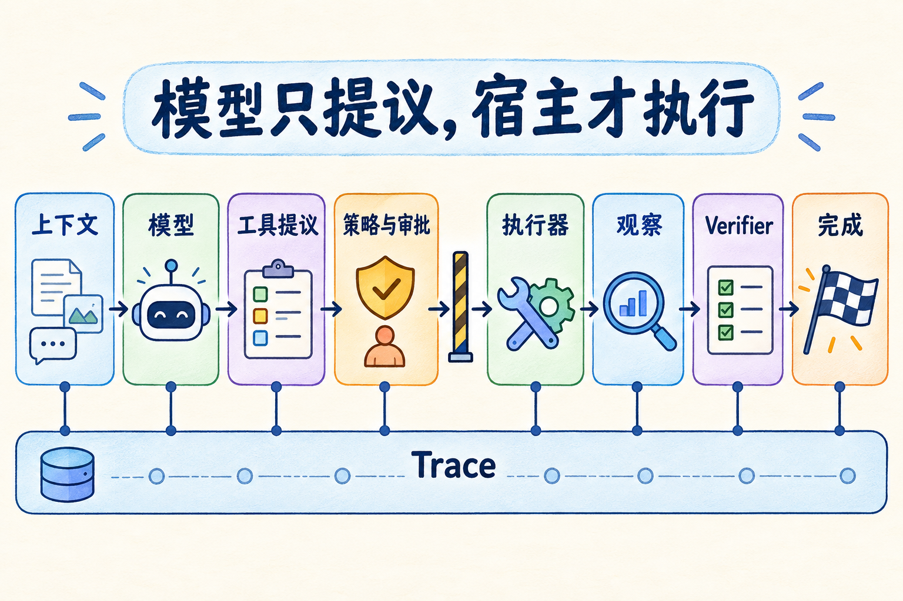
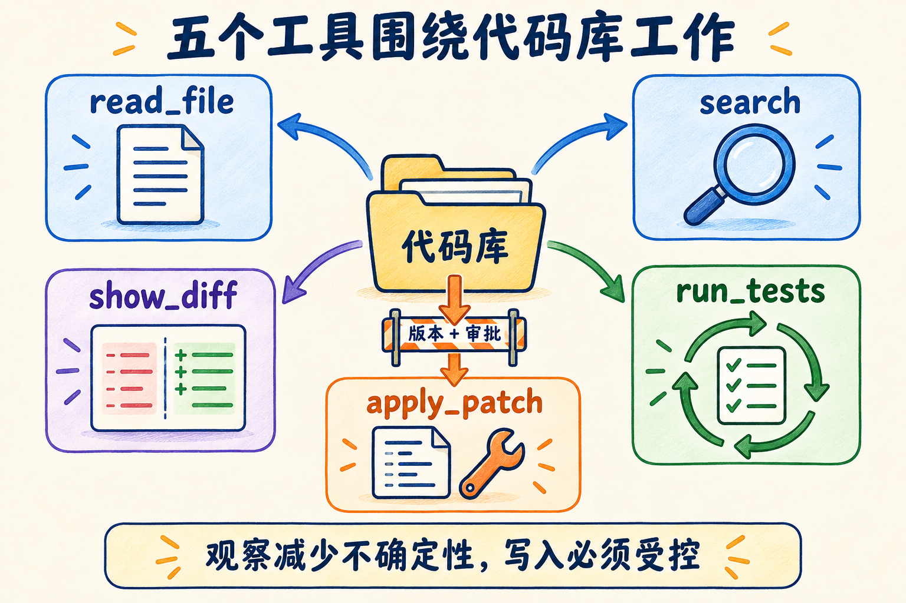
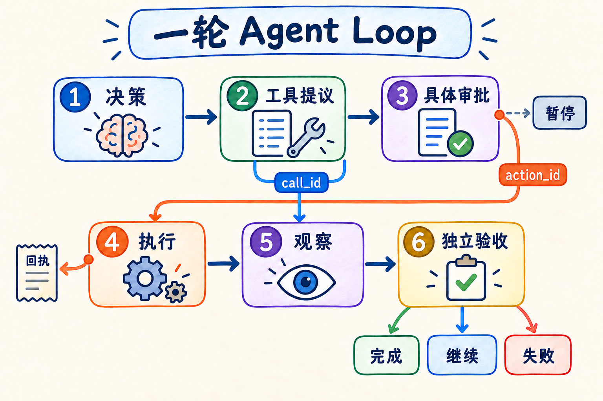
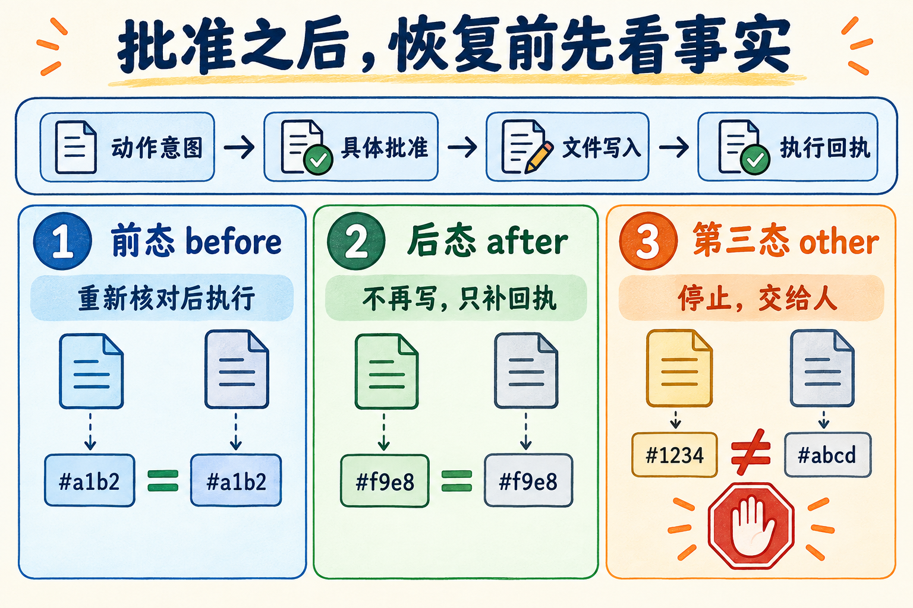
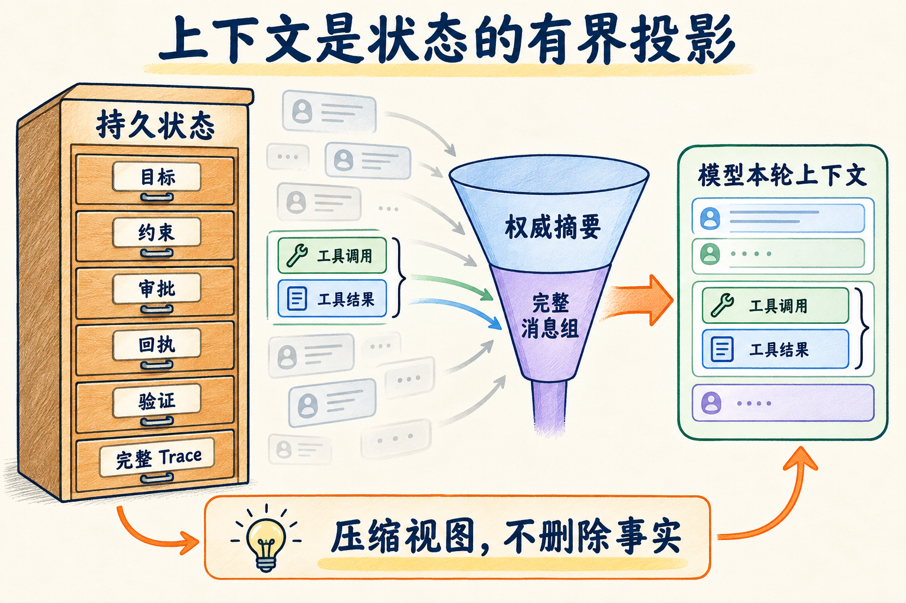
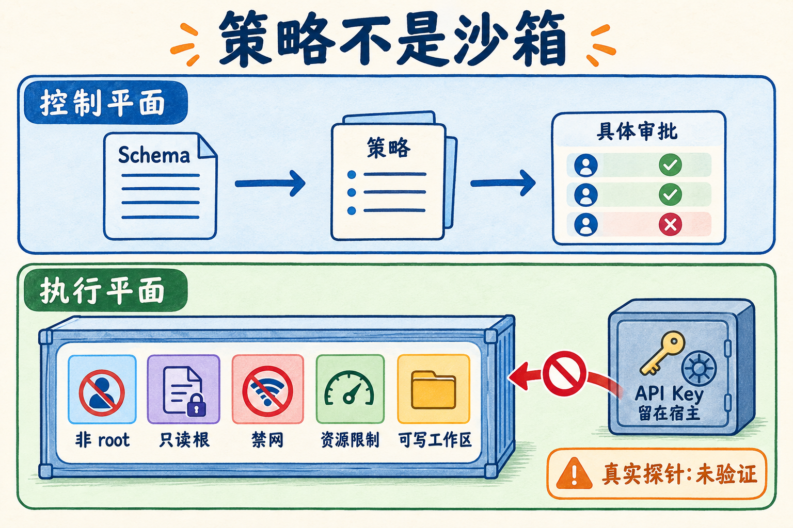
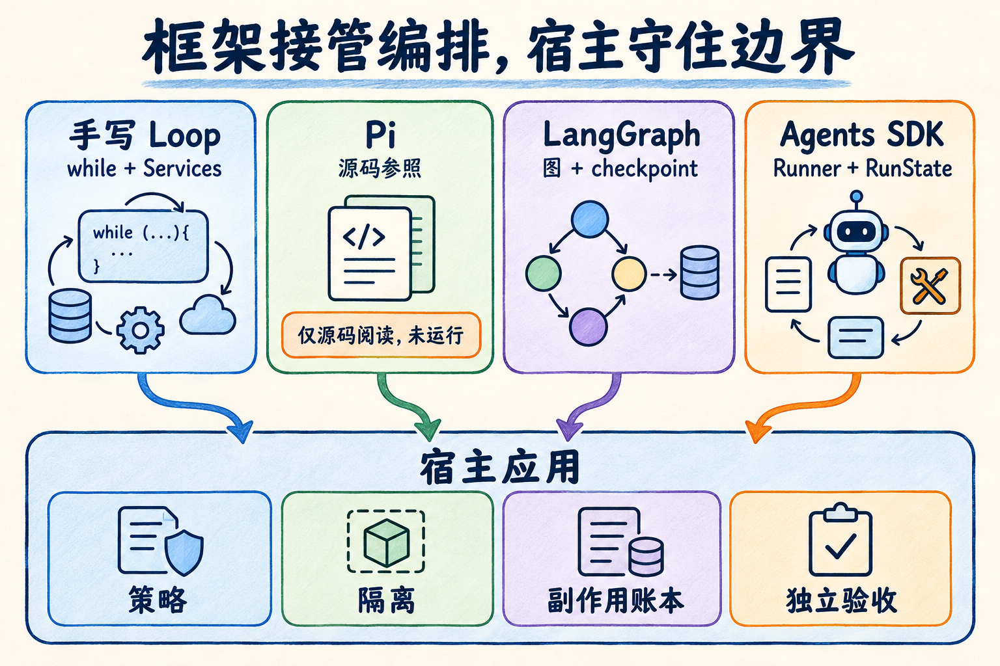

# 第 12 章 手写一个 Mini Coding Agent

实验实现以可信 `ReplayModel` 驱动离线回放，尚未接通真实模型；容器隔离只提供理论合同与参考配置，没有实测结论。运行环境与依赖见 [实验 README](../chapter12/README.md)。

上一章里，我们站在使用者的位置，看一个 Coding Agent 怎样阅读仓库、修改文件、运行测试并交付结果。这一章换一个位置：把现成产品暂时放在一边，从程序作者的视角，自己实现一个小而完整的 Coding Agent。

“自己实现”不意味着重新训练一个大模型。动作选择留在模型接口，标准实验先用 Replay 返回固定决策；我们实现和验证的是模型之外的系统：怎样装配输入；怎样把工具提议变成受控动作；怎样在写文件前获得具体批准；怎样在进程退出后继续；怎样判断任务真的完成；怎样留下证据让另一个人复查。可替换接口不等于真实模型路径已经端到端可用。

这也是全书到这里的一次收束。前面分别出现过上下文、工具、状态、Harness 和 Coding Agent。手写一遍之后，它们不再是散落的名词，而会变成同一条执行链上可以定位的程序边界。

如果你刚开始学习 Agent，可能会担心这一章同时出现数据库、进程、框架和安全概念。可以先用“新员工入职”来理解：模型像一位擅长分析但不了解公司权限的新同事；上下文是本次交给他的材料；工具说明是岗位可以申请的操作；审批是负责人对某个动作的授权；执行器是真正操作系统；Verifier 是交付检查；Trace 是工单流水。新同事能力很强，不等于可以跳过门禁、审计与验收。反过来，门禁设计再完善，也不能代替他分析问题。

这套比喻有一个边界：模型不是人，它不会稳定记住已经发生的事实，也不能为自己的副作用承担责任。程序必须把关键事实外置。每次循环都应当假设模型只看得到本轮提供的上下文；每次恢复都应当假设内存已经丢失；每次写入都应当假设确认之后、回执之前可能崩溃。这样设计出来的系统，才不会依赖一次演示中“刚好没出问题”的幸运。

本章也刻意不追求功能最多。一个有任意 shell、浏览器、数据库和云控制台能力，却说不清权限与验收的 Agent，并不比五工具 Agent 更接近生产。我们先把一条窄路径做深：读到的事实有版本，动作有身份，写入有授权，结果有回执，完成有独立证据。之后再增加工具，新增的只是协议实例，不必推翻底层责任。

## 开场：一句“帮我修一下”如何变成可验证修改

本章沿用一个很小的任务：修复 Markdown 链接检查器。仓库中的根目录链接能够正确检查，位于子目录的文档却会误报，因为程序始终从仓库根目录解析相对路径。正确做法应当从当前文档所在目录出发。

如果由人直接修，改动可能只有一行：

~~~diff
-candidate = root / target
+candidate = document.parent / target
~~~

但把任务交给 Agent，问题就不再只是“这一行怎样改”。程序还必须回答：

- 模型是否读取过目标文件，还是凭任务描述猜测？
- 新增测试在修复前是否真的失败？
- 模型提出的补丁，是否仍针对当前文件版本？
- 谁允许它写文件，批准具体绑定到哪个动作？
- 进程在写入后、记录结果前崩溃，恢复时会不会再写一次？
- 模型说“完成”以后，谁检查测试数量、受保护文件和独立验收用例？

这组问题说明，Coding Agent 的最小交付物不是一段回答，也不是一次工具调用，而是一条有因果关系的证据链：观察问题、复现失败、提出动作、批准动作、执行动作、再次观察、独立验收。缺掉中间任何一环，“完成”都可能只是一个无法复查的结论。

这里还有一个容易混淆的词：“可验证”不等于“绝对正确”。测试和验收都只能覆盖被写下来的条件。可验证的含义是，系统明确说出接受结论依赖哪些证据，并允许别人重复这些检查。若需求后来增加，旧证据仍然真实，只是覆盖范围不足；如果结论只来自模型自信的语言，我们甚至无法知道它当时检查了什么。

因此，优秀的 Agent 不是永远不犯错，而是让错误尽量在离副作用最近的边界显现。参数错，在 schema 层失败；路径错，在文件网关失败；版本旧，在补丁准备层失败；批准过期，在恢复层失败；实现投机，在独立验收失败。越早、越具体的失败，修复成本越低。

### 先看一条完整短轨迹

本章的标准离线轨迹由 [experiments.py](../chapter12/experiments.py) 中固定的 `ReplayModel` 决策驱动。它不测模型聪不聪明，而是把模型的每一步选择冻结，使我们能够只观察外围系统。

完整轨迹可以压缩成六步：

1. `read_file` 读取 `src/linkcheck.py`，得到正文和文件版本；
2. `apply_patch` 提议新增回归测试，宿主暂停并等待批准；
3. 批准恢复后写入测试，`run_tests` 观察到红灯；
4. `apply_patch` 提议修复源码，再次等待针对该动作的批准；
5. 写入源码后重新运行候选测试，得到三项测试通过；
6. 模型请求结束，宿主 Verifier 独立检查受保护文件、候选测试和隐藏验收用例，才把状态改成 `completed`。

注意第六步的主语。不是“模型宣布完成”，而是“模型请求结束，宿主开始验收”。这一区别贯穿本章。

在 `chapter12/reports/offline-canonical.json` 的第一组报告中，固定观察是：出现一次预期的红灯、发生两次经过批准的写入、差异只包含 `src/linkcheck.py` 和 `tests/test_agent_nested.py`、最终发现三项候选测试并通过独立验收。对应 Trace 依次包含 `model_requested`、`tool_proposed`、`approval_requested`、`action_written`、`action_receipt`、`verification_started` 和 `verification_passed` 等事件。

这条轨迹已经比“模型调用工具”多出许多层，但每一层都有一个简单目的：不要让一句不可靠的建议，未经检查就变成不可逆的事实。

第一次读文件只是建立事实，不改变仓库；第一次补丁新增测试，需要批准，因为“只是测试”同样可能删除或覆盖用户内容；红灯不是坏事，它把需求转成可重复的失败；第二次补丁修源码，再次批准，是因为上一次批准不能自动授权下一刀；绿色候选测试只说明开发者可见的检查通过；最后的独立验收才决定本次运行能否交付。

为什么新增测试和修复源码分成两次写，而不是一个大补丁？分开以后，Trace 能证明测试在旧实现上失败。若两者同时写入后直接变绿，我们无法仅凭最终状态判断测试是否真的约束了缺陷。工程中不必所有修改都强制分两次审批，但对于教学、回归缺陷和高风险变更，“先红后绿”提供了更强的因果证据。

### 这和固定修复脚本究竟差在哪

看到任务固定、决策又由 Replay 提供，你可能会问：这不就是一个写死的自动化脚本吗？在标准实验中，决策确实是固定的；这是为了让实验可重复，不是为了假装 Replay 会思考。

固定脚本把路径、修改内容和步骤都写在程序里。Agent Loop 则把“下一步是什么”留给一个决策源：它可以是 Replay，也可以是真实模型。宿主只规定允许提出什么、怎样执行、怎样验收。换句话说，脚本把任务知识固化在流程中；Agent 把任务求解留给模型，把安全与正确性的底线留给宿主。

| 维度 | 固定修复脚本 | Mini Coding Agent |
| --- | --- | --- |
| 下一步来源 | 程序作者预先写死 | 模型或可替换的决策策略 |
| 可处理变化 | 只覆盖预设分支 | 接口允许决策源读取 observation；本章 Replay 按固定脚本返回 |
| 工具边界 | 通常直接调用函数 | 先提议、校验、授权，再执行 |
| 完成判定 | 脚本运行到末尾 | Verifier 检查任务证据 |
| 实验中的 Replay | 没有必要 | 冻结决策，用来单测 Harness |

因此，本章用 Replay 得到的结论是“相同决策进入这套 Harness 后，边界按预期工作”，不是“模型能够独立修复任意仓库”。若想研究模型能力，必须另做真实模型实验，并固定模型、提示、温度、预算、任务集和评价方法。两种问题不能用同一份数字回答。

把模型固定下来还有一个测试工程上的好处：失败更容易归因。若每次测试都请求真实模型，一次失败可能来自模型换了措辞、服务超时、采样变化、工具协议、恢复逻辑或文件系统。Replay 先把第一类变化拿掉，让 Harness 的回归测试稳定。等外围机制通过，再用真实模型做端到端观察，两套证据相互补充。

这种分层测试与普通软件类似。我们不会因为最终要访问真实支付服务，就拒绝为订单状态机写确定性单测；也不会因为单测通过，就宣布真实支付网络已验证。Agent 系统同样需要协议测试、框架集成测试和真实环境观察，三者各自回答不同问题。

## 第一次运行：先用离线回放看清机制

如果这是你第一次克隆书籍仓库，请先按 [第 12 章实验包的环境准备说明](../chapter12/README.md) 确认 Python 3.11 和仓库根目录。第一组手写 Replay 路线主要使用标准库；完整测试和第五组才需要锁定的 LangGraph、OpenAI Agents SDK 等依赖，不必一开始同时理解三个编排层。

先只跑一次正常闭环，再随失败逐步增加边界。在书籍仓库根目录执行：

~~~bash
python -B -m chapter12.experiments --group 1 --output chapter12/.runs/reader-first
~~~

输出目录必须是新的。程序发现目录已经存在时会拒绝覆盖；只有显式给出 `--replace`，才会先把旧目录重命名为 `.previous-N`。证据文件不应在一次方便的重跑中静默消失。

这次输出只有 `group-1.json` 和清单；完整五组的规范基线见 [offline-canonical.json](../chapter12/reports/offline-canonical.json)。后面的实验再分别回答错误如何关闭、审批恢复是否重复写入、上下文与执行隔离有何不同、更换框架后责任怎样移动。不要把未运行的组算作这次结果。

报告中的每个场景都有五类字段：`expected` 说明期望行为，`observed` 保存稳定观察，`criterion` 写出判定规则，`passed` 表示规则是否满足，`does_not_prove` 主动声明边界。最后一个字段很重要。一个通过的路径检查并不证明进程被隔离；一次成功恢复不证明文件系统与数据库具有原子事务；三个编排都完成一个 fixture，也不证明它们同样适合真实项目。

实验报告不保存临时绝对路径、墙钟耗时和随机 ID，因为这些字段会让两次等价运行产生无意义差异。可复现不意味着删掉所有环境信息：Python、框架版本、后端类型和操作系统类别仍被记录，因为它们会影响语义。设计报告格式时，应区分“解释结果所必需的环境事实”和“每次都会变化的噪声”。

> **实验 12-1 ★：跑通一次完整的离线闭环**
>
> 运行上面的命令，然后打开 `chapter12/.runs/reader-first/group-1.json`。依次找出 `red_observed`、`writes`、`diff_paths`、`candidate_tests` 和最终 `status`。再打开同目录的第一组工作区，对照真实文件。你应该看到一次红灯、两次写入、两个差异路径、三项候选测试以及最终 `completed`。
>
> 这组实验执行真实文件读写、测试进程、SQLite 状态和 Verifier；决策来源是 `replay`。它证明固定输入下的协议闭环，不证明真实模型能力，也不证明容器隔离。

如果想亲手决定“何时批准”，再按 [实验 README](../chapter12/README.md) 的“手动观察审批与恢复”运行 `start → approve → resume`。第一组为了自动复现，已经在程序里执行了具体审批；手动路线才让你在暂停处核对动作身份。

### 从书籍仓库根目录开始

`chapter12/` 的模块分工如下：

1. [contracts.py](../chapter12/contracts.py)：状态和工具数据长什么样；
2. [tools.py](../chapter12/tools.py)：文件边界与补丁准备；
3. [runtime.py](../chapter12/runtime.py)：最小循环怎样推进；
4. [verifier.py](../chapter12/verifier.py)：完成协议；
5. [recovery.py](../chapter12/recovery.py)：暂停后怎样判断该不该重放；
6. [context.py](../chapter12/context.py) 与 [trace.py](../chapter12/trace.py)：模型视图和审计视图；
7. 两个框架适配器：`chapter12/adapters/langgraph_agent.py` 与 `chapter12/adapters/sdk_agent.py`。

所有路径都相对于书籍仓库，而不是读者自己的业务仓库。实验准备器会创建一个小型候选工作区，并把控制数据放到工作区之外的相邻控制目录。这样，模型能看到的代码与宿主保存的基线、状态和账本不会混在一起。

如果你只想验证当前工程，运行：

~~~bash
python -B -m pytest chapter12/tests -q
~~~

Windows 的符号链接权限会影响对应边界测试是通过还是跳过。复跑时应检查失败和跳过原因，而不只比较测试数量。

### 离线回放与真实模型运行是两份证据

`ReplayModel` 按顺序返回预先定义的 plan、tool call 或 final。真实文件系统、工具校验、审批、SQLite、子进程、Verifier 和框架本身仍会运行。因此，“离线”不等于所有东西都是假对象；被替代的只有模型决策。

真实模型入口也存在，但**当前不是只差安装 Docker 就能运行**。它只能与 `container` 后端组合，先检查隔离证据，再检查 API 配置。[probe_container](../chapter12/backends.py) 在找不到运行时时返回 `runtime_unavailable`；即使发现 Docker/Podman，也仍返回 `probes_not_run`、`isolation_passed=false`，因为完整探针尚未交付。启动入口会在创建候选工作区、读取 API Key 和发送 HTTP 请求之前停止。

原本地观察得到的是 `isolation_unverified` / `runtime_unavailable`，真实模型轮数、工具数、API usage 均为 0，见 [live-observation.md](../chapter12/reports/live-observation.md)。这份记录和上面的源码边界一起说明：已完成的是离线 Harness；真实模型与容器隔离属于尚未贯通的扩展，不是读者安装一个软件便能消除的环境差异。

这不是缺陷被隐藏，而是边界在起作用。若程序在隔离未验证时自动降级到本地执行，那么“为了把演示跑通”就会改变安全合同。可靠系统宁可明确停下，也不把未经授权的环境当成已验证环境。

为了避免以后引用时混淆，可以把本章证据分成四层。第一层是源码阅读，例如对 Pi 固定提交的静态分析；第二层是确定性行为测试，例如 Replay 驱动的工具、恢复与 Verifier 测试；第三层是已安装框架的集成测试，确认真实 LangGraph 和 Agents SDK 在锁定版本下的行为；第四层才是外部环境观察，包括容器探针和真实模型请求。高层证据不能被低层证据冒充，低层证据也不会因为高层尚缺就失去价值。

当未来补做真实模型实验时，也不应覆盖离线报告。应创建新的、脱敏的 live 记录，说明模型名、服务日期、调用预算、人工介入、工具次数、停止原因和最终验收。真实运行失败也要保留，不能挑一次成功结果替换稳定基线。这样读者才能看见“系统合同通过”和“某次模型表现如何”之间的关系。

## 一张总图：谁负责思考，谁负责行动

一个 Mini Coding Agent 可以先分成六个角色：

| 角色 | 输入 | 输出 | 不能替代什么 |
| --- | --- | --- | --- |
| Model | 本轮上下文、工具说明 | 文本、计划或工具提议 | 权限和执行 |
| Context Builder | 持久状态、近期消息 | 有界模型视图 | 事实数据库 |
| Runtime / Orchestrator | 当前状态、模型决策 | 下一状态 | OS 沙箱 |
| Policy + Approval | 工具提议、工作区版本 | allow / deny / ask | 实际隔离 |
| Executor | 已授权的具体动作 | ToolResult、回执 | 最终验收 |
| Verifier + Recorder | 工作区、基线、事件 | 验收结论、Trace | 模型推理 |

模型负责不确定条件下的选择，但不直接拥有文件句柄。Runtime 负责把回合串起来，但不因为有 `while` 就自动获得恢复能力。Policy 能拒绝路径，却不能阻止已经启动的进程访问操作系统。Executor 可以告诉你命令退出码为零，却不能单凭退出码确认用户目标完成。Verifier 可以检查约定的证据，却也无法证明测试之外的所有行为正确。

把这些限制写清楚，系统设计反而变简单：每层只对自己能够观察和强制的事实负责。

六个角色之间最容易出现两种设计错误。第一种是责任空缺：大家都以为另一层会检查，例如框架得到 final 后直接结束，而宿主没有 Verifier。第二种是责任重叠：框架和宿主都在恢复时执行写入，各自认为自己是在“继续未完成步骤”。责任表的价值，是为关键事实指定唯一权威来源和唯一执行者。

可以用三个问题检查一条边界。它读什么事实？它能够强制什么？它失败后把什么状态交给下一层？例如 Policy 读取工具名、参数和策略，能强制“不把动作交给 Executor”，失败后返回 deny；它不能强制已经启动的任意进程不访问网络。Verifier 读取工作区和测试结果，能强制“不写 completed”，却不能撤销已经发生的错误写入。这就是为什么预防、执行和验收必须同时存在。

对初学者来说，最值得养成的习惯是不要用组件名称推断能力。“用了 LangGraph”没有说明状态是否可信；“有人工审批”没有说明批准粒度；“在 Docker 中运行”没有说明是否禁网、是否挂载凭据；“跑了测试”没有说明发现了几项。始终追问可观察合同，系统才会从宣传词回到工程事实。

## 模型返回的是答案，还是工具提议

模型一次响应可以有三种教学类型：

- `plan`：给出接下来要检查的公开步骤；
- `tool`：提出一次结构化工具调用；
- `final`：不再提出工具，请求宿主进入完成检查。

这里特意使用“提议”。当模型返回 `apply_patch` 时，磁盘还没有改变。宿主先验证调用结构，再准备补丁并计算动作身份；若写入需要批准，状态变成 `awaiting_approval`，Runtime 立刻返回。只有批准与当前动作、参数、运行和工作区版本完全匹配，Executor 才能得到执行机会。

这个边界可以用一句话记住：**模型有表达意图的能力，宿主有决定是否让意图成为事实的权力。**

### 一个合法 ToolCall 长什么样

[contracts.py](../chapter12/contracts.py) 是工具协议的唯一 schema 来源。一次调用只允许三个顶层字段：

~~~json
{
  "call_id": "read-source",
  "name": "read_file",
  "arguments": {
    "path": "src/linkcheck.py",
    "start": 1,
    "end": 200
  }
}
~~~

`call_id` 把提议和结果配成一对；`name` 必须来自工具表；`arguments` 拒绝未声明字段。字符串有长度上限，整数有范围，补丁版本必须是 64 位 SHA-256 或 `absent`。验证函数返回防御性副本，不把模型提供的可变对象原样传到后面。

严格 schema 的意义不是追求格式洁癖。假设 `read_file` 同时接受 `path`、`filename`、`file`，某个适配器选择一个字段，另一个适配器选择另一个字段，Trace 又只记录第三种形式，恢复时就无法确定执行过什么。协议越模糊，错误越容易在层与层之间被重新解释。

协议还承担版本兼容责任。今天给工具增加一个可选字段，看起来不会破坏旧调用；但如果恢复记录来自旧版本程序，新版本是否仍能解释它？如果工具结果字段改名，历史 Trace 是否还能读取？本章在 state、报告和验收输出中保留 `schema_version`，并对字段集合做严格检查。真实系统还需要迁移策略：要么升级旧记录，要么明确拒绝不支持的版本，不能悄悄按新含义执行旧动作。

为什么不直接采用完整 JSON Schema 库？教学实现只需要对象、字符串、整数、范围、枚举和正则等小子集，自写校验器让边界一眼可见。但这不是建议生产项目重复造轮子。工具越来越多、联合类型和嵌套结构越来越复杂时，应使用成熟验证库，同时保留同样的原则：模型侧工具描述与宿主侧校验来自同一份定义，不能复制两套逐渐漂移的 schema。

工具结果同样只有一种形状：

~~~json
{
  "call_id": "read-source",
  "ok": true,
  "data": {"text": "...", "version": "..."},
  "error": null,
  "truncated": false
}
~~~

失败时 `ok` 必须是 `false`，`error` 必须是非空字符串。成功时 `error` 必须是 `null`。这让下一轮模型和 Trace 消费者不必从任意文本中猜测成功与否。

错误码应当描述机器可以采取的下一步，而不是把整个异常堆栈塞给模型。`stale_version` 意味着重新读取；`non_unique_match` 意味着缩小 old 文本；`path_denied` 意味着该方向不被允许；`tests_failed` 意味着根据结构化失败定位。内部堆栈可以进入受保护日志，但模型上下文只需要经过清洗、足以修正行动的信息。这样既减少泄露，也降低模型被无关实现细节带偏的概率。

### 校验通过仍不等于允许执行

schema 只回答“它是不是一个结构合法的调用”，不回答下面这些问题：

- 这个路径是否在工作区内？
- 这个文件是否允许修改？
- 调用依据的版本是否已经过期？
- 这次写入是否得到批准？
- 命令应该在宿主还是容器里执行？
- 当前总预算是否允许继续？

因此，调用会依次经过多个门：结构校验、路径规范化、工具级策略、版本检查、动作准备、人工批准、执行前再次核对。任一层失败都返回显式错误，不执行副作用。

例如 `../outside` 即使是合法字符串，也会被 `safe_path()` 拒绝为 `path_denied`；`notes.txt` 即使位于工作区，也不是本任务允许修改的路径；一个使用旧文件摘要生成的补丁会得到 `stale_version`。三者是不同错误，因为后续处理方式不同：越界应停止，非授权写入应拒绝，过期观察则应重新读取再提议。

多道门并不是重复检查。schema 面对的是不可信结构；`safe_path` 面对路径解析和文件系统节点；白名单表达本任务权限；版本检查表达观察是否仍有效；批准表达人的具体意图；执行前复核处理等待期间的变化。每一层使用不同信息，防止不同类别的错误。若把它们合并成一个 `if allowed(call)`，测试和审计都会失去定位能力。

`safe_path` 还检查符号链接、重解析点、硬链接和 Windows 保留设备名。只用 `resolve().is_relative_to(root)` 不够：解析过程可能已经跟随一个不可信链接，硬链接也可能让工作区路径指向同一磁盘对象。教学实现采取偏保守策略，遇到无法清楚证明安全的节点就拒绝。它仍不是敌对文件系统沙箱，但比字符串前缀检查更接近真实边界。

## 五个工具如何围绕代码库工作

本章只给模型五个工具：`read_file`、`search`、`apply_patch`、`run_tests` 和 `show_diff`。刻意不提供任意 shell，是为了先把核心边界看清。

| 工具 | 它回答的问题 | 主要限制 |
| --- | --- | --- |
| `read_file` | 这个文件的相关内容和版本是什么 | 工作区路径、大小、行区间、输出上限 |
| `search` | 某个字符串在哪些文件和行出现 | 目录边界、文件数、结果截断 |
| `apply_patch` | 我想把唯一一段旧文本替换成什么 | 白名单、版本、唯一匹配、审批 |
| `run_tests` | 固定候选测试现在怎样 | 只允许命名 preset、超时、输出上限 |
| `show_diff` | 相对基线究竟改了什么 | 只展示允许修改的路径、输出上限 |

工具数量少并不代表 Agent 只能解决一个写死任务。它仍能根据读取和测试结果改变步骤。但越通用的执行能力越需要更强的权限与隔离设计。教学实现先让读者看见安全合同，再讨论怎样扩展，而不是一开始用 `bash(command)` 把所有边界压进一个字符串。

新增工具时可以沿同一张检查表设计：输入是否有上限；路径或资源标识怎样规范化；只读还是有副作用；是否需要审批；重复执行会发生什么；输出怎样截断；错误是否可分类；结果怎样与调用关联；恢复时依据什么事实；Verifier 是否需要新增检查。回答不了其中一项，说明工具还只是一个函数，不是完整的 Agent 能力。

任意 shell 并非永远不能提供。成熟 Coding Agent 往往必须编译、格式化和运行项目命令。但它更适合放在强制隔离、工作目录限制、环境变量清洗、网络策略、资源配额和命令审计之后。本章使用命名 preset，是为了把“命令选择”暂时收回宿主，让读者能分开理解工具协议与命令沙箱。

### 读取与搜索：每次观察减少一个不确定性

`read_file` 不只返回文本，还返回当前文件的 SHA-256 版本、总行数、实际行区间和是否截断。版本会跟随后续补丁提议。模型不能只说“修改这个文件”，还要证明这次提议基于哪个内容快照。

`search` 逐个读取受边界保护的文本文件，返回路径、行号和片段。达到输出上限时，它会保留已有完整结果并设置 `truncated=true`。截断不是附注，而是一个事实：模型看到的只是部分结果。下一步可以缩小目录或更换查询，不能把“没在返回里看到”推断成“仓库里不存在”。

可靠的观察工具通常有三个共同点：范围有限、来源可定位、信息是否完整可见。只返回一大段字符串，看似方便，却让调用者无法分辨空结果、截断结果和执行失败。

行区间也能帮助控制上下文。模型第一次只需读取匹配附近几十行，而不是把整个文件塞进窗口；若函数依赖不清楚，再沿符号或调用位置扩展。这样的“逐步取证”比一次读完更慢一轮，却让每次 observation 都有明确目的。对于大仓库，目录列表、符号索引和语义检索也应遵守同样原则：返回来源、版本、范围和完整性，而不只是相关片段。

搜索没有命中时尤其要谨慎。它可能真的不存在，也可能大小写不同、查询太具体、目录太窄、文件是非 UTF-8，或结果在上限前已经截断。Agent 下一步应根据元数据调整查询，而不是立刻生成新实现。很多看似“模型幻觉”的代码错误，源头其实是工具把“不知道”伪装成了“没有”。

### 补丁编辑：同时确认旧内容和文件版本

`apply_patch` 不是“把以下内容写进文件”，而是一条带前置条件的替换合同：

~~~text
path + version + old + new
~~~

宿主准备补丁时先检查：路径可写；`version` 等于当前摘要；`old` 在文件中恰好出现一次；替换后不是 no-op；结果没有超过大小限制。新建文件只允许符合 `tests/test_agent_*.py` 的测试文件，并要求 `version=absent`、`old` 为空。

为什么要“唯一匹配”？如果 `old` 出现零次，模型依据的上下文已经不成立；如果出现多次，宿主不知道模型想改哪一处。自动选择第一处会让文本顺序代替语义判断。唯一替换当然不如语法树编辑强大，但它给出了一个容易检查、容易回放的最小合同。

准备阶段还会记录修改前后的文件摘要、完整工作区 manifest、预期差异和由调用内容派生的 `action_id`。真正写入时再次比较 manifest；只要任何文件在批准等待期间发生变化，旧动作就不再直接执行。

注意这里同时检查文件版本和工作区 manifest。文件版本保护目标文件，manifest 保护模型判断所依赖的更大环境。模型可能读取源码 A，却根据测试 B、配置 C 决定怎样修改；等待批准期间即便 A 未变，B 或 C 改了，旧判断也可能失效。教学任务为了简单，对任何工作区变化都让批准过期。生产系统可以缩小依赖集合，但必须明确记录动作依赖哪些事实，不能凭感觉减少检查。

写入采用“控制目录中生成临时文件—写完并同步—执行前复核—原子替换”的顺序。这样可以避免直接打开目标文件后只写了一半。原子替换只解决单文件可见性，不解决多文件事务；本章两次写入是两个独立动作。若任务需要多个文件必须同时一致，应增加暂存工作树、提交对象或事务化发布步骤，而不是把多次 `write_text` 称为原子修改。

### 测试与差异：日志不是验收回执

`run_tests` 不接收任意命令，只接收 `preset=candidate_tests`。preset 由宿主映射到固定测试入口，并设置超时、取消信号和输出上限。这样，模型不能借“运行测试”之名启动另一个未审核命令。

测试结果至少要区分退出码、超时、取消、截断、发现测试数和解析后的诊断。`returncode=0` 并不总等于通过：如果收集到 0 项测试，可能只是路径写错或测试发现机制失效；如果输出被截断，关键失败可能没进入观察；如果取消与超时同时出现，停止原因还要按规则决定优先级。

`show_diff` 则从宿主保存的基线重建差异。模型口头总结“只改了一行”不算证据，差异路径和文本才是可审阅对象。但 diff 仍然不是最终验收：它告诉我们“变了什么”，不告诉我们“是否满足需求”。

测试工具还要处理子进程的一个实际陷阱：如果只在进程结束后读取 stdout 和 stderr，子进程输出很多时可能填满管道并互相等待。本章 backend 持续排空管道，同时只保留有界字节。保留上限与持续读取是两件事：前者控制进入状态和模型窗口的内容，后者避免执行过程死锁。

被截断的日志怎样继续分析？一种做法是让工具把完整日志保存在受控工件区，返回摘要、末尾错误和工件身份；模型若有权限，再按区间读取。不能简单把输出上限调到无限，因为一次依赖安装或失败堆栈就可能淹没上下文、数据库和 Trace。观察工具同样需要资源预算。

## 工具结果怎样进入下一轮

工具执行以后，Runtime 不能只把 stdout 拼到最后一条用户消息里。它要生成一条结构化 observation，保留原来的 `call_id`、成功状态、错误码、数据和截断标志，再把它放入持久消息与下一轮上下文。

这样，模型才能区分几种外表相似的情况：

- 搜索成功但没有匹配；
- 搜索成功但结果被截断；
- 搜索因路径越界而失败；
- 测试执行完成且用例失败；
- 测试进程超时，没有得到完整结论。

如果这些情况都压成“工具失败，请重试”，模型只能盲目重复；如果都压成普通文本，框架和审计程序又很难可靠解析。

用第一组轨迹把“本轮结果怎样帮助下一轮”接起来。右栏是人工解释合理性，不是声称 Replay 真的根据观察推理：

| 本轮固定决策 | 真实执行观察 | 下一步应依据什么 |
| --- | --- | --- |
| 读源码 | 当前路径拼接与文件版本 | 补丁应针对实际旧内容，而不是猜测 |
| 提议新增回归测试 | 等待批准；批准后记录写入回执 | 新测试已存在，才有资格观察红灯 |
| 运行测试 | 新增嵌套链接用例失败 | 旧实现不能满足新增需求 |
| 提议修复源码 | 再次批准，核对版本并写入 | 测试批准不自动授权源码修改 |
| 再运行测试 | 三项候选测试通过 | 可以申请独立验收，不能直接宣布完成 |
| 请求结束 | Verifier 接受或拒绝证据 | 只有验收接受才写 `completed` |

真实模型接入后，应该消费左侧动作对应的 observation，再生成下一轮提议。这里冻结了决策，因此验证的是这些材料是否完整回传、审批与验收是否真的生效；不评价模型能否自己找到上述步骤。

### call_id 为什么不能丢

模型可能连续提出多个相同工具调用，例如读取同一文件的不同区间，或两次运行同一个测试 preset。工具名不足以标识因果关系。`call_id` 是模型回合中的调用身份；写操作还会派生稳定的 `action_id`，用于审批和幂等。

可以把两者理解为快递单号和包裹指纹。`call_id` 说明这份结果在对话里回应哪一次请求；`action_id` 说明准备执行的具体副作用是什么。即使进程重启、框架重入节点，只要动作内容相同，宿主仍能在账本中找到它；动作内容变化，则必须得到新的身份与批准。

Trace 中每条相关事件也保存这些关联字段。因此，排查一次失败时可以从 `tool_observed` 反向找到 `tool_proposed`，从 `action_receipt` 找到 `approval_recorded`，而不是靠时间戳猜测哪几行日志属于同一动作。

### 消息必须成对

许多模型接口要求 assistant tool call 与 tool result 成对。上下文压缩时若只删除其中一条，模型会看到一个没有结果的调用，或者一个来源不明的结果。轻则 provider 拒绝请求，重则模型误判工具还在执行或已经执行。

[context.py](../chapter12/context.py) 把工具调用及其结果视为语义组。预算不足时，它们一起保留或一起移除。最近一次失败的完整调用对优先保留，因为下一步修复最需要它；目标、约束、工作区版本、待审批动作和验收状态则从权威 state 重新生成摘要，不依赖历史消息碰巧还在。

这种设计把“聊天记录”和“运行事实”分开了。聊天记录可以压缩，事实不能因窗口变小而消失。

这里还要区分 observation 与 receipt。ToolResult 是给模型看的观察，可能经过截断和脱敏；receipt 是宿主关于副作用已经发生的可信记录，包含动作身份和执行后摘要。两者可能在同一轮产生，却服务于不同消费者。如果把 receipt 只写进模型消息，压缩后恢复逻辑就失去依据；如果把完整工具输出都当 receipt，状态库又会被不可信大文本占满。

因此，一次动作结束后通常有三份不同材料：执行器的原始结果、写入状态库的最小回执、发送给模型的有界 observation。设计 API 时把三者分开，会比到处传递一个万能字典更稳健。

## 写出第一版 Agent Loop

现在回到 [runtime.py](../chapter12/runtime.py)。去掉异常处理后，主循环的形状很短：

~~~python
while not services.stopped(state):
    decision = services.decide(state)
    if decision["kind"] == "final":
        state = services.finish(state)
    elif decision["kind"] == "plan":
        state["plan"] = decision["text"]
    else:
        state = services.propose(state, decision["call"])
        if state["status"] == "awaiting_approval":
            return state
        if state["pending"] is not None:
            state = services.observe(state, services.execute(state))
~~~

这段代码体现了最小 Agent Loop：decide → propose → execute → observe，直到停止。但它没有把所有细节塞进 `while`。`Services` 分别实现上下文装配、策略、审批、执行、观察、验证和持久化。循环只负责转移控制权。

真实代码还处理模型超时：暂时失败最多重试两次，每次留下 `model_retry` 事件；结构错误和永久错误直接进入失败状态。重试只包住模型决策，不会自动重放写操作。这一点很重要：读请求通常可以重试，副作用必须先查询账本。

循环每次改变状态后都要持久化，而不是只在进程正常退出时保存。假设模型已经提出补丁、程序把批准窗口显示给用户，却在落盘前崩溃，用户看到的界面与数据库就会矛盾。正确顺序是先持久化待审批事实和事件，再把控制权交给外部世界。对写入则先记录 intent，再执行，再记录 receipt，使恢复程序能识别中间窗口。

同时也不要把整个可变 Python 对象随意 pickle 到磁盘。状态需要版本明确、字段可验证、秘密可排除。`provider_state` 只保存恢复模型或框架所需的有限数据；工作区路径通过绑定文件与 run id 核对；状态加载后还会重新验证外部事实。持久化让恢复成为可能，但“能反序列化”不代表内容仍然可信。

### 单步服务与 while 循环的边界

如果把读取、写入、审批、重试和验收全部内联在一个循环里，短期看代码更少，长期却会出现四个问题。

第一，无法单独测试边界。你很难构造“批准后文件被外部修改”的场景，而不同时启动模型。第二，无法替换编排层。迁移到 LangGraph 时，业务规则会和循环一起重写。第三，暂停意味着整个调用栈丢失，只能从对话文本猜测进度。第四，Trace 只能记录几行日志，无法指出一个事实由哪层产生。

因此，手写循环不是目标本身。它的价值是暴露协议：`decide` 接收什么，`propose` 保存什么，`execute` 需要哪些前置条件，`observe` 怎样关联结果，`finish` 怎样进入验证。等协议稳定以后，框架可以接管推进方式，而不应改写安全含义。

单步服务还有利于做故障注入。测试可以让模型在第二轮超时，让执行器在写入后抛出命名故障，让状态库返回已有 action，或者让 Verifier 收到畸形 JSON。每个测试只替换一个边界，其余代码照常运行。若所有逻辑都在大循环中，测试往往只能断言最终“失败了”，却无法证明失败前是否已经产生副作用。

当然，服务拆分也可能过度。不是每一个三行函数都要成为接口。判断标准是：该边界是否拥有不同信任级别、是否需要独立替换、是否有自己的持久事实、是否需要故障注入。Model、Executor、Store 和 Verifier 都满足；一个纯粹拼接提示字符串的内部辅助函数未必需要。

### 计划是可检查说明，不是隐藏思维链

模型可以返回 `plan`，但这里只保存短小、面向行动的公开计划，例如：“先读取实现与测试；新增能复现嵌套路径的用例；观察红灯后修改解析基准；再运行测试和查看差异。”

我们不要求模型暴露逐 token 的内部推理，也不把冗长自言自语当成质量保证。公开计划的用途有三个：让人提前发现目标偏离；给暂停恢复提供一份可读方向；让 Trace 记录计划何时改变。真正的正确性仍由工具观察和 Verifier 支持。

计划也不拥有执行权。计划里写“删除旧目录”，不会使删除自动合法；它必须转化为已注册工具调用，再经过相同策略。这样，文字层和行动层之间始终存在清晰网关。

## 模型说完成之后，Verifier 才开始工作

当模型返回 final，最危险的实现是直接写下 `state.status = "completed"`。final 最多表示“模型当前不打算继续调用工具”。它可能真的完成了，也可能漏看失败、忘记运行测试、错误理解任务，甚至只是在上下文不足时提前停止。

[verifier.py](../chapter12/verifier.py) 把完成变成一份宿主协议。它先重新计算工作区 manifest，检查所有受保护文件是否保持不变；再通过固定 backend 运行候选测试；只有候选测试满足退出码、超时、取消、截断、诊断和测试数量条件，才进入独立验收；最后比较隐藏用例集合和结果协议。

验收不是再问模型一次“你确定吗”。第二次语言回答和第一次来自同一认知来源，不能形成独立证据。Verifier 使用模型不能改写的验收资产，从工作区读取实际结果。它仍然可能有覆盖盲点，但至少把“主张完成”和“接受完成”分给了不同主体。

最终状态保存的不是一段漂亮总结，而是结构化证据：候选测试发现多少项、哪些独立用例通过或失败、受保护路径是否变化、执行是否完整。交付说明可以据此生成，人也能回到原始 Trace 复核。

Verifier 为什么由宿主拥有，而不是做成另一个模型工具？因为工具仍由当前模型选择是否调用，模型也可能在调用后错误解释结果。宿主完成协议则是不可跳过的状态转移：只要决策类型为 final，就必经验证。模型可以建议额外检查，却不能删除最低验收条件。

基线同样要由可信一侧捕获。若让候选工作区里的代码决定“哪些文件原本存在”，错误实现可以修改基线再自证清白。本章在准备工作区时保存基线，把非可写路径列为 protected；验证前重新计算实际 manifest。生产系统可以使用 Git commit、只读源快照或内容寻址存储作为更强基线，核心原则仍是候选代码不能控制评价它自己的尺子。

独立验收也要避免与候选测试共享所有实现。若两者调用同一段可能被修改的辅助函数，错误会同时污染开发测试和验收。本章的验收资产位于控制侧，并通过严格输出协议返回 case id、actual 和 error。它不是秘密安全机制，而是减少“实现改了，尺子也跟着改”的耦合。

最终，人仍需要理解 Verifier 的覆盖边界。自动验收适合可机器判断的约束：路径、测试、静态检查、产物格式、性能门槛。需求含有设计质量、可维护性或用户体验时，可以把人工审阅作为完成协议的一部分，而不是让模型用一句总结代替。Verifier 是完成的权威入口，不要求所有判断都必须自动化。

### 为什么“零项测试通过”仍是假绿

很多测试工具在“没有找到测试”时可能给出不显眼的输出，某些包装层甚至只留下退出码 0。如果 Agent 只检查 `returncode == 0`，删除测试目录、写错发现路径或配置过滤条件，都可能变成绿色。

本章要求候选测试 `discovered > 0`，并且执行没有超时、取消和截断，解析诊断为 passed。任一条件不满足，都不能进入独立验收。独立验收同样使用严格 JSON 协议；缺字段、多字段、类型错误或执行不完整都会得到明确的协议错误，而不是“尽量理解”。

这并不意味着“有三项测试就足够”。测试数量只消除空集合假绿，测试内容才决定覆盖范围。标准任务还加入了模型工作区之外的验收案例，其中 `nested_missing` 能抓住一种看似通过所有候选测试的错误实现：无论输入什么都返回空列表。

因此，完成协议至少需要两类否定能力：能拒绝没有真正运行的检查，也能拒绝为测试样例量身伪造的实现。

还可以继续构造反例：程序打印“3 passed”但退出码非零；测试进程被取消后保留了旧 stdout；JSON 缺少一个 case；差异修改了 `notes.txt`；候选测试通过，但验收用例返回异常。可靠 Verifier 不从一行人类可读文本做乐观推断，而是分别检查执行元数据、结构协议和工作区事实。

这也是 Agent 评估与普通聊天评估的区别。聊天答案可以由人读后打分；代码任务会改变环境，评价必须绑定“评价的是哪一个工作区版本”。否则模型在验证后又写了一次文件，先前的绿色结果就不再支持最终交付。生产系统常把验证摘要与 commit、tree hash 或 artifact digest 绑定，确保结论不会漂移到另一个版本。

## 少一条规则会怎样：五组故障注入

正常路径只能证明系统在配合时能走通，故障注入才会显示边界是否真的存在。第二组实验依次制造：未知工具、额外参数、超长输出、旧版本补丁、恒为空的错误实现，以及模型直接宣布完成。

> **实验 12-2 ★★：让错误以不同理由失败**
>
> 运行：
>
> ~~~bash
> python -B -m chapter12.experiments --group 2 --output chapter12/.runs/reader-failures
> ~~~
>
> 逐项查看 `error` 或 `accepted`。预期分别是 `unknown_tool`、`invalid_fields`、`truncated=true` 且保存不超过 256 字节、`stale_version`、独立用例拒绝，以及 final 触发验证后状态不是 completed。特别检查未知工具前后的 manifest 相同，确认拒绝发生在副作用之前。

这六个场景不是一个笼统的“异常测试”。每个错误都对应不同恢复策略：

| 故障 | 正确处理 | 不应做的事 |
| --- | --- | --- |
| 未知工具 | 拒绝并保留零副作用证据 | 猜测相近工具名 |
| 参数多字段 | 返回协议错误 | 静默忽略未知字段 |
| 输出截断 | 标记不完整，缩小查询或范围 | 把截断尾部当完整结论 |
| 版本过期 | 重新观察、重新提议 | 用旧补丁覆盖新内容 |
| 候选测试被投机通过 | 独立验收拒绝 | 相信测试退出码即可 |
| 模型提前 final | 进入 Verifier | 直接标记完成 |

故障注入最有价值的地方，是让“失败”也成为设计过的状态。系统知道为何失败、什么没有发生、是否允许重试。没有这种语义，所有问题最后都只剩一条 `something went wrong`，人和模型都无法安全继续。

## 审批：批准这一刀，不是以后所有写入

写文件属于有副作用动作。本章策略不是简单返回 `allow`，而是先生成一份待审批记录。记录绑定四类事实：`run_id`、`action_id`、参数摘要和工作区摘要。用户批准的是“在这次运行中，对这个版本的工作区，执行这一组具体参数”，不是“从现在起允许 Agent 写文件”。

为什么绑定这么细？考虑一个常见时间线：Agent 提议改 `src/linkcheck.py`，用户打开 diff 后去开会；期间同事修了同一个文件；用户回来点击批准。如果批准只绑定路径，旧补丁可能覆盖同事修改。如果批准只绑定参数，不绑定工作区，另一个文件的外部变化也可能使原先的整体判断失效。

因此，等待期间的任何工作区变化都会使旧批准过期。恢复返回 `approval_stale`，保留外部内容，让 Agent 重新读取并提出新动作。这里不自动合并，因为通用文本合并不是安全合同的一部分。

拒绝也必须落盘。否则进程重启后只看见一个待处理动作，无法区分“用户尚未回答”和“用户已经拒绝”。审批是状态转移，不是 UI 上的一次临时点击。

审批界面也应该展示用户真正需要判断的内容：动作名称、目标路径、关键差异、为什么需要它、当前工作区版本，以及批准后会发生什么。只弹出“Agent 请求使用 apply_patch，允许吗？”把所有理解成本转给用户，久而久之会形成机械点击。安全审批的目标不是增加按钮，而是让人在有限时间内做出具体决定。

策略优先级应当先于审批。被明确禁止的越界路径，不应通过“询问用户”绕过；缺少隔离的任意执行，也不应因为用户批准一条命令就自动变安全。可以采用 deny 高于 ask、ask 高于 allow 的规则：硬边界先拒绝，允许范围内的高风险动作再询问，低风险只读动作自动执行。用户批准不能提升宿主本来不具备的强制能力。

批量审批可以作为显式高级功能，但范围必须可描述，例如“只允许本次运行在 tests/generated/ 新建测试文件，直到工作区版本变化”。范围中的任一条件变化都应重新询问。一个没有期限、路径和参数约束的“本次全部允许”，恢复以后几乎等于把审批从系统中移除。

## 执行隔离：策略不是沙箱

路径白名单、工具 schema 和人工审批都属于控制平面。它们可以决定哪个动作应该发生，却不能单独限制一个已启动进程实际能访问什么。真正的强制边界需要操作系统、容器、虚拟机或专门沙箱。

`trusted_local` 后端只适用于本章受控 fixture **和可信的决策来源**。它在宿主机启动固定 preset，并实现超时、取消、管道持续读取和输出截断，但它不是沙箱：Replay 仍能提议新建 `tests/test_agent_*.py`，后续固定测试 preset 会在宿主机执行这些 Python 文件。程序无法从 JSON 内容本身判断它是否可信，因此仅内置的规范 Replay 默认放行；其他 Replay 必须用 `--trust-replay-file` 明确声明信任。这个参数是一份操作者断言，不是安全验证，也绝不能用于来源不明的 Replay 或补丁。

本章对 `container` 后端只讲清理论合同和参考配置，不把 Docker 本身扩展成另一套教程。一个准备进入生产的执行后端，至少应验证这些实际属性：镜像由 tag 和 digest 锁定；容器以非 root 用户运行；根文件系统只读；网络禁用；不挂载宿主凭据和容器控制 socket；只把候选工作区按约定方式挂载；CPU、内存和进程数受限；取消后没有残留进程或容器。

配套代码展示了容器命令应具备的约束形状，但没有实现完整的探针编排，也没有产生上述属性的实测证据。因此它是一份设计参考，不是可以直接承载不可信代码的生产沙箱。当前环境也没有可用容器运行时，本章将隔离状态保留为 `unverified`。这不影响理解 Agent 的控制链，却意味着不能从示例命令推导出“沙箱已经安全”。安全设计中的一个重要习惯是：**配置表达意图，探针才提供证据。**

为什么禁网和隐藏凭据都要做？只禁网不能阻止进程读取宿主挂载的密钥并把它写进生成文件；只隐藏密钥不能阻止恶意依赖下载第二阶段载荷或扫描内网。只读根也不够：可写工作区本来就是 Agent 的目标，恶意代码仍能破坏其中内容。因此，隔离是一组相互补充的限制，不是一枚“在容器中”的徽章。

镜像 digest 的作用是让“同一实验环境”有可追踪身份。只有 tag 时，上游可以让相同名称指向不同内容。非 root 和 `cap-drop` 减少容器内进程的权限，`no-new-privileges` 阻止通过某些机制提升权限，进程和内存限制防止 fork bomb 或失控测试占满宿主。取消清理探针则确认超时后容器及其子进程真的消失，而不只是调用方停止等待。

即便所有探针通过，也不能简单宣布“绝对安全”。容器共享宿主内核，运行时和内核可能有漏洞；可写 bind mount 仍允许修改挂载内容；业务可能需要网络白名单而非完全禁网。隔离结论应具体写成已验证的属性和威胁模型，例如“在当前运行时与镜像下，进程为非 root、根只读、无外网、无宿主凭据”，而不是笼统的“沙箱安全”。

本章 live 入口把隔离预检放在读取 API Key 之前，也体现了最小暴露原则。既然执行环境还不满足合同，就没有理由让候选进程或更多代码接触凭据。真正接入模型时，凭据也应只存在于宿主 provider 客户端，不进入候选容器、提示词、RunState 或 Trace。

## 暂停、崩溃与恢复

Runtime 遇到写入提议时返回 `awaiting_approval`，调用栈随进程结束也没有关系，因为 state、action、approval 和 events 已写入 SQLite。恢复入口不会凭对话最后一句继续，而是加载持久事实，重新计算工作区，再决定下一步。

手动观察可以使用 [quickstart.py](../chapter12/quickstart.py)：

~~~powershell
python -B -m chapter12.quickstart start `
  --workspace chapter12/.runs/manual/repo `
  --run-id manual-01 `
  --model replay `
  --replay chapter12/fixtures/replay/canonical.json
~~~

得到 `awaiting_approval` 和具体 `action_id` 后，使用 `approve`；随后用同一工作区、run id 和 Replay 状态执行 `resume`。命令故意没有 `approve-all`。每一次写入都需要单独动作身份。

若改用自己创建的 Replay，`trusted_local` 会在创建工作区前返回 `trusted_replay_confirmation_required`。只有在你已经逐项审阅并信任其中的工具提议时，才可加 `--trust-replay-file`；更换到 `container` 也仍要检查写入范围，只是候选测试不再直接继承宿主进程权限。

> **实验 12-3 ★★★：在三个恢复窗口里检查重复副作用**
>
> 运行：
>
> ~~~bash
> python -B -m chapter12.experiments --group 3 --output chapter12/.runs/reader-recovery
> ~~~
>
> 第一种场景连续恢复同一批准动作，写入和回执都应保持 1；第二种在批准后外部修改工作区，应以 `approval_stale` 停止并保留外部编辑；第三种模拟文件已经写入、回执尚未落盘的崩溃窗口，恢复应只补记回执，不再次写文件。

这组实验揭示了一个经常被忽略的问题：暂停恢复不是“把 messages 保存下来”。对只读工具而言，重复一次也许只是浪费；对写文件、发消息、扣款或创建资源而言，重复一次就是错误。恢复必须围绕副作用事实设计。

恢复入口首先核对绑定：这个 run id 是否确实属于这份工作区和这份状态库。否则用户复制了数据库、移动了目录或命令参数写错时，程序可能把一个项目的批准应用到另一个项目。绑定通过以后，才加载 pending action、批准记录和 manifest。恢复不是普通 start 的别名，它有一套更严格的外部事实检查。

模型自身的进度也要恢复。Replay 保存消费到第几个决策；真实 provider 可能需要会话标识或上轮响应身份；框架可能保存 checkpoint / RunState。但这些只是决策层状态。即使框架说“下一节点是执行”，宿主仍要检查 action receipt；即使 provider 认为工具结果已经发送，工作区也要证明副作用实际发生。多个状态源发生冲突时，应以各自能强制的事实为准，而不是让最方便的那个覆盖全部。

跨进程测试比在一个 Python 进程里调用两次函数更有说服力。单进程内存可能无意中保留锁、缓存或对象引用，让恢复看似成功。本章的框架练习在多个新进程之间保存和加载状态，确认真正依赖的是 SQLite 与工作区，而不是测试进程残留。生产系统还应覆盖机器重启、锁过期、重复消息和数据库暂时不可用等场景。

验证阶段本身也可能中断。模型已经给出 `final` 后，状态会先落成 `verifying`，再运行宿主 Verifier；若进程在两步之间退出，恢复入口会重新进入 Verifier，而不是再向模型要一个决策。手写 Loop、LangGraph 和 Agents SDK 三个入口都先识别这一持久状态；Verifier 的可处理异常会转成带 `verification_error:` 的可审计失败。这里保证的是“不会错误地重新消费模型轮次”，不是保证任意外部验证任务天然 exactly-once。

### 三态恢复与幂等回执

[recovery.py](../chapter12/recovery.py) 对一个未完成动作比较三个摘要：执行前 `before_hash`、预期执行后 `after_hash` 和恢复时 `current_hash`。

| 当前摘要 | 含义 | 恢复动作 |
| --- | --- | --- |
| 等于 before | 文件尚未写入，或已回滚到原状态 | 重新检查批准与整个 manifest 后执行 |
| 等于 after | 预期内容已经存在 | 不再写入，只补记 receipt |
| 两者都不等 | 状态来源不明 | 标记 uncertain / stale，停止交给人处理 |

第三种情况尤其重要。很多“幂等重试”实现只有“没做过就做、做过就跳过”两种判断，却没有为“不知道发生了什么”留位置。现实中，外部编辑、部分写入、另一个进程或恢复代码本身的缺陷都可能产生第三种状态。此时继续猜测，会把不确定性变成数据损坏。

本章用临时文件写入、`fsync` 和 `os.replace` 缩小单文件替换窗口，用 action 账本和 receipt 处理已知崩溃点。但文件系统与 SQLite 不是一个原子事务；测试覆盖的是命名的合作式单写者场景，不是所有并发和恶意篡改。把残留限制写出来，比把“幂等”当万能标签更有帮助。

对于外部 API，三态判断通常需要服务端幂等键或查询接口。比如创建工单时，用 `action_id` 作为幂等键；恢复后先按该键查询，如果服务端已创建就补记 receipt，没有创建才重试，返回不确定则停止。若第三方既没有幂等键也没有可靠查询，宿主就无法保证 exactly-once，只能设计补偿、人工核对或把风险暴露给用户。

“幂等”也不要和“重复结果相同”混为一谈。对文件写相同字节两次，最终内容相同，但第二次仍可能覆盖期间的用户编辑；发送相同邮件两次，内容相同却产生两个外部事件。真正需要的是围绕动作身份、前置版本和回执的去重，而不是简单重跑同一函数。

## 长任务如何压缩上下文而不丢事实

模型窗口有限，长任务不能永远追加原始消息。但直接删除旧消息会丢掉目标、约束、批准和失败原因。正确做法不是把持久状态压缩掉，而是每轮从持久状态构造一个有界视图。

[context.py](../chapter12/context.py) 先生成权威摘要，包含目标、约束、运行状态、工作区摘要、公开计划、待处理动作、计数器和已有验证事实；再选择近期完整消息组。若历史过长，加入明确的 `history_compaction` 标记，告诉模型有内容被省略。工具调用与结果保持成对，最近失败优先保留；如果这一组本身包含数万字节 stdout、stderr 或 diff，系统会保留成对结构、`call_id`、错误与关键诊断，把原始载荷留在持久历史中，而不是让“必须保留”反过来击穿总预算。

这与“让模型总结一下聊天记录”有两点不同。第一，摘要中的关键事实来自数据库，而不是模型回忆；第二，压缩结果是模型视图，不覆盖原始 Trace。审计者仍可读取完整事件，恢复逻辑仍以权威 state 为准。

可以把上下文分成三层。第一层是不可省略的控制事实：目标、约束、待审批动作、预算和验证结论。第二层是当前求解需要的工作材料：最近读取的源码、测试失败和差异。第三层是较早的探索过程：已经排除的猜测、重复搜索和过期日志。预算紧张时，应先压缩第三层，再选择性摘要第二层，第一层始终从权威状态重建。

压缩还有“事实过期”问题。一段旧摘要可能写着“测试共有两项”，后来新增回归测试后已经有三项。如果把旧摘要当永久真相，模型会在错误世界中继续。权威摘要应每轮重新计算可变事实；历史摘要只作为当时记录，并明确时间或版本。对代码片段也一样，最好附带文件摘要，工作区变化后不再把旧片段当当前内容。

上下文不是越短越好。过度压缩会让模型反复读取同一文件、忘记失败原因、再次提出已拒绝动作，最终增加轮数和成本。好的上下文工程是在信息价值、完整性和预算之间取舍。Trace 可以帮助发现问题：如果同一路径被重复读取多次，可能是压缩丢了关键观察；如果模型一直引用旧版本，可能是摘要没有标出失效。

标准实验用 1800 字节预算得到 1592 字节上下文，并确认发生压缩且权威目标、工作区摘要、状态和计数器仍然保留。这里使用字节预算只是一个确定性教学边界，不等于任何具体模型 tokenizer 的精确 token 数。生产系统应使用目标模型的计数器，并为工具 schema、系统提示和输出预留空间。

> **实验 12-4 ★★：把上下文边界、宿主边界和隔离边界分开验证**
>
> 运行：
>
> ~~~bash
> python -B -m chapter12.experiments --group 4 --output chapter12/.runs/reader-boundaries
> ~~~
>
> 报告应显示：长历史被压缩到 1800 字节以内；`../outside` 被拒绝为 `path_denied`；取消与超时事实同时保留且主原因为 `cancelled`；容器探针则是 `available=false`、`isolation_passed=false`、`reason=runtime_unavailable`。前三项不能拿来替代第四项。上下文有界、路径有界和进程隔离是三种不同保证。

## 停止不是一个布尔值

一个 Agent 为什么停下来，会决定人应该怎样处理。`completed`、`failed`、`cancelled` 和 `budget_exhausted` 都是终态，但含义完全不同；`awaiting_approval` 不是终态，它表示安全暂停；`verifying` 表示模型已经停止提议，宿主仍在工作。

本章同时设置模型轮数、工具调用数、总截止时间和单次调用上限。单次超时只约束一个操作，总预算约束整个任务。假设总预算 120 秒，已经使用 35 秒，单次上限 45 秒，那么下一次最多得到 `min(85, 45)=45` 秒。每个调用都在上限内，不代表可以无限重试。

取消和超时也可能同时为真。例如取消信号到达时，总截止时间已经越过。记录中保留两个事实，但选择一个主停止原因；标准场景规定取消优先，得到 `reason=cancelled`。这样既不丢信息，也不会让上层面对两个互相竞争的最终状态。

重试则只适用于被明确分类为暂时性的操作。模型 TimeoutError 可以有限重试；参数错误不会因重试变正确；批准未知的写入更不能自动重放。可靠重试的前提不是“失败了”，而是“我们知道上次没有产生不可见副作用，且再次尝试仍在预算内”。

状态名称应该面向调用者，而不是只反映内部函数。例如 `failed` 还需要 `reason=stale_version`、`verification_failed` 或 `model_timeout`；`budget_exhausted` 应说明耗尽的是轮数、工具数还是截止时间；`awaiting_approval` 应带具体 action id。上层 UI、自动调度器和人工值守都依赖这些语义决定“重试、询问、修复环境还是结束”。

停止检查要放在循环和长操作的边界上。只在每轮开头检查截止时间，某次测试仍可能运行很久；只给子进程超时，又可能让模型与工具轮数无限增长。本章用分层预算把总任务、模型回合、工具调用和单次执行分别限制。生产系统还会增加 token、费用、磁盘、并发与外部 API 配额。

预算耗尽不是普通失败，也不应让模型在最后一刻匆忙写入。安全做法是停止产生新副作用，保存当前 state、尚未解决的问题和已有证据，再由人决定增加预算或改变任务。一个可恢复的 `budget_exhausted` 比“最后尝试一次，也许能成”更可控。

## 沿 Trace 还原一次失败

[trace.py](../chapter12/trace.py) 读取追加式事件，而不是重新执行动作。每个事件有单调序号、类型、关联的 call/action 身份和经过安全化的 payload。Trace 的用途是回答：系统当时知道什么、决定了什么、哪个边界拒绝了动作、最终证据来自哪里。

排查时建议按下面顺序：

1. 先找终态和 `reason`，确认是失败、取消还是预算耗尽；
2. 沿最后一个 action 或 call id 向前定位提议与观察；
3. 找到第一条显式错误，而不是只看最后一句模型总结；
4. 比较错误前的工作区 manifest 与动作 receipt；
5. 查看 Verifier 是否开始、执行了哪些检查、在哪个条件拒绝。

例如一条事件序列先出现 `tool_observed(error=tests_failed, call_id=test-red)`，随后出现模型说明，那么根因是测试观察，不是后面的文本。又如出现 `action_written` 而没有 `action_receipt`，恢复逻辑应比较摘要，不能看到“事件不完整”就再写一次。

Trace 还要防止泄露。工具输出、模型上下文和 SDK RunState 都可能包含路径、源代码甚至凭据。本章规范报告只保留稳定字段，不记录临时绝对路径、墙钟耗时、随机标识或 API 密钥。生产环境还需要字段级脱敏、访问控制、保留周期和审计策略。可观测性并不意味着把所有内容永久保存。

事件顺序最好由持久存储产生单调序号，而不是依赖墙钟时间。多线程、时钟调整和跨机器采集都会让时间戳难以表达严格先后。时间仍可用于性能分析，但因果关系应由 run id、seq、call id 和 action id 建立。这样，即使日志汇总顺序改变，也能还原一次运行。

Trace 与 event sourcing 也不要轻易画等号。本章事件足以审计和辅助恢复，但当前 state 仍由显式快照保存；并未承诺只靠全部事件就能重建任意版本状态。若要采用完整事件溯源，需要定义事件版本、迁移、去重、快照和重放副作用隔离。教学系统选择较小承诺，避免一个“追加日志”标签制造过高预期。

观察面还应服务于运营问题：哪些错误反复出现，批准等待多久，哪个工具最常截断，Verifier 最常拒绝哪一项，恢复是否进入 uncertain。聚合这些指标可以指导改进工具和提示，但指标必须能回到具体 Trace 抽查，否则一个漂亮曲线可能掩盖统计口径错误。

## 对照 Pi：从循环到 Coding Harness

手写完最小系统以后，再看开源实现会更容易判断每层在做什么。本章选取 Pi 作为源码对照，固定在提交 `19451accdeec671c1f4da9eafac8fc270f510ef4`，对应包版本 0.86.1。这里是“源码阅读，不是产品运行记录”：没有安装或运行 Pi，也不据此评价它与 Claude Code、Codex 的产品效果。完整记录见 [pi-source-study.md](../chapter12/pi-source-study.md) 与 [来源台账](sources/chapter12-sources.md)。

Pi 的总览把系统分成三层：`pi-ai` 负责 provider 与模型流协议；`pi-agent-core` 负责有状态工具循环和事件；`pi-coding-agent` 负责 CLI、会话、资源加载和交互产品。[来源：PI-README、PI-PACKAGES](sources/chapter12-sources.md#pi-readme) 这与本章得出的边界相呼应：模型适配、Agent Runtime 和 Coding 产品并不是同一个包，也不该被一个 `while` 概括。

源码中的 agent loop 会在模型请求前转换上下文，校验工具参数，发出工具生命周期事件，并把未知工具、取消和异常转换成模型可见结果。[来源：PI-AGENT-CORE、PI-AGENT-LOOP](sources/chapter12-sources.md#pi-agent-core) Coding Agent SDK 则暴露 `AgentSession`、`SessionManager`、`ResourceLoader` 和工具选择；会话格式使用可分支 JSONL 树记录消息、工具变化、压缩与分支摘要。[来源：PI-SDK、PI-SESSIONS](sources/chapter12-sources.md#pi-sdk)

这个对照说明，从 demo Loop 到 Coding Harness，增长的不是“更多 prompt”，而是会话、资源、事件、扩展和恢复责任。但它也提醒我们不要从功能丰富推导出默认安全。Pi 的安全文档明确区分项目资源信任与沙箱：内置工具和扩展默认继承 Pi 进程权限，真正隔离需要外部容器、VM 或其他边界。[来源：PI-SECURITY、PI-CONTAINER](sources/chapter12-sources.md#pi-security)

Pi 的资源加载也提示了另一个真实风险：项目目录中的上下文文件、skills 和扩展本身就是输入。所谓“信任项目”，不仅是允许读取源码，还可能允许加载会执行代码或改变提示的资源。面对陌生仓库，资源发现应当与资源启用分开，先展示来源和影响，再决定是否加载。把仓库内容视为数据，不代表其中的指令自动获得系统权限。

Pi 的 npm scope 曾发生迁移。本章来源台账使用 `@earendil-works/*`，并保留迁移来源与版本信息。[来源：PI-NAMESPACE](sources/chapter12-sources.md#pi-namespace)

### Pi 源码中的一次工具调用

从 Pi 的 `agent-loop.ts` 可以抽象出一次工具生命周期：取得 assistant tool call；保存 call id、名称和原始参数；查找工具并校验；让 `beforeToolCall` 决定是否阻止；执行并发送中间更新；把异常转换成显式错误结果；最后产生带同一 toolCallId 的 tool-result message。[来源：PI-AGENT-LOOP](sources/chapter12-sources.md#pi-agent-loop)

这与本章协议的共同点是：调用身份、参数、结果和错误没有被压成一段聊天文本。差异在于本章为了教学，把写动作进一步拆成 prepare、approval、write 和 receipt，并用固定 Verifier 约束完成。源码对照的目的不是复制 API，而是识别哪些责任可以复用、哪些仍须由自己的宿主补齐。

阅读开源 Agent 时，可以用五个问题快速定位：模型边界在哪里；工具参数由谁校验；副作用由谁授权；会话事实保存在哪里；完成由谁接受。如果某个 README 没回答，不等于系统没有实现，但你需要继续读源码或实验，而不是用产品印象填空。

## 用 LangGraph 与 Agents SDK 重构

手写协议稳定后，本章用两个真实框架适配同一任务。目标不是做框架排行榜，而是观察责任移动。

`chapter12/adapters/langgraph_agent.py` 使用真实 `StateGraph`、`interrupt()` 和 `SqliteSaver`。图把模型决策、工具提议、审批、执行、观察和验证拆成节点。LangGraph 管理图的推进和 checkpoint；宿主仍拥有工具 schema、工作区 manifest、动作账本、具体审批和 Verifier。

`chapter12/adapters/sdk_agent.py` 使用 OpenAI Agents SDK 0.20.0 的 `Model`、`Runner`、`function_tool` 与 `RunState`。SDK 管理 Agent 回合、函数工具与 HITL 运行快照；恢复前，宿主仍二次检查批准和工作区事实。`final_output` 表示 Runner 得到最终文本，不等于软件任务被验收。[来源：OPENAI-AGENTS-INSTALLED、OPENAI-AGENTS-HITL、OPENAI-RUNSTATE](sources/chapter12-sources.md#openai-agents-installed)

> **实验 12-5 ★★★：让三种编排完成同一份任务**
>
> 运行：
>
> ~~~bash
> python -B -m chapter12.experiments --group 5 --output chapter12/.runs/reader-frameworks
> ~~~
>
> 报告中 manual、langgraph 和 agents_sdk 都应得到 `status=completed`、`writes=2`、`candidate_tests=3`。框架版本应为 LangGraph 1.2.11、OpenAI Agents SDK 0.20.0。它证明三个适配器在这一固定任务和 Replay 决策下满足共同合同，不证明框架质量相同，更不构成模型能力排名。

LangGraph 有一个特别值得实测的恢复语义：包含 `interrupt()` 的节点在恢复时会从节点开头重放。[来源：LANGGRAPH-INTERRUPTS](sources/chapter12-sources.md#langgraph-interrupts) 所以不能先写文件、再在同一节点 interrupt 等待确认。适配器把提议/暂停与真实执行分开，并让宿主账本在跨进程重入时拒绝重复写入。`SqliteSaver` 适合本章同步、轻量示例，不应包装成生产级多线程存储。[来源：LANGGRAPH-SQLITE](sources/chapter12-sources.md#langgraph-sqlite)

Agents SDK 的练习则构造一个只返回“已经完成”的脚本模型。Runner 正常得到 `final_output`，宿主 Verifier 因没有写入和验收证据将状态判为 failed。这是一个很实用的边界测试：框架生命周期结束，只表示框架完成了自己的工作，不表示用户任务完成。

### 同一任务下，责任移动到了哪里

| 能力 | 手写循环 | LangGraph | Agents SDK | 始终需要宿主判断 |
| --- | --- | --- | --- | --- |
| 回合推进 | `while` 与 Services | StateGraph 节点和边 | Runner / Model | 任务状态含义 |
| 暂停位置 | 显式返回 state | `interrupt()` | needs_approval / RunState | 批准绑定范围 |
| 编排快照 | 自己保存 | checkpointer | RunState 序列化 | 工作区与副作用事实 |
| 工具暴露 | schema + dispatcher | 图节点调用共享服务 | function tool | 路径、权限、执行后端 |
| 完成文本 | final decision | 图到达验证节点 | final_output | Verifier 接受或拒绝 |

框架减少了状态推进和集成样板，却不会自动知道你的业务不变量。它不知道 `notes.txt` 是用户未完成工作，不知道零项测试是假绿，不知道一次批准必须绑定工作区摘要，也不知道容器运行时是否符合公司的隔离要求。

三种编排共用同一套 Services 和 Verifier，是对照实验成立的关键。如果每种框架都各写一套工具和验收，最终差异可能来自业务实现，而不是编排。这里固定任务、决策、工具合同和评价，只改变“回合怎样推进、暂停怎样保存”。实验设计中的控制变量，比最终三行 completed 更重要。

框架适配器应尽量薄。它把框架事件转换为领域状态，把框架暂停连接到具体审批，把框架恢复连接到宿主复核；不应在适配器里重新实现一套路径策略或完成判定。否则更换框架会改变安全语义，测试也难以复用。反过来，如果适配器完全忽略框架原生状态模型，又会失去 checkpoint、HITL 和 tracing 的价值。

是否需要框架，可以从任务复杂度判断。单进程、短任务、少量工具且无需跨进程恢复时，显式循环更容易审查；需要分支、并行、人工暂停、长时间运行和可视化状态时，框架能减少大量编排代码。无论选择哪一种，都应先写下领域状态与完成协议。框架是这些合同的载体，不是合同的来源。

选择框架时，与其问“它是否支持 Agent”，不如问：它接管了哪一层；恢复时会重放哪些代码；状态怎样序列化；工具审批粒度如何；哪些事实仍需外部存储；如何接入独立 Verifier。回答越具体，迁移风险越可控。

还要检查升级策略。本章锁定版本，是因为在线文档和本地包可能不同步。升级 LangGraph 后要重跑 interrupt 重入与跨进程测试；升级 Agents SDK 后要重跑 RunState、函数工具和逐项审批测试；升级 provider 客户端后要复核工具调用格式和 usage 记录。依赖升级不是只看 import 是否成功，而是验证此前依赖的行为语义仍成立。

最后，不要把框架对照读成“自己手写更安全”。手写代码同样会有漏洞，成熟框架能提供大量经过使用的基础设施。更准确的结论是：无论基础设施来自哪里，应用必须知道哪些保证由它提供、哪些没有提供，并用自己的任务证据验证关键边界。

## 本章小结、练习与下一章

到这里，我们从一个十几行的循环，走到了一个在可信夹具范围内可运行的 Coding Harness。它已经让固定决策产生真实修改、暂停恢复和独立验收；还没有证明真实模型的自主修复或敌对代码的强隔离。使这条教学路径闭环的不是 `while`，而是循环外的一组合同：

- 模型只能提出结构化意图，不能直接执行；
- 工具输入、输出、错误和截断都有唯一协议；
- 写入同时绑定旧内容、文件版本、整个工作区和具体批准；
- state、action、approval、receipt 与 Trace 可以跨进程恢复；
- 模型 final 只触发 Verifier，不能直接产生 completed；
- 上下文是持久事实的有界投影，不是事实本身；
- 框架可以接管编排，但权限、隔离、副作用一致性和验收仍由宿主负责。

本章五组实验可以统一运行：

~~~bash
python -B -m chapter12.experiments --group all --output chapter12/.runs/final-reader-check
~~~

固定报告可逐字节比较，以检查相同输入下的输出是否漂移；它们不衡量实时性能、真实模型能力或敌对环境安全。

练习共 14 道，答案不是单纯文字。运行全部答案：

~~~bash
python -B -m chapter12.exercise_solutions --all
~~~

第 11 题的容器探针为 `unverified`，因此命令输出完整 JSON 后返回 2，而不是报告通过。逐题讲解和命令见 [reference-answers.md](../chapter12/reference-answers.md)。

**练习 1（基础）：工具调用为什么只是提议？** 让 `validate_call()` 接收一个合法 `apply_patch`，比较调用前后工作区 manifest。指出还缺少哪些边界，写出你期望的固定输出字段。

**练习 2（基础）：从 Trace 找到第一次失败。** 给定三条带序号事件：测试 observation、下一轮模型消息和最终失败，从中找出第一条显式错误，并说明为什么不能把最后一句话当根因。

**练习 3（基础）：增加一个只读查询。** 写一个按后缀查询 manifest 的练习函数，但不要直接把它加入正式 `TOOL_SCHEMAS`。列出把练习函数升级为模型工具还需补齐的合同。

**练习 4（基础）：补丁为什么必须唯一匹配？** 构造 `old` 在文件中出现六次的补丁，观察 `non_unique_match`。讨论“自动替换第一处”会引入什么不可见假设。

**练习 5（进阶）：拒绝过期补丁。** 读取版本后模拟用户编辑，再提交旧版本补丁。确认外部编辑保留，并写出 Agent 下一步应如何重新观察。

**练习 6（进阶）：批准绑定到哪些事实？** 让 Runtime 暂停在写入前，篡改批准记录中的工作区摘要。确认批准没有落盘，并解释只绑定路径为何不够。

**练习 7（进阶）：实现三态恢复。** 分别构造 current 等于 before、等于 after、两者都不等的情况，给出 execute、record receipt 和 stop 三种结果。

**练习 8（进阶）：压缩消息时保持工具对。** 在小字节预算下保留最近一次失败，检查 assistant 的 call id 与 tool result id 完全相同，并说明权威摘要为何不能只靠模型生成。

**练习 9（进阶）：识别零测试假绿。** 构造退出码为 0、诊断为 passed、发现 0 项测试的结果，交给真实 Verifier，解释它为何不继续独立验收。

**练习 10（进阶）：计算总预算与单次超时。** 总预算 120 秒、已用 35 秒、单次上限 45 秒时，计算下一次调用上限；再测试已用时间超过总预算的情况。

**练习 11（挑战）：区分隔离配置与隔离证据。** 检查容器命令是否声明禁网、只读根、非 root 和资源限制，再运行环境探针。若运行时不可用，结果必须是 `unverified`，不能改成本地执行来获得绿色。

**练习 12（挑战）：验证 LangGraph 重入不重复写。** 使用真实 `StateGraph`、`interrupt()` 与 SQLite checkpoint，在多个 Python 进程完成两次批准，然后对已完成运行再次恢复，统计写入和 receipt。

**练习 13（挑战）：SDK final_output 不等于完成。** 让真实 Agents SDK Runner 的脚本模型只返回“已经完成”，再交给宿主 Verifier。说明 SDK 结束与任务验收分别属于哪一层。

**练习 14（挑战）：画出你自己的责任表。** 对手写 Loop、Pi 源码、LangGraph、Agents SDK 和宿主应用逐项标注：回合推进、持久状态、工具执行、审批、隔离和验收由谁拥有。若一项有两个 owner，说明恢复时如何避免重复；若没有 owner，说明错误会在哪里被掩盖。

本章没有完成三件事。第一，没有运行真实模型，所以不能判断模型能否自主发现并修复任务；第二，容器部分只给出理论合同和参考配置，没有实现完整探针编排，也不能把本地主机执行称为安全沙箱；第三，单仓库、单写者、小 fixture 的结果不能直接外推到大型代码库、分布式执行或敌对代码。正式版保留这些空白，是为了让证据边界与实现边界一致。

下一章进入“Agent 评估：答案正确还不够”。我们会把本章的一次任务扩展成任务集、环境与评分器，分别衡量最终结果、轨迹、工具调用、安全和成本；再讨论确定性测试、人工评审与 LLM-as-a-Judge 各自适合判断什么。本章建立的 Replay、故障注入、Trace、Verifier 和证据边界，会成为下一章构造可复现实验的直接基础。

**继续阅读**

- [配套实验与运行说明](../chapter12/README.md)
- [练习参考答案](../chapter12/reference-answers.md)
- [第 13 章：Agent 评估——答案正确还不够](./chapter13.md)
