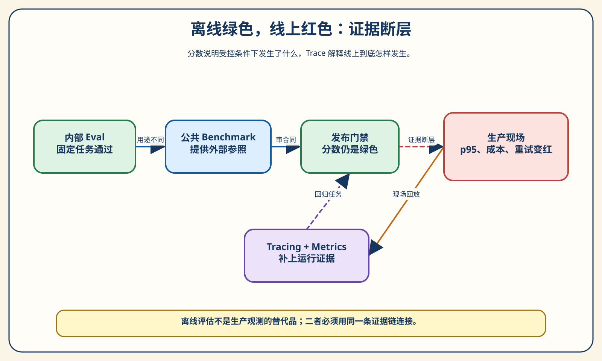
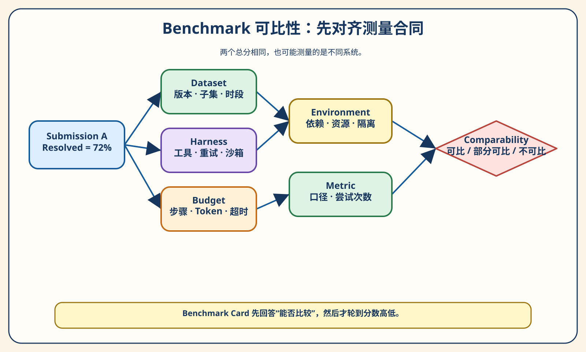
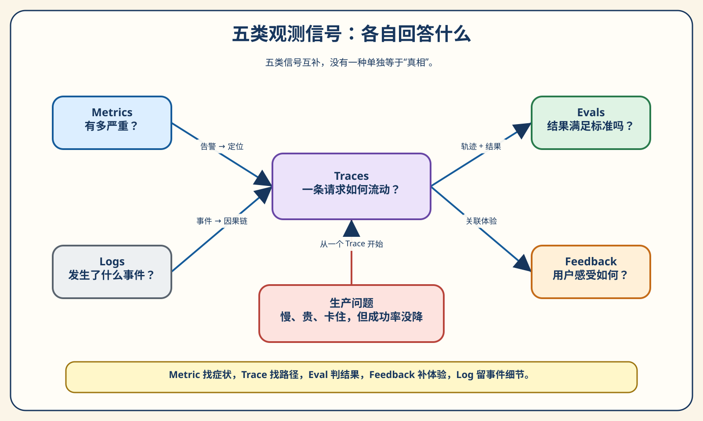
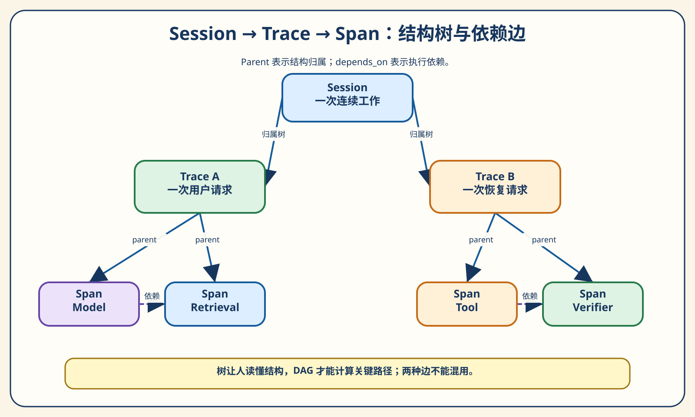
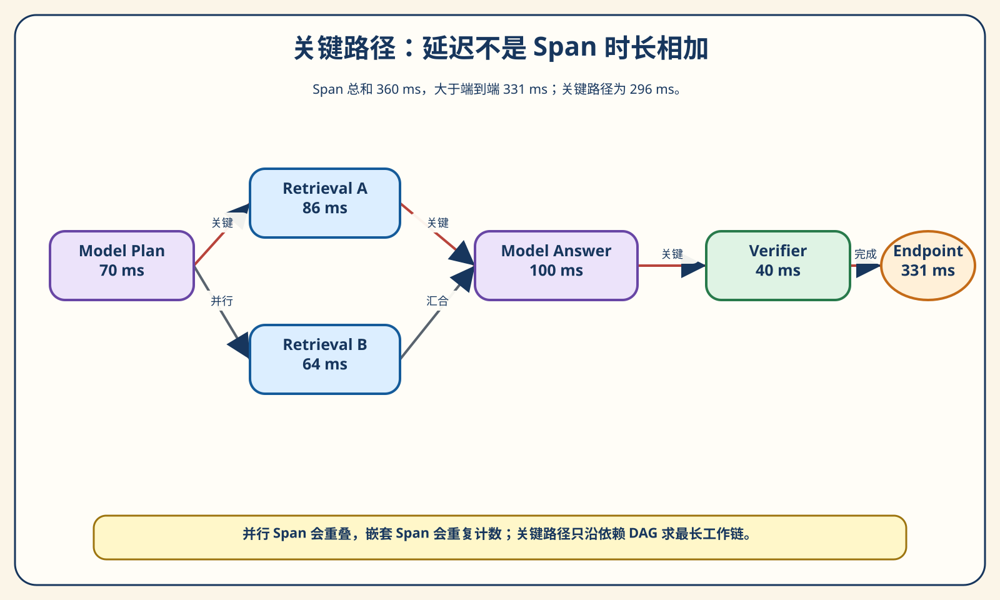
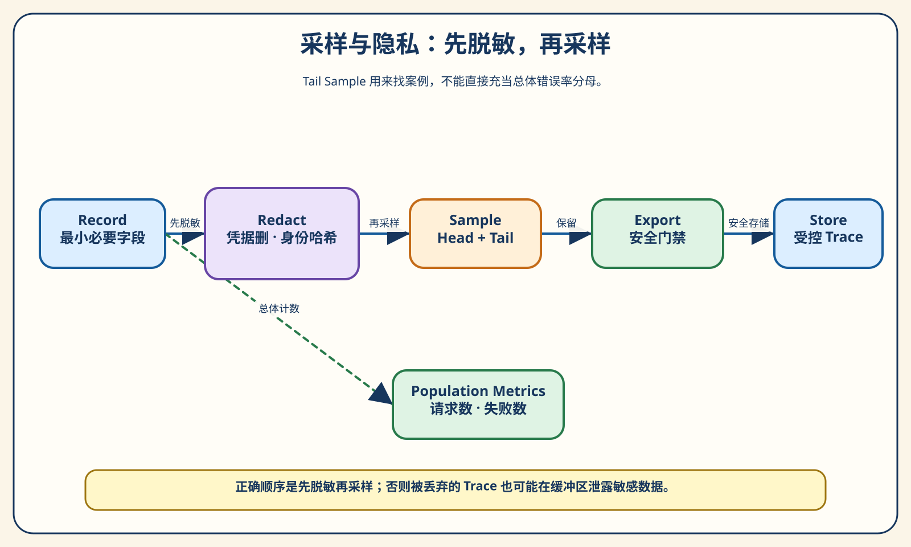
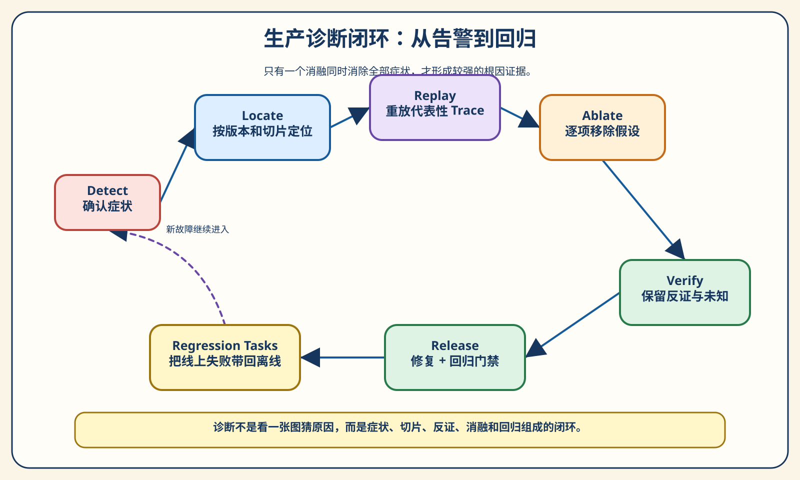

# 第 14 章 Benchmark、Tracing 与生产诊断：离线通过，线上为什么还是出问题

周一上午，新版知识助手通过了回归评测：24 个任务完成 23 个，平均结果分与旧版相同。团队放心发布。

下午，客服却开始抱怨“偶尔要等很久”。监控没有显示成功率下降，最终答案抽查也正常。有人怀疑模型，有人怀疑检索，还有人主张立刻回滚 Prompt。大家盯着同一个绿色分数，却对系统发生了什么一无所知。

后来团队把请求按场景拆开，才发现问题只集中在“工具失败后恢复”这一类任务：p95 延迟增加了 180 毫秒，教学成本单位多了 1.71，重试放大率从 1.3125 上升到 1.4375。再看 Trace，根因不是模型，也不是 Prompt，而是新版重试策略把本应只重试一次的工具调用扩大成了更长的一段工作。

这个故事揭示了 Agent 上线后的三个事实：

1. **Benchmark 的绿色，只说明它在一份特定测量合同下表现怎样。**
2. **成功率稳定，不代表延迟、成本、安全和用户体验稳定。**
3. **Tracing 不是把日志画得更漂亮，而是保留足够的因果证据，让猜测变成可验证的假设。**

> **阅读提示**
>
> 第 13 章解决的是“发布前怎样评估 Agent”。本章把视角移到公开 Benchmark 与生产运行：怎样判断两个分数能不能比较，怎样把一次请求拆成 Session、Trace 和 Span，怎样计算尾延迟与关键路径，怎样在采样和隐私约束下保留证据，以及怎样用切片、反证与消融定位回归。核心实验完全离线，不需要 API Key，也不连接任何观测平台。

**全章的短答案是：Benchmark 告诉你系统在受控题目上能否完成任务；Metrics 告诉你哪里出现异常；Trace 帮你解释一次运行怎样走到这个结果；Eval 和用户反馈判断结果是否有用。生产诊断必须把四类证据接起来，而不是让其中任何一个替代全部。**

## 先运行本章实验

本章实验位于 `chapter14/`。它构造三次发布：`stable`、`incident` 和 `fixed`。每次发布都运行同一组 24 个场景，覆盖简单问答、检索、受控写入和故障恢复四个切片，共生成 72 条确定性 Trace。

第一次从 fresh clone 运行时，请先按 [实验 README](../chapter14/README.md#环境与依赖) 创建 Python 3.11 虚拟环境并安装带哈希的测试依赖。运行时代码只使用标准库。

```powershell
# 在仓库根目录执行
.\.venv\Scripts\Activate.ps1
python -B -m pytest chapter14/tests -q

python -B -m chapter14.experiments `
  --group all `
  --output chapter14/.runs/reader-first
```

运行结束后，先看三个文件：

- `chapter14/.runs/reader-first/diagnostic-report.md`：适合快速阅读的结论；
- `chapter14/.runs/reader-first/diagnostic-report.json`：完整、可回归的证据合同；
- `chapter14/.runs/reader-first/group-5.json`：诊断、消融与回归任务。

规范报告中，三次发布都是 24 次请求、23 次成功，结果均值都是 `0.958333`。但 `incident` 的 p95 延迟从 432 毫秒升到 612 毫秒，成本单位从 16.03 升到 17.74，重试放大率从 1.3125 升到 1.4375。`fixed` 又回到与 `stable` 相同的数值。这里的“成本单位”来自仓库内固定费率卡，不是任何供应商价格；72 条 Trace 也是教学夹具，不是真实模型测量。



## 第一幕：先承认“通过”是有条件的

### Benchmark 测量的是系统，不只是模型

看到“模型 A 在某 Benchmark 得分 72，模型 B 得分 74”，人们很容易把差异归因于模型。然而对 Agent 来说，真正被测对象通常是：

```text
模型 + Prompt + 上下文装配 + 工具 + Harness + 权限策略
+ 环境 + 预算 + 重试 + 停止条件 + 评分器
```

模型只是这个系统中的一个变量。给同一个模型更多步骤、更长上下文、更强工具或三次重试，分数可能提高；换成不同的 Docker 镜像、测试补丁或文件权限，分数也可能改变。只公布模型名和最终分数，相当于公布一次赛车成绩，却隐去轮胎、赛道、天气和是否允许中途换车。

这不意味着公共 Benchmark 没有价值。它们把讨论从“我觉得很好用”推进到可重复任务，也让社区共享失败样本。问题在于：**分数不是事实的全部，测量合同才决定分数意味着什么。**

### 四个相邻概念，分别回答什么

| 概念 | 它回答的问题 | 最容易犯的错 |
| --- | --- | --- |
| Benchmark | 在固定任务与规则下，系统能做到什么 | 把不同版本、Harness 或预算的分数直接排序 |
| Evaluation | 输出和过程是否满足成功标准 | 只在离线跑一次，把结果当成生产可靠性 |
| Observability | 系统内部发生了什么，能否从外部证据推断 | 收集很多日志，却无法关联同一次请求 |
| Production diagnosis | 这次退化由什么造成，修复是否消除了症状 | 看到相关性就宣布根因，或凭经验先改模型 |

第 13 章的 Evaluation Harness 负责准备任务、运行 Trial、评分和汇总。本章的观测系统负责保留真实运行的指标、事件与因果关系。两者会共享 Trace 和 Eval 分数，但职责不同：前者设计受控测量，后者面对开放世界中的变化与不完整证据。

## 第二幕：先审 Benchmark，再看排行榜

### 一张 Benchmark Card 应记录什么

一个可解释的 Benchmark 结果，至少需要一张“测量身份证”。本章把它实现为 `BenchmarkCard`：

| 字段组 | 需要记录的内容 | 为什么不能省略 |
| --- | --- | --- |
| 任务合同 | Benchmark/版本、子集、任务时期、排除项 | 题目不同，分数没有共同分母 |
| 被测系统 | 模型、Prompt/Harness、工具、环境 | Agent 得分属于系统组合 |
| 资源合同 | 步数、Token、超时、重试、每题尝试数 | 更多资源可能直接换来更高通过率 |
| 指标合同 | 指标名称、聚合规则、失败与环境错误 | 同名“成功率”也可能有不同分母 |
| 来源与风险 | 原始来源、提交/版本、污染风险 | 结果必须可追溯，也要承认未知项 |

注意：记录分数并不等于证明分数。Card 的作用是让比较者知道哪些变量被固定、哪些变量变了、哪些事实仍然未知。若没有任务来源或关键预算，本章的加载器会拒绝这张 Card，而不是用空字符串假装可复现。



### 相同分数，也可能不可比较

本章夹具准备了两组对照。

第一组的任务版本、子集、模型、Harness、工具、环境、步数、Token、超时、重试和指标全部一致，只是来源标识与最终分数不同。比较器给出 `comparable`：这个差异至少来自同一测量合同，可以继续讨论统计波动和真实效果。

第二组的分数都等于 72，但一边使用 `harness-a`、40 步和一次有界重试，另一边使用 `harness-b`、80 步和三次有界重试。比较器给出 `partially_comparable`。分数相同并不能证明能力相同，因为达到分数的条件已经改变。

> **实验 14-1 ★：分数相同，比较仍然不成立**
>
> ```powershell
> python -B -m chapter14.experiments `
>   --group 1 `
>   --output chapter14/.runs/benchmark-audit
> ```
>
> 打开 `group-1.json`。先不要看 `score`，逐项检查 `task_contract`、`subject_contract`、`resource_contract` 和 `metric_contract`。再回答：如果只允许修改一个字段，应该先把 Harness、步数预算还是重试策略对齐？

这个实验有意让比较函数忽略“哪个分数更高”。只有合同可比，分差才值得解释；先看分数再补条件，容易让结论被期待牵着走。

在团队评审里，可以采用一个简单顺序。第一轮只看 Card，不显示分数，让评审者先写下“可比、部分可比或不可比”和理由；第二轮再揭示分数，讨论差值是否足以改变决策。这个小动作能降低锚定效应。若合同只有部分对齐，不必把结果全部丢弃，但结论要降级，例如“在更高步骤预算和不同 Harness 下达到相同结果”，而不是“两个系统能力相等”。

还要区分“复现同一数字”和“复现同一结论”。硬件、依赖源和非确定模型可能让精确分数波动，但如果多个固定种子、关键切片和失败类型都保持一致，结论仍可能稳健。反过来，两次运行碰巧得到相同总分，失败任务却完全不同，产品含义也可能相反。因此 Benchmark 报告应同时保存任务级结果与汇总，允许读者向下追溯，而不是只发布一行排行。

### SWE-bench 给我们的不是一个排行榜技巧

SWE-bench 把真实 GitHub issue 与仓库状态组成软件工程任务。原始数据集包含来自 12 个 Python 仓库的 2,294 个问题；SWE-bench Verified 从中形成 500 个经人工核验的样本。官方还提供 Lite、Multilingual 和 Multimodal 等变体。[来源：SWE-BENCH](sources/chapter14-sources.md#swe-bench)

| 变体 | 官方描述中的规模 | 更适合回答什么 | 比较时要特别检查什么 |
| --- | ---: | --- | --- |
| Original | 2,294 | 在原始真实 issue 集上的修复能力 | 仓库环境与任务质量差异 |
| Verified | 500 | 在人工筛过的可解任务上的表现 | Harness 版本与运行协议 |
| Lite | 300 | 更轻量的开发与比较 | 是否与完整版混报 |
| Multilingual | 300 | 跨 9 种语言、42 个仓库的软件任务 | 语言、仓库和工具支持 |
| Multimodal | 480 | 带视觉材料的问题修复 | 图像输入和多模态 Harness |

这些数字说明“同一个名字下面也有不同任务合同”。更重要的是，SWE-bench Verified 官方页面明确提醒：某些 1.x 与 2.x 结果并不天然可比，因为动作表达可从解析文本变成工具调用，默认运行环境也可能变化。也就是说，榜单自己就在告诉我们：**Harness 不是脚注，而是测量对象的一部分。**[来源：SWE-BENCH-VERIFIED](sources/chapter14-sources.md#swe-bench-verified)

本章不抄录容易过期的实时榜单分数。读者真正应该带走的是审计方法：确认数据集版本、实例子集、仓库提交、容器镜像、补丁应用方式、测试集合、工具接口、资源预算、尝试次数、排除规则和统计口径。

### 污染、饱和与“看过答案”

公共 Benchmark 还面临一个无法靠分数自身解决的问题：题目、补丁、讨论或派生答案可能进入训练数据或搜索索引。即使无法证明某个模型“记住了答案”，也应把污染风险作为 Card 的一等字段，而不是默认为零。[来源：BENCHMARK-CONTAMINATION](sources/chapter14-sources.md#benchmark-contamination)

可采取的工程措施包括：

- 记录任务发生时间与模型知识截止时间，而不是只写数据集名称；
- 保留时间外、私有或动态生成的补充集；
- 比较补丁内容、工具轨迹和失败类型，不只看最终测试；
- 把公开集用于生态沟通，把内部回归集用于发布门禁；
- 当任务饱和时升级题目，而不是继续用 0.x 分差讲大故事。

公共 Benchmark 与内部评测最好承担不同职责。公共集拥有共同语言、公开任务和社区复现，适合回答“这个系统在行业共同题目上大致处于什么位置”；内部集来自真实业务、权限合同和历史事故，更适合回答“这个版本能否安全发布”。前者若完全决定产品路线，团队可能为了榜单优化而忽略用户；后者若完全取代公共集，团队又容易在自己的窄分布里自我感觉良好。

一个健康组合是：用公共 Benchmark 观察能力边界与生态趋势，用内部 Capability Suite 探索新价值，用 Regression Suite 守住已承诺行为，再用生产反馈发现三者都没覆盖的新问题。四套证据的任务可能重叠，但分数不应混成一个总榜。公开题的污染风险、内部题的代表性偏差、回归题的逐渐变简单，都要分别管理。

复现也不等于把他人的命令复制一遍。真正的复现记录应包含代码提交、任务快照、容器或依赖锁、硬件与并发、网络策略、工具 Schema、预算、随机种子、失败重跑规则和原始任务级结果。缺少其中一部分时，可以称为“近似复跑”，但不要用精确到小数点后两位的分数制造虚假确定感。

**失败样本 1：排行榜倒置。** 团队看到候选系统高 2 分就换模型，后来才发现候选拥有双倍步骤和三次尝试。真正变化的是资源合同，不足以归因于模型。

## 第三幕：Observability 不是“把所有东西都记下来”

### 五类信号，各自只回答一部分问题

| 信号 | 最擅长回答 | 典型例子 | 单独使用时的盲区 |
| --- | --- | --- | --- |
| Metrics | 何时、哪类请求异常 | p95、错误率、Token、队列长度 | 看不见一次请求的因果过程 |
| Logs | 某个离散事件说了什么 | 超时文本、策略拒绝、异常栈 | 顺序与关联常靠人工拼接 |
| Traces | 一次请求经过哪些步骤 | 模型、检索、工具、审批、重试 | 不自动证明答案正确 |
| Evals | 结果与过程是否满足标准 | 正确性、安全性、引用质量 | 依赖任务和 Grader 的质量 |
| Feedback | 用户是否感到有用 | 点赞、纠正、升级人工 | 稀疏、有偏且受界面影响 |

Metrics 适合发现“p95 上升了”；Trace 适合解释“哪些 Span 构成了慢请求”；Eval 可以告诉你“变慢的同时答案有没有变差”；反馈则提醒你“测量是否贴近真实价值”。五者不是替代关系，而是一个逐步缩小调查范围的证据链。

一个实用的值班路径是：先由低成本 Metrics 发出告警，按 release、场景和状态切片；再从异常桶中取得脱敏 Trace，检查关键 Span、依赖和错误；随后把可疑 Trace 交给确定性规则或 Eval 复核结果质量；最后用反馈确认用户影响。Logs 贯穿其间，提供异常细节，但不承担跨请求聚合。这样，每种信号都做自己擅长的工作，调查者也不会一上来就在海量日志里搜索关键词。

信号之间还应共享最小关联键。至少包括 release、environment、session/trace、scenario slice 和稳定错误码。若 Metric 只标“tool_error”，Trace 却用自由文本“连接失败”，Eval 又只存用户问题，三套系统即使都有数据也无法会合。统一关联键比统一所有后端更重要：后端可以更换，证据链不能每次重建。

反馈也需要谨慎解释。点赞用户通常不是随机样本，长时间等待后离开的用户甚至不会提交反馈；客服升级可能受值班规则影响，而不是只由答案质量决定。因而“点赞率没降”不能推翻延迟告警，“投诉增加”也不能直接证明模型退化。更好的做法是把反馈视为待解释的产品信号，按版本、场景、等待时间和任务结果关联，再抽样阅读真实案例。



### Session、Trace 与 Span：三个层级不要混

以一个“帮我比较两个政策并更新工单”的对话为例：

- **Session**：用户围绕同一目标进行的多轮交互，可能包含多条请求；
- **Trace**：一次端到端请求，从接收输入到返回或失败；
- **Span**：Trace 中一个有边界的工作单元，例如模型生成、两路检索、审批或工具写入。

Langfuse 的数据模型也用 Session 聚合多个 Trace，用 Observation 表示 Trace 中可嵌套的工作单元。OpenTelemetry 则用 Span 表示工作单元，并通过父子关系和链接表达关联。[来源：LANGFUSE-DATA-MODEL](sources/chapter14-sources.md#langfuse) [来源：OTEL-TRACES](sources/chapter14-sources.md#opentelemetry)

本章选择 `Session → Trace → Span` 作为教学词汇，并不声称本地 JSON 严格符合某个平台的 Schema。跨平台时应做适配，而不是把一个厂商字段名硬塞进领域模型。

### 父子结构和执行依赖不是一回事

这是 Tracing 中最容易被低估、也最影响延迟计算的边界。

父子关系回答“谁在结构上包含谁”。一次 Agent Trace 可以有根 Span，下面包含模型规划、两路并行检索、工具执行和验证。它适合展示调用树。

依赖关系回答“谁必须等谁完成”。两路检索可能都是根 Span 的子节点，却彼此并行；验证需要等待两路检索都结束。它适合计算关键路径。

如果只保存开始/结束时间而不保存依赖边，时钟偏差、异步任务和批处理很容易让因果关系变得含糊。本章的 `SpanRecord` 因而同时保存 `parent_span_id` 与 `depends_on`。验证器会独立检查父子树和依赖图：未知父节点、子节点越出父区间、依赖项晚于当前工作开始、父图成环或依赖图成环，都会在计算指标前失败关闭。



**日志乱序时，Trace 仍应可重建。**

分布式系统里的日志并不保证按业务因果顺序到达。缓冲、线程调度、网络重传和批量导出都可能造成乱序。如果诊断逻辑依赖“文件第 20 行一定发生在第 19 行之后”，它在本机 Demo 中工作，上线后却会失真。

> **实验 14-2 ★★：把日志打乱，再重建 Trace**
>
> ```powershell
> python -B -m chapter14.experiments `
>   --group 2 `
>   --output chapter14/.runs/trace-structure
> ```
>
> `group-2.json` 同时给出有效 Trace、确定性打乱后的日志，以及结构验证结果。观察系统怎样使用 `trace_id`、`span_id`、父子边、依赖边和时间字段恢复结构，而不是信任文本行顺序。

**失败样本 2：按日志行猜因果。** 检索完成日志晚于验证日志到达，工程师断言“系统先验证、后检索”。真正的问题只是两个 Exporter 缓冲策略不同。没有稳定关联 ID 与因果边，日志顺序只能提供线索，不能当作证明。

**Trace Schema 先求稳定，再求丰富。**

生产观测常见的错误是第一天只存一行文本，第二天把完整 Prompt、用户资料、工具参数、Token 和异常对象全塞进去。结果是字段含义不断改变，高基数爆炸，隐私边界失控，仪表盘也难以长期复用。

更稳妥的顺序是：

1. 固定身份字段：schema、release、session、trace、span；
2. 固定结构字段：kind、parent、dependency、start、duration、status；
3. 固定可聚合字段：模型/工具类别、场景切片、重试次数、用量覆盖；
4. 把高风险内容分层：摘要、哈希、引用或受控正文；
5. 为字段变化发布新 Schema，而不是静默改义。

本章合同使用冻结数据类，并在序列化时保留显式 `null`。缺失 Token 用量就是缺失，不能用字符数估算后冒充供应商账单。Trace 只有通过结构与隐私验证，才允许进入指标计算和导出。

这里还要区分“运行字段”和“解释字段”。`duration_ms=620` 是可机械验证的运行事实；`reason="模型犹豫"` 往往只是观察者的解释。前者适合进入稳定 Schema，后者应以假设、标注或受控枚举保存，并明确是谁、在什么时候给出的判断。把解释伪装成事实，后续分析会在不知不觉间循环论证：先把某 Span 标成“模型问题”，再统计“模型问题最多”。

同样，Trace 不是越完整越好。记录每个输入字符能提高回放能力，却也增加隐私、存储与访问风险；只记耗时和状态最安全，却可能无法定位引用错误。工程上应按风险分层：低风险元数据可以长期聚合，受控正文缩短留存并限制访问，高敏感内容只在获得明确授权的隔离环境中暂存。观测设计本质上也是数据产品设计。

## 第四幕：延迟、成本与重试，需要正确的数学对象

### 平均值为何会掩盖用户真正遇到的慢

假设十次请求耗时为：

```text
100, 105, 108, 110, 111, 113, 116, 118, 120, 900 ms
```

平均值是 180.1 毫秒，看起来还能接受；但最慢用户等了 900 毫秒。分位数把“典型体验”和“尾部体验”分开：p50 接近普通请求，p95/p99 更关注慢尾。Google SRE 的实践也强调，平均值会掩盖尾部延迟，分位数更适合描述请求分布。[来源：GOOGLE-SRE-SLO](sources/chapter14-sources.md#google-sre)

分位数算法必须写进合同。不同工具可能用 nearest-rank、线性插值或流式近似；小样本下，它们的结果尤其容易不同。本章明确使用 `nearest-rank.v1`，先排序，再取 `ceil(p × n)` 对应位置。你不一定要永远使用它，但必须让同一报告前后使用同一种定义。

### Span 时长相加，为什么会虚增延迟

考虑一次请求：模型规划 80 毫秒，然后并行发起检索 A（120 毫秒）和检索 B（200 毫秒），最后验证 40 毫秒。

简单相加得到：

```text
80 + 120 + 200 + 40 = 440 ms
```

但用户真正等待的关键路径是：

```text
80 + max(120, 200) + 40 = 320 ms
```

两路检索贡献了 320 毫秒的“工作量”，却只有较慢的一路决定端到端等待。关键路径是依赖图中耗时最长的有效路径；容器 Span 只用于结构展示，不应与其子 Span 再次相加。



**失败样本 3：Span 总和当端到端延迟。** 团队优化了一个 120 毫秒的并行检索 Span，仪表盘上的“总工作时长”下降，用户等待却几乎没变，因为另一条 200 毫秒路径仍是瓶颈。没有依赖图，优化很容易落在非关键路径上。

> **实验 14-3 ★★：找到真正变慢的切片与关键路径**
>
> ```powershell
> python -B -m chapter14.experiments `
>   --group 3 `
>   --output chapter14/.runs/latency-cost
> ```
>
> 对比三次发布。`simple`、`retrieval`、`write` 的 p95 分别保持 177、343、292 毫秒；只有 `recovery` 从 440 升到 620 毫秒。再比较总时长与关键路径，确认报告没有重复计算并行 Span。

**成本必须带费率版本，用量必须带覆盖率。**

“总共用了 6,000 Token”仍不等于成本。输入、输出、缓存、工具执行和不同模型可能有不同计费方式；价格也会变化。可靠报告应保留原始用量、币种/单位、费率卡版本与计算时间，而不是只写一个无法复算的金额。

本章没有绑定真实供应商价格，而是用 `chapter14.cost-units.v1` 教学费率卡计算稳定单位。`incident` 的已知输入/输出分别为 5,496 和 1,622，`stable` 为 4,866 和 1,457；三次发布各有一个 Token 字段缺失，因此报告同时给出覆盖率，而不是把空值当 0。

这里有一个很重要的纪律：

```text
已知用量总和 ≠ 全部请求真实用量
```

只有当覆盖率为 100%，二者才可能相等。覆盖率不足时，可以比较已知部分，但必须标注不确定性；如果缺失集中在最慢或最贵的请求，简单外推甚至会系统性低估成本。

**重试放大率要以逻辑操作为分母。**

一次“查询知识库”是一个逻辑操作。它因为瞬时错误执行三次，就是三个可计费尝试。定义：

```text
retry_amplification = 可计费尝试数 / 声明的逻辑操作数
```

比值为 1 表示没有额外尝试；大于 1 表示存在重试或重复执行。这个指标不判断重试是否合理，但能回答新版是否让同样任务产生更多工作。

本章的 `incident` 从 1.3125 上升到 1.4375。单看这个数仍不能证明根因，因为复杂任务比例变化也会影响它。只有在同一组 24 个场景、同一预算与同一合同下，再结合 recovery 切片和 Trace，差异才具有诊断价值。

重试还有一层语义问题：重试范围。工具调用失败后，只重试这个幂等调用，通常比重新执行“上下文装配 → 模型规划 → 工具调用”整段链路更便宜、更可预测。如果工具具有副作用，还必须先确认幂等键、执行回执与未知状态；否则一次网络超时可能让系统把“结果没收到”误解成“操作没发生”，从而重复扣款、重复发信或重复写入。第 4 章的 Harness 边界在这里转化为可观测指标：重试了什么、重试几次、是否跨越副作用边界，都应在 Trace 中明确。

因此，延迟、成本和重试不能被拆成三个互不相关的 Dashboard。它们往往描述同一条因果链：超时阈值过短触发重试，重试扩大模型与上下文工作，最终同时推高 p95 与成本。把它们按 `trace_id` 和 release 关联起来，才有机会从三个红灯还原一个系统问题。

## 第五幕：采样与隐私，是观测系统的入口条件

### Head Sampling 与 Tail Sampling 的取舍

生产 Trace 量可能远高于存储和查询预算。采样不是“随便少存一点”，而是决定哪些证据永远不会再出现。

| 策略 | 决策时机 | 优点 | 主要风险 | 适合保留什么 |
| --- | --- | --- | --- | --- |
| Head Sampling | 请求开始附近 | 低延迟、简单、便于稳定按比例采样 | 决策时还不知道请求会不会失败或变慢 | 无偏的基础样本、容量受控流量 |
| Tail Sampling | Trace 完成或接近完成后 | 能按错误、慢请求、版本、策略事件保留 | 需要暂存状态，成本和实现复杂度更高 | 事故诊断、罕见错误、高价值事件 |
| Combined | 先 Head，再用 Tail 补充 | 同时保留基础样本和重要异常 | 合并与分母最容易被误解 | 生产中的常见折中 |

OpenTelemetry 文档同样区分 Head 与 Tail：前者通常在 Trace 早期决定，无法使用完整 Trace 信息；后者能利用完整 Span 集合，却需要更多状态和资源。[来源：OTEL-SAMPLING](sources/chapter14-sources.md#opentelemetry)



### Trace Coverage 与 Telemetry Completeness 不是一个数

本章 72 条 Trace 中，组合策略保留 49 条明细，因此 `trace_coverage = 49 / 72 = 0.680556`。同时，有 69 条 Trace 的遥测完整，因此 `telemetry_completeness = 69 / 72 = 0.958333`。

二者回答完全不同的问题：

- Trace Coverage：有多少请求的明细被保留；
- Telemetry Completeness：应出现的关键字段或 Span 有多少真正出现；
- Population Counter：总请求、总失败等是否在采样前独立计数。

本章在采样前知道总体共有 72 个请求、3 个失败。Tail 策略保留了 12 条带错误 Span 的 Trace，但这不代表总体有 12 个失败请求：一条最终成功的 Trace 也可能包含一次失败后重试成功的 Span。更不能用保留下来的 49 条作为总体成功率分母，因为 Tail 本来就偏向异常和新版本。

**失败样本 4：把 Tail 样本当生产分布。** 事故期间 Tail 策略保留全部错误请求，只保留少量正常请求。团队用样本计算“错误率 24%”，造成二次告警。正确做法是从采样前计数器计算总体错误率，用 Tail 样本解释错误形状。

### 脱敏必须发生在导出与采样之前

“先把原始 Prompt 发到观测平台，再在 UI 里隐藏”不叫数据最小化。数据已经越过信任边界，采样未命中的内容也可能短暂进入队列、缓存或其他 Exporter。

本章的顺序固定为：

```text
原始事件 → 应用侧递归脱敏 → 导出安全验证 → 采样 → 保留/丢弃
```

脱敏器处理嵌套密钥、身份字段和工具参数；敏感值可以删除、替换或在带盐条件下生成不可逆关联摘要。Export Gate 再扫描禁止字段与危险值，发现遗漏就拒绝导出。Langfuse 的 masking 文档也提醒：掩码作用于导出副本，若同时配置其他 Exporter，需要分别处理；若数据绝不能离开信任边界，应在应用侧完成处理。[来源：LANGFUSE-MASKING](sources/chapter14-sources.md#langfuse)

### 不要把隐藏思维链当作观测目标

Agent 可观测性需要的是可审计事件：模型请求的版本与摘要、工具提议、策略判断、工具结果、引用、状态迁移、错误、重试和验证。它不要求、也不应依赖模型不可验证的隐藏思维过程。

生产中更可靠的做法是记录**显式理由与证据引用**：为什么选择某工具、用了哪些文档 ID、哪条策略触发审批、哪项验证失败。它们可以被 Schema 校验、权限控制和回放。自由文本“内心独白”既可能泄露敏感信息，也不能当作系统真实因果。

> **实验 14-4 ★★：先脱敏，再比较 Head 与 Tail**
>
> ```powershell
> python -B -m chapter14.experiments `
>   --group 4 `
>   --output chapter14/.runs/sampling-privacy
> ```
>
> 检查 `group-4.json`：固定比例 Head 采样会错过一个罕见错误；Tail 会保留错误、慢请求、审批/安全事件、遥测不完整和新发布；组合策略最终保留 49 条 Trace。然后确认报告仍用 72 作为总体请求分母。

## 第六幕：从“相关”走到“可证伪的根因”

### 第一步：把症状写成可比较的句子

坏的事故描述是：“Agent 最近好像变笨、变慢、也更贵了。”

好的事故描述要固定对象、窗口、切片和指标：

```text
在相同 24 个教学场景上，incident 相对 stable：
Outcome 均值不变；p95 延迟 +180 ms；
成本单位 +1.71；重试放大率 +0.125。
退化只出现在 recovery 切片。
```

这句话把调查从“所有地方都有可能”缩小到“恢复路径新增了额外工作”。若只看总体成功率，事故甚至不会被发现；若只看总体 p95，又会让简单问答、检索和写入团队一起背锅。

**第二步：列候选原因，也主动找反证。**

本章列出五个候选原因：模型、Prompt、上下文装配、工具延迟和重试策略。候选清单不是投票，而是后续实验的目录。

支持证据来自三条 incident/recovery Trace：`trace-incident-recovery-01`、`03` 和 `05`。它们展示恢复路径上的额外尝试。反证来自四条 incident/simple Trace：同一发布下，它们没有出现相同退化。这使“整个模型都变慢了”变得不太可信。

反证很重要。只搜支持自己猜测的 Trace，几乎总能找到一个看似合理的故事；只有主动寻找“如果这个原因是真的，哪里也应该出问题”，假设才可能被推翻。

**第三步：切片只是定位，不是因果证明。**

recovery 切片变慢说明问题与恢复路径有关，但仍不能区分：

- 工具服务真的变慢；
- 超时阈值改变；
- 重试次数改变；
- 每次重试错误地重复了模型规划与上下文装配；
- 采样或时钟错误制造了假象。

因此诊断不能停在 Dashboard。下一步要控制变量：保持其他部分不变，只替换一个候选因素，观察症状是否消失。这就是消融或反事实对照。

### 第四步：消融实验怎样收缩根因

本章的确定性消融得到下面的证据：

- 固定模型为稳定合同：p95、成本和重试症状都还在；
- 固定 Prompt：三个症状都还在；
- 固定上下文装配：成本降到 16.885，但延迟与重试症状仍在；
- 固定工具延迟：p95 回到 432，但成本与重试仍异常；
- 固定重试策略：p95 回到 432，成本回到 16.03，重试放大率回到 1.3125。

所以报告把根因标为 `retry_policy`，结论为 `confirmed`，置信度为 0.92。这个 0.92 是教学合同中的确定值，不是从真实世界概率模型估计出的“92% 必然正确”。报告仍保留两个未知项：Provider Usage 部分缺失；教学夹具不证明现实因果。



> **实验 14-5 ★★★：从告警走到可回归的根因**
>
> ```powershell
> python -B -m chapter14.experiments `
>   --group 5 `
>   --output chapter14/.runs/diagnosis-loop
> ```
>
> 阅读 `group-5.json` 中五个消融结果。解释为什么“固定工具延迟”只能消除延迟症状，而“固定重试策略”同时消除延迟、成本和重试放大。最后检查三条回归任务怎样从支持 Trace 生成。

**第五步：把事故变成回归任务。**

一次事故若只留下复盘文档，下次仍可能以同样方式回来。本章从根因生成三个任务：

1. `reg-retry-latency`：修复版 recovery p95 不得差于稳定版；
2. `reg-retry-cost`：工具重试不能重复上下文装配或模型规划；
3. `reg-retry-amplification`：重试放大率回到稳定边界。

这些任务不是把生产请求原样公开。它们提炼失败形状，删除敏感内容，固定最小环境和断言，再进入第 13 章式的回归评测。这样，Tracing 的终点不是“看懂一张瀑布图”，而是把新知识写回测试、指标和发布门禁。

这一步也防止另一种常见浪费：事故修复只验证“当时那一条请求”。如果根因是重试范围，回归任务就不应只硬编码一个 Trace ID，而应覆盖工具瞬时失败、检索超时和审批恢复等多个共享机制的场景。相反，如果把所有恢复问题塞进一个巨大端到端任务，失败时又很难知道合同哪一层退化。好的回归任务既保留事故的机制特征，又尽量缩短环境和断言。

生产证据转成离线任务后，还需要双向链接：Incident Report 指向回归任务，回归任务保存脱敏后的来源 Trace ID。将来任务被修改或删除时，维护者可以回到事故理由；线上再次出现相似症状时，也能知道已有哪条保护。本章 `regression_task_ids` 和 `source_trace_ids` 就是这条血缘关系的最小实现。

## 第七幕：把概念映射到成熟工具

### OpenTelemetry、Langfuse 与 OpenAI Agents SDK 各接管什么

| 本章概念 | OpenTelemetry | Langfuse | OpenAI Agents SDK tracing |
| --- | --- | --- | --- |
| Trace/Span 传播 | 通用 Trace、Span、Context、Link 与 Export | Trace 与嵌套 Observation | 自动记录 Agent、生成、工具、交接、Guardrail 与自定义 Span |
| Metrics/Logs | 多信号规范与 SDK 生态 | 产品级观测、筛选与看板 | 重点是 Agent Trace，不替代完整基础设施监控 |
| Eval/Feedback | 不负责业务成功标准 | Score 可挂到 Trace、Observation、Session 或 Dataset Run | 可把 Trace 交给外部评估流程 |
| 采样与导出 | Head/Tail Sampling、Collector、Exporter | Ingestion、存储、查询与平台能力 | Trace Processor/Provider 可定制导出 |
| 隐私责任 | 由应用、SDK/Collector 与后端共同实施 | 提供 masking，但其他 Exporter 需单独处理 | 提供敏感数据配置；自定义导出仍须自行失败关闭 |

OpenTelemetry 适合建立跨组件的可移植遥测骨架；Langfuse 把 LLM/Agent Trace、Session、Prompt、Score 和评测工作流放在一个产品模型中；OpenAI Agents SDK 可以自动捕获 Agent 运行中的模型、工具、交接和 Guardrail 事件。它们可以组合，不必三选一。[来源：OTEL-TRACES](sources/chapter14-sources.md#opentelemetry) [来源：LANGFUSE-EVALUATION](sources/chapter14-sources.md#langfuse) [来源：OPENAI-AGENTS-TRACING](sources/chapter14-sources.md#openai-agents-sdk)

这里的映射核对日期为 2026-09-26，只用于概念定位，不承诺字段与 API 永久不变。完整映射见 [集成说明](../chapter14/integrations.md)。OpenTelemetry 的 GenAI Agent Span 语义在核对时仍标记为 Development，因此本章不把本地 Schema 宣称为官方兼容实现。[来源：OTEL-GENAI](sources/chapter14-sources.md#otel-genai)

### 一个最小接入策略

如果现有 Agent 还只有散乱日志，不必第一天就购买平台或重写运行时。可以按这个顺序演进：

1. 为每次请求生成稳定 `trace_id`，为工作单元生成 `span_id`；
2. 固定 release、scenario slice、status、duration 和错误分类；
3. 先覆盖模型、检索、工具、审批、重试和 Verifier 六类关键 Span；
4. 在应用侧脱敏，再交给 OpenTelemetry 或目标平台 Exporter；
5. 用少量固定 Eval/反馈关联 Trace；
6. 先做一个真实事故的端到端重放，再扩展更多字段。

字段不是越多越成熟。能用稳定 ID 把一次用户抱怨连接到版本、Trace、工具错误、评估分数和修复回归，往往比收集完整对话但无法检索更有价值。

接入后的第一个验收问题不应是“平台里有没有漂亮瀑布图”，而应是：给定一条用户投诉，能否在权限允许范围内找到对应 Trace；给定一次发布，能否计算同口径的总体指标；给定一个慢 Trace，能否找出关键路径；给定一个疑似敏感字段，能否证明它在越过信任边界前已被处理；给定一次事故，能否生成可重复的回归任务。这五个问题通过后，再增加更多自动插桩和可视化。

## 生产环境中最常见的八种误判

**只看成功率，忽略质量保持下的资源退化。**

本章事故就是这种形状：三次发布的 Outcome 都是 0.958333，但 incident 更慢、更贵、重试更多。对于有超时、并发或预算上限的系统，资源退化最终也会转化成失败，只是当前样本还没有越过阈值。

**把相关发布当根因。**

“问题从新版开始”只能确定时间相关。新版可能同时更换模型、Prompt、检索索引、工具版本、重试策略和流量结构。没有逐项版本字段与消融，回滚一个变量后恢复也可能只是碰巧。

**让高基数字段拖垮观测系统。**

把完整 Prompt、URL、用户 ID 或任意异常文本作为 Metric 标签，会产生几乎无限的时间序列。Metrics 标签应使用有限枚举，如 release、slice、status、tool_kind；高基数详情留在 Trace，并通过访问控制和留存策略管理。

**用 Span 数量代表复杂度。**

不同 SDK 的自动插桩粒度不同。一个系统把每次序列化记录成 Span，另一个只记录工具调用，前者自然“步骤更多”。跨版本比较 Span 数量前，必须固定 instrumentation 版本和 Span 语义。

**Head Sampling 漏掉罕见事故。**

固定 1% Head 样本从统计上能控制容量，但一个万分之一且损失巨大的安全事件可能连续多天不被保留。关键策略拒绝、越权尝试和高价值写操作通常需要独立审计通道或 Tail 规则，不能只依赖概率。

**Tail Sampling 反过来夸大事故。**

Tail 样本故意偏向错误和慢请求，适合诊断，不适合直接估计总体比例。总体计数必须在采样前形成，或者使用已知抽样概率和正确的加权估计。

**遥测不完整，却给出过度确定的结论。**

若关键工具 Span 大量缺失，“没看到工具错误”不等于“工具没有错误”。本章在完整率为 0.958333 时仍显式保留 unknown；当缺失集中在受影响切片时，应把诊断降级为 `inconclusive`，优先修观测。

**Trace 包含敏感数据，事后才想治理。**

Prompt、检索文档、工具参数和输出可能同时包含身份信息、密钥、商业数据与受版权保护内容。必须在采集设计时确定字段白名单、脱敏位置、留存期、访问角色和删除流程；“出了事再清理”往往已经太晚。

这些误判常常成对出现：为了避免遗漏事故而收集全部正文，又因为成本太高突然降低采样；为了让指标稳定而删掉高基数维度，又失去定位具体 Trace 的入口；为了快速判断根因而给每个异常贴标签，最后标签反过来支配分析。解决办法不是寻找一个完美参数，而是把总体计数、诊断明细、敏感正文和人工解释分成不同数据层，各自设置用途、保留时间和访问规则。

## 一份可交付的生产诊断报告

报告不应只有截图和一句“疑似模型抖动”。本章的 `IncidentReport` 至少保存：症状、受影响切片、候选原因、支持 Trace、反证 Trace、消融结果、数据完整率、未知项、结论、置信度、建议动作和回归任务。

一个人类可读摘要可以写成：

```yaml
symptom: outcome 不变，p95、成本单位和重试放大退化
affected_slice: recovery
conclusion: confirmed
root_cause: retry_policy
supporting_traces: 3
counterevidence_traces: 4
data_completeness: 0.958333
unknowns:
  - provider_usage_partially_missing
  - fixture_does_not_prove_real_world_causality
actions:
  - 将重试范围限制在失败的工具调用
  - 发布前重放 recovery 切片
  - Trace 采样时仍保留总体计数器
```

它既给结论，也留下推翻结论的入口。支持证据告诉接手者从哪里复查，反证避免把局部问题泛化，unknown 则防止报告把“没测到”写成“没有”。

报告还应保存时间边界与决策责任。生产指标随流量、依赖和配置变化，同一查询下周可能得到不同结果；没有查询窗口、时区、发布标识和数据快照，截图很难重放。结论也不应自动等于动作：确认根因后，是立即回滚、灰度修复，还是接受短期成本换取更高恢复率，需要结合风险和业务优先级，由明确责任人决定。

当证据不足时，`inconclusive` 是一种成熟结论，而不是失败。例如受影响切片只有两条完整 Trace，或两个候选消融都能消除症状，就应先补充插桩或设计更能区分假设的实验。强行选择一个根因会把修复成本转移到下一次事故。诊断系统的质量，不只体现在它能确认多少问题，也体现在它知道何时不能确认。

## 本章代码的阅读顺序

建议不要从 CLI 参数或图表开始背，按证据流阅读：

1. [contracts.py](../chapter14/contracts.py)：Benchmark、Span、Trace、采样与事故报告合同；
2. [fixtures/benchmark-cards.json](../chapter14/fixtures/benchmark-cards.json)：为什么同分仍可能不可比；
3. [trace_builder.py](../chapter14/trace_builder.py)：72 条 Trace 怎样固定生成；
4. [trace_validation.py](../chapter14/trace_validation.py)：父子树、依赖图和导出边界怎样失败关闭；
5. [metrics.py](../chapter14/metrics.py)：nearest-rank、关键路径、用量覆盖和重试放大；
6. [privacy.py](../chapter14/privacy.py) 与 [sampling.py](../chapter14/sampling.py)：先脱敏、后采样，分母怎样分离；
7. [diagnosis.py](../chapter14/diagnosis.py)：切片、反证、消融和回归任务；
8. [experiments.py](../chapter14/experiments.py)：五组证据怎样汇总成稳定报告。

报告 Schema 位于 [production-diagnostics-v1.schema.json](../chapter14/schemas/production-diagnostics-v1.schema.json)。规范产物位于 `chapter14/reports/`；输出目录已存在时默认拒绝覆盖，显式 `--replace` 会先把旧目录改名为 `.previous-N`，不会直接删除。

## 本章证明了什么，又没有证明什么

本章用固定、可重复的教学实验说明：

- Benchmark 分数只有在任务、系统、资源和指标合同对齐后才可比较；
- Agent 生产质量需要 Metrics、Trace、Eval 和反馈的互补证据；
- 父子结构与工作依赖必须分开，关键路径不能用 Span 时长简单相加；
- 延迟、用量、成本、重试都需要明确算法、费率版本和覆盖率；
- Head 与 Tail 采样服务不同目标，Tail 样本不能作为总体分母；
- 脱敏应发生在采样和导出前，缺失遥测必须产生 unknown；
- 切片、反证和单变量消融能把候选原因收缩为可回归假设；
- 事故证据最终应转化为离线回归任务和发布保护。

它没有证明：

- 任何真实模型、Agent 产品或观测平台比另一个更强；
- 72 条教学 Trace 能代表真实生产分布；
- 教学成本单位等同于美元或任一供应商账单；
- 固定反事实夹具已经证明真实世界中的因果关系；
- 本地 Schema 严格兼容 OpenTelemetry、Langfuse 或 OpenAI Agents SDK；
- 采样策略适用于所有流量、监管和数据驻留要求；
- 只靠 Trace 就能替代领域专家、用户研究或事故现场信息。

证据边界不是文末礼貌性的免责声明。它决定团队可以基于报告做什么决定：本章足以验证诊断机制和数据合同，却不足以给真实生产容量、价格或厂商能力下结论。

## 本章小结

我们从一个“离线绿色、线上变慢”的事故出发，走过一条完整证据链：

1. 用 Benchmark Card 判断两个分数是否具有共同测量合同；
2. 用 Metrics 发现 p95、成本和重试退化；
3. 用 Session、Trace、Span 和依赖边重建运行过程；
4. 用切片把异常定位到 recovery；
5. 用支持证据与反证建立可证伪假设；
6. 用消融区分模型、Prompt、上下文、工具延迟和重试策略；
7. 用回归任务把事故经验写回发布流程。

成熟的生产诊断不是“多装一个 Dashboard”，而是让每个结论都能回答：比较合同是否一致，分母是什么，数据完整到什么程度，证据来自哪些请求，有什么反证，改变哪个变量后症状消失，以及这次经验怎样阻止下一次事故。

## 分层练习

下面练习的可运行证据与参考方向见 [参考答案](../chapter14/reference-answers.md)；设计题没有唯一答案，重点是证据边界是否完整。

1. **★ 概念解释**：用自己的话区分 Benchmark、Evaluation、Observability 与 Production diagnosis，并各写一个它不能回答的问题。
2. **★ Card 审计**：比较 `benchmark-cards.json` 中的两组结果，列出第二组至少三个不可直接比较的字段。
3. **★ 分位数手算**：对 `100, 105, 108, 110, 111, 113, 116, 118, 120, 900` 使用 nearest-rank 计算 p50 与 p95，并与平均值比较。
4. **★ 结构重建**：画出一个“模型并行调用两路检索，再执行验证”的父子树和依赖图，说明哪条边属于结构、哪条属于等待关系。
5. **★★ 关键路径**：把示例中的检索 A 从 120 降到 20 毫秒，再计算端到端关键路径；解释为什么优化收益不是 100 毫秒。
6. **★★ 分母选择**：72 个请求中保留 49 条 Trace，其中 12 条含错误 Span、3 个请求最终失败。分别写出 Trace Coverage、总体请求失败率，以及为什么不能把 12/49 当作请求失败率。
7. **★★ 用量完整性**：某发布有 100 次模型调用，只有 80 次包含 Token 字段，已知成本为 40 单位。写出可以报告和不能报告的结论。
8. **★★ 隐私设计**：为“查询员工薪酬政策”的 Agent 列出必须保留、应哈希、应删除和仅限受控存储的字段各两项。
9. **★★ 采样策略**：在每天一千万请求、越权事件极少但风险极高的场景中，设计 Head、Tail 与独立审计通道的组合。
10. **★★ 失败分类**：判断“模型生成慢”“工具超时后重复整条 Loop”“Exporter 丢 Span”“用户不喜欢正确答案”分别需要哪些信号才能确认。
11. **★★★ 消融设计**：为检索质量下降列出模型、Query 改写、索引版本、Reranker 和文档变化五个候选原因，并设计单变量对照。
12. **★★★ 反证练习**：假设“新模型导致所有请求变慢”，写出三个应该同时成立的预测，再指出什么观察会推翻它。
13. **★★★ 平台映射**：选择 OpenTelemetry、Langfuse 或 OpenAI Agents SDK，把本章 Trace 字段映射过去，并标出至少两个无法一一对应的字段。
14. **★★★ 事故固化**：选择一次你经历过的线上问题，把症状、切片、支持证据、反证、未知项和回归任务写成一页 Incident Report。

## 与下一章“Agent 安全：从提示注入到最小权限”的衔接

本章已经多次碰到安全边界：越权事件需要独立保留，Prompt 和工具参数需要脱敏，观测平台本身也可能扩大数据暴露面。但这些仍只是“怎样看见风险”。

下一章将进一步回答“怎样阻止风险”：Prompt Injection 为什么不能只靠系统提示词防御，工具权限怎样按最小权限拆分，数据与指令怎样隔离，MCP/浏览器/代码执行带来哪些新的信任边界，以及如何把策略、沙箱、审批、审计和红队评测组合成纵深防御。

## 延伸阅读

- SWE-bench 官方站点和 Verified 说明适合学习真实仓库任务、人工核验与 Harness 版本差异。[来源台账](sources/chapter14-sources.md#swe-bench)
- OpenTelemetry 的 Trace 与 Sampling 文档适合补充 Span、Link、Head/Tail Sampling 的标准概念。[来源台账](sources/chapter14-sources.md#opentelemetry)
- Langfuse 的数据模型、Evaluation 与 Masking 文档展示了产品级 Trace、Score 和隐私控制如何连接。[来源台账](sources/chapter14-sources.md#langfuse)
- OpenAI Agents SDK tracing 文档展示了模型、工具、交接、Guardrail 与自定义处理器的当前集成边界。[来源台账](sources/chapter14-sources.md#openai-agents-sdk)
- Dapper 与 Google SRE 资料帮助理解大规模分布式追踪、低开销采样、分位数和系统化故障排查。[来源台账](sources/chapter14-sources.md#google-sre)
