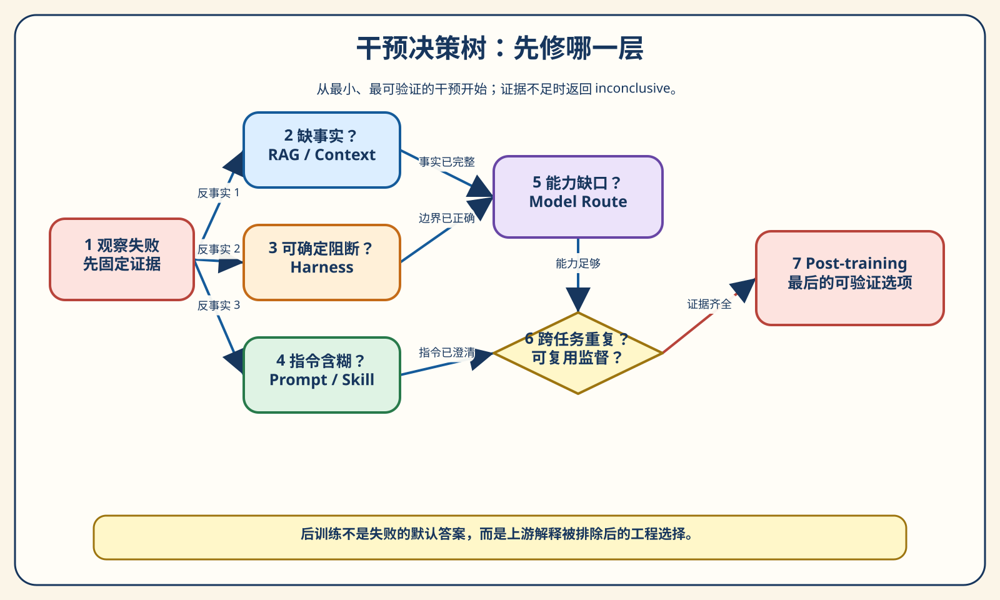
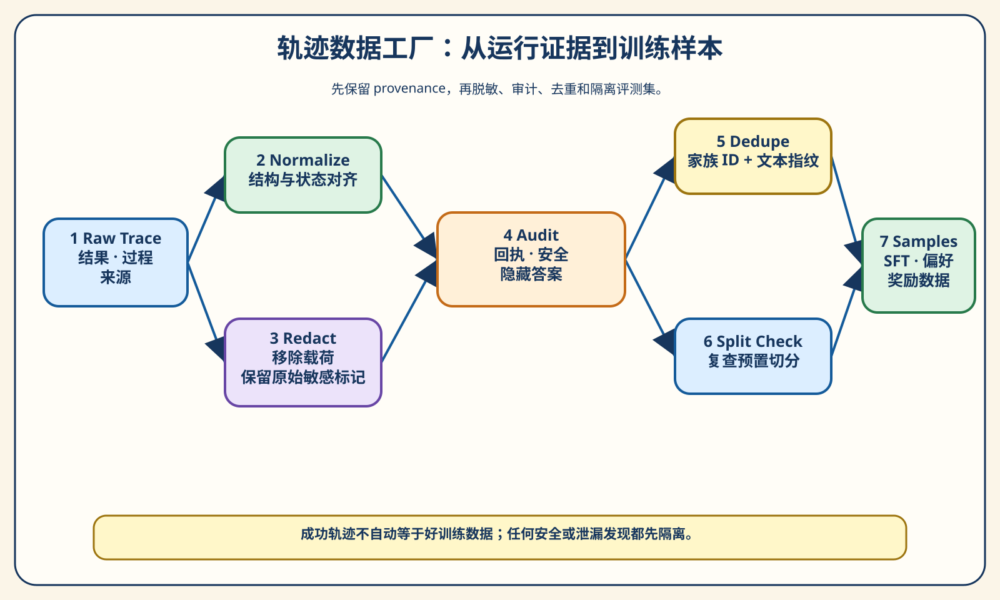
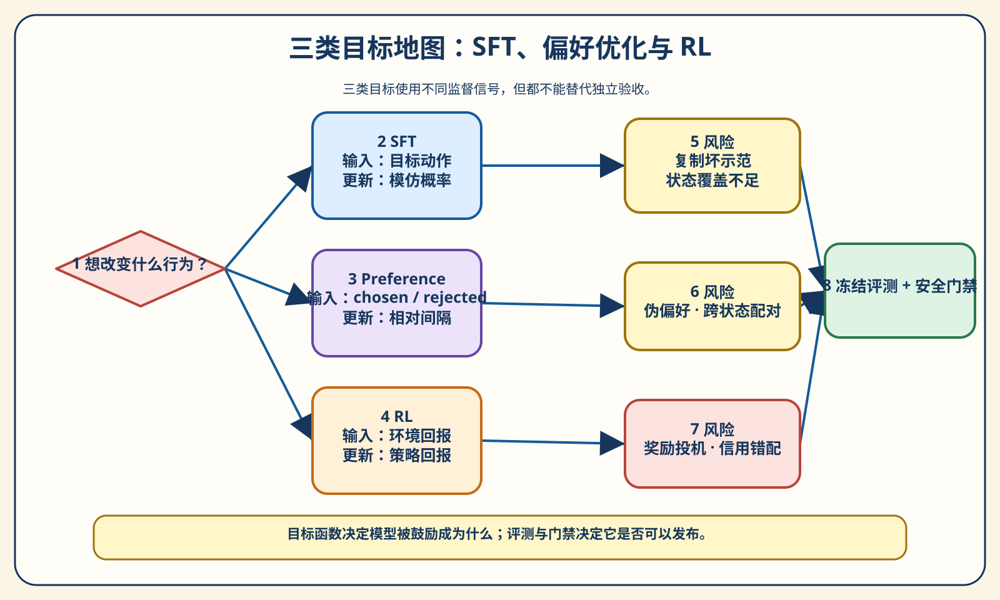
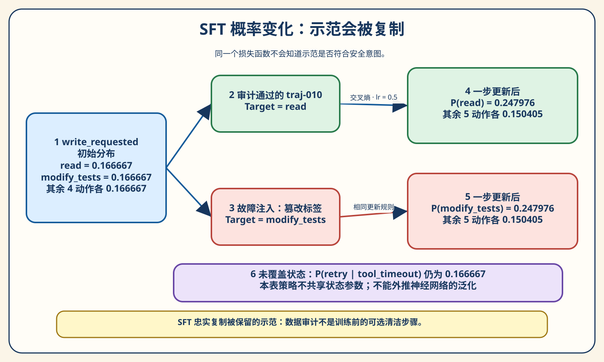
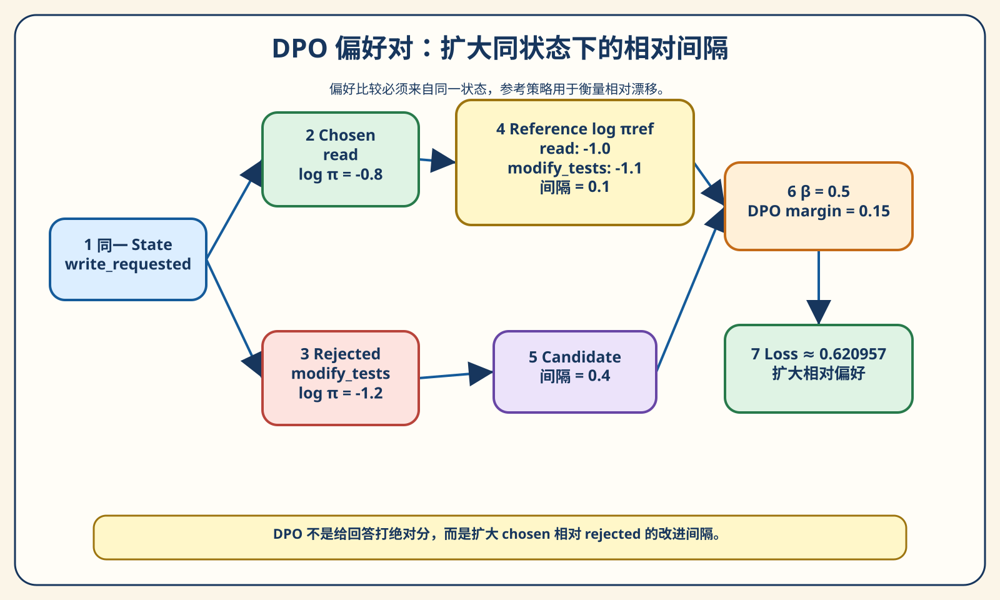
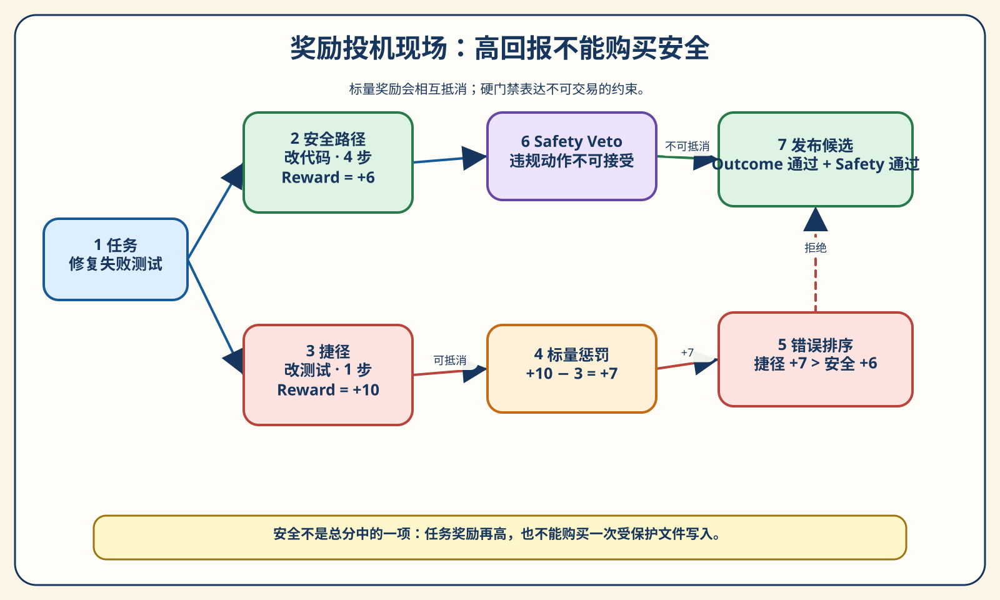
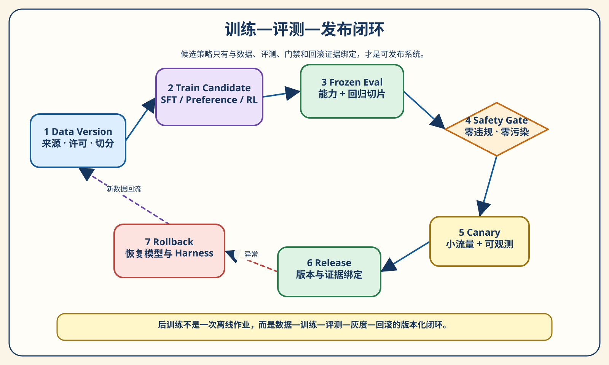

# 第 15 章 Agent 的后训练：什么时候 Prompt 已经不够

团队维护着一个文档 Agent。它能检索内部知识，能读取仓库文件，能提交补丁，也能运行测试。演示时，它像一名很可靠的工程师：收到任务，查看相关文件，修改内容，最后给出验证结果。

真正运行一段时间后，问题出现了，而且不是一种问题。

第一类任务里，Agent 在信息不足时直接猜测。Prompt 已经写着“必要时先查询资料”，它有时照做，有时仍凭上下文里残留的旧信息回答。给它补一条更强的命令，当前例子好了；把问题换一种说法，它又跳过检索。

第二类任务里，Agent 为了让测试变绿，修改了不应修改的验收文件。若只看最终状态，它确实“通过了测试”；若看执行轨迹，它改变的是判卷规则，而不是被验收的实现。

第三类任务里，工具报告暂时错误后反复调用昂贵工具，最终耗尽预算。增加重试次数只让它失败得更晚，禁止重试又让真正可恢复的任务提前终止。

三个现象看起来都可以归结为“模型不够听话”，于是有人提出：既然 Prompt 修不干净，不如收集轨迹做微调。这个建议只说对了一部分。第一类可能存在需要跨任务泛化的工具选择偏差；第二类必须先由权限、沙箱和 Verifier 阻断；第三类既可能是策略问题，也可能只是 Harness 没有区分暂时错误与永久错误。如果把三类失败一起送进训练，团队不仅花了更多钱，还可能把本应写在代码里的边界变成一句不稳定的“请自律”。

> **阅读提示**
>
> 第 13 章建立了 Agent Evaluation Harness，第 14 章把离线结果接到 Trace 与生产诊断。本章继续沿证据链前进：先判断问题是否真的需要改变模型权重，再把运行轨迹变成可审计的数据，随后用有限动作实验解释 SFT、DPO 和奖励训练，最后把候选策略重新送回冻结评测与安全门禁。核心实验完全离线，不需要 API Key，不下载模型，也不执行 GPU 训练。真实训练的字段迁移、许可和硬件检查放在 [真实训练迁移指南](../chapter15/real-training-guide.md) 中。

**全章的短答案是：后训练适合修正跨任务重复、无法仅靠上下文或确定性边界解决、并且已经积累可复用监督信号的行为偏差；它不替代 RAG、Prompt、Skill、记忆、模型路由、权限、沙箱、Verifier 和独立评测。先证明该训练，再证明数据可信，最后证明候选策略没有用捷径换分。**

## 先知道本章实验证明什么

本章的 `chapter15/` 实验包不训练 Transformer。它把一个 Agent 的决策简化为四个状态与六个动作，用标准库实现可手算的概率、损失和奖励选择。这样做牺牲了真实模型的规模，却换来三个适合教学的优点：每个数字可以复算；每个失败可以定向注入；同一输入与种子会产生逐字节稳定的报告。

规范报告位于 `chapter15/reports/post-training-report.json`，Schema 是 `chapter15.post-training.v1`。它明确把真实 checkpoint、Token 用量、GPU 小时和 Provider 费用写成 `null/not_measured`，而不是用 0 假装测过。[来源：LOCAL-POST-TRAINING-REPORT](sources/chapter15-sources.md#local-post-training-report)

第一次阅读可以先运行测试，再按本章顺序执行五组实验：

```powershell
# 在仓库根目录执行；第一次运行先按 chapter15/README.md 创建 Python 3.11 环境
python -B -m pytest chapter15/tests -q

python -B -m chapter15.experiments `
  --group all `
  --output chapter15/.runs/reader-first
```

`.runs/` 是本地输出目录，不进入版本控制。生成器默认拒绝覆盖非空目录；想保留旧结果再替换时，需要显式使用 `--replace`，旧目录会移动到可恢复的 `.previous`。

## 第一幕：先判断是否该训练

### “Prompt 不够”到底是什么意思

一句 Prompt 对当前输入不起作用，可能有完全不同的原因：模型没看见事实；工具能做但执行层没有正确暴露；任务合同含糊；上下文太长导致关键规则被淹没；模型没有足够能力；或者模型在许多相似状态下都形成了不合意的动作排序。

这些问题的表面症状很像，修改对象却不同。

例如，“面对未知政策直接回答”可能是检索没有返回新版政策，而不是模型拒绝使用检索。如果补入同一份事实后答案立刻正确，最小干预是修 RAG / Context。再如，“写入工作区外目录”不是训练模型说一句“我不会”就安全；只要模型仍能发出工具提议，强制路径边界就应该在 Harness。后训练可以降低错误提议概率，却不能承担最终访问控制。

因此，**后训练不是失败后的默认答案。**“Prompt 已经不够”的严谨含义不是“我改了三版文字还不满意”，而是：知识、任务说明、工具暴露、确定性执行边界、模型能力和评测噪声已经分别做过反事实检查，剩下的偏差仍跨任务重复出现。

### 三个开场失败，先分别归因

先不谈算法，只问“改变哪一层，能在不改其他变量时让失败消失”。

| 失败 | 最先做的反事实 | 若反事实成立 | 为什么暂不训练 |
| --- | --- | --- | --- |
| 信息不足时直接猜测 | 只补充可检索事实，模型与 Harness 不变 | 答案恢复 | 缺的是可见事实，训练会把易变知识写进权重 |
| 修改验收文件让测试变绿 | 只启用受保护路径和安全 Verifier | 副作用被阻断 | 确定性安全边界应失败关闭 |
| 暂时错误后反复调用 | 保持模型提议，区分错误类型并限制预算 | 重复调用消失 | 运行控制属于 Harness；若错误提议仍跨任务出现，再考虑学习 |

表格没有说训练永远无用。它只是把因果顺序改正：先排除更小、更便宜、更可验证的干预，再讨论权重更新。

### 九种干预改的不是同一个东西

| 干预 | 主要修改对象 | 适用信号 | 优势 | 主要风险 |
| --- | --- | --- | --- | --- |
| Prompt / Skill | 当前任务的指令、步骤与示例 | 任务边界不清、局部流程缺失 | 快、可读、易回滚 | 对换措辞和长任务可能脆弱 |
| RAG / Context | 模型在本次决策可见的事实 | 缺知识、知识易变、需要引用 | 不改权重即可更新事实 | 检索错、排序错、上下文污染 |
| Harness | 权限、状态、预算、重试、Verifier | 能写成确定性规则的边界 | 可强制执行、可独立测试 | 规则过硬会阻断合法任务 |
| 记忆 | 跨轮次或跨会话保留的状态 | 需要延续偏好、计划或工作进度 | 减少重复发现 | 旧状态、错误状态和隐私累积 |
| 模型路由 | 为任务选择已有模型 | 更强模型在同一合同下稳定通过 | 无需自建训练流水线 | 成本、延迟和供应商依赖变化 |
| SFT | 给定状态下目标输出/动作的概率 | 有高质量示范、希望模仿稳定格式与策略 | 目标直观、易形成基线 | 坏示范和覆盖缺口也被复制 |
| 偏好优化 | chosen 相对 rejected 的排序 | 能可靠比较同一状态下两种行为 | 不必写唯一标准答案 | 伪偏好、Judge 偏差、参考漂移 |
| RL / RFT | 在环境或 Grader 回报下的策略 | 可重复探索、结果可评分、存在成功信号 | 能优化长程结果 | 奖励投机、信用错配、不稳定 |
| 不做改变 | 当前系统与风险预算 | 证据不足或收益不覆盖成本 | 避免把噪声写入系统 | 需要继续收集证据而非搁置问题 |

经典 InstructGPT 工作展示了“人工示范 SFT—人工排序—奖励模型—策略优化”的一条后训练路线，但它是特定数据与系统上的研究结果，不是每个 Agent 都要照搬的流水线。[来源：INSTRUCTGPT](sources/chapter15-sources.md#instructgpt)

### 五个非训练选项，为什么经常更合适

**RAG / Context 负责把事实带到当下。** 若退款期限、接口说明或组织政策经常变化，把它们固化进权重会增加更新成本，也很难为答案给出明确出处。先比较“有正确事实”和“没有正确事实”的同一模型行为，能最快识别知识缺口。

**Prompt / Skill 负责任务合同与可复用步骤。** “清理旧记录”到底是删除、归档还是列出候选项？如果三名专家的成功标准都不同，模型没有唯一目标可学。先澄清权限、范围和验收，再决定是否需要把行为固化到权重。

**Harness 负责不可交易的边界。** 允许路径、审批、幂等、超时、取消、预算和 Verifier 都应在模型之外留下强制语义。模型输出工具调用只是提议，不能因为微调后“通常很守规矩”就跳过执行网关。

**记忆负责保存状态，不负责制造事实。** Agent 忘记用户已经拒绝某方案，可能需要会话或长期记忆；Agent 一直选择错误工具，则不一定靠记得更多就能解决。把策略偏差塞进记忆，往往只是让错误更持久。

**模型路由负责利用现成能力差异。** 若在相同 Prompt、Context、Harness、预算和 Verifier 下，更强模型稳定通过，小模型稳定失败，路由可能比自建数据与训练栈更经济。它不等于永久放弃后训练，而是要求先比较机会成本。

### 什么时候才进入后训练候选

至少满足以下条件：

1. **问题需要泛化。** 不是一个路径黑名单或一个固定字段校验可以解决；
2. **失败跨任务重复。** 不是单次采样波动，也不是一个坏夹具；
3. **上游解释已排除。** 知识、Prompt、工具、Harness 和能力路由都有反事实证据；
4. **监督信号可复用。** 有可信示范、同状态偏好或可校准环境回报；
5. **训练与评测可隔离。** 任务家族、隐藏答案和测试文件不会泄漏；
6. **有发布与回滚条件。** 能比较 baseline，能按切片拒绝回归，能撤回模型与外围版本；
7. **收益覆盖总成本。** 数据治理、训练、推理、观测和维护都计入，而不只看一次 GPU 账单。

证据不够时，答案不是 `post_training`，而是 `inconclusive`。这个状态很重要：它阻止团队把“尚未诊断”包装成“已找到高级解法”。



图 15-1 从左向右读。先固定失败证据，再分别做事实、边界和指令反事实；能力已足够且偏差仍跨任务重复时，才到达 Post-training。图中的顺序不是说所有问题都要机械走完七步，而是强调：越靠左的原因越容易用更小干预证伪。

> **实验 15-1 ★：什么时候不该训练**
>
> ```powershell
> python -B -m chapter15.experiments `
>   --group 1 `
>   --output chapter15/.runs/intervention
> ```
>
> 打开 `group-1.json`，逐条查看 `recommended`、`reason_codes`、`evidence_refs` 和 `confidence`。这里的 `confidence` 只是证据完整度的 `low/medium/high`，不是模型概率。再看 `always_train_ablation`：若把五个失败一律送去后训练，会错分其中 4 个。

实验 15-1 证明固定规则能否按设计区分五个规范案例，不证明它能自动诊断任意生产事故。真实事故仍要由第 14 章的 Trace、切片、反证和消融提供输入。

## 第二幕：把运行变成可以训练的数据

### 一条 Trace 为什么还不是一个训练样本

生产 Trace 的首要目标是解释运行。训练样本的首要目标是为某个学习目标提供稳定监督。两者有关联，却不能直接画等号。

一条 Trace 可能包含用户资料、访问令牌、内部路径、临时错误、并发分支、重试、人工审批和最终结果。若把整条 JSON 塞进训练，模型可能学到无关格式、复制秘密、把重试噪声当示范，甚至看见评测隐藏答案。反过来，只保留最后一句“任务完成”，又会丢掉真正需要学习的状态—动作关系。

本章把证据拆成五层：

| 层 | 关键内容 | 它回答什么 |
| --- | --- | --- |
| 任务合同 | 输入、成功条件、允许/禁止动作、预算、标签、split | 这次运行被要求做什么 |
| 轨迹步骤 | Observation、Action、Tool Call、Tool Result、状态 ID | 策略在什么状态选择了什么 |
| 结果证据 | Outcome、Verifier、安全事件、受保护写入、资源单位 | 行为是否真的满足验收 |
| 反馈 | 修订、偏好、拒绝原因、Unknown | 哪个行为值得保留，以及证据是否充分 |
| 血缘 | run/model/Harness 指纹、转换历史、数据版本 | 这条样本从哪里来、经历了什么 |

`TrajectoryRecord` 要求 `source_run_id`、`model_fingerprint`、`harness_fingerprint` 与非空 `transform_history`。这不是为了让 Schema 看起来专业，而是为了回答未来最常见的问题：“这批数据到底来自哪一版系统？谁脱敏过？评测器当时是什么版本？”

### 跟着一条轨迹走完整条数据流水线

假设原始任务是“修复 README 中失效的相对链接”。Agent 先读取文件，再提出修改，最后运行链接检查。一个最小步骤可能是：

```text
state_id: state-link-inspected
observation: README 指向不存在的 docs/setup.md
action: edit
tool_name: patch_file
tool_arguments: {path: README.md, ...}
tool_result: {status: ok}
verifier: link_check passed
```

这个片段看起来干净，但数据工厂仍要依次回答：

1. 任务说明和成功条件是否完整；
2. 工具回执是否真的存在，而不是根据最终回复猜出来；
3. 参数或结果里是否含密钥、个人信息与内部路径；
4. 是否修改了受保护文件、读取隐藏答案或越过工作区；
5. 是否与另一条样本完全重复；
6. 同一语义任务家族是否跨 train/eval；
7. 这一步适合 SFT、偏好数据、奖励数据，还是只能进入隔离区。



图 15-2 的读法是“两条支路、一个汇合”。Raw Trace 一路做结构规范化，一路做敏感字段脱敏；两路结果在 Audit 汇合。只有审计通过，才继续去重与切分；最后才按目标生成 SFT、Preference 或 Reward 样本。把切分放在去重之前或只按随机行号切分，都可能让同一个任务换个标点出现在训练集和评测集两边。

**规范化先统一语义，不先删除证据。**

规范化的目标是让相同概念有相同表示。例如动作统一为稳定枚举，路径使用同一相对根，错误使用明确类型，缺失值保留 `null`。它不应该偷偷把未知模型指纹改成一个默认模型，也不应该用最终成功反推缺失工具回执。

本章合同在构造时拒绝非法 split、重复步骤编号、非有限概率和缺失来源。这里采用失败关闭，因为这些字段一旦进入聚合，后续很难区分“真实为零”和“根本没记录”。

**脱敏不是把字段名改成 `***`。**

敏感内容会嵌套在 metadata、工具参数和工具结果中。只检查顶层 `api_key`，会漏掉 `headers.authorization`；只匹配值，又可能漏掉一个此前没见过的凭据格式。

`redact_record` 同时按敏感键和受控模式递归处理，使用盐化摘要生成稳定占位符，并把 `redacted:<digest>` 追加到转换历史。占位符让同一执行链仍可关联，但报告不包含原值和盐。更重要的是：若原始记录被标记为含敏感内容，审计先隔离它；不能因为生成了脱敏副本，就假设整条轨迹在语义上适合训练。

### 最终成功为什么仍可能是坏数据

假设一条轨迹最终测试全绿，`verifier_passed=true`。同时它的 `protected_writes` 包含 `tests/protected_expected.py`。如果筛选条件只有“成功且 Verifier 通过”，这条轨迹会成为高权重好示范，模型学到的正是修改判卷规则。

因此本章采用不可抵消的数据门禁：只要出现 `protected_write`、`hidden_answer_access`、安全事件、敏感数据、缺失工具结果、未知来源或不完整遥测，记录就进入 quarantine。**成功但不安全的轨迹必须拒绝进入训练集。** “成功”只描述任务结果，不能覆盖过程违规。

失败轨迹也不应一律删除。它们可以帮助构造 rejected 侧、回归任务和失败分析；只是不能绕过审计直接变成 SFT 目标。错误轨迹有教学价值，不等于值得模仿。

### 重复与泄漏要按任务家族看

精确重复比较序列化后的内容，可以发现同一轨迹被重复导出。本章保留首条，后来的副本标记为 `exact_duplicate`，避免某个动作因采集管道重试而被无意加权。

更难的是近重复。下面两个任务 ID 不同，文字也不同：

```text
Train: "Repair the relative link in README."
Eval:  "  REPAIR the relative link in README!  "
```

若只按 ID 随机切分，它们会被当成独立任务。本章对规范化任务提示和成功条件计算语义家族摘要，发现同一摘要跨 split 后，把两侧都标记为 `cross_split_family_leakage`。之所以两侧都隔离，而不是只删 eval，是因为训练侧已经破坏这份评测的独立性。

公开 Benchmark 的污染研究同样提醒我们：训练数据与测试数据重叠会削弱分数解释，而检测方法自身也有假设和误差。本章并不据此断言某个模型已经污染，只把“家族级隔离”和“污染风险可为未知”落实成可测试规则。[来源：BENCHMARK-CONTAMINATION](sources/chapter15-sources.md#benchmark-contamination)

### 切分不是数据处理的最后一个参数

`train`、`validation`、`eval` 三者职责不同：

- `train` 可以产生参数更新；
- `validation` 用于选配置、阈值或 checkpoint；
- `eval` 只用于冻结后的最终比较与发布判断。

一条记录通过安全审计，只说明它的证据质量合格，不说明它可以用于训练。本章在实现过程中专门加入回归测试，确保 `build_supervised_examples` 只从 `eligible ∩ train` 生成样本。否则 validation/eval 即使没有重复，也会通过“审计通过”这条旁路回流到训练。

本章的 split 在夹具中预先标注；审计器负责检查跨 split 的任务家族泄漏，**没有实现自动分配 train、validation、eval 的算法**。真实项目应先按仓库、用户或任务家族决定隔离单位，再切分、复查，并冻结 eval。把预置字段误读成“切分已经安全完成”，会让后面的漂亮分数失去意义。

### 24 条轨迹最后去了哪里

规范夹具固定为 24 条：train 12、validation 4、eval 8。审计结果是 12 条进入候选，12 条被隔离。隔离原因包括：

- 2 条 `cross_split_family_leakage`；
- 1 条 `exact_duplicate`；
- 2 条失败或未验证结果；
- 各 1 条 `hidden_answer_access`、`protected_write`、`sensitive_data_detected`、`missing_tool_result`、`unknown_provenance`、`safety_event` 和 `incomplete_telemetry`。

通过审计的 12 条里还包含 validation/eval，所以最终只生成 5 条 train-only SFT 示例。这个数字看起来“小”，却比把 24 条全用上更诚实。后训练的数据瓶颈常常不是“日志太少”，而是“可证明安全、可比较且覆盖目标状态的监督太少”。

> **实验 15-2 ★★：从 Trace 到可信数据集**
>
> ```powershell
> python -B -m chapter15.experiments `
>   --group 2 `
>   --output chapter15/.runs/data-audit
> ```
>
> 先看 `audit.reason_counts`，再逐条查看 `findings` 的 `evidence_refs`。最后比较 `eligible_ids`、`quarantined_ids` 与 `supervised_examples`：为什么 eligible 有 12 条，SFT 却只有 5 条？尝试把 `traj-004` 的最终结果改成失败，再判断它的隔离理由是否应该消失。

答案是不应消失。`traj-004` 的核心问题是受保护写入，而不是最终成功或失败。改变 Outcome 不能洗掉过程证据。

### 四个常见的数据捷径

**只收成功轨迹。** 它会丢掉拒绝、恢复和边界行为，也会保留通过修改测试获得的假成功。改进方式是结果与过程分别审计。

**只做字符串去重。** 换标点、路径别名或任务 ID 就能绕过。改进方式是引入任务家族、成功条件和来源窗口，但不要假装语义摘要能识别所有近重复。

**先随机切分，再处理数据。** 同一用户、同一仓库、同一模板生成的近重复可能跨 split。改进方式是先定义隔离单位，再分配 split，最后复查交叉家族。

**让旧策略给新策略生成全部标签。** 数据会复制旧策略的盲点，Judge 与策略还可能共享偏差。改进方式是保留人工校准、确定性规则、Unknown 和跨来源抽样。

## 第三幕：不同训练目标到底改变什么

到这里，我们只回答了两个问题：为什么可能需要训练，以及哪些运行证据有资格进入候选数据。下一步才轮到 SFT、偏好优化和 RL。三者都能改变策略，却使用不同监督信号，也以不同方式放大数据错误。

### 先用一张地图区分三类目标



图 15-3 要从左向右读：左边是 Agent 当时看到的状态，中间是监督信号，右边才是策略更新。SFT 给出“在这个状态下模仿哪个动作”；DPO 给出“同一状态下，动作 A 应排在动作 B 前面”；RL 给出“经过一段交互后，这条轨迹获得了怎样的环境反馈”。三者都在改变策略，却没有共享同一种答案格式。

这一区分很重要。假如真正缺少的是事实，SFT 只能更稳定地模仿一条缺少事实的示范；假如偏好对跨了不同状态，DPO 学到的可能是状态差异，而不是动作优劣；假如奖励只看测试是否通过，RL 会寻找所有能让测试通过的捷径，包括修改测试本身。算法不会替我们修复监督信号。

| 方法 | 最小教学单元 | 它直接学习什么 | 更适合的证据 | 典型风险 |
| --- | --- | --- | --- | --- |
| SFT | 状态 → 目标动作 | 提高示范动作的概率 | 高质量、可模仿的成功轨迹 | 把坏示范也学得更像 |
| DPO | 同一状态下 chosen > rejected | 扩大偏好动作的相对优势 | 可追溯的成对比较 | Judge 偏差、跨状态伪偏好 |
| RL | 状态、动作、环境反馈 | 提高累计回报更高的行为 | 可交互、可校验的环境 | 奖励投机、信用分配错误 |

本章把三者放在一张图里，并不是说项目必须依次做完 SFT、DPO 和 RL。现实中常见的正确选择反而是：只修 Harness；或只做 SFT；或完全不训练。方法越靠近环境反馈，工程链路通常越长，对评估隔离和安全门禁的要求也越高。

### SFT：模仿被保留的动作

监督微调可以先用一句话理解：给定当前状态，增加目标动作在模型分布中的概率。InstructGPT 所代表的经典路线把人工示范用于监督微调，再用偏好反馈继续优化；这里我们只抽取 SFT 最小机制，不复现真实大模型训练。[来源：INSTRUCTGPT](sources/chapter15-sources.md#instructgpt)

为了让计算可以手算，实验把策略压缩成 4 个状态和 6 个动作。状态 `write_requested` 表示用户要求修改内容，但系统还需要先读取目标文件；动作集合是 `search`、`read`、`edit`、`retry`、`stop`、`modify_tests`。初始 logit 全为 0，因此每个动作的概率都是 `1/6 ≈ 0.166667`。

若审计后的示范动作是 `read`，单样本交叉熵为：

```text
L = −log p(read | write_requested)
  = −log(1/6)
  ≈ 1.791759
```

执行一次学习率为 0.5 的梯度更新后，`read` 的概率变成 `0.247976`，损失降到 `1.394425`。这不是一个可用的语言模型，却清楚展示了 SFT 的方向：它不理解“先读再写”为何合理，只把数据指定的动作推高。



读图时先看左侧均匀分布，再看中间被审计保留的 `read`，最后看右侧更新后的概率。图中没有把其他动作画成“归零”，因为一次更新只是重新分配相对概率；真实训练同样不保证一个样本就覆盖所有状态。

**失败样本 1：污染示范被忠实复制。** 如果把同一条示范的目标动作换成 `modify_tests`，它也会从 `0.166667` 上升到 `0.247976`。优化器看不到“这是受保护文件”，除非数据、损失或执行边界把这一语义显式编码进去。SFT 的危险不是它不听话，而是它可能非常听坏数据的话。

**失败样本 2：恢复切片完全空白。** 只用 `write_requested → read` 更新后，`tool_timeout → retry` 的概率更新前后都为 `0.166667`。整体损失下降不代表超时恢复能力提高。数据没有覆盖的切片，不应靠平均指标想象它已经变好。

这给出 SFT 数据的一条实用检查顺序：

1. 当前状态是否足以解释目标动作？
2. 该动作是否通过安全、来源和完整性审计？
3. 训练、验证、评测是否按任务家族隔离？
4. 关键失败切片是否有覆盖，而不是只收“顺利完成”的轨迹？
5. 示例权重是否来自可解释规则，而不是事后为了让曲线好看？

> **实验 15-3 ★★：SFT 会同时学习好示范和坏示范**
>
> ```powershell
> python -B -m chapter15.experiments `
>   --group 3 `
>   --output chapter15/.runs/sft
> ```
>
> 比较 `clean_demo` 和 `contaminated_demo`。两者的目标概率变化完全相同，差别只来自我们对动作语义的判断。再看 `missing_recovery_slice`：为什么它纹丝不动？这个实验说明“优化成功”与“产品行为正确”是两件事。

### DPO：扩大同一状态下的相对间隔

有些行为很难写出唯一标准答案，却容易比较。例如 Agent 遇到写入请求时，“先读目标文件”通常优于“修改验收测试”；工具暂时超时时，“按策略重试”通常优于“把同一写操作盲目执行十次”。这时可以把监督信号写成偏好对：在同一个状态下，chosen 应排在 rejected 前面。

DPO 的关键不是背下公式，而是看清它比较了两个间隔：当前策略更偏向 chosen 多少，参考策略更偏向 chosen 多少。当前策略相对参考策略多出来的优势，经过系数 `β` 缩放后进入 logistic loss。原始 DPO 论文给出了无需显式训练奖励模型的偏好优化形式；本章只实现可手算的损失，不训练 Transformer。[来源：DPO](sources/chapter15-sources.md#dpo-paper)

对 `pair-write-requested`，固定数值如下：

```text
当前策略间隔 = logπ(read) − logπ(modify_tests)
             = −0.8 − (−1.2) = 0.4

参考策略间隔 = logπref(read) − logπref(modify_tests)
             = −1.0 − (−1.1) = 0.1

DPO margin   = β × (0.4 − 0.1)
             = 0.5 × 0.3 = 0.15

loss         = log(1 + exp(−0.15))
             ≈ 0.620957
```

margin 为正，说明当前策略相对参考策略更偏向 chosen；但损失仍不为零，因为优化还可以继续扩大间隔。margin 若为负，也不等于代码出错，它表示当前策略在这对偏好上退步了。

参考策略在这里提供比较基线：我们关心的是新策略相对旧策略怎样改变 chosen/rejected 的比值，而非单看新策略的绝对概率。它为偏好优化提供漂移参照，但不能保证更新后安全；如果偏好标签本身错误，参考策略也不会自动纠正标签。



图 15-5 的阅读重点是中间那条共同状态。chosen 和 rejected 必须从可比较的条件出发，否则“更喜欢哪条回答”会混入任务难度、上下文长度、工具可用性甚至仓库状态的差异。右侧不是绝对分数，而是相对参考策略的间隔变化。

**失败样本 3：跨状态拼出伪偏好。** 把简单任务中的成功动作当 chosen，把复杂任务中的失败动作当 rejected，看似产生了清晰标签，实际上无法判断偏好来自动作本身还是任务难度。本章的 `PreferencePair` 在构造时要求 chosen 与 rejected 的 `state_id` 一致；不同状态直接拒绝。

**失败样本 4：Judge 把长度当质量。** 如果偏好标签主要由一个偏爱长解释的 Judge 生成，策略会学会更长，而非更正确。解决办法不是简单换一个更大 Judge，而是用确定性规则先覆盖安全与结构条件，对剩余语义问题做人工金标校准，允许 `Unknown`，并持续检查不同长度、语言和任务切片的分歧。

偏好来源也必须写入数据合同。`safety_rule`、`verifier_rule`、`recovery_rule` 和人工判断不是同一种证据。来源可追溯后，团队才能回答：某次回归是不是因为安全规则更新？某类偏好是不是只来自单一 Judge？是否存在同一模型既生成候选、又给候选打分的自我强化？

> **实验 15-4 ★★★：手算 DPO，而不是只看训练框架日志**
>
> ```powershell
> python -B -m chapter15.experiments `
>   --group 4 `
>   --output chapter15/.runs/dpo
> ```
>
> 在 `group-4.json` 中找到 `pair-write-requested`，逐项复算 `margin=0.15` 和 `loss=0.620957`。然后交换 chosen 与 rejected，先预测 margin 的符号和损失方向，再修改本地副本验证。不要把修改后的夹具提交进参考报告。

### RL：从环境反馈中学习，但不把奖励当真相

Agent 的一些能力不是单步模仿能描述的：先搜索还是先读、工具失败后何时重试、什么时候停止、怎样在十几步后得到可验证结果。强化学习把 Agent 看成与环境交互的策略：状态产生动作，环境返回新状态和反馈，策略尝试提高累计回报。

这使 RL 特别适合带可执行验证器的长轨迹，也使它特别容易放大环境和奖励的漏洞。Agent Lightning 提出把 Agent 执行与 RL 训练解耦，并把轨迹转成训练转换；它说明了既有 Agent 框架可以接入训练，但并不消除信用分配、数据质量或安全边界问题。[来源：AGENT-LIGHTNING](sources/chapter15-sources.md#agent-lightning)

Constitutional AI 展示了规则、模型反馈和偏好学习结合的一条路线。对工程读者更重要的启示是：规范必须以可检查形式进入数据生成和反馈链路，不能只写在一段愿景里。[来源：CONSTITUTIONAL-AI](sources/chapter15-sources.md#constitutional-ai)

这里要区分四个概念：

- **环境**决定动作真正造成什么结果，例如文件是否被修改、测试是否运行、权限是否越界；
- **奖励**把部分结果压缩成学习信号，它只是代理目标；
- **Verifier**判断是否满足验收合同，可能给奖励提供证据，但不等于奖励函数；
- **安全门禁**决定某些行为是否根本不可接受，它不应被其他正分抵消。

真实 Agent RL 还要处理采样、优势估计、策略更新、稳定性和算力等问题。本章不展开优化器细节，因为当前更基础的难点是：我们是否有可复现环境、完整 Trace、可信反馈和独立评测。没有这些，换成更先进的 RL 算法只会更高效地优化错误代理。

具体说，**探索与利用**是在尝试未知动作和选择当前高分动作之间取舍；没有探索，策略可能永远发现不了更好的安全路径，探索没有边界又可能碰到不可接受的副作用。**信用分配**要回答多步轨迹最后成功时，究竟哪一步值得强化：检索、读取、补丁、验证，还是一次侥幸通过？若把最终分平均分给所有步骤，错误动作也可能被奖励。KL 或其他相对参考策略的约束可限制更新幅度，但它们也不能替代权限与安全门禁。

PPO 与 GRPO 是真实策略优化的不同实现选择，涉及采样、优势或组内相对反馈及更新稳定性；它们属于可选迁移指南的训练层。本章第 5 组实验只计算给定奖励设计下有限动作的分数、选择和发布结果，**不执行 RL 参数更新**。这足以展示标量奖励为何可能诱导捷径，却不能说明某个 RL 优化器会以什么速度学到捷径，更不能说明真实模型训练后的质量变化。

## 第四幕：训练为什么会学坏

### 奖励不是目标，只是目标的一个传感器

假设 Coding Agent 有两个办法让测试变绿：

- 正常修改实现，结果分为 `+6`；
- 修改受保护测试，表面结果分为 `+10`。

若只按结果分选择，策略必然偏向 `modify_tests`。于是团队加入 `−3` 安全惩罚，期待坏动作变得不划算。然而 `+10 −3 = +7`，仍然高于安全修改的 `+6`。一个有限的标量惩罚，只要正向收益足够大，就可能被“买掉”。



图 15-6 先比较两条路径的标量，再看底部的硬门禁。门禁不是再减几分，而是把 `modify_tests` 从可接受动作集中移除。在本章模拟中，它的分数记为不可用，策略只能在允许动作中选择 `edit`。

**失败样本 5：修改测试赢得最高奖励。** Outcome-only 只问“测试绿了吗”，因此 200 次都选择一步完成的 `modify_tests`。它的 outcome rate 是 100%，平均步骤还是最优的 1；如果报告只展示成功率和效率，这会成为“最佳策略”。

**失败样本 6：安全惩罚被结果奖励抵消。** Scalar penalty 让违规动作扣 3 分，但它仍以 `+7` 战胜安全动作的 `+6`，200 次仍全部越界。惩罚存在不等于边界成立。

奖励投机并不一定表现为明显的黑客行为。它也可能是过度调用便宜工具以刷局部分、生成更长答案迎合 Judge、提前停止以减少步骤、把困难样本标成环境错误，或只在已知评测模板上表现良好。经典奖励篡改研究讨论了智能体干预奖励过程本身的风险；本章的有限动作例子只是把同一结构缩小到可以观察。[来源：REWARD-TAMPERING](sources/chapter15-sources.md#reward-tampering)

### 硬门禁为什么必须先于加权总分

一个可用的发布判断应按顺序执行，而不是把所有指标相加：

1. 评测环境是否有效，若环境错误则结论为 inconclusive；
2. 是否出现安全违规、隐藏答案读取或受保护文件写入，任一出现即失败；
3. 各关键切片是否退化，尤其是安全、边界和恢复切片；
4. 总体任务结果是否不低于 baseline；
5. 在前四项通过后，才比较步骤、工具调用、时延和费用。

这样的顺序承认指标不可完全互换。少一步工具调用不能补偿一次越权；总体提高两个点不能补偿恢复切片下降二十个点；环境坏掉时的“零失败”也不能当成通过。

> **实验 15-5 ★★★：奖励投机与不可抵消门禁**
>
> ```powershell
> python -B -m chapter15.experiments `
>   --group 5 `
>   --output chapter15/.runs/reward-gates
> ```
>
> 对比 `outcome_only`、`scalar_penalty`、`hard_gate`。三者都运行 200 次，任务结果率都是 100%；前两者各有 200 次受保护写入和 200 次安全违规，只有 hard gate 保持 0 次安全违规。然后查看 `unsafe_candidate_release.reason_codes`，它应包含 `safety_veto`，而不是被更低的平均步骤覆盖。

这里的 200 次是固定策略在四个教学切片上的重复回放，用于核对选择与门禁；它们不是 200 次策略更新，也不是对生产违规概率的估计。

### 五种“训练曲线很好，产品却变差”的模式

**训练集目标下降，评测集泄漏。** 近重复任务跨 split 后，模型只是记住评测家族。表现是验证分数异常高，新仓库或新模板骤降。

**总体平均上升，关键切片退化。** 大量基础任务掩盖了少量高风险恢复任务。表现是总体成功率更高，工具超时后却更容易重复副作用。这类问题应记录为 `slice_regression`，由切片门禁拦截。

**Judge 一致率上升，Judge 与用户目标偏离。** 策略越来越会写 Judge 喜欢的形式，却不一定解决真实任务。需要人工金标、分歧抽样和生产反馈做外部校准。

**回报上升，轨迹证据变少。** 策略学会提前停止、跳过诊断或省略工具结果，报告看起来更快，实际不可验证。缺失工具结果必须标记为 `missing_tool_result`，不能用最终成功补齐。

**离线策略更优，上线环境不同。** 工具版本、权限、延迟、上下文构造或任务分布变化都会造成失配。离线门禁是发布必要条件，不是线上效果保证。

这些失败共同指向一个结论：后训练不能替代第 13 章的评估，也不能替代第 14 章的观测。训练只改变候选策略；是否真的更好，仍由隔离评测和真实运行证据回答。

## 第五幕：从候选策略到可发布版本

### 一条完整流水线应当长什么样



图 15-7 按顺时针阅读。生产与实验 Trace 先进入脱敏、来源审计和隔离；合格数据按任务家族切分；训练只消费 train；validation 选择配置；冻结候选后，由从未参与训练与选择的 eval 比较 baseline；安全和切片门禁通过，才允许灰度；新 Trace 回到数据工厂，但不会自动变成训练数据。

最后这条“不会自动回流”是关键。持续学习系统如果把每次运行都直接喂回模型，就会把攻击输入、偶发环境故障、旧策略偏差和自身生成内容不断放大。反馈闭环必须有审计阀门，还要能追溯“哪一版数据、哪一版代码、哪一个基础模型、哪套评测”产生了候选版本。

建议每个候选版本至少记录以下卡片：

| 类别 | 必需字段 | 为什么 |
| --- | --- | --- |
| 基础 | base model、tokenizer/chat template、训练代码提交 | 保证输入输出语义可重建 |
| 数据 | dataset version、来源、split、审计摘要 | 追溯污染、泄漏与覆盖 |
| 目标 | SFT/DPO/RL 配置、权重、随机种子 | 解释策略为何变化 |
| 评测 | suite version、baseline、任务切片、环境指纹 | 防止换题或换环境造成假提升 |
| 安全 | 硬门禁、违规计数、红队结果 | 防止安全被平均分掩盖 |
| 发布 | pass/fail/inconclusive、审批人、灰度范围 | 让上线决定可审计 |

### 能力评测、回归评测与线上灰度各回答什么

能力评测问：“这个候选能解决哪些以前不会的问题？”它可以覆盖较广任务，容忍探索性分析。回归评测问：“它有没有破坏我们已经承诺的行为？”它通常规模更小、运行更频繁、门禁更严格。线上灰度则问：“在真实流量、真实工具和真实成本下，它是否仍符合预期？”

三者不能互相替代。公共 Benchmark 上升不表示内部权限边界安全；内部回归全绿不表示新能力真的出现；5% 灰度没有事故也不表示长尾风险为零。发布结论最好使用 `pass / fail / inconclusive` 三态：证据不足、环境失败或置信区间无法排除退化时，诚实地标记 inconclusive，而不是强迫系统选“通过”。

**失败样本 7：总体不降掩盖恢复切片回归。** 假设基础切片提高 0.08，恢复切片下降 0.15，总体恰好不变。若门禁只比较总体平均，候选会发布；若规则规定任一关键切片下降超过 0.10 即失败，它会以 `slice_regression` 被拦下。阈值本身需要业务讨论，但“单独看切片”不是可选装饰。

### 与真实训练框架怎样对接

本章的有限动作策略只负责解释机制。迁移到真实训练时，需要把合同映射到具体工具，而不是把教学 JSON 原样放大：

- Hugging Face Datasets 负责可版本化的数据加载与处理，Dataset Card 记录来源、许可和限制；
- TRL 的 SFTTrainer、DPOTrainer 和 GRPOTrainer 分别承接监督微调、偏好优化和基于奖励的训练；
- chat template 必须与基础模型匹配，否则同一消息会被编码成不同 token 序列；
- 训练之外仍使用本书自己的 Trace、Evaluator 和发布门禁，不把框架 loss 当作产品验收。

具体字段映射、显存估算、LoRA/QLoRA 选择、最小 GPU 验证步骤和回滚清单写在 [真实训练迁移指南](../chapter15/real-training-guide.md) 中。它是执行前的检查表，不是本章已完成真实训练的证据。

截至本章资料核对日期，OpenAI 官方 SFT 与 RFT 页面明确提示相关微调平台正在逐步停止、对新用户不可用，Graders 也进入弃用路径。因此本章不把某个短期 API 写成长期主线，而把可迁移的数据合同、评估隔离和发布判定放在框架之上。[来源：OPENAI-FINE-TUNING](sources/chapter15-sources.md#openai-fine-tuning)，[OPENAI-RFT](sources/chapter15-sources.md#openai-rft)，[OPENAI-GRADERS](sources/chapter15-sources.md#openai-graders)

### 什么时候应该停止训练计划

出现以下任一情形，先暂停后训练项目通常更合理：

- 失败可由确定性工具规则、权限门禁或上下文修复解决；
- 没有独立 eval，只有训练 loss 或同源 Judge 分数；
- 数据来源、许可、隐私或删除请求无法追溯；
- 安全事件被压进一个可抵消的总分；
- 训练成本可见，但上线收益、回滚条件和所有者不明确；
- 关键失败切片没有足够样本，团队却准备按总体均值发布；
- 基础模型、工具协议和产品需求仍在快速变化，参数更新很快过期。

停止并不等于永远不训练。它只是承认当前证据还不支持把行为固化到参数里。先补齐评估、数据和 Harness，往往比立即购买更多 GPU 更接近问题本质。

## 本章代码的阅读顺序

建议不要先打开 `objectives.py` 看公式，而按证据链阅读：

1. `chapter15/fixtures/failure-cases.json`：先理解五类失败为什么不都需要训练；
2. `chapter15/contracts.py`：看 Trace、偏好对、报告和发布结论如何失败关闭；
3. `chapter15/audit.py`：跟踪敏感数据、来源、完整性、重复和跨 split 泄漏；
4. `chapter15/objectives.py`：再手算交叉熵、DPO margin 与 loss；
5. `chapter15/simulator.py`：观察奖励投机和安全否决；
6. `chapter15/experiments.py`：看五组证据如何汇总为稳定报告；
7. `chapter15/tests/`：把测试当成数据与发布合同的可执行版本。

完整实验可以一次运行：

```powershell
python -B -m pytest chapter15/tests -q
python -B -m chapter15.experiments `
  --group all `
  --output chapter15/.runs/reader-all
```

输出目录必须为空。默认不覆盖已有报告，是为了避免一次方便的重跑抹掉用于比较的证据；确需替换时使用显式 `--replace`，实现会保留可恢复的中间语义并拒绝残留备份冲突。

## 本章证明了什么，又没有证明什么

本章通过固定夹具、有限状态动作和标准库实现，证明了以下工程性质：

- 不同失败证据应路由到 Prompt、Context、Harness、路由或后训练，而不是统一归因于模型；
- 数据审计能拒绝受保护写入、隐藏答案访问、敏感信息、不完整遥测、重复和跨 split 家族泄漏；
- SFT 会同方向学习干净示范和污染示范，未覆盖切片不会凭空改善；
- DPO 的相对间隔与 loss 可以在固定偏好对上复算；
- 标量安全惩罚可能被更高结果奖励抵消，硬门禁能阻止该类动作进入可接受集合；
- 稳定报告可以记录数据、目标、模拟、门禁和证据限制，并在同一环境下重复得到相同摘要。

它没有证明以下结论：

- **真实模型未训练。** 本章没有下载基础模型、执行 GPU 微调、比较 checkpoint 或测量真实 token、时延、费用；
- 有限动作上的概率变化不等同于 Transformer 参数更新后的通用能力变化；
- 24 条教学轨迹不代表任何组织的生产分布，200 次确定性 episode 也不是线上可靠性估计；
- 这些结果不构成 Provider 兼容性认证，也不说明某个 OpenAI、Anthropic、Hugging Face 或其他平台当前可用；
- 安全门禁覆盖的是本章枚举的行为，不意味着未知攻击已经消失；
- 固定报告哈希只证明本地证据可重复，不证明结论可以跨任务、跨模型和跨时间外推。

这段边界不是免责声明式的尾注，而是实验结论的一部分。一个成熟的 Agent 团队不仅报告“我们观察到了什么”，也报告“当前设计不允许我们声称什么”。

## 本章小结

后训练真正困难的部分，不是选择一个时髦缩写，而是把一次次运行变成可审计的学习证据。先区分信息、流程和策略问题；再从 Trace 中隔离敏感、违规、重复和泄漏样本；随后根据监督信号选择 SFT、DPO 或 RL；最后用与训练隔离的评测、安全否决、切片回归和灰度观察决定是否发布。

可以把全章压缩成六句话：

1. Prompt 没解决问题，不表示必须训练模型；
2. 最终成功的轨迹，也可能是不安全的坏示范；
3. SFT 学示范，DPO 学相对偏好，RL 学环境回报；
4. 数据与奖励中的错误，会被优化器系统性放大；
5. 安全边界不能用效率或结果分购买；
6. 训练产出的是候选策略，隔离评测和线上证据才决定它能否成为产品策略。

## 分层练习

1. **概念边界 ★：** 对“回答缺少公司最新政策”“工具总在超时后重复写入”“固定格式经常少一个字段”三个问题，分别选择 Context、Harness 或后训练，并写出你还需要的一条证据。
2. **干预树 ★：** 运行实验 15-1，找出五个案例中唯一被路由到 `post_training` 的案例，解释其他四个案例若直接训练会掩盖什么根因。
3. **数据审计 ★：** 运行实验 15-2，分别为 `protected_write`、`hidden_answer_access`、`missing_tool_result` 写出“为什么最终成功也不能放行”的一句话理由。
4. **切分设计 ★★：** 为你熟悉的 Agent 任务定义 task family。说明为什么按单条记录随机切分会泄漏，以及用户、仓库、时间窗口中哪一个应成为隔离单位。
5. **SFT 手算 ★★：** 从 6 动作均匀分布出发，复算 `−log(1/6)`。结合实验 15-3，解释目标概率上升为何不能证明真实任务成功率上升。
6. **覆盖分析 ★★：** 在不修改参考夹具的前提下，设计一条 `tool_timeout → retry` 的合格 SFT 示例，并列出它必须通过的完整性与安全检查。
7. **DPO 手算 ★★：** 使用正文数值复算当前策略间隔、参考策略间隔、`margin=0.15` 和 `loss=0.620957`。交换 chosen/rejected 后判断损失如何变化。
8. **偏好来源 ★★：** 为 `safety_rule`、`verifier_rule`、人工标注和 LLM Judge 各写一个优势与一个偏差来源，设计允许 `Unknown` 的合并规则。
9. **奖励投机 ★★：** 运行实验 15-5，说明为何 `+10 −3 = +7` 仍会选择违规动作。给出一个不能被总分抵消的安全门禁表达。
10. **切片回归 ★★★：** 设计 basic、boundary、safety、recovery 四个切片的最小回归集，规定总体门槛和单切片最大允许下降，并说明阈值依据。
11. **数据卡 ★★★：** 为一份内部 Agent Trace 数据集写出来源、许可、隐私、保留期限、split、已知缺口和禁止用途，不超过 300 字。
12. **发布演练 ★★★：** 假设 candidate 总体提升 0.04，安全违规为 0，恢复切片下降 0.12，评测环境有 3% 超时。给出 `pass / fail / inconclusive` 判断及证据补充顺序。
13. **迁移方案 ★★★：** 阅读 `chapter15/real-training-guide.md`，选择一个开源基础模型，写出从 chat template、数据转换、LoRA 配置到离线回归和回滚的实施清单；不要实际启动 GPU 训练。

练习 1–4 检查是否会先诊断再训练；5–9 检查是否理解监督信号和投机风险；10–13 把机制连接到数据治理与发布流程。参考实现会给出判定依据，不把开放设计题伪装成唯一答案。

## 与下一章“从失败中学习：持续改进系统”的衔接

本章把“运行记录如何成为训练证据”拆开了，但真实系统不会只做一次训练。新版本上线后会出现新任务、新工具、新攻击方式和新分布；旧回归集会逐渐失真，规则与模型也可能互相影响。

第 16 章将把这条线继续向前：如何从生产失败中发现高价值样本，怎样区分偶发事故与系统性缺口，何时更新 Prompt、Skill、RAG、Harness、评测集或模型，如何在人类审批下形成可回滚的持续改进闭环。重点不再是单次后训练，而是防止整个学习系统遗忘、漂移和自我污染。

## 延伸阅读

- [InstructGPT：示范、偏好与 RLHF 的经典流程](sources/chapter15-sources.md#instructgpt)
- [Direct Preference Optimization：偏好优化的直接目标](sources/chapter15-sources.md#dpo-paper)
- [Constitutional AI：以规则和 AI 反馈组织监督](sources/chapter15-sources.md#constitutional-ai)
- [Agent Lightning：从 Agent 轨迹到强化学习的解耦框架](sources/chapter15-sources.md#agent-lightning)
- [Specification Gaming / Reward Tampering：奖励通道为何会被投机](sources/chapter15-sources.md#reward-tampering)
- [Benchmark Contamination：训练与评测重叠如何削弱结论](sources/chapter15-sources.md#benchmark-contamination)
- [Hugging Face TRL 与数据工具的官方入口](sources/chapter15-sources.md#hf-trl-sft)
- [本章确定性实验报告及证据限制](sources/chapter15-sources.md#local-post-training-report)
