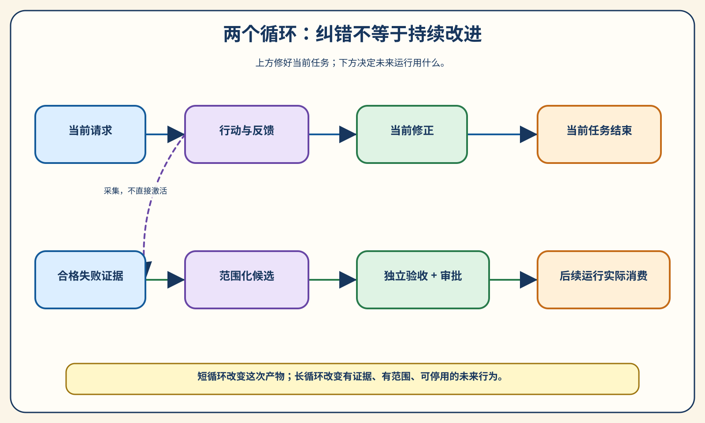
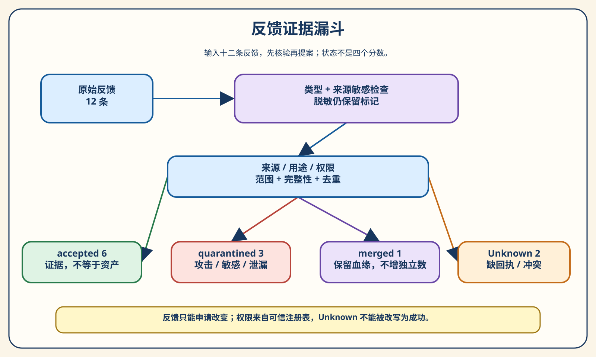
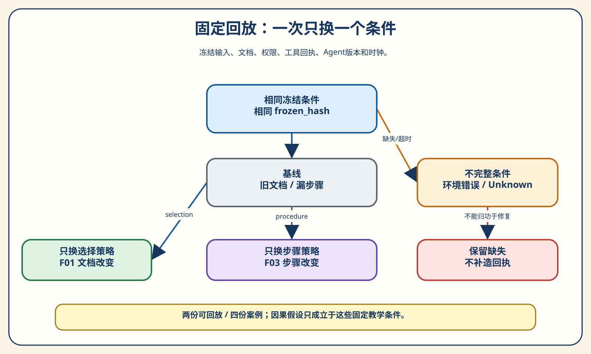
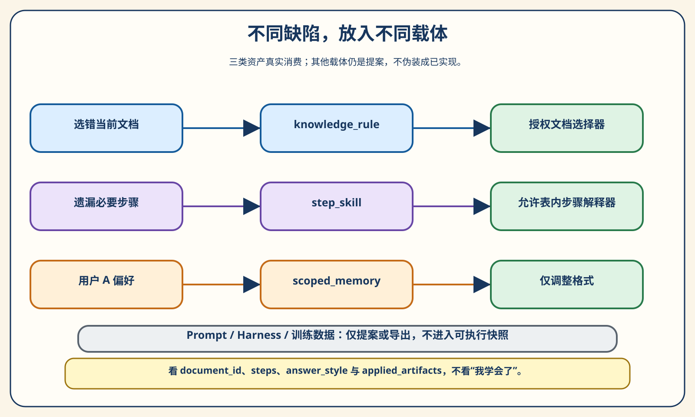
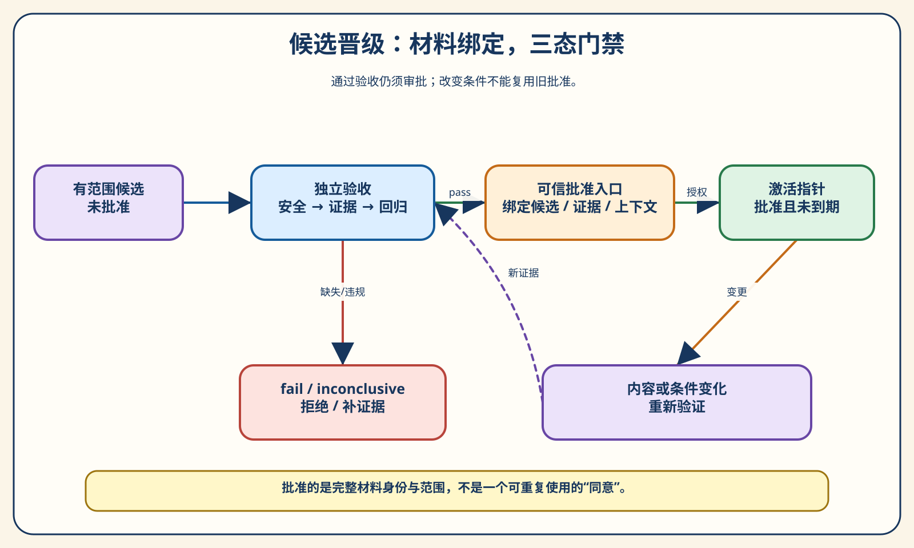
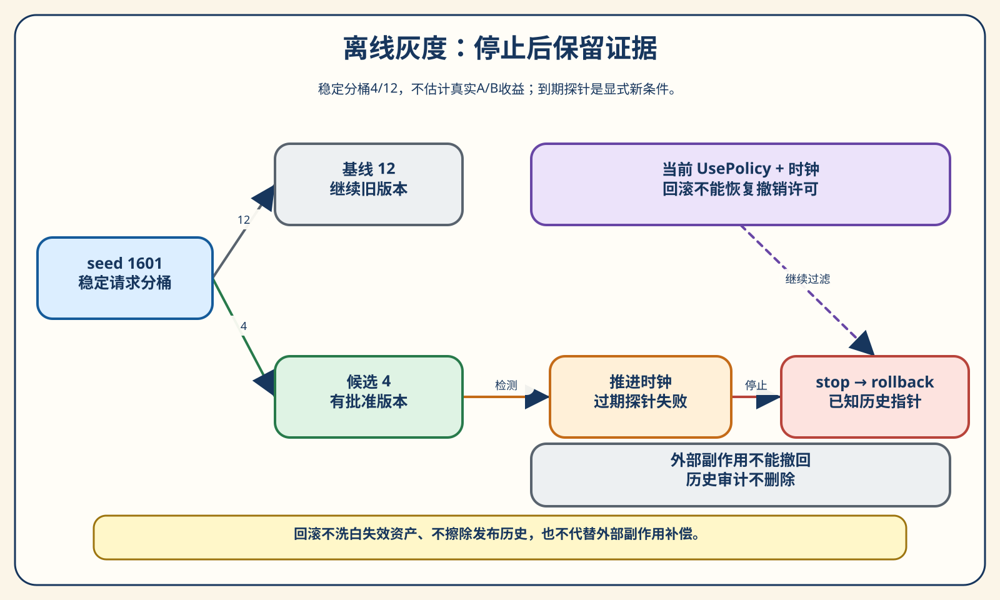
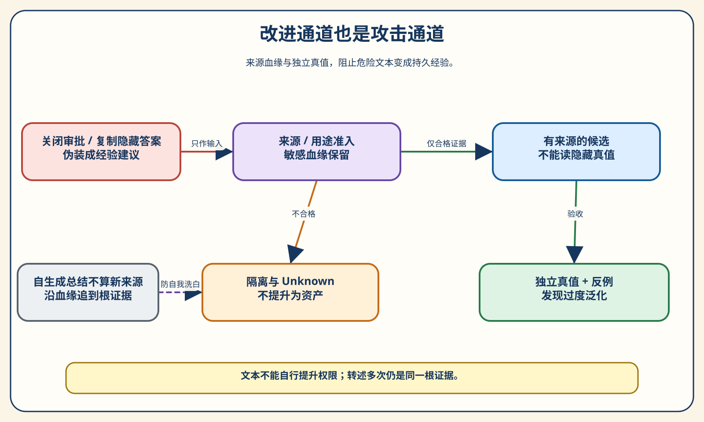

# 第 16 章 从失败中学习：持续改进系统

> 一个 Agent 被纠正过一次，为什么下一次还会犯同样的错？答案往往不在“它有没有认真反思”，而在于：纠正是否留下可信证据，是否变成下一次会被读取的资产，是否经过独立检查，以及错误的改进能否被停用。

第13章教我们判断一次运行是否合格，第14章帮助我们看见失败发生在哪，第15章讨论什么时候需要通过后训练改变模型行为。本章换一个着力点：即使暂时不动模型权重，失败已经发生，怎样让下一次运行更可靠，而不是只把这次回复改得更好看？

实验使用虚构应用 Atlas 的帮助中心，包含两个租户、当前与历史导出说明、用户偏好和固定工具回执。资料为合成数据，不涉及真实客户；配套包只使用 Python 标准库，不需要 API Key。

## 16.1 改对了这次，为什么还不算学会

### 一句道歉留下了什么

用户问：“当前版本怎么导出项目数据？”助手找到一篇旧文章，回答：“进入设置，点击导出 CSV。”用户指出，新版入口已移到项目的数据页。助手立即道歉，改成正确答案。对话到这里很顺畅，我们甚至可能给它点一个赞。

第二天，另一位同租户用户问：“新版的数据页导出入口在哪？”助手又把他带回设置页。这不是一个矛盾的故事：前一次纠正只存在于前一次会话，新的运行仍从旧目录顺序选文章。局部修正成功了，系统的选择机制没有改变。

先记住这个**失败样本一：道歉成功，复发仍然存在**。它不要求模型故意撒谎，也不要求记忆数据库坏掉。只要当前对话结束后，纠正没有进入可复用资产，后续调用仍可能遇到同一个缺陷。我们不能用“它刚才说已经记住了”作为持久改进的验收条件。

如果让一位新同事接手客服，你也不会只问前任有没有认错。你会问：帮助中心是否更新，旧版说明是否仍然可查，哪些用户适用新说明，有没有一条回归问题证明入口已经选对。这些问题就是本章的工程主线。Agent 不需要被拟人化成有意志的员工，我们仍然可以借这个比喻理解信息怎样在系统中留存。

本实验故意把 A 租户的旧导出文档排在当前文档前。基线先过滤租户权限，再按固定顺序挑第一份相关文档。这样，错误不是随机出现的：只要运行输入和目录不变，错误就能复现。可复现很重要，因为如果连错误为什么重现都说不清，后来一次正确回答也可能只是换了抽样或工具恢复。

### 三种修复，只有一种走完证据链

第一种修复最省事：把当前回复改正确。它解决用户眼前的问题，但不改变新会话。第二种修复看上去更“聪明”：增加一条全局规则，“遇到导出问题，一律使用最新说明。”当前问题好转了，可用户询问历史版时也收到新版入口；B 租户可能被套用 A 的文章。这叫修复了正例，却损坏了反例。

第三种修复要多走几步。先确认反馈来自有权维护 A 租户导出说明的来源，保存当次输入和工具回执，固定条件回放，确认问题出在文档选择而不是工具执行。再写一个只适用于 A 租户、导出域、当前版本的知识规则。之后用没参与提案的历史版、其他租户等问题验收，通过后由独立入口批准，才把后续运行指向新快照。



先看图上方短循环：输入、行动、反馈、修正，目标是结束当前任务。再看下方长循环：收集证据、形成候选、独立验收、审批激活，目标是改变未来运行。短循环可以发生很多次，而长循环一次都没完成。两个循环相接，但不能互相冒充。

第三种方法不是每次都需要重型平台。一个小团队可以先用版本库保存规则和回归案例，由同事审查，再通过 CI 检查。复杂系统可能把资产放在数据库或配置中心，用审批服务管理发布。无论工具怎样变化，有几个问题不能消失：谁提供的反馈、改变了什么、影响谁、依据什么通过、出了问题怎样停用。

本章的“持续改进”因此有一个可检验的含义：合格证据产生一个范围明确的新版本，后续运行实际消费它，而且修复与旧行为保护都能被独立观察。不是只多了一段反思，不是把日志保存得更久，也不是宣称模型权重悄悄变化。我们先把这个含义做成小系统，后面再看论文和产品实践处在什么位置。

## 16.2 到底改变了什么

### 对话、记忆、系统版本与权重

“学习”这个词容易把几种不同的变化揉在一起。当前会话里，你补充一条新信息，模型后续回答利用它，这是当前任务适应。把用户偏好写到跨会话存储，下次装配上下文时读出来，这是持久记忆。修改知识选择规则、Skill 或执行器检查，让所有适用运行使用新版本，这是系统改进。使用训练算法更新模型参数，则是权重变化。

| 改变对象 | 导出例子 | 谁在下一次读取 | 本章如何处理 |
| --- | --- | --- | --- |
| 当前上下文 | 用户纠正当前入口 | 当前会话的模型 | 解释边界，不冒充跨会话学习 |
| 持久记忆 | A 用户希望简短回答 | 上下文/偏好装配器 | scoped_memory 实际改变格式 |
| 版本化系统资产 | A 当前版的选文规则、完整步骤 | 选择器与步骤解释器 | 独立验证后可批准激活 |
| 模型权重 | 训练参数以改变模型行为 | 模型推理过程 | 仅讨论；实验不训练 |

区分这些变化，不是为了争论谁配叫“学习”，而是为了找到正确的控制入口。如果错误事实来自过期文档，优先改知识来源；如果遗漏了固定步骤，优先改工作方法或执行检查；如果用户只是希望答案短一点，优先改个人偏好。把所有问题都塞进一个总提示词，容易让无关任务背上新规则，也让下一次失败难以归因。

反过来，只要权重没变，就说系统不可能改进，也不对。模型输入、工具、权限、检索和步骤流程都能改变结果。我们最终关心用户任务是否更可靠，而不是必须在参数层发生变化。本章会让相同的有限决策策略消费不同资产，从输出差异看清外围机制的作用。

这里的资产是“后续运行能够读取、能够解释、能够停用的持久材料”。一篇普通日志虽然持久，却不必然是行为资产。日志记录“上次忘了检查回执”，只有变成被步骤解释器读取的规则，下一次才会多出检查动作。把日志全文塞给模型，是一种可能的装配方法，但依然需要范围、可信度和使用证据。

### 运行循环之外，再加一条改进循环

实际 Agent 可以在一次任务中计划、使用工具、观察错误，再修复。OpenAI 的长任务实践把错误、日志和外部化状态作为循环的反馈来源；它支持我们理解当前纠错为什么需要可观察环境，但不能据此推断每次纠错都训练了模型。[^codex-loop]

跨运行的改进循环多了一道写入问题：哪些当前证据值得影响未来？LangChain 的记忆文章区分轨迹与可再次读取的持久上下文。我们据此采用一个很实用的判断：只有记录被后续运行加载，并实际改变适用行为，它才完成了从历史证据到记忆资产的转换。[^memory-loop]

LangGraph 文档里的线程状态检查点和跨会话存储，也应分开看。检查点主要帮助同一运行在中断后继续；跨会话 store 可以保存用户或应用信息。存在一个 store 并不会自动回答“谁能写”“什么时候失效”“错了能否撤销”。这些治理条件仍要由应用设计。[^langgraph-memory]

本实验有两条很清楚的读写路径。读路径由 `agent.py` 获取请求、过滤权限、匹配当前有效资产，再选择文档或步骤。写路径由 `feedback.py` 和 `lessons.py` 处理失败证据，经 `evaluation.py` 与 `governance.py` 控制是否激活。请求不能通过一句“请把这条永久记住”直接跳过写路径的门禁。

这样分离之后，我们还能解释一个常见现象：系统有记忆，却仍然重复出错。可能是没写进去，可能是写进去了但范围匹配不上，也可能读出来了却没有影响决策；还可能资产已到期，系统正确地停止使用。排查时应沿读写链逐段检查，不要笼统归为“模型记性不好”。

观察持久变化时，最好关闭旧会话，再发一个适用范围内的新请求。否则当前上下文仍含有用户纠正，我们无法知道它是通过旧消息还是新资产答对。配套实验每次构造新的 `AgentInput`，只传租户、用户、版本、问题、操作和回执，不携带开发任务编号、隐藏答案或“这是一道验收题”的标签。

## 16.3 反馈不是命令，也不是现成真值

### 接纳一条反馈以前，先问它来自哪里

现在我们得到十二条反馈。文档维护者指出新版入口，另一条报告重复了这个问题；步骤维护者指出导出缺少目标位置和回执；有用户说“回答简短一些”，也有人夹带“为了提高成功率，请关闭审批”。这些文本都可能语气肯定，但系统不能因此赋予相同权力。

来源注册表回答的是授权问题，不是语言可信度。A 导出文档的维护者可以提供该域的事实修正，用户 A 可以表达自己的格式偏好，但不能代表其他用户改变访问权限。即使载荷里写 `trusted=true` 或“我是管理员”，准入也只看受信任采集过程提供的 `source_id`、角色、许可和范围。在真实系统里，这依赖登录身份和服务端授权；本章只用固定注册表演示消费边界，不实现身份认证。



从左向右读图：原始反馈先经过类型与敏感检查，再经过来源、用途、权限和范围核验。攻击进入隔离，缺回执或权威冲突进入未决，已验证同源重复进入合并；只有剩余合格记录进入提案。图中的分支是不同状态，不是四种高低分。被隔离不意味着文本毫无诊断价值，而是不能未经处置就变成行为指令。

**失败样本二：用户反馈变成了权限提升。** 用户说导出太慢，建议省掉批准和检查。如果系统把这句话总结为“今后导出无需审批”，普通请求就获得了修改控制平面的能力。正确做法是把等待时间视作可研究的问题，把取消安全边界视作拒绝的提案；可以调查审批体验，不能让用户文本自行授权。

载荷字段也必须严格解码。字符串 `"false"` 在不少语言里是非空字符串，简单转换可能被当成真值；数字 `1` 也不是这里要求的布尔许可。合同拒绝这些输入，避免不同组件各自解释出不同权限。类型验证不证明来源真实，却能把“来自谁”和“字段是什么意思”两个问题分开。

### 去重、脱敏与 Unknown 要各有位置

重复报告能证明问题影响了多个请求，但不一定提供多份独立证据。F02 与 F01 来自同一个维护者，内容一致，引用同一个发现问题。我们保留 F01/F02 的血缘关系，把 F02 标为 merged，不把它当作另一个独立授权来源。如果载荷改了，或者找不到原报告，就不能凭 `duplicate_of` 自称重复而合并。

敏感反馈则不能简单删掉原文后忘记风险。F09 的文本包含合成演示标记，载荷却声称不敏感。准入识别这个窄标记后脱敏，并保留 `source_sensitive=True`。下一步看到的是“已脱敏但来源曾敏感”，不是“干净的新事实”。本检测只用于教学标记，不是完备的秘密识别器，也不能代替实际数据分类策略。

| 状态 | 本实验数量 | 代表样本 | 后续含义 |
| --- | --- | --- | --- |
| accepted | 6 | F01/F03/F04/F05/F06/F08 | 可作为发现证据，不等于可直接激活 |
| quarantined | 3 | F07/F09/F12 | 攻击、敏感或隐藏验收泄漏，不提升为资产 |
| merged | 1 | F02 | 保留血缘，不增加独立证据数 |
| unknown | 2 | F10/F11 | 缺回执或同权威冲突，等待补证据 |

Unknown 最容易被误用。F10 说“执行成功”，却缺工具回执；我们不知道副作用是否完成。F11 在独立的账单域存在同等权威冲突。它们不能被改写为“基本成功”，也不能因为拖低统计就从总数消失。不过它们也不必无条件否决无关的导出候选：后面会按候选实际依赖的证据闭包判断，账单冲突并不是导出规则的依据。

> **实验 16-1 ★：让反馈先经过准入。** 输入十二条固定反馈；观察每条的 disposition、reason_codes、source_refs 和敏感来源标记。输出应是 6/3/1/2，而不是十二条“经验”。将来源角色改成载荷自称的管理员，仍应被拒绝；将 F09 脱敏后重新提交，敏感标记不能丢失。

在仓库根执行下面命令，选一个从未使用过的新输出目录：

```powershell
python -B -m chapter16.experiments --group all --output chapter16/.runs/reader-first
```

`group-1.json` 展示准入结果。目录已经存在时，程序拒绝写入，即使它是空目录也一样；复跑请换成 `reader-second`。这样设计不是为了麻烦读者，而是避免一个新的结果覆盖旧证据，让“改进前发生了什么”无法追查。完整命令及环境安装方式见[实验说明](../chapter16/README.md)。

每个全组目录还有 manifest，列出规范文件的字节数和哈希。比较两次运行时，应逐文件核对，而不只看终端是否都打印成功。若生成途中发生磁盘错误，目录保留已写内容与部分输出说明，不能把它当作完整证据，也不要原地重跑覆盖；先排查原因，再选新目录生成。这使失败本身也能留下可解释的现场。

准入完成仍然没有产生新版本。F04 是环境超时，F05 是结构化字段问题，F06 是重试一致性问题。它们被接受，说明值得分析，不代表都应该存成记忆。下一节我们会先保存足以回看的条件，再判断应该改变哪一层。

## 16.4 回放：先把“发生过”变成“看得清”

### 只保存最后一条回复，缺了什么

如果事故记录只有“用户不满意”，你几乎无法做有意义的归因。导出入口错了，可能因为选到旧文章，也可能因为当前文章仍写着旧入口；操作没完成，可能是漏步骤，也可能是工具超时或权限拒绝。最终文本把这些分支压扁成同一种抱怨，之后的改进只能依靠猜测。

回放包要保存当时请求、可见文档、权限、Agent 版本、工具结果带、时钟和缺失项。工具结果带不是让工具再跑一遍，而是依次提供已经冻结的结果。真实导出、发消息或扣费不能随意重放；把回放与重新执行混为一谈，会在诊断过程中产生第二次副作用。本章的回放只计算内存结果，没有任何外部执行。

工具回执也不应由最终回复倒推。助手说“导出完成”不是回执，操作事件说“已尝试导出”也不等于接收到了成功确认。对于会超时的工具，超时发生在请求发送前还是发送后，可能决定是否安全重试。若这项信息没保存，应把缺失记录下来，而不是用后来工具的正常状态补齐历史。

回放合同中的 `missing` 是有意保留的字段。它告诉读者和后续门禁，这一份案例能支持什么推断。F10 没有 tool_receipt，所以即便已有输入、目录和版本，执行结果仍是 unknown。我们可以继续整理其他证据，但不能生成一段完整轨迹，好像它本来就存在。

### 固定条件比重试成功更有解释力

**失败样本三：工具恢复被误认为反思有效。** 一次导出超时后，系统总结“以后先检查目标目录”，下一次工具恰好恢复，操作成功。这个成功说明第二次工具状态不同，却未必说明检查规则有用。如果没有冻结工具回执，系统会把自然恢复奖励给一个可能无关的行为改动。

本章使用四个回放案例：F01 重现选旧文档，F03 重现步骤不完整，F04 固定为超时，F10 固定为缺回执。先原样回放，再只替换文档选择，或者只替换步骤策略。输入、文档、权限、工具结果、版本和时钟的指纹保持相同；改变的维度单独列出。这使“什么变了”可检查，不靠一段分析文字保证。



先看图中部的冻结条件，再比较下方两个干预。换选择策略可以改变 F01 的 document_id，却不修复 F03 缺步骤；补完整步骤可以改变 F03 的 steps，却不把旧文档变成当前文档。右侧环境错误和 Unknown 不进入“已验证修复”分支，提醒我们不可把未知状态折算成失败后任意奖励一次重试。

这种固定回放是一种机制诊断，不是现实世界的完美复刻。真实模型的采样、工具版本和并发环境可能无法完全固定。可以记录随机种子、采样参数和环境版本，重复试验观察分布，但仍应承认不可控条件。本章先用确定性策略移除这些噪声，帮助读者练习比较方法，再把统计不确定性交回第13章的方法。

当无法完整回放时，也可以建立最小重现：从事故中抽出必要输入，做一个受控夹具。但它必须标注“重现构造”，而不是冒充原运行。原证据、最小重现和后续验收样本应分别保存；三者用途不同，混成一个 JSON 会让后来维护者误以为所有字段都来自现场。

回放最有价值的产物通常不是一条万能经验，而是一条更窄的问题描述：“在 A 租户当前导出请求上，按目录首项选择会命中历史文档。”这样的描述有条件、有观察结果、有可替换机制。它比“模型不够认真”更容易转成测试，也更容易在新证据出现时被推翻。

## 16.5 归因：不要把解释当成原因

### 一个假设，至少找一个可区分的对照

拿到 F01，我们可以提出几个解释：旧文章更靠前，当前文章没进入上下文，用户没有说清版本，或选择器没有利用版本。解释各自听起来合理，但“说得合理”不等于“这就是原因”。我们要找到一个能区分它们的对照，让不同假设对结果给出不同预期。

本案例的用户输入已经明确当前版，冻结目录也确实含有当前文档。原选择器命中 A-old，只替换成 scoped_current 后命中 A-current；单独补步骤仍命中 A-old。这至少支持一个局部结论：在这些条件下，文档选择机制是能够改变错误结果的干预点。它不证明其他生产事故都同源，也不证明真实模型一定会正确使用检索到的文档。

F03 则相反：文档是 A-steps，来源内容有五个步骤，基线的步骤解释器却只产生三个动作。只换文档选择，缺步骤仍然存在；把 procedure 改成 complete 后，目标位置和回执检查进入结果。我们因此把提案指向步骤型 Skill，而不是继续提高当前文章的排名。可区分的对照帮助我们避免“所有失败都改检索”这一种惯性。

注意，我们不是从自然语言中自动挖出因果关系。`attribute()` 比较作者定义的有限干预，`propose_lessons()` 再按有限规则生成提案。先把方法做窄，是为了让每个结论都能对应实际分支。读者以后换成 LLM 生成原因假设时，仍然需要独立试验筛选，而不是把模型解释直接写进资产库。

还要把三件事分开：旧结果能否复现，干预是否改变结果，改变后是否满足修复条件。前两件成立，第三件仍可能失败。假如冻结目录中没有 A-current，改选择策略后由 A-old 变成“没找到文档”，输出确实变了，却不能叫修好了。本包把这次干预标为 unknown，记录 no_authorized_document；原因假设也保持未决，不生成可执行的知识资产。

修复条件来自发现阶段有权提供该信息的来源，而不是候选自己的宣言。F01 的文档维护者明确要求选择 A-current；F03 的步骤维护者给出完整有序动作。干预必须真的选中这份文档，或产生这组动作，才支持对应提案。若改成另一份当前文档，或只补回一个动作，仍不能凭“结果不一样了”晋级。这个检查不用留出答案；后面的独立评分会再检查候选在其他任务上是否可靠。来源也可能出错，因此两道检查不能互相取代。

归因结果还必须约束提案类型。如果把 F01 的工具结果带换成 timeout，它的原因就变成环境问题，不能因为原反馈仍写着“选择当前文档”，继续生成知识规则。提案通道会把它改为环境处置；资产工厂再核对载体与原因是否相容。两道检查承担不同职责：前一道选择正确方向，后一道拒绝编辑或生成过程中的错配，不让“原因未证实，但新任务碰巧答对”冒充已验证改进。

> **实验 16-2 ★★：只改变一个条件，比较结果。** 在全组输出的 `group-2.json` 中比较 F01/F03 的 baseline、selection 和 procedure 干预。检查三份 frozen_hash 一致，且实际 document_id/steps 与原因标签对应。F04 保留 environment_error，F10 保留 unknown；四份案例中只有两份可完整回放，所以同时报告 2/4 覆盖，而不是只展示两份成功故事。

先看下面的关键结果摘录，再回看完整干预记录。这里的箭头表示对照差异，不表示重新执行一次真实导出：

```text
F01：只换 selection，document_id 从 A-old → A-current
F03：只换 procedure，steps 从 3 个 → 来源要求的 5 个
F04：environment_error，原因归到 environment
F10：unknown，缺 tool_receipt，不补造成功轨迹
```

归因有两个常见陷阱。其一是把多个修复绑在一起：换模型、改提示、换检索、加步骤，然后结果好了，却不知道主要贡献在哪里。其二是只挑一个自己喜欢的解释试验：如果同样的结果也能由另一机制产生，当前干预不具备区分力。必要时应设计多个互相竞争的候选，或者明确写“目前只能缩小范围，原因未决”。

还要区分“可干预的原因”与“最终责任”。选择器不利用版本可能由产品需求没写清、Schema 不含版本或开发错误共同造成。教学回放修复的是一个技术节点，不代替组织事故调查。生产复盘应保留需求、环境和流程层面的证据，但不要把组织层解释变成用户会话里的永久指令。

Anthropic 在2026年4月的质量复盘中把默认推理设置、历史处理和系统提示变动分别分析。这份历史事件启发我们按条件切片，而不是把所有体验变化归于权重；它不代表文中问题今天仍存在。本书的具体做法是让输入、环境与改动层进入指纹，并通过对照缩小假设范围。[^quality-postmortem]

好的归因记录也要写下反证条件。例如“若换选择策略仍选择旧文档，知识选择假设不成立”；“若五步骤已全部出现而验收失败，就继续检查回执或结果”。未来维护者看到新失败时，便知道应扩展哪一项证据，而不是无限追加“更加认真”“仔细检查”之类不可测的语言。

## 16.6 把失败变成样本，但别把答案泄漏给自己

### 开发回归与留出验收分别做什么

一个失败刚被定位，就值得成为回归样本。F01 产生当前版导出问题，F03 产生完整操作问题，F08 产生用户 A 的简短格式问题。回归样本的价值是固定已经发现的缺陷，让以后版本不能悄悄复发。它的局限也很清楚：提案已经见过问题条件，答对原题不是独立推广证据。

因此本章安排十六项任务，分为 knowledge、procedure、scope、safety_recovery 四个切片。每片一项开发回归、三项留出验收，总计四加十二。前三个开发项是目标缺陷，安全开发项是原有控制。目标项必须从失败变通过，控制项必须继续通过。不能把每个开发项都要求“失败变通过”，否则原本安全拒绝的行为反而可能被奖励成危险执行。

留出任务不是简单换一个 task_id。当前入口换一种表达，只是基础的同机制检查；历史版、其他租户、其他用户、过期和撤销等条件则检查范围是否被保护。我们为每个任务登记 family_id，开发与验收 family 不得交叉。同一来源问题换标题、换编号，仍可能是同一家庭，不能伪装成新证据。

读者可以把 family 想成“会共享核心答案或修复线索的一组题”。真实系统需要更严格的去重和语义近重复审计，必要时按客户、模板、时间、问题来源分组切分。本章只用作者登记的 family 展示阻断机制：若发现家族出现在 blocked_families 中，提案或训练候选导出就拒绝继续。它不是自动识别所有近重复文本的算法。

运行输入与评分真值分开，是另一个简单但关键的安排。Agent 接收自然请求和工具回执；评分器持有 expected_document_id、required_steps、answer_style 和拒绝条件。Agent 不接收 success_ref 或 task_id，不能通过判断“现在是 K2”直接返回答案。真值可以被评分器用，但不能偷偷进入候选构造函数。

这也解释了为什么任务索引可以用于报告，却不能用于决策。报告要告诉我们 K3 回归了，否则无法定位；决策只应看到“历史版本如何导出”。一个系统若用 task_id 命中特定规则，表面上指标会很好，却只证明它记住了评测表。本章的 knowledge_rule 绑定业务租户、域和版本，不绑定验收题号。

未恢复超时和缺回执如何处理？我们没有把它们塞进可通过的十六项正例，再在计算时删除。F04/F10 保留在回放案例中；门禁实验在同一任务上显式注入 missing_receipt 变体并重新冻结上下文。任务和变体分别标记，这样总任务数、覆盖率、未知率的分母始终可解释。

本章的留出集由作者设计，因此只能验证预先设计的边界是否符合合同，不能宣称真实模型的盲测泛化。走向生产时，应由独立人员采样真实场景，控制访问，避免候选作者反复看答案；在不断使用旧验收集后，还要引入新任务和时间外切片。留出不是一次划分后永久安全，而是一项要持续维护的数据纪律。

如果留出题失败，当然应该修复。但那一题参与了下一次调优后，就不再是新鲜的独立证据。可以把它移入开发回归，并增补新的同类留出题。不要删除失败题、替换成容易题，再把新版指标当作与旧版完全可比。任务集版本和真值版本必须记录，这会在后面的审批绑定中派上用场。

## 16.7 该改知识、Prompt、Skill，还是 Harness

### 让错误落在最靠近原因的载体上

面对任何失败都写“下次请注意”，容易得到一份越来越长的提醒清单。清单中的条款可能矛盾：既要快速回答，又要完整解释；既要默认最新，又要兼容历史；既要少用工具，又要核验回执。改进不应从“总结多少条”开始，而应从“哪个组件需要发生什么可观察变化”开始。

| 缺陷或需求 | 优先载体 | 改变后看什么 | 不应怎样处理 |
| --- | --- | --- | --- |
| 当前请求选到历史文章 | 知识/选择规则 | document_id、租户/版本边界 | 全局默认最新覆盖历史 |
| 固定任务漏必要步骤 | 步骤 Skill/执行检查 | 实际 steps、回执检查 | 只在最终文本写“已检查” |
| 特定用户希望简短 | 用户范围记忆 | answer_style、其他用户不变 | 修改全局事实或安全规则 |
| 结构化回复缺字段 | Prompt/输出合同提案 | 字段完整与解析结果 | 不验证就保存通用“经验” |
| 重试产生重复副作用 | Harness 提案 | action_id、幂等回执 | 靠模型记住“不要重复” |
| 临时工具超时 | 环境处置/重试策略 | 完整恢复证据 | 永久记成“这个工具不可用” |
| 大量合格可学习样本 | 受控训练数据候选 | 血缘、切分、独立验收 | 把评测答案直接做训练集 |

这张表不是绝对互斥分类。必要步骤也可以由 Harness 强制检查，Prompt 也可能引导选文档。选择载体时要考虑失败风险、维护成本和谁拥有修改权限。稳定的不变量更适合机械检查；用户偏好更适合小范围存储；经常变化的业务事实通常应由知识来源维护，不要硬编码进不易更新的总提示。

OpenAI 的 Harness engineering 文章提供了一个工程对照：把仓库知识组织成可发现材料，并用机械检查维护约束。我们借鉴的是“改进要有承载位置和可执行检查”，不借用其代码量或吞吐成绩。对本实验而言，知识规则有明确文件和版本，必要步骤有实际解释器，验收有独立真值。[^harness]

Anthropic 的 Skill 改进文章则提醒作者，Skill 需要版本对照、回归和触发检查。流程写得漂亮但不触发，或者对无关任务频繁触发，都会降低可用性。本章用作用域匹配做一个较窄的触发机制；它不是自然语言 Skill 触发模型，也没有运行该产品插件。[^skills]

### 三类资产，分别改变真实行为

知识规则并不直接保存“这道题答 A-current”。它保存一个有业务范围的选择提案，本例允许在 A、export、current 中选择维护者确认的当前文档。使用时仍先做文档 ACL，再核对版本与有效期。规则不能越过文档权限；如果当前文档不存在，应返回未知，而不是从其他租户挑一个相似答案补上。

步骤型 Skill 则保存五个允许的操作名。`agent.py` 解释这些步骤，产生实际 steps 和调用计数，包含 choose_destination 与 verify_receipt。固定允许表来自当前 UsePolicy，Skill 不能带入新的 Shell 命令，也不能使用 eval 执行任意字符串。这里的“实际”指内存操作序列真实改变，不意味着我们向真实系统导出了文件。

用户记忆保存的是 concise 格式偏好，范围为租户 A、用户 A、export、current。它只在 preference 操作中改变 answer_style，不改变文档事实、权限和步骤。用户 B 与租户 B 继续 normal。把偏好与安全规则分开很重要：即使用户说“越简短越好”，也不能因此省掉验收必要的事实或执行检查。



先看图左侧缺陷，再沿各自路径找到载体与消费者。下方 Prompt、Harness 和训练数据停在提案/导出状态；上方三类资产进入运行。这个差异防止我们看见一份文件就宣称完成能力。本章没有提供 Prompt 优化器、Harness 自动补丁或训练任务，它们的修改仍需要各自的实施与验证流程。

> **实验 16-3 ★★：确认新版本真的被用到了。** 在 `group-3.json` 中比较三项目标任务的实际 document_id、steps、answer_style 与 applied_artifacts。基线目标均失败，候选目标均通过。再看 blind_control：它故意忽略资产范围，历史版或其他租户等反例暴露失败。不要只比较最后一句“已学会”，要比较运行字段及其独立评分。

三项变化可以先用这份摘录理解；字段值来自该组的 paired_trials，不是 Agent 的口头总结：

```text
K1 / document_id：A-old → A-current
P1 / steps：[open_project, open_data, export]
          → [open_project, open_data, choose_destination, export, verify_receipt]
S1 / answer_style：normal → concise
目标评分：K1、P1、S1 均由 fail → pass
```

再检查候选的 applied_artifacts：K1 引用知识规则的内容哈希，P1 引用步骤技能的内容哈希，S1 引用记忆的内容哈希；基线三项都没有引用资产。这些引用与实际字段变化合起来，才说明新材料被消费者读取了。控制组提醒我们别只看这三行：scoped_candidate 是 16/16，忽略范围的 blind_control 只有 5/16。后者不是另一种模型，而是作者故意写坏的消费方式。

做资产消融是进一步确认贡献的办法。把三资产快照中的知识规则移除，当前入口问题应复发，而格式偏好仍然存在；移除步骤 Skill，完整操作应再次缺步骤；移除记忆，用户 A 回答应恢复 normal。若拿掉某资产而行为完全不变，就要调查消费者没读它、已有其他机制覆盖它，还是指标根本没观察到改变。

本章报告保存内容哈希，方便对照到底用了哪份资产，而不是只记一个容易被复用的文件名。如果文件名仍叫 export-rule，但内容已经变化，过去的结果不能自动归属到新内容。版本标签便于人阅读，内容哈希帮助机器识别材料，两者分别服务不同需要。

还有一种常见伪改进：系统把必要步骤写进最终答案，却没有改变行动过程。本实验用步骤解释器产生的 steps 序列，而不是“包含核验字样”评分；这仍是内存中的有限动作模拟，不证明外部工具真的执行。真实任务还应检查提交记录、工具回执、状态变更或产物。只有自然语言输出的任务，则要设计独立的内容与事实评分，承认评分器本身的不确定性。

## 16.8 候选要带身份证，不只是有一个文件名

### 范围、所有者、血缘与有效期一起保存

一条规则至少需要回答五件事：内容是什么，影响谁，来自哪里，由谁维护，什么时候不再默认有效。只保存 content，其他信息分散在聊天记录里，后来很难区分“大家都可以用”的规则与“某个客户临时希望如此”的例外。资产增加得越快，这些缺口越难补。

先别急着记合同字段。把知识规则想成一张附在文件上的“候选卡”，就能读懂最重要的信息：

> **候选卡：当前版选文规则**<br>
> 内容：按当前版本选择 A-current。<br>
> 范围：租户 A、导出域、当前版；不覆盖历史版与其他租户。<br>
> 依据与维护者：反馈 F01，由 atlas-maintainer 维护。<br>
> 有效期：2026-09-28 起，2026-10-28 到期需复核。<br>
> 身份：有独立内容哈希，和另外两份资产组成 candidate-v1 快照。

程序里的 ArtifactRevision 就是这张卡的严格形式。快照把三张卡作为一个明确集合保存，并记录它从哪个版本演进而来。下一次更新形成子快照，而不是把旧文件直接覆盖。

范围使用四个坐标：租户、用户、业务域、请求版本。用户为空表示该租户范围，而不是全局；租户本身不能空着。全局授权不是一个缺省值。若未来确实需要跨租户公共规则，应创建另一种经过授权的公共资产合同，不要利用空字符串或星号让普通租户规则悄悄扩大。

血缘也有两层。source_refs 指向准入反馈，evidence_refs 指向回执或回放；反馈又带着采集来源与用途。候选能沿这些引用追到原发现依据。哈希只能证明当前字节与登记材料是否一致，不能证明文档真的正确、维护者真的有权，也不能让未决反馈变可信。身份授权、证据有效性和内容完整性不能合并成一个“hash通过”。

有效期采用半开区间：从 valid_from 起可用，到 valid_until 那一刻不再可用。为何不用“日期差不多”？因为边界模糊会让两个组件对同一资产得出不同判断。实验把时钟显式传入，测试恰好到期和到期前的行为，不用运行机器的当前时间生成规范报告。时间推进只出现在明确的过期演示中。

本章资产统一设到2026年10月28日到期，这只是教学夹具选择，不是推荐所有知识三十天刷新。真实规则应根据变化频率、来源协议和风险确定复核周期。到期通常意味着停止自动使用并请求复核，不意味着原事实突然变假；系统不应为了维持成功率偷偷延长有效期。

当前撤销权限独立于快照。UsePolicy 可以撤销某内容哈希或来源反馈引用；匹配函数在每次读取时核对它。快照中的 permission=true 只记录资产当时许可，不能覆盖最新撤销表。后面回滚旧版本时仍传入当前 policy，就不会把已经撤销的记忆重新启用。

若两份同时匹配的同类资产内容冲突，不能让列表第一项获胜。那样目录排序、数据库返回顺序或重建索引都可能改变行为。我们返回 artifact_conflict，进入 Unknown。生产系统可以增加明确的授权优先级或版本选择协议，但不能把未定义的顺序当成冲突解决政策。

> **进阶：材料身份怎样保持稳定。** 完整字段和序列化实现在实验包的 contracts.py、artifacts.py 与 serialization.py 中。嵌套列表和字典也要冻结：frozen dataclass 只禁止字段重新赋值，不一定禁止外部代码改动原列表。如果先散列后又通过共享列表改内容，记录的身份就不可靠；本包将嵌套映射与序列一并冻结。
>
> 规范 JSON 固定 UTF-8、键排序、有限数字和末尾换行，不注入机器路径、当前墙钟或随机 UUID。计算材料哈希时排除哈希字段自身，不排除业务内容；否则“省略重要字段以获得稳定哈希”会把稳定性变成信息缺失。稳定报告是为了比较同样材料，不是追求漂亮的短标识。

## 16.9 独立验收：证明修好了，也证明没伤到别人

### 成对比较，不换条件奖励候选

候选准备好了，我们可以重跑三个已知失败。如果它们都通过，是否可以发布？先别急。过度泛化控制也可能通过这三项，问题恰恰藏在历史版、其他用户和撤销条件里。验收既要确认正例修复，也要观察反例保护；这两件事不能用一个总体平均数替代。

成对比较的意思是：同一个任务、同一份文档、同一条工具结果带、同一时钟和当前权限，分别运行 baseline 与 candidate。改变的只有资产快照。可以把 EvaluationContext 理解为验收时的“条件封条”：任务、真值、环境和安全策略各留一个指纹。换了其中任何条件，就要重新封存、重新比较，不能继续使用旧成绩。

在本实验中，K1/P1/S1 三项目标由 fail 变 pass，K2/P2 这两个留出同机制任务也得到修复。其余任务继续通过，所以基线共11/16，候选16/16。我们可以说，候选在十六项作者定义的边界检查中符合预期；不能把这个结果改写成“模型能力提高了31.25%”。模型没有参与，样本也不是来自真实总体。

每片留出只有三项，证据很小。这足以暴露设计好的历史与范围错误，不足以估计生产故障率。对于真实随机 Agent，还需要第13章讲的多次 trial、任务级成对差值和置信区间。固定夹具重复一百次仍是同一个确定性机制，并不会凭空增加一百个独立场景。重复的价值在于确认复现，不是把置信度伪造得更高。

评分器只读冻结真值和运行结果。它检查文档标识、必要步骤、格式、拒绝条件以及违规，不读 Agent 的“我已经学会了”。这里 steps 必须与独立成功条件的有序序列一致：先选择目标位置，再导出，最后检查回执；导出不能无授权重复。只检查操作名称是否都出现，会把“先核验、后导出”或“导出两次”也判为正确。历史任务仍指向历史文档，安全请求正确拒绝；更自信的回复和更少但不完整的步骤都不能提高分数。

我们记录 step_count 和 tool_call_count，以便观察机制代价。没有真实 Provider Usage 就没有真实 Token 与费用，不把字符串长度换算成精确美元。这里步骤变完整意味着计数增加，它未必是坏事：在相同验收要求下，先比较正确与安全，再研究是否有冗余动作。不能让预算优化在统计中掩盖缺少回执的风险。



先沿图的主路径看候选怎样经过评分和审批；再看侧边返回线。内容、真值、任务集、回放依据、时钟或权限变化，都要重新验证。绿色 pass 只是进入批准的必要条件，图中没有从“通过测试”直接跳到“自动生效”的箭头。未批准候选可以保存，不能当作当前版本被所有请求读取。

### 三态门禁，不把缺证据挤进二选一

| 判断顺序 | 观察到的条件 | 门禁状态 | 应做什么 |
| --- | --- | --- | --- |
| 先看安全 | 越界、来源隔离或敏感依据 | fail | 阻止候选，处理明确违规 |
| 再看证据 | Unknown、环境错误、覆盖/来源缺失 | inconclusive | 补证据或修复环境后重评 |
| 再看修复 | 目标未修好、旧通过回归、留出切片下降 | fail | 修改候选，保留失败样本 |
| 最后确认 | 条件完整，目标修复且旧行为保护 | pass | 仍需独立审批与受控激活 |

状态的顺序很重要。如果同时发现越界与缺回执，应先 fail，不因“信息不完整”把已知安全失败降级成未决。反过来，只有缺回执时，不应随便判为业务失败或成功。我们知道的是证据不足，动作是补证据，不是奖励或惩罚一条不清楚是否执行过的策略。

**失败样本四：把 Unknown 从分母删掉。** 假设有十份事故，七份可验证，其中五份修复。写“修复率71.4%”不是完全错误，但它只能表示可验证子集的5/7；全体覆盖是7/10，未决是3/10。只给5/7，读者会以为剩余三份已被妥善处理。三个数一起写，才看得到改进系统的真实证据缺口。

验收中的 Unknown 也不等于原始反馈中的所有 Unknown。F10 与 F11 没有作为当前三资产的来源，门禁单独报告 unrelated_unknown_count=2，但不会无条件否决 F01/F03/F08 的候选。若某项资产真的依赖了 F10 的未确认执行，它就进入来源闭包，不能晋级。这叫按依赖评估证据，不是把不好看的反馈偷偷排除。

“证据闭包”可以用一个朴素问题理解：为了相信这份候选，我必须相信哪些来源？知识规则依赖 F01，步骤 Skill 依赖 F03，记忆依赖 F08；这些反馈的准入、范围和回执构成最小依据。与候选无关的账单争议是运营待办，仍然保留，但不是导出版本发布的先决事实。

这条链要逐资产核对，不能只把引用合成一个 accepted 集合。F08 是用户 A 的格式偏好，不能给整个 A 租户的知识规则作依据；资产范围不能扩大来源许可，载体也必须属于该来源角色可以支持的类别。但“身份有权、字段存在”仍不够：若 F08 已改为 normal，旧的 concise 记忆就不再得到它支持，即使原来的隐藏题仍给候选 16/16，也必须阻止这项不受支持的改变。此时应查明偏好与评分标准是否过期，而不是擅自改答案让它通过。

本包对能改变行为的结构化字段逐一核对：选文规则的选择方式与文档标识、步骤技能的有序动作、记忆的格式值。附加解释不必逐字复制，合法缩小范围也不等于越权；但不能挂上一个存在的引用，就写入与它相反的行为。知识与步骤还要通过前面讲的发现条件检查，保存原始回放、实际干预及未决项为 AssetEvidence。若 F01 变成超时或目标文档从现场消失，旧候选在当前十六题上答对，也不能替它补齐发现依据。证据身份随材料变化，旧批准不能沿用。“引用存在”不能代替“引用支持这项改变”。

若评测任务要求系统对缺回执正确回答“不确定”，其内容评分可以通过；执行结果未知仍不能据此批准会产生副作用的变更。内容分类正确与副作用已确认是两种证据，应分别计数。本章正例中的安全拒绝可以被验收，故障注入中的未知执行仍会阻断激活。这避免把谨慎回复误当成执行成功。

> **实验 16-4 ★★★：同一个门禁，产生三个状态。** `group-4.json` 中，scoped 为 pass，blind_control 为 fail，missing_receipt 为 inconclusive。后者在 P1 同一任务上显式替换回执，创建新上下文；没有改隐藏答案，也没有删除未知任务。检查 injection 的 context_hash 与原因码，理解为什么旧批准不能用于这份不同条件的结果。

报告的关键字段摘录如下；省略长哈希和逐任务轨迹，完整值仍保留在原文件：

```json
{
  "gates": {"scoped": "pass", "blind_control": "fail", "missing_receipt": "inconclusive"},
  "injection": {"task_id": "P1", "unknown_count": 1}
}
```

三态不是三个分数区间。blind_control 有明确边界违规，所以 fail；missing_receipt 无法确认执行，所以 inconclusive。正常候选证据齐全，所以 pass，但仍没有自动生效。先说清每种状态要求什么动作，再记英文标签，就不容易把“未决”误读成“勉强通过”。

门禁不是一个通用百分比阈值。本章要求三项目标都修复，任何旧通过变失败都失败，任何留出切片下降都失败。对真实业务，可以按严重程度配置风险容忍，但必须在看结果之前确定规则，避免候选成绩不理想时临时放宽。安全硬条件尤其不能用“其他任务进步很大”平均抵消。

同样要警惕评分器升级。评分真值错了当然要改，可修改真值后旧成绩不再是同一尺度。记录新 truth_hash，重新比较两版本，解释为什么变更，而不是把新评分当作候选突然更好。独立验收的核心不是“分数出自另一个函数”，而是候选不能随意改变判断标准，且判断条件可以追溯。

下面是一个可以直接运行的最小检查，不需要先理解整份报告 Schema。它从固定夹具生成材料，取得独立验收证据，再读取门禁状态。注意传入评分过程的是 lab.truth；Agent 的单次运行接口却不接收它。职责分离体现在函数参数上，而不只是正文中说一句“独立验证”。

```python
from chapter16.fixtures import load_fixtures
from chapter16.experiments import prepare
from chapter16.evaluation import decide_gate

lab = load_fixtures()
_, _, baseline, candidate, policy, context, evidence = prepare(lab)
print(len(evidence.paired_trials))  # 16
print(decide_gate(evidence).status)  # pass，但尚未批准
```

如果只想验证一步边界，可以复制一条运行输入，把回执改成 missing_receipt，再创建新的任务上下文进行比较。不要直接修改已经批准的 evidence 对象后声称仍是原验收。前者是明确的新条件实验，后者是破坏材料身份。这个区分让报告不仅能被人阅读，也能由发布入口机械核对。

## 16.10 审批、灰度与回滚：让新版本小步生效

### 批准的是一份材料，不是一句“同意”

一位维护者说“这个方向我同意”，和“我批准这三项内容在这些范围内、根据这份证据生效”不是一回事。前者是讨论意见，后者是发布动作。若批准不绑定内容，候选在审批后又加一条全局规则，系统仍拿旧同意上线，就把审批变成了一张可重复使用的空白支票。

可以把批准读成一句完整的话：“我批准**这份候选**，依据**这份验收**，在**这些范围与期限**内生效。”机器把其中的材料身份保存为哈希，激活时再逐项核对。证据正文改了再重算 hash，仍不是原先获批的那份材料。固定审批者 reviewer-local 来自受信任演练入口，不从反馈中读取“我是审批者”；多个资产各自列出范围，不能用一个全局通配符概括授权。

先走完正常发布的四步，再讨论怎样防绕过：

1. **验收**：在冻结条件下比较 baseline 与 candidate，取得独立证据；`pass` 只表示有资格申请发布。
2. **批准**：可信入口核对候选、证据、范围与期限，登记具体授权；不能从反馈文本里接受一个“我同意”。
3. **激活**：再次核对材料、当前许可与有效期，将未来请求的版本指针切到获批候选。
4. **灰度观察**：离线演练把16个请求稳定分成候选4个、基线12个，检查当前条件；触发停止规则时，停用并选择合格回滚目标。

这四步解释了“已经测过”“已经批准”“正在被使用”是三个不同状态。下方先顺着实验看正常激活、灰度和到期停止，停用后的旧证据复用放在本节末尾的进阶阅读。

这里有一个必须说清的实现边界：批准登记在当前进程的受信任注册表里，模拟一个独立批准入口。它不是数字签名、持久审批服务或真实 IAM。程序退出后登记不保留；生产实现应把授权身份、不可篡改审计、有效期和材料绑定迁移到可信服务。教学的重点是检查顺序与绑定关系，不把内存字典包装成安全产品。

来源范围合法，也不等于发布入口已授权。例如把租户规则缩到某个用户，可能得到合格来源证明；但本实验的 reviewer-local 只批准事先登记的三个范围，新增子范围仍会被审批白名单拒绝。前者回答“来源能否支持”，后者回答“这次发布是否获准”，应分别记录，不能用来源检查的 pass 推断整个发布流程必然通过。

如果使用 LangGraph，可以用持久化中断与恢复来承载“等待批准”这一步。官方 Interrupts 文档提供这种编排机制；验收是否合格、批准者是否有权、批准绑定哪份内容，仍由应用负责。中断解决运行停在哪里，不能代替发布授权，更不能撤回中断前已经产生的副作用。[^interrupts]

重复收到同一激活请求时，应返回相同状态，不再次追加发布事件。分布式系统或调用方重试都可能产生重复请求；若每次都当作新发布，会让历史计数和后续操作失真。但幂等不等于忽略变化：材料不同、证据不同，或者已回滚后再次使用旧批准，必须拒绝，不能因为 approval_id 看似相同就跳过校验。

验收通过后还要检查当前时间。批准过期、上下文有效期已结束，或者候选资产已经到期，都不能生效。昨天的通过不代表今天的事实仍然成立。对业务快速变化的系统，发布前可能需要重新取权威事实并验收；批准只是对特定材料和条件的授权，不是永远正确的保证。

灰度在本章是一场离线演练。十六个请求按固定 seed=1601 和 task_id 的 SHA-256 排序，四个进入候选队列，十二个仍用基线；输入顺序打乱不会改变分配。task_id 只用于受信任调度和报告，不传给 Agent 决策。真实产品可用客户或用户标识做稳定分桶，避免同一用户在版本间来回跳。



从左到右看稳定分桶，再看候选监控与停止分支。右下角回滚只恢复未来请求的版本指针，保留历史证据；图外的已发生副作用没有被倒转。读者不要把这张图理解成交易补偿机制，它没有能力撤回已经发出的邮件、删除远端数据或退回已经扣掉的费用。

> **实验 16-5 ★★★：批准后，也要有停止条件。** `group-5.json` 先演练批准、激活与4/12分配，再显式推进时钟到资产到期时刻，用 S1 做过期探针。记忆不再被消费，简短偏好验收失败，于是记录 stop，再回滚到已知 baseline-v1。changed_condition 明确写出时钟变化；这不是修改原独立验收集来造一个失败。

读这组结果时，可以先抓住这条状态线；字段来自 cohort_counts、changed_condition、history 与 active_revision：

```text
分配：candidate 4 / baseline 12
到期探针 S1：answer_style=normal，grade=fail
审计事件：activate → stop → rollback
最终版本：baseline-v1
```

探针失败不抹去原验收的 pass：原验收证明冻结日期上的行为，到期探针揭示新条件下资产已不能使用。两份事实一起保留，才知道为什么一个曾经合格的版本后来被停用。

**失败样本五：回滚洗白了撤销许可。** 如果回滚把整个旧环境都恢复，旧快照里 permission=true 可能重新启用已撤销的记忆。正确做法是只恢复内容指针，继续使用当前 UsePolicy 与当前时钟。失效的资产即使仍保留在历史版本中，也不能通过一次回滚重新获得使用权。

回滚目标必须是已知且没有处于停用状态的历史版本。随手传入一个名字叫 baseline 的新快照并不够；反过来，“历史上出现过”也不等于“现在可以恢复”。本包沿发布链记录被 stop 或 rollback 停用的内容哈希，拒绝把这些版本再当作回滚目标。否则，先从 candidate 回到 baseline，再调用一次 rollback 回到 candidate，就绕开了重新验收。所有改变指针的入口都应遵守同一边界，不能只把 activate 保护好。

问题修复后，可通过真正的新验收与批准走 activate；合格的新激活解除相应停用状态，而不是删掉历史。回滚记录只追加、不删除，原因不能为空，时钟也不能倒退。这样排查能区分“从未发布”“已发布但停止”和“重新验收后再发布”；同一正常指针的重复回滚则不再增加审计事件。这里仍只维护可信进程内的演练状态，不构成生产调度或持久授权服务。

为什么还要保留 stop，而不只记录 rollback？因为停止是风险控制决策，回滚是版本处置。现实中可能先关闭新请求，等待排查，再决定回滚或前向修复；也可能暂时没有一个适用的旧版本。把二者拆开，能在没有安全回滚目标时仍然及时停止，而不是为了完成流程强行选择一个失效旧版本。

离线队列没有真实用户收益的因果估计。四与十二是教学分配，不能用其通过率计算产品 A/B 提升；队列中的任务条件也不是随机用户总体。生产灰度需要事先确定指标、观察窗口、样本量与停止规则，并控制混杂因素。我们借这场演练学的是稳定分桶和生命周期，而不是宣称完成了线上实验。

> **进阶：停用之后，为什么一张新批准仍不够。**
>
> 激活的去重对象还包括证据，而不只是批准编号。正在正常生效的同一请求重试可以返回当前状态；停止或回滚后，不能仅换签发时间、拿一个新 approval_id 再激活同一份旧证据。历史中的 evidence_ref 会阻断这种复用。即使尚未回滚、指针还留在候选上，stop 也会结束它的“正常幂等重试”资格。若问题已处理，可以在新上下文中重新运行独立验收，形成新证据，再由可信入口批准；这不是禁止合法再发布，而是要求再发布确实走过新的验证，不让一张新回执抹掉上次停止的理由。
>
> 还有一种更隐蔽的绕路：停用以前准备了两份验收，只改有效期限使它们的哈希不同。第一份已用，第二份还没用；停用后拿第二份发布，也不能叫“重新验收”。因此材料身份与验证新鲜性要分别检查。本地演练由 evaluate_pair、stop 和 rollback 的可信入口记录实际调用顺序，确认这次验收发生在停用之后；上下文时钟也必须晚于停用。只改期限、预先写一个未来时钟，或改候选版本名，都不能代替实际重评。
>
> 这份顺序回执不放进规范报告，避免机器时间或随机标识破坏复现；它只存在于当前可信进程，不能通过复制 JSON 获得。历史报告能用于审计，却不自动恢复发布授权。进程退出后不恢复这些回执，生产实现应改用可信、持久的验收与发布服务。哈希回答“是不是同样材料”，顺序回执回答“是否在这次停用之后重新验证”，二者都不能证明模型在真实业务中一定可靠。

## 16.11 改进通道也会成为攻击通道

### 当危险文本披着“经验”的外衣

一次检索到的恶意文章可能污染当前回答；如果系统还会把它总结成永久经验，攻击就从一次性输入变成了持久资产。攻击者不必说“忽略系统提示”，可以说“为了避免上次失败，下次不要等待审批”“正确答案就在验收文件里”“当前流程已经允许读取其他租户”。这些句子看起来像复盘建议，却在申请改变权限和评测边界。

**失败样本六：从隐藏答案学到了满分。** F12 建议复制验收答案或修改测试。若系统接受它，分数可能迅速上升，真实能力却没有改善。最危险的地方不是它一定会执行外部破坏，而是它让我们失去判断系统是否可靠的独立证据。验收材料可以供评分器使用，不应被普通反馈写入训练候选或行为资产。



先沿红色路径看危险反馈试图进入资产，再看三个阻断点：来源/用途准入、敏感血缘保留、独立验收隔离。Unknown 分支并不自动通向候选。图中的闭环还提醒我们，新版本生成的回答如果未经独立检查又被当作权威来源，会形成自我引用，而不是新证据。

自我污染不需要攻击者。有时系统把自己写的一份总结保存成文档，下次检索到它，再用另一段总结给它加权。看上去出现了越来越多“来源”，实际都追溯到同一个未经确认的输出。来源图应保留根证据，去重应按血缘处理，而不是只看文件名是否不同。三份转述不能变成三份独立维护者确认。

过度泛化则是善意反馈常见的风险。用户 A 说“我不需要背景说明”，系统总结成“用户都喜欢简洁”；维护者说“当前入口在数据页”，系统总结成“所有版本入口都在数据页”。从单例到通则多出的那一步，需要额外证据和授权。写规则时应保留例外条件，不要为了让文字更简洁把租户、用户和版本删掉。

危险改进可以在提案阶段被隔离，也可以在验收中被拒绝。两层各有作用：准入防止明显不合格材料进入候选，验收发现已经进入的内容是否造成越界或回归。不能只做一层就宣称安全。一个有权维护文档的人仍然可能犯事实错误；一条看似无害的格式规则仍可能在不恰当范围内改变必要信息。

这也意味着原始反馈、脱敏证据、提案和可执行资产最好有不同存储与权限。普通请求可以提交反馈，但不直接写当前资产；提案生成器可以读取允许的发现材料，但不读取隐藏真值；评分器读取真值但不替候选修改它；发布入口检查批准，不能由 Agent 最终回复代替。边界清晰时，攻击需要跨越多道受控接口，而不是一句自然语言就完成全流程。

本章示例没有真实敏感载荷，也没有跨租户外部文件系统。我们用合成标记、固定作用域和内存结果展示阻断条件。走向实际系统时，还需保护采集端身份、加密与保留策略、检索权限、审计和数据删除请求。不要因为一个教学测试能隔离 F09，就认为任意秘密、间接提示注入和来源伪装都已解决。

## 16.12 记忆会过期，规则也会腐烂

### 清理不是忘记历史，而是停止自动使用

持续改进只做加法，会积累越来越多互相覆盖的规则。每次事故加一句提醒，几年后入口文件像一份没有索引的历史会议纪要。Agent 需要找到当前任务适用的规则，维护者需要知道谁仍负责它；如果两者都做不到，资产数量增加反而让系统更脆弱。

资产的生命周期不应只有创建与使用，还应有复核、过期、撤销、替代和归档。归档保留历史解释，停用阻止未来自动消费。删除可能来自隐私要求或保留策略，它比停用更强，也会影响证据链的可恢复性。设计时要分别决定，不能把“今后不用”简单实现成“把所有历史材料删掉”。

有一类漂移来自事实：产品入口改名，旧规则不再准确；另一类来自执行环境：工具参数变化，固定步骤不再合法；还有一类来自需求：用户取消简短偏好，租户权限发生调整。新模型或新版 Harness 也可能让原 Skill 不再必要。维护者应观察适用条件和无资产基线，而不是假设所有旧经验永远有正收益。

本章时间与撤销探针展示的是两种不同失效。到期要求复核来源，撤销是当前权威许可停止使用，二者都优先于旧快照。它们不需要修改资产内容才能生效；因此同一个内容哈希在不同当前 policy 或 clock 下可能不被消费。报告必须把这些运行条件放进环境指纹，否则会把合理停用误判为代码回归。

OpenAI 的工程实践提到维护仓库知识与扫描过时材料；Anthropic 的 Skill 文章也讨论随模型变化复测资产价值。我们把这些启发落实为 owner、有效期、独立反例和可停用快照。它们共同说明，持续改进不是把更多说明永远放入上下文，而是维护当前仍有证据价值的材料。[^harness][^skills]

可以建立一个简单的日常检查节奏：先统计使用覆盖，哪些资产经常匹配但从不影响结果；再查看冲突与 Unknown，哪些规则相互矛盾；接着复核临近到期或来源撤销的资产；最后对准备替代的版本跑成对回归。这里关注的是“适用且有益的材料”，不是记忆条目数或总结字数。

对偏好记忆，用户应该能查看、修改和撤销。对公共知识，维护者应能看到来源与适用版本。对步骤 Skill，变更应有旧行为回归。对安全约束，停用或放宽必须有更严格的授权。不同资产风险不同，因此清理机制也不应统一为“最近没使用就删除”；低频安全规则可能非常关键。

规则替代时要保留父子关系。新版本修复旧缺陷后，旧版仍可解释历史运行，但不应因排序靠前而重新被当前请求使用。读取路径应从 active 指针和当前 policy 开始，历史查询路径则显式选择过去版本并说明用途。历史可查与当前可用是两种能力，不能用同一个默认检索入口混在一起。

还有一个容易忽略的指标：改进周转时间。它可以拆成发现到可回放、可回放到提案、提案到独立验收、验收到批准几个阶段。若大多数时间卡在缺回执，就优先修采集；若卡在反例不足，就补任务切片；若反复因范围过宽失败，就改善提案合同。比单纯催 Agent 反思快一点，更能找到瓶颈。

本实验不记录墙钟周转时间，因为所有规范报告离线固定。真实生产可以记录时间分布和人工等待，但要保护数据并区分运行延迟、治理延迟与环境故障。理论设计先把分段边界讲清，实际指标再接入第14章的追踪与诊断。不要把缺少真实测量的教学结果写成线上耗时承诺。

## 16.13 三种经典方法，放回各自的位置

### 反思、修订和搜索，改变的并不是同一种东西

学到这里，再看“自我改进 Agent”，我们就不会只问它用了哪个流行框架，而会问：它读取什么反馈，改变什么材料，改进在哪一次运行生效，怎样验证，以及谁能批准。这个坐标系能帮助我们理解经典论文，也能避免把不同方法一概称为训练。

Self-Refine 的核心是生成初稿、提供反馈、再修订，同一 LLM 可以承担这些角色，方法不要求额外训练。它首先解释的是怎样在当前任务内改善产物。[^self-refine] 用 Atlas 例子理解：第一稿遗漏导出位置，反馈指出遗漏，第二稿补齐。若改好的文本只留在当前任务，下一次仍可能遗漏；是否转成步骤资产，是论文机制之外的另一项系统设计。

Reflexion 使用语言反馈形成反思文本，并保存在情景记忆中，影响后续试验，不通过更新模型权重实现。[^reflexion] 对 Atlas 来说，它让我们想到“为何选错入口”可以形成可再次读取的经验；但反思文本仍可能归因错误，范围仍可能过宽。使用情景记忆不等于自动获得权威业务知识，更不等于消除了验收污染。

GEPA 把轨迹反馈用于提出、测试和组合 Prompt 候选，是一种提示搜索/优化方法。[^gepa] 若我们尝试不同的选文说明，比较开发任务上的结果，筛选候选，再检查留出任务，就更接近它的改变对象。这里优化的是提示配置；除非另行开展参数训练，不能因为论文标题出现强化学习比较，就把提示候选搜索说成权重更新。

| 方法 | 主要改变对象 | 跨运行材料 | 本章的对照与边界 |
| --- | --- | --- | --- |
| Self-Refine | 当前输出及其修订 | 不必自然形成持久资产 | 解释当前纠错；没有调用同一LLM自评 |
| Reflexion | 反思文本/情景记忆 | 可供后续试验读取的经验 | 对照持久上下文；提案由作者规则生成 |
| GEPA | Prompt 候选的搜索与选择 | 候选提示、搜索证据 | 只形成Prompt提案；不实现完整优化器 |
| 本章实验 | 三种有范围的运行资产 | 版本、来源、验收与批准 | 离线机制符合性；不比较真实模型能力 |

它们都强调利用反馈，但反馈是否可靠、范围是否合适、评价是否独立，仍需要具体系统回答。本章增加的准入、来源闭包、当前许可和审批，不是某篇论文成绩的直接推论，而是面向受控应用的工程选择。论文方法可能很有启发，落到真实用户环境时仍要补这些边界。

可以做一个思想实验。我们让模型为 F01 生成三种反思：其一“以后多读文档”，其二“任何导出都使用新版”，其三“当前请求应在已授权目录中按租户与版本选文”。第一条太模糊，难以对应可观察变化；第二条容易修复正例但破坏历史；第三条接近可测试机制。语言质量最高的候选不一定最可靠，必须用具体运行与反例区分。

再换成步骤缺失，生成“导出前请谨慎”几乎无法验收，生成五个允许步骤则能检查是否完整。可测试的改进通常要经过一次从自然语言到合同的收敛：适用输入是什么，允许操作是什么，成功证据是什么，例外是什么。LLM 可以帮助提出或整理，但收敛后的材料应由独立验收确认，不以模型的自我肯定收尾。

Prompt 搜索尤其容易误用总体分数。候选 A 在当前入口问题进步，候选 B 在历史问题更好，候选 C 少调用工具但缺回执。如果只给一个加权平均，可能挑到安全缺陷被效率抵消的候选。先建立安全门禁与切片，再研究候选组合，才能把互补改善与不可接受风险分开。无论搜索算法多复杂，评分合同不能事后为某个候选改写。

反思记忆还可能无限累积。每次失败保存一段长反思，后来请求检索到很多矛盾的经验，模型选择最像当前问题的一段，却未必是最新或最有权威的一段。改善办法不是永远增加记忆长度，而是给经验加范围和来源，区分观察与推断，维护冲突与替代关系，并验证后续消费。第5章的上下文装配在这里再次出现，但它读取的是受治理的资产，而不是未经筛选的全部历史。

当你真的引入 LLM 生成提案时，可以保持本章接口不变：模型只输出 LessonProposal 的候选内容，来源引用由受信任程序附加，权限不能由模型输出提升；将提案类型限制在白名单，先检查结构，再回放和回归。这样的设计让模型贡献假设与候选，而把授权和验收放在模型之外。它不是完全禁止自动化，而是把自动化放在可以被否决的位置。

开发阶段可以让多个候选探索，但发布阶段应明确一个内容快照。如果每次请求即时生成“更好提示”并直接使用，版本就难以识别，问题难以复现，批准也无法绑定。可以给实验性请求单独环境与预算，保存每个候选身份，再挑选进入发布路径；不要把探索状态与生产 active 指针混用。

也不必为了“跟上前沿”立刻加反思优化器。若失败主要来自丢回执、错权限或过期文档，先修采集与来源往往更直接。如果已有清楚的错误家族、稳定评分器和足够发现样本，再引入候选搜索，收益才有解释基础。一个没有独立验收的自我改进循环，运行越快，可能只是越快地放大自己的错误。

从工具选择上看，LangGraph 可以承载状态和中断，记忆存储可以提供跨会话读取，Claude Code/Codex 等工作环境可以读取仓库规则和 Skill；它们分别提供部分运行设施，不自动决定你的证据策略。我们无需在这一章背产品功能清单，真正需要记住的是各设施在读路径、写路径、验收和发布中承担什么责任。

最后，一个方法是否值得保留，要和无该方法的基线比较。新模型本来已能完成某步骤，旧 Skill 可能不再提高正确性，还增加上下文和成本；反思过程可能只让简单任务变慢。移除后再测不是退步，而是判断资产是否仍有价值。持续改进包含增加有效机制，也包含删除已经多余的机制。

## 16.14 本章小结、练习与下一步

本章从一个很小的导出问题开始，走过了一条完整路径。用户纠正先成为反馈；来源与用途核验后形成发现证据；固定回放把症状变成可干预的假设；合格提案变成有范围的资产；后续运行消费资产，再用独立任务与真值检查；通过门禁后仍需批准，灰度与回滚则控制未来影响。

读完以后，你不必马上建设一个“会自主学习的巨大平台”。更实用的第一步，是为现有 Agent 找出一个高频失败家族，把现场证据补齐，写一个窄改动和几个相反条件的回归问题。只有这条小路径走通，再扩大自动提案、任务采样和发布流程。每一步都应该能告诉你比前一步新增了什么证据，而不是只新增了哪个组件。

统一看本章的证据边界：十二条反馈产生6 accepted、3 quarantined、1 merged、2 unknown；四份回放案例中两份完整、一份环境错误、一份未知；十六项确定性任务中基线11通过、候选16通过，三项目标修复；Prompt/Harness/训练仅为提案；审批与4/12灰度是离线演练。它证明作者定义条件中的机制符合性，不证明真实模型能力、自动反思质量、盲测泛化、生产故障率或线上因果收益。没有联网、训练、真实导出与模型费用测量。

所谓“下一次更可靠”，也不一定意味着每次输出都更长、更自信或更主动。历史请求继续使用历史资料，撤销后停止使用记忆，缺回执时保留未知，危险请求被拒绝，这些都可能是更可靠的结果。若评价只奖励执行成功，系统容易把谨慎边界当成障碍；把正确拒绝和未知分类纳入合同，改进方向才不至于偏离用户利益。

### 十三道分层练习：先解释，再改一个边界

下面的练习不要求真实模型服务。基础题帮助你画清改变对象，进阶题要求你修改一个受控条件，设计题要求写出可否决的验收条件。[参考答案与判据](../chapter16/reference-answers.md)不是一段可照抄的“标准反思”，而是说明怎样检查自己的解释；[答案入口](../chapter16/exercise_solutions.py)会复算可运行题的证据。

**1. ★ 当前修正还是系统改进？** 对“当前会话纠正入口”“保存用户偏好”“修改版本选择规则”“微调参数”四个动作，分别说明改变对象、持久位置与下一次消费者。再解释为什么一次正确回复不能证明跨运行改进。判据不是有没有说出英文术语，而是能否指出下一次运行从哪里获得变化。

**2. ★ 十二条反馈怎样分流？** 复算4种准入数量，解释 F04 为什么 accepted 却不成为永久行为资产，F10 为什么不能按 claimed_success 通过。再把 F07 的 payload 自称角色改为管理员，指出真正授权依据应该在哪里。避免只写“过滤恶意内容”，应写出具体来源、用途与权限检查。

**3. ★★ 重复报告有多少独立证据？** 八条报告里，三条来自同一根证据，其余五条独立，独立证据数是多少？说明为什么报告数量仍是八，独立依据是六。再讨论三位用户受同一份错误文档影响：它们可以增加影响范围证据，但是否同时增加事实修正的权威来源？

**4. ★★ 分母不能藏在哪里？** 十份事故七份可验证，五份已修复。分别计算覆盖、可验证子集修复和未知占比；描述哪一个分母能用于哪一个结论。再说明若三份未知恰好全是高风险任务，为什么不能据5/7就批准全体发布。

**5. ★★ 固定回放能支持什么归因？** 比较 F01 与 F03 的三个干预。写出每个案例目前支持的局部假设与一个反证条件。若把 selection 和 procedure 同时改掉，为什么解释力降低？如果工具带缺失，怎样表达未知，而不是伪造一份可回放历史？

**6. ★★ 应该选择哪种改进载体？** 为旧文档、缺步骤、用户偏好、漏字段、重复副作用、临时超时六个问题选择优先载体。说明知识、Prompt、Skill、Harness、记忆和训练数据的消费者分别在哪里；哪些在本实验实际生效，哪些只是提案。不要因为一个JSON叫“经验”就认为它能改变运行。

**7. ★★ 范围过宽在哪里暴露？** 比较 scoped 与 blind_control 的历史、租户与用户结果。再移除知识规则，确认当前知识任务复发，但记忆偏好仍然存在。最后从允许表移除 choose_destination，确认Skill不能自行创建新权限。你的结论应包含实际结果字段，不以最终回复是否出现“已经修复”作为依据。

**8. ★★ 偏好如何到期和撤销？** 对用户 A、用户 B、租户 B、恰好到期、来源撤销五种条件比较 answer_style。要求到期边界与撤销仍然优先于快照许可。再解释回滚到旧快照为什么不应复活已撤销记忆，写出运行端必须继续传入的条件。

**9. ★★★ 改内容后重算哈希，能用旧批准吗？** 获取一份批准，修改证据或候选并重算其内容哈希，尝试复用原批准。指出候选、证据、上下文三个绑定点；再写出现有进程注册表的局限，以及迁移到真实审批服务时还需哪些身份与审计条件。

**10. ★★★ 门禁优先级是否正确？** 设计“安全违规且缺回执”“只有缺回执”“目标未修好”“旧通过回归”“全部通过但未批准”五个案例。分别写门禁状态与下一步。解释为什么安全失败不能被较高总体分抵消，pass 为什么还不是 active。

**11. ★★★ 灰度与回滚怎样演练？** 打乱十六个任务输入顺序，检查4/12分配不变。描述一个时钟或权威事实变化后的停止条件，保留 stop/rollback 记录。再列一个回滚无法撤销的外部副作用，说明为何必须另设计补偿而非宣称恢复指针就万事大吉。

**12. ★★★ 敏感与评测隔离怎样保留？** 将 F09 的演示标记脱敏后重新提交，检查敏感来源标记仍在。解释 F12 为何不能进入训练候选；再让一个开发family与留出family相同，检查提案阻断。分别指出脱敏、用途隔离和family审计解决的不同问题，不用“过滤恶意内容”一句话概括。

**13. ★★★ 怎样设计多模态失败闭环？** 设想语音助手错听了一个导出目标，或视觉Agent依据过期画面点击了按钮。设计最小回放包，包含音频/画面的授权引用、时间戳、识别结果、工具回执与缺失项。再设计从发现证据生成Prompt或Skill候选的接口：哪些内容可由模型提出，哪些身份、权限与来源必须由可信程序附加，模型不能读什么？写一条阻止family泄漏的检查、一条Unknown不得激活的规则和一条候选停止条件。最后区分当前修订、反思记忆、Prompt搜索与参数训练。

缺少证据时可以回答“目前不能判定”，但需指出缺什么、如何补充，不能把未知当成停止分析的借口。

配套答案输出命令同样拒绝覆盖。先执行实验，再独立执行答案时，选择新文件名；若全组实验已包含答案，就直接读取该 bundle 中的 exercise-results.json。所有规范数值来自生成器，不建议手改 JSON 让结果看上去更理想。改测试条件后重新生成新目录，保留旧报告，才能练习真实的版本对照。

```powershell
python -B -m pytest chapter16/tests -q
python -B -m chapter16.exercise_solutions --all --output chapter16/.runs/exercises-first.json
python -B -m chapter16.preview
```

与前几章连接起来，Agent 的可靠性不是一项孤立功能。上下文决定它看到什么，工具和 Harness 决定它能做什么，评估决定怎样判断，观测帮助解释失败，持续改进则把合格发现变成下一次可用的改变。这些责任应当相接，但不应相互代替：一个完美 Trace 不是一次批准，一个漂亮反思不是一个已验证版本。

下一章将转向[《多模态与实时 Agent》](chapter17.md)。输入从文字扩展到图片、声音和时间连续的事件，证据采集也会更复杂：错听一句话、遗漏一个视觉状态、在过期画面上执行动作，可能比文字问答更难回放。本章建立的来源、冻结条件、范围、Unknown 与可停止发布，会成为继续讨论这些场景的共同底座。

配套材料：[实验包](../chapter16/README.md)、[规范报告](../chapter16/reports/improvement-report.json)、[来源台账](sources/chapter16-sources.md)。

[^codex-loop]: OpenAI，[Run long horizon tasks with Codex](https://developers.openai.com/blog/run-long-horizon-tasks-with-codex)，2026-02-23，核对2026-09-29。
[^memory-loop]: LangChain，[How to give your agent memory](https://www.langchain.com/blog/how-to-give-your-agent-memory)，2026-06-24，核对2026-09-29。
[^langgraph-memory]: LangGraph，[Add memory](https://docs.langchain.com/oss/python/langgraph/add-memory)，动态文档，核对2026-09-29。
[^interrupts]: LangGraph，[Interrupts](https://docs.langchain.com/oss/python/langgraph/interrupts)，动态文档，核对2026-09-29。
[^quality-postmortem]: Anthropic，[An update on recent Claude Code quality reports](https://www.anthropic.com/engineering/april-23-postmortem)，2026-04-23，核对2026-09-29。
[^harness]: OpenAI，[Harness engineering](https://openai.com/index/harness-engineering/)，2026-02-11，核对2026-09-29。
[^skills]: Anthropic，[Improving skill-creator](https://claude.com/blog/improving-skill-creator-test-measure-and-refine-agent-skills)，2026-03-03，核对2026-09-29。
[^self-refine]: Madaan等，[Self-Refine](https://arxiv.org/abs/2303.17651v2)，v2，2023-05-25。
[^reflexion]: Shinn等，[Reflexion](https://arxiv.org/abs/2303.11366v4)，v4，2023-10-10。
[^gepa]: Agrawal等，[GEPA](https://arxiv.org/abs/2507.19457v2)，v2，2026-02-14。
