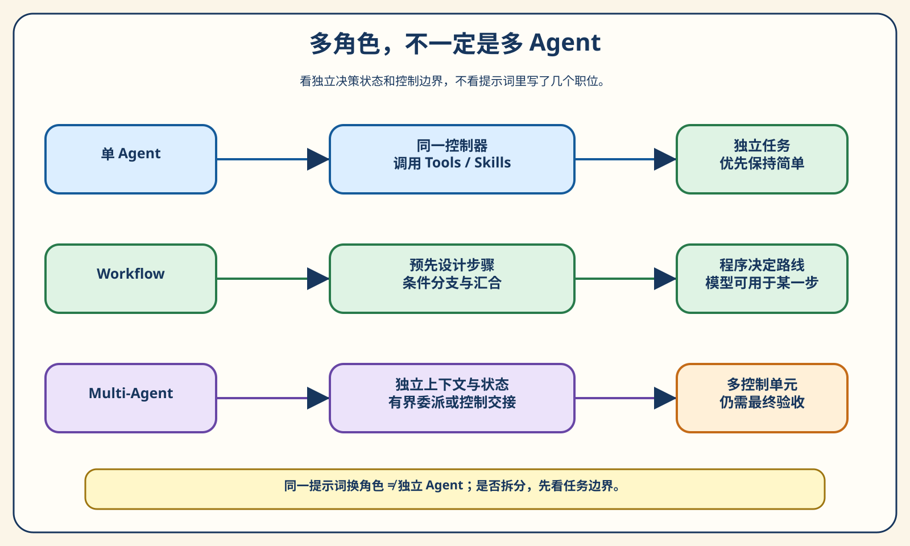
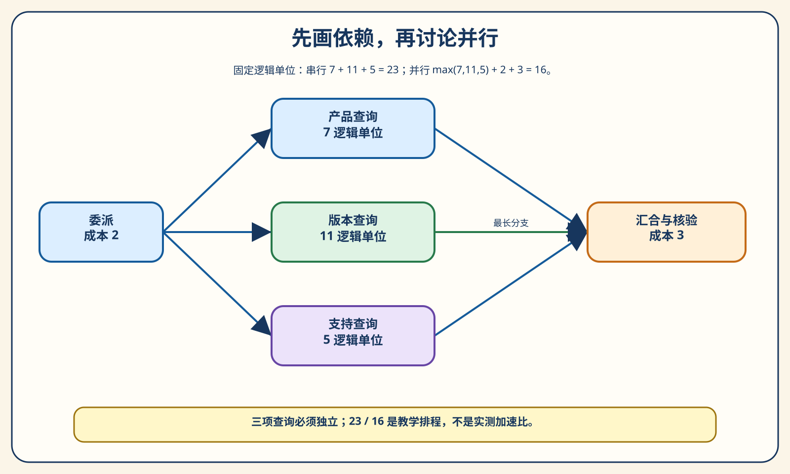
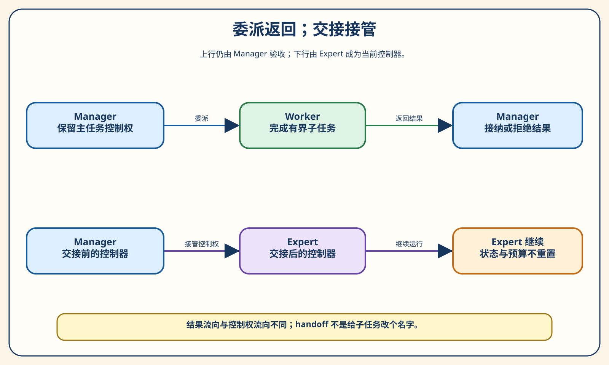
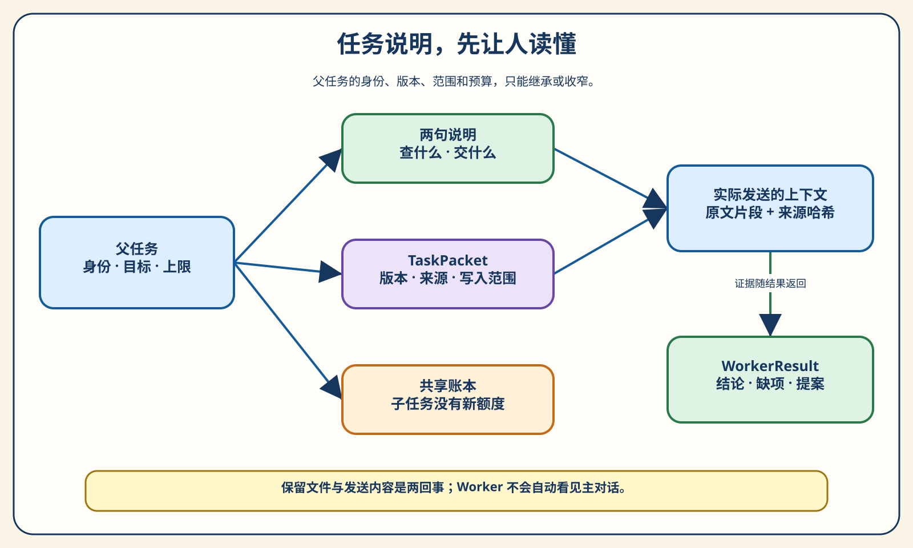
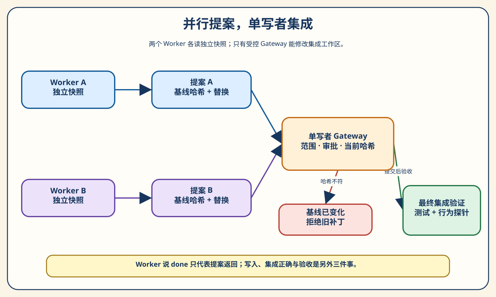
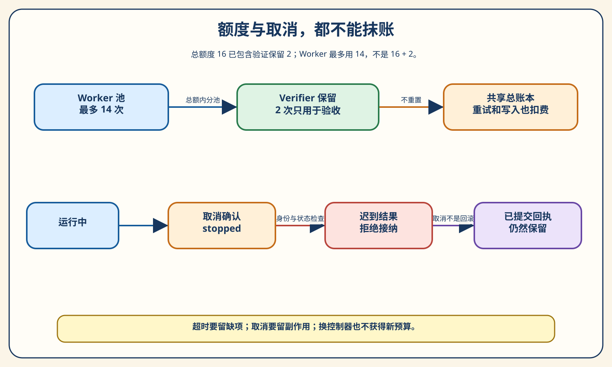
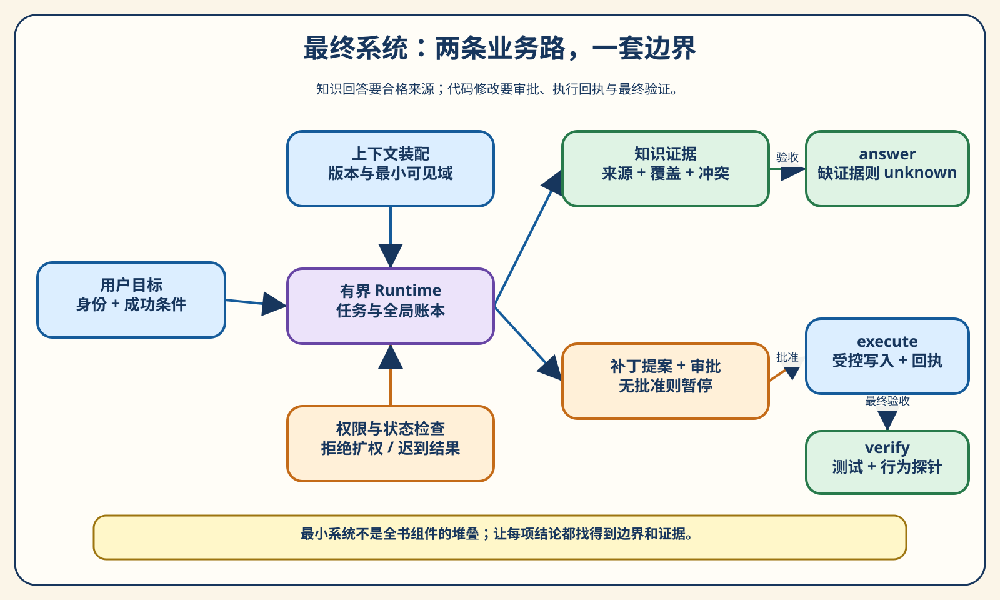

# 第 18 章 Multi-Agent 与最终系统：不是 Agent 越多越好

> 三个研究 Agent 都说：“星舟工作台支持团队共享，历史记录保留九十天。”主 Agent 看见三票一致，放心地写进答复。用户追问：“九十天从哪一页来的？”三个 Agent 都指向同一份文档。打开文档，只有共享功能的说明，没有历史记录保留期限。我们到底得到了三份证据，还是把一个缺口复述了三次？

阅读提示：先不要安装新的框架。看完第一幕，你应该能判断一个任务是否值得拆分；看完第二幕，你应该能说明谁拥有控制权、子任务究竟收到了什么；第三幕用故障把协作边界一项项照亮；第四幕运行一个最小最终系统，分别完成知识回答与受控代码修复。配套实验使用固定决策策略，不需要 API Key。完整代码、报告和答案都在 [chapter18 实验包](../chapter18/README.md) 中。

本章的短答案是：**协作的收益来自任务划分、上下文隔离和证据整合，不来自角色数量本身。** 多一个 Agent，就多一份局部状态、多一道交接，也可能多一次重复检索、一次权限误用或一次错误覆盖。只有当独立工作带来的收益超过这些成本，而且最终验收仍然可靠时，拆分才值得。

这是全书的最后一章。我们不把前面十七章的组件机械地拼成一张巨大架构图，而是选择三件读者能看懂、能运行、能检查的事：问答文档的协作查证、代码补丁的受控集成，以及两条业务路径的共同验收。所谓“最终系统”，首先意味着责任闭环，不意味着已经完成生产级平台。

## 第一幕：先证明需要协作

### 三票一致，为什么还可能没有答案

先把开场的问题拆成两项。用户想知道“能否共享”，还想知道“历史记录保留多久”。前者是一条功能事实，后者是一条保留政策。哪怕它们出现在同一句问话里，也不能用同一份证据自动回答。一本产品手册可能详细说明成员如何协作，却没有说明删除、归档和留存规则。知道一个问题的答案，不会顺便获得另一个问题的答案。

在本章的虚构问答资料中，`public-current` 明确说明当前版本支持工作区共享。我们让三个 Worker 各自读取这份文档，随后返回带引用的结论。三人的“支持共享”都成立；三人的材料里都没有保留期限。把它们合并后，系统应该得到“共享问题已查明，保留期限仍缺证据”，而不是“多数人同意，所以整句回答成立”。

这个区别可以用一张小纸条理解。假设你向三位同事询问会议室是否可预约，三人都转发了前台的同一条通知。通知能支持“可预约”。但如果你还问了“周末是否开放”，而通知没有写，转发人数并不能填补周末规则。三次转述可能增加你对“大家读到了同一条通知”的信心，却不会增加通知本身的内容。**人数是协作规模；来源是证据规模。它们不是同一个数。**

配套案例 `same-source-three-votes` 正是这个情形。它记录三次工具读取，但合格来源去重后只有一份。任务要求两项事实，证据覆盖一项，因此覆盖写成 `1/2`，最终状态是 `unknown`。这里的 unknown 不是把已知事实全部扔掉：共享结论仍保存在合格结论中，保留期限出现在缺项里。只要把缺项说清楚，系统依然能交付有用的部分结果。

多数投票并非永远没有价值。如果不同运行真的进行了独立推导，投票可能帮助发现偶发错误；如果多个来源具有独立获取过程，它们也可能相互印证。但是不能仅凭三个不同角色名，就假定错误彼此独立。同一模型、同一提示模板、同一检索结果，容易让不同 Worker 重复同一种遗漏。判断独立性，需要查看材料和过程，而不是把“专家甲”“专家乙”“审稿人”当作统计保证。

因此，主 Agent 汇总结果时，先做的事情应是把结论拆开，关联每条结论的来源，再检查哪些必答项尚未覆盖。润色、排序和表达一致性放在后面。一个写得优美的总答复，如果把“没有证据”改成“据多位专家确认”，反而破坏了协作中最有价值的东西：不同工作者看到了什么，以及他们没有看到什么。

读到这里，不妨回看开场那句话。真正的问题不是三个 Agent 都不聪明，而是系统把一致的表述误当成完整的证据。后面每一项设计，都围绕这个教训展开：让局部成果能够被接纳，但不能越过它实际支持的范围。

### 单 Agent、Workflow 与 Multi-Agent 的边界

我们先约定本章的用词。单 Agent 指一个当前决策控制器围绕目标运行，它可以调用很多工具，也可以按需要加载不同 Skill。Workflow 指程序预先安排主要步骤和分支，模型可以参与其中某一步。Multi-Agent 指多个有各自上下文与运行状态的决策单元，通过委派、交接或其他协议合作。这个约定用于分析系统责任，不用于给产品贴永久标签。

例如，一个 Coding Agent 先读代码，再运行测试，最后调用补丁工具，仍然可以是单 Agent。工具数量变多，不会自动产生第二个负责决策的主体。一个流程按“提取资料→生成草稿→检查格式”运行三次模型调用，也未必是三个 Agent；如果每一步的输入、顺序和停止条件都是程序固定的，它首先是一个含模型步骤的工作流。

反过来，多 Agent 也不要求多个模型供应商或多台机器。同一个模型可以支撑多个独立上下文中的 Worker；它们可以运行在同一个进程里。重要的不是模型权重是否不同，而是谁拿到哪项任务、看见哪份材料、保留哪份状态，以及返回结果后由谁决定下一步。物理部署和逻辑控制是两条不同的轴。

| 方式 | 谁决定主要路线 | 状态与上下文 | 适合先考虑的情形 | 额外责任 |
| --- | --- | --- | --- | --- |
| 单 Agent + Tools | 一个控制器 | 主任务的一份运行上下文 | 小范围查证、局部修复 | 工具执行与最终验收 |
| 单 Agent + Skills | 仍是同一个控制器 | 按需加入专业说明 | 操作相近、知识不同 | 控制加载范围与指令来源 |
| Workflow | 程序安排主要依赖 | 各步骤显式传递状态 | 路径稳定、验收清晰 | 分支、重试与汇合规则 |
| Multi-Agent | 多个有界决策单元协作 | 各自上下文与结果 | 可拆分探索、独立专业任务 | 委派、控制权、结果接纳与冲突 |

表中的方式不是互斥盒子。一个工作流节点可以调用 Agent；一个主 Agent 可以把子 Agent 当作工具；一个 Worker 也可以加载 Skill。复杂系统通常是组合体。因此，评价架构时更有用的问题是“这里增加了什么边界”，而不是“整个系统能否算某一种纯粹形态”。如果一个边界不存在，就不要靠命名把它想象出来。



图 18-1 从上到下读。第一行中，调用 Tools 或 Skills 后，仍由同一控制器继续决策。第二行强调预先安排的步骤。第三行出现独立工作单元，但最右边仍写着最终验收。多 Agent 没有消除验收，它只是把验收之前的工作分给了更多人。

这也解释了一个常见误区：在同一提示词中要求模型“先作为架构师，再作为开发者，最后作为测试专家”，可以帮助组织思考，但不等于真的创建了三份独立上下文。模型可以模拟不同视角，却仍共享同一段输入和一次运行状态。我们可以把这种方式称为角色化提示或分阶段推理，不能据此声称获得了独立复审。

LangChain 的官方多 Agent 文档也把 Skills、Subagents、Handoffs 和自定义 Workflow 分别说明，并提醒复杂任务不必然需要多 Agent。这里借用的是它对模式边界的说明，不借用文档示例中的调用次数作为我们的性能结论。[^langchain]

### 为什么应先保留一个足够好的单 Agent

用户只问“当前版本是否支持共享”时，答案就在一份允许访问的文档里。一个控制器读取文档，核对版本和引用，已经能够完成任务。此时再增加一位产品专家、一位文档专家和一位汇总专家，会让系统多出任务说明、结果传递和汇合步骤，却没有增加必要证据。简化不是放弃能力，而是避免为不存在的难度购买协调成本。

本章 `single-sufficient` 的轨迹很短：读取一次资料，返回一项结论，验收通过。工具调用为一，覆盖为 `1/1`。它的价值不在于一比三快多少，而在于给我们一个可靠起点：在增加协作之前，已经有一个能够完成这项小任务的系统。没有这个起点，就很容易把多 Agent 的热闹过程误认为解决了问题。

建立单 Agent 基线时，应先把它做得合理。工具名称是否清楚，材料是否按权限过滤，成功条件是否明确，失败结果是否回到模型，上下文里是否充满无关日志？如果这些基础问题没有处理，多 Agent 可能只是把同样的问题复制到多个上下文中。尤其不能故意给单 Agent 较差材料，再给多 Agent 更完整材料，然后把差异归功于协作。

当然，“足够好”不等于把所有任务都塞进一个无限增长的会话。随着任务扩大，主上下文可能积累大量搜索页、代码片段和测试日志。此时拆出一个只负责某项查证的 Worker，确实可能降低主上下文的噪声。不过我们仍要问：能否先通过更好的检索、摘要或按需 Skill 解决？独立上下文的收益，应与信息传递的损失一起考虑。

一个简单的决策顺序是：先确定验收条件，再看单控制器能否稳定做到；如果不能，定位具体瓶颈；最后只针对瓶颈增加边界。瓶颈可能是知识域太宽、探索分支太多、多个团队需要独立维护能力，也可能是写入冲突。前两种有时适合子任务并行，第三种适合能力模块化，第四种通常更需要单写者，而不是更多写入者。

这套顺序还让成本讨论更具体。问“多 Agent 会不会更贵”，答案太笼统。问“为了查询一项已有文档的事实，多出了几次决策、几次传递和几份上下文”，就能拿到可检查的数。若目标是缩短用户等待时间，关注关键路径；若目标是减少误答，关注证据覆盖与拒答；若目标是便于团队开发，关注接口稳定性。不同目标不应混成一个总分。

对刚开始做 Agent 的读者，我建议把第一版做到“一个人能解释清楚全部轨迹”。这不是规模上限，而是理解门槛。等到你能指出哪一段工作可以独立完成、哪一条状态必须共享，再拆分系统，新增复杂度就会有明确去处。我们后面的实验也是这样：先保留简单控制，再有意加入协作，并观察它新增的责任。

### 什么样的任务值得拆开

考虑一个稍大的问答：“当前团队版支持哪些共享能力，适用版本是什么，支持服务在什么时段？”如果三项事实分别来自产品资料和支持资料，它们可以先独立查证，再由主控制器合并。产品查证不必等待支持时段，支持查证也不必知道共享配置的每个细节。这里有一个天然的拆分点：每个子任务都有小而明确的输入、输出和证据来源。

判断能否拆分时，可以先写一句子任务的验收标准。如果你只能写“帮我想一想整体方案”，输出边界仍然模糊；如果能写“只从当前公共产品资料中查共享能力，返回原文位置和不能确认的项”，就接近可委派任务了。好的子任务不一定很小，但必须让接收者知道什么算完成，也让汇总者知道如何检查。

其次检查依赖。两个任务看起来名称不同，实际可能依赖同一个尚未确定的条件。例如先确认用户购买的是哪一版，再查那一版的共享限制，后者就不能随意提前开始。若先让两个 Worker 各猜一个版本，它们可能都按自己的假设完成，但汇合时得到两份不属于同一用户的答案。并行只是执行方式，不能替代输入条件。

再次检查写入。两个查证任务通常可以各自返回只读结果；两个代码修改任务如果编辑同一个文件，风险不同。即使目标不同，一位改路径处理，另一位改导入语句，它们可能基于同一份旧文件提交整份替换。这个问题不靠“请彼此配合”就能消失，需要独立快照、提案标识和受控集成。第三幕会把这个冲突真实跑出来。

最后检查汇合成本。子任务结果若只有三条事实，主控制器容易核验；若每个 Worker 返回几万字日志，主上下文反而会被放大。你为减轻一个上下文的负担，创建了三个新上下文，又把三个原始输出全部搬回来，这可能只是移动噪声。结果应尽量是可引用的结论、缺项和产物地址，而不是未经整理的完整过程。

Anthropic 的研究系统文章提供了一个实际的“主研究者分派并行探索”的例子，并强调子任务目标、输出格式、工具指导和清晰边界的重要性。我们从中得到的设计启发是明确分工，而不是把其特定研究场景的成绩外推到所有代码任务。[^anthropic]

可以把值得拆分的工作想成几张相互独立的工单，而不是一场角色扮演会议。每张工单都有交付物，能独立判定是否有用；工单之间有明确依赖；主任务保留必要的汇合权。若写不出这些信息，先不拆通常比先创建几个角色更容易找到真正的问题。

### 先画依赖，再手算一次排程

现在给三项独立查询指定固定时长：产品查询七个逻辑单位，版本查询十一个，支持查询五个。这里的“逻辑单位”只是教学中的工作长度，不是秒，也不是 Token。按顺序做完，长度为七加十一加五，得到二十三。假设允许同时执行，最慢的一项需要十一，其他两项可在此期间结束。

但协作不是免费开始，也不是免费汇合。我们再规定，委派需要两个单位，合并并检查结果需要三个单位。于是并行方案的长度是 `max(7,11,5)+2+3=16`。这一步手算告诉我们，节省的是原本可以重叠的工作长度，付出的是协调开销。不要把三个分支时间直接相加，再说并行系统用了二十八；那忽略了重叠。



图 18-2 左边是委派，中间三个分支没有互相指向的箭头，右边汇合。这些“没有箭头的地方”与画出来的箭头同样重要：它们表示我们假定三个查询不需要互相等待。若版本结果必须先确定产品查询条件，就应增加版本到产品的依赖边，关键路径随之改变，原来的十六不再适用。

还可以算协调开销的临界点。原始串行长度二十三，最长独立分支十一，因此最多有十二个单位可用于协调而不比串行更慢。委派与汇合之和小于十二时，这个理想排程更短；等于十二时相同；大于十二时反而更长。这个十二来自当前三项长度，不是所有多 Agent 系统的统一阈值。

真实系统还需要考虑资源约束。即使三个任务逻辑独立，供应商限流、数据库连接数和机器资源也可能使它们不能真正同时执行。若一条长分支重试两次，尾部等待会增加；若主 Agent 在每个阶段都重新读全部结果，汇合成本也不再固定。计算图给我们一个可解释的预期，测量才告诉我们实际发生了什么。

为了避免读者把代码运行时间误看成并行性能，本章程序没有假装启动三个真实模型并发请求。它按指定完成顺序推进固定策略，将七、十一、五和两项协调成本写进逻辑排程。你可以改变完成顺序，检查最终合格证据是否一致；但不能用这段程序的墙钟耗时声称模型加速了多少。改变事件到达顺序与测量真实并发，是两个不同实验。

关于更大规模的结论，可以阅读《Towards a Science of Scaling Agent Systems》的 v3。论文在受控配置中研究协调方式与任务结构的关系，报告协作收益并不统一。我们只据此强调“要用任务结构选择架构”，不借用其具体分数给本章固定策略实验背书。[^scaling]

### 第一次实验：把任务和证据先对齐

> **实验 18-1 ★★：简单任务与同目标协作对照**
> 观察一个单事实任务何时不必拆分，再用相同三项查询比较单控制器与三 Worker 的证据和协调步骤。只运行第一组时，输出是明确标记的部分报告。

```powershell
python -B -m chapter18.experiments --group 1 --output chapter18/.runs/group1-reader
```

第一组包含四个案例：`single-sufficient` 展示简单任务，`parallel-separated` 展示独立查询，`serial-dependency` 展示必须等待的条件，`duplicate-research` 展示两人重复读取同一事实。先打开输出中的 `group-1.json`，不要先找一个“总成功率”。我们要逐项看要求、材料和结果是否对应。

在 `parallel-separated` 内，另有 `single_controller_control`。这是公平比较的关键：两个系统都查询共享能力、产品版本和支持时段，都进行三次资料读取，最终得到相同的合格结论。单控制器使用四次决策，三个 Worker 合计使用六次决策。差出的两次来自每个 Worker 都要返回结果，而不是因为单控制器被少分配了问题。

```text
同目标控制：覆盖 3/3，工具调用 3，决策 4
三 Worker：覆盖 3/3，工具调用 3，决策 6
预设排程：串行 23，理想并行 16，单位 logical_not_seconds
```

决策次数的口径需要说明。这里一次读取提议和一次结果返回都算一步决策；单控制器三次读取后统一返回，合计四步。它不是供应商计费中的模型请求数，因为本实验决策由固定策略替身生成。六与四能帮助我们看见协调结构，不能直接换算费用，更不能证明某个模型在某种架构里更聪明。

再看依赖案例。程序先查版本，只有确认团队版后，才记录依赖已经满足，再启动共享查询。结果覆盖 `2/2`，但这个顺序不是主 Agent 的自由偏好，而是任务正确性需要。若为了并行把它去掉，系统可能更早返回一份答案，却回答了错误的版本。低延迟的错误结果并不是有效优化。

重复研究案例则保持 `1/1` 覆盖，同时发生两次相同读取，重复任务计数为一。这个一不是因为两个 Worker 恰好得到相同答案，而是它们的目标、输入引用和来源范围都相同。两位 Worker 分别查两份相互矛盾的资料，不能因此被标成重复；否则系统会把真正需要对照的证据当作冗余删掉。

运行命令时使用一个没有存在过的输出名称。实验不会覆盖旧目录，即使旧目录为空也拒绝。这个约束让你能够保留改动前后的证据，而不是不小心把第一次结果写没。完整二十案的现成摘要见 [规范报告](../chapter18/reports/reference-rc1-reviewed/summary.md)；第一组的局部输出只说明这四个案例，不伪装成全章已经跑完。

到这里，我们还没有引入复杂的协作 API，却已经得到三个设计判断：简单任务先保持简单，独立任务才可能重叠执行，依赖条件不能为速度让路。下面需要解决的问题才是：如果决定拆分，怎样把工单交给另一个运行单元，而不丢掉主任务的责任？

## 第二幕：交出工作，不交丢责任

### 从两句中文说明开始，而不是从 Schema 开始

假设主任务是回答团队版的共享问题。一个不好的委派是：“你是产品专家，请深入研究相关问题，尽可能全面地返回。”接收者不知道相关问题指什么，也不知道要查当前版还是历史版，不知道能否读取内部资料，更不知道“全面”要消耗多少时间。为了完成这个模糊目标，它可能不断扩大范围，最后把大量无关内容交回来。

我们先改成两句普通话：“只查当前公共问答中，团队版是否支持工作区共享。返回结论、原文位置以及无法确认的部分，不读取内部资料，不修改文件。”第一句给目标，第二句给交付和边界。即使暂时不用任何代码，人类接收者也能据此行动，汇总者也能据此验收。任务合同首先是沟通合同，随后才成为数据结构。

现在再把其中的信息分开。谁发来的任务，标为父任务；这一次查证，用独立任务编号；运行者是谁，用 Worker 标识；访问身份保持 public；目标版本为 v2；允许的来源是公共问答；输出必须覆盖共享事实。完整的 `TaskPacket` 还包含工具、写入范围、基线哈希与预算限制，但第一次阅读无需背下全部字段。每个字段存在，是为了回答某种具体失败，而不是让接口显得正式。

举例说，任务编号帮助主系统把迟到结果归到正确工单；版本帮助它拒绝用旧文档回答当前问题；来源范围帮助它阻止 Worker 自行读取内部答案；输出要求帮助它区分“查到共享”与“整份问题都查完”。如果删掉一个字段，就应能指出哪类检查失去依据。这样的结构比一份包含几十个漂亮字段、却没有任何执行检查的 Schema 更有意义。

任务合同也需要描述“不知道怎么办”。查不到时，返回缺项和原因，不要补写猜测；遇到受限资料，返回拒绝状态，不要借别人的账号；工具暂时失败，可以在共享预算内有限重试；无法完成时，不要求子任务假装成功。对 Worker 来说，准确报告缺项是一种有效交付，而不是没有达到“专家”人设。

配套代码的根任务和子任务都使用同一种合同。父子关系由 `parent_id` 和深度表述，子任务从父任务复制必要条件，再收窄来源与输出要求。这种设计让我们不必为“产品专家”另造一种特殊运行器，也使检查集中在同一个地方。角色描述可以变化，范围与身份不能因此变成一套新的规则。

还有一条常被遗漏的任务说明：是否允许继续委派。若每个 Worker 都可以无限创建更多 Worker，原本的小问题可能变成一棵不断增长的树。我们的默认深度上限是二，同一时刻最多三个在途子任务，主任务不占这三个名额。它们是教学中的确定上限，不是某个产品的默认值。限制的目的，是让这次任务的最大规模可预期。

读者可以先拿纸写一张两句工单，再对照 [数据合同](../chapter18/contracts.py)。若你发现某个字段无法由工单中的真实需求解释，可能是字段过早；若工单里有重要边界却没有执行入口，可能是合同还不完整。两边互相检查，比先复制一份框架模板更容易理解系统在保护什么。

### 委派与 handoff：究竟谁在接着做决定

在委派模式里，主控制器说：“帮我查共享能力，查完回来。”子任务完成后返回结果，主控制器继续决定要不要采用、是否补查、怎样组织最终答复。这与请同事核对一张表很像：核对者承担局部工作，但原工单负责人没有变。子任务给出的结论只是验收输入，不是主任务必须遵从的命令。

Handoff 的含义不同。主控制器确认该由某位专门处理者继续面向用户工作，然后把当前控制权交过去。接收者不只是返回一条建议，而是成为当前继续决定下一步的运行单元。例如一个通用入口将退款请求转交给退款处理者，后者继续询问必要信息。这里发生的是控制路由，不只是查询路由。



图 18-3 的上半行中，右边又回到 Manager；下半行的右边仍是 Expert。两行都可以传递资料，但右边的“下一步由谁决定”不同。这个区别会影响输出权、审批等待、上下文传递和状态恢复。如果所有结果最终都要主控制器逐项验收，就不该因为用了 handoff 一词，而让子任务获得未经授权的完成权。

| 问题 | 有界委派 | 控制交接 handoff |
| --- | --- | --- |
| 子单元做什么 | 完成一项局部工单并返回 | 接管当前后续决策 |
| 谁拥有主任务控制权 | 原主控制器 | 已被选中的接收者 |
| 谁合并局部成果 | 通常由主控制器 | 由当前控制路径决定 |
| 是否自动获得更大权限 | 不获得 | 也不获得 |
| 是否重置全局预算 | 不重置 | 也不重置 |
| 典型验收重点 | 结果身份、覆盖和引用 | 控制者、交接次数与继续运行条件 |

OpenAI Agents SDK 的编排文档用 `Agent.as_tool()` 与 handoffs 区分这两种责任：前者保留 Manager 的控制，后者让专门 Agent 成为当前活动 Agent。官方迁移检查表也明确检查这项所有权区别。我们采用的是这个概念映射，本章本地 Runtime 没有调用 SDK，也没有宣称与它逐字段兼容。[^openai]

尤其注意，交接不等于恢复整个世界的初始状态。原任务的用户身份没有变化，已经消耗的额度没有返还，已经写入的文件不会回到修改前。只有控制者发生改变。若接收者拿到一份“新会话”就重新获得完整额度，或者因为换了角色便能读取内部资料，那么架构把身份与预算错误地绑定到了角色，而不是绑定到任务。

我们的小实验允许你直接观察 `controller`。`delegation-return` 在 Worker 返回后仍是 manager；`handoff-transfer` 则由当前 manager 先交接给尚未结束的 expert，随后 expert 才执行读取与结果决策。轨迹记录每次决策时的控制者，旧 manager 不能自行发起交接把控制权抢回。委派 Worker 仍可以执行自己的局部工具步骤，这与有权改变整个运行的控制者不是一回事。它们查的是同一项资料，所以答案可能相同。不要为了找区别去比较文字语气，区别写在运行状态里。一个系统若只有两段不同风格的答复，却无法指出控制权何时改变，就没有充分证据说明它真的实现了 handoff。

真实产品中的交接可能携带会话过滤、历史裁剪、专门工具和新的指令，但这些附加机制不能代替最基本的控制语义。理解了这个小区别，再看各框架的命名就容易很多：先问当前谁负责下一步，再看数据如何传递，最后才对照 API 名称。名称相近而责任不同的组件，不能机械替换。

### 子任务不会自动知道主对话里的前提

用户可能早就说过“只讨论当前团队版，不看旧版本”。主 Agent 在一段长会话后把任务拆出去，只写“查共享能力”。子任务若没有拿到版本条件，可能选到历史文档；如果没有拿到访问身份，可能引用内部文档；如果不知道最终输出需要保留期限，可能只完成共享事实。问题不在于子任务不听话，而在于它从未收到那些前提。

不要用“主 Agent 已经知道”推断“子 Agent 也知道”。独立上下文正是隔离噪声的来源，也必然让部分信息不再自动可见。系统必须决定哪些内容进入子任务，哪些只留在主任务中。发送整个主会话可以避免某些缺项，却也会把无关日志、过时结论、敏感内容和多余指令一并复制。好上下文不是越完整越好，而是对这张工单足够、相关且允许。

本章 `assemble_context` 先按身份、目标版本、来源范围和资料资格筛选，再抽取与所需事实相关的原文片段。它保留完整来源文件的哈希，同时另算发送片段的摘要。两种摘要回答不同问题：完整文件摘要说明引用来自哪个版本的文件；发送摘要说明这次 Worker 实际得到哪份内容。二者不应因为都叫 digest 而混用。



图 18-4 左边是父任务，中间把目标、范围与额度拆开，右上才是实际发送内容，右下是返回结果。沿箭头读一次，你会发现预算不是模型看见一串数字就自动遵守的东西，它还需要外围账本。类似地，“不读内部文档”也不应只出现在任务说明里，而应成为工具入口的检查。

我们把 `ContextSnapshot` 放入 Worker 的观察对象，确保上下文不是只为报告展示而组装的一份旁观材料。固定策略没有语言理解能力，它不会真正阅读并推理这段文本；它接收到的是结构化观察，结论仍来自实际工具返回。这个安排验证了“传递了什么”，没有验证模型“理解了多少”。把两件事分开，才能在未来接入真实模型时定位错误层次。

`context-not-forwarded` 有意去掉输入引用。运行者仍可看到资料存在，但工具无法满足这张工单的指定事实输入，返回缺项。最终覆盖 `0/1`、状态 unknown。这个案例证明输入条件确实进入工具合同，而不是每个 Worker 都可以绕过工单、读取任意夹具中的现成答案。

还有一种更隐蔽的问题发生在压缩之后。主会话把“只在公共范围回答”压成“已确认用户需求”，子任务获得的摘要就失去了访问前提。可以把任务硬边界保存在结构化合同中，把长历史摘要作为辅助材料，避免关键权限仅依赖自然语言压缩。第六章讲的文件化状态在这里依然有用，但不是把所有文件都喂给每个 Worker。

在排查上下文失败时，先比较输入，而不是立即换模型。看根任务要求、子任务输入引用、发送片段和工具返回是否连成一条链。如果链在发送前已经断了，更强的模型可能用常识猜出一个答案，却不能修复本来不存在的授权或证据。系统可靠性首先需要把已知前提准确送到正确的位置。

### 权限继承：专业角色不是另一张通行证

假设一个公共用户询问内部配额。主 Agent 创建“内部政策专家”，把它的身份改成 staff，并允许访问受限文档。角色描述看起来合理，但访问身份已经被提升。用户没有授权这种提升；主任务也没有这项能力。一个能够随意改身份的任务管理器，会把权限系统变成提示词中的装饰。

本章的子任务验证遵循收窄原则。父任务允许的来源、工具和写入范围，构成子任务的上界；子任务可以只选其中一部分，不能添加父任务没有的能力。身份和目标版本必须保持一致，深度与限制不能扩张。你可以派一位更擅长阅读的 Worker，却不能因此给它另一位用户的数据。

这种原则听起来像“不要越权”，实现时却需要多个检查位置。创建子任务时检查合同，工具调用时检查实际请求，写入网关再检查目标路径。只在派工时检查一次，不足以约束随后每次工具参数；只在工具末尾隐藏输出，也不能阻止已经发生的读取。边界应靠外部程序强制，不靠模型自述自己会遵守。

`scope-escalation` 在创建子任务时偷偷增加 `restricted-current` 来源。Runtime 拒绝这个提议，记录策略拒绝，实际工具调用为零，任务最终 blocked。零次调用有明确含义：扩权在执行前被拦住，不是读取秘密之后才把引用删掉。另一个受限问答案例会在工具入口得到拒绝，第三幕和第四幕会分别检查两层边界。

代码任务的范围同样需要精确。我们允许修改指定 `src/` 文件，不允许改测试，也不允许工作区外写入。路径不能仅检查字符串里是否含“src”，因为 `src/../tests` 仍可能越过边界；也不能忽视符号链接和 Windows 的重解析点。本地路径守卫检查相对语法、实际祖先路径和允许前缀，防止常见绕过。

不过，这不是操作系统沙箱。路径检查只是这个教学进程内的策略；任意不可信 Python 程序仍可能通过其他系统接口读写外部资源。因此配套验证只执行作者提供的可信夹具。若未来要让真实模型运行任意仓库代码，需要另一个执行隔离层。承认这一点，不会削弱路径守卫的教学价值，只会避免读者把局部检查误当成完整安全保证。

权限继承还涉及数据出口。一个子任务拿到受限资料后，不能把原文放进主任务可见结果，再说“只是为了审稿”。输出必须遵守最终接收者的可见范围。在本章中，如果来源在 Worker 返回后被撤销访问，验收重新检查资格，并从导出结果和上下文片段中移除相应引用。已经发送过的原始摘要保持原值，另标明内容经过脱敏，不把脱敏内容伪装成原始输入。

专业化解决“谁擅长做”，授权解决“谁被允许做”。这两句话应当始终分开。很多多 Agent 方案只写前一句，结果角色越专业，权限越宽；更稳妥的设计让专业任务变窄，让访问身份继承，让真正的权限提升回到明确的人类授权或组织策略。

### 接纳结果之前，先核对是哪张工单的哪次运行

一个 Worker 返回“完成了”，主系统至少要知道：它属于哪张任务，来自哪个 Worker，是本次尝试还是上一次重试，主任务现在是否仍愿意接收结果。少了其中任何一项，迟到结果、重复返回和错投结果都可能被当成新的有效进展。

想象你把同一项查证重试了一次。第一次卡住，第二次已经返回。过了一会儿，第一次也回来了。如果系统只按 Worker 名字认人，两份结果可能同时进入汇总，或者旧结果覆盖新结果。我们使用任务、尝试和 Worker 三项身份共同检查，并对已经接纳的结果拒绝重复。尝试编号不是“为了日志漂亮”，而是区别运行事实的必要信息。

三项字段看起来正确，还不够：A 正在执行时，不能把另一张真实工单 B 的完整身份填进去，冒充 B 已返回。`step(A)` 先把结果身份绑定到正在执行的 A，再进入通用接纳检查；错投只记在 A 的拒绝轨迹里，不结束 B。否则系统检查的只是“这张工单存在”，而不是“这份结果确实由正在运行的工单产生”。

`WorkerResult` 中的 done 表示这次子任务提出了结果；它不是整个系统的 verified。知识结果需要检查事实和来源，代码结果需要检查提案、范围、审批、真实执行与验证。主任务可以接纳一个结果的身份，同时认为它的证据不够；也可以保留一个局部有效事实，而把其他项标为 missing。这两层判断不能压成一个布尔值。

还有一项容易被信任过头的字段是操作计数。如果 Worker 在结果里自报“调用两次工具”，主系统不能直接拿来扣费或生成总报告。Runtime 记录实际提议、工具返回和动作提交，再以真实运行事实填充计数。否则一个异常 Worker 可以少报消耗，一个报告程序也可能把重试隐藏掉。结果内容由 Worker 提交，计量事实由外围记录。

对于补丁，工具生成提案也不等于提案已被接纳。我们在业务路径中只提交被有效 WorkerResult 引用的 `patch_ids`。如果工具曾生成提案，但 Worker 的结果被取消或未被接纳，它不应通过“反正提案在字典里”进入写入网关。这里又有两个不同的事件：产物存在，以及主任务正式接受它作为候选交付。

代码上可以把这个边界概括为一个小集合过滤，而不必让正文展示整个运行器：

```python
accepted = {patch_id for result in state.results for patch_id in result.patch_ids}
for proposal in proposals.values():
    if proposal.proposal_id in accepted:
        gateway.apply(proposal, approved=approved)
```

这个片段仍不是完整授权。进入集合只能说明它属于接纳的结果，网关还要检查写入范围、当前基线、动作身份和审批。层层检查并非重复劳动，因为每层回答的问题不同。结果接纳保证“这是我们等的那份工作”；网关保证“这份工作现在可以造成这个副作用”；Verifier 保证“副作用后的状态满足成功条件”。

如果需要审计，沿着任务编号就能找到其发送上下文、每次工具尝试、返回结果和接纳决定。轨迹既帮助调试，也帮助说明“不采用这份结果”的原因。对读者来说，开始能复述这几步，比记住 Event、Receipt 和 Proposal 的所有字段更重要；完整结构留在实验包里随时查看。

### 第二次实验：看输入和控制权，不只看回答

> **实验 18-2 ★★：委派、交接、缺上下文与扩权**
> 使用同一公共事实，观察控制者变化；随后移除输入条件、扩大子任务范围，确认两种失败不会被好听的结果遮住。

```powershell
python -B -m chapter18.experiments --group 2 --output chapter18/.runs/group2-reader
```

先看委派返回和控制交接。两者都得到共享事实，但最终 controller 分别为 manager 与 expert。这里我们有意让业务结论相同，便于读者把注意力放在运行语义上。若结果文字变化太多，反而容易把“专家回答得更详细”错看成 handoff 的定义。

```text
delegation-return      answer   controller=manager
handoff-transfer       answer   controller=expert
context-not-forwarded  unknown  coverage=0/1
scope-escalation       blocked  tool_calls=0
```

再看缺上下文。找到 `input_proof` 中对应 expert 的任务和上下文记录，确认输入引用缺失；然后在结果中找到 missing。请不要把这份失败简单解释为“检索不好”。我们故意断开的，是工单输入进入执行合同的边，而不是换了一个较弱的检索器。定位到正确层，修复才不会去优化错误的组件。

最后看扩权。对照根任务与子任务的允许来源，新增受限来源使验证拒绝发生在工具之前。轨迹中的 policy_refused 是这项判断的证据。任务状态 blocked 与 unknown 也不同：unknown 表示必要事实尚未确认，blocked 表示请求越过了允许边界。把两者都显示成“暂时没答案”，会让用户和运维人员失去重要信息。

读者还可以观察每份 `context_digests`。小片段和来源文件不是同一份对象，其摘要不同并不意味着错误。只有当发送片段摘要无法对应记录内容、来源摘要无法对应实际文件，或者引用内容不在合格来源里，才是证据链破损。本章报告校验器会检查这些关系，而不是只验证 JSON 能被解析。

这组实验没有模拟客服系统的全部对话，也没有实现产品 SDK 的全部交接细节。它把最小差异压到可观察状态上：保留控制还是接管控制，收到条件还是缺少条件，继承范围还是请求扩张。读懂这四项，你就能审视一个实际产品的多 Agent 功能，而不只问它能创建多少个角色。

走到这一步，系统已经知道怎样交出去、怎样收回来。下一幕会证明，这还不够：正确的派工也可能产生重复调查、相互矛盾的证据和无法直接合并的代码。协作的难点不只在“启动别人”，更在“别人都回来了以后，该信什么、该写什么、该停止什么”。

## 第三幕：让失败照出协作边界

### 重复劳动要去重，独立证据不能误删

主控制器派两位 Worker 查共享功能，名字分别叫产品研究员和文档研究员。两张工单的必答项相同，输入引用相同，允许来源也相同。两人实际打开同一份文档，返回同一条合格事实。结果当然可以正确，但系统多做了一次相同工作。这里的问题是效率，不是事实真伪。

一种直觉做法是按返回文本去重。这样做太晚，也太粗。两段措辞不同的文字可能来自同一份材料；两段相同文字也可能分别来自两份独立公告。如果只用文本相似度，系统既可能保留无意义重复，也可能删掉重要交叉核验。重复任务与重复证据，需要分别定义。

本章的任务重复检查使用目标要求、输入引用与来源范围构成指纹。代码任务还加入写入目标。这个选择不是通用语义相似算法，只是夹具范围内可检查的合同等价。它能够分辨“同一项要求查同一份资料”与“同一项要求对照两份资料”。后者即使最终结论相同，也不该直接标成重复任务。

来源去重则看合格来源身份。三个 Worker 引用 `public-current`，只算一个来源；一位 Worker 同时引用两份合格独立文档，可以算两个。来源身份还需要版本与文件摘要，防止同一个名称对应已经变化的内容。数目本身不说明证据质量，但把同一来源重复算作三份会造成明显误导。

为什么不把重复任务直接禁止？因为独立复核有时故意让第二个人检查同一材料，例如查一个高风险结论的遗漏或代码变更的错误。这样的重复可以有目的，只是要公开其成本和独立性边界。审稿者看到作者同一份材料，并不自动获得新的外部来源；但如果它采用另一种检查方法，仍可能发现第一位审稿者没发现的错误。

因此报告保留重复计数，而不把它直接等同于系统失败。`duplicate-research` 最终 answer，重复任务为一；`same-source-three-votes` 则因为必答项缺失而 unknown。这两个结论可以同时成立：工作重复了，已有事实仍有效；工作重复了，未覆盖的问题依然未覆盖。把质量和效率分别报告，读者才能作出合理取舍。

如果未来在真实系统里增加查重，可以先在派工前比较已有工单，再把“有意复核”的理由单独记录。不要为了减少重复而取消所有交叉检查，也不要为了显得慎重而对每个小问题都启动三人投票。好的协作不是没有重复，而是知道哪里值得重复、重复增加了什么检查，以及它没有增加什么证据。

### 两份都有效的来源冲突，不能靠投票消失

前面的旧文档可以按版本过滤。但现在我们把情况变难：政策资料甲说当前历史记录保留三十天，政策资料乙说当前保留九十天。两份资料都标为 v2，都允许公共身份访问，也都被资料治理标为合格。它们不是一个当前版本与一个过期版本；它们在同一适用范围内给出不同事实。

此时不能说“选更新那份”而不说明哪份更新，也不能按返回速度选择先到的结果。我们的夹具没有提供可判定权威次序的元数据，所以系统应该保留冲突。若主 Agent 只为了凑出一条答案而任选一个数，它其实替资料治理做了没有依据的裁决。

`source-version-conflict` 派两位 Worker 分别读取甲乙。工具调用为二，合格来源为二，返回候选值为三十天和九十天。最终状态 conflict，覆盖为 `0/1`。这里的零并不表示完全没有资料，而表示“保留期限这一项尚未得到无歧义的验收结论”。这一口径比“检索到了两份文档，所以覆盖百分之百”更符合用户真正的问题。

一个合适的对外表达可以是：“当前可见的两份 v2 公共政策对保留期限不一致，分别写三十天与九十天，暂不能确认统一期限。”接着列出可访问引用，并指出需要资料所有者确认适用范围。它比简单写“无法回答”更有用，也比偷偷选一个数更诚实。

如果后来资料治理补充“甲是试用版、乙是正式版”，冲突可能变成范围区别；如果补充“乙已经替代甲”，冲突可能变成版本资格变化。系统就能按新条件重新判定。但这些额外事实必须来自可验证的资料或授权规则，不能由 Worker 为了消除 conflict 现编一个解释。冲突是新任务的入口，不是文本润色的问题。

也不要把“多数来源写九十天”当作天然权威。如果九十天的三份文档只是互相复制同一份错误公告，它们依然可能共享错误。对于业务政策，发布主体、适用条件和生效关系通常比票数更关键。来源去重只是最低一步，不能代替内容治理和权威规则。

本章知识验证器使用明确的事实索引，逐项检查候选值、原文引用、身份和版本。这是为了让冲突判定可复算，不是一个能够理解任意自然语言的裁判。它不会自动判断两个复杂段落在法律或业务意义上是否矛盾。读者扩展到真实知识库时，需要保留这种“证据有资格”和“证据是否支持结论”的分层，再选择适合领域的验证办法。

这个失败样本最值得记住的一点是：所有 Worker 都可以认真完成自己的工作，主任务仍可能没有可交付的唯一答案。局部完成与全局完成不相等。多 Agent 系统必须允许出现这种结局，否则所有协作最终都会被强迫包装成一种假成功。

### 代码协作先隔离快照，再讨论补丁

现在切换到第二个场景：修复 Markdown 链接检查器。它在嵌套文档里处理相对路径时，只返回原始目标，没有相对于文档所在目录拼接。一个测试失败，其他旧行为仍然正确。我们希望修复嵌套相对链接，同时保护外部链接、根路径和空目标这些已有行为。

让两位 Worker 同时编辑一份真实文件，看起来最省事，却使状态变得难以解释。甲刚读到旧代码，乙已经修改并保存；甲再保存自己的整份文件，就可能覆盖乙。随后测试通过，也不一定说明两人的工作都保留，因为甲的替换可能悄悄删掉了乙的另一项修复。没有明确基线，成功与覆盖可能同时发生。

本章采取更容易解释的方式：每位 Worker 从同一个已知基线得到独立工作区。它可以读取、分析并生成补丁提案，但不能直接修改集成工作区。这样，Worker 的局部产物不会因为另一位 Worker 的操作而变化；主系统能知道每份提案是在什么内容上形成的。

补丁提案至少说明三件事：目标文件、它期待的修改前摘要，以及替换内容。修改前摘要就像“这份申请基于哪张底稿”。集成网关收到它时，重新计算当前文件摘要；若底稿已经变化，不能把旧申请直接当成新状态上的有效修改。摘要不是修复正确性的证明，它只证明基线匹配。



图 18-5 左边两个 Worker 各有快照，中间各有提案，右边只有一个 Gateway。从 Gateway 分出两条路：基线变化时拒绝旧补丁，满足条件时提交后再做最终验证。请注意图里没有 Worker 直接连到最终验证的箭头，更没有 Worker 直接连到“整个系统完成”的箭头。

代码中 `snapshot_workspace` 复制作者提供的小仓库，`propose_patch` 在允许范围内构造提案，根任务保存各文件的基线摘要。读者可以打开运行工作区，直接比较原始、子任务和集成文件。这里的 diff 来自实际文件修改，不是一段模拟“修复成功”的文本。

独立快照也有成本。文件复制、依赖准备与结果集成都需要资源；对于大型仓库，可以采用受管理的工作树、共享只读依赖或其他隔离机制。本章不实现这些基础设施，因为当前教学问题只需要把局部读取与共享写入分开。理解边界之后，再选择更高效的存储方式，不会改变提案必须绑定基线这件事。

还有一个限制必须早说：不同文件不等于语义独立。甲改路径函数，乙改全局策略，两份补丁没有文本冲突，却可能组合出不兼容行为。因此我们分两步验收：提交前检查是否适用当前文件，提交后检查最终集成状态是否满足任务。快照隔离解决覆盖可解释性，最终测试解决组合后的行为正确性，二者不能互相替代。

### 单写者并不是“谁最后回来就听谁的”

设甲乙都从相同旧版本修改 `src/linkcheck.py`。甲的提案先提交，当前文件摘要发生变化。乙随后返回自己的整份替换，它引用的修改前摘要仍是旧值。若网关直接采用乙，甲的内容就会被后写覆盖。这个风险与两人是否使用同一模型无关，甚至两份提案都可能单独正确。

`stale-patch` 有意制造这种情况。网关实际提交甲的修复，保留执行回执；再检查乙时发现旧基线，拒绝原因是 stale_patch。最终状态 conflict，而不是 verified。读者打开集成工作区能看到甲的修改仍在，乙没有把它盖掉。报告保留一份已提交回执和一次旧补丁拒绝，忠实描述部分副作用与未完成状态。

为了让“若没有边界会怎样”也可观察，案例提供一个内存字典控制组：先放甲的替换，再放乙的替换，第二次赋值覆盖第一次。这个控制组不关闭真实写入网关，也不在磁盘上实施危险后写；它只把覆盖语义用最小示例表现出来。理论反例和真实安全执行，各自有清楚的范围。

单写者意味着某个受控位置负责检查并实施共享副作用，不意味着它随便替参与者裁决语义冲突。遇到旧补丁时，可能的后续办法是让乙基于新快照重做，或者由主控制器人工审查合并。本章选择明确拒绝，因为我们没有实现通用三方合并。不能在代码只做摘要比较时，声称它能自动解决任意并行代码冲突。

动作身份同样重要。`proposal_id` 标识提案，`action_id` 标识这项副作用。再次提交同一项已经执行的动作，应回放原执行回执，不再写一次；若同一身份对应不同内容，应拒绝身份混用。这样审批恢复或调用方重复发送，不会简单变成第二次修改。重复请求与新请求必须靠稳定身份区分，不能靠“文字看起来差不多”。

网关还检查主任务授权的写入范围。即便某份补丁能通过测试，也不能修改受保护测试或其他范围外文件。更严格地说，通过测试是结果维度，是否允许修改是安全维度。我们不允许“测试变绿”抵消越界动作。这与第十三章的安全硬门禁是同一原则，只是这里把它放在协作集成边界上。

实际写入会消耗共享工具额度，并产生修改前后摘要和执行标记。若额度不足，不能先写再说超额；若审批没有通过，不能把替换内容偷偷保存到目标文件里再等待批准。提案可以存在，执行必须受控。用户取消之后，已经提交的回执仍会保留，下一节会说明为什么不能把它删掉。

这套最小网关让我们能逐次回答四个问题：这是什么动作，谁允许它，适用于哪份当前内容，副作用是否确实发生。它还没有证明修复符合业务要求，所以输出“executed”之后，主系统必须继续走向最终验证，而不是把执行回执当成完成通知。

### 一次最终验证，检查的是组合后的状态

看另一个案例：甲修复 `src/linkcheck.py`，乙在 `src/policy.py` 生成一项独立提案。两人引用的各自文件基线都匹配，写入目标也不同，网关可以依次提交。完成两次受控提交后，系统再运行一次最终集成验证。验证针对的是此时共同组成的工作区，不是某个 Worker 的局部快照。

为什么不每来一个补丁就立刻把整组测试跑完？真实系统可以选择这样做，但在本章的任务合同中，我们只预留两次最终验证调用：一次可信测试运行，一次独立行为探针。如果每份补丁都耗两次，两份补丁就用掉四次，违反了既定额度。我们把提交和最终验证分开，让小合同仍然自洽。

可信测试共有四项。基线通过三项，嵌套相对链接那项失败；修复后四项通过。行为探针另外检查一个具体嵌套路径输出和外部链接行为。测试与探针不由 Worker 自报结果，都是外围程序真实执行。若测试被改动，或出现额外测试文件，验证会拒绝，而不是让修改后的“更容易通过”测试给自己打分。

> **实验 18-3 ★★★：证据冲突与补丁冲突**
> 先看两份合格资料如何产生 conflict，再看旧基线补丁被拒绝，最后看不同文件提案经过实际集成验证。

```powershell
python -B -m chapter18.experiments --group 3 --output chapter18/.runs/group3-reader
```

这组结果的关键不是简单排一个最好案例。资料冲突是 conflict；三票同源缺项是 unknown；旧补丁是 conflict；不同文件补丁在验收后是 verified。四个状态都来自条件检查。尤其不能把资料 conflict 误当成模型失败，然后用更高温度重复生成，直到某次碰巧只说一个期限。

```text
source-version-conflict  conflict  合格来源 2，覆盖 0/1
same-source-three-votes  unknown   合格来源 1，覆盖 1/2
stale-patch              conflict  旧补丁拒绝 1，工具调用 5
disjoint-patches         verified  工具调用 8，其中验证 2
```

八次调用可以展开：两位 Worker 各读取一次、提案一次，共四次；网关提交两次；测试与行为探针各一次，共两次。五次的旧补丁案例则是四次读取和提案，加甲的一次提交；乙被基线检查拒绝，没有第二次写入，也没有被宣布最终验证通过。把拒绝事件与实际调用分别记录，算术才能对得上。

这个实验也告诉我们，安全系统有时会拒绝一份本来可能有用的工作。乙的旧补丁可以人工重做或合并，但不能未经检查直接落盘。拒绝减少了静默损坏，增加了显式后续工作。评价系统时应同时报告这一成本，不把“没有拒绝”当作更流畅、更可靠的同义词。

### 预算是一本共享账，不是每个人一张新卡

主任务给整个运行十六次工具额度，其中两次只留给最终验证。因此所有 Worker 能用的总额是十四，不是每位 Worker 十四，也不是十六再加两次。创建第三位 Worker，并不会凭空多出一笔余额。重试、读取、生成提案和真实写入，都必须从相应共享池扣除。

这个原则可以用旅行预算理解。你带两位同事出差，共有十六份费用，其中两份留作返程。让三个人分别订票，不会让每人都获得十六份预算；换一位负责人，也不能恢复已花金额。Agent 系统里的委派、handoff 和重试同样不能隐含重新发卡。



图 18-6 上半部分把 Worker 池与验证保留放在总额内，下半部分描述取消之后的结果处理。两种机制共同保护一件事：状态改变不能抹掉已经发生的运行事实。你可以停止后续工作，不能把已经消费的额度改写成没消费，也不能把已执行回执删掉来制造“完全没动过”。

预算检查要发生在尝试之前。若暂时错误允许再试一次，第二次也要先检查剩余额度；失败的尝试仍消耗一次实际调用。若只在成功返回时扣费，系统就可以无限失败而“预算还没用”。同理，审批拒绝或工具在调用前被策略拦住，和实际发起工具后返回错误，是不同事实，不应机械地都按同一种调用计数。

`BudgetLedger` 将 worker_used 与 verifier_used 分开，同时保证二者的总使用量不超过主任务上限。两次验证保留不能被 Worker 借走，Worker 的剩余额度也不会让验证阶段突破自己的保留上限。这样的分池限制简单而明确；真实系统可以设计更灵活的额度调度，但必须公开调度规则，而不是在某一分支耗尽后悄悄提高上限。

子任务还可以进一步收紧额度。我们把它定义为这个子任务及其后代共同可消费的 Worker 额度，工具重试和网关的真实提交也计入，不因再委派而重置。例如子任务总额为二、验证保留也为二，可用于 Worker 行动的额度就是零：读取前便停止，根账本不扣一笔根本没有执行的调用。子任务的保留字段用于收窄行动上界，并不会另外创建两次验证名额；最终验证仍由根任务共享池支付。

为了把耗尽看得更清楚，`global-budget-exhausted` 使用总额八、验证保留二。三位 Worker 交错请求资料，六次实际调用后，Worker 池耗尽；下一次请求不执行，状态 stopped，剩余总额仍是二。这二不是“系统应该继续查”的闲置余额，而是用途受限的保留。报告若只写“还有二次”，容易让读者误解，所以同时保留总上限和验证调用数。

默认每位 Worker 最多四次决策，暂时错误最多额外重试一次，控制交接最多四次。它们约束的是不同层：决策防止局部循环，重试防止工具失败放大，handoff 防止控制来回传，工具总额约束整个运行。设置一个总步数并不能自动替代全部限制，因为一项决策可能引发重试，而一次 handoff 也可能不使用工具。

本章没有真实 Provider Usage，所以不填 Token 和人民币成本。字符数不等于 Token，固定策略决策次数也不等于计费请求数。未来接入真实模型时，可以把供应商返回的使用量和本地操作计数并列记录，再讨论费用。现在先把共享额度算对，比展示一张未经测量的成本图更重要。

### 超时、暂时错误与部分完成，应走不同的路

如果支持资料查询超时，产品查询已经成功，主任务应该怎样收尾？一个极端是丢弃所有结果，声称任务失败；另一个极端是拿产品结果填补支持时段，声称已经完成。更合适的行为是保留产品事实，把支持时段标为缺项，给出部分结果，并说明继续查证需要什么。

`one-worker-timeout` 就这样运行。产品 Worker 返回共享事实，支持 Worker 的工具收到注入的逻辑超时。最终覆盖 `1/2`，状态 unknown。这里没有真的让一个网络请求等到墙钟超时；注入的是明确超时类别，用来测试外围如何处理它。不要把这项机制实验当成实测某产品超时率。

暂时错误与超时也不能混同。服务偶发忙碌可能适合一次有限重试；参数格式错误通常需要修正请求，不适合原样重试；权限拒绝更不应通过重试“碰碰运气”。超时则可能意味着结果仍在其他进程中执行，后续要处理迟到返回。分类帮助系统选择动作，不是为了给错误报告换不同颜色。

| 观察到的情形 | 主系统应保留什么 | 后续选择 | 不应发生什么 |
| --- | --- | --- | --- |
| 暂时性工具错误 | 失败尝试与消耗 | 在共享额度内有限重试 | 成功后抹掉失败调用 |
| 永久参数错误 | 参数与原因码 | 修正请求或停止该项 | 原样无限重复 |
| 权限拒绝 | 拒绝事件与可见原因 | 请求合法范围或明确授权 | 换角色绕过授权 |
| 单 Worker 超时 | 已完成项与 missing | 部分交付或另行补查 | 用别项结论填空 |
| 全局额度耗尽 | 剩余保留与消耗账 | stopped，说明未完成 | 给新 Worker 重置额度 |
| 取消后结果迟到 | 取消状态与既有回执 | 拒绝新接纳，核对副作用 | 将 stopped 改成成功 |

如果整个任务要求“两项都确认才算完成”，部分结果不能标 answer；但仍可以向用户展示已确认项。对外的语言要与任务合同一致，例如“共享能力已确认，支持时段尚未确认”，而不是“基本完成”。后者听起来圆滑，却不知道缺的是可有可无的细节还是核心验收条件。

这也影响重试设计。补查缺项时，应只补缺失部分，避免把已经有效的产品查询再跑一次。如果为了恢复单个 Worker 的超时而重启整个树，成本和副作用都会放大。不过再次使用旧结果之前，仍要核对版本和资格是否变化；“少做重复工作”不能成为保留过期证据的理由。

报告中的 missing 是可行动信息。它应该对应任务要求，带可解释的原因，让下一次运行知道补什么。模糊的“出了点问题”无法支持恢复；长堆栈没有任务映射也难以支持用户沟通。对开发者可以保留技术轨迹，对用户可以给简明原因，但两者应指向同一个未完成条件。

### 取消之后：拒绝迟到结果，但不假装撤销副作用

先想一个普通场景：用户说“停”，后台已经把文件改完，但测试还没开始。系统可以停止后续测试和汇总，却不能因为取消而宣称文件从来没改过。停止运行与回滚副作用是不同操作。回滚本身可能需要权限、基线检查和验证，也可能由于后续外部变更而不再安全。

`cancel-late-result` 在真实写入后取消，然后再递交一份迟到结果。Runtime 保持 stopped，拒绝重新接纳；报告仍有 executed 回执。工具调用为三，分别是读取、提案和提交，没有最终验证。这个状态很具体：“已执行一项修改，运行被取消，尚未验收”，而不是笼统的“取消成功，一切恢复”。

迟到结果可能比取消前的结果更完整，但完整不等于有权改变当前状态。取消检查首先是生命周期规则。如果每次收到看起来不错的结果就重新打开任务，用户的停止指令没有可靠含义。主系统可以把迟到事件记录下来供诊断，不把它作为新的被接纳成果，不再触发后续动作。

控制循环是另一种生命周期失败。manager 把任务交给 expert，expert 又交回 manager，双方不断认为应该由对方处理。没有交接上限时，即使没有一次工具读取，系统也可以持续消耗决策和模型资源。本章 `handoff-cycle` 允许四次有效交接，第五次提议触发 handoff_limit，最终 stopped。

这个限制没有判断哪位控制器“更聪明”。它只确保控制路由不会无界继续。真实系统还可以记录已经访问过的角色与任务状态，检测没有进展的循环；但“访问过同一角色”本身不必然是错误，有些合法流程确实需要复核后返回。所以次数上限是保底边界，进展检测是更高层优化，二者不宜混为同一个功能。

> **实验 18-4 ★★★：部分完成、额度耗尽与停止语义**
> 检查一个超时是否保留已完成项，一组 Worker 是否共享额度，以及取消后的迟到结果和往返 handoff 是否被有界处理。

```powershell
python -B -m chapter18.experiments --group 4 --output chapter18/.runs/group4-reader
```

请在取消案例中同时找两类记录：运行状态 stopped，与已提交回执 executed。它们不矛盾，因为一个描述后续生命周期，另一个描述过去的副作用。若报告只展示最终状态，你会不知道文件是否改过；若只展示回执，你会误以为任务已经通过验收。可靠报告要把两条信息并列交付。

再看预算案例，确认 used 加 remaining 等于八，Worker 已用六、Verifier 未用，仍保留二。最后看交接循环，确认不是工具异常导致停止，而是交接次数达到限制。把不同停止原因明确留下，才能决定下次是增加资料、调整工单、修复工具，还是改变控制路由。

至此，我们得到一个更完整的协作观：Worker 返回的不只有成果，还包括缺项；网关留下的不只有成功，也包括拒绝；停止保留的不只有状态，也包括已发生事实。最后一幕把这些边界用于两条实际业务路，看看怎样给用户一个有证据的答案，或者一项经过批准和验收的修复。

## 第四幕：把两条业务路走到可验收的终点

### 最终系统不是把十八章组件全部装进去

“最终项目”很容易让人想起一张拥挤的图：模型、向量库、消息队列、工具服务器、多个框架、监控平台、容器和前端全都出现。但一个组件很多的系统，仍然可能无法回答最简单的验收问题：这条结论有哪份证据，这次写入有没有授权，任务取消后哪些东西已经改变？本章的最终系统先回答这些问题。

我们保留两条业务路径。知识路径接收身份、版本和必答项，从允许资料中形成带引用的候选结论，再做资格、覆盖和冲突验收。代码路径接收修复目标和允许写入范围，让 Worker 在独立快照中提出修改，经过审批和单写者提交，再用可信测试与行为探针验收。它们共享任务合同、Runtime、预算和事件语义，但采用不同完成条件。



图 18-7 从用户目标进入中央 Runtime，再分上、下两路。上路的终点是 answer；下路必须经过提案与审批、execute、verify。左侧上下文和权限条件同时约束运行。不要把上路的引用检查拿来证明代码已经执行，也不要把下路的测试通过拿来证明知识政策没有冲突。共用架构不等于共用所有评分器。

这是一套自包含教学实现，不直接导入前章内部 Runtime。原因不是前章工作无用，而是让读者能单独运行最后一章，不被许多依赖和版本耦合挡住。前章提供的概念在这里重新形成一条最小闭环：工具提议与执行分开，上下文显式传递，状态与停止可解释，结果有独立验收，证据可以重放。

最小系统还帮助我们辨认哪些内容属于机制，哪些属于基础设施。知识路径目前用小型事实索引，不需要向量库；代码路径目前只处理可信作者夹具，不需要冒充已经搭建生产沙箱；报告采用本地文件，不需要在线观测平台。以后换成真实检索器、模型或事件存储时，应保留合同与边界，而不是把这些替换误看成重新发明 Agent。

对读者来说，最后一章的目标不是获得一个无法读懂的大仓库，而是能从输入一路追到验收。你应该能找到这次用户身份进入何处，哪个来源被过滤，哪次写入扣了额度，哪份回执支持执行事实，哪个检查支撑最终状态。找到这些点，就具备了扩展系统时判断新组件价值的基础。

### 知识路径：正确答案必须落在可见证据内

先运行最短的知识路径。根任务以 public 身份询问当前共享能力，找到允许来源，创建有界查证任务，读取真实问答内容。Worker 不是直接返回夹具预设的最终 answer，而是从工具观察构造带来源的 Claim。主系统再次加载资料，检查它是否仍然合格，才生成最终 answer。

```powershell
python -B -m chapter18.quickstart --mode knowledge --workdir chapter18/.runs/knowledge-reader
```

默认业务入口会先按身份、版本、资格和允许范围筛选候选，再读取同一问题的全部适用资料，而不只选文件列表的第一份。这个 sharing 查询有两份合格来源，结论一致；预期覆盖 `1/1`、合格来源二、工具调用二、剩余额度十四。验收引用包含来源身份和原始文件摘要。数字仍很小，恰好适合第一次阅读：你可以逐份核对原文与结论的关系。第五组的 `kb-verified-answer` 刻意只派一份来源，仍是一次调用；不要把固定案例与默认业务入口混成同一组输入。

若把要求换成 retention，并允许 conflict-a 与 conflict-b，业务入口同样保留“30天”和“90天”的两条合格证据，最终 conflict。候选超过三个在途任务时分批查证，不截掉后面的资料。旧版本排在前面不会挡住后面的当前资料；来源顺序也不会偷偷变成裁决优先级。面对多个有效答案，正确的下一步是显式处理冲突，不是隐藏第二个答案。

重新加载来源很重要。Worker 查完以后，文档可能被更新，访问权限可能被撤销。若最终验收只看启动时缓存的资料，系统会基于已经不合格的证据宣布完成。本章测试特意在 Worker 返回后修改源文件，最终变 unknown；另一个测试撤销 public 权限，最终 blocked，并移除不可见引用。我们验证的是这两个具体变化，不是泛称系统永远不会用旧知识。

权限拒绝案例询问内部配额。资料范围指向受限来源，但 public 身份不合格。工具实际返回拒绝，不返回秘密值，最终 blocked。报告可以说明来源不可见，却不能把受限原文放进“失败详情”。安全出口和成功出口一样需要权限检查，因为错误日志常被认为“只给开发者看”，后来又被转发到公共界面。

这里还有一个看似细小但很重要的用词：案例名 `kb-verified-answer` 表示经过知识证据检查，最终状态仍叫 answer；代码通过执行与行为验证后，才使用 verified。名字不是让两类验收混为一谈。读者若想统一一个对外“已完成”标记，应在内部仍保留知识验收和动作验收的不同证据。

真实知识库需要更多工作。用户问题不总能直接对应 sharing 或 retention，原文不总是短句，版本范围也可能隐含在多份附件中。你可以在第八章 RAG 的基础上加入检索与重排，再把候选证据送进同样的验收边界。别把当前事实索引误称为已经实现了通用检索增强系统；它是为了让最后一章的协作错误能够清楚复现。

### 代码路径：批准、执行和验证要各有证据

接下来运行修复路径。用户目标是修复嵌套相对链接，并保持原有外部链接、根路径和空目标行为。Worker 从独立快照读取源文件，提出替换；主系统接纳提案身份，网关检查允许路径和基线。没有明确批准时，状态 needs_approval，真实文件不写入。两次 Worker 工具调用已经发生，审批等待不会把这份消耗抹掉。

```powershell
python -B -m chapter18.quickstart --mode repair --workdir chapter18/.runs/repair-pending-reader
python -B -m chapter18.quickstart --mode repair --approve --workdir chapter18/.runs/repair-approved-reader
```

两个命令使用不同的新工作区。第一个展示未批准情形，第二个显式批准本次教学修复。这个开关不是生产审批服务，也没有模拟跨进程审批恢复；它用最小入口把“有批准”和“没有批准”的副作用差异跑出来。第十章中的恢复机制若接入这里，仍要保留同一动作身份和既有回执。

批准路径实际修改源文件。变化很短：把直接返回目标路径，改为相对于文档目录拼接并规范化。对于 `docs/intro.md` 中的 `guide.md`，新结果应是 `docs/guide.md`。测试从基线三项通过变成四项通过，独立行为探针也成功。最终状态 verified，工具调用五，其中两次为最终验证，剩余额度十一。

```text
未批准：needs_approval，executed=false，工具调用 2
已批准：verified，executed=true，测试 4/4，behavior_passed=true
已批准调用展开：read + propose + commit + tests + behavior = 5
```

这个算式把整条链压成五个可检查事实。read 证明读取发生，propose 证明候选产物存在，commit 证明真实副作用发生，tests 与 behavior 共同提供这项修复的验收证据。少了最后两项，不能把“执行过”说成“修复可靠”；少了 commit，也不能凭某份快照测试通过说集成工作区已经改变。

> **实验 18-5 ★★★：最终知识与代码路径**
> 比较公共知识、受限知识、批准修复与未批准修复。验收重点分别是可见证据和实际副作用，不比较答案文风。

```powershell
python -B -m chapter18.experiments --group 5 --output chapter18/.runs/group5-reader
```

这组四案的状态依次为 answer、blocked、verified、needs_approval。它们不是四种随机结果，而是四种合同条件。我们没有把拒绝访问的案例算作“低能力”，也没有把未批准的修复算作“模型失败”。评价实际产品时同样要区分：系统没有被允许执行，和系统被允许但没有完成，是不同的诊断。

最后请打开修复工作区，检查真实 diff 和测试记录，而不只阅读命令终端的一行状态。书中说的一图胜千言，并不意味着一图能够替代运行证据；图帮助理解职责，回执和验证支撑结论。二者组合，读者才能既看懂系统，也知道它确实做了什么。

### 报告要说明因果，而不是压成一个成功率

完整实验共有二十案，五组各四案。部分案的预期就是拒绝、冲突或停止，因此把 answer 与 verified 的数量除以二十叫“成功率”，会把正确阻止越界的行为算成失败。反过来，如果把每个预期状态都算成功，又会掩盖业务任务尚未完成的事实。一个总分难以同时表达这两层含义。

我们选择分别报告任务覆盖、合格来源、重复任务、未解决冲突、策略拒绝、旧补丁拒绝、重复写入、决策与调用、剩余额度、验证调用和安全违规。覆盖保留分子分母，让读者知道 missing 有多大；来源按资格去重；执行指标从轨迹和回执派生，不从“专家总结”猜出来。已有 [规范摘要](../chapter18/reports/reference-rc1-reviewed/summary.md) 便于浏览，完整 JSON 保留查证路径。

因果记录也有两个层次。task_id 说明事件属于哪个工单，parent_event_id 说明这一步接着哪一步发生。报告按任务内因果序排序，不制造全局真实时间线。两个不同 Worker 的事件在规范文件中位置相邻，不代表它们现实中相邻发生；若要测真实并发，需要另记可信时钟和调度信息。稳定排序用于复现，不应该冒充测量。

完整规范包有九个文件：五组报告、一份总报告、一份摘要、一份练习结果和一个 manifest。manifest 最后写入，包含另外八份文件的 SHA-256。输出器先检查报告关系和目标路径，再创建新目录，以排他方式写出；已有目录绝不覆盖。写入中途失败时，不会留下一个完成 manifest 来假装整个包齐全。

派生计数不等于证据完整。若有人删掉验证事件，再重新计算“用了三次工具”，已验证回执不能因此继续有效。报告门禁要求每个已执行回执对应唯一提交事件，绑定被接纳的生产者身份、路径和前后摘要；最终验收对应验证事件、两次实际验证调用和证据摘要；每份接纳结果也必须有接纳事件。删除全部轨迹或改错关联会被拒绝，而不是让余额凭空恢复。它能发现这类记录缺失与错配，但不是对恶意宿主伪造全部记录的密码学证明。

```powershell
python -B -m chapter18.experiments --group all --output chapter18/.runs/reader-first
python -B -m chapter18.exercise_solutions --all --output chapter18/.runs/answers-reader.json
```

上面是读者标准入口；如果名字已经存在，请换一个新名称。练习输出包含可复算计算与实际代码题证据，不联网，也不读取模型密钥。固定输入使两次 fresh run 能产生相同规范字节；这证明的是机制可复现，不说明真实模型每次会做出同样决策。真实模型实验通常需要多次试验与统计分析，第十三章已经给出相应方法。

报告校验不止检查字段类型。它核对总组数、案例唯一性、任务和尝试身份、事件因果、来源与发送摘要、预算算术，以及 verified 是否真的关联执行回执和验收。删除验收证据后，不能仍导出一份 verified 的规范报告。把结构合法与业务证据完整分开，才能避免“JSON 校验通过，所以结果可信”的另一个假成功。

### 用六个责任维度读懂实际框架与产品

现在再看 Claude Code、Codex、OpenAI Agents SDK 和 LangChain/LangGraph。你不必问哪个名字最像本章实现，而应问六个具体问题：模型负责什么，上下文怎样隔离，工具怎样暴露，运行怎样推进，安全怎样强制，业务结果怎样验收。表中是责任阅读地图，不是产品排行榜，也不是我们已经实测过的功能清单。

| 维度 | 本章最小实现 | Claude Code | Codex | OpenAI Agents SDK | LangChain / LangGraph |
| --- | --- | --- | --- | --- | --- |
| Model | 固定策略替身，不测模型能力 | 子代理可有专门指令与模型配置 | 子代理可有任务专门配置 | Agent 与编排模式分开理解 | 模型步骤可嵌入不同模式 |
| Context | 实际片段与来源摘要 | 子代理独立上下文，返回摘要 | 将探索结果隔离后汇总 | 需按工具式委派或交接安排输入 | 上下文工程是模式设计核心 |
| Tools | 入口检查任务范围 | 子代理可限定工具访问 | 需核对任务可用工具与运行环境 | 专门 Agent 可作为工具 | Skills、子代理和路由是不同机制 |
| Runtime | 有界任务、交接与共享账本 | 子代理工作后返回局部结果 | 子代理运行后由主任务汇总 | as_tool 保留主控，handoff 接管 | 自定义图可混合确定步骤与 Agent |
| Safety | 收窄授权、路径守卫、审批 | 需核对实际权限规则与隔离 | 需核对当前审批及沙箱配置 | Guardrails 等不能替代业务授权设计 | 应用需明确数据和行动边界 |
| Evaluation | 来源验收与真实测试 | 最终代码仍要业务验收 | 最终代码仍要业务验收 | 运行轨迹不自动等于任务通过 | 观测与任务验收须分别设计 |

表中 Claude Code 部分依据子代理文档，它说明专用上下文、指令、工具和权限配置；Codex 部分依据当前子代理手册，强调将独立探索交出去、由主任务汇总，并提示并行写入的冲突成本。两者的产品细节都有版本变化，所以我们只保留足以理解职责的映射。[^claude][^codex]

使用 SDK 时，不能认为已有 Runner 就不再需要验收合同；使用 Coding Agent 时，也不能认为产品做了自动检查，就能替你定义企业业务成功条件。比如“所有受保护测试不变”“只允许这两个文件”“回答不能泄漏受限来源”，这些具体条件仍需要你在应用或仓库中清楚表达，并用合适方式执行检查。

选择框架的顺序可以因此改变：先写出任务边界和两三种失败，再看某个框架能承接哪些责任。若主要需要一个状态稳定的固定流程，图编排可能比多人讨论更直接；若已有 Coding Agent 已经提供可靠工具运行，你可能只需要配置工单、权限和验收，而不是重建它的所有外围。我们在第四章谈过不必自建 Harness，在这里同样适用。

不要把表的空白或谨慎表述当成产品没有能力。我们没有对每个产品做全面验证，无法据此评价它们在当前版本中的完整安全性或恢复能力。正文的工作是教你提出正确问题，资料台账提供继续核对的入口；具体部署选择还应结合实际版本、组织权限和真实任务回归。

### 生产验收：先补边界，再考虑扩规模

如果准备把这套机制用于工作，第一步不是把最大 Worker 数从三改成三十。先明确用户身份怎样映射到资料权限，数据能否进入外部模型，动作审批由谁给出，任务状态保存在哪里，重复提交怎样识别，取消之后如何处理已发生副作用。小系统里靠进程内字典成立的事实，跨进程以后未必成立。

例如当前动作回执可阻止同一运行状态中的重复提交，但进程退出后若没有持久化账本，另一实例可能不知道动作已执行。当前预算账本在一个受控运行内共享，但多进程同时扣费需要原子性。当前报告输出采用新目录排他写入，但不能因此声称拥有事务数据库的恢复能力。把这些限制列出来，才知道上线之前要增加什么基础设施。

| 验收面 | 当前教学实现说明了什么 | 生产系统需要补什么 | 可以怎样检查 |
| --- | --- | --- | --- |
| 身份 | 子任务继承并收窄范围 | 可信认证、租户与服务身份映射 | 跨租户反例与权限审计 |
| 数据 | 受限来源不进入公共导出 | 数据分级、模型出口与保留政策 | 撤权与脱敏回归 |
| 动作 | 单写者、审批、基线与回执 | 实际执行隔离、并发控制 | 越界及并发写入故障注入 |
| 持久性 | 本次状态有明确事件 | 持久账本、恢复与版本迁移 | 写入后崩溃恢复测试 |
| 预算 | 所有子任务共享调用额度 | 原子扣费、真实 Usage 与组织限额 | 多实例耗尽与重试测试 |
| 回滚 | 取消不会抹已提交动作 | 补偿策略与重新授权 | 部分提交后的恢复演练 |
| 验收 | 来源和代码分别检查 | 真实业务测试集与发布门禁 | 能力和回归评测分开运行 |
| 观测 | 最小因果证据可复现 | 真实时钟、采样、隐私与告警 | 线上失败回带回归集 |

执行隔离尤其不能省略。真实模型如果能生成任意代码，可信作者夹具的运行方式就不再安全。需要按威胁模型选择沙箱、容器、受限账户或远程执行环境，限制文件、网络和凭据访问，再检查这些限制实际有效。本章没有进行 Docker 验证，也不把理论部署图当作已经验证的隔离。读者应把它理解为下一步工程清单，而不是上线许可。

还有治理层面的选择：是否允许系统自动创建 Worker，是否允许 Worker 继续委派，哪些任务必须人审，冲突多久未解决就停止，谁能扩大额度？这些规则影响成本和风险，应由用户意图与组织政策决定，不能因为“模型觉得再查一次更好”就自动扩大授权。持续执行要求坚持到结果，但不意味着可以跨越原任务的边界。

接入真实模型时，建议保持固定机制案例作为回归集，再增加真实任务试验。固定案例帮助检查权限、停止和报告合同是否退化；真实试验帮助了解模型分工、工具选择和复杂任务质量。二者用途不同，不能用固定案例百分之百符合预期，就宣称真实系统百分之百可靠；也不能因真实模型波动，放弃应当确定成立的安全不变量。

成本优化也不只有“换便宜模型”。减少重复读取、缩窄子任务范围、只把必要证据回传、取消无进展分支，以及避免整个任务重启，都可能更直接。与此同时，保留独立复核可能值得额外成本。最终决策应基于实际任务风险和真实使用量，而不是把每一项少调用都当成净收益。

一个可落地的上线顺序是先只读，再受控提案，再小范围批准执行，最后逐步开放更长任务。每一步都应该有可撤销范围和明确验收，不必一开始就让系统同时处理敏感数据与高风险写入。这样的渐进方式与本书的写作顺序一致：先看清机制，再扩大应用，而不是在复杂架构中追找最初的问题。

### 全书到这里：把尝试变成可积累的学习

回到最初的学习处境：我们可能先用对话式 AI 排查问题，再用 Coding Agent 写代码、设计方案、生成文档；后来尝试 Skills、MCP、RAG、图编排、图片和视频生成。每一次尝试都可能有效，但如果只有工具名字和使用感受，很难知道下一次该学什么、系统出问题时该改哪里。

这本书希望留下另一套地图。模型提供生成与推理能力；Agent Loop 将观察与行动连起来；Harness 管理外围边界；上下文工程决定实际看到的世界；记忆和检索把资料组织起来；工具、协议和 Skill 把能力接入；框架与 Coding Agent 承接不同运行责任；安全、评估和观测把“好像可用”变成可检查的系统；多模态和协作扩大任务形态，同时带来新的证据责任。

这些概念不是越学越多的名词清单。遇到一次错误，可以沿地图定位：是不知道该看什么，还是看了不该看的资料；是工具参数错了，还是执行边界错了；是模型没有完成任务，还是任务成功条件本来就没写；是单个局部结果有问题，还是汇合时把有效结果组合错了？定位问题的层次，是系统学习带来的实际价值。

如果以学习为目标，可以先选择一个小任务，画出从输入到验收的流程，运行正常样本，再主动制造一个失败。一次只改变一个边界，记录中间结果。读完新概念后，不急着再换一套工具，而是问它能解释你已有实验中的哪种现象。这样每次尝试都增加一份理解，而不是只增加安装列表。

如果以研究为目标，可以从明确问题出发：什么任务结构适合哪种协作，哪些失败来自共享来源，哪些上下文传递方法能减少缺项，哪些验收条件能阻止评分器投机。保留合理基线、同目标对照、多次试验和统计不确定性，不只展示最好的一次结果。本章的固定机制实验是研究准备，不是已经完成的模型论文。

如果以工作为目标，先找一个重复、边界清楚、可以验证的小流程，例如文档答疑或受控仓库修复。把现有的人工检查显式写成验收条件，保留权限、预算与停止规则，再观察节省了什么、增加了什么维护成本。AI 可以像数字员工一样扩展效率，但数字员工也需要工单、访问范围、工作记录和验收，而不是只需要一个名字。

回到本章开场，三个 Agent 最终并没有把九十天“讨论成真”。系统承认一项已知、一项未知，之后才有机会补正确资料。代码协作中，第二份旧补丁也没有因后来到达就覆盖第一份，系统保留修改和冲突，再等待合法解决。可靠性往往表现为这些不那么戏剧化的时刻：知道何时能说完成，也知道何时必须停下来。

本章证明了有界协作的几个具体机制：范围不能因委派扩张，预算不能因换人重置，同源投票不能填补缺项，旧基线不能静默覆盖，迟到结果不能改写停止状态，执行和验收必须有各自证据。它没有证明真实模型的自主规划能力，也没有实现完整生产平台。带着这份清楚的边界结束一本入门到工程实践的书，比带着一个巨大但无法解释的“万能 Agent”更有用。

## 分层练习：先解释，再改实验，最后做取舍

完整参考过程、可运行代码题证据与评分判据见 [十三道参考答案](../chapter18/reference-answers.md)。不要只核对最后一个状态；请说明中间条件为何支持它。设计题没有唯一措辞，是否明确边界、反例与验证方式，比是否使用足够多术语更重要。

**练习 1 ★：给三种系统划边界。** 一个控制器加载两份 Skill；程序固定执行三次模型调用；主控制器创建两个独立上下文的 Worker。分别解释它们的控制路线，指出为什么工具数、角色名和模型调用数不能单独决定是否为多 Agent。验收标准：能区分决策控制与步骤编排，不把所有情况硬归为互斥类别。

**练习 2 ★★：找出真正独立的任务。** 用户要查询版本、该版本功能和支持时段。画出依赖，再指出哪些任务可以先并行、哪些必须等待。补充一个“看起来不同却共享写入”的反例。验收标准：依赖来自输入条件，而不是因为某位专家被排在前面。

**练习 3 ★★：手算排程。** 三项独立工作长度为七、十一、五，委派开销二、汇合开销三。计算串行与理想并行长度，再算协调总开销达到多少时优势消失。验收标准：得到二十三、十六和临界十二，并说明这是固定逻辑单位，不是实际模型加速比。

**练习 4 ★★：写一张可执行工单。** 只用两句中文，派出“查当前公共共享规则”的子任务，再把版本、身份、来源、输出要求与预算对应到合同。验收标准：另一人无需完整主会话也知道查什么、不能做什么、查不到时如何返回。

**练习 5 ★★：解释缺上下文。** 为什么主 Agent 已经知道版本，子任务仍可能答错？用 `context-not-forwarded` 找出丢失的输入条件，提出一种最小修复。验收标准：不直接把全部聊天历史复制给 Worker，而是补必要条件，并保留权限过滤。

**练习 6 ★★：检查三票同源。** 三位 Worker 引用同一份共享文档，任务还要求保留期限。来源数、覆盖和最终状态分别是什么？再说明何种独立复核仍可能有价值。验收标准：合格来源一、覆盖一比二、unknown；不把独立推导与独立来源混同。

**练习 7 ★★★：处理有效资料矛盾。** 两份当前公共政策分别写三十天和九十天，没有可判定权威次序。写一段用户答复，说明继续查证需要什么。验收标准：保留冲突和可见引用，不凭多数、到达时间或措辞自信任选一个期限。

**练习 8 ★★★：观察旧补丁。** 运行 stale-patch，核对集成文件、已提交回执和拒绝事件。若希望自动继续，描述怎样取得新基线，而不是关闭摘要检查。验收标准：第一份实际修改仍在，旧提案被拒绝，最终未标 verified。

**练习 9 ★★：复算预算。** 总工具额度十六，其中验证保留二，创建三位 Worker。整个 Worker 池可以用多少？已有六次工具尝试后再 handoff，余额是否恢复？验收标准：Worker 总上限十四，验证保留在总额内，控制变化不返还任何消费。

**练习 10 ★★★：取消后审计。** 运行 cancel-late-result，说明为什么 stopped 与 executed=true 可以并存。若用户要求回滚，列出至少两项回滚前需要检查的条件。验收标准：不删除既有回执、不接纳迟到成果；回滚需重新考虑权限与当前基线。

**练习 11 ★★★：测试权限出口。** 运行 kb-permission-denied，检查报告中没有受限原文或秘密值。再设计“Worker 返回后撤权”的回归。验收标准：既检查最终状态，也检查导出内容；不能只在界面隐藏秘密而保留在公共报告。

**练习 12 ★★★：证明修复真的完成。** 对比未批准与已批准代码路径，展开五次调用的组成，检查四项测试和行为探针。验收标准：审批、执行回执与验收各有依据，不把 Worker 的 done 或单份快照测试当作集成成功。

**练习 13 ★★★★：做一页生产取舍。** 选择文档问答或受控修复，说明身份、数据、动作、持久性、预算和回滚方案；至少列两个不用多 Agent 的理由，以及一个确实值得拆分的环节。验收标准：方案有可运行的验证计划，不靠增加角色、框架或部署图数量证明成熟。

## 延伸阅读与证据入口

建议先回看第一幅概念图和最后一幅系统图，再沿 [实现边界说明](../chapter18/IMPLEMENTATION.md) 找代码。如果关心机制复现，运行五组实验；如果关心真实模型协作收益，回到第十三章的多次试验与成对评估方法；如果关心上线后的慢、贵或卡住，回到第十四章的生产观测与诊断。全书到此结束，下一步由你要解决的具体问题决定，不需要为了“学完 Agent”继续堆叠工具。

所有产品资料核对日期为 2026-10-01。论文固定到 v3，产品页面按该日内容阅读，不写容易失效的价格或默认模型表。详细用途、限制与本地证据另见 [来源台账](sources/chapter18-sources.md)。下面的来源支持相邻概念描述，不支持本章没有测量过的性能结论。

[^anthropic]: Anthropic，2025-06-13，[How we built our multi-agent research system](https://www.anthropic.com/engineering/multi-agent-research-system)。参考其分工与协作工程经验，未引用特定成绩作为本章收益。
[^openai]: OpenAI，[Agent orchestration](https://openai.github.io/openai-agents-python/multi_agent/)；[官方迁移验收检查表](https://developers.openai.com/cookbook/examples/agents_sdk/migrate-from-claude-agent-sdk/readme#final-validation-checklist)。工具式委派与handoff的控制责任映射，不是SDK实测。
[^langchain]: LangChain，[Multi-agent](https://docs.langchain.com/oss/python/langchain/multi-agent)。参考模式分类与上下文责任，未迁用示例调用数或百分比。
[^scaling]: Yubin Kim 等，[Towards a Science of Scaling Agent Systems，arXiv:2512.08296v3](https://arxiv.org/abs/2512.08296v3)，2026-04-08。只参考架构与任务结构应匹配的研究问题，不将受控配置结果当作普遍阈值。
[^claude]: Anthropic，[Create custom subagents](https://code.claude.com/docs/en/sub-agents)。对应独立上下文、指令、工具与权限配置；具体字段和继承行为请按使用版本核对。
[^codex]: OpenAI，[Subagents](https://learn.chatgpt.com/docs/agent-configuration/subagents)。当前官方入口；旧Codex multi-agent链接核对时重定向至此。参考只读探索与汇总责任、并行写入需谨慎的说明。
