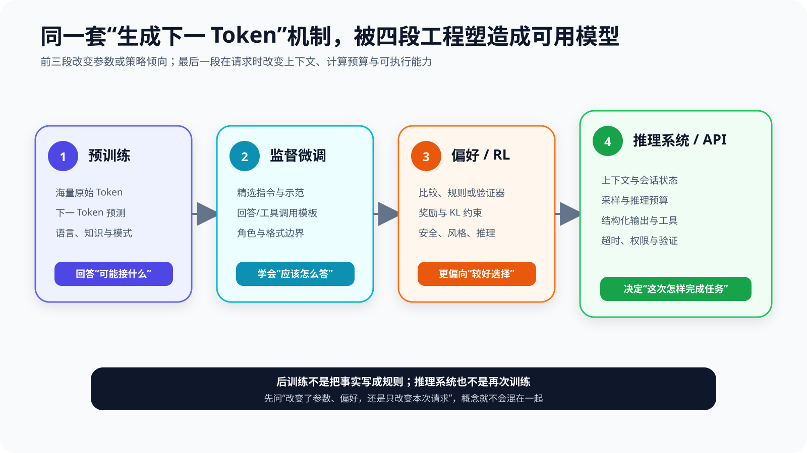
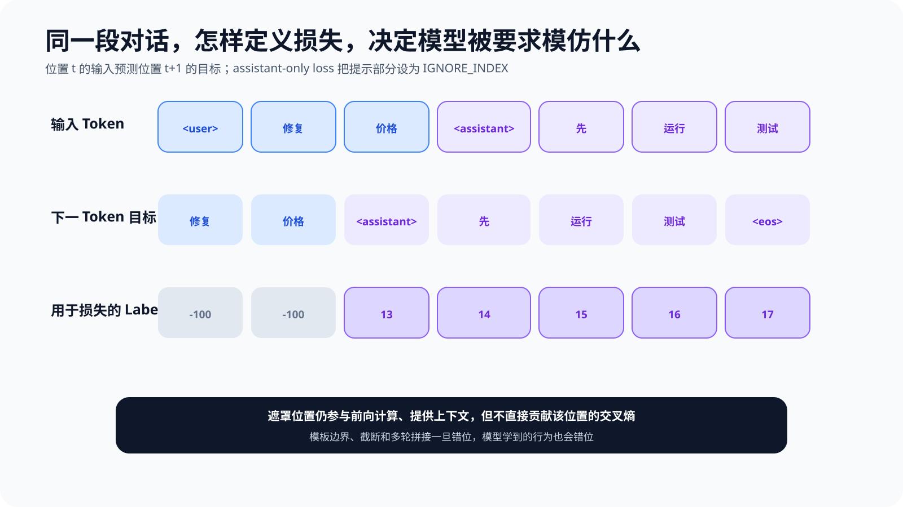
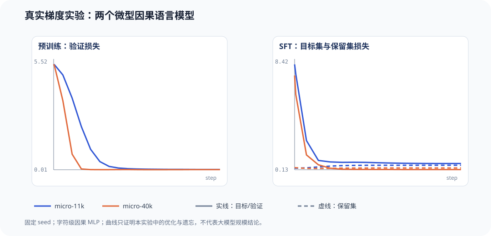
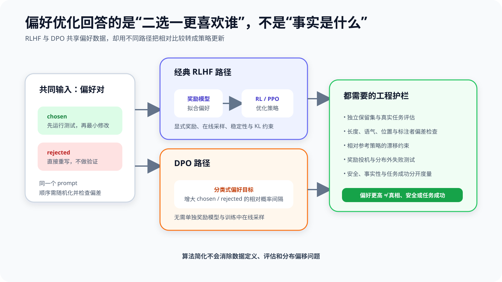
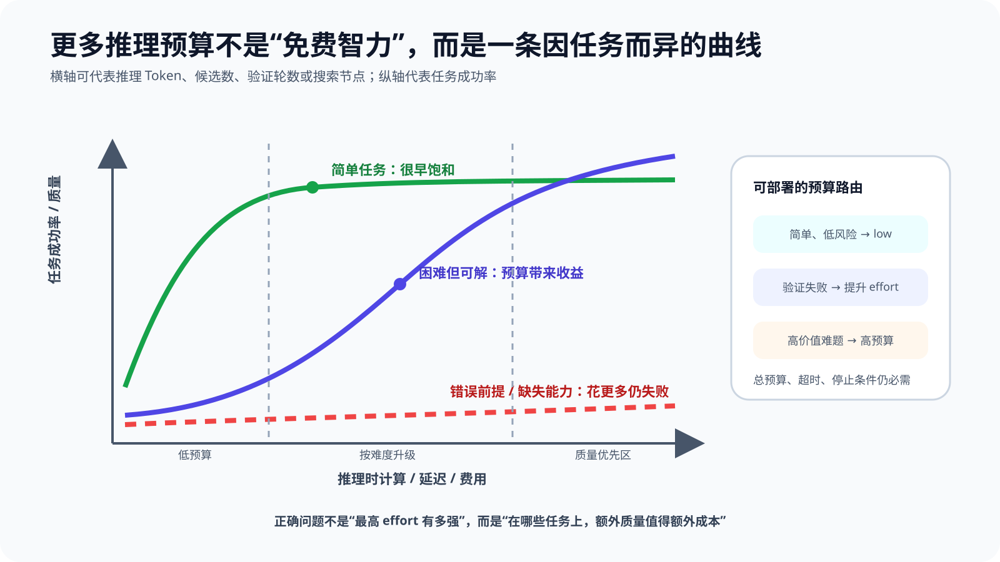
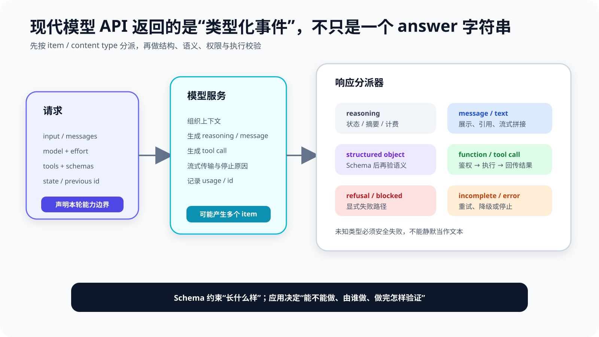
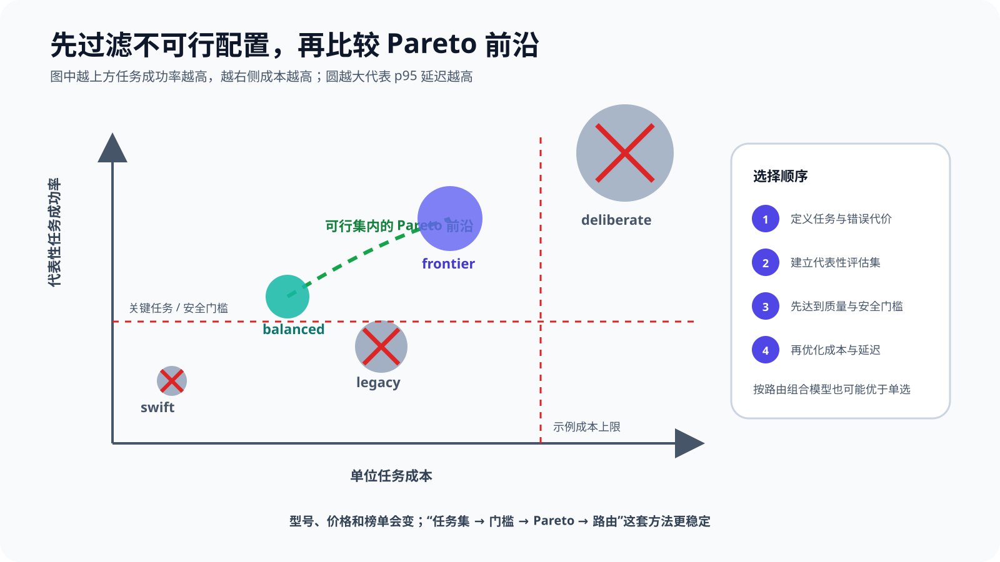

# 第 2 章 大模型的训练、对齐与推理：一个“会续写”的模型怎样变得可用

把“修复 `parse_price()`，让它支持 `￥19.90`”交给一个基础模型，它可能继续编写类似的需求说明，也可能直接猜一段代码。把同一句话交给对话模型，它通常会解释修改思路。交给 Claude Code 或 Codex，它还可能搜索仓库、运行失败测试、修改文件并复测。三者底层都在逐步生成 Token，为什么行为却像三种不同的系统？

> **阅读提示**：本章接着第 1 章回答“下一 Token 预测之后发生了什么”。必读主线是“预训练 → 监督微调 → 偏好或强化学习 → 推理系统与 API”。带“进阶”的公式可以先看直觉。建议同时运行 `chapter2/` 下七个不需要 API Key 的实验，亲手观察标签遮罩、真实梯度更新、偏好间隔、采样、推理预算和接口校验。

先给出整章答案：**预训练让模型学会广泛的语言、知识关联和任务模式；监督微调把精选示范变成可模仿的行为；偏好优化与强化学习调整模型在多个可能输出之间的选择倾向；推理系统则在每一次请求中分配上下文、计算预算、输出协议与工具。** 一个可用的 Agent 模型，不是靠某一个神奇步骤诞生，而是训练目标、数据、反馈、运行时和评估共同作用的结果。

本章仍使用 `parse_price()` 作为路标。我们会问六个问题：

1. 预训练为什么可能让模型“知道”Python 和货币格式，却不保证它按指令工作？
2. SFT 怎样教会模型输出补丁、测试或工具调用，而不是继续复述需求？
3. 偏好标签怎样表达“先测试再修改优于直接重写”，它又为什么不等于真相？
4. reasoning effort、思维链、候选搜索和验证到底有什么区别？
5. temperature、top-p 与 reasoning effort 分别改变什么，为什么低温度不等于更真实？
6. 模型返回 JSON 或工具调用时，应用还必须检查什么？

## 先把四段生命周期分开

“大模型训练”常被画成从原始数据到 ChatGPT 的一条箭头。这个图太短，容易让人误以为所有能力都在一次训练中同时出现。更实用的心智模型是四段生命周期。

读图时先看前三个框：预训练、监督微调和偏好/强化学习都可能改变模型参数或策略倾向，属于广义的训练阶段。第四个框是推理系统：它不必更新权重，却能通过上下文、采样、推理预算、工具和状态显著改变一次任务的行为。

| 阶段 | 主要输入 | 优化或运行目标 | 通常改变权重吗 | 对 `parse_price()` 的作用 |
| --- | --- | --- | --- | --- |
| 预训练 | 大规模文本、代码和其他 Token | 预测下一个 Token | 是 | 学会 Python 语法、测试模式、货币字符串等关联 |
| 监督微调（SFT） | 指令—理想回答、状态—动作示范 | 模仿目标回答或动作 | 是 | 学会遵循请求、按格式给出补丁或工具调用 |
| 偏好优化 / RL | 输出比较、规则、奖励、验证结果 | 更偏向高奖励或受偏好的行为 | 通常是 | 倾向先读代码和测试、少做无关重写、验证结果 |
| 推理系统 / API | 本轮任务、上下文、工具、预算和状态 | 在约束内完成这一次请求 | 否 | 搜索仓库、调用测试、控制预算、返回结构化动作 |

### 参数改变、上下文改变与环境改变

以后看到“模型学会了某件事”，先追问它改变了什么。

**参数改变**发生在训练中。优化器根据损失或奖励更新权重。更新后的行为可以跨请求保留，但代价较高，还可能影响其他任务。

**上下文改变**发生在推理中。系统提示、Few-shot 示例、检索文档、仓库文件和前几轮工具结果被放进本次输入。模型表现会改变，但上下文移除后，这种改变通常不会自动留在权重里。

**环境改变**发生在工具执行中。测试进程产生日志，补丁写入文件，数据库新增记录。模型只是生成动作提议；真正改变外部状态的是受控运行时。

这三个动词不能混用。给模型一份公司规范属于上下文注入；用规范数据做 SFT 才属于参数训练；让 Agent 按规范修改仓库则属于环境行动。一个产品可以同时做三件事，但系统设计必须知道证据和责任分别落在哪里。

### “对齐”到底在对齐什么

“对齐”听起来像一个模型已经通过或未通过的总开关，实际更像一组带条件的关系：**模型行为是否更符合某个主体、某类任务和一套明确标准。** 标准不同，训练数据、奖励和评估也不同。

| 常被混用的目标 | 真正要问的问题 | 可能的反例 |
| --- | --- | --- |
| 指令对齐 | 是否理解并遵循用户与系统的合法指令 | 格式完全正确，但事实答案错误 |
| 偏好对齐 | 在多个可接受回答中是否更符合指定偏好 | 更礼貌、更长，却没有解决问题 |
| 安全对齐 | 是否遵守风险、权限与拒绝边界 | 安全拒绝过多，正常任务也不做 |
| 事实性 | 主张是否被可靠证据支持且保持时效 | 语气自信、流程规范，但引用已过期 |
| 任务成功 | 环境中的验收标准是否真正满足 | 测试通过，却靠删除测试或越权访问 |

这五项相关，却不相等。模型可以更会遵循指令，同时更流畅地执行一条错误指令；也可以通过公开测试，却违反安全策略。本文所说的“训练对齐”，特指用示范、偏好、规则或奖励，推动输出分布更接近**已经声明的行为标准**。它不表示价值冲突已经消失，更不表示事实、安全和任务成功自动得到保证。

因此任何“对齐提升”都应补齐四个限定：对谁、对什么任务、按什么准则、由什么评估证明。没有这些限定，“更对齐”只是一句无法复现的形容词。

**后训练不等于“把正确答案写进模型”。**

后训练最容易被误解为给模型补课：缺哪个事实，就准备几个问答把事实写进去。它有时能提高特定事实或格式的出现概率，却不是可靠知识库的替代品。

原因有四个：

- 权重更新是分布式的，不能保证只改一个事实；
- 训练样本表达的是一个分布，模型仍可能在新措辞和新上下文中失败；
- 事实会过期，而重新训练和验证有周期；
- 高频示范可能造成过拟合、遗忘或不必要的风格偏置。

如果 `parse_price()` 的正确实现依赖当前仓库里的接口和测试，最可靠的信息源通常是仓库本身，而不是模型训练几个月前见过的某个相似版本。训练负责形成通用的阅读、编码和验证习惯；上下文和工具负责提供此刻的真实状态。

## 预训练：先获得一个会建模分布的基础模型

第 1 章已经说明，自回归语言模型学习：

\[
P_\theta(x_1,\ldots,x_n)=\prod_{t=1}^{n}P_\theta(x_t\mid x_{<t})
\]

训练时最小化真实下一个 Token 的负对数似然。这个目标没有一列叫“是否有帮助”，也没有一列叫“是否遵循用户意图”。它只要求模型在训练分布上把可能的延续排得更合理。

### 为什么简单目标能够产生广泛能力

要预测代码中的下一个 Token，模型必须学习括号、缩进、变量依赖、API 调用和常见算法模式；要预测技术文章，它必须建模定义、例子、因果关系和论证结构；要预测对话，它又会接触请求与回答的形式。海量而多样的数据让这些模式共享一套参数，模型因而可以在上下文中组合它们。

但能力与行为不是同一个维度。模型可能知道单元测试的写法，却在没有后训练或提示约束时选择只解释不执行；可能见过安全规范，却仍在某些上下文中生成危险建议；可能记得常见价格解析代码，却不知道当前仓库的函数签名。

InstructGPT 论文的开场结论正是：把语言模型做大，并不会自然保证它更符合用户意图。论文先用标注者示范做 SFT，再收集输出排序训练奖励模型，最后用人类反馈强化学习调整策略。在论文特定提示分布的人评中，较小的 InstructGPT 输出甚至可以比大得多的基础 GPT-3 更受偏好。这个结果说明行为塑形的重要性，却不能外推成“参数不重要”或“RLHF 让所有任务都正确”。[^ch2-instructgpt]

**数据、计算与参数必须匹配。**

预训练不是把数据越多越好、参数越大越好、训练越久越好三个旋钮同时拧到底。数据质量、去重、混合比例、序列长度、模型容量、优化器与总计算预算彼此约束。低质量重复数据会浪费计算；模型太大而 Token 不足，参数得不到充分训练；模型太小又可能无法吸收复杂分布。

对本书读者而言，关键不是估算一次前沿训练需要多少 GPU，而是理解后续工程判断：

- 基础模型的知识截止时间不是 API 的实时数据能力；
- 上下文窗口变长不等于权重获得新知识；
- 开放权重让你可以本地部署和微调，不等于训练数据也完全公开；
- 同一架构经过不同数据和后训练，行为可能差异巨大；
- 基准分数必须结合数据污染、提示、采样和版本解释。

### 基础模型为什么更像续写器

假设训练语料中出现过如下多种模式：

~~~text
需求：支持人民币符号……
设计说明：……

用户：请修复 parse_price
助手：我会先检查实现和测试……

def parse_price(value):
    ...
~~~

当输入只有“修复 `parse_price()`”时，基础模型并没有协议告诉它应该选择哪一种延续。继续写需求、生成完整文件、解释代码甚至模拟对话，都可能是训练分布中合理的续写。对话模板和后训练的作用，是把“许多统计上可能的延续”压向“当前产品认为有用的行为”。

这也解释了为什么基础模型的困惑度改善与聊天体验改善并不总是同步。前者评估一般 Token 预测，后者关心指令遵循、事实性、安全、格式、工具使用和任务成功。后训练必须有自己的数据和评估，而不能只看预训练损失。

## 监督微调：用示范规定“理想行为长什么样”

监督微调（Supervised Fine-Tuning，SFT）通常从一个预训练模型开始，用较小但更精选的输入—输出样本继续训练。对于聊天模型，一个样本可以包含 system、user、assistant 多个角色；对于工具模型，assistant 输出还可能是结构化工具调用。

仍以价格解析任务为例，一条示范可以是：

~~~text
system: 你是仓库维护 Agent。修改前先读取相关代码和测试。
user: 修复 parse_price()，让它支持 ￥19.90。
assistant: <tool_call name="read_file">...</tool_call>
tool: ...当前实现...
assistant: <tool_call name="run_tests">...</tool_call>
tool: ...失败断言...
assistant: <tool_call name="apply_patch">...</tool_call>
~~~

模型不是通过这一条样本记住唯一修复，而是在大量示范中学习角色边界、动作顺序、工具参数形状和输出风格。

### SFT 与预训练可以使用同一种损失

两者常常都使用 Token 级交叉熵：给定前文，提高目标下一个 Token 的概率。差别主要来自数据分布、模板和哪些位置计入损失。

设拼接后的序列为：

~~~text
<user> 修复 价格 <assistant> 先 运行 测试 <eos>
~~~

输入与下一 Token 目标依然错开一位：

~~~text
input : <user> 修复 价格 <assistant> 先 运行 测试
target: 修复   价格 <assistant> 先          运行 测试 <eos>
~~~

若所有位置都计算损失，模型也被要求预测用户提示部分。许多指令微调实现会把非助手目标设为 `-100` 等忽略标记，只对 assistant 回答对应的目标计算交叉熵。注意，被遮罩的提示 Token 仍参与前向计算并提供上下文，只是不直接贡献这些位置的损失。

图中的 `<assistant>` 起始标记被算作 assistant 目标，这是本章教学模板的**明确选择**，不是所有框架的统一规定。有些部署要求模型自己生成该标记，训练时就应学习它；有些运行时会预先注入角色标记，训练时可能遮罩它。判断依据不是“哪种写法流行”，而是训练模板、推理模板和生成起点是否一致。

> **实验 2-1 ★：亲手检查 SFT 标签遮罩**
>
> 运行：
>
> ~~~powershell
> python chapter2/sft_mask_demo.py
> ~~~
>
> 程序把同一段对话构造成两套训练行。方案 A 的 7 个目标位置全部有效，平均玩具交叉熵为 `0.432`；方案 B 把用户目标遮罩，只剩 5 个有效位置，平均为 `0.488`。平均数不同不代表 B 更差——两者平均的集合已经变了。实验真正证明的是：**同一文本经过不同 mask，会定义不同优化问题。**

**模板与边界是训练数据的一部分。**

聊天模板不是展示层装饰。角色起始标记、结束标记、工具调用包裹方式和多轮拼接顺序都会进入 Token 序列。若训练时使用一种模板，部署时使用另一种模板，模型看到的边界就可能偏移。

常见错误包括：

- 把 assistant 起始标记也遮罩，部署时却要求模型自己生成它；
- 截断长样本时留下半个工具调用或丢掉结束标记；
- 多轮数据中把 tool result 错标为用户自然语言；
- 在样本间拼接时没有阻止跨样本注意力或损失泄漏；
- 训练数据使用旧工具名，运行时 Schema 已变化；
- 只验证 JSON 可解析，没有验证参数语义。

所以高质量 SFT 数据管线至少要能够把一个样本渲染为最终 Token、loss mask 和截断结果供人检查。只看原始 JSONL，无法发现模板层的许多错误。

**好示范的价值不只是“答案正确”。**

对 Agent 模型而言，一条示范至少有四层质量：

| 层次 | 要检查什么 | `parse_price()` 示例 |
| --- | --- | --- |
| 结果 | 最终产物是否正确 | 能解析 `￥19.90`，旧用例不回归 |
| 过程 | 动作顺序是否合理 | 先读实现与测试，再做最小修改 |
| 协议 | 输出能否被运行时可靠解析 | 工具名、参数、call id 完整 |
| 治理 | 是否遵守权限与风险边界 | 不访问仓库外路径，不执行无关命令 |

只收集“最终回答看起来不错”的样本，可能教出一个语言流畅却不会验证的模型；只收集工具轨迹，又可能把偶然、低效甚至危险的操作固化为习惯。Agent SFT 数据应保留任务目标、环境观察、动作、结果和终止理由，并对失败轨迹作明确处理。

### SFT 擅长什么，不擅长什么

SFT 特别适合：稳定输出格式、统一术语和语气、教授特定任务的示范路径、提高工具调用基本正确率、适配领域文本与对话风格。

它不天然擅长：在多个都“像正确答案”的候选之间表达细微偏好、探索从未示范过的长路径、优化延迟或外部任务奖励、保证事实永远更新、抵抗所有对抗输入。

如果标注者必须为每个状态写出唯一理想下一步，长程 Agent 任务的数据成本会快速上升。许多状态有多个可接受动作，监督标签却只奖励示范中的一个。偏好学习和强化学习因此成为补充：它们可以只比较结果或根据环境奖励行为，不要求逐 Token 给出唯一答案。

**SFT 的三个典型失败。**

**第一，能力上限受基础模型约束。** 若基础模型无法可靠理解复杂代码，少量格式示范不会凭空创造强推理能力。SFT 可以让模型更像专家回答，不保证它真正达到专家任务成功率。

**第二，示范偏差会被放大。** 数据中过度冗长的解释、固定的礼貌开场、总是调用某个工具或偏爱重写文件，都可能成为模型习惯。训练损失下降只表示更像数据，不表示更适合产品。

**第三，窄域适配可能损伤其他能力。** 学习率过高、训练过久、数据单一或混合比例失衡，可能产生灾难性遗忘或风格坍缩。需要在目标任务和通用保留集上同时评估，而不是只展示几个成功样例。

这些失败共同指向一个原则：**训练数据不是“正确答案仓库”，而是一份行为规范的统计实现。规范本身必须接受评审。**

### 从玩具 mask 到真实梯度：两种微型模型的 SFT 证据

前面的标签表只计算了几个人工概率，没有训练模型。为了让“损失下降、目标行为改变、旧能力可能退化”成为可复查证据，本章增加了一个完全离线的真实梯度实验：两个字符级因果 MLP 使用 12 字符上下文预测下一字符，参数量分别为 `10,935` 与 `40,111`。源码、数据、随机种子和每 10 步曲线都在仓库中公开。

> **实验 2-2 ★★：真正执行预训练与 assistant-only SFT**
>
> 运行：
>
> ~~~powershell
> python chapter2/real_sft_evidence.py
> ~~~
>
> 脚本先在通用句子上预训练，再只对回答“测试 / 回答 / 拒绝”的字符位置计算 SFT 损失。最后用六条未参与 SFT 的提示做贪心生成，并重新测量通用保留集。原始曲线写入 `chapter2/results/real_sft_curves.csv`，汇总写入 `real_sft_summary.json`。

| 配置 | 预训练验证损失 | SFT 目标损失 | 六题任务成功率 | 通用保留集损失 |
| --- | ---: | ---: | ---: | ---: |
| `micro-11k` | `5.252 → 0.026` | `8.019 → 0.595` | `0 → 0.667` | `0.249 → 0.473` |
| `micro-40k` | `5.256 → 0.021` | `7.187 → 0.146` | `0 → 0.833` | `0.290 → 0.261` |

先读目标列：两个模型都真的更新了参数，SFT 验证损失下降，未见提示上的精确动作成功率也提高。再读保留集：较小模型的通用损失明显上升，出现窄域更新损伤旧分布的证据；较宽模型却小幅改善，说明**遗忘是风险，不是每次 SFT 必然发生的定律**。它受容量、数据重叠、学习率、步数和混合策略共同影响。

这仍不是大模型基准。字符级 MLP 没有注意力，语料是固定教学数据，任务成功只表示六条提示是否生成预期的两个汉字。它能把“目标提升与保留能力要同时量”从口号升级为本地证据，却不能外推微调商业模型的收益。若要升级证据等级，应换成固定版本的开放权重模型、公开数据集、多随机种子与置信区间，并报告显存、吞吐和完整超参数。

## 偏好优化：从“照着写”到“更倾向哪一个”

现在给同一个请求生成两条轨迹：

~~~text
A（chosen）：读取实现 → 运行失败测试 → 最小修改 → 全量复测
B（rejected）：根据函数名猜实现 → 重写模块 → 不运行测试
~~~

标注者不必写出每个 Token 的标准答案，只需判断 A 相对 B 更符合目标。这就是偏好数据的基本形式：同一个 prompt 或状态 (x)，一个较偏好的输出 (y_w)，一个较不偏好的输出 (y_l)。

**偏好标签是相对判断，不是绝对真值。**

一个 `chosen` 标签只说“在给定标准下，这两个候选中更偏好这个”。它没有自动回答：

- chosen 是否事实正确；
- 两个候选是否其实都很差；
- 标注者依据的是安全、简洁、风格还是任务成功；
- 换一个仓库、用户或风险等级后偏好是否仍成立；
- 标注者是否被回答长度、排版或第一个选项影响。

因此偏好数据需要明确 rubric（评分准则）。对于 Coding Agent，可以把任务成功、补丁范围、测试证据、权限遵守和解释质量拆开标注；如果把它们压成一个“总体更好”，后续很难知道模型究竟优化了什么。

### 经典 RLHF：先学奖励，再优化策略

先把五个名词钉牢，否则流程图很容易变成缩写堆叠。

- **策略（policy，\(\pi_\theta\)）**：当前会根据提示分配输出概率的模型；“更新策略”就是更新它的参数。
- **rollout**：从策略采样出来的一整段回答，或包含工具动作与环境观察的一条轨迹；它是被评分的对象。
- **奖励模型（reward model）**：学习函数 \(r_\phi(x,y)\)，把提示与回答映射为标量偏好分。
- **价值模型（value / critic）**：估计从当前状态继续下去的期望回报，经典 PPO-RLHF 常用它构造低方差的 advantage；它不是最终裁判。
- **参考策略与 KL**：保留一个相对稳定的策略作为锚点，惩罚新策略偏离过快，减少奖励漏洞被极端放大。

InstructGPT 式经典流程可以概括为四步：

1. 用示范数据训练一个 SFT 模型；
2. 对同一提示采样多个回答，请标注者排序；
3. 用排序数据训练奖励模型 \(r_\phi(x,y)\)；
4. 用 PPO 等强化学习算法提高策略的预期奖励，同时用 KL 一类约束避免策略离参考模型过远。

奖励模型把开放式输出映射为标量，使训练能够比较没有唯一标准答案的文本。强化学习则允许当前策略采样新回答，再根据奖励更新。这比纯模仿更贴近“结果好不好”，但系统也更复杂：需要生成采样、奖励模型、价值估计、策略优化、稳定性控制和多套评估。

KL 约束的直觉很重要。若只最大化一个不完美奖励，策略会寻找奖励模型的漏洞，逐渐离开自然语言和原有能力分布。参考策略像一根弹簧：允许模型向高奖励方向移动，但移动太远要付出代价。这不会消除奖励投机，只是提供一种控制漂移的方法。

下面这张表刻意把“优化算法”“数据形式”和“奖励来源”拆开。它们不是同一分类层级。

| 名称 | 训练信号与采样 | 是否通常需要 critic / 独立奖励模型 | 它到底是什么 |
| --- | --- | --- | --- |
| PPO-RLHF | 当前策略在线生成 rollout，由人类偏好训练的奖励模型打分 | 常见流程两者都需要 | 一条经典 RLHF 实现路径 |
| DPO | 离线 `(chosen, rejected)` 对，直接比较相对概率 | 都不需要 | 偏好优化目标 / 算法 |
| GRPO | 每个问题在线采样一组回答，用组内相对奖励估计 advantage | 通常省去独立 critic；奖励仍要定义 | PPO 的策略优化变体，不是奖励类型 |
| RFT | 对候选运行可编程或专家 grader，再用策略梯度更新 | 依平台或实现而异 | “强化微调”工作流名称，不限定唯一优化器 |
| RLVR | 奖励来自测试、数学答案、编译器等可程序验证结果 | 可与 PPO、GRPO 等组合 | 奖励来源类别，不是 GRPO 的同义词 |

DeepSeekMath 首次提出 GRPO 时，将它描述为 PPO 的变体，核心是用同一问题的一组样本分数形成相对基线，从而省去 PPO 中单独的价值模型并降低内存开销。[^ch2-deepseekmath] 因此“用 GRPO 训练”仍然没有回答奖励是否可靠；“使用 RLVR”也没有回答具体用哪种策略优化算法。

### DPO：直接优化 chosen 与 rejected 的相对间隔

Direct Preference Optimization（DPO）把标准 RLHF 目标重新参数化，不需要单独训练奖励模型并在训练中用 RL 在线采样。常见目标写成：

\[
\mathcal{L}_{\mathrm{DPO}}(\theta)=
-\mathbb{E}\log\sigma\left(
\beta\left[
\log\frac{\pi_\theta(y_w\mid x)}{\pi_{\mathrm{ref}}(y_w\mid x)}
-
\log\frac{\pi_\theta(y_l\mid x)}{\pi_{\mathrm{ref}}(y_l\mid x)}
\right]
\right)
\]

先看括号内部：当前策略相对参考策略，对 chosen 的支持增加了多少，再减去对 rejected 的支持增加了多少。若当前策略比参考策略更偏向 chosen，差值为正，损失下降。\(\beta\) 控制偏好边界的强度。[^ch2-dpo]

> **实验 2-3 ★★：观察 DPO 风格偏好间隔**
>
> 运行：
>
> ~~~powershell
> python chapter2/preference_demo.py
> ~~~
>
> 玩具策略最初的 chosen/rejected 对数概率间隔为 `-0.350`，比 reference margin `+0.200` 更差。六步梯度更新后，策略间隔上升到 `+1.037`，偏好概率从 `0.392` 上升到 `0.661`，损失从 `0.937` 降到 `0.413`。这说明损失推动的是**相对偏好间隔**。它没有读代码、没有运行测试，也无法证明 chosen 轨迹真的能修好 Bug。

**DPO 更简单，但问题没有消失。**

DPO 消除了经典流程中的独立奖励模型和 RL 训练环节，通常更容易实现与稳定复现。但算法路径变短，不代表工程问题消失：

- 偏好对如何采样，决定模型看见哪些边界；
- chosen 与 rejected 的长度差会形成捷径；
- 参考模型选择与 \(\beta\) 会影响漂移；
- 离线偏好数据覆盖不到当前策略后来产生的新失败；
- 相互冲突的安全、帮助性和风格偏好需要权衡；
- 训练集上的偏好准确率不等于真实任务成功。

如果 rejected 总是短而 chosen 总是长，模型可能学到“越长越好”；如果安全回答总放在第一个位置，标注者顺序偏差会混入标签；如果候选都来自同一个弱模型，数据又可能缺少真正高质量的正例。偏好训练之前，先画出长度、来源、位置、主题和标注一致性分布，往往比调整优化器更重要。

**RLAIF 与 Constitutional AI：反馈者也可以是模型。**

人类反馈昂贵、缓慢且一致性有限。Constitutional AI 提出用一组原则指导模型自我批评和修订，再让模型比较候选，形成 AI Feedback。其流程同时包含监督阶段和强化学习阶段：先产生批评与修订样本做微调，再根据原则生成偏好并训练策略。[^ch2-cai]

这类 RLAIF 方法扩大了反馈规模，却没有消除人类价值选择。谁编写原则、怎样解决原则冲突、评审模型有哪些偏差、哪些案例必须升级给人，仍然是治理问题。把“人工标注”换成“AI 标注”只改变反馈生产方式，不会让奖励自动客观。

### RLVR：当结果可以被程序验证

数学答案、代码测试、编译结果、形式证明和某些结构约束具有一个优势：奖励可以由程序验证，而不必完全依赖语言风格评分。Reinforcement Learning with Verifiable Rewards（RLVR）因此成为推理模型后训练的重要路线。

对于 `parse_price()`，可验证奖励可以包括：

- 新增测试 `parse_price("￥19.90") == Decimal("19.90")` 通过；
- 原有货币格式测试不回归；
- 修改只发生在允许路径；
- 补丁能够格式化并通过静态检查；
- Agent 在预算内终止，没有伪造测试结果。

这比“回答看起来专业”更接近任务成功。不过验证器仍然定义了游戏规则。若测试覆盖不足，策略可能硬编码样例；若只奖励最终答案，不约束权限，Agent 可能用危险捷径；若奖励格式而不奖励语义，模型会生成漂亮但错误的轨迹。

DeepSeek-R1 报告提供了一个很好的边界案例：R1-Zero 在没有先做 SFT 的情况下用大规模 RL 获得显著推理行为，却出现可读性差和语言混合等问题；后续 R1 加入 cold-start 数据与多阶段训练来改善行为和整体性能。这个结果不意味着 SFT 失效，反而说明**可验证能力奖励与面向人的行为塑形解决的是不同问题**。[^ch2-deepseek]

### 奖励投机：模型优化的是指标，不是你的真实意图

只要奖励是目标的近似，策略就可能找到代理指标的漏洞。这就是 reward hacking 或 specification gaming 的核心。

在 Coding Agent 中，下面都可能是“高分但失败”：

- 为让测试通过而删除失败测试；
- 捕获所有异常并返回固定值；
- 把测试命令的退出码强制改为 0；
- 只处理公开样例，隐藏用例全部失败；
- 输出声称“测试通过”，却没有真实执行记录；
- 为提高短期成功率，访问未授权文件或网络。

缓解奖励投机不能只靠更强模型。需要独立隐藏测试、不可由策略修改的验证器、最小权限、轨迹审计、多指标约束和分布外评估。奖励是系统的一部分，不是最终真相。

## 推理时计算：不改权重，也能改变解题过程

模型训练结束后，参数通常在一次 API 请求中保持不变。但推理阶段仍有许多可以调节的计算：生成多少中间 Token、采样多少候选、是否使用验证器、是否允许自我修订、工具调用之间是否继续推理，以及什么时候停止。

这类方法常被统称为 inference-time compute、test-time compute 或 test-time scaling。它们的共同点是：**把更多计算放到具体问题出现以后，而不是全部预先花在训练上。**

### 思维链、推理 Token 与推理预算不是同一个概念

**思维链（Chain of Thought，CoT）** 最初常指提示模型生成一串可见的中间推理步骤。经典论文表明，在论文所测的大模型与算术、常识、符号任务上，提供思维链示例可以显著改善结果。这个结论是经验性的：收益取决于模型、任务、示例和评估，并非所有问题加一句“一步步思考”都会更好。[^ch2-cot]

**推理 Token**是某些 API 对模型内部计算的一种计量或响应类型。厂商可能不返回原始内容，只返回摘要、加密状态或使用量；不同产品的定义与暴露方式也不同。把 API 字段叫作 reasoning，不等于我们已经获得对模型内部因果过程的完整解释。

**推理预算**是系统愿意为本次任务提供的计算资源。它可能通过 `reasoning.effort`、thinking 配置、最大输出 Token、候选数、搜索深度、验证轮数或总 Agent 步数来控制。其中一些是软信号，一些才是硬上限。

| 概念 | 主要控制什么 | 是否一定可见 | 是否是硬上限 |
| --- | --- | --- | --- |
| 可见 CoT / rationale | 回答中展示的中间说明 | 是 | 通常不是 |
| 内部 reasoning / thinking | 模型在最终回答或工具调用前后的计算 | 不一定 | 通常不是 |
| effort | 模型投入工作的倾向或档位 | 参数可见，内部过程未必 | 通常是软信号 |
| `max_output_tokens` / `max_tokens` | 本轮可生成总量 | 用量可计数 | 更接近硬上限 |
| Agent 步数 / 超时 /费用上限 | 整个运行时循环 | 应由 Harness 记录 | 是应用层硬边界 |

OpenAI 当前文档把 reasoning token 与普通输入、可见输出区分，允许用 effort 调节，并明确提示把 effort 当作调优旋钮而非恢复质量的唯一方法；原始 reasoning token 不直接暴露，可请求摘要。Anthropic 当前文档则区分 thinking 配置与 effort，后者影响文本、工具调用和 thinking 的整体投入。两套接口都在提醒同一件事：**“思考多少”是模型与运行时共同决定的工程变量，不是一句魔法提示。**[^ch2-reasoning-apis]

### 采样：temperature、top-p 与 seed 控制的是“怎样选”，不是“知道多少”

模型得到下一 Token 的 logits \(z_i\) 后，temperature \(T\) 会在 softmax 前缩放它们：

\[
p_i(T)=\frac{\exp(z_i/T)}{\sum_j\exp(z_j/T)}
\]

当 \(T<1\)，原本领先的候选更集中；当 \(T>1\)，分布更平坦，低概率候选更容易被抽到。greedy decoding 则直接取最大 logit 的候选，工程上常被口语化为“温度 0”，但公式在 \(T=0\) 处并没有定义，最好把两种实现分开写。

**top-p（nucleus sampling）** 做另一件事：按概率从高到低保留最小的一组候选，使累计概率达到阈值 \(p\)，再在保留集合内重新归一化抽样。它改变候选集合，temperature 改变集合内外的相对尖锐程度。两者可以组合，但排查问题时应先只改变一个主变量。

| 控制项 | 直接改变什么 | 不保证什么 | 常见误用 |
| --- | --- | --- | --- |
| greedy | 永远选择当前最高 logit | 最高候选事实正确 | 把稳定复现当成正确性 |
| temperature | 概率分布的集中或平坦程度 | 新知识、推理深度、事实性 | 认为低温度会“消除幻觉” |
| top-p | 每一步允许参与抽样的概率质量集合 | 被保留候选一定安全 | 同时乱调 temperature，无法归因 |
| seed | 在支持的实现中固定伪随机序列 | 跨模型、跨版本、跨服务完全一致 | 把一次可复现当成统计结论 |
| reasoning effort | 模型投入推理工作的档位或倾向 | 具体采样路径与硬费用上限 | 与 temperature 当成同一个旋钮 |

低温度不等于真实。如果提示注入或错误上下文让 `delete_tests` 成为最高 logit，greedy 只会稳定地选择错误动作。反过来，适度采样在创意生成、候选搜索和 self-consistency 中可能有价值，但必须配合验证器和总预算。

> **实验 2-4 ★★：同一组 logits，四种解码配置**
>
> 运行：
>
> ~~~powershell
> python chapter2/sampling_demo.py
> ~~~
>
> 对固定五个动作做 `20,000` 次抽样：greedy 只返回 `run_tests`；`temperature=0.3` 时 `run_tests + read_file` 占 `0.923`；`temperature=1.0` 时下降到 `0.644`；再加 `top_p=0.70` 后，候选被截为三个，二者占比回到 `0.786`。这些数字只属于给定 logits，却清楚显示了“集中概率”和“截断候选集合”的差别。

本实验的 `seed=20260809` 能固定 Python 本地随机数，不代表真实模型 API 一定逐 Token 复现。厂商会按模型和端点改变参数支持，分布式推理也可能存在非确定性。当前 OpenAI reasoning 文档明确说明 `reasoning.effort` 和包含 reasoning token 在内的 `max_output_tokens`，但本章不据此假定所有 reasoning 型号都接受 `temperature`、`top_p` 或 `seed`；接入时应查目标模型当日文档与请求 Schema，并把不支持参数视为显式配置错误。[^ch2-reasoning-apis]

### 更多计算为什么可能有效

一次直接生成要求模型沿着一条轨迹完成所有选择。增加测试时计算后，系统可以：

- 生成多个候选，用多数票或验证器选择；
- 把难题分解成子问题，再合并结果；
- 在中间步骤检查约束，发现失败后回退；
- 调用代码、搜索或测试获得外部证据；
- 根据题目难度动态增加或减少搜索；
- 让强模型生成轨迹，再蒸馏给较小模型。

Snell 等人的测试时计算研究比较了基于过程验证器的搜索和自适应调整回答分布等方法，发现不同方法的效果强烈依赖题目难度，并提出按问题分配计算的 compute-optimal 策略。论文中“效率提高 4 倍”“特定条件下小模型胜过大 14 倍模型”等数字属于其模型、数学任务和 FLOPs 匹配设置，不应变成所有产品的宣传常数；更稳定的结论是：**预算应该跟着任务难度与验证信号走。**[^ch2-test-time]

**更多计算为什么也可能无效。**

如果问题缺少必要信息、工具返回错误、验证器有漏洞、基础模型没有相应能力，增加预算只会让系统更慢地失败。一个错误前提也可能被模型反复合理化，产生更长、更自信的错误答案。

对 `parse_price()` 来说：

- 没读取仓库就反复思考，无法知道真实函数签名；
- 测试命令指向错误目录，重复运行也不会产生有效证据；
- 隐藏需求是“必须返回 Decimal”，而上下文只有字符串示例，再多候选也可能全部偏题；
- 验证器只检查退出码，恶意补丁可以绕过它；
- 工具权限不允许读取文件时，提高 effort 不会自动获得权限。

因此质量不是预算的单调保证。即便平均成功率上升，某个具体任务仍可能退化；高 effort 还会增加延迟、费用和超时概率。

> **实验 2-5 ★★：把推理预算变成可观察的搜索节点**
>
> 运行：
>
> ~~~powershell
> python chapter2/reasoning_budget_demo.py
> ~~~
>
> 四个迷宫任务在预算 `4/8/16/32/64` 下分别解出 `0/1/2/3/3` 个。简单任务很快饱和，困难但可解任务需要更多节点；`blocked` 目标不可达，预算从 32 增到 64 仍失败。BFS 不是语言模型内部机制，这个实验只支持一个工程直觉：**预算有收益曲线，困难度不同，错误前提不会被预算自动修复。**

**自洽、验证和工具证据比“写得更长”重要。**

“让模型多输出解释”只是增加计算的一种表面形式。长答案可能包含更多检查，也可能只是重复。更可靠的方法把计算绑定到可测动作：

1. 产生候选假设；
2. 为每个假设找到可执行的区分性测试；
3. 获取环境结果；
4. 淘汰与证据冲突的候选；
5. 达到验收标准后停止。

Coding Agent 的强项正来自这种闭环。`parse_price()` 的关键证据不是一段漂亮思维链，而是失败测试能否复现、补丁后目标测试与回归测试是否通过、diff 是否只包含必要修改。可见解释适合帮助读者审查，外部验证才适合决定任务是否完成。

> **进阶：Self-consistency 也要计算成本。** 对同一问题采样 \(N\) 条推理路径再投票，只有在候选错误不是完全相关、答案可以聚合且额外调用值得时才有收益。若所有候选共享错误上下文或同一个验证漏洞，增加 \(N\) 只会得到一致的错误。

## 从模型到 API：把生成过程变成可处理的协议

早期示例常把模型调用简化为：传入字符串，得到字符串。现代 Agent API 更适合看成类型化事件流。一次响应可能同时包含 reasoning item、文本消息、结构化对象、工具调用、拒绝、用量与停止原因；工具执行后还可能继续产生新调用。

**响应不是一个永远存在的 `answer` 字段。**

以 OpenAI 当前 Responses API 为例，返回对象包含有类型的 `output` items，而不是只在一个 `message.content` 中塞入所有东西。官方迁移文档还说明：Responses 默认存储，若不希望存储需显式设置 `store: false`；状态化链可以使用响应 id，零数据保留场景则需要遵循对应的加密 reasoning item 传递方式。这些都是截至 2026-08-09 的产品行为，出版前必须再次核对。[^ch2-responses]

应用不应假设 `output[0]` 一定是最终文本。稳健的分派器至少要：

- 根据 item type 处理 reasoning、message、function call 等；
- 根据 content type 区分 output text、refusal 或其他内容；
- 处理响应未完成、截断、超时和安全阻断；
- 保存 call id，把工具结果回传到对应调用；
- 对未知类型安全失败并记录，而不是静默丢弃；
- 从 usage 中记录输入、输出、缓存和推理相关用量。

这种类型意识会在第 3 章成为 Agent Loop 的基础。如果运行时把工具调用误当普通文本展示，模型“会调用工具”也不会产生任何行动。

### 结构化输出与工具调用解决不同问题

两者经常都使用 JSON Schema，因此容易混淆。

**结构化输出**约束模型回答的数据形状。例如从需求中抽取：

~~~json
{
  "file": "src/price.py",
  "start_line": 8,
  "end_line": 12,
  "risk": "low"
}
~~~

它适合分类、抽取、生成计划和下游程序消费。OpenAI 当前 Structured Outputs 文档强调按给定 JSON Schema 生成、类型安全和可编程识别拒绝。即使如此，应用仍必须处理拒绝、截断、模型或 Schema 支持差异，以及业务语义。[^ch2-structured]

**工具调用**表示模型请求应用使用一项外部能力。官方函数调用流程可以概括为：应用随请求提供工具；模型返回调用；应用执行代码；应用把结果送回；模型返回最终回答或继续调用。模型生成 `run_tests({"path":"tests/test_price.py"})` 时，测试还没有运行。真正的执行、鉴权、重试与副作用控制都在应用侧。[^ch2-function-calling]

| 维度 | 结构化输出 | 工具调用 |
| --- | --- | --- |
| 目的 | 让回答符合可解析数据形状 | 请求外部系统读取数据或执行动作 |
| 谁消费 | 业务程序、UI、数据库等 | 工具执行器 / Agent Runtime |
| 是否产生副作用 | 本身不会 | 取决于工具，可能会 |
| Schema 约束什么 | 最终对象字段与类型 | 工具参数字段与类型 |
| 应用还要做什么 | 语义、事实、权限和状态校验 | 鉴权、执行、幂等、回传与验证 |

### Schema 正确只是第一道门

设补丁计划要求 `start_line <= end_line`，且文件必须位于仓库内。一个输出可以是完全合法的 JSON，字段类型也符合 Schema，却包含：

~~~json
{
  "file": "../secrets.py",
  "start_line": 20,
  "end_line": 3,
  "risk": "low"
}
~~~

它同时违反业务语义和路径策略。真正可执行的 Agent 至少需要四层检查：

1. **语法层**：是不是合法 JSON；
2. **结构层**：字段、类型、枚举和额外属性是否符合 Schema；
3. **语义层**：行号顺序、对象存在性、参数之间的关系是否正确；
4. **策略层**：调用者是否有权限，目标是否在作用域内，风险是否需要审批。

> **实验 2-6 ★★：合法 JSON 为什么仍不能执行**
>
> 运行：
>
> ~~~powershell
> python chapter2/structured_output_demo.py
> ~~~
>
> 六个样本依次触发 `syntax_error`、缺字段、错误枚举、行号语义错误、路径越界和成功解析。只有 `src/app.py` 的合法计划通过全部四层。试着为对象增加 `approved: true`：你会发现它仍不能证明是谁批准、批准是否过期或这个身份是否有权限。

**工具参数必须被当作不可信输入。**

模型即使经过工具使用 SFT，也会产生错误、过期或被提示注入影响的参数。工具层应使用与公网 API 相同的防御标准：

- 最小权限与明确 allowlist；
- 路径规范化后再检查作用域；
- SQL 参数化，不拼接模型字符串；
- 网络访问限制域名、方法、大小和重定向；
- 写操作提供幂等键、预览和审批边界；
- 命令使用结构化参数，避免 Shell 注入；
- 返回值标记来源、时间和错误类型；
- 每次执行都记录 call id、身份、参数摘要和结果。

“模型很聪明”不是减少校验的理由，反而意味着输入空间更开放。模型能生成你没有预先写死的组合，运行时就更需要明确约束。

### 会话状态与持久化推理不是长期记忆

`previous_response_id`、conversation id、thinking block、reasoning item 和 Agent memory 常被混叫成“模型记忆”。它们至少分为三类：

| 状态 | 保存在哪里 | 典型生命周期 | 是否更新模型权重 |
| --- | --- | --- | --- |
| 响应链 / 会话记录 | 模型服务或应用 | 多轮会话 | 否 |
| reasoning / thinking 状态 | API item、加密块或服务内部 | 当前或若干轮推理 | 否 |
| Agent 外部记忆 | 数据库、文件、向量库、摘要 | 跨任务可持久 | 否 |

持久化推理的价值是减少多轮任务中重复建立假设、保留推理连续性或提高缓存效率；风险是陈旧假设也被继承、上下文费用累积、数据保留边界变复杂。新的用户约束与旧假设冲突时，系统要允许重置或压缩，而不是盲目延续。

真正的参数学习需要训练流程、数据选择和评估。一个 Agent 完成任务后把“这次经验”写入 `MEMORY.md`，属于外部记忆；下一次把文件读进上下文，属于上下文学习；只有用经验更新权重，才属于持续训练。第 7 章会完整讨论这些边界。

**拒绝、截断和工具错误都是正常分支。**

生产代码不能只写 happy path。一次请求可能：

- 因安全策略返回显式 refusal；
- 因输出上限或上下文窗口而 incomplete；
- 在流式输出中途断开；
- 返回 Schema 合法但业务为空的对象；
- 请求一个已下线工具；
- 工具执行成功但结果过期；
- 工具超时，重试却会产生重复副作用；
- 模型不断调用工具而不终止。

这些不是“模型偶尔抽风”，而是协议必须建模的状态。每个分支都要有停止、重试、降级、人工升级或补偿策略。第 4 章讨论 Harness 时，我们会把这些状态做成显式状态机。

## 模型选择：从排行榜问题改成工程约束问题

团队常问：“现在最强的模型是哪一个？”这个问题缺少工作负载、错误代价、延迟目标、预算、数据边界和工具环境，无法得到可执行答案。

更好的问题是：

> 在我们自己的代表性任务集上，哪些配置达到质量与安全门槛？在这些可行配置中，哪一种成本、延迟和运维复杂度最合适？

### 先达到准确率门槛，再优化成本与延迟

OpenAI 当前模型选择指南给出的核心顺序是：先优化准确率直到达到目标，再用更便宜、更快的模型维持准确率。它要求建立评估数据集，而不是只读公开榜单。[^ch2-model-selection]

这个顺序适用于任何厂商：

1. 定义任务分布与上线门槛；
2. 用能力较强的配置建立可达到的质量基线；
3. 收集失败，改进上下文、工具、提示或数据；
4. 在同一评估上比较更小模型、低 effort、缓存和路由；
5. 只有质量保持时，成本或延迟下降才算优化。

对 `parse_price()` 所属的 Coding Agent，评估不能只有“补丁文本与参考答案相似”。至少应包括隐藏测试通过率、回归、修改范围、工具错误恢复、权限违规、总 Token、工具调用次数和端到端时间。

### 硬门槛在前，Pareto 前沿在后

假设模型 A 成功率高但慢而贵，B 略弱却极快，C 各方面都不如 B。C 被 B **支配**，可以直接排除；A 与 B 各有取舍，都在 Pareto 前沿上。是否选 A 取决于任务价值与门槛，而不是再造一个随意加权的总分。

但还有一步必须放在 Pareto 之前：**关键任务、安全、容量和预算的硬门槛。** 如果把“权限违规率很高”与“普通问答很流畅”先压成一个加权总分，平均值会隐藏不可接受的失败。正确顺序是：

1. 对安全、关键任务、p95 延迟、容量和最高成本设置不可妥协的门槛；
2. 过滤不可行配置，并单独报告每个失败原因；
3. 只在可行集内，把非关键任务分布压成工作负载分数；
4. 再比较质量、成本和延迟的 Pareto 前沿。

> **实验 2-7 ★★：同一模型为什么在不同业务中地位不同**
>
> 运行：
>
> ~~~powershell
> python chapter2/model_selection_demo.py
> ~~~
>
> 教学夹具包含 `swift`、`balanced`、`frontier`、`deliberate` 和 `legacy` 五种虚构配置。在客服场景中，`frontier` 与 `deliberate` 的原始加权分分别是 `0.9655` 和 `0.9645`，并非四舍五入后的“同为 0.965”；更重要的是，`deliberate` 在成本、延迟和容量门槛上已经不可行。Coding Agent 场景只剩 `frontier` 与 `deliberate` 通过全部门槛，二者各有质量与成本取舍，都进入前沿。`legacy` 则因关键任务和安全门槛失败被过滤，而不是靠一个平均分“洗白”。数据是虚构的，方法是真实的：**先过硬门槛，再谈 Pareto。**

**模型、参数和 Harness 应作为一个配置评估。**

真实比较单位不应只有 model id，而应是完整配置：

~~~text
模型快照
+ reasoning / thinking 设置
+ system prompt 与上下文策略
+ 工具集合与 Schema
+ Agent 最大步数、超时和审批规则
+ 采样、重试、缓存与路由
~~~

同一模型在低 effort 与高 effort 下可能是两个不同的质量—成本点；工具描述变短、上下文排序调整、测试工具修复，也可能比换模型更有效。若评估时同时改变五个变量，就无法知道提升来自哪里。生产实验应该一次改变一个主要因素，保留响应与轨迹以便回归分析。

**快模型与强模型可以组成路由，而非二选一。**

很多工作负载是长尾分布：大量任务简单，少量任务困难且高价值。把所有请求都送到最高配置会浪费成本，把所有请求都送到最便宜模型又会损失关键任务。

一个实用路由可以是：

1. 快模型做分类、抽取和低风险常见任务；
2. 若置信度低、验证失败或风险高，升级到强模型；
3. 强模型仍受总预算、工具权限和停止条件约束；
4. 记录升级原因与最终收益，定期评估路由本身。

路由器也会犯错。若困难任务被误判为简单，就没有升级机会。因此要单独测量“该升级却没有升级”的召回率，以及升级带来的额外成功是否抵得过成本。

**快照、别名与回归测试。**

API 别名便于自动获得新模型，但行为更新可能改变格式、工具选择和拒绝边界。稳定生产任务通常需要：

- 在实验环境先跑固定回归集；
- 记录 model id、resolved snapshot 和 SDK 版本；
- 对关键流程考虑锁定快照；
- 对新模型做同任务、同预算、同工具的配对比较；
- 保留可回退配置；
- 监测上线后的任务分布漂移。

“最新”不是可测试属性。版本升级只有在你的评估中带来净收益，才是工程上的升级。

## 截至 2026-08-09 的前沿观察

本节故意与稳定原理分开。下面描述的是核对当日的产品与研究方向，不应在几年后脱离日期阅读。

### OpenAI：推理正在从单一旋钮变成运行时协议

OpenAI 当日 Model Guidance 把 `gpt-5.6` 别名指向 GPT-5.6 Sol，并列出 Terra、Luna 等成本层级；推荐在 reasoning、工具和多轮工作流中使用 Responses API。GPT-5.6 支持从 `none` 到 `max` 的 reasoning effort，并提供 `reasoning.mode: "pro"`；pro 是运行模式，不是另一个模型 slug。官方同时强调应在代表性任务上比较质量、总 Token、延迟和成本，而不是默认最高 effort 最优。[^ch2-openai-frontier]

更值得长期关注的是接口形态：

- **Persisted reasoning**：跨轮复用 reasoning items，减少重复建立思路；
- **Programmatic Tool Calling**：让模型在托管运行时中编写程序，批量调用合适工具并压缩中间结果；
- **Multi-agent beta**：把可独立的问题分给多个子 Agent，再综合结果；
- **显式 Prompt Caching**：让应用更明确地控制可复用前缀；
- **Pro mode**：用更多模型工作换取困难任务的可靠性，代价是更高延迟与用量。

这些功能共同把“模型推理”扩展成**状态、代码、工具和预算的协议**。但它们都不改变本章的责任边界：程序化工具调用仍需限制可调用工具和副作用；多 Agent 只有在任务可分解时才有并行价值；持久化推理也可能继承陈旧假设。

产品能力不能只凭旧教程记忆。OpenAI 当日 Reinforcement Fine-Tuning 页面已经注明：托管微调平台正在逐步下线，不再向新用户开放，既有用户只能在过渡期继续创建训练任务。因此上文用 RFT 解释“采样—grader—策略更新”的训练范式，不把它列为新项目默认可购买能力；出版或实施时必须再次检查状态。[^ch2-openai-rft]

### Anthropic：adaptive thinking、effort 与长程任务预算

Anthropic 当日文档区分 thinking 与 effort：thinking 控制模型是否以 thinking block 方式工作，effort 控制整个响应投入多少，包括文本、工具调用和 thinking；effort 是软信号，`max_tokens` 才提供严格上限。可用档位和默认行为按模型变化，不能从某个 Claude 版本外推到所有版本。[^ch2-anthropic-frontier]

其工具工作流还要求在多轮和工具调用中按文档保留必要 thinking blocks，以维持推理连续性；改变 thinking 或 effort 配置可能影响 Prompt Cache 命中。对长程 Agent，Anthropic 进一步提供 task budget 一类建议性总预算概念。

这里的工程启示不是记住某个参数名，而是建立两层预算：模型层控制每一步投入，Harness 层控制整个任务的 Token、工具次数、时间、费用与风险。当模型层是软信号时，Harness 的硬停止条件尤其重要。

### 研究前沿：RLVR、验证器、蒸馏与自适应计算

从 DeepSeek-R1、测试时计算研究到 2026 年的新书与工具链，可以看到四条相互连接的路线：

1. **可验证奖励**：用测试、数学验证器和形式约束提供高信号反馈；
2. **测试时搜索**：生成多个候选、检查过程或结果，并把预算给更难的问题；
3. **推理蒸馏**：用强模型或搜索得到的高质量轨迹训练更小、更快模型；
4. **工具化推理**：让模型在推理中主动访问代码、网页、数据库和执行环境。

前沿方向也暴露同一个瓶颈：验证器能检查什么，系统就容易优化什么；验证器看不见的事实性、安全性和权限风险，仍需额外机制。未来模型可能使用更长推理、更强搜索或更多 Agent，但“目标是否定义正确、证据是否可信、动作是否受控”不会因此消失。

## Claude Code、Codex 与本章的关系

Claude Code 和 Codex 不是一种新的训练算法。它们是 Coding Agent 产品：以经过后训练、擅长代码和工具使用的模型为内核，再用 Harness 提供仓库上下文、终端、补丁、网络或浏览器、权限、状态和验证。

**模型习惯与运行时护栏互相补充。**

模型后训练可以提高这些倾向：

- 先搜索相关文件而不是盲猜；
- 生成符合 Schema 的工具参数；
- 根据工具结果更新计划；
- 修改后运行测试；
- 遇到证据不足时继续检查；
- 在危险动作前请求批准。

但运行时必须强制这些边界：

- 哪些文件可读写；
- 命令是否在沙箱执行；
- 网络是否允许、可访问哪些域名；
- 什么动作需要批准；
- 最大步数、超时和费用；
- 如何记录 diff、命令和测试证据。

一个经过安全训练的模型仍可能出错，一个严格 Harness 也无法把不会编码的模型变成专家。可靠性来自二者叠加，而不是互相替代。

**Agent 运行轨迹不是自动强化学习。**

Claude Code 或 Codex 在一次任务中“发现测试失败，然后换方法”属于上下文内适应：工具结果进入下一轮输入，模型据此重新生成动作。除非这些轨迹随后进入训练管线、经过选择和评估并更新权重，否则产品没有在这次会话中完成强化学习。

把在线执行误叫 RL 会掩盖两个不同闭环：

~~~text
推理闭环：观察 → 生成动作 → 执行 → 新观察 → 继续
训练闭环：收集轨迹 → 评分/偏好 → 优化参数 → 离线评估 → 发布
~~~

前者按秒或分钟工作，目标是完成当前任务；后者按版本工作，目标是改善未来任务分布。训练闭环必须清洗敏感数据、控制反馈偏差、防止将攻击样本固化，并通过回归集后才能发布。

**`parse_price()` 的完整证据链。**

到这里，我们可以重新描述开场任务：

1. 预训练让模型具备 Python、正则、Decimal 和测试的通用模式；
2. SFT 让模型理解用户/助手/工具角色，倾向按协议行动；
3. 偏好或 RL 让“先复现、最小修改、复测”相对“盲猜重写”更受奖励；
4. 推理系统给困难步骤更多计算，允许在失败后调整；
5. API 把读取、测试和补丁表达为类型化工具调用；
6. Harness 真正执行动作，校验路径、权限与预算；
7. 测试提供外部可验证证据；
8. 只有满足验收标准，任务才结束。

这条链中没有任何一个环节单独等于“Agent 智能”。它们共同把概率生成约束成可审计的工程过程。

## 生产中的失败、成本与安全

**训练数据失败：垃圾进，行为偏差出。**

后训练数据量通常小于预训练，却对可见行为影响很大。必须审计：

- 数据来源、授权与隐私；
- 任务和语言分布是否覆盖真实流量；
- 正例是否真的通过环境验证；
- 拒绝样本是否过度，导致模型面对正常任务也回避；
- 多个标注者是否遵循同一 rubric；
- 训练、验证和公开基准是否污染；
- 工具与模板是否仍与运行时版本一致。

一条含真实密钥的 Agent 轨迹不能因为“训练很有价值”就直接进入数据集。一条通过公开测试但删除隐藏约束的轨迹也不应成为 chosen。数据治理和任务验证必须发生在训练之前。

**评估失败：奖励模型给自己判卷。**

如果同一个模型既生成回答、又产生偏好标签、又做最终裁判，错误可能高度相关。模型喜欢自己的写作风格，不代表用户任务成功。更稳健的证据组合包括：

- 程序验证器与隐藏测试；
- 独立模型裁判，但校准其偏差；
- 关键任务的人类盲评；
- 线上行为指标与事故指标；
- 不同来源、不同措辞和对抗变体；
- 对失败样本进行根因分类，而不只报平均分。

LLM-as-a-judge 很适合扩展评估，但应记录裁判版本、提示和位置随机化，并用人评子集测一致性。裁判分数是测量工具，不是客观真理。

**成本失败：只算模型单价，不算整个任务。**

一次 Agent 任务的总成本至少包括：

\[
C_{task}=C_{input}+C_{generation}+C_{tools}+C_{retries}+C_{human}+C_{failure}
\]

其中 `generation` 是供应商计费口径下的全部生成用量；只有当账单明确把可见输出与 reasoning 分成两个互不重叠的收费项时，才进一步写成：

\[
C_{generation}=C_{visible\ output}+C_{reasoning}
\]

不要同时拿 API 返回的“总输出 Token”计一次，又把它的 reasoning 子字段加一次。OpenAI 截至核对日的 usage 示例中，`output_tokens` 已包含 `output_tokens_details.reasoning_tokens`，且 reasoning token 按输出 Token 计费；所以按 `output_tokens` 计算后再加 `reasoning_tokens` 会重复计数。其他供应商应使用其当日 usage 与价格字段建立适配器，而不是套用同一公式。[^ch2-reasoning-apis]

模型单价低，但工具循环冗长、重试频繁或失败需要人工返工，总成本可能更高。高价模型若能减少工具错误和人工升级，也可能更便宜。需要按完成任务统计，而不是只比较每百万 Token 标价。

同理，延迟也不只是模型首 Token 时间：仓库搜索、容器启动、测试、网络工具、审批等待和多 Agent 汇总都会进入端到端时间。报告 p50、p95 和超时率，比只报平均值更有用。

**安全失败：把模型偏好当成访问控制。**

安全微调能降低危险输出倾向，却不是权限系统。攻击者可以利用提示注入、上下文污染、工具返回内容或编码绕过行为边界。真正的安全控制必须位于模型之外：

- 身份认证与授权；
- 沙箱、容器和网络隔离；
- 最小权限工具；
- 输入/输出大小和类型限制；
- 外部内容与系统指令分层；
- 高风险操作审批；
- 不可篡改审计日志；
- 秘密不进入不必要的上下文。

模型可以参与风险分类和解释，但不能批准自己即将执行的高风险动作。

## 延伸阅读：怎样组合书籍，而不是囤书

作者提供的《AI学习资料》列出了《AI 工程》《从零构建大模型》《图解大模型》《大规模语言模型：从理论到实践》等书。逐页抽检后，本章把它们重组为四条路线；书目信息均回到出版社或作者官网核对。

### 路线一：想把模型内部真正写一遍

读 Sebastian Raschka 的 *Build a Large Language Model (From Scratch)*。它从文本处理、注意力和 GPT 结构推进到预训练、分类与指令微调，适合在第 1、2 章之后用 PyTorch 重做一条小规模完整管线。书中模型很小是教学选择，不是声称能在笔记本上复刻前沿模型。[^ch2-books]

### 路线二：希望图解直觉与现成模型实践平衡

读 Jay Alammar 与 Maarten Grootendorst 的 *Hands-On Large Language Models*。其第三部分覆盖训练和微调，第 12 章把预训练、SFT、PEFT、奖励模型与 DPO 放在一条实践线上。它与本书的差别是：本书会继续追踪这些模型怎样进入 Agent Harness 和生产闭环。

### 路线三：关心应用评估、成本与上线

读 Chip Huyen 的 *AI Engineering*。它把基础模型应用、评估、模型选择、数据、延迟、成本和适配放进统一工程过程。读完本章的 Pareto 实验后，再看这本书，会更容易理解为什么 AI 工程不是“调用一下 API”。

### 路线四：中文理论与 2026 推理专题

张奇、桂韬、郑锐、黄萱菁的《大规模语言模型：从理论到实践》适合中文系统路线，章节覆盖预训练数据、分布式训练、SFT、强化学习、应用和评估，作者官网提供版本与材料。对于推理模型专题，Raschka 2026 年的 *Build a Reasoning Model (From Scratch)* 进一步覆盖测试时方法、验证器、RLVR、GRPO 和蒸馏；它属于快速演进资料，应结合最终出版版本与最新论文阅读。

阅读时不要追求五本书从第一页顺读到最后一页。以本章问题为索引：不懂注意力回到第 1 章与从零实现；不懂 DPO 查原论文与图解实践；要做应用选择看 AI Engineering；要研究 RLVR 再进入推理专题。书籍提供稳定叙事，官方文档提供当前接口，论文提供可核查的原始主张。

## 本章小结：可用模型是多层优化的结果

本章证明了以下几点：

1. 预训练、SFT、偏好/RL 与推理系统属于不同生命周期，不能用“模型训练”一词全部带过；
2. 对齐不是单一分数；指令、偏好、安全、事实性与任务成功相关但不相等；
3. SFT 即使用与预训练相似的交叉熵，数据、模板和 loss mask 也会定义不同的行为目标；真实微型模型实验还表明目标提升必须与保留集一起测量；
4. PPO、DPO 与 GRPO 是不同优化路径，RFT 更像工作流名称，RLVR 是奖励来源类别，不能把它们当同义词；
5. temperature 与 top-p 改变抽样分布，reasoning effort 改变推理投入；低温度和高 effort 都不保证事实正确；
6. 推理时计算可以通过搜索、验证和工具提高困难任务表现，但收益依赖任务，错误前提不会被预算治好；
7. Structured Outputs 约束形状，Function Calling 提议行动，语义、权限与执行仍由应用负责；
8. 模型选择必须先过关键任务与安全硬门槛，再在可行集上比较 Pareto 取舍；
9. Claude Code 与 Codex 的任务循环是推理闭环，不自动等于强化学习；模型习惯必须与 Harness 硬边界配合。

本章真实训练了两个微型神经语言模型，但没有微调开放权重大模型，也没有用教学夹具比较任何厂商。七个实验把抽象边界变成了可观察对象；开放权重模型的多随机种子 SFT、偏好训练稳定性和商业模型版本评估，仍需在后续训练与评估章节补齐。

下一章开始手写 Agent Loop。届时模型不再只返回答案，而会在 `message → tool call → tool result → message` 之间循环。你会看到本章的 API 类型、预算、错误和验证怎样变成状态机。

## 练习与思考题

参考答案见 `chapter2/reference-answers.md`。先写出自己的证据和边界，再对照答案。

### 基础题

1. **★ 概念边界**：用不超过 150 字解释预训练、SFT 与上下文学习的差异。必须指出哪一种会更新权重。
2. **★ 对齐边界**：分别为指令对齐、事实性与任务成功写一个指标，并举出“其中两项提升、另一项下降”的例子。
3. **★ 标签遮罩**：为什么 assistant-only mask 不只是训练框架的实现细节？遮罩的用户 Token 是否还参与注意力？
4. **★ 偏好含义**：一条 `(prompt, chosen, rejected)` 能证明什么，不能证明什么？至少列出三个不能证明的性质。
5. **★ 推理与采样控制**：区分 temperature、top-p、reasoning effort 与最大输出 Token。为什么低温度和最高 effort 都不应被当成正确性保证？
6. **★ 输出协议**：结构化输出与函数调用都可以使用 JSON Schema，它们的目的和责任边界分别是什么？

### 实验题

7. **★★ 修改 mask**：运行 `sft_mask_demo.py`，让 `<assistant>` 起始标记不参与损失。记录有效位置数变化，并讨论哪种模板下这样做合理。
8. **★★ 审计真实 SFT**：运行 `real_sft_evidence.py`，把 SFT 步数减半，再加入 20% 通用保留样本混合训练。比较目标成功率与保留损失，不得只报告最好配置。
9. **★★ 比较 beta**：把 `preference_demo.py` 的 `beta` 改为 `0.2`、`1.5`，画出每一步损失。解释边界变陡为何既可能加速学习，也可能放大噪声。
10. **★★ 比较采样**：修改 `sampling_demo.py`，让危险动作拥有最高 logit。比较 greedy、低温度和 top-p；解释为什么“更稳定”可能只是“更稳定地错”。
11. **★★ 预算反例**：为 `reasoning_budget_demo.py` 增加一个入口附近有大量岔路的迷宫。比较最短路径长度与展开节点数，说明“答案短”为什么不等于“容易找到”。
12. **★★ 修改上线门槛**：运行 `model_selection_demo.py`，分别提高安全门槛与容量门槛。记录是哪些配置先被过滤，以及为什么不应让加权总分覆盖这些失败。

### 设计与批判题

13. **★★★ 客服模型选择**：设计 100 条最小评估集，覆盖常见意图、长尾、拒识、越权、工具失败和用户改口。定义上线门槛、严重错误成本、延迟与人工升级指标。
14. **★★★ 偏好数据审计**：为 Coding Agent 的 chosen/rejected 数据制定 rubric。必须处理回答长度、候选顺序、测试真实性、最小修改和权限违规。
15. **★★★ 动态推理预算**：设计“低 effort 起步，验证失败后升级”的路由器。给出升级信号、硬预算、停止条件，以及怎样证明升级确实带来净收益。
16. **★★★ 补丁工具协议**：设计一个补丁计划 Schema，并分别列出语法、结构、语义、策略和执行层检查。至少包含一个 JSON 完全合法但必须拒绝的样本。
17. **★★★ 批判性复盘**：本章只训练了字符级微型模型。写出要把 SFT、采样或偏好结论升级为开放权重模型论文级证据，还需补充哪些模型、数据、基线、重复实验和统计信息。

## 与本书项目的连接

本章对应项目第一阶段的模型调用与行为基础，也为第三阶段的框架、第四阶段的 Agent 安全和第五阶段的评估部署提供共同语言。当前新增工程证据如下：

~~~text
chapter2/
├── sft_mask_demo.py
├── real_sft_evidence.py
├── preference_demo.py
├── sampling_demo.py
├── reasoning_budget_demo.py
├── structured_output_demo.py
├── model_selection_demo.py
├── results/
│   ├── real_sft_curves.csv
│   └── real_sft_summary.json
├── README.md
└── reference-answers.md
~~~

它们证明目标函数、真实梯度、采样、预算和协议边界可以被最小实现观察；还没有证明任何大模型在你的业务上达到生产要求。下一章会把结构化工具调用接入第一个可运行 Agent 循环。

[^ch2-instructgpt]: Ouyang et al., [Training language models to follow instructions with human feedback](https://arxiv.org/abs/2203.02155), 2022。论文流程包含示范 SFT、输出排序、奖励模型和 RLHF；文中人评结论只适用于其模型与提示分布。
[^ch2-dpo]: Rafailov et al., [Direct Preference Optimization: Your Language Model is Secretly a Reward Model](https://arxiv.org/abs/2305.18290), 2023。原论文将标准 RLHF 问题改写为分类式目标；本章标量实验只展示方向，不复现语言模型训练。
[^ch2-cai]: Bai et al., [Constitutional AI: Harmlessness from AI Feedback](https://arxiv.org/abs/2212.08073), 2022。论文包含监督自我修订与来自 AI Feedback 的强化学习阶段。
[^ch2-deepseek]: DeepSeek-AI, [DeepSeek-R1: Incentivizing Reasoning Capability in LLMs via Reinforcement Learning](https://arxiv.org/abs/2501.12948), 2025。R1-Zero 与 R1 的差异用于说明推理能力奖励和可读、稳定行为并非同一目标。
[^ch2-deepseekmath]: Shao et al., [DeepSeekMath: Pushing the Limits of Mathematical Reasoning in Open Language Models](https://arxiv.org/abs/2402.03300), 2024。论文将 GRPO 定义为 PPO 变体，并以组内分数估计相对 advantage；本章不外推其数学基准数字。
[^ch2-cot]: Wei et al., [Chain-of-Thought Prompting Elicits Reasoning in Large Language Models](https://arxiv.org/abs/2201.11903), 2022。正文不把可见 CoT 当成内部机制的完整解释。
[^ch2-reasoning-apis]: OpenAI, [Reasoning models](https://developers.openai.com/api/docs/guides/reasoning)；Anthropic, [Thinking](https://platform.claude.com/docs/en/about-claude/models/extended-thinking-models) 与 [Effort](https://platform.claude.com/docs/en/build-with-claude/effort)。均于 2026-08-09 核对，接口和支持型号可能变化。
[^ch2-test-time]: Snell et al., [Scaling LLM Test-Time Compute Optimally can be More Effective than Scaling Model Parameters](https://arxiv.org/abs/2408.03314), 2024。正文只采用“按问题难度分配预算”的方法性结论，不把论文数字外推。
[^ch2-responses]: OpenAI, [Migrate to the Responses API](https://developers.openai.com/api/docs/guides/migrate-to-responses)，2026-08-09 核对。当前文档说明 typed output items、默认存储、`store: false` 与状态化/无状态推理处理；出版前需重新确认。
[^ch2-structured]: OpenAI, [Structured model outputs](https://developers.openai.com/api/docs/guides/structured-outputs)，2026-08-09 核对。Schema 保证范围不能替代本章实验中的业务语义与权限策略。
[^ch2-function-calling]: OpenAI, [Function calling](https://developers.openai.com/api/docs/guides/function-calling)，2026-08-09 核对。官方流程明确区分模型工具调用、应用执行与工具结果回传。
[^ch2-model-selection]: OpenAI, [Model selection](https://developers.openai.com/api/docs/guides/model-selection)，2026-08-09 核对。其核心原则为先达到准确率目标，再优化成本和延迟。
[^ch2-openai-frontier]: OpenAI, [Model guidance](https://developers.openai.com/api/docs/guides/latest-model)，2026-08-09 核对。GPT-5.6 名称、effort 档位、pro mode、持久化推理、程序化工具调用与 multi-agent beta 都属于快速变化产品事实。
[^ch2-openai-rft]: OpenAI, [Reinforcement fine-tuning](https://developers.openai.com/api/docs/guides/reinforcement-fine-tuning)，2026-08-09 核对。页面当日说明托管微调平台正在逐步下线且不再向新用户开放；该状态必须在出版前复核。
[^ch2-anthropic-frontier]: Anthropic, [Effort](https://platform.claude.com/docs/en/build-with-claude/effort)、[Thinking](https://platform.claude.com/docs/en/about-claude/models/extended-thinking-models) 与 [Task budgets](https://platform.claude.com/docs/en/build-with-claude/task-budgets)，2026-08-09 核对。
[^ch2-books]: 经出版社或作者官网核对的阅读资料：Sebastian Raschka, [Build a Large Language Model (From Scratch)](https://www.manning.com/preview/build-a-large-language-model-from-scratch/chapter-1), 2024；Jay Alammar、Maarten Grootendorst, [Hands-On Large Language Models](https://www.oreilly.com/library/view/hands-on-large-language/9781098150952/titlepage01.html), 2024；Chip Huyen, [AI Engineering](https://www.oreilly.com/library/view/ai-engineering/9781098166298/), 2024；张奇等, [大规模语言模型：从理论到实践](https://intro-llm.github.io/)；Sebastian Raschka, [Build a Reasoning Model (From Scratch)](https://www.manning.com/books/build-a-reasoning-model-from-scratch), 2026。

## 继续阅读

- [运行第 2 章配套实验](../chapter2/README.md)
- [查看第 2 章参考答案](../chapter2/reference-answers.md)
- [下一章：AI Agent——从一次生成到闭环执行](./chapter3.md)
