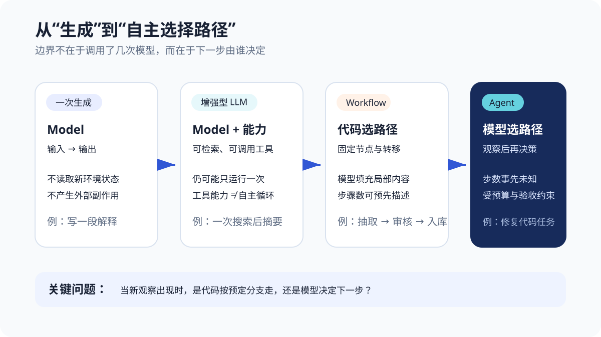
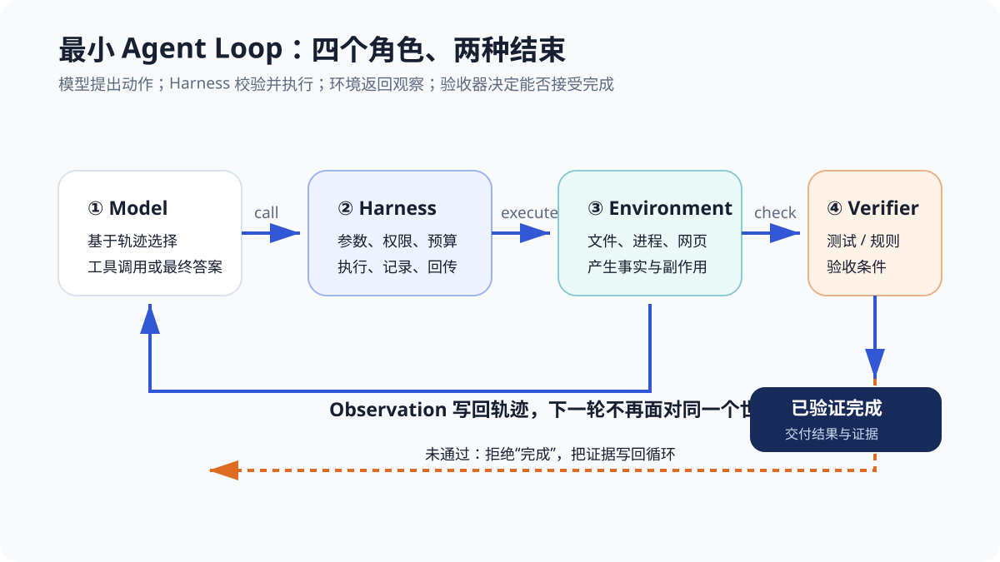
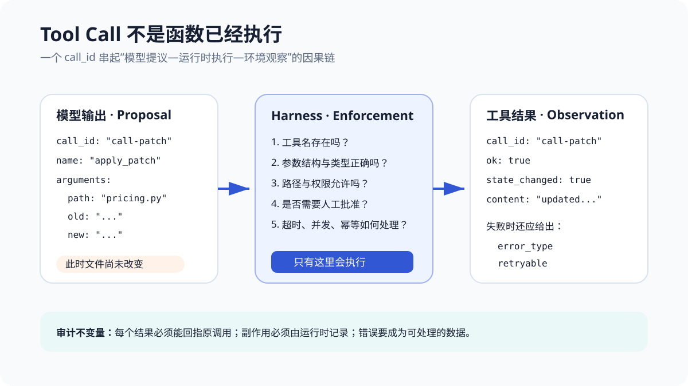
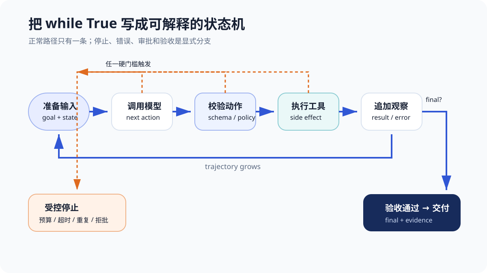
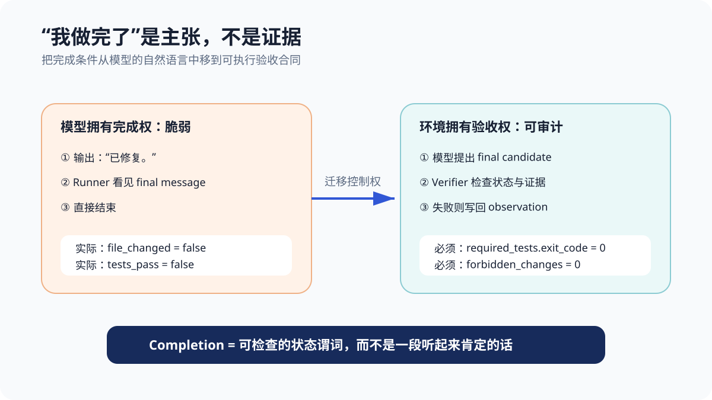
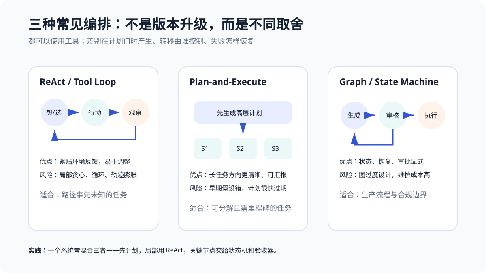
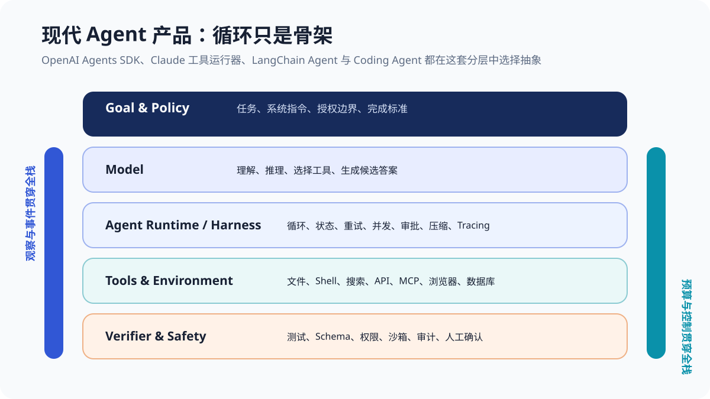

# 第 3 章 AI Agent：从一次生成到闭环执行

“修复 `parse_price()`，让它支持 `￥19.90`。”

一个模型给出了一段看起来完全合理的实现：去掉货币符号，再调用 `float()`。回答语法正确，解释也很清楚。可是一分钟后，仓库里的测试仍然失败——因为那段代码只存在于聊天窗口，文件根本没有被修改。

另一个系统先读取 `pricing.py`，运行测试得到 `exit_code=1`，应用最小补丁，再运行同一组测试得到 `exit_code=0`，最后才报告完成。两者可能使用同一个底层模型，差别却不在“哪段代码更聪明”，而在于第二个系统把生成接入了一个能够观察、行动和验证的闭环。

> **阅读提示**：本章不从 LangChain 的类名开始，而是先用 Python 标准库手写一个最小 Agent Loop。必读主线是“一次生成为什么不够 → 工具调用怎样成为环境行动 → 观察怎样进入下一轮 → 谁拥有停止权”。`chapter3/` 中包含 5 个编号实验和 1 个 Trace 补充实验，均不需要 API Key；它们会创建临时仓库、启动真实测试进程并输出完整轨迹。

先给出整章答案：**Agent 不是“会调用工具的模型”，而是一个让模型在目标、环境反馈和控制边界之间反复选择下一步的运行系统。模型负责提出决策，Harness 负责校验和执行，环境负责产生新事实，Verifier 负责判断目标是否真的满足。** 没有反馈循环，工具只是一次增强；没有运行时控制，工具提议只是字符串；没有外部验收，“完成”只是模型的一句话。

本章围绕七个问题展开：

1. Model、增强型 LLM、Workflow 与 Agent 的边界在哪里？
2. ReAct 到底贡献了什么，它与今天的 Function Calling 是什么关系？
3. 一次工具调用为什么不等于函数已经执行？
4. 最小 Agent Loop 需要保存哪些状态和事件？
5. 工具失败、重复动作与长时间无进展怎样处理？
6. 谁应该决定任务结束：模型、代码，还是外部验收器？
7. OpenAI Agents SDK、Claude Agent SDK 与 LangChain 把哪些循环细节封装了起来？

## 先划边界：不是多调用几次模型就叫 Agent

“Agent”已经被用来描述聊天机器人、固定工作流、自动化脚本、浏览器机器人和 Coding Agent。若把这些系统都装进一个词，讨论很快会失去精度。一个更稳定的判断问题是：**当新的环境反馈出现时，下一步路径由谁选择？**

| 系统形态 | 下一步由谁决定 | 是否读取新观察 | 路径能否预先枚举 | 典型用途 |
| --- | --- | --- | --- | --- |
| 一次模型生成 | 没有下一步 | 否 | 是，只有输入到输出 | 改写、摘要、分类、解释 |
| 增强型 LLM | 应用或一次模型决策 | 可选 | 通常可以 | 带检索的问答、一次函数调用 |
| Workflow | 预先编写的代码或图 | 是 | 大体可以 | 审核流水线、固定抽取与入库 |
| Agent | 模型根据当前轨迹动态选择 | 是 | 通常不能完整预知 | 调研、排障、编程、开放环境任务 |

Anthropic 在 *Building effective agents* 中把 Workflow 定义为“LLM 与工具沿预定义代码路径编排”，把 Agent 定义为“LLM 动态控制自身过程与工具使用”的系统；同时强调先选择能够解决问题的最简单方案，因为 Agent 往往用更多成本和延迟换取灵活性。[^ch3-anthropic-patterns] 这个区分并不是行业唯一命名标准，却很适合工程设计。

### 工具可用，不等于形成 Agent

假设应用总是先调用天气 API，再让模型生成一句穿衣建议：

~~~text
weather = get_weather(city)
answer = model(user_question, weather)
~~~

模型获得了外部事实，但“先查天气”这条路径由代码固定。它是增强型 LLM 或一个很短的 Workflow，不必为了显得先进而叫 Agent。

再假设模型可以在 `search_weather`、`search_calendar` 和“直接回答”之间选择，但应用只允许一轮选择。它已经具有工具选择能力，却仍不是长程闭环。只有当工具结果会进入下一轮，模型能够依据这个新状态改变行动，系统才获得 Agent 最关键的动态性。

**调用次数也不是判据。** 一个固定工作流可以调用模型二十次；一个 Agent 可能观察一次后就完成。自主性来自路径选择权，不来自 API 账单的行数。

### Workflow 与 Agent 不是高低级关系

固定流程的价值是可预测：节点、输入、输出、失败分支和责任边界比较明确。Agent 的价值是适应：当任务步数未知、环境反馈不可预见或硬编码所有分支代价过高时，模型可以即时选择下一步。

选择依据可以简化为：

| 问题特征 | 更适合 Workflow | 更适合 Agent |
| --- | --- | --- |
| 步骤是否稳定 | 步骤少且长期稳定 | 路径因实例而变化 |
| 成功条件 | 每一节点都容易定义 | 最终目标清晰，中间路径开放 |
| 错误成本 | 很高，需要强一致流程 | 可在沙箱中试错和恢复 |
| 延迟与成本 | 必须严格可预测 | 可以为难题投入更多轮次 |
| 审计要求 | 需要固定审批链 | 允许动态行动，但每步必须留痕 |

现实系统常混合两者：退款审批用 Workflow 保证金额和授权链，Agent 负责阅读材料、补齐证据与起草建议；Coding Agent 动态搜索与修改，发布动作则回到固定 CI 和人工审批。

## Agent 的最小定义：策略、环境、轨迹与目标

把产品名暂时放到一边，一个交互式 Agent 可以写成序贯决策过程。第 \(t\) 步，环境给出观察 \(o_t\)，策略根据当前上下文 \(c_t\) 选择动作：

\[
a_t \sim \pi(a \mid c_t), \qquad
c_t = (g, o_0, a_0, o_1, \ldots, a_{t-1}, o_t)
\]

其中 \(g\) 是目标，\(a_t\) 可以是工具调用、向用户提问或提出最终答案。Harness 执行动作后，环境转移到新状态 \(s_{t+1}\)，产生新观察：

\[
s_{t+1}=T(s_t,a_t), \qquad o_{t+1}=O(s_{t+1})
\]

这组符号不要求系统一定使用强化学习。这里的 \(\pi\) 只是“根据上下文选择下一动作的策略”，可以由冻结的语言模型、规则、搜索算法或它们的组合实现。一次运行中根据测试失败改计划，属于**上下文内适应**；只有轨迹进入训练管线并更新参数，才属于训练闭环。

一个最小 Agent 系统至少有六个元素：

- **Goal**：要达到的状态，而不只是要说的一段话；
- **Policy / Model**：根据当前轨迹提出下一动作；
- **Tools**：Agent 可以请求的受限动作空间；
- **Environment**：文件、进程、网页、数据库或用户所在的真实世界；
- **State / Trajectory**：已经发生了什么，以及当前有哪些可用证据；
- **Termination**：成功、失败、阻塞或预算耗尽的判定。

少一个都会改变系统性质。没有工具，Agent 只能通过对话行动；没有环境反馈，长循环只是模型反复和自己说话；没有终止条件，系统可能永远继续；没有目标状态，验证器不知道什么算完成。

把公式翻译回 `parse_price()` 就很朴素：目标 \(g\) 是“人民币符号样例通过且普通小数不回归”；初始观察 \(o_0\) 是用户描述；第一次动作 \(a_0\) 是读取文件；新观察 \(o_1\) 是当前实现；下一动作才可能是运行测试。**每一轮只比上一轮多一份可验证事实。** 这也是闭环优于“让模型把整条未来轨迹一次猜完”的地方。

## ReAct：把推理与行动交错，而不是先想完再执行

2022 年提出的 ReAct 将 reasoning traces 与环境 actions 交错生成。行动从外部知识库或交互环境获得观察，新的观察又帮助模型更新计划和处理异常。原论文在问答、事实核查、文本环境和网页购物基准上比较了只推理、只行动与 Reason+Act 等方案，也报告了检索无信息、无法从重复步骤恢复等失败。[^ch3-react]

典型教学轨迹写成：

~~~text
Thought: 我需要先看当前实现。
Action: read_file({"path": "pricing.py"})
Observation: return float(value)
Thought: 先运行测试确认失败样本。
Action: run_tests({})
Observation: exit_code=1, ValueError on "￥19.90"
...
~~~

ReAct 的重要贡献不是这三个英文标签本身，而是两个因果方向：

- **reason to act**：当前目标和证据决定下一步应该做什么；
- **act to reason**：行动带回的外部事实修正后续判断。

### 今天不必要求模型公开完整“思维过程”

现代推理模型可能在内部使用不可见推理，API 也可能只提供摘要或结构化工具调用。工程系统并不需要保存模型的每个隐含推理 Token 才能采用 ReAct 思想。真正需要审计的是：

- 模型看到了哪些输入和工具结果；
- 提出了什么动作及参数；
- Harness 为什么允许或拒绝；
- 环境状态发生了什么变化；
- 最终结论由什么证据支持。

正文和实验中的 `reason` 字段是简短的决策理由，用于教学和可观测性，不声称等价于模型内部计算。把完整思维链当成可靠解释会产生另一种错觉：文本看起来连贯，不等于动作因果正确。

### ReAct 不是唯一循环

ReAct 适合边观察边调整；Plan-and-Execute 先产生高层计划，再逐项执行；显式状态机则把节点和转移写进代码。三者不是按年代替换的版本，而是不同约束下的编排选择。本章后面会把它们放在一张图里比较。

## 最小闭环中，四个角色不能混为一谈

先沿图上方从左向右读：Model 选择工具或最终候选；Harness 校验请求并执行；Environment 产生结果与副作用；Verifier 检查目标。若仍未完成，新观察沿下方回到下一轮；若验收通过，系统才交付。

### Model：提出下一步，不直接触碰世界

模型输入通常包含任务、系统指令、可用工具描述和历史事件。输出可能是自然语言、结构化工具调用、交接或最终候选。即使 API 把一个输出项命名为 `function_call`，它也只是模型生成的数据。

这条边界非常重要：模型可以建议删除文件，但没有文件权限；模型可以生成收款参数，但不能自行绕过业务校验；模型可以声称测试通过，但不能伪造进程退出码。

### Harness：真正拥有循环与执行权

Harness 是模型之外的运行系统。它负责：

- 把目标、上下文、工具描述和历史组装成模型输入；
- 解析并校验模型输出；
- 路由工具，控制路径、权限、超时和并发；
- 把结果用正确协议回传；
- 记录事件、Token、延迟、成本和副作用；
- 处理重试、审批、暂停、恢复和上下文压缩；
- 在硬预算或安全门槛触发时停止。

第 4 章会专门讨论 Harness Engineering。本章只实现骨架，但已经能看到：换一个 Harness，即使模型不变，也会改变系统可观察的可靠性。

### Environment：提供模型不能凭空知道的事实

环境可以是代码仓库、Shell、浏览器、数据库、机器人传感器或用户反馈。环境有自己真实的状态，模型上下文只是它的部分投影。

例如 `pricing.py` 被修改是环境状态变化；“补丁已应用”是一条观察；模型记忆中“我应该已经改过了”既不是状态，也不是证据。长任务中若二者漂移，Agent 会基于过期世界模型行动。

### Verifier：把目标变成可检查的条件

Verifier 可以是单元测试、JSON Schema、SQL 约束、权限策略、静态分析、人类审批或组合评分器。它不一定完美，但必须独立于模型的自我报告。

“完成”最好定义成状态谓词：

\[
done(s)=tests\_pass(s) \land no\_forbidden\_change(s) \land policy\_ok(s)
\]

如果只有公开测试，Agent 可能删测试或过拟合样例；如果只有模型裁判，生成者和裁判可能共享偏差。可靠验收需要覆盖真正重要的约束，并保留隐藏测试、规则或人工判断。

## Tool Call：从模型提议到环境观察

OpenAI 当前 Function Calling 指南把模型输出的 `function_call` 与应用执行分开；应用执行后用相同 `call_id` 回传 `function_call_output`。[^ch3-openai-function] Anthropic Messages API 的工具循环同样要求把 `tool_use` 与对应 `tool_result` 接回消息历史。产品字段不同，底层责任一致。

一个工具调用至少应有：

~~~json
{
  "call_id": "call-patch",
  "name": "apply_patch",
  "arguments": {
    "path": "pricing.py",
    "old": "return float(value)",
    "new": "return float(normalize(value))"
  }
}
~~~

执行结果至少要保留关联和状态：

~~~json
{
  "call_id": "call-patch",
  "ok": true,
  "content": "updated pricing.py",
  "state_changed": true,
  "error_type": null,
  "retryable": false
}
~~~

### JSON Schema 只解决了第一层问题

工具参数从模型到代码，至少经过五层检查：

| 层 | 问题 | `apply_patch` 例子 |
| --- | --- | --- |
| 语法 | JSON 能否解析 | 引号和括号是否合法 |
| 结构 | 字段与类型符合 Schema 吗 | `path` 是字符串，`old/new` 必填 |
| 语义 | 参数在当前环境有意义吗 | `old` 在文件中恰好出现一次 |
| 策略 | 当前用户被允许做吗 | 路径在工作区，文件不是密钥库 |
| 执行 | 动作实际成功了吗 | 写盘未失败，状态摘要确实变化 |

Structured Outputs 或严格 Schema 可以显著减少语法和结构错误，但不会自动证明路径安全、金额合理或副作用成功。第 2 章的输出协议，到这里才真正接入环境。

### call_id 是因果链，不是装饰字段

一个模型轮次可能发出多个工具调用；异步执行时，结果返回顺序还可能变化。若结果没有稳定标识，模型和审计系统就无法判断哪个结果对应哪个动作。`call_id` 至少支持三件事：

1. 把结果送回正确调用；
2. 检测孤儿结果、重复回传或漏回传；
3. 在 Trace 中重建“提议—批准—执行—观察”的因果关系。

它仍不是幂等键。调用标识解决“这是谁的结果”，幂等键解决“重试是否会重复产生业务副作用”。支付、发信、创建工单等工具通常需要两者。

并行调用还需要第三类信息：依赖关系。两个只读搜索可以安全并行，`read_file → apply_patch → run_tests` 却有明确先后；两个同时修改同一文件的调用还会产生竞态。模型能在一轮中提出多个调用，不表示 Harness 应无条件并发执行。第 10 章会继续讨论依赖图、并发上限与取消。

## 手写最小 Agent Loop

`chapter3/agent_loop.py` 使用 Python 标准库实现了完整骨架。为了让输出可复现，所谓“模型”是确定性的 `RepairPolicy`；把它的 `decide()` 换成真实模型 API，Harness 边界不变。

核心数据类型被刻意分开：

~~~python
@dataclass(frozen=True)
class ToolCall:
    call_id: str
    name: str
    arguments: dict[str, Any]

@dataclass(frozen=True)
class ToolResult:
    call_id: str
    ok: bool
    content: str
    error_type: str | None = None
    retryable: bool = False
    state_changed: bool = False

@dataclass(frozen=True)
class Decision:
    kind: str                 # "tool" or "final"
    reason: str
    call: ToolCall | None = None
    final: str | None = None
~~~

循环的主体可以压缩成十几行伪代码：

~~~python
events = []
for step in range(1, max_steps + 1):
    decision = policy.decide(events)
    events.append(decision)

    if decision.kind == "final":
        if verifier(environment):
            return completed(decision.final, events)
        events.append(verification_failed())
        continue

    call = validate(decision.call)
    result = environment.execute(call)
    events.append(result)

return stopped("max_steps", events)
~~~

短不代表简单。`validate()` 背后有 Schema、权限、审批和预算；`execute()` 背后有沙箱、超时、异常与幂等；`events` 后面还有持久化、压缩和隐私。框架的价值正是封装这些重复机制，但理解循环后才能知道框架替你做了什么、没做什么。

> **实验 3-1 ★：一次正确回答为什么仍不算完成**
>
> 运行：
>
> ~~~powershell
> python chapter3/one_shot_vs_loop.py
> ~~~
>
> 第一段产生 248 个字符的合理实现，却观察到 `file_changed=False`、`acceptance_tests_pass=False`。第二段执行四次工具调用，最终 `file_changed=True`、`acceptance_tests_pass=True`。实验只证明“生成候选”与“改变并验证环境”是不同事件；它不证明闭环策略对所有代码任务都正确。

> **实验 3-2 ★★：观察五步 Agent 轨迹**
>
> 运行：
>
> ~~~powershell
> python chapter3/agent_loop.py
> ~~~
>
> 关键输出为：
>
> ~~~text
> [1] call: read_file id=call-01-read_file
> [2] result: ok=False ... exit_code=1
> [3] result: ok=True changed=True updated pricing.py
> [4] result: ok=True ... exit_code=0
> [5] verify: accepted=True rules=('tests_passed', 'protected_files_unchanged')
> [run] status=completed calls=4
> ~~~
>
> 注意第 3 步才改变文件；读取与测试都只改变 Agent 的知识，不改变仓库。第 5 步也不是模型单方面结束，而是 Verifier 同时记录测试规则、受保护文件检查、测试命令、退出码和状态摘要。这里的 `RepairPolicy` 是基于结构化观察推进的确定性决策策略，用来固定“模型侧变量”；它没有比较任何真实模型的能力。

为防止成功路径掩盖合同漏洞，本章把 Review 中可复现的反例写成了回归测试：

| 故障注入 | v1.0 行为 | v1.1 预期结果 | 证明的边界 |
| --- | --- | --- | --- |
| 初始实现改成 `return float(value.strip())` | 固定旧文本冲突并重复动作 | 从最近一次读取内容生成补丁，`completed` | 策略必须消费 Observation |
| 同时存在一个无关测试失败 | 仍套用固定价格补丁 | 不修改源码并返回 `failed` | 目标证据不明确时应停止 |
| 修改测试使错误实现“通过” | 布尔 Verifier 接受 | `protected_files_unchanged=False`，拒绝完成 | 测试也属于受保护验收资产 |
| 两次工具提议复用同一 `call_id` | 第二次副作用仍执行 | 执行前拒绝，`duplicate_call_id` | 标识符必须在一次 Run 内唯一 |
| `subprocess.TimeoutExpired` | 异常逃出 Loop | 返回 `tool_timeout`、`retryable=True` | 工具异常必须进入观察协议 |

这些是确定性的边界一致性测试，只能说明外围合同是否生效，不能说明真实模型质量，也不能比较 Claude Code、Codex 或某个 SDK 谁更强。

### 本章实验中的一次真实失败

最初实现路径检查时，临时目录 `self.root` 没有先 `resolve()`，而子路径已经规范化。在 Windows 上，两种表示直接比较，合法的 `pricing.py` 被误判为越界路径。结果是读取、补丁和最终测试全部失败。

修复不是删掉安全检查，而是**先规范化工作区根路径，再比较规范化后的子路径**，并保留 `../secret.txt` 必须被拒绝的回归测试。这个小故障说明：

- 安全策略可以因平台路径语义而误伤正常操作；
- “工具调用格式正确”与“工具实现正确”无关；
- 失败轨迹比一张成功截图更能暴露系统边界；
- 安全修复必须同时验证合法样本与攻击样本。

## 状态：聊天记录、环境状态与运行状态不是一回事

Agent 框架常用一个 `state` 包含所有东西，概念上至少要拆成三层。

**轨迹状态**记录模型可见的事件：用户目标、工具调用、工具结果、审批和摘要。它回答“Agent 知道什么”。

**环境状态**是外部世界：磁盘文件、数据库行、浏览器页面、Git 分支和进程。它回答“世界现在是什么样”。

**控制状态**由 Harness 保存：当前步数、累计 Token、已用费用、重复动作计数、待审批调用、取消信号和超时。它回答“系统还允许做什么”。

三者可能不一致：轨迹写着补丁成功，但进程在写盘后崩溃；环境已经发出邮件，控制状态却因超时准备重试；上下文被压缩后，模型忘了一个禁止条件，但权限引擎仍必须记得。

因此生产系统不能把全部真相都寄托在消息数组里。业务副作用应有事务记录，关键控制应在模型之外，恢复时要重新核对环境，而不是只重放模型最后一句话。

### Event 比覆盖式状态更适合审计

只保存“当前文件已修复”无法回答是谁修改、用什么参数、是否审批、测试在修改前后分别怎样。事件日志则保存：

~~~text
decision → tool_call → approval → tool_result → verification
~~~

当前状态可以从事件归约得到，Trace 也能用于调试、评估和失败回放。但事件日志仍要处理敏感数据：工具输入可能含源代码或密钥，输出可能含个人信息。可观测性不是“记录越多越好”，而是记录足以解释行为、同时做字段级脱敏和访问控制。

## 停止条件：Agent 可靠性的核心不是会继续，而是会停

一个演示版循环常写成 `while True`，直到模型不再调用工具。产品级循环至少需要多种终止状态。

### 成功、阻塞、失败与预算耗尽

| 终止状态 | 含义 | 应交付什么 |
| --- | --- | --- |
| `completed` | 验收条件满足 | 结果、证据、变更摘要 |
| `needs_input` | 缺少用户选择或授权 | 已完成工作、具体问题、可选路径 |
| `failed` | 出现不可恢复错误 | 错误类型、影响范围、恢复建议 |
| `max_steps` / `timeout` | 控制预算耗尽 | 未完成项、最后证据、是否可续跑 |
| `cancelled` | 用户或上层系统取消 | 已产生副作用与回滚状态 |
| `policy_blocked` | 权限或安全策略拒绝 | 被拒动作及安全替代方案 |

不要把所有非成功状态都伪装成最终回答。“我没能在 8 步内完成”与“任务已完成”在 UI 上都可能是文本，但对自动化调用方必须是不同类型。

### 只设最大步数仍然不够

最大步数是最后保险丝。更早发现无进展可以节省大量成本：

- 相同工具名与相同参数重复超过阈值；
- 环境摘要连续多轮不变；
- 同一种错误反复出现，策略没有变化；
- 计划中的未完成项不减少；
- Token 和时间增加，但验证分数不提升；
- 工具结果被忽略，下一轮继续基于旧假设。

重复检测也不能简单到“同一个调用永远只许一次”。轮询任务合理地重复 `get_status`；重新运行测试也可能是必要验证。检测器需要结合工具语义、时间、状态摘要和是否有新证据。

> **实验 3-3 ★★：让重复动作门槛阻止死循环**
>
> 运行：
>
> ~~~powershell
> python chapter3/loop_guards_demo.py
> ~~~
>
> `StuckPolicy` 连续读取同一个文件却不利用结果。Runner 在第三次相同提议出现时返回 `status=repeated_action`，所以实际只执行了前两次读取。把 `max_steps` 设为 20 并没有使策略更聪明；进展检测让系统更早承认失败。

OpenAI Agents SDK 当前 Runner 也显式提供 `max_turns`：省略时默认使用 10 轮，超过上限会抛出 `MaxTurnsExceeded`（除非应用配置了对应错误处理器）；传入 `None` 可以关闭 SDK 的轮数限制，因此业务系统仍应决定自己的硬上限。[^ch3-openai-runner] Anthropic 的 Tool Runner 同样支持 `max_iterations`，循环到无工具调用或达到上限；若应用接管消息历史，也必须自行维持合法历史与停止条件。[^ch3-anthropic-runner] 具体参数会变化，但**外层必须有硬停止条件**不会过时。

## 错误不是一段文本，而是下一步策略的输入

若所有工具失败都返回 `"something went wrong"`，模型无法判断应该重试、换参数、换工具、请求权限还是停止。错误协议至少应区分：

| 错误类型 | 是否通常可重试 | 推荐动作 |
| --- | --- | --- |
| `invalid_arguments` | 否，原样重试无用 | 修正参数或工具选择 |
| `tool_not_found` | 否 | 从可用工具中重选 |
| `not_found` | 视语义而定 | 搜索正确资源或确认目标 |
| `permission_denied` | 否 | 请求授权或采用只读替代 |
| `transient_timeout` | 是 | 有退避、有上限地重试 |
| `rate_limited` | 是 | 按服务提示等待或降级 |
| `patch_conflict` | 否 | 重新读取当前文件再生成补丁 |
| `test_failure` | 不是基础设施重试 | 分析新失败并调整实现 |

`retryable` 不是“模型想不想再试”，而是工具或策略层根据错误语义给出的信息。即使可重试，也必须有次数、退避和总时间预算。

返回给模型的错误还应经过清洗。完整堆栈、数据库连接串、绝对路径和请求头适合进入受控诊断日志，不一定适合重新放进模型上下文。面向模型的结果应保留决策所需的错误类型、可重试性和安全摘要；面向工程师的 Trace 可以在更高权限下保存详细原因。

### 有副作用的工具必须考虑幂等

设 Agent 请求扣款，支付网关已经成功，但响应在网络中丢失。Harness 看到超时后重试，如果没有幂等键，用户可能被扣两次。可靠调用需要：

- 调用级 `call_id` 用于 Trace 关联；
- 业务级 `idempotency_key` 用于去重；
- 工具端保存去重结果，而不是只靠 Agent 记忆；
- 重试使用同一个幂等键；
- 不可幂等动作在不确定状态下转人工核对。

> **实验 3-4 ★★：瞬时错误、永久错误与幂等重试**
>
> 运行：
>
> ~~~powershell
> python chapter3/tool_error_demo.py
> ~~~
>
> 支付夹具第一次先把收据写入账本、产生一次副作用，再返回 `transient_timeout` 模拟“响应在提交后丢失”；第二次请求复用同一幂等键，直接取回首次收据。输出为 `attempts=2`、`side_effects=1`、`ledger_entries=1`；再次调用仍只返回原收据。负金额返回 `invalid_arguments` 且不重试。实验没有模拟真实支付事务，只证明**错误分类和幂等键会改变重试策略**。

### 自动重试也可能隐藏问题

对所有异常无脑重试会放大负载，掩盖权限错误，还可能重复副作用。框架的默认重试只适合传输层瞬时错误；模型请求、工具执行和业务事务应分别设策略。若一次调用已经可能改变状态，恢复前先查询事实，而不是假设失败等于未执行。

## 完成协议：模型可以提议完成，环境负责接受

在最简单的 Runner 中，“模型返回没有工具调用的文本”常被当成循环结束。OpenAI Agents SDK 当前也把“符合输出类型且没有工具调用”作为 final output 的运行规则。[^ch3-openai-runner] 这是通用默认，不等于业务任务已经通过独立验收。

因此要区分：

- **protocol final**：模型本轮没有继续请求工具，协议可以退出；
- **task accepted**：外部验收器确认目标状态满足；
- **user accepted**：用户认为结果符合意图，可能还包含机器无法表达的判断。

三者在简单问答中可以重合，在代码修改、付款和发布中不能默认相等。

> **实验 3-5 ★★：拒绝一个自信但错误的完成声明**
>
> 运行：
>
> ~~~powershell
> python chapter3/verifier_demo.py
> ~~~
>
> Naive Runner 在第 1 步接受“已修复”，但随后检查 `tests_pass=False`。Verified Runner 把同一句话判为未通过，将结果写回轨迹；策略随后应用补丁、运行测试，第二次 final 才被接受。这个实验说明完成权必须外移，却不说明单元测试覆盖了全部需求。

v1.1 的 Verifier 不再返回一个裸布尔值，而是返回不可变的 `VerificationResult`：`rules` 说明哪些硬规则通过，`command` 与 `exit_code` 记录真实验收命令，`state_digest` 绑定被检查的仓库版本，`protected_files_unchanged` 防止通过篡改测试伪造成功。Agent Loop 只有在 `accepted=True` 且交付前摘要仍与验收摘要一致时才写入 `run_finished: completed`。

### 好的验收合同应该长什么样

“测试通过”常常还不够。Coding Agent 的完成合同可以包括：

~~~yaml
required:
  - command: python -m unittest -v
    exit_code: 0
  - changed_files: [pricing.py]
forbidden:
  - changed_files_matching: ["*.env", "test_*.py"]
  - network_access: true
limits:
  max_changed_lines: 20
evidence:
  include: [diff_summary, test_command, exit_code]
~~~

隐藏测试防止只适配公开样例，禁止修改测试防止投机，变更行数限制只是审查信号而非绝对真理。合同必须和任务风险匹配，不能用一个通用分数吞掉所有硬约束。

### 验收证据必须绑定状态版本

测试在文件摘要 `H1` 上通过，随后另一个进程把文件改成 `H2`，不能继续拿旧退出码证明新状态正确。这是典型的“检查时与使用时不一致”（TOCTOU）。可靠交付应把测试命令、环境版本和被验收状态的 digest 绑在一起；验证到发布之间若状态变化，就重新验收或使用不可变制品。本章由 `VerificationResult.state_digest` 产生摘要，Agent Loop 在接受完成前立即复核同一摘要；这是单进程教学边界，不是生产级原子快照、文件锁或远程证明。

## Trace 与回放：不要只保存最终答案

一个任务成功后，至少要能回答：用了哪个模型版本、看过哪些输入、调用了哪些工具、哪些动作改变状态、出现过什么错误、最终证据是什么、总成本与延迟多少。

`chapter3/trace_replay_demo.py` 先调用 `audit_trace()`，再做状态回放。完整性检查包含：

1. 调用 ID 与结果 ID 的原始数量，不能先用字典或集合去重；
2. 重复调用、重复结果、缺失结果、孤儿结果和 Result 早于 Call；
3. `completed` 前必须存在被接受的结构化验证与 `run_finished`；
4. 只有审计通过，才重放 `state_changed=True` 的成功事件并比较摘要。

运行：

~~~powershell
python chapter3/trace_replay_demo.py
~~~

关键输出：

~~~text
calls=4 results=4
duplicate_call_ids=[]
duplicate_result_ids=[]
missing_result_ids=[]
orphan_result_ids=[]
result_before_call_ids=[]
completion_contract_ok=True
audit_ok=True
state_changing_events=1
final_digest=e6e060b7dc9f
replay_digest=e6e060b7dc9f
replay_matches=True
~~~

这不是通用分布式事务回放。真实工具可能依赖时间、网络和随机性，发送邮件也不应该在调试时真的重发。生产回放需要区分：

- **纯读取工具**：可用固定快照重放；
- **确定性计算**：可重新执行并比较输出；
- **状态变更工具**：在模拟环境回放或只重放记录结果；
- **不可逆外部动作**：必须使用桩、沙箱或审批后的补偿流程。

Trace 的首要目的不是展示华丽流程图，而是让失败可以归因。最终答案错了，究竟是模型选错工具、工具描述误导、权限拒绝、检索返回坏数据、结果没有写回、上下文被截断，还是验收器漏检？没有轨迹只能猜。

## 三种循环模式：ReAct、Plan-and-Execute 与状态图

### ReAct / Tool Loop：每次只决定当前最有价值的一步

优点是紧贴环境，工具失败后可立即调整；缺点是容易局部贪心，长任务中忘记高层目标。适合调研、排障和代码定位等路径未知任务。

### Plan-and-Execute：先建立里程碑，再局部执行

计划使长任务更容易汇报和并行，但早期假设可能快速过期。计划应是可修改的工作状态，不是必须照做的圣旨。实践中常在遇到关键新证据、连续失败或范围变化时重新规划。

### Graph / State Machine：把关键转移交还给代码

LangGraph 一类图编排适合明确表示生成、审核、审批、工具执行和恢复节点。它提高可控性，也可能让简单循环被过度设计。图中的某个节点内部仍可以运行 ReAct；Agent 与 Workflow 可以嵌套，而不是二选一。

一个常见组合是：

~~~text
固定入口与权限检查
  → 模型生成高层计划
  → 每个子任务用局部 Tool Loop
  → 关键副作用进入审批节点
  → 确定性 Verifier 验收
  → 固定交付流程
~~~

## 对照现代框架：它们封装的是同一组责任

以下对照于 **2026-08-14** 核对。API 名称、Beta 状态和默认模型都属于快速变化事实，出版前必须重新确认；稳定的是循环中的职责边界。

### OpenAI Responses API 与 Agents SDK

直接使用 Responses API 时，应用读取模型输出项，执行函数，再把带同一 `call_id` 的 `function_call_output` 交回模型。Agents SDK 的 `Runner` 把这段流程内置成循环：模型返回 final 时结束，handoff 时切换 Agent，工具调用时执行并把结果追加后再运行；默认轮数上限为 10，超过时抛出 `MaxTurnsExceeded`，传入 `None` 可关闭该 SDK 上限。当前文档还区分模型是否可以产生并行工具调用，与 SDK 在本地实际执行多少并发，这是“决策能力”和“执行策略”分层的一个具体例子。[^ch3-openai-runner]

这类 SDK 减少协议样板，但业务仍需决定：

- 哪些工具可用、什么参数安全；
- 哪些调用需要批准；
- 工具异常向模型暴露多少；
- final output 是否还要业务验收；
- Trace 中哪些字段需要脱敏。

### Claude Client SDK 工具运行器、Agent SDK 与 Managed Agents

Anthropic 当前提供多个不同层级。Client SDK 的 Tool Runner 自动运行工具、维护请求/响应循环与消息状态，支持用 `max_iterations` 限制循环；工具异常会作为 `is_error=true` 的结果回到 Claude。需要自定义审批、日志或条件执行时仍可使用手写循环。[^ch3-anthropic-runner]

Claude Agent SDK 则把驱动 Claude Code 的工具、Agent Loop 和上下文管理作为独立的 Python/TypeScript 库提供，内置文件读写、命令、搜索、MCP、权限、会话和 Hooks；程序化 Hooks 在应用进程中执行，可以在工具运行前阻止动作。官方文档明确区分：Agent SDK 在你的进程和基础设施中运行，不要求安装 Claude Code CLI；Claude Code 是交互式终端产品；Managed Agents 是 Anthropic 托管 Agent、事件日志和沙箱的独立 Beta 产品。2026-08-14 时 Managed Agents 请求使用 `managed-agents-2026-04-01` beta header，memory store 端点另用 `agent-memory-2026-07-22`。[^ch3-claude-sdk]

这三个层级提醒我们，不要把“模型供应商 API”“Agent SDK”和“Coding Agent 产品”混为一个东西。它们共享模型和部分协议，却把循环、工具、沙箱与状态放在不同位置。

### LangChain Agent 与 LangGraph

LangChain 当前 `create_agent` 接受模型、工具、system prompt、结构化输出、中间件、checkpointer 等配置；持久化多轮历史需要配置 checkpointer。其 Agent 构建于 LangGraph 的运行时之上，图层负责状态与执行，LangChain 提供更高层的模型和工具接口。[^ch3-langchain]

学习顺序应是：先理解本章的 Call/Result/Event/Verifier，再使用框架。否则看到 `agent.invoke()` 返回最终消息，很容易误以为框架已经替你解决了业务验收、幂等和权限。

| 层级 | 本章最小实现 | OpenAI Agents SDK | Claude Agent SDK | LangChain / LangGraph |
| --- | --- | --- | --- | --- |
| 策略 | `Policy.decide()` | `Agent` + model | Claude + system prompt | model + `create_agent` |
| 循环 | `AgentLoop.run()` | `Runner` | SDK agent loop | graph runtime |
| 工具 | `PriceRepo.execute()` | function/hosted tools | built-in、MCP、自定义工具 | callable / tool nodes |
| 状态 | `events` 列表 | run result / session | sessions | state + checkpointer |
| 停止 | max steps + verifier | final / max turns / guardrail | final / permissions / session | graph edge / recursion limit |
| 业务验收 | `verify_completion()` | 应用自定义 | Hooks 或应用自定义 | 节点或应用自定义 |

### Claude Code 与 Codex 为什么“像不同智能体”

Claude Code 与 Codex 都不是“一个模型加上终端”这么简单。它们把仓库指令、搜索、文件编辑、Shell、权限、沙箱、会话、压缩、Skills、MCP 或插件、进度事件和验证策略接入循环。Codex 官方“Iterate on difficult problems”用例把困难任务明确描述为 scored improvement loop，而不是一次生成。[^ch3-codex]

同一个模型放入不同的上下文选择策略、工具描述、补丁机制和审批边界，会表现得像不同 Agent。下一章会把这种差异系统化为 Harness Engineering，第 11 章再深入 Coding Agent 产品。

## 生产失败：闭环会纠错，也会放大错误

Agent 的优势是可以利用反馈恢复；风险是每一步都可能改变下一步分布，错误会复利。

### 观察错：环境返回的信息不完整或带攻击内容

搜索结果可能过期，命令输出可能截断，网页中可能包含提示注入。工具结果应被标成**不可信数据**，不能与系统指令处于同一权限层。关键事实需要来源、时间和交叉验证；不可信文本不能直接获得调用高权限工具的能力。

### 动作错：参数合法但意图错误

`{"path":"tests.py"}` 结构完全合法，仍可能违反“不得修改测试”。模型能通过 Schema 不代表通过策略。权限引擎需要结合用户授权、当前任务、资源范围与动作风险。

### 恢复错：工具失败后盲目重试

Patch 冲突后应该重新读取文件，不是提交同一个旧补丁；测试失败后应该分析新日志，不是把测试当网络请求重跑十次；外部副作用超时后先查询状态，不是假设未执行。

### 停止错：过早完成或无限继续

过早完成来自把自然语言当证据；无限继续来自没有进展信号。二者要同时防：Verifier 提高完成门槛，预算和重复检测控制继续成本。

### 目标错：Agent 很成功地完成了错误任务

最危险的情况不是工具报错，而是目标被误解后所有步骤都顺利。任务开始前应把目标、非目标、允许动作和验收条件显式化；高风险或含糊需求先向用户确认。自主性不能扩大授权范围。

## 成本与性能：按完整任务而不是单次模型调用计算

Agent 总延迟近似为：

\[
L_{task}=\sum_{t=1}^{N}(L_{model,t}+L_{tool,t})+L_{queue}+L_{approval}
\]

总成本还包括工具、重试、人工与失败返工：

\[
C_{task}=C_{model}+C_{tools}+C_{retry}+C_{human}+C_{failure}
\]

因此“模型单次响应更快”不一定让 Agent 任务更快。一个更强模型若少走五个无效步骤，端到端可能更便宜；一个低价模型若产生大量错误调用，反而增加工具和人工成本。

生产评估至少记录：

- 任务成功率与严重失败率；
- 成功任务和失败任务各自的步骤分布；
- 每步 Token、工具延迟与错误类型；
- p50 / p95 端到端延迟与超时率；
- 每个成功任务的平均成本；
- 人工接管率与恢复成功率；
- 重复动作率、无进展停止率；
- 副作用事故与权限拒绝率。

只统计最终回答满意度，会看不见一次成功背后的越权尝试；只统计工具成功率，又会看不见系统是否完成用户目标。第 13、14 章会建立完整评估与 Tracing 方法。

## 从 Demo 到生产：一张最小检查表

**目标与验收**

- 目标能否写成可检查状态，而不只是“尽量做好”？
- 哪些约束是硬门槛，不能被总分补偿？
- final candidate 由谁验证？隐藏测试或人工判断在哪里？

**工具与环境**

- 工具描述是否说明输入、输出、错误与副作用？
- 路径、网络、身份和资源范围是否最小权限？
- 有副作用工具是否幂等，超时后如何查状态？
- 工具返回是否可能包含恶意指令或敏感数据？

**循环与状态**

- 最大步骤、时间、Token、成本分别是多少？
- 如何检测重复动作和无进展？
- 暂停、批准、取消、崩溃后能否恢复？
- 轨迹、环境状态和业务事务如何对账？

**可观测与评估**

- 每个结果能否回指 `call_id`？
- 是否记录模型、提示、工具版本和环境摘要？
- 日志是否脱敏并限制访问？
- 是否有失败回放、回归集和版本对比？

若这些问题没有答案，增加更多 Agent、更多工具或更长上下文只会扩大未知面。

## 本章小结：循环把概率生成变成受控行动

本章证明了以下几点：

1. Model、增强型 LLM、Workflow 与 Agent 的关键边界是路径选择权，不是模型调用次数；
2. ReAct 的核心是推理/决策与环境行动交错，让外部观察修正下一步，而不是要求公开完整思维链；
3. Tool Call 是模型提议，只有 Harness 才能校验并执行；`call_id` 负责关联，幂等键负责业务去重；
4. Agent 至少包含目标、策略、工具、环境、轨迹和终止条件，聊天历史不等于完整环境状态；
5. 错误必须结构化为可重试性和类型，重复动作、无进展、超时和预算都应成为显式停止分支；
6. 模型可以提出 final candidate，但业务完成必须由外部 Verifier 接受；
7. OpenAI Agents SDK、Claude Agent SDK 与 LangChain 封装了相似循环责任，但不会自动替业务定义权限、幂等和验收；
8. Claude Code 与 Codex 的能力差异很大程度来自模型之外的 Harness；一次运行中的自我修正仍是推理闭环，不自动等于训练；
9. 闭环既能纠错，也能放大错误，所以要按完整任务评估成功、安全、成本和恢复能力。
10. 验收结果只对被检查的状态版本成立；并行和恢复场景必须保留依赖、状态摘要与副作用事实。

本章实现并运行了真实文件修改、真实测试进程、重复动作门槛、类型化重试、外部完成验收和轨迹回放；它没有调用真实大模型，因而没有证明某个模型能稳定选择正确动作。把确定性 `RepairPolicy` 替换成多模型、多随机种子评估，是第 13 章要完成的证据升级。

下一章进入 Harness Engineering：为什么同一模型接上不同的上下文组装、工具接口、权限、沙箱、压缩和可观测系统，会表现得像完全不同的 Agent。

## 练习与思考题

参考答案见 `chapter3/reference-answers.md`。每道实验题都要报告失败样本，不接受只贴成功截图。

### 基础题

1. **★ 概念边界**：分别给一次生成、增强型 LLM、Workflow 和 Agent 写一个例子，并指出下一步由谁选择。
2. **★ 工具边界**：为什么模型输出 `function_call` 后，不能在 UI 上立即显示“函数已执行”？至少列出三种执行前检查。
3. **★ 状态边界**：用 `pricing.py` 例子区分轨迹状态、环境状态和控制状态。各写一个漂移风险。
4. **★ ReAct**：用自己的话解释 `reason to act` 与 `act to reason`。为什么采用该思想不要求记录完整思维链？
5. **★ 完成协议**：区分 protocol final、task accepted 与 user accepted，举出三者不一致的场景。
6. **★ 标识符**：解释 `call_id` 与 `idempotency_key` 分别解决什么问题，为什么不能互相替代。

### 实验题

7. **★★ 新增工具**：为 `agent_loop.py` 增加只读 `list_files`。Schema 必须拒绝未知参数，Trace 必须保留 `call_id`，测试路径越界不能回归。
8. **★★ Patch 冲突**：让 `old` 在文件中不存在，观察 `patch_conflict`。修改策略，使它重新读取文件再产生新补丁，而不是原样重试。
9. **★★ 进展检测**：为 `loop_guards_demo.py` 增加 `state_digest` 连续不变计数。说明为什么“连续两轮状态不变”不能直接判死循环。
10. **★★ 超时与取消**：新增一个会运行 5 秒的工具，用 0.2 秒超时中止。Trace 中要区分 `tool_timeout` 与用户 `cancelled`。
11. **★★ 幂等反例**：去掉 `tool_error_demo.py` 的幂等账本，模拟“服务端成功、客户端超时”。记录重复扣款，再恢复幂等键并写回归测试。
12. **★★ 验收合同**：扩展 `verifier_demo.py`，让测试通过但测试文件被修改时仍拒绝完成。输出被拒的具体规则。
13. **★★ Trace 审计**：人为删除一条 `tool_call`、保留其结果，确保回放器报告 orphan result，而不是静默继续。

### 设计与批判题

14. **★★★ 客服退款 Agent**：设计工具、权限、审批、幂等、停止状态和验收合同。金额超过阈值时必须转人工；不得用“模型很谨慎”替代硬规则。
15. **★★★ Agent 还是 Workflow**：为发票抽取、竞品研究、生产数据库迁移三个任务分别选一次生成、Workflow、Agent 或混合系统，并用路径不确定性、错误成本和验收难度论证。
16. **★★★ 失败分类**：收集 20 条模拟轨迹，按观察错、决策错、执行错、恢复错、停止错和目标错分类。允许多标签，但要给出主因规则。
17. **★★★ 框架对照**：从 OpenAI Agents SDK、Claude Agent SDK、LangGraph 中三选一，重写最小循环。画出 `ToolCall`、`ToolResult`、状态、停止和 Verifier 的映射；指出框架仍未替你解决的三件事。若三者都实现，可作为扩展实验，不是本题最低要求。
18. **★★★ 反驳题**：“只要模型足够强，就不需要最大步数、权限和外部验证。”从概率输出、分布外环境、提示注入和不可逆副作用四个角度反驳。

## 与本书项目的连接

本章对应 `phase-1-fundamentals/` 中 ReAct、Tool Calling 和运行状态的基础，也是后续 LangGraph、MCP、安全、评估与最终 Coding Agent 的共同内核。新增可执行证据如下：

~~~text
chapter3/
├── agent_loop.py
├── one_shot_vs_loop.py
├── loop_guards_demo.py
├── tool_error_demo.py
├── verifier_demo.py
├── trace_audit.py
├── trace_replay_demo.py
├── run_all_experiments.py
├── reports/
│   └── experiment-results.json
├── tests/
│   ├── test_agent_loop.py
│   ├── test_experiment_report.py
│   ├── test_tool_errors.py
│   └── test_trace_audit.py
├── README.md
└── reference-answers.md
~~~

这些实验证明闭环边界可以用小代码观察，却没有证明生产可靠性。下一步将在相同循环外增加 Harness：工具权限、沙箱、审批、上下文压缩、恢复与可观测性。

[^ch3-anthropic-patterns]: Anthropic, [Building effective agents](https://www.anthropic.com/engineering/building-effective-agents), 2024；2026-08-14 复核。Workflow/Agent 定义不是统一行业标准。
[^ch3-react]: Yao et al., [ReAct](https://arxiv.org/abs/2210.03629), ICLR 2023。本文不外推原论文特定模型的基准数字。
[^ch3-openai-function]: OpenAI, [Function calling](https://developers.openai.com/api/docs/guides/function-calling)，2026-08-14 核对。
[^ch3-openai-runner]: OpenAI, [Running agents — Agents SDK](https://openai.github.io/openai-agents-python/running_agents/)、[v0.16.0 release](https://github.com/openai/openai-agents-python/releases/tag/v0.16.0)，2026-08-14 核对；当日默认 `DEFAULT_MAX_TURNS=10`，API 与默认值可能变化。
[^ch3-anthropic-runner]: Anthropic, [Tool runner (SDK)](https://platform.claude.com/docs/en/agents-and-tools/tool-use/tool-runner)，2026-08-14 核对；当日为 Beta。
[^ch3-claude-sdk]: Anthropic, [Agent SDK overview](https://code.claude.com/docs/en/agent-sdk)、[Agent loop](https://code.claude.com/docs/en/agent-sdk/agent-loop)、[Managed Agents quickstart](https://platform.claude.com/docs/en/managed-agents/quickstart)，2026-08-14 核对。
[^ch3-langchain]: LangChain, [Agents](https://docs.langchain.com/oss/python/langchain/agents)、[Short-term memory](https://docs.langchain.com/oss/python/langchain/short-term-memory)，2026-08-14 核对；provider 示例与 API 可能变化。
[^ch3-codex]: OpenAI, [Iterate on difficult problems](https://learn.chatgpt.com/use-cases/iterate-on-difficult-problems)，2026-08-14 核对；不据此推断未公开内部实现。

## 继续阅读

- [运行第 3 章配套实验](../chapter3/README.md)
- [查看第 3 章参考答案](../chapter3/reference-answers.md)
- [下一章：Harness Engineering](./chapter4.md)
