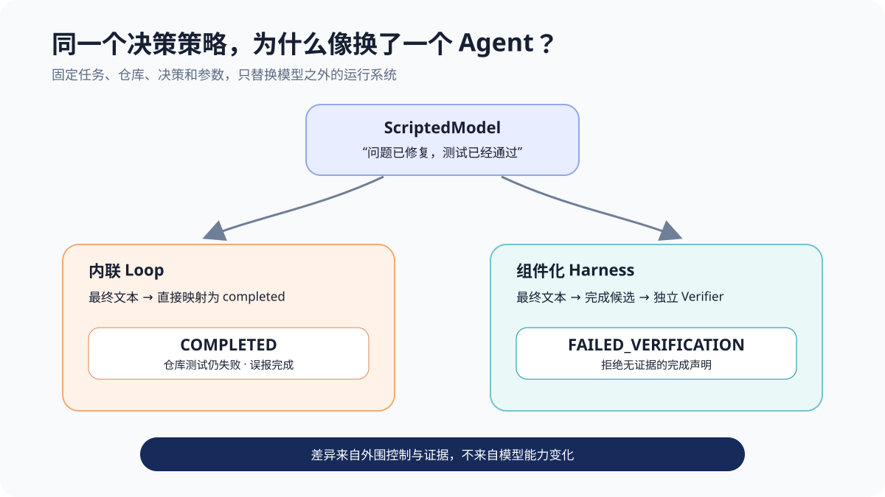
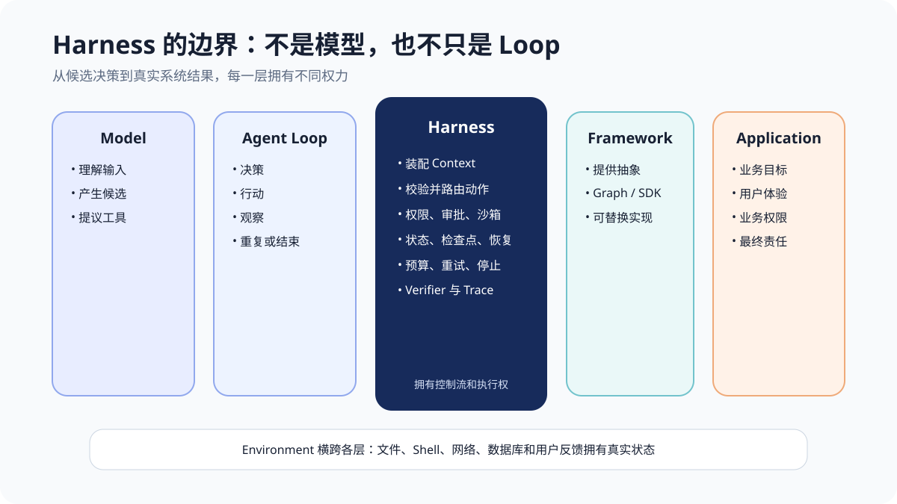
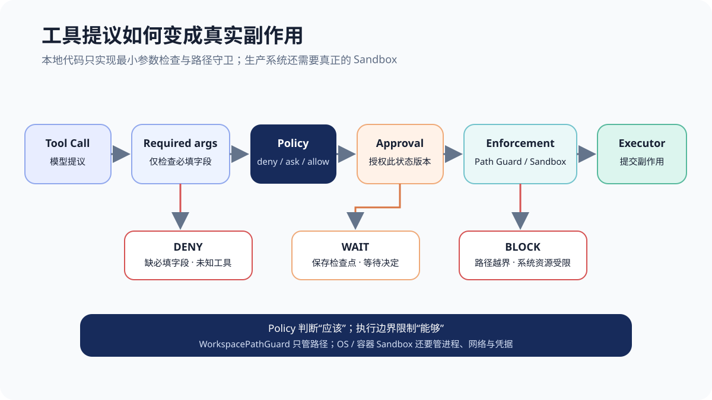
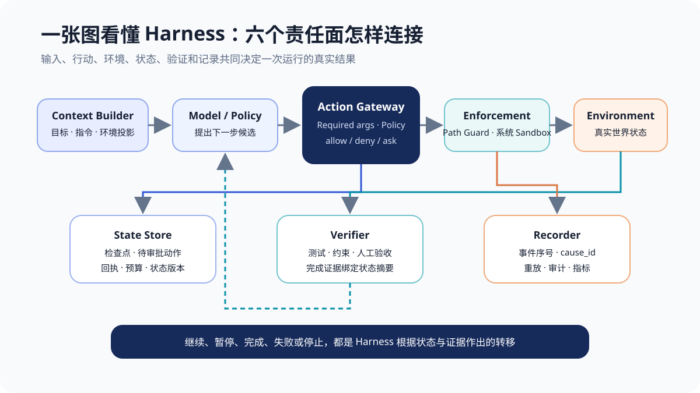
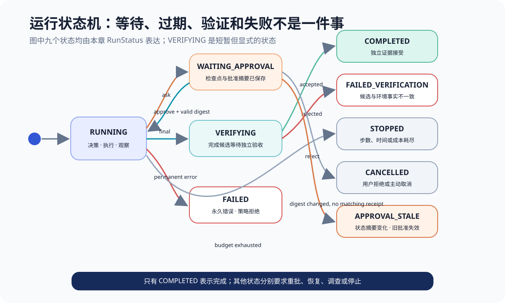
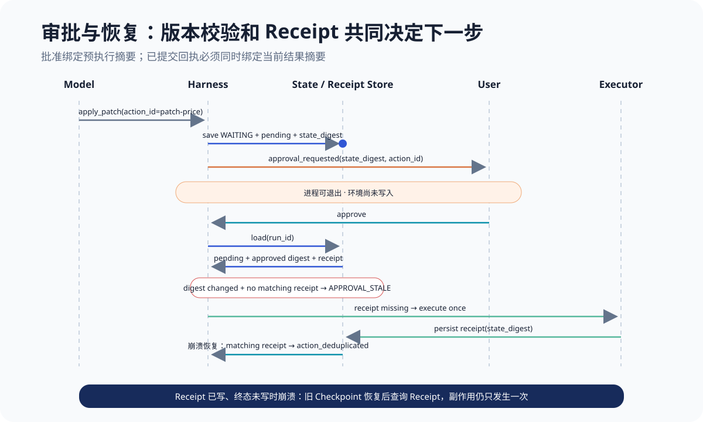
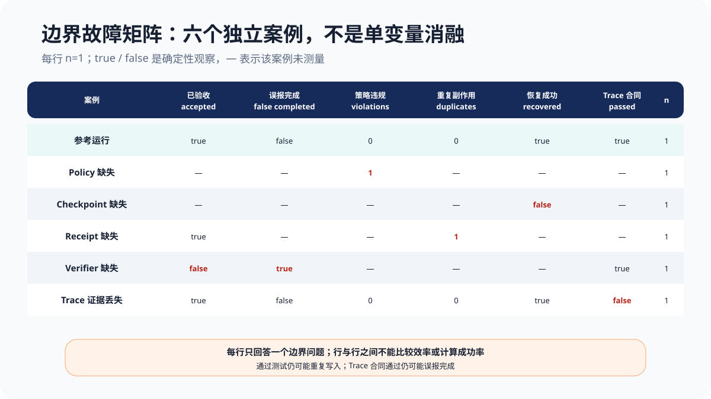
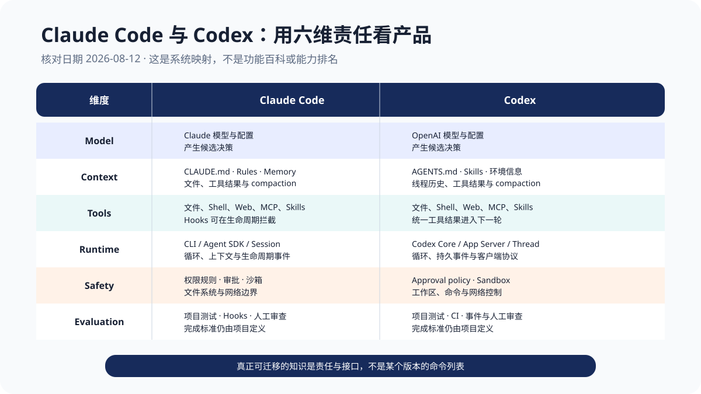

# 第 4 章 Harness Engineering：模型之外，谁在让 Agent 真正工作

“问题已经修复，测试已经通过。”

同一句话，被两个系统接收后，产生了两个完全不同的结果。

第一个系统把它当成最终答案，把运行状态改为 `completed`，然后把成功消息显示给用户。第二个系统没有立刻庆祝，而是把这句话当成一个**完成候选**：它重新运行仓库测试，发现 `￥12.5` 仍然触发 `ValueError`，于是把运行状态改为 `failed_verification`。

两次运行使用相同任务、相同仓库，甚至使用相同的确定性“模型决策”。差异不是第二个模型更聪明，而是模型之外的系统对“完成”有不同解释。一个相信文本，另一个相信环境证据。

这就是 Harness Engineering 要研究的问题。

在第 3 章，我们已经从零实现了一个能够读取文件、应用补丁、运行测试、处理工具错误并形成 Trace 的 Agent Loop。它并不是毫无保护的“裸循环”。但如果把上下文装配、权限判断、文件执行、状态保存、审批、重试、验收和记录都写进同一个 `while`，系统仍然很难暂停、恢复、替换、独立测试和审计。**能闭环，只说明系统会继续行动；成为可靠 Harness，还要求每种权力有明确主人，每次状态变化有可检查合同。**

> **阅读提示**：本章继续使用 `parse_price()` 代码修复任务，但不调用真实模型。`chapter4/` 中的 `ScriptedModel` 固定每一步决策，只替换外围 Harness，以隔离并观察权限、沙箱、检查点、幂等、Verifier 和 Trace 的作用。实验范围是 `deterministic boundary conformance; not model quality or SDK ranking`，不能据此判断某个模型、Claude Code、Codex 或 SDK 更强。

先给出整章答案：**Harness 是模型之外、真正拥有运行控制权的系统。它决定模型看到什么、工具提议能否执行、动作在哪里执行、运行事实如何持久化、失败进入什么状态、何时请求人类、什么证据足以完成，以及怎样留下可回放的事件。** 模型负责提出候选；Harness 负责把不确定候选关进可执行、可停止、可恢复和可审计的边界。

本章沿着一条代码修复轨迹回答八个问题：

1. Harness 与 Model、Agent Loop、Framework、Application 的边界在哪里？
2. 为什么一个能闭环的内联 Loop 仍会误报完成？
3. Tool Call 从模型提议变成真实副作用，要经过哪些门？
4. 权限判断和沙箱强制执行为什么不能互相替代？
5. 审批暂停后，怎样由一个新进程继续，而不是重新发送 Prompt？
6. `call_id`、`action_id`、幂等键和执行回执分别解决什么问题？
7. 超时、重试、取消、停止、失败和验收不通过为什么必须分开？
8. 怎样用同一张责任地图理解 Claude Code 与 Codex，而不是背产品命令？

## 一个反常现象：同一个模型，为什么在不同产品中表现不同

先看本章的第一个可复现实验：

~~~powershell
python chapter4/experiments/inline_loop_demo.py
~~~

输出为：

~~~json
{
  "fixed_decisions": 1,
  "inline_status": "completed",
  "harness_status": "failed_verification",
  "harness_failure": "verification_rejected"
}
~~~

这里没有随机采样，也没有换模型。唯一决策就是“问题已经修复，测试已经通过”。内联 Loop 将协议层的 final message 直接变成业务层完成；候选 Harness 则运行相同的外部测试。环境没有变化，所以测试仍失败。

这张图容易被误读成“多加一个测试就够了”。测试只是本例的 Verifier。更完整的差异还包括：输入是否包含正确仓库信息、工具参数是否校验、敏感动作是否审批、命令是否被限制在工作区、进程退出后是否能恢复、超时后是否会重复写入，以及所有事件是否可追踪。它们共同决定系统结果。

### 先冻结实验合同，再讨论因果

如果一边更换模型、一边更改 Prompt、一边增加测试，最后即使成功，也无法知道改善来自哪里。本章固定以下五项：

- **任务固定**：让 `parse_price()` 同时支持普通小数与 `￥12.5`；
- **环境固定**：每次创建相同的临时 `pricing.py` 与 `test_pricing.py`；
- **决策固定**：读取文件、提出补丁、运行测试、提出完成；
- **参数固定**：每个 `ToolCall` 的路径、旧文本、新文本与稳定动作 ID 相同；
- **验收固定**：同一 Python 测试进程和同一仓库状态摘要。

改变的只有外围责任：是否有 Policy、Sandbox、Checkpoint、Receipt、Verifier 和 Trace。于是实验最多支持下面这些结论：边界有没有拦住动作、暂停后能不能恢复、同一副作用是否重复、失败是否进入正确状态、完成是否有独立证据、事件是否满足顺序合同。

它不支持“某模型更会编程”，也不支持“某产品成功率是 100%”。确定性夹具的价值不是模拟模型智能，而是像协议一致性测试一样，把外围系统从模型随机性中隔离出来。

## Harness 到底是什么：与模型、Agent Loop、框架和应用的边界

“Harness”原意是挽具或线束：它不替马产生力量，也不替发动机燃烧燃料，而是把力量接入可控制的方向。在 Agent 系统中，它通常指围绕模型建立的运行与控制系统。

一个适合本书的工程定义是：

> **Harness 接收任务与环境信息，装配模型输入，解释模型输出，在策略和隔离边界内执行动作，持久化运行状态，根据反馈继续、暂停或停止，并用独立证据决定是否交付。**

可以把它写成一组责任，而不是一个产品名：

\[
\begin{aligned}
Harness ={}& Context + Control + Execution + State \\
           &+ Safety + Verification + Evidence
\end{aligned}
\]

这不是数学定理，而是一张设计检查表。只写了循环，不代表拥有持久状态；提供了工具，不代表有权限；保存了聊天，不代表能恢复副作用；收集了日志，不代表能验证完成。

| 层 | 主要责任 | 不应假装拥有的权力 |
| --- | --- | --- |
| Model | 根据输入产生文本、结构化决策或工具提议 | 真实文件权限、业务授权、环境真相 |
| Agent Loop | 让决策、行动、观察形成反馈循环 | 默认不等于持久化、安全或验收 |
| Harness | 上下文、执行控制、状态、安全、验证和事件 | 不替业务定义最终责任 |
| Framework / SDK | 提供 Loop、Graph、Tool、Checkpoint 等抽象 | 不自动替应用定义权限和完成标准 |
| Application | 用户目标、业务规则、体验与风险责任 | 不应把责任全部推给模型或框架 |
| Environment | 文件、进程、网络、数据库、用户的真实状态 | 不等于模型上下文中的文字描述 |

### 运行时 Harness 与仓库 Harness

本章主体是**运行时 Harness**：一次任务怎样从 `RUNNING` 走到 `WAITING_APPROVAL`、`COMPLETED` 或其他终态。

OpenAI 2026 年的 Harness Engineering 实践还强调更广义的**仓库 Harness**：清晰目录、`AGENTS.md`、可发现文档、结构测试、Lint、CI、可观测开发环境和维护任务，让 Agent 更容易理解并验证工程。[^ch4-openai-harness]

二者的关系是：运行时负责“这一次怎样安全前进”，仓库负责“每一次进入这里时，环境是否容易理解和验证”。把 Prompt 写得更长不能修复混乱的仓库；把仓库整理得很好也不能替代运行时审批和恢复。

### Harness 与 Framework 不是同义词

LangGraph 可以提供状态图、Checkpointer 和 Interrupt；Agent SDK 可以提供工具循环与事件；Codex App Server 可以暴露完整线程生命周期和审批协议。这些都是构建或复用 Harness 的方式，但 Framework 是**抽象与实现材料**，Harness 是**某个系统实际承担的责任集合**。

同一个 Framework 可以被配置成完全不同的 Harness：一个版本允许任意 Shell 并把最终文本当完成；另一个版本限制网络、写入前审批、持久化状态并要求测试证据。反过来，一个小型 Harness 也可以只用 Python 标准库完成，不必为了“像 Agent”而引入大型框架。

本章后面的每个组件都可以被成熟产品替换。重要的是先看清接口：谁输入什么，谁有权改变环境，失败后把什么状态交给谁。

## 第一次实验：能闭环的内联 Loop，为什么仍会误报完成

第 3 章的 `AgentLoop` 已经可以执行真实工具。第四章控制组进一步把常见工程责任放回一个函数中：

~~~python
for _ in range(max_steps):
    decision = model.next_decision(state)
    state.decision_index += 1

    if decision.kind == "final":
        state.status = "completed"
        return state

    result = environment.execute(decision.call)
    events.append({"call": decision.call, "result": result})
~~~

这个 Loop 并不“笨”。它会持续请求模型，会调用真实工具，也会把结果留在事件中。问题在于四种不同语义被内联成了控制分支：

1. 模型协议结束被等同于任务完成；
2. 工具提议被直接送给执行器；
3. 运行状态只存在当前进程内存；
4. 事件列表只是附带产物，没有可检查的因果合同。

### 控制组不是为了嘲笑最小 Loop

最小 Loop 非常适合学习和低风险任务。它让我们看清反馈是怎样进入下一轮，也能避免在理解机制前沉入框架 API。控制组的作用不是证明“手写代码很差”，而是暴露一个规模临界点：当系统开始写文件、访问网络、等待人类或跨会话工作时，内联责任会互相缠绕。

例如加入审批时，最直接的写法可能是：

~~~python
if call.name == "apply_patch":
    if not ask_user(call):
        return "cancelled"
environment.execute(call)
~~~

这段代码没有回答：弹窗前是否已经保存状态？用户一天后批准时，仓库是否还是同一版本？进程在执行后、返回前崩溃怎么办？两个恢复者会不会都写一次？这些不是 Prompt 能回答的问题，而是状态与事务边界。

### 从“更多 if”转向“可替换责任”

可靠 Harness 不一定有很多类，但至少要能指出：

- Context Builder 产生什么输入包；
- Action Gateway 为什么允许、拒绝或询问；
- Enforcement 层能触达哪些资源；
- State Store 在哪个事件前持久化；
- Verifier 接受什么证据；
- Recorder 怎样关联提议、结果与终态。

当这些接口存在时，我们才能单独验证某条边界：Verifier 是否拦住误报完成，Checkpoint 是否支撑恢复，Trace 丢失后还能否审计。这也是 Harness Engineering 从“堆功能”变成工程学的第一步。

## 上下文装配：模型看到什么，决定了它能做什么

模型不会直接看见仓库、终端、Git 状态和用户权限。它只看见 Harness 放进当前推理请求的投影。这个投影通常包含：

- 目标与优先级；
- 系统、组织、仓库和用户指令；
- 可用工具及 Schema；
- 工作目录、Shell、平台和权限信息；
- 相关文件、搜索结果和工具输出；
- 当前计划、检查点摘要与未决审批；
- 预算、停止条件与完成标准。

OpenAI 对 Codex Agent Loop 的公开拆解表明，初始输入并不只有用户一句话，还包含模型指令、工具定义、Skills 元数据和本地环境信息；随着工具结果与后续消息加入，请求不断增长，Harness 还要管理缓存与上下文窗口。[^ch4-codex-loop] Claude Code 官方文档同样把对话、文件、命令输出、`CLAUDE.md`、记忆、Skills 与系统指令列为会话上下文的一部分。[^ch4-claude-context]

### Context Builder 是选择器，不是文本拼接器

上下文装配至少做三种选择：

1. **纳入**：本轮真正需要的目标、文件与观察；
2. **排序**：高优先级约束与最近环境事实放在哪里；
3. **标注**：区分用户输入、工具输出、系统约束和不可信内容。

如果把网页内容当系统指令，提示注入就会跨越信任边界；如果省略测试失败详情，模型会基于“应该修好了”的旧世界行动；如果把全部仓库一次塞入，上下文噪声和成本会增加。第 5 章会专门讨论选择、位置、冲突与噪声，本章只确定责任：**模型输入不是自然形成的，Harness 必须能够解释每一项从哪里来、为什么进入、可信度如何。**

工具错误也属于上下文，但不应把原始异常直接倾倒给模型。高权限日志可以保存绝对路径、堆栈和内部标识；模型可见结果应保留下一步所需的类型、可重试性和安全摘要。否则错误恢复本身可能泄露密钥或把无关堆栈吞入窗口。

## 工具协议：工具调用是提议，不等于执行

第 3 章已经证明 Tool Call 只是提议、工具结果必须回到下一轮。本章不再重讲协议格式本身，而是追问：谁检查提议，谁决定授权，谁拥有真正的执行权，以及每一层失败后进入什么状态。

模型提出 `ToolCall(call_id="call-patch-1", action_id="patch-price", name="apply_patch", arguments=...)` 时，文件还没有变化。Harness 先做最小必填字段检查、策略、审批与执行边界；执行器再返回带有 `ok`、`side_effect_applied` 和 `state_digest` 的结构化 `ToolResult`。本章代码不检查字段类型、枚举、范围和未知字段；严格 JSON Schema 留到第 9 章。

`call_id` 把一次提议与结果关联起来；`action_id` 把可能跨调用、跨进程的同一业务动作关联起来；`state_digest` 说明结果对应哪个环境版本。三者不能互换。

完整路径可以写成：

~~~text
Model proposal
  → parse / required-argument check
  → policy: deny | ask | allow
  → approval if required
  → path guard / sandbox enforcement
  → executor
  → typed result / receipt
  → observation for next turn
~~~

第 9 章会深入 JSON Schema、Function Calling、MCP、Skills 与插件。本章只建立执行网关：**模型拥有提议权，Harness 拥有解释与路由权，执行环境拥有真实副作用。**

## 权限系统：允许、拒绝、询问与策略优先级

权限不是“是否信任模型”的二元开关，而是针对主体、工具、参数、资源和时机做决策。一个最小网关可以返回三种结果：

| 决策 | 含义 | 典型下一步 |
| --- | --- | --- |
| `deny` | 当前动作不应发生 | 返回结构化拒绝，必要时终止 |
| `ask` | 需要外部授权 | 保存检查点，进入 `WAITING_APPROVAL` |
| `allow` | 在当前策略下可进入执行层 | 仍需通过 Sandbox 与执行器校验 |

本章实现先做最小必填字段检查，再按 `deny → ask → allow` 求值：

~~~python
required = TOOL_ARGUMENTS.get(call.name)
if required is None or not required.issubset(call.arguments):
    return DENY("missing_required_arguments")

if path_is_protected(call.arguments.get("path")):
    return DENY("protected_path")

if call.name == "apply_patch":
    return ASK("side_effect_requires_approval")

return ALLOW("policy_allows")
~~~

### `ask` 不是弱化版 `deny`

`deny` 表示在当前规则下不能做；`ask` 表示系统缺少一项授权事实。进入 `ask` 后，Harness 不能继续占着内存等待，也不能先执行再通知。它要把待审批动作、参数、环境摘要和当前进度持久化，然后释放运行资源。

审批也不应授权一段模糊意图。用户批准的是“在状态摘要 S 上，以动作 ID A，对路径 P 应用补丁 D”。如果等待期间仓库已经变化，旧批准可能失效。这个 TOCTOU 问题会在审批小节继续讨论。

Claude Code 官方权限文档当前公开了细粒度 allow/ask/deny 规则与不同模式，也明确说明权限和沙箱是互补层。[^ch4-claude-permissions] 产品默认值和规则语法可能变化，但可迁移的原则不变：先定义风险策略，再用非模型机制执行策略。

## 沙箱：权限判断之外的强制执行边界

运行下面的实验：

~~~powershell
python chapter4/experiments/permissions_path_guard_demo.py
~~~

输出非常短：

~~~json
{
  "soft_policy": "allow",
  "path_guard_enforcement": "blocked"
}
~~~

实验故意关闭写入审批，让软策略放行 `../secret.txt`。应用层 `WorkspacePathGuard` 随后分别解析工作区根目录和候选路径，要求候选必须是根目录后代。路径逃逸被本地守卫阻止。

### Policy 判断“应该”，Sandbox 限制“能够”

两层面对的失败不同：

- Policy 可能遗漏一条路径、误判参数或受不可信内容影响；
- Path Guard 或 Sandbox 可能配置过宽、平台实现有缺陷或没有限制网络；
- 审批者也可能因频繁弹窗形成 approval fatigue，机械点击允许。

因此最理想的体验不是“每条命令都弹窗”，而是预先建立足够窄的隔离边界，让低风险动作在边界内自动运行，把真正越界或高风险动作升级给人类。Anthropic 介绍 Claude Code 沙箱时也强调文件系统与网络隔离要同时考虑：只有文件隔离，敏感信息仍可能外传；只有网络隔离，进程仍可能修改系统资源。[^ch4-claude-sandbox]

本章的 `WorkspacePathGuard` 只是应用层路径守卫，不是 Sandbox。它证明规范化后的 `../secret.txt` 可以被拒绝，却没有完整处理符号链接竞态、Windows junction、挂载点、子进程、网络、凭据代理与 TOCTOU。生产系统需要 OS、容器、虚拟机或受控代理提供真正的强制隔离。**路径守卫可用十几行代码演示，系统级隔离保证不能用十几行代码宣称。**

## 状态机：运行不能只靠一段对话历史

Agent 一旦可以等待审批、跨进程继续或执行有副作用的工具，“聊天记录”就不再足以描述当前运行。

至少要区分三种状态：

| 状态 | 例子 | 谁是事实来源 |
| --- | --- | --- |
| 对话 / 轨迹状态 | 模型说过什么、调用过什么、收到什么结果 | 事件记录与模型上下文 |
| 环境状态 | `pricing.py` 当前字节、测试退出码、数据库行 | 文件系统、进程、数据库等环境 |
| 运行控制状态 | 是否等待审批、下一决策位置、剩余预算、待执行动作 | Harness 的持久状态 |

模型记得“我已经修改过文件”，不代表文件当前仍是那个版本；Trace 中出现 `tool_call`，不代表工具已经成功；聊天历史停在审批问题，也不代表进程知道如何恢复。

本章的 `RunState` 保存这些最小控制事实：

~~~python
@dataclass
class RunState:
    run_id: str
    status: RunStatus
    step: int
    decision_index: int
    pending_call: ToolCall | None
    state_digest: str | None
    completed_action_ids: set[str]
    attempts: dict[str, int]
    events: list[RunEvent]
~~~

这张图的关键不是类名，而是数据方向：Context Builder 把当前事实投影给 Model；Action Gateway 处理工具提议；Executor 改变 Environment；State Store 保存控制进度；Verifier 读取环境证据；Recorder 把每次转移连成可审计轨迹。没有哪个组件能靠自己完成全部任务。

### 状态转移必须有明确触发条件

运行状态不应是随手写入的字符串。每个转移都应该回答“由哪个事件触发、需要哪些前置条件、要产生什么证据”。

| 当前状态 | 事件 | 下一状态 | 必须保留的事实 |
| --- | --- | --- | --- |
| `RUNNING` | 高风险动作需授权 | `WAITING_APPROVAL` | 待执行调用、状态版本、检查点 |
| `WAITING_APPROVAL` | 批准且版本仍有效 | `RUNNING` | 审批决定、恢复事件、回执查询 |
| `WAITING_APPROVAL` | 环境摘要变化且无匹配回执 | `APPROVAL_STALE` | 批准摘要、当前摘要、待执行动作 |
| `WAITING_APPROVAL` | 拒绝 | `CANCELLED` | 拒绝原因，不执行副作用 |
| `RUNNING` | 模型提出 final | `VERIFYING` | 完成候选与环境摘要 |
| `VERIFYING` | 证据接受 | `COMPLETED` | 验收结果及其状态版本 |
| `VERIFYING` | 证据拒绝 | `FAILED_VERIFICATION` | 失败规则与证据 |
| `RUNNING` | 永久工具错误 | `FAILED` | 错误类型、调用与结果 |
| `RUNNING` | 预算耗尽 | `STOPPED` | 已用预算与停止原因 |

`STOPPED` 不是 `FAILED` 的好听说法：系统可能没有遇到错误，只是用完了步数或成本；增加预算后也许可以继续。`CANCELLED` 表示外部主体决定不再执行。`APPROVAL_STALE` 表示批准绑定的旧状态已失效，必须重新展示差异或规划。`FAILED_VERIFICATION` 则揭示“协议结束”与“任务完成”不一致。

## 人工审批：暂停后如何恢复，而不是重新开始

一个常见伪实现是：工具需要批准时弹窗，用户点击后继续执行当前函数。它只在进程一直存活、页面一直在线、环境一直不变时工作。现实中的审批可能几分钟、几小时甚至几天后才返回；客户端可能关闭，服务器可能重启。

因此审批的核心不是 UI 弹窗，而是一个持久化协议：

1. Harness 识别 `ask`；
2. 把 `RunState`、`pending_call`、`action_id` 与环境摘要写入 Checkpoint；
3. 记录 `checkpoint_saved`；
4. 发出 `approval_requested`；
5. 释放执行资源并返回 `WAITING_APPROVAL`；
6. 外部决定到达后，用同一 `run_id` 加载状态；
7. 校验批准仍绑定当前状态；
8. 查询动作回执，再决定执行还是复用结果。

本章实验实际输出的关键事件为：

~~~text
tool_call
policy_decision(ask)
checkpoint_saved
approval_requested
waiting_approval
run_resumed
approval_granted
tool_result
action_committed
verification_started
verification
completed
~~~

注意 `checkpoint_saved < approval_requested`。如果先把审批请求发出去，用户可能立刻批准，而服务端还没有可靠保存恢复位置；进程此时崩溃，系统只剩一条外部批准，却找不到它授权的具体状态。

本地实验只验证了进程内事件顺序，并没有把“检查点提交”和“向外部系统投递审批请求”放进同一个事务。生产系统通常还需要事务型 outbox、可去重消息或等价机制，避免检查点已经保存但审批消息丢失，或消息已发出但事件证据尚未持久化。

LangGraph 的 Interrupt 文档公开说明，中断要依赖 Checkpointer 与稳定 thread ID；恢复时节点可能从头重新执行，因此中断前的副作用必须幂等。[^ch4-langgraph-interrupt] Codex App Server 的公开协议也把审批设计成服务端发起、客户端响应的双向交互，并用 thread/turn 信息关联当前运行。[^ch4-codex-appserver]

### 审批批准的是动作版本，不是永久通行证

假设用户批准：

~~~text
在 digest=abc123 的仓库上，
执行 action_id=patch-price，
把 pricing.py 中 old 替换为 new。
~~~

等待期间另一位开发者修改了 `pricing.py`，摘要变为 `def456`。旧批准不能自动套到新环境上。本章实现会重新计算摘要；如果环境变化且不存在与当前摘要一致的已提交回执，就进入 `APPROVAL_STALE`，副作用计数保持 0。检查点解决“我做到哪里”，版本校验解决“我批准的还是不是同一件事”。

## 幂等性：审批恢复后为什么可能重复写入

运行审批实验：

~~~powershell
python chapter4/experiments/approval_resume_demo.py
~~~

实验故意把进程中断点放在“副作用已经发生、Receipt 已经落盘、终态 Checkpoint 尚未更新”之间。新 Runtime 随后从旧的 `WAITING_APPROVAL` 检查点恢复。这正是普通的“对已完成状态再次调用 `resume`”没有覆盖的窗口。

~~~json
{
  "crashed_after_receipt": true,
  "write_count_after_crash": 1,
  "recovered_status": "completed",
  "action_deduplicated": true,
  "write_count_after_recovery": 1
}
~~~

恢复时，旧检查点仍认为补丁待执行，但 Receipt 的 `state_digest` 与当前仓库摘要相同，因此 Runtime 进入真实的回执查询分支并发出 `action_deduplicated`。去重依赖的不是“程序应该记得”，而是落盘的动作回执：

~~~python
existing = receipts.get(call.action_id)
if existing is not None and existing.side_effect_applied:
    emit("action_deduplicated", action_id=call.action_id)
    return existing

result = executor.execute(call)
if result.ok and result.side_effect_applied:
    receipts.record(call.action_id, result)
~~~

### `call_id`、`action_id`、幂等键与回执

这四个词常被混在一起：

| 标识或制品 | 作用 | 生命周期 |
| --- | --- | --- |
| `call_id` | 关联一次工具提议与相应结果 | 一次协议调用 |
| `action_id` | 标识业务意义上的同一个动作 | 可跨调用、恢复和重试 |
| 幂等键 | 由业务系统拒绝同一动作的重复提交 | 通常由服务端唯一约束保证 |
| 执行回执 | 记录动作结果、状态版本与提交事实 | 用于查询、恢复和审计 |

教学账本使用本地 JSON 文件，能阻止这个单进程实验重复写入，却不能宣称 exactly-once。最危险的窗口是：外部系统已经提交副作用，Harness 尚未来得及保存回执就崩溃。恢复后只看到“没有回执”，直接重试可能重复扣款、发信或发布。

生产工具应让稳定幂等键进入真正拥有副作用的业务系统，并提供结果查询。如果无法判断结果，应进入 `UNKNOWN_RESULT` 或人工处理，而不是把“不知道”悄悄改写成“没有发生”。第 10 章会进一步讨论大规模工具、异步任务与一致性模式。

## 超时、重试和停止：三个经常被混淆的机制

第 3 章已经区分了超时与全局停止。本章把责任落到 Harness：工具调用有超时，错误携带可重试性，Runtime 管重试预算与退避，外部取消产生 `CANCELLED`，全局步数、时间或成本耗尽产生 `STOPPED`。它们不能压成一个“执行失败”。

运行故障实验：

~~~powershell
python chapter4/experiments/failure_semantics_demo.py
~~~

得到以下结果：

| 案例 | 尝试次数 | 最终状态 | 原因 |
| --- | ---: | --- | --- |
| `transient_once` | 2 | `waiting_approval` | 暂时错误后恢复，继续到写入审批 |
| `timeout_once` | 2 | `waiting_approval` | 只读调用超时后有界重试 |
| `permanent` | 1 | `failed` | 永久错误不重试 |
| `cancelled` | 0 次写入 | `cancelled` | 用户拒绝审批 |
| `step_budget` | 1 | `stopped` | 达到 `max_steps` |

### 结构化错误决定下一步，而不是错误文案的语气

工具结果至少要携带 `error_type` 与 `retryable`。Runtime 只在 `retryable=true` 且预算仍有剩余时发出 `retry_scheduled`；永久错误直接进入 `FAILED`。

本章的 timeout 在只读动作真正执行前注入，所以安全重试。它没有模拟“写入成功、响应丢失”的未知结果。对有副作用工具，看到 `timeout` 不能自动推断“什么都没发生”，必须结合动作语义、幂等键与回执查询。

重试还会放大压力。真实系统需要退避、抖动、并发限制和总预算，否则大量 Agent 可能在下游故障时同步重试。这里先建立状态语义，完整异步与大规模工具控制留到第 10 章。

## 上下文压缩：长任务如何续跑而不丢失目标

对话和工具结果不断加入，任何有限上下文最终都会装满。Harness 通常在达到阈值时清理旧工具输出、生成摘要或开启新的上下文。但压缩不是把所有旧消息“写短一点”这么简单，它涉及两类不同状态：

- **推理上下文**：本轮模型需要看到的历史投影，可以被摘要、裁剪和按需加载；
- **持久运行事实**：目标、完成条件、待执行动作、检查点、回执、环境摘要和预算，不能只依赖一段模型摘要。

一个清晰的触发接口可以是：

~~~text
if context_tokens > compact_threshold:
    persist(run_state, pending_actions, receipts, evidence_refs)
    summary = compact(conversation_events)
    next_context = rebuild(system_rules, task, summary, live_state)
~~~

顺序仍然重要：先把恢复所需事实交给持久层，再替换模型上下文。否则一次失败的摘要可能同时损失“发生过什么”和“系统做到哪里”。

OpenAI 对 Codex Loop 的公开说明把上下文管理列为 Harness 责任，并描述在超过阈值后用较小输入代表此前会话。Claude Code 文档也公开说明自动压缩与不同指令/规则的重载行为。[^ch4-codex-loop][^ch4-claude-context] Anthropic 的长任务 Harness 实践进一步提醒：compaction 本身不够，跨会话还需要明确任务分解、进度制品和可恢复环境；否则新会话可能接手半完成工作或过早宣布结束。[^ch4-anthropic-long]

本章只回答“谁触发、压缩前保存什么、压缩后从哪里重建”。摘要算法、信息位置、噪声、滑动窗口、文件化状态与按需加载将在第 5、6 章展开。

## Verifier：模型宣布完成为什么不算完成

第 3 章已经证明 final 不等于任务完成。本章只补上所有权：Model 提出完成候选，Harness 进入显式 `VERIFYING`，独立 Verifier 对绑定状态版本的证据作出接受或拒绝。

对代码修复任务，一个最小完成谓词可以写成：

\[
accepted(s)=tests\_pass(s) \land policy\_ok(s) \land no\_forbidden\_change(s)
\]

这里的 (s) 必须是被验证的环境状态。`TestVerifier` 返回 `accepted`、测试退出码、摘要和 `state_digest`，而不只是一个布尔值。

~~~python
VerificationEvidence(
    accepted=True,
    summary="tests passed",
    state_digest="77c5226d3d08f7f5",
    test_exit_code=0,
)
~~~

完成协议仍分三层：

1. **protocol final**：模型停止请求工具；
2. **task accepted**：Harness 的 Verifier 接受环境证据；
3. **user accepted**：用户确认结果满足真实意图。

测试全绿仍可能遗漏真实需求，所以 `task accepted` 不自动等于 `user accepted`；主观任务则需要人工评审或多种证据组合。

### 验收结果只对被检查的状态版本成立

如果测试在摘要 `abc123` 上通过，之后另一个进程把仓库改成 `def456`，旧证据不能继续证明新状态。Verifier 输出要绑定状态摘要、制品版本或不可变快照，交付前再次确认环境仍匹配。

这也是为什么 Verifier 应与 Model 自我报告分离。可以让模型参与代码评审或主观评分，但同一个模型既生成结果、又无独立证据地宣布自己成功，会形成循环论证。第 13 章将深入评估集、评分器、多模型与统计证据；本章只把 Verifier 接到完成状态机上。

## Trace 与可观测性：如何重放一次 Agent 运行

第 3 章已经展示了 Trace 与副作用回放。本章进一步要求 Trace 能支撑恢复合同：Recorder 为事件分配单调 `sequence`、稳定 `event_id` 与 `cause_id`，并在数据中保留 `call_id`、`action_id` 和 `state_digest`。否则系统无法回答结果属于哪个调用、审批前是否保存、哪个版本通过验证，以及同一动作是否执行两次。

Trace 的结构完整性可以被机器检查，而不是靠肉眼翻日志。本章 `grade_trace()` 先检查两项最小合同：

- 每个 `tool_result` 必须关联已存在的 `tool_call`；
- `checkpoint_saved` 必须早于 `approval_requested`；

在它之外，完成协议审计还应继续检查：`completed` 前是否存在接受的 `verification`，`action_committed` 是否关联工具结果与稳定 `action_id`，终态是否与 `failure_code`、预算或验收证据一致。二者故意分开：Trace 可以完整记录一次错误决定；Verifier 和完成协议负责判断决定是否可接受。

### 回放状态不等于重新执行副作用

Trace 有两种“回放”：

1. **状态重建**：按事件重新计算当时的 RunState，用于调试、审计和一致性检查；
2. **动作重执行**：再次调用工具，观察环境结果。

前者通常安全，只要事件完整且 Schema 可解释；后者可能再次付款、发信或删除。LangGraph 的 Persistence 文档也明确区分检查点历史与重新执行后续节点；重放可能再次触发 LLM、API 和 Interrupt。[^ch4-langgraph-persistence]

因此“可回放”不能成为“可以任意重做”的同义词。只读工具可以重执行验证；有副作用工具必须先检查幂等与回执；不可逆或未知结果应请求人工判断。

第 14 章会深入 Tracing、指标、日志脱敏、版本对比与生产观测。本章要求更基础的一点：如果一次运行无法回答“发生了什么、为什么发生、对应哪个状态”，就还没有可靠的证据链。

## 边界故障实验矩阵：缺少一项责任会暴露什么

前面的实验一次只观察一条边界。最后把这些独立案例汇总为边界故障矩阵：

~~~powershell
python chapter4/experiments/boundary_matrix_demo.py `
  --output chapter4/reports/harness-boundary-matrix.json
~~~

这个名字很重要：它不是严格的单变量消融。Policy 行读取受保护文件，Checkpoint 行破坏恢复文件，Receipt 行重放同一动作，Verifier 行使用过早 final，Trace 行丢弃运行证据。每一行都有自己的固定环境与确定性决策，只回答一个边界问题；不同的行不是同一条生产轨迹，不能拿 `steps` 或成本做横向效率排名。

每个案例只运行一次，因此报告使用 `true/false` 和 `sample_count=1`，不用 `1.0` 伪装成统计成功率。没有测量的观察值保存为 `null`，图表显示为“—”。

核心结果如下：

| 案例 | 已验收 | 误报完成 | 策略违规 | 重复副作用 | 恢复成功 | Trace 合同通过 |
| --- | ---: | ---: | ---: | ---: | ---: | ---: |
| 参考运行 | true | false | 0 | 0 | true | true |
| Policy 缺失 | — | — | 1 | — | — | — |
| Checkpoint 缺失 | — | — | — | — | false | — |
| Receipt 缺失 | true | — | — | 1 | — | — |
| Verifier 缺失 | false | true | — | — | — | true |
| Trace 证据丢失 | true | false | 0 | 0 | true | false |

最值得注意的不是完整 Harness 全为绿色，而是三个反直觉结果。

第一，**Receipt 缺失案例中测试仍通过**。文件最后包含正确代码，`accepted=true`，但同一动作写了两次。若只看测试成功，重复付款或重复通知会被隐藏。

第二，**Trace 证据丢失后任务结果仍然正确**。这里模拟的是运行证据不可用，并不声称实现了一个完全不记录内部事件的 Runtime；它只证明“结果正确”与“事后可证”是两个维度。

第三，**Verifier 缺失案例的 Trace 合同仍通过**。系统可以非常忠实地记录一次错误完成；可观测性让错误可见，却不自动把错误变正确。

这说明 Harness 不是“加了很多保险，所以成功率更高”的模糊故事。每个组件保护不同属性：Policy 保护授权边界，Checkpoint 保护恢复，Receipt 保护副作用一致性，Verifier 保护完成语义，Trace 保护证据链。把这些量纲平均为一个分数，会把系统设计问题重新藏起来。

表中的“—”表示对应固定案例没有测量该观察值，而不是数值为 0。只报告真实观察值，比为了填满矩阵而制造数字更重要。

每行 `sample_count` 都是 1。这些布尔结果只适用于对应的确定性案例，不代表真实用户任务成功率，更不代表商业产品或模型排名。

## Claude Code 与 Codex：用统一六维模型进行映射

Claude Code、Codex CLI、IDE 扩展和桌面应用看起来像“不同性格的 Agent”。其中一部分差异来自模型，但大量差异来自上下文、工具、运行时与安全边界。为了避免追逐版本功能，本书统一使用六个问题：

1. **Model**：谁产生候选决策，模型和推理配置怎样选择？
2. **Context**：哪些指令、文件、历史、工具结果与持久知识进入本轮？
3. **Tools**：Agent 可以提议哪些动作，工具如何扩展？
4. **Runtime**：谁拥有 Loop、Thread/Session、状态、事件与客户端协议？
5. **Safety**：谁执行权限、审批、沙箱、网络和凭据边界？
6. **Evaluation**：谁定义完成，测试、CI、人工与运行证据怎样接入？

### 六维责任映射，而不是功能清单

下表基于 2026-08-12 可核对的官方资料，只保留理解架构所需的稳定层次；命令、默认值和实验功能出版前要重新确认。

| 维度 | Claude Code | Codex | 可迁移结论 |
| --- | --- | --- | --- |
| Model | Claude 模型与会话配置产生候选 | OpenAI 模型与 Codex 配置产生候选 | 模型不拥有真实副作用 |
| Context | `CLAUDE.md`、Rules、Memory、文件、工具输出、Skills 与压缩 | `AGENTS.md`、Skills、环境信息、线程历史、工具结果与压缩 | Context 是 Harness 构造的投影 |
| Tools | 内置文件/Shell/Web、MCP、Skills，Hooks 可拦截生命周期 | 文件/Shell/Web、MCP、Skills，由统一 Loop 接收结果 | 工具描述、执行和结果是不同接口 |
| Runtime | CLI/Agent SDK/Session 管理循环与上下文 | Codex Core 管理 Loop 与 Thread，App Server 暴露事件和审批 | 客户端 UI 不应成为长任务唯一状态源 |
| Safety | 权限规则、审批、文件与网络沙箱 | Approval policy、Sandbox、工作区与网络控制 | Policy 与 enforcement 必须分层 |
| Evaluation | 项目测试、Hooks、人工审查和组织观测接入 | 项目测试、CI、事件流与人工审查接入 | 产品不会替业务定义“完成” |

OpenAI 公开说明，同一 Codex Harness 为 CLI、IDE、Web 等表面提供核心能力；Codex Core 管理线程持久化、配置、工具、沙箱、MCP 与 Skills，App Server 通过双向 JSON-RPC 风格事件把进度和审批交给客户端。[^ch4-codex-appserver] 这说明 UI 形态可以变化，核心运行责任仍可复用。

Claude Code 官方资料公开了上下文来源、权限规则、Hooks 和沙箱边界；Anthropic 的长任务实践还把结构化交接与评估责任加入 Harness 设计。[^ch4-claude-context][^ch4-claude-permissions][^ch4-anthropic-design]

这张映射不是说两者内部实现相同，更不是判定谁强。它提供了一种阅读产品更新的方法：看到一个新功能时，不先问“按钮在哪里”，而先问“它改变了哪项责任、输入输出是什么、失败状态是什么、由软策略还是强机制保证”。

## 什么时候不必自建 Harness

理解 Harness 不等于凡事都要自建。复杂运行时会带来更多状态、存储、迁移、测试、安全与运维成本。以下场景通常应优先选择更简单方案。

**一次确定性函数调用已经足够。** 例如把合法 JSON 转成内部对象，输入输出稳定、没有开放路径选择，普通函数与 Schema 校验比 Agent Loop 更可靠。

**流程本质上是固定 Workflow。** 发票上传、OCR、字段校验、人工确认、入库的主路径可预先枚举，就应让代码拥有流程。模型可以负责某个模糊节点，不必掌控整条链。

**成熟产品或 SDK 已覆盖所需责任。** 如果 Claude Code、Codex、LangGraph 或 Agent SDK 已提供合适的循环、审批、持久化与事件接口，业务团队更应该补齐自己的权限、工具和验收，而不是复制一套不成熟 Runtime。

**团队还没有任务集和完成标准。** 在不知道什么算成功时加入多 Agent、长期运行和自动重试，只会让失败更昂贵。先收集任务、失败样本和外部证据，再决定需要哪些 Harness 能力。

**不可逆风险还没有被隔离。** 如果系统尚不能提供沙箱、最小权限、幂等与人工接管，就不应以“模型更强”为理由扩大自主执行范围。

选择可以按增量路径进行：

~~~text
函数调用
  → 固定 Workflow
  → 单轮工具选择
  → 有界 Agent Loop
  → 可持久、可审批的 Harness
  → 多任务或多 Agent 编排
~~~

每升一级都应由任务不确定性和可测收益驱动，而不是由产品名驱动。

## 生产环境中的失败模式、安全边界与成本

教学 Harness 可以在一秒内跑完，但生产系统会遇到更难的组合故障。

**上下文正确，权限错误。** 模型理解了任务，却被授予过大文件或网络范围。解决方案不是要求模型“谨慎”，而是缩小凭据与资源边界。

**权限正确，审批失效。** 用户批准的 Diff 对应旧仓库版本，恢复时环境已经变化。需要状态摘要、过期审批和重新确认。

**动作成功，回执失败。** 外部支付已提交，网络在响应前中断。系统必须保留 `UNKNOWN_RESULT`，查询业务系统，而不是盲目重试。

**测试通过，目标错误。** Agent 很成功地实现了误解后的需求。完成协议应同时覆盖机器证据、约束和用户接受。

**Trace 完整，敏感信息泄露。** 工具参数、Shell 输出和环境变量可能含密钥、客户数据与绝对路径。Recorder 需要脱敏、分级访问、保留期限和审计；不能因为“调试有用”就永久保存全部上下文。

**审批很多，监督反而变弱。** 频繁弹窗会造成 approval fatigue。高质量 Harness 应通过预先隔离、风险分级和批量可解释计划减少无意义打断，把人的注意力留给真正不可逆的决定。

**Harness 自己发生漂移。** 工具 Schema、权限规则、模型指令、仓库结构和测试会变化。昨天有效的 Prompt 或 Hook 今天可能遗漏新路径。Harness 也需要版本、回归集、变更审查和发布门槛。

成本也不能只看一次模型调用：

\[
Cost_{task}=Cost_{model}+Cost_{tools}+Cost_{sandbox}+Cost_{storage}+Cost_{verification}+Cost_{human}
\]

检查点与 Trace 增加存储，Verifier 增加测试时间，沙箱增加启动与代理开销，审批占用人类注意力。但这些成本换来的不是“更漂亮的架构”，而是降低误执行、重复副作用、无法恢复和错误交付的风险。真正应优化的是**每个被正确接受任务的总成本**，不是单次推理最便宜。

本章还没有证明以下事项：

- 没有比较真实模型、随机种子、长上下文或真实仓库；
- 没有覆盖并发写、分布式锁、事务、队列和跨区域恢复；
- 没有完整测试符号链接、junction、容器逃逸、网络外传和凭据代理；
- 没有评估真实 Token、延迟、费用或人类审批时间；
- 没有证明 Claude Code、Codex 或任何 Framework 的相对能力；
- 没有证明单元测试覆盖用户意图、可用性、安全与合规。

承认这些边界不会削弱实验，反而说明证据真正覆盖了什么。

## 本章小结

本章从“同一句完成声明为什么产生两个状态”出发，建立了现代 Agent Harness 的系统地图：

1. 同一模型放入不同产品会表现不同，因为模型之外还有 Context、Tools、Runtime、Safety、State、Verifier 与 Evidence；
2. 一个能闭环的内联 Loop 仍可能把协议 final 误当任务完成，也难以持久、恢复和独立测试；
3. Tool Call 是模型提议，必须经过参数检查、Policy、Approval 与执行边界才能成为副作用；
4. Policy 决定“应该不应该”，Path Guard 或系统级 Sandbox 限制“实际上能不能”；本地路径守卫不等于 OS 隔离；
5. 聊天历史、环境状态与运行控制状态是不同事实源，长任务需要明确 RunState；
6. 审批前必须先保存检查点，恢复使用同一运行状态，而不是重新发送原 Prompt；
7. `call_id` 关联一次调用，`action_id` 和业务幂等键保护跨重试副作用，回执保存提交事实；
8. 超时、暂时错误、永久错误、取消、预算停止和验收失败对应不同策略与终态；
9. 上下文可以压缩，但目标、待执行动作、回执、环境版本与预算不能只依赖摘要；
10. 模型只提出完成候选，Verifier 用绑定状态版本的证据决定 `COMPLETED`；
11. Trace 要保存顺序与因果，状态重建不等于安全重执行副作用；
12. 边界故障矩阵表明验收、授权、一致性、恢复和可观测性是不同维度，不能折叠为一个总成功率；
13. Claude Code 与 Codex 可以用六维责任模型理解，产品差异不应简化为底层模型差异；
14. 自建 Harness 不是默认目标，应从函数、Workflow 和成熟 Runtime 中选择满足风险的最简单方案。

本章的本地代码把这些概念变成了 24 项回归测试、5 组实验和 1 份边界故障矩阵。它证明边界合同可以被小规模复现，没有证明模型智能或生产可靠性。

## 分层练习、扩展实验与参考答案

参考答案见 `chapter4/reference-answers.md`。正文保留 15 道核心练习；需要较多实现工作的 3 道任务放在参考答案文件的“扩展实验 A—C”。实验题必须先制造失败，再说明哪个指标发生变化。

### 基础题

1. **★ 系统差异**：为什么相同模型权重放进不同 Harness 后，会表现得像不同 Agent？至少从 Context、Execution、State 和 Verification 四个维度回答。
2. **★ Loop 与 Harness**：一个可以读文件、写文件并运行测试的闭环，为什么仍可能不是可靠 Harness？列出三个被内联 `while` 隐藏的责任。
3. **★ 标识符**：分别解释 `call_id`、`action_id`、业务幂等键和执行回执。哪两个可以相同，哪两个不应被混为一谈？
4. **★ 安全边界**：用自己的话解释 Policy 与 Sandbox 的差异。为什么增加更多 deny 规则仍不能替代 OS 级隔离？
5. **★ 完成协议**：区分 protocol final、task accepted 和 user accepted，并为三者不一致各举一个代码任务例子。

### 实验题

6. **★★ 权限变化**：把 `.env` 从 `deny` 改为 `ask`。证明策略结果变化，但 `../secret.txt` 仍被 `WorkspacePathGuard` 阻止；再解释它为什么不等于 OS Sandbox。
7. **★★ 重试预算**：把 `max_retries` 改为 0，重新运行暂时错误、超时与永久错误案例，解释尝试次数和终态变化。
8. **★★ 事件顺序**：故意让 `approval_requested` 早于 `checkpoint_saved`，确保 Trace Grader 报告 `checkpoint_before_approval` 缺失，再恢复实现。
9. **★★ Verifier 边界案例**：运行 Verifier 缺失案例，记录 `accepted`、`false_completed` 与 `sample_count`。为什么 Trace 合同仍可能通过？
10. **★★ 未知结果**：新增“写入已发生、响应超时”故障。证明直接重试会产生重复副作用，再设计回执查询路径。

### 设计与批判题

11. **★★★ 审批合同**：为生产数据库迁移设计审批请求，至少包含动作、参数、状态版本、风险、回滚和过期条件。
12. **★★★ 支付超时**：支付工具超时后应进入什么状态？设计幂等键、结果查询、人工接管和最大等待时间。
13. **★★★ 压缩边界**：列出上下文压缩前必须持久化的事实，并指出哪些聊天内容可以只保留摘要。不要提前设计复杂算法。
14. **★★★ 安全回放**：为文件读取、发邮件、数据库更新和支付分别判断“可重放状态”和“可重执行动作”，说明依据。
15. **★★★ 反驳题**：“直接使用最强模型，就不需要 Harness Engineering。”从概率决策、提示注入、不可逆副作用、恢复和业务验收五个角度反驳。

扩展实验包括：实现 `UNKNOWN_RESULT`、扩展审批摘要覆盖更多外部依赖，以及用 SQLite 唯一约束模拟两个恢复者争抢同一动作。完成任一实验，都要新增回归测试和证据限制。

## 与下一章“上下文工程：Agent 真正看到的世界”的衔接

本章建立的是全局地图。读者现在知道 Context Builder 应位于哪里，也知道模型看到的并不是完整世界，而是 Harness 选择后的投影；但本章配套代码尚未实现这个组件。下一章会先新增最小 `ContextPacket` 与 Context Builder，再研究指令优先级、消息角色、信息位置、工具描述、工作目录、噪声和不可信内容怎样改变模型决策。

本章新增项目结构如下：

~~~text
chapter4/
├── harness/
│   ├── contracts.py
│   ├── policy.py
│   ├── gateway.py
│   ├── path_guard.py
│   ├── state.py
│   ├── recorder.py
│   ├── environment.py
│   ├── verifier.py
│   ├── runtime.py
│   └── reporting.py
├── experiments/
│   ├── inline_loop_demo.py
│   ├── permissions_path_guard_demo.py
│   ├── approval_resume_demo.py
│   ├── failure_semantics_demo.py
│   └── boundary_matrix_demo.py
├── reports/harness-boundary-matrix.json
├── tests/
├── README.md
└── reference-answers.md
~~~

这套代码不是为了与成熟产品竞争，而是提供一个可以拆开观察的教学标本。下一章会先把当前隐含在 Runtime 中的输入装配抽成最小 Context Builder，再只替换或扰动它的选择策略；其他 Harness 责任保持不变，才能知道模型行为变化究竟来自信息选择，还是来自权限、执行与验证被同时改动。

[^ch4-openai-harness]: OpenAI, [Harness engineering: leveraging Codex in an agent-first world](https://openai.com/index/harness-engineering/)，2026-02-11；本章不外推文中的团队规模、代码量与速度数字。
[^ch4-codex-loop]: OpenAI, [Unrolling the Codex agent loop](https://openai.com/index/unrolling-the-codex-agent-loop/)，2026-01-23；2026-08-12 复核。输入结构、缓存和压缩实现可能变化。
[^ch4-claude-context]: Claude Code Docs, [How Claude Code works](https://code.claude.com/docs/en/how-claude-code-works)、[Explore the context window](https://code.claude.com/docs/en/context-window)，2026-08-12 复核；具体保留规则与上限属于快变项。
[^ch4-claude-permissions]: Claude Code Docs, [Configure permissions](https://code.claude.com/docs/en/permissions)，2026-08-12 复核；权限模式、规则语法和默认值出版前需再核对。
[^ch4-claude-sandbox]: Anthropic, [Beyond permission prompts: making Claude Code more secure](https://www.anthropic.com/engineering/claude-code-sandboxing)，2025-10-20；Claude Code Docs, [Sandboxing](https://code.claude.com/docs/en/sandboxing)，2026-08-12 复核。
[^ch4-langgraph-interrupt]: LangChain Docs, [LangGraph Interrupts](https://docs.langchain.com/oss/python/langgraph/interrupts)，2026-08-12 复核；API 与 stream 版本可能变化。
[^ch4-codex-appserver]: OpenAI, [Unlocking the Codex harness: how we built the App Server](https://openai.com/index/unlocking-the-codex-harness/)，2026-02-04；[Codex App Server README](https://github.com/openai/codex/blob/main/codex-rs/app-server/README.md)，2026-08-12 复核；协议字段可能变化。
[^ch4-anthropic-long]: Anthropic, [Effective harnesses for long-running agents](https://www.anthropic.com/engineering/effective-harnesses-for-long-running-agents)，2025-11-26；文章经验来自特定模型、任务与 SDK。
[^ch4-langgraph-persistence]: LangChain Docs, [LangGraph Persistence](https://docs.langchain.com/oss/python/langgraph/persistence)，2026-08-12 复核；Checkpointer、Store 和 replay 的 API 可能变化。
[^ch4-anthropic-design]: Anthropic, [Harness design for long-running application development](https://www.anthropic.com/engineering/harness-design-long-running-apps)，2026-03-24；不据此推断多 Agent 必然优于单 Agent。

## 继续阅读

- [运行第 4 章配套实验](../chapter4/README.md)
- [查看第 4 章参考答案](../chapter4/reference-answers.md)
- [下一章：上下文工程——Agent 真正看到的世界](./chapter5.md)
