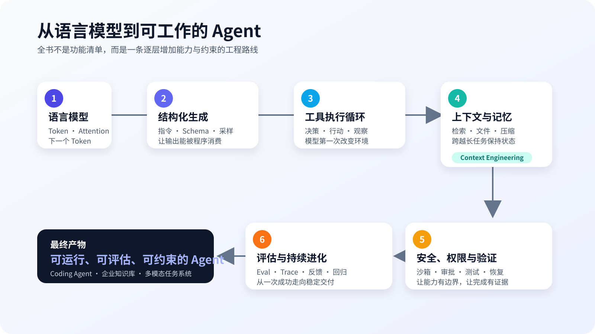

# 引言：为什么现在还需要一本 AI Agent 的书

一个大模型收到文本，生成文本；一个 Agent 收到目标，却可以搜索资料、修改代码、运行测试、发现错误、继续修复，直到交付一个文件或完成一项工作。

它们使用的可能是同一个模型。

真正值得追问的不是“哪个模型更聪明”，而是：**模型之外，究竟多了什么？**

2024 年以前，很多 Agent 教程的主角是 Prompt 模板和框架链式调用。到了 2026 年，Claude Code、Codex 一类 Coding Agent 已经把模型放进真实工作环境：它们能读取代码库，调用终端，维护长任务状态，按权限执行动作，用测试验证结果，也能通过 MCP、Skills 和子 Agent 扩展能力。[OpenAI 在 2026 年的工程文章](https://openai.com/index/equip-responses-api-computer-environment/)中把这套组合拆成编排、Shell、容器、Skills 与上下文压缩；[Claude Code 的文档](https://code.claude.com/docs/en/how-claude-code-works)则把工作循环概括为收集上下文、采取行动、验证结果。两套系统表述不同，核心事实一致：**Agent 不是一个更长的 Prompt，而是模型、上下文、工具、环境、反馈与控制共同组成的闭环系统。**

这也是本书的主线。

## 从“认识名词”转向“解释行为”

学习 Agent 最容易掉进两个陷阱。

第一个陷阱是只学框架。复制一段 LangChain 或 LangGraph 代码，很快就能做出会调用搜索工具的演示；一旦工具返回异常、上下文过长、模型重复调用或执行了危险命令，抽象层下面发生了什么却看不见。

第二个陷阱是只讲概念。Token、Attention、RAG、Memory、MCP、Multi-Agent，每个名词都能解释，却无法回答一个工程问题：为什么这个 Agent 在五步任务上表现很好，到了二十步就开始遗忘目标？

本书用行为反推系统。每一章先提出一个能被观察的问题，再建立最小实现，记录轨迹，制造失败，最后才对照框架和成熟产品。LangChain、LangGraph、CrewAI、OpenAI Agents SDK、Claude Agent SDK 都会出现，但它们是对照组和生产工具，不是知识结构本身。

## 全书只有一条演进路线

我们会从一个极小的语言模型心智模型出发：文本被切成 Token，Token 被映射成向量，Transformer 根据上下文计算下一个 Token 的概率。随后逐层加入能力：

1. 加入清晰指令与结构化输出，让一次生成可被程序使用；
2. 加入工具与执行循环，让模型的提议能改变外部环境；
3. 加入上下文、记忆与检索，让它在长任务中保留必要信息；
4. 加入沙箱、权限、重试和验证，让行动可控且可恢复；
5. 加入评估、轨迹与反馈，让系统能够被测量和改进；
6. 最后再讨论多模态和 Multi-Agent，因为并行协作只有在单 Agent 的边界已经清楚之后才有意义。

这条路线刻意把“模型能力”和“系统能力”分开。模型权重中的知识、当前上下文中的信息、工具可访问的数据、文件系统中的状态，以及程序施加的权限边界，不应被含糊地统称为“Agent 记住了”或“Agent 知道”。后续所有架构判断都建立在这个区分上。

## 为什么从 Coding Agent 切入

Coding Agent 是理解现代 Agent 最好的实验场之一。

代码任务有明确环境：仓库和文件系统；有真实动作：搜索、编辑、执行命令；有相对客观的反馈：编译、测试、静态检查和差异；有显著风险：误删文件、泄露密钥、执行不可信脚本；还有可保存的完整轨迹。很多在聊天机器人里难以观察的问题，在 Coding Agent 中都会变得具体。

例如，“模型会不会自我纠错”可以拆成四个可验证问题：

- 它是否主动运行了正确的测试？
- 测试失败后是否读取了真正相关的错误信息？
- 它是否修改了导致失败的根因，而不是绕过测试？
- 完成时是否有新的证据支持“已经修好”？

当这些问题能被记录和评分，“智能”就不再只是主观印象。

## 如何使用本书

如果你第一次接触大模型，按顺序阅读并完成每章的“最小实验”。如果你已经做过 RAG 或工具调用，可以快速浏览前两章，但不要跳过第 3、4 章：模型、Workflow、Agent 与 Harness 的边界，是后续理解 Claude Code、Codex 和各种 Agent SDK 的共同地基。

代码实验遵循三条约定：

- 优先用原生 Python 和模型 API 暴露机制，再用框架重构；
- 每个子项目独立安装、独立运行，不依赖隐藏的全局状态；
- 每个结论尽量附带日志、测试、轨迹或成本数据，并至少保留一个失败案例。

全书不会承诺某个框架永远是“最佳选择”。产品和模型更新很快，因此容易变化的模型名称、接口参数与功能状态会放进独立资料台账，并标注核对日期；正文优先保留稳定的概念、协议与工程方法。

## 第一问

现在先把所有 Agent 框架放到一边。

如果大模型的训练目标只是预测下一个 Token，它为什么能写代码、解释概念，甚至表现出规划与纠错？回答这个问题之后，我们才有资格讨论如何让它调用工具。

这就是第 1 章的起点。
