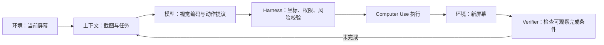

# 第 1 章练习参考答案与验收标准

参考答案用于自检，不是唯一写法。开放题首先看边界是否清楚、证据是否可复现，其次才看措辞是否与示例一致。

## 1. 字符、字节与 Token

字符是 Python/Unicode 层面的文本单位，UTF-8 字节是编码后的存储单位，Token 是具体 tokenizer 根据词表和规则产生的模型单位。答案应附输入文本、Python 与 `tiktoken` 版本、编码器名称和三项实际计数。

## 2. 移除因果遮罩

没有遮罩时，第 (i) 个训练位置可以读取第 (i+1) 及其后的真实 Token，相当于从输入中直接看到目标。验收时应展示遮罩前后的权重矩阵，并指出原来严格为 0 的上三角出现了非零权重。

## 3. Bigram 的局限

合格答案至少给出三类失败：主题漂移、句法未闭合、实体或约束不一致。自注意力提供更长的信息通路，但“能够读取更远位置”不保证模型一定正确使用信息。

## 4. 温度与正确性

温度趋近 0 时，最高 Logit 候选占比增大，采样更接近确定性。稳定只表示运行间差异减小；如果最高分候选本来就是错误答案，低温会更稳定地重复错误。

## 5. 三种“记住”

- 当前会话：把偏好保留在消息历史中，会话结束后失效。
- 外部记忆：经用户授权写入数据库或配置文件，下次检索进上下文，可查看和删除。
- 后续训练：把经过治理的数据放入训练集并更新参数，成本高，难以逐条追踪和撤回。

隐私分析至少包括授权、保存期限、可删除性、访问控制和训练数据治理。

## 6. 超长上下文与按需搜索

成本方面，完整代码库会增加 Token、延迟和缓存占用；相关性方面，无关文件会制造噪声与版本冲突；可验证性方面，搜索结果带有路径和定位，更容易追踪模型依据。高质量答案还应承认搜索可能漏召回，因此需要迭代搜索和测试兜底。

## 7. LLM 与 Coding Agent

示例：LLM 根据输入生成下一步文本或结构，本身不直接读写你的电脑。Claude Code、Codex 一类 Coding Agent 用 Harness 把模型连接到代码搜索、文件编辑和终端，并通过权限、循环和测试把模型提议变成可验证的修改。

## 8. “随机拼接”

支持现象可以是模型复现高频片段或生成局部流畅但事实错误的文本；反对现象可以是它能解决经过变量替换、结构变化的新题。更准确的表述是：模型按上下文概率生成，并可能同时表现出记忆、模式组合与泛化，不能概括为从语料中随机复制片段。

## 9. 记忆还是规则

应构造同一规则下的新表面形式、反事实变量、难度梯度和时间隔离测试集，并与原题及近邻改写比较。控制提示、模型版本和采样配置，报告多次运行结果。仅测试一道改写题不能排除数据污染。

## 10. “已发送”但无日志

可能根因包括：模型虚构完成状态；工具定义未进入上下文；调用被权限层拒绝；执行器失败但结果未返回；日志系统漏记；Agent 在看到失败后仍错误总结。排查应核对模型输出、结构化工具调用、执行器日志、权限决定和外部邮箱状态。

## 11. 低温不能消除幻觉

低温只重塑已有生成分布，不会补充实时汇率。可靠流程应查询权威汇率源，记录币种、时间和数据来源，校验返回结构，再由模型组织答案；高风险换汇还要明确买入/卖出价和手续费。

## 12. 多模态 Agent 边界

一个最小可验收流程如下：

`C -> M` 的表示转换和候选生成发生在模型计算内；`H -> T -> E2 -> V` 属于运行时。截图和新界面都是环境状态，模型输出的点击只是提议，不是已执行事实。

## 13. Trigram 对照

实现必须只增加上下文阶数，保持语料、长度和随机种子集合一致。至少运行 20 个种子；人工连贯性需要预先定义评分量表，最好由两名评分者盲评并报告一致性。平均输出长度本身不是质量指标。

## 14. 上下文计费核对

常见组成包括系统指令、工具定义、历史用户消息、历史模型回复、工具结果、图片或音频编码、缓存读写以及预留输出。具体是否计费、如何计费必须以目标模型的官方文档为准。

示范记录（结构示例，不是长期价格承诺）：

| 字段 | 记录 |
| --- | --- |
| 供应商/服务 | OpenAI API |
| 目标模型 | `gpt-5.6`（正式记录还应保留 API 返回的精确快照 ID，不只写“GPT”） |
| 官方页面 | [OpenAI Model guidance](https://developers.openai.com/api/docs/guides/latest-model) 与当日目标模型详情页 |
| 核对日期 | 2026-08-09（正文资料台账已记录） |
| 待核对项 | 系统指令、工具定义、消息历史、工具结果、多模态输入、缓存读写、输出 Token |

这条答案的关键不是把今天的字段背成永久规则，而是保留精确模型 ID、一手文档和核对日期。出版或上线前必须重新核对。
