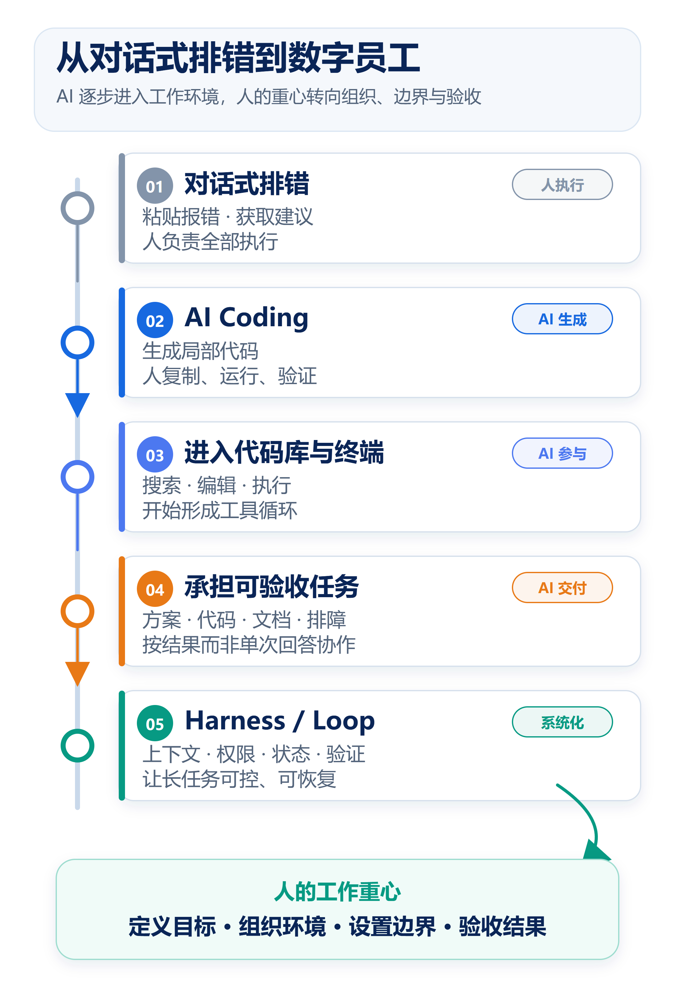
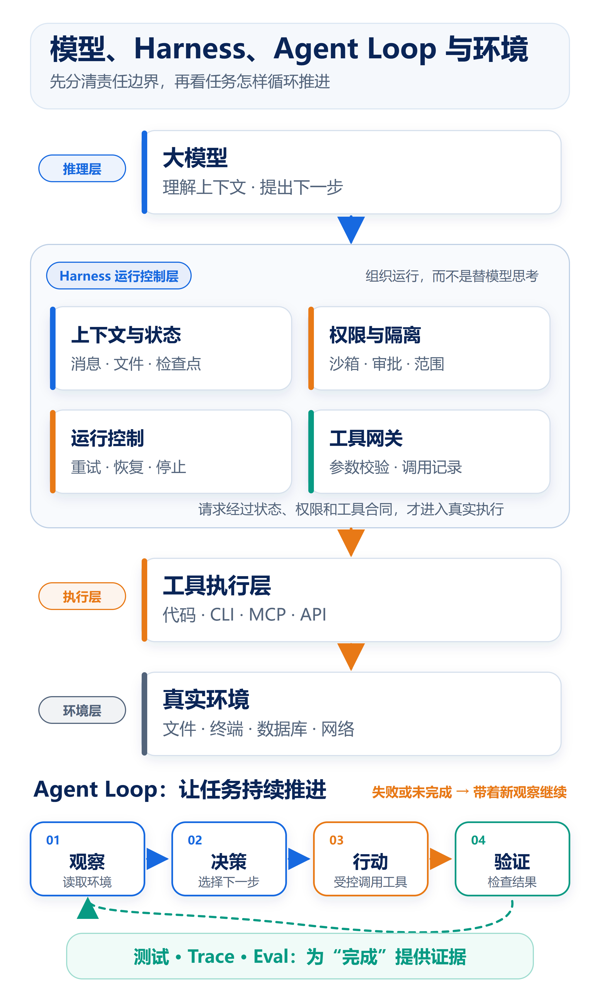
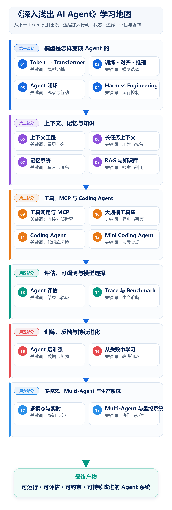

# 从 AI Coding 到数字员工：一条系统学习 AI Agent 的路线

回头看，我的工作方式已经发生了变化。遇到线上问题，我会先让 AI 阅读日志、定位可疑链路，再回到代码库验证；设计新方案时，让它一起梳理约束、比较选项；开始开发后，它还会参与搜索代码、修改文件、运行测试和整理文档。AI 已经进入工作的很多环节。

如果粗略估算，在**我自己的日常工作**中，已经有 60% 以上的环节会使用 AI 参与。这个数字只是个人经验，不能外推，也不意味着这些任务都能交给 AI 独立完成。目标由我确定，关键判断和结果验收也仍由我负责；但 AI 确实承担了大量信息整理、初步分析和执行工作。

奇怪的是，工具用得越多，我反而越清楚地看到另一个问题：**使用越来越熟练，不等于理解越来越系统。**我可以让 AI 修复代码、生成图片、调用工具，也能说出 Agent、MCP、RAG、LangGraph 这些名词，却未必能把它们放进同一张知识地图里，更未必能解释一个 Agent 为什么成功、为什么失败。

这也是我开始整理《深入浅出 AI Agent》的起点。

## 最初，AI 只是对话框里的排错助手

我最早使用 AI Coding 的方式很简单：把报错信息和相关代码贴进对话框，问它“问题可能出在哪里”。它给出原因和修改建议，我复制到编辑器，再手动运行和验证。

这种方式已经很有价值，但当时的 AI 更像增强版问答工具：它看不到完整代码库，不知道命令是否执行成功，也不能根据新结果改变下一步。真正的行动链条仍掌握在人手里。

这段经历后来成了我理解 Agent 的参照点：**能回答问题的模型，与能在环境中持续完成任务的 Agent，中间隔着一整套工程系统。**

## 从给建议，到真正参与工作

之后，我陆续尝试 Trae、DeepSeek、豆包等模型与 AI 编程产品。变化不只是回答更准确，而是 AI 开始进入编辑器、终端和项目上下文：能够读取更多文件、理解模块关系、直接生成修改。我的提问也从“这段代码为什么报错”，变成“这个需求应该改哪些模块”。

再到 Claude Code、Codex 这类 Coding Agent，我与 AI 的协作单位继续变大。它不只是生成一个函数，而是可以搜索代码库、编辑多个文件、运行命令和测试，再依据结果继续修正。过去由我反复执行的“阅读—修改—验证”开始形成一个可持续的循环。

现在，AI 会参与方案设计、代码开发、文档输出和线上排障。称它为“数字员工”，不代表它能无人监管，更不代表人可以退出过程。这个比喻想表达的是：我不再只索取一句答案，而是在给它目标、背景、工具和边界，让它承担一段可以检查的工作。

与此同时，我花在逐行敲代码上的时间变少，花在定义问题、补充上下文、设置验收条件和判断结果上的时间变多。效率提升不只来自模型“更聪明”，也来自人与 AI 之间的工作接口被重新设计。

## 尝试得越多，知识反而越碎

我接触的范围也不断扩大：从命令行与 Coding Agent，到将指令和资源封装为可复用能力的 **Skill**，以及让 Agent 连接外部工具和数据源的通用协议 **MCP**；从 LangChain、LangGraph，到 RAG、记忆和知识库；再到图片、视频生成等多模态应用。每次尝试都解决了具体问题，也带来了新的抽象。

零散学习的问题很快显现：我会配置 MCP Server，却说不清它与函数调用、Skill 的边界；能跑通 RAG Demo，却不知道效果变差来自切分、召回、重排还是生成；使用 Claude Code 或 Codex 完成了任务，却很难判断能力究竟来自模型、上下文、工具，还是模型外的工程设计。

这种状态很容易让学习被产品更新牵着走。Demo 越积越多，知识却没有稳定连接。一旦任务变长、上下文混乱、工具失败或权限受限，之前“会用”的经验就很难迁移。

我逐渐意识到，真正需要补上的不是另一份工具清单，而是一条能够解释这些变化的主线。

## 转折点：从关注模型，走向 Harness 与 Loop

我们很容易把 Agent 的能力全部归因于模型，任务做不好就先换模型。但同一模型放进不同产品，表现可能完全不同。差异往往来自模型之外：它能看到什么上下文、使用哪些工具，命令在哪里运行，权限如何控制，失败后是否重试，长任务怎样保存状态，结果怎样验证。

我把这套模型外部系统称为 **Harness**：也就是**围绕模型组织上下文、工具、权限、状态和验证的运行系统**。只有模型，没有 Harness，我们得到的常常只是一次聪明的生成；两者结合，才可能形成可控的行动能力。

与 Harness 相连的另一个视角是 **Loop Engineering**。本文用这个词描述对“观察—决策—行动—验证”循环的设计，不把它当作一个统一标准框架：Agent 读取环境、决定下一步、调用工具，再检查结果；失败后带着新观察继续迭代，直到完成、请求人工帮助或触发停止条件。

这也解释了为什么真实的 Agent 工程不能只展示成功截图。工具可能返回错误，模型可能误解目标，测试可能没有覆盖关键问题，外部内容还可能带来提示注入。权限、沙箱、人工审批、日志和评估不是能力之外的附属品，而是让能力能够被放心使用的组成部分。

## 把零散尝试整理成一条稳定路线

《深入浅出 AI Agent》想做的，不是再写一本框架 API 百科，也不是把当下流行的产品逐个介绍一遍。框架会升级，模型会更换，产品形态也会继续变化；如果学习只绑定某个界面或某组 API，新版本出现时很容易再次从零开始。

这本书会从大模型最基础的工作方式讲起：模型为什么能生成内容，却不能自行修改文件或访问数据库；Workflow 怎样按预设步骤执行，Agent 又怎样在边界内动态选择下一步。然后逐层加入工具、环境、状态、知识、权限、验证和反馈，直到构造出能持续工作的 Agent。

核心概念会尽量落到可运行的实验里。我们不仅看最终答案，也看执行轨迹、工具调用、测试、成本和失败样本；不仅使用 LangChain、LangGraph、Agent SDK，也会手写最小实现，弄清框架替我们做了什么、付出了什么抽象代价。

## 读者最终带走的，不应只是一组名词

我希望这本书能够给读者五样更持久的东西。

第一，是一张从大模型到生产 Agent 的知识地图。你会知道模型、Workflow、Agent、RAG、记忆、MCP、Skill、Harness 和 Multi-Agent 各自解决什么问题、怎样连接。

第二，是面对新工具时的判断框架。再遇到新的 Coding Agent 或开发框架，可以从模型、上下文、工具、环境、循环、权限和评估几个层面拆解它。

第三，是通过实验建立的真实理解。书里保留命令、代码、轨迹、测试和失败案例，让“看懂了”尽量变成“能运行、能观察、能解释”。

第四，是学习、研究和工作的方向。初学者可以安排学习顺序，开发者可以寻找落地项目，研究者可以从上下文、记忆、评估、协作和安全等问题继续深入，工作中的零散技巧也可以逐步变成可复用流程。

第五，是必要的工程边界感。能力很重要，失败条件、成本、权限和验收同样重要。本书不会承诺解决所有问题，而是希望读者获得继续学习和独立判断的基础。

## 六个部分，18 章，沿着同一条演进主线

全书规划为六个部分、18 章，但它们不是 18 个彼此独立的热点专题，而是在回答同一个问题：**怎样把一个预测下一个 Token 的模型，逐步变成能够理解任务、使用工具、改变环境、检查结果并持续工作的 Agent？**

### 第一部分：模型是怎样变成 Agent 的

这一部分先拆掉两个误区：大模型不是装满答案的数据库，Agent 也不是一个新标签。读者会从模型的最小工作单元出发，逐步加入推理、工具循环和运行控制层，看到“生成内容”怎样转变成“完成任务”。

#### 第 1 章 大模型入门：从 Token 到 Transformer

大模型以预测下一个 Token 为核心，为什么却能写代码、做分析，甚至表现出规划能力？这一章会从 AI、机器学习、深度学习与 LLM 的边界讲起，再解释 Token、Embedding、自注意力、Transformer、预训练和自回归生成。读者会亲手观察分词、计算微型注意力、训练 Bigram 字符模型并比较温度采样，把“模型很神奇”变成一组可观察的计算过程。

#### 第 2 章 大模型的训练、对齐与推理

同一个基础模型为什么经过训练和对齐后，会表现出完全不同的回答风格和任务能力？这一章会串起预训练、监督微调、偏好优化、强化学习、推理时计算与模型 API，同时讨论采样、结构化输出、成本和延迟。读者会比较不同温度、采样策略和推理预算的真实输出，建立“模型选择必须服从任务约束”的第一套实验记录。

#### 第 3 章 AI Agent：从一次生成到闭环执行

模型能告诉你怎样修改文件，却不会因为说出了命令就真的改变环境；从建议到行动，中间需要执行循环。这一章会区分模型、增强型 LLM、Workflow 与 Agent，手写一个最小 ReAct / Tool Calling 循环，讲清“观察—决策—行动—验证”。读者最终会得到一条可回放的 Agent Trace，能指出每一次工具调用为什么发生、结果怎样进入下一轮决策。

#### 第 4 章 Harness Engineering：模型之外的能力

为什么同一模型放进普通聊天框、Claude Code 或 Codex，表现会像三个不同的智能体？这一章把注意力转向 Harness：提示词、上下文、工具、文件系统、权限、沙箱、状态、重试、压缩、审批与可观测性怎样共同托住模型。读者会拆解一个现代 Coding Agent 的系统栈，并通过受控失败实验观察权限、验证和恢复机制如何改变最终完成率。

### 第二部分：上下文、记忆与知识

Agent 执行长任务后，常见问题不是模型不够聪明，而是没有看到正确信息，或在多轮运行中丢失状态。这一部分讨论上下文怎样构造、长期信息怎样保存、外部知识怎样检索。

#### 第 5 章 上下文工程：Agent 真正看到的世界

Prompt 只是输入的一部分；System、User、Tool 消息、工具描述、工作目录、文件内容和隐式状态共同决定了 Agent 能看到什么。这一章从 Prompt Engineering 走向 Context Engineering，解释上下文窗口、信息位置、指令优先级和噪声。读者会运行指令冲突与上下文污染实验，亲眼看到同一模型仅因上下文组织不同而产生的行为差异。

#### 第 6 章 长任务中的上下文架构

把更多历史内容塞进窗口，并不一定能让 Agent 更稳定，反而可能稀释目标、增加成本并引入旧结论。这一章比较滑动窗口、摘要、压缩、检查点、文件化状态和按需加载，并对照 Claude Code 的会话机制、Codex 的 compaction 与 LangGraph checkpoint。读者会让一个任务跨越多次上下文切换，验证哪些状态必须持久化、哪些内容可以安全丢弃。

#### 第 7 章 记忆：不是把聊天记录全部塞回去

聊天记录、用户偏好、任务经验和操作规则都可以被叫作“记忆”，但它们的生命周期和错误风险完全不同。这一章区分工作记忆、情景记忆、语义记忆、程序性记忆与用户画像，比较内存、数据库、向量库和文件系统。读者会实现一个能够写入、检索、遗忘和修正的记忆模块，并用错误记忆案例观察“记住”为什么有时比“忘记”更危险。

#### 第 8 章 RAG 与知识库：给 Agent 可更新的外部知识

当答案依赖企业文档、最新资料或私有数据时，只依靠模型参数既不及时，也难以给出可靠引用。这一章完成文档切分、向量检索、关键词检索、混合召回、重排、引用和 RAGAS 评估，同时讲清 RAG 与记忆的边界。读者会构造检索失败和知识污染样本，用可量化结果定位问题究竟发生在切分、召回、排序还是生成阶段。

### 第三部分：工具、MCP 与 Coding Agent

有了上下文和知识，Agent 仍只是“知道得更多”；安全地连接工具后，它才开始改变外部世界。这一部分从函数调用走向大规模工具系统，最后进入真实代码库。

#### 第 9 章 工具调用与 MCP

模型返回一段 JSON，不等于工具已经执行；模型负责提出调用，Harness 才负责校验参数、执行副作用并回传结果。这一章从 JSON Schema、Function Calling 和工具循环出发，实现一个 MCP Server，并比较 Function Calling、MCP、Skill 与插件各自解决的问题。读者会得到一套从模型请求到真实执行的完整协议记录，也能指出权限检查应该发生在哪一层。

#### 第 10 章 大规模工具集与异步任务

五个工具容易选择，五百个工具却可能塞满上下文、产生名称歧义，长任务还会遇到超时、取消和结果迟到。这一章讨论工具检索、延迟加载、后台任务、事件流、并发调用、幂等与取消语义。读者会复现一次“工具已经执行但响应丢失”的未知结果，再设计不会重复产生副作用的恢复流程。

#### 第 11 章 Coding Agent：代码库就是它的环境

Coding Agent 的关键不只是会生成代码，而是能在代码库中搜索、编辑、运行测试、查看差异并根据证据继续行动。这一章以 Claude Code、Codex 为主线，拆解权限、会话恢复、项目指令，以及 AGENTS.md、CLAUDE.md、Skills、Hooks、MCP 和子 Agent 的作用。读者会回放一项真实代码修改，区分模型能力、工具能力和 Harness 设计分别贡献了什么。

#### 第 12 章 手写一个 Mini Coding Agent

理解产品架构之后，我们会从模型 API 和读取、搜索、编辑、执行、测试五类基础工具开始，真正搭建一个最小 Coding Agent。这一章逐步加入计划、补丁编辑、测试验证、上下文压缩、审批边界和执行轨迹，再分别用 LangGraph 与 Agent SDK 重构。读者最终会得到一个能在沙箱中完成小型代码任务的系统，并用三种实现比较框架带来的便利和抽象成本。

### 第四部分：评估、可观测与模型选择

Agent 能运行，不代表它可靠；“答案不错”也不足以证明任务完成。这一部分从演示效果转向可复现评估和生产证据，回答每次改动提升了什么、付出了什么。

#### 第 13 章 Agent 评估：答案正确还不够

同一个最终答案可能来自安全、简洁的路径，也可能来自十次无效调用和一次危险尝试，因此 Agent 评估不能只看文本结果。这一章建立任务集、隔离环境、评分器和可复现实验，区分结果、轨迹、工具调用、安全与成本指标。读者会组合确定性测试、LLM-as-a-Judge、人工评审和回归测试，形成一套可以重复运行的最小评估集。

#### 第 14 章 Benchmark、Tracing 与生产诊断

公开 Benchmark 能帮助比较模型，却不能直接回答你的业务为什么失败；生产问题还需要 Trace 连接一次次决策、调用和状态变化。这一章记录 Token、延迟、成本、错误与执行轨迹，使用 Langfuse 等工具做模型、提示词、工具集和框架的消融实验。读者会分析一条失败 Trace，并学会解读 SWE-bench 等公开基准而不被单一分数牵着走。

### 第五部分：训练、反馈与持续进化

很多 Agent 问题可以通过改上下文、工具和流程解决，另一些稳定缺陷则需要进入模型与数据层。这一部分回答何时后训练，以及失败怎样沉淀为可验证的改进。

#### 第 15 章 Agent 的后训练

什么时候 Prompt、RAG 和 Harness 优化已经不够，需要投入监督微调、偏好优化或强化学习？这一章讨论轨迹数据、工具调用数据、拒绝样本、奖励设计与评估隔离，特别分析奖励投机和训练数据污染。读者会为一个具体失败模式设计最小数据集与离线评估方案，判断后训练是否真的比系统改造更合算。

#### 第 16 章 从失败中学习：持续改进系统

Agent 在生产中失败后，最有价值的产物不只是修复结果，而是可以复现失败的样本和防止复发的检查。这一章建立“发现—归因—修复—验证—发布”闭环，把失败转成回放、回归测试、规则、Skill、记忆或训练数据。读者会完成一次失败归因练习，并明确区分运行时自适应与经过评估后发布的离线改进。

### 第六部分：多模态、Multi-Agent 与生产系统

最后一部分把输入从文本扩展到图像、语音、屏幕和文档，也从单 Agent 走向分工协作。但边界越大，协调、权限、成本和验证问题越突出，最终仍要回到业务结果。

#### 第 17 章 多模态与实时 Agent

当 Agent 需要读图表、操作界面、理解语音或处理扫描文档时，文本 Token 已经不足以描述它看到的世界。这一章解释视觉定位、Computer Use、实时语音、事件流和跨模态上下文，讨论感知误差怎样传递到后续行动。读者会实现一个读取图表并调用代码复核数值的 Agent，用工具结果验证视觉模型的结论。

#### 第 18 章 Multi-Agent 与最终系统

Multi-Agent 并不是“多创建几个角色一起聊天”，只有任务可以有效拆分、并行收益大于协调成本时，它才值得采用。这一章实现委派、并行研究、共享状态、交接、冲突处理与停止条件，并比较单 Agent 与多 Agent 的适用边界。最终项目会把企业知识库问答与 Coding Agent 汇总成一个综合系统，完成安全、评估、部署和成本复盘。

把 18 章连起来，就是一条清晰的演进路径：

> 模型生成内容 → 工具让模型能够行动 → 上下文、记忆与知识让任务能够持续 → Harness 用权限、沙箱、状态、重试和验证控制行动 → 评估与反馈推动系统改进 → 多模态与 Multi-Agent 扩展任务边界。

如果你刚开始系统学习，可以先读第一部分、亲手运行最小 Agent 循环，再按这条路径逐步向后推进，不需要同时追完所有工具。

## 这本书适合谁，也不打算成为什么

如果你对 AI 有些了解，却觉得知识散落在不同文章、课程和产品里；如果你用过 ChatGPT、Claude、Trae、Claude Code 或 Codex，希望理解它们为何有效、何时失效；如果你跑过 LangChain、LangGraph 或 RAG Demo，想走向真实工程；或者正在为 AI 学习、研究和工作寻找路线，这本书就是为你准备的。

它不会是模型排行榜，不会是热点名词合集，也不会只展示一批能够跑通的 Demo。它同样不会要求读者一开始就具备完整的机器学习背景。必要的概念会从问题出发逐步展开，代码和实验则用来帮助理解，而不是制造新的门槛。

## 现在走到哪里了

目前，全书 18 章的路线已经确定，前三章已经形成成稿，并完成多轮读者与技术 Review。内容从大模型入门、训练与推理写到最小 Agent 闭环，每章配有重新绘制的图、可运行实验、失败分析和分级练习。接下来将进入 Harness Engineering、上下文、记忆、RAG、MCP 和 Coding Agent。

写作过程也会继续保持开放：查阅论文、官方文档和经典书籍，用实验验证关键结论，再从普通读者和 AI 工程视角反复审阅。如果你在学习中遇到难以连接的概念，或者在实际使用 Agent 时碰到真实失败，也欢迎把问题告诉我。很多好章节，往往就从一个没有被讲清楚的问题开始。

我想完成的，不只是一本介绍 AI Agent 的书，而是一条可以亲自走通的学习路线：从会用工具，到理解系统；从零散尝试，到形成能够迁移、验证和继续生长的能力。

---

**延伸阅读（官方资料）**

- OpenAI：[Harness engineering: leveraging Codex in an agent-first world](https://openai.com/index/harness-engineering/)
- Anthropic：[Effective harnesses for long-running agents](https://www.anthropic.com/engineering/effective-harnesses-for-long-running-agents)
- LangChain：[LangGraph overview](https://docs.langchain.com/oss/python/langgraph/overview)
