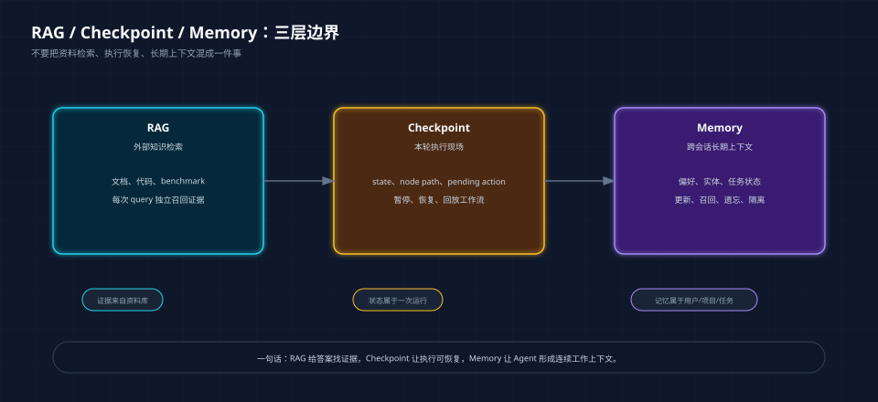
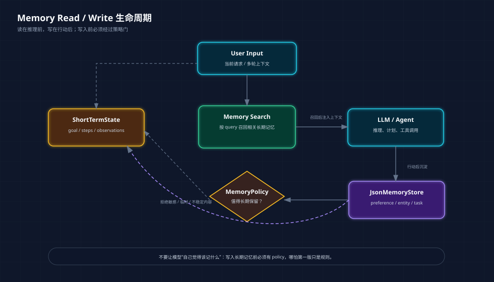
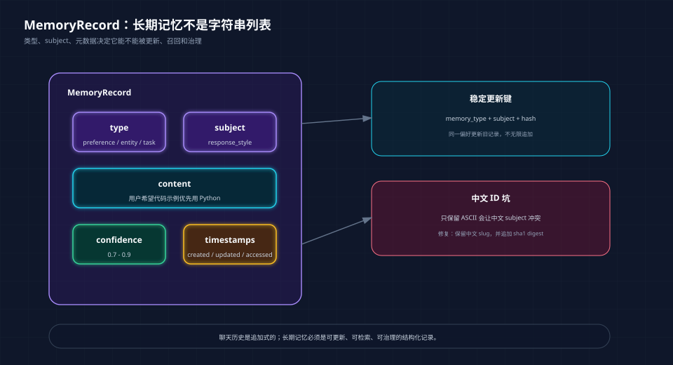
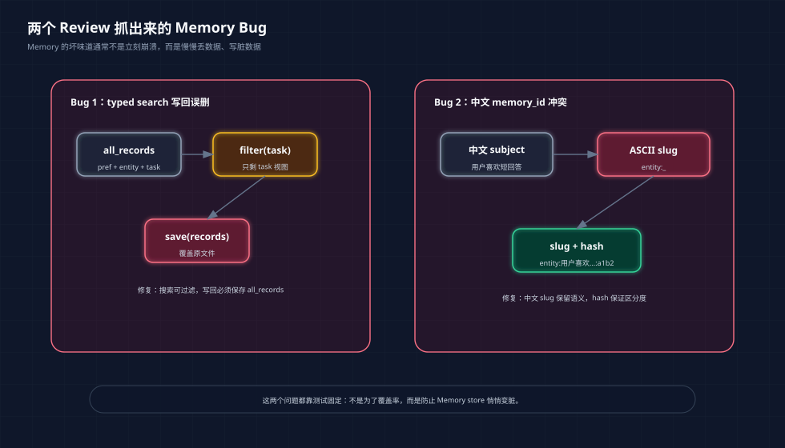

# Agent 记忆系统：为什么 RAG 不等于 Memory

> Phase4 第二篇主文。前面我们已经用 MCP Server 让 Agent 接上真实工具，这一篇处理另一个更容易被低估的问题：Agent 怎么跨会话记住该记的东西。
>
> 配套代码：`phase-4-advanced/03-memory-system/`
> 读者默认已经了解基础 RAG、LangGraph checkpoint，以及 Agent tool calling 的基本概念。

**TL;DR：** RAG、checkpoint、Memory 是三件不同的事。RAG 解决“资料从哪里来”，checkpoint 解决“这次执行怎么恢复”，Memory 解决“这个 Agent 和这个用户、项目、任务之间长期形成了什么上下文”。这次我没有直接上向量库，而是先做一个只有标准库依赖的小型 Memory 系统：它能区分短期状态和长期记忆，能按策略写入偏好、实体、任务状态，能更新旧记忆，也能用测试抓住中文 `memory_id` 冲突和 typed search 写回误删这类真实问题。

面试或者做方案评审时，Memory 经常会被一句话带过去：

```text
Agent 记忆不就是把历史对话丢进向量库吗？
```

我现在不太愿意这么讲。

因为这句话会把三个完全不同的问题混在一起：

| 问题 | 真正对应的系统能力 |
|------|--------------------|
| Agent 从哪里找资料？ | RAG |
| Agent 这次执行到哪了？ | checkpoint |
| Agent 下次还能不能延续用户、项目和任务上下文？ | Memory |

“把历史对话存起来，下次再取出来”这句话没错，但太粗了。

真正写代码时，很快会遇到一堆没那么“概念化”的问题：

```text
用户说“记住这个”，就一定要记吗？
一次工具调用失败，要不要长期记住？
用户偏好变了，是追加一条，还是覆盖旧的？
中文内容怎么生成稳定 memory_id？
按类型搜索记忆时，会不会误删其他记忆？
checkpoint 里保存的执行步骤，算不算长期记忆？
```

这些问题如果不拆开，Memory 最后会变成一个更隐蔽的上下文垃圾桶。短期有用，长期很脏。

这篇文章就围绕这次 Phase4 的小工程，把 Memory 从“听起来有记忆”拆成一套能跑、能测、能解释的代码结构。

读完这篇，至少应该能回答四个问题：

| 问题 | 本文给出的工程答案 |
|------|--------------------|
| Memory 和 RAG 的边界是什么？ | RAG 管外部证据，Memory 管跨会话上下文 |
| 什么信息可以写入长期记忆？ | 经过 `MemoryPolicy` 策略判断后的偏好、实体、任务状态 |
| 为什么不能直接保存所有聊天记录？ | 会把临时状态、敏感信息和过期偏好一起带进上下文 |
| 怎么证明 Memory 系统没有悄悄写脏或丢数据？ | 用单元测试约束写入、更新、召回、中文 ID 和 typed search 写回 |

***

## 一、先定边界：RAG、checkpoint、Memory 不要混在一起

Phase2 做 RAG benchmark 时，我们关心的是外部知识：

```text
给定一批 PDF / Markdown / 技术文档，系统能不能找到回答问题的证据？
```

所以那一阶段的关键词是：

```text
chunk
BM25
dense retrieval
hybrid search
rerank
Precision@K
Recall@K
Faithfulness
```

Phase3 做 LangGraph 和 Agentic RAG 时，我们关心的是工作流：

```text
检索质量不够怎么办？
答案不忠实怎么办？
系统什么时候 rewrite，什么时候 repair，什么时候 abstain？
```

所以那一阶段的关键词是：

```text
State
Node
Edge
conditional route
checkpoint
trace
```

现在进入 Memory，问题又变了。

Memory 关心的不是“资料库里有什么”，也不是“本轮执行到哪一步”，而是：

```text
Agent 和用户一起工作时，哪些上下文应该跨会话保留？
```

比如：

```text
以后回答问题时，代码示例尽量用 Python。
当前项目叫 ai-agent-learn。
Phase4 当前任务是实现 Agent Memory System。
上次已经完成 MCP Server 文章，但安全章节先后置。
```

这些信息不一定来自文档，也不一定适合切 chunk。它们更像 Agent 和用户之间逐渐形成的工作档案。

我现在更愿意用这张表来区分三者：

| 层次 | 解决的问题 | 典型内容 | 不该承担的职责 |
|------|------------|----------|----------------|
| RAG | 从外部知识库找证据 | 文档片段、代码片段、benchmark 报告 | 不应该保存用户偏好和任务状态 |
| Checkpoint | 保存一次 Agent 执行现场 | 当前 state、节点路径、pending action | 不应该直接等同于长期记忆 |
| Memory | 保存跨会话仍然有价值的上下文 | 偏好、实体、任务状态、历史决策 | 不应该存所有聊天记录和临时推理 |

这个边界一旦清楚，后面的代码就不会乱。



<center>图 1：RAG、Checkpoint、Memory 不是同义词，三者解决的是三类不同问题。</center>

***

## 二、这次 demo 要证明什么

这次的目标不是做一个“大而全”的 Memory 平台。

相反，我刻意把它做小，只用 Python 标准库和 JSON 文件。原因很简单：现在要学的是 Memory 生命周期，不是向量数据库调参。

这个 demo 要证明四件事：

```text
第一，短期状态和长期记忆可以分开。
第二，长期记忆要有类型、subject 和元数据。
第三，写入长期记忆必须经过策略判断。
第四，召回记忆时不能把整个历史都塞进 prompt。
```

代码结构也按这四件事拆：

```text
phase-4-advanced/03-memory-system/
├── short_term_state.py      # 本轮执行状态
├── long_term_memory.py      # 长期记忆模型、存储、召回
├── memory_policy.py         # 记忆写入策略
├── memory_agent_demo.py     # 带记忆的最小 Agent
└── tests/test_memory_system.py
```

如果按阅读顺序拆开看，可以这样读：

| 文件 | 先看什么 | 证明什么 |
|------|----------|----------|
| `short_term_state.py` | `ShortTermState.snapshot()` | 本轮执行状态不会自动变成长期记忆 |
| `long_term_memory.py` | `MemoryRecord`、`JsonMemoryStore.upsert()`、`search()` | 长期记忆必须可更新、可召回、可记录访问元数据 |
| `memory_policy.py` | `MemoryPolicy.extract()` | 写入长期记忆之前要先过策略门 |
| `memory_agent_demo.py` | `MemoryAwareAgent.reply()` | 读记忆、写记忆、生成回答三件事如何串起来 |
| `tests/test_memory_system.py` | 8 个单元测试 | 把中文、敏感信息、typed search 这类容易忽略的坑固化下来 |

整体链路是这样：



<center>图 2：读在推理前，写在行动后；写入长期记忆前必须经过策略门。</center>

这里最重要的不是 `JsonMemoryStore`，而是每一层的责任边界。

如果后面要升级，把 JSON 换成 SQLite、Postgres、Chroma，或者把规则写入策略换成 LLM extractor，整体结构也不用推翻。

***

## 三、短期状态：它更像 LangGraph checkpoint，不是 Memory

先看最小的文件：`short_term_state.py`。

```python
@dataclass
class ShortTermState:
    """Execution state for the current run, similar to what a checkpoint stores."""

    goal: str
    steps: list[str] = field(default_factory=list)
    observations: list[str] = field(default_factory=list)
    pending_actions: list[str] = field(default_factory=list)

    def snapshot(self) -> dict:
        return {
            "goal": self.goal,
            "steps": list(self.steps),
            "observations": list(self.observations),
            "pending_actions": list(self.pending_actions),
        }
```

它记录的是本轮执行现场：

```text
目标是什么？
走过哪些步骤？
观察到了什么？
还有哪些 pending action？
```

这些内容适合被 checkpoint 保存。

比如 LangGraph 里一个 Agentic RAG 跑到 `faithfulness_check` 节点时中断了，checkpoint 可以让它恢复执行；人类审批节点暂停后，checkpoint 可以让它继续往下走。

但 checkpoint 不是长期记忆。

原因很实际：一次 Agent 执行里会有很多临时信息。

```text
某次检索失败
某个中间 query rewrite
某个工具调用返回空
某个节点判断上下文不足
```

这些信息对复盘本轮执行有用，但不应该长期塑造 Agent 对用户的理解。

所以测试里专门写了一条：

```python
def test_short_term_state_tracks_execution_without_persisting_as_memory(self) -> None:
    state = ShortTermState(goal="学习 Agent Memory")

    state.add_step("理解短期状态和长期记忆的边界")
    state.add_observation("LangGraph checkpoint 更像执行状态，不等于长期记忆")
    snapshot = state.snapshot()

    self.assertNotIn("memories", snapshot)
```

这条测试看起来很小，但它把一个很重要的设计约束写死了：

```text
短期状态可以被恢复，但不会自动变成长期记忆。
```

很多系统一开始做 Memory，就是把 thread state 原样保存。短期看起来“有上下文”，长期会把临时状态和稳定事实混在一起，后面非常难清。

***

## 四、长期记忆：不要只存一段文本

长期记忆的核心模型在 `long_term_memory.py`。

```python
class MemoryType(str, Enum):
    PREFERENCE = "preference"
    ENTITY = "entity"
    TASK = "task"


@dataclass
class MemoryRecord:
    memory_type: MemoryType
    subject: str
    content: str
    confidence: float = 0.8
    source: str = "user_message"
    tags: list[str] = field(default_factory=list)
    memory_id: str | None = None
    created_at: str = field(default_factory=utc_now)
    updated_at: str = field(default_factory=utc_now)
    last_accessed_at: str | None = None
    access_count: int = 0
```

当前只做三类记忆：

| 类型 | 例子 | 作用 |
|------|------|------|
| `preference` | 以后回答我问题时，代码示例尽量用 Python | 改变回答风格 |
| `entity` | 用户当前项目叫 ai-agent-learn | 记住稳定实体 |
| `task` | Phase4 当前任务是实现 Agent Memory System | 跨会话恢复任务方向 |

为什么不直接存一个字符串列表？

因为字符串列表很快会回答不了这些问题：

```text
这条是偏好，还是事实？
这条是当前任务，还是历史任务？
新输入应该覆盖哪条旧记忆？
这条记忆多久没被使用了？
它来自用户明确表达，还是模型推断？
```

`memory_type` 和 `subject` 是更新旧记忆的关键。

比如用户先说：

```text
以后回答我问题时，代码示例尽量用 Python。
```

过几天又说：

```text
以后回答我问题时，代码示例优先用 TypeScript。
```

这不是两条并列记忆，而是同一个 subject 的更新：

```text
preference: response_style
```

测试里这样约束：

```python
store.upsert(first)
store.upsert(second)

memories = store.list_all()
self.assertEqual(len(memories), 1)
self.assertEqual(memories[0].subject, "response_style")
self.assertIn("TypeScript", memories[0].content)
```

这就是长期记忆和聊天历史最大的差别之一。

聊天历史是追加式的，Memory 应该是可更新的。



<center>图 3：长期记忆不是字符串列表，至少要能被更新、召回和治理。</center>

***

## 五、写入策略：MemoryPolicy 是第一道门

`memory_policy.py` 是这次最值得细看的文件。

它现在不是一个复杂模型，只是一组规则。但这组规则表达了一个重要原则：

```text
长期记忆必须经过写入策略，不能把用户输入原样全存。
```

当前它会识别三类正向信号。

第一类是稳定偏好：

```python
if "以后回答" in text and ("代码示例" in text or "示例" in text):
    return MemoryRecord(
        memory_type=MemoryType.PREFERENCE,
        subject="response_style",
        content=text,
        confidence=0.9,
        tags=["user_preference", "response_style", "code_example"],
    )
```

第二类是任务状态：

```python
phase_task = re.search(r"(Phase\d+)\s*当前任务是(.+?)(?:。|$)", text, re.IGNORECASE)
```

它能把：

```text
记住：Phase4 当前任务是实现 Agent Memory System。
```

转成：

```text
memory_type = task
subject = phase4_current_task
content = Phase4 当前任务是实现 Agent Memory System
```

第三类是实体信息：

```python
project_name = re.search(r"我的项目叫\s*([A-Za-z0-9_\-\u4e00-\u9fff]+)", text)
```

这里后来特意补了中文项目名支持。

因为真实中文项目里，用户不一定会说：

```text
我的项目叫 ai-agent-learn
```

也可能说：

```text
记住：我的项目叫 智能客服助手。
```

如果正则只支持 ASCII，MemoryPolicy 会退化成普通显式记忆，subject 也会变得不稳定。

这就是为什么测试里补了：

```python
entity = policy.extract("记住：我的项目叫 智能客服助手。")

self.assertEqual(entity.memory_type, MemoryType.ENTITY)
self.assertEqual(entity.subject, "project_name")
self.assertIn("智能客服助手", entity.content)
```

这类测试不是为了追求覆盖率好看，而是为了把中文场景写进系统行为。

***

## 六、不是所有“记住”都能记

Memory 系统还有一个危险点：用户说“记住”，系统就照单全收。

这在 demo 里也不应该这样做。

当前 `MemoryPolicy` 会拒绝明显敏感的信息：

```python
SENSITIVE_PATTERNS = [
    re.compile(r"\bapi[_ -]?key\b", re.IGNORECASE),
    re.compile(r"\btoken\b", re.IGNORECASE),
    re.compile(r"\bpassword\b", re.IGNORECASE),
    re.compile(r"\bsecret\b", re.IGNORECASE),
    re.compile(r"\bbearer\s+[a-z0-9._-]+", re.IGNORECASE),
    re.compile(r"\bAKIA[0-9A-Z]{16}\b"),
    re.compile(r"\bsk-[a-z0-9_-]+", re.IGNORECASE),
    re.compile(r"身份证"),
    re.compile(r"银行卡"),
    re.compile(r"密码"),
    re.compile(r"密钥"),
]
```

这里不是要把安全章节提前做完。

但长期记忆有一个底线：

```text
敏感信息不要写入长期存储。
```

这条规则也有测试：

```python
sensitive = policy.extract("记住我的 API key 是 sk-test-secret。")
chinese_secret = policy.extract("记住：我的高德地图密钥是 test-secret。")

self.assertIsNone(sensitive)
self.assertIsNone(chinese_secret)
```

这两个例子很贴近当前工程。

前面 MCP 阶段我们确实接过 Amap Maps MCP，也确实有 key。Agent 如果把这种信息写入长期记忆，后面每次召回都可能把风险带进上下文。

所以即使个人学习阶段先不系统做安全，Memory 写入策略也不能完全裸奔。

***

## 七、memory_id：中文项目里很容易踩的坑

一开始我用的是很直觉的 id：

```python
memory_id = f"{memory_type}:{normalized_subject}"
```

然后 `normalized_subject` 只保留 ASCII。

这在英文里没问题，但中文里很快出事。

比如：

```text
记住：用户喜欢短回答。
记住：项目使用向量数据库。
```

如果中文都被过滤掉，两条 subject 都可能变成：

```text
entity:_
```

结果第二条会覆盖第一条。

修复后的实现是中文 slug + hash：

```python
def make_memory_id(memory_type: MemoryType, subject: str) -> str:
    raw = subject.strip().lower()
    slug = re.sub(r"\s+", "_", raw)
    slug = re.sub(r"[^a-z0-9_:\-\u4e00-\u9fff]+", "_", slug).strip("_")
    slug = slug[:32] or "memory"
    digest = hashlib.sha1(raw.encode("utf-8")).hexdigest()[:10]
    return f"{memory_type.value}:{slug}:{digest}"
```

对应测试：

```python
first = policy.extract("记住：用户喜欢短回答。")
second = policy.extract("记住：项目使用向量数据库。")

store.upsert(first)
store.upsert(second)

memories = store.list_all()
self.assertEqual(len(memories), 2)
self.assertNotEqual(memories[0].memory_id, memories[1].memory_id)
```

这个细节很小，但它很“工程”。

如果后面要做中文知识库 Agent、中文办公 Agent、中文个人助手，这类问题迟早会遇到。与其等数据脏了再修，不如在 demo 阶段就把坑暴露出来。

***

## 八、召回策略：先不用向量库，也要讲清排序逻辑

这次没有上 embedding。

不是因为 embedding 不重要，而是因为现在要先看 Memory 的基本行为。

当前召回逻辑是轻量关键词打分：

```python
def _score(self, query: str, record: MemoryRecord) -> float:
    query_tokens = tokenize(query)
    text_tokens = tokenize(" ".join([record.subject, record.content, " ".join(record.tags)]))
    overlap = query_tokens & text_tokens
    if not overlap:
        return 0.0

    score = float(len(overlap))
    if record.memory_type == MemoryType.TASK:
        score += 0.2
        if "memory" in query_tokens or any(token.startswith("phase") for token in query_tokens):
            score += 1.5
    score += min(record.access_count, 3) * 0.05
    score += record.confidence * 0.1
    return score
```

这里有几个意图：

```text
和当前问题重合越多，越靠前。
任务状态在 Phase 学习问题里优先级更高。
被反复使用的记忆略微加权。
置信度更高的记忆略微加权。
```

测试里写了一个具体产品判断：

```python
results = store.search("Phase4 memory Python 示例", limit=2)

self.assertEqual(
    [item.subject for item in results],
    ["phase4_current_task", "response_style"],
)
```

为什么 `phase4_current_task` 要排在 `response_style` 前面？

因为用户问的是 Phase4 Memory 怎么学。这个问题首先需要当前任务上下文，其次才是回答风格偏好。

这也是 Memory 检索和普通 RAG 检索的差别之一。

RAG 常常只关心“哪段资料最能回答问题”。Memory 还要考虑：

```text
当前任务优先级
用户偏好的作用范围
实体信息是否相关
旧记忆是否还新鲜
```

后面如果接向量库，这些规则也不会消失。更合理的方向是 hybrid：

```text
语义召回 + 类型过滤 + subject 精确更新 + 时间/置信度加权
```

***

## 九、typed search 写回：一个很隐蔽的数据丢失 bug

这次 Review 里发现了一个比打分更重要的问题。



<center>图 4：Memory 的问题经常不是立刻报错，而是悄悄丢数据、写脏数据。</center>

最初 `search(memory_type=MemoryType.TASK)` 的逻辑大概是：

```text
读取所有记忆
过滤出 task 类型
搜索命中的 task
更新 access_count
把当前 records 写回文件
```

问题在最后一步。

如果 `records` 已经是过滤后的 task 列表，把它写回文件，就等于把 preference/entity 全删了。

这个 bug 不会在普通 search 里暴露，因为 `memory_type=None` 时 records 就是全量记录。只有 typed search 才会触发。

所以测试补了这条：

```python
store.search("Phase4 Memory", memory_type=MemoryType.TASK)

self.assertEqual(
    sorted(memory.memory_type for memory in store.list_all()),
    [MemoryType.ENTITY, MemoryType.PREFERENCE, MemoryType.TASK],
)
```

修复后的逻辑是：

```python
all_records = self._load()
records = [
    record
    for record in all_records
    if memory_type is None or record.memory_type == memory_type
]

self._save(all_records)  # Always save the full record set.
```

这个坑很值得写进文章。

因为 Memory store 不是普通搜索接口。搜索本身可能会修改元数据：

```text
last_accessed_at
access_count
```

只要搜索会写回，就必须非常小心“写回的是全量数据，还是过滤后的视图”。

***

## 十、把它串成一个最小 Agent

`memory_agent_demo.py` 把上面的东西串起来。

核心逻辑是：

```python
class MemoryAwareAgent:
    def reply(self, message: str) -> AgentReply:
        state = ShortTermState(goal="回答当前用户问题")
        state.add_step("解析用户输入")

        written = self.policy.extract(message)
        if written is not None:
            self.store.upsert(written)
            state.add_step("根据写入策略更新长期记忆")

        retrieved = self.store.search(message, limit=3)
        state.add_step("按当前问题召回相关长期记忆")
        answer = self._compose_answer(message, retrieved, written)
        state.add_observation("长期记忆只影响回答上下文，不保存本轮执行步骤")
```

运行：

```bash
python3 phase-4-advanced/03-memory-system/memory_agent_demo.py
```

第一轮输入：

```text
以后回答我问题时，代码示例尽量用 Python。
```

输出：

```text
已写入长期记忆：以后回答我问题时，代码示例尽量用 Python。
这类信息会跨会话保留；本轮推理步骤仍只放在短期状态里。
```

第二轮输入：

```text
我准备继续学习 Phase4 Memory，应该关注什么？
```

输出里会出现：

```text
回答风格：优先给 Python 代码示例。
建议关注三件事：长期记忆写入策略、相关记忆召回、记忆更新与冲突处理。
本次召回的长期记忆：
- 以后回答我问题时，代码示例尽量用 Python。
```

这个 demo 没有接真实 LLM。

这是有意为之。

如果一开始就接 LLM，模型生成能力会把很多工程问题盖住。它可能在没有召回记忆时也写得像“记得你”，也可能在写入策略不合理时靠语言补救。学习 Memory 时，先用确定性输出把生命周期看清楚，更有价值。

后面再把 `_compose_answer` 换成 LLM 调用，才知道哪些上下文是 Memory 系统真的提供的，哪些只是模型自己编得顺。

***

## 十一、测试不是附属品，是 Memory 的验收标准

当前测试有 8 个。它们不是“顺手补覆盖率”，而是在给 Memory 系统设边界：

| 测试关注点 | 防住的问题 |
|------------|------------|
| 稳定偏好可以写入长期记忆 | 用户明确偏好不能每次都丢 |
| 敏感内容不会写入长期记忆 | API key、密钥、密码不能进入长期上下文 |
| 中文项目实体可以被识别为 `project_name` | 中文项目名不能退化成不稳定 subject |
| 同一类偏好更新时覆盖旧记忆 | 偏好变化不能无限追加成上下文噪声 |
| 相关记忆召回顺序符合任务优先级 | 任务上下文应该比风格偏好更靠前 |
| typed search 不会误删其他类型记忆 | 过滤视图写回不能造成数据丢失 |
| 中文显式记忆不会共用同一个 `memory_id` | 中文 subject 不能互相覆盖 |
| Agent 后续回答会受到已召回记忆影响 | Memory 要真实影响回答，而不是只存在文件里 |

运行：

```bash
python3 -m unittest discover -s phase-4-advanced/03-memory-system/tests
```

当前结果：

```text
Ran 8 tests
OK
```

我觉得 Memory 系统尤其需要测试。

因为它的很多问题不是“立刻报错”，而是“慢慢变脏”：

```text
重复写入导致上下文膨胀
中文 id 冲突导致旧记忆被覆盖
typed search 写回导致其他记忆丢失
敏感信息进入长期存储
临时执行状态变成长期事实
```

这些问题如果只靠手动跑 demo，很难发现。

***

## 十二、这版还不是什么

这版代码还很克制。

它不是生产 Memory 系统，也不是完整个人助理。

当前还没有做：

| 能力 | 为什么后面需要 |
|------|----------------|
| LLM memory extractor | 规则无法覆盖复杂自然语言表达 |
| memory conflict resolver | 用户偏好、任务状态会变化，需要确认和版本管理 |
| decay / forgetting | 长期不用、低置信度记忆应该降权 |
| vector memory | 语义相似的旧记忆需要更好召回 |
| namespace | 多用户、多项目、多任务必须隔离 |
| audit trail | 需要知道某条记忆何时、因为什么被写入 |
| LangGraph integration | 记忆应该进入 query analysis / answer generation 等节点 |

但这版已经足够回答一个基础问题：

```text
Agent Memory 不是把历史对话塞进向量库。
```

一个能维护的 Memory 系统，至少要有：

```text
短期状态和长期记忆的边界
记忆类型
稳定 subject
写入策略
更新策略
召回策略
测试约束
```

下一步如果继续往下做，我会把它接到 LangGraph：

```text
query_analysis 前召回用户偏好和任务状态
answer_generation 时注入相关 memory
faithfulness / repair 时仍只依据 RAG context，不让 memory 变成事实来源
任务结束时由 memory_policy 决定是否写入新状态
```

这也是 Memory 和 Agentic RAG 真正合流的地方。

RAG 给答案找证据，Memory 给 Agent 保留工作上下文。两者都重要，但边界一定要清楚。

***

## 十三、参考了哪些文章和形式

这次重写时，我特意看了一些网上关于 Agent Memory 的文章。它们给我的启发不是“抄一套分类”，而是文章应该先给读者一个能抓住的心智模型，再用工程细节把模型落地。

对本文影响比较大的有几类：

| 参考方向 | 我吸收了什么 | 本文怎么落地 |
|----------|--------------|--------------|
| RAG vs Memory 对比 | RAG 更像 stateless retrieval，Memory 更像 stateful continuity | 第一节直接把 RAG、checkpoint、Memory 三层拆开 |
| Agent Memory 架构文章 | 短期记忆、长期记忆、写入策略、召回策略要分层讲 | 第二节到第八节按代码结构逐层展开 |
| LangGraph 官方文档 | checkpoint 保存 graph state，store 才适合跨 thread 的长期信息 | 第三节解释为什么 checkpoint 不是长期记忆 |
| 长期记忆工程文章 | read-before-reasoning、write-after-acting 是常见结构 | 第二节的生命周期图和第十节的 demo 按这个节奏组织 |
| 宝玉文章配图方法 | 图应该承担解释结构的职责，不是插几张装饰图 | 这版新增 4 张暗色信息图，分别对应边界、生命周期、数据模型和 bug 复盘 |

具体参考：

- [RAG vs Memory | Graphlit](https://www.graphlit.com/glossary/rag-vs-memory)
- [Agent Memory Systems: Building Long-Term Context for AI | Improving](https://www.improving.com/thoughts/building-agent-memory-systems/)
- [Long-Term Memory Architectures for AI Agents | Redis](https://redis.io/blog/long-term-memory-architectures-ai-agents/)
- [LangGraph Persistence 文档](https://docs.langchain.com/oss/python/langgraph/persistence)
- [LangChain Long-term memory 文档](https://docs.langchain.com/oss/python/langchain/long-term-memory)
- [宝玉的分享](https://baoyu.ai/)
