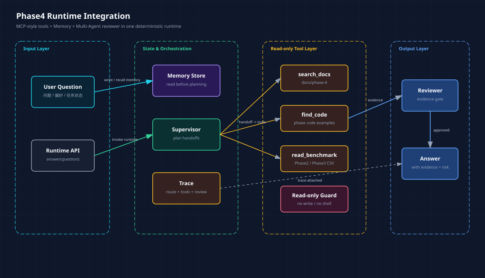
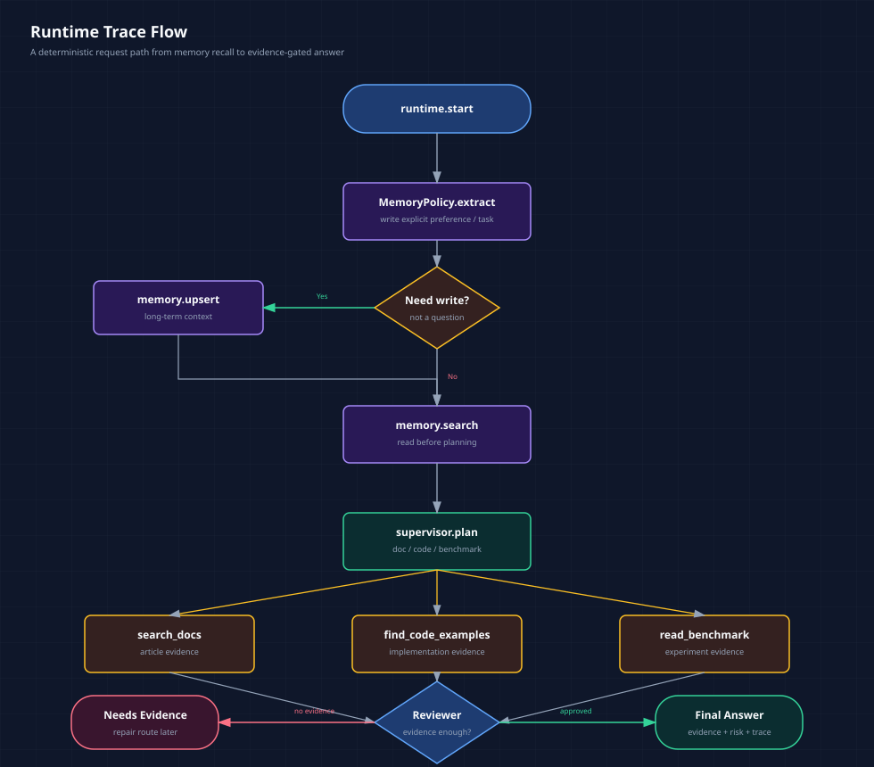

# Phase4 收口：把 MCP、Memory 和 Multi-Agent 串成一个 Runtime

> Phase4 收口篇。前面已经分别完成 MCP Server、Agent Memory System、多 Agent Patterns。现在要回答一个更工程化的问题：这些能力各自跑通以后，怎么放进同一个 Agent 运行链路里？
>
> 配套代码：`phase-4-advanced/05-agent-runtime-integration/`
> 读者默认已经了解 Phase3 的 Agentic RAG，以及 Phase4 前三篇的 MCP、Memory、多 Agent 基础。

**TL;DR：** Phase4 的最后一步不是再学一个新框架，而是把已经学过的能力合成一个最小 runtime：用户问题进来后，先读写长期记忆，再由 supervisor 规划 handoff，然后调用只读 project tools 查文档、代码和 benchmark，最后由 reviewer 做 evidence gate，并输出 trace。这个 runtime 仍然是确定性的，不接真实 LLM，但它证明了一件事：企业级 Agent 不是一个 prompt，而是一组可以组合、测试和复盘的工程模块。

如果只看前面几篇，Phase4 已经有不少东西：

```text
MCP Server：Agent 怎么访问 docs、code、benchmark。
Memory System：Agent 怎么跨会话保存偏好、实体和任务状态。
Multi-Agent Patterns：Agent 怎么拆分职责、handoff 和 review。
```

但这还不够。

因为真实系统里，用户不会分三次问：

```text
先帮我查文档。
再帮我回忆偏好。
最后帮我让 reviewer 审一下。
```

用户只会问一句：

```text
请结合 Phase4 Memory 的代码、文章和测试证据，说明是否可以进入 Phase5。
```

这句话同时需要：

| 需要什么 | 对应 Phase4 能力 |
|----------|------------------|
| 记住用户回答偏好 | Memory |
| 找 Phase4 文章 | MCP-style docs tool |
| 找 Memory 代码 | MCP-style code tool |
| 读取 Phase3 benchmark | MCP-style benchmark tool |
| 判断证据够不够 | Reviewer |
| 复盘整个路径 | Trace |

所以 Phase4 最后一块，就是把这些能力串成一个 runtime。

***

## 一、为什么要做收口集成

前面每一块单独看都成立，但单独成立不代表系统成立。

比如 MCP Server 能搜文档，但它不知道用户偏好。

Memory 能记住“以后代码示例用 Python”，但它不会自己决定要不要查代码。

Multi-Agent 能拆文档、代码、测试几个 specialist，但如果没有工具证据，reviewer 也只能审一段空话。

这就是集成层的价值。

它要回答的问题不是“某个模块能不能跑”，而是：

```text
一次 Agent 请求里，状态、工具、协作和审查怎么排顺序？
```

这次新增的目录是：

```text
phase-4-advanced/05-agent-runtime-integration/
├── project_tools.py              # Python 版 MCP-style 只读工具
├── runtime.py                    # 集成 Memory、tools、multi-agent review
├── runtime_demo.py               # 可运行 demo
├── README.md
└── tests/test_runtime_integration.py
```

这不是要替代前面的 TypeScript MCP Server。

`01-mcp-server` 是真实 MCP 协议实现，解决 Host / Client / Server / Tool schema 的问题。

`05-agent-runtime-integration` 是 Python 学习 runtime，解决 Agent 内部怎么组织这些能力的问题。

两者关注点不同。

***

## 二、整体架构：五个模块，一条链路

先看图。



<center>图 1：Phase4 收口 runtime，把 Memory、Supervisor、只读工具、Reviewer 和 Trace 放进同一条链路。</center>

这条链路里，每个模块只做一件事：

| 模块 | 职责 | 代码位置 |
|------|------|----------|
| `MemoryPolicy` / `JsonMemoryStore` | 判断是否写入长期记忆，召回相关上下文 | `phase-4-advanced/03-memory-system/` |
| `MultiAgentSupervisor` | 根据问题生成 handoff 计划 | `phase-4-advanced/04-multi-agent-patterns/supervisor.py` |
| `ProjectToolset` | 只读搜索文档、代码、benchmark | `phase-4-advanced/05-agent-runtime-integration/project_tools.py` |
| `ReviewerAgent` | 检查答案是否有 evidence | `phase-4-advanced/04-multi-agent-patterns/supervisor.py` |
| `IntegratedAgentRuntime` | 串联上述模块并输出 trace | `phase-4-advanced/05-agent-runtime-integration/runtime.py` |

我刻意没有把它做成一个“聪明的大类”。

runtime 的职责只是编排：

```text
read/write memory
plan handoffs
call tools
collect evidence
review answer
return trace
```

每一步都应该能单独测试。

***

## 三、ProjectToolset：不是 MCP Server，但保留 MCP 的边界感

`project_tools.py` 做了三个工具：

```python
tools.search_docs("Agent Memory", phase="phase-4")
tools.find_code_examples("MemoryPolicy", phase="phase-4")
tools.read_benchmark_summary("phase-3")
```

它们对应 `01-mcp-server` 里的三个核心工具：

| Python 集成工具 | MCP Server 工具 | 作用 |
|-----------------|-----------------|------|
| `search_docs` | `search_docs` | 搜索学习文章 |
| `find_code_examples` | `find_code_examples` | 搜索示例代码 |
| `read_benchmark_summary` | `read_benchmark_summary` | 读取 benchmark 汇总 |

为什么不直接在 Python 里调用 TS MCP Server？

因为这一阶段要学的是 runtime 组织方式，不是跨进程 MCP client。真正的 MCP client 可以留到 Phase5 或 Capstone。

但边界必须保留：

```python
class ProjectToolset:
    """Read-only project tools mirroring the Phase4 MCP Server learning surface."""

    def search_docs(self, query: str, phase: str | None = None, limit: int = 5) -> SearchResult:
        ...

    def find_code_examples(self, query: str, phase: str | None = None, limit: int = 5) -> SearchResult:
        ...

    def read_benchmark_summary(self, phase: str | None = None) -> BenchmarkResult:
        ...
```

这三个工具仍然只读：

```text
不写文件
不执行 shell
不访问工程外路径
不返回 node_modules / dist / __pycache__
```

测试里也约束了空 query：

```python
with self.assertRaisesRegex(ValueError, "query must not be empty"):
    tools.search_docs("   ")
```

这点很重要。

MCP 的价值不只是“工具统一接入”，还包括工具边界可以被描述、测试和治理。

即使这里暂时不是完整 MCP 协议，也不应该把工具写成无边界的文件读取器。

***

## 四、Runtime：一次请求的执行顺序

核心代码在 `runtime.py`。

它的入口只有一个：

```python
result = runtime.answer(question)
```

内部顺序是：

```python
written_memory = self.memory_policy.extract(question)
if written_memory is not None:
    self.memory_store.upsert(written_memory)
    trace.append("memory.upsert")

memory_context = self.memory_store.search(question, limit=3)
trace.append("memory.search")

plan = self.supervisor.plan(question)
trace.append("supervisor.plan")

for packet in plan.handoffs:
    execution = self._run_tool_for_handoff(packet.target, question)
    trace.append(f"tool.{execution.tool_name}")

review = self.reviewer.review(answer, evidence)
trace.append("reviewer.review")
```

这段代码看起来不复杂，但顺序很关键。

Memory 要在 planning 前读。

因为 supervisor 规划时应该知道用户偏好、当前任务、项目上下文。

Tool 要在 reviewer 前跑。

因为 reviewer 不是润色答案，而是检查 evidence 是否足够。

Trace 要贯穿全程。

因为没有 trace 的 Agent，很难复盘“为什么它会这么回答”。

执行流可以画成这样：



<center>图 2：一次请求从 memory recall 到 reviewer gate 的完整路径。</center>

***

## 五、Handoff 到 Tool：不要让 specialist 空手分析

`MultiAgentSupervisor` 会根据问题生成 handoff。

比如这个问题：

```text
请结合 Phase4 Memory 的代码、文章和测试证据，说明是否可以进入 Phase5。
```

会触发三个 specialist：

```text
DocResearchAgent
CodeAnalysisAgent
BenchmarkAgent
```

在 `05-agent-runtime-integration` 里，每个 handoff 会进一步映射到一个只读工具：

```python
if target == AgentRole.DOC_RESEARCHER:
    result = self.tools.search_docs(query="Agent Memory", phase="phase-4", limit=5)

if target == AgentRole.CODE_ANALYST:
    result = self.tools.find_code_examples(query="MemoryPolicy", phase="phase-4", limit=5)

if target == AgentRole.BENCHMARK_AGENT:
    result = self.tools.read_benchmark_summary("phase-3")
```

这一步解决了一个多 Agent demo 里常见的问题：

```text
角色说得很像专家，但没有真实证据来源。
```

在这个 runtime 里，specialist 不再只是“发表意见”，而是必须和工具证据一起进入 reviewer。

demo 里实际拿到的 evidence 包括：

```text
docs/phase-4/03-agent-memory-system.md
phase-4-advanced/03-memory-system/memory_policy.py
phase-4-advanced/03-memory-system/tests/test_memory_system.py
phase-3-frameworks/02-agentic-rag-langgraph/outputs/agentic_rag_summary.csv
```

这就是回答能被 reviewer 放行的原因。

***

## 六、跑一次 Demo

运行：

```bash
PYTHONDONTWRITEBYTECODE=1 python3 phase-4-advanced/05-agent-runtime-integration/runtime_demo.py
```

demo 先写入一条长期偏好：

```text
以后回答我问题时，代码示例尽量用 Python。
```

然后回答默认问题：

```text
请结合 Phase4 Memory 的代码、文章和测试证据，说明是否可以进入 Phase5
```

实际输出里有几块关键信息。

第一，Memory 被召回：

```text
长期记忆上下文：
- [preference] 以后回答我问题时，代码示例尽量用 Python。
```

第二，工具被调用：

```text
- search_docs: search_docs(Agent Memory) returned 5 hits
- find_code_examples: find_code_examples(MemoryPolicy) returned 5 hits
- read_benchmark_summary: read_benchmark_summary(phase-3) returned 2 rows
```

第三，reviewer 通过：

```text
status=approved, score=0.95
- 结论包含证据和边界说明，可以通过。
```

第四，trace 是完整的：

```text
runtime.start
memory.search
supervisor.plan
handoff.doc_researcher
tool.search_docs
specialist.doc_researcher.report
handoff.code_analyst
tool.find_code_examples
specialist.code_analyst.report
handoff.benchmark_agent
tool.read_benchmark_summary
specialist.benchmark_agent.report
reviewer.review
```

这条 trace 比最终答案更重要。

它证明当前回答不是一个黑盒模型“想了想”，而是明确经过：

```text
记忆召回 -> 任务拆分 -> 工具取证 -> specialist 报告 -> reviewer 审查
```

这才是 Phase4 收口要拿到的东西。

***

## 七、测试里抓到一个真实的 Memory bug

这次做集成测试时，顺手抓到一个 MemoryPolicy 的问题。

测试是这样写的：

```python
write_result = runtime.answer("记住：Phase4 当前任务是准备 Phase5 Production。")
follow_up = runtime.answer("Phase4 当前任务是什么？")

self.assertIsNotNone(write_result.written_memory)
self.assertTrue(any("Phase5 Production" in memory.content for memory in follow_up.memory_context))
```

第一次运行时，这条测试失败了。

原因不是 runtime 没读记忆，而是 `MemoryPolicy` 把这句疑问句：

```text
Phase4 当前任务是什么？
```

误识别成新的 task memory，覆盖了原来的：

```text
Phase4 当前任务是准备 Phase5 Production
```

这很典型。

Memory bug 很多时候不是立刻报错，而是“悄悄把长期上下文写脏”。

修复方式也很小：

```python
phase_task = re.search(r"(Phase\d+)\s*当前任务是(.+?)(?:。|$)", text, re.IGNORECASE)
if phase_task:
    if "?" in text or "？" in text:
        return None
```

同时补了单元测试：

```python
def test_policy_does_not_store_task_questions_as_task_state(self) -> None:
    policy = MemoryPolicy()

    task_question = policy.extract("Phase4 当前任务是什么？")

    self.assertIsNone(task_question)
```

这也是集成测试的价值。

单模块测试能证明“功能按预期工作”，集成测试会逼出“模块组合后产生的新问题”。

***

## 八、当前测试覆盖了什么

新增的集成测试有四个：

| 测试 | 证明什么 |
|------|----------|
| `test_project_tools_search_docs_and_code_examples` | 只读工具能找到 Phase4 文章和 MemoryPolicy 代码 |
| `test_project_tools_reject_empty_query` | 工具层不会接受空 query |
| `test_runtime_reads_memory_calls_tools_and_reviews_evidence` | runtime 能读 memory、调工具、收集 evidence、通过 reviewer |
| `test_runtime_writes_explicit_task_memory_before_answering` | task memory 可以跨请求恢复，疑问句不会覆盖旧记忆 |

运行：

```bash
PYTHONDONTWRITEBYTECODE=1 python3 -m unittest discover -s phase-4-advanced/05-agent-runtime-integration/tests
```

当前结果：

```text
Ran 4 tests
OK
```

同时 Memory 的测试从 8 个变成 9 个：

```text
Ran 9 tests
OK
```

这说明 Phase4 的收口不是“再写一篇总结”，而是把前面模块组合后真实跑了一遍，并且通过测试发现了一个策略边界问题。

***

## 九、这版还不是生产 Agent

这版 runtime 仍然很克制。

它没有做：

| 没做什么 | 为什么后面再做 |
|----------|----------------|
| 真实 LLM tool calling | Phase4 收口先验证链路，模型自主调用放到 Phase5 / Capstone |
| 真实 MCP stdio client | 已经在 `01-mcp-server` 学过协议，这里先做 runtime 组织方式 |
| 写文件工具 | 个人学习阶段先保持只读，避免权限边界失控 |
| LangGraph 状态图 | 当前先用确定性 Python，看清楚模块关系 |
| FastAPI 服务化 | Phase5 再把 runtime 包成服务 |
| Langfuse / tracing 后端 | Phase5 进入可观测性后再接 |

这些不是缺陷，而是阶段边界。

Phase4 收口要证明的是：

```text
Agent 的工具、记忆、分工和审查可以组成一个清楚的 runtime。
```

不是要提前把 Phase5 和 Phase6 都做完。

***

## 十、进入 Phase5 前，真正准备好了什么

做完这个集成层后，Phase4 的几条线终于接上了：

```text
MCP：工具怎么暴露
Memory：上下文怎么延续
Multi-Agent：职责怎么拆分
Reviewer：结论怎么验收
Trace：过程怎么复盘
```

这时进入 Phase5，会更自然。

Phase5 不应该只是“写一个 FastAPI 包一下”。

它应该围绕这个 runtime 继续生产化：

```text
把 IntegratedAgentRuntime 包成 API
把 trace 写入日志或 Langfuse
把 memory store 从 JSON 升级为 SQLite / Postgres
把 ProjectToolset 换成真正 MCP client
加请求级超时、错误码、配置和测试
为后续 Web UI 提供稳定接口
```

也就是说，Phase5 的重点不是再造 Agent，而是把 Agent runtime 变成一个服务。

到这里，Phase4 可以认为完成了一个重要转折：

```text
从“我知道 MCP / Memory / Multi-Agent 是什么”
升级到
“我能把它们放进一条可运行、可测试、可审查的 Agent 链路里”
```

这才是进入生产化阶段前真正需要的准备。
